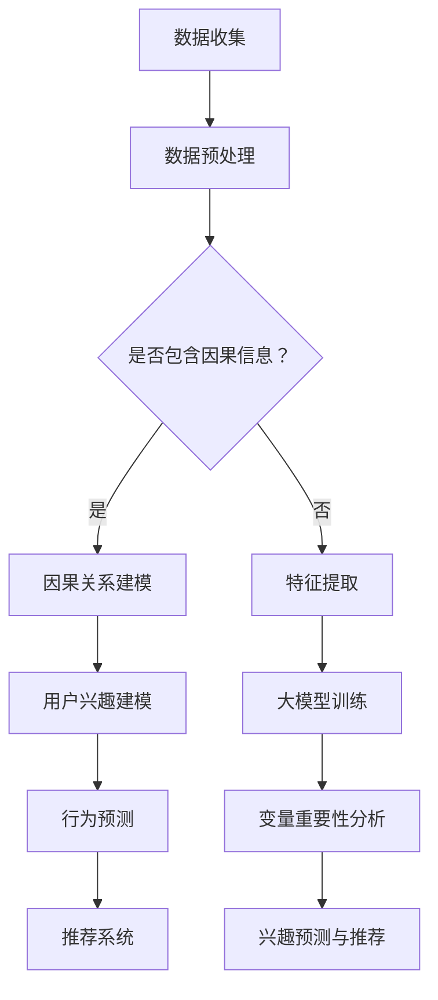

                 

# 大模型在推荐系统中的因果推理应用

## 概述

### 关键词：大模型，推荐系统，因果推理，深度学习

在当今数据驱动的互联网时代，推荐系统已经成为各个平台的核心功能之一。从购物网站到社交媒体，推荐系统能够根据用户的兴趣和行为，提供个性化的内容，从而提升用户体验和平台粘性。然而，传统的推荐系统往往依赖于统计方法和关联规则，难以捕捉用户行为背后的因果关系。随着深度学习的兴起，大模型逐渐成为推荐系统的热门工具。本文将探讨大模型在推荐系统中的因果推理应用，旨在为研究人员和开发者提供一些实用的技术和思路。

## 摘要

本文首先介绍了推荐系统的基本概念和传统方法，然后引出了因果推理在大模型中的重要性。接下来，本文详细介绍了大模型在推荐系统中的核心算法原理，包括基于深度神经网络的模型架构和具体的操作步骤。此外，本文还通过数学模型和公式，对算法进行了详细讲解，并通过实际项目案例进行了说明。最后，本文分析了大模型在推荐系统中的应用场景，并推荐了一些相关的学习资源和开发工具。

## 背景介绍

### 推荐系统简介

推荐系统是一种通过分析用户行为和偏好，向用户提供个性化内容的技术。其核心目标是提高用户满意度、提升平台活跃度和增加商业收益。推荐系统通常基于两种方法：基于内容的推荐和协同过滤。

- **基于内容的推荐**：该方法通过分析用户的历史行为和偏好，提取用户的兴趣特征，然后根据这些特征推荐相似的内容。例如，一个用户喜欢看科幻电影，系统会推荐其他科幻电影。

- **协同过滤**：该方法通过分析用户之间的行为模式，发现相似用户，然后根据相似用户的行为推荐内容。例如，如果一个用户喜欢了某个产品，那么系统会推荐其他用户也喜欢的类似产品。

尽管推荐系统在实践中取得了显著的成效，但其仍然存在一些局限性。传统方法主要依赖于用户历史数据和统计模型，难以捕捉用户行为背后的因果关系。例如，用户为什么会对某个内容产生兴趣？这种兴趣是如何影响他们后续行为的？这些问题对于提高推荐系统的准确性和解释性具有重要意义。

### 大模型简介

大模型，特别是基于深度学习的模型，近年来在自然语言处理、计算机视觉等领域取得了巨大的成功。大模型具有以下几个特点：

- **大规模参数**：大模型通常包含数百万甚至数十亿个参数，能够捕获复杂的数据特征和关系。
- **多层神经网络**：大模型通常由多层神经网络组成，能够通过逐层抽象，从原始数据中提取高层次的语义信息。
- **端到端学习**：大模型能够直接从原始数据中学习，无需繁琐的特征工程。

大模型的这些特点使其在推荐系统中具有巨大的潜力。首先，大模型可以通过学习用户的历史行为和内容特征，自动提取用户兴趣的潜在表示，从而提高推荐系统的准确性和个性

## 核心概念与联系

### 推荐系统中的因果推理

因果推理是推荐系统中一个重要的研究方向，其目标是通过分析用户行为，找出影响用户兴趣和行为的关键因素。与传统的关联规则和统计方法不同，因果推理能够提供更深入的洞察，有助于提高推荐系统的解释性和可靠性。

在推荐系统中，因果推理的应用场景主要包括：

- **用户兴趣建模**：通过分析用户的历史行为，如浏览、点击、购买等，找出影响用户兴趣的关键因素，从而建立个性化的用户兴趣模型。
- **行为预测**：根据用户的兴趣和行为模式，预测用户未来可能感兴趣的内容，从而提供更准确的推荐。
- **解释性增强**：因果推理能够提供关于推荐结果的原因和依据，提高推荐系统的透明度和用户信任度。

### 大模型在因果推理中的应用

大模型在推荐系统中的因果推理应用主要体现在以下几个方面：

- **模型架构**：大模型通常采用多层神经网络架构，能够通过逐层抽象和特征提取，捕捉用户行为和兴趣的复杂关系。
- **端到端学习**：大模型能够直接从原始数据中学习，无需繁琐的特征工程，从而简化了因果推理的实现过程。
- **变量重要性分析**：大模型可以通过神经网络结构，分析各个变量对用户兴趣和行为的影响程度，从而提供因果推理的依据。

### Mermaid 流程图

下面是一个简化的 Mermaid 流程图，展示了大模型在推荐系统中的因果推理过程：



在这个流程图中，数据收集阶段获取用户的历史行为数据，数据预处理阶段对数据进行清洗和标准化。如果数据中已经包含了因果信息，则直接进入因果关系建模阶段；否则，通过特征提取阶段获取用户兴趣和行为的相关特征。接下来，大模型进行训练，并通过变量重要性分析阶段分析各个特征的影响程度。最终，基于用户兴趣和行为预测，推荐系统生成个性化的推荐结果。

## 核心算法原理 & 具体操作步骤

### 大模型架构

在推荐系统中，大模型通常采用基于深度神经网络的架构，包括输入层、隐藏层和输出层。输入层接收用户的历史行为数据和内容特征，隐藏层通过多层神经网络进行特征提取和关系建模，输出层生成用户兴趣和行为预测。

#### 输入层

输入层接收用户的历史行为数据和内容特征。具体来说，用户的历史行为数据包括浏览记录、点击记录、购买记录等，而内容特征包括文本特征、图像特征等。例如，对于一个电商平台的推荐系统，输入层可能包括以下特征：

- 用户ID
- 商品ID
- 用户购买历史（如购买时间、购买金额等）
- 商品文本描述
- 商品图像特征

#### 隐藏层

隐藏层通过多层神经网络进行特征提取和关系建模。在隐藏层中，每个神经元都对应一个特征，通过激活函数（如ReLU、Sigmoid等）进行非线性变换，从而提取用户行为和内容特征之间的复杂关系。例如，一个典型的神经网络结构可能包括以下隐藏层：

- **嵌入层**：将用户ID和商品ID转换为高维向量，从而表示用户和商品的特征。
- **卷积层**：用于提取商品图像的特征，例如使用卷积神经网络（CNN）对图像进行特征提取。
- **全连接层**：将嵌入层和卷积层的特征进行融合，从而形成一个高层次的语义特征。

#### 输出层

输出层生成用户兴趣和行为预测。具体来说，输出层可能包括以下两个部分：

- **兴趣预测**：输出一个概率分布，表示用户对每个商品的兴趣程度。
- **行为预测**：输出一个二元分类结果，表示用户是否会对某个商品产生购买行为。

### 具体操作步骤

以下是使用大模型进行推荐系统的因果推理的具体操作步骤：

#### 步骤1：数据收集

收集用户的历史行为数据（如浏览记录、点击记录、购买记录等）和内容特征（如商品文本描述、商品图像特征等）。

#### 步骤2：数据预处理

对用户行为数据进行清洗和标准化，如去除缺失值、异常值等。对内容特征进行预处理，如文本向量化、图像特征提取等。

#### 步骤3：特征提取

使用嵌入层将用户ID和商品ID转换为高维向量，从而表示用户和商品的特征。使用卷积层提取商品图像的特征。

#### 步骤4：大模型训练

构建多层神经网络，包括嵌入层、卷积层和全连接层，通过反向传播算法进行训练。训练过程中，使用用户兴趣和行为数据作为标签，优化网络参数，从而提高预测准确性。

#### 步骤5：变量重要性分析

通过分析神经网络结构，分析各个变量（如用户ID、商品ID、购买历史等）对用户兴趣和行为的影响程度。可以使用梯度分析、节点重要性分析等方法，评估变量的重要性。

#### 步骤6：兴趣预测与推荐

使用训练好的大模型进行兴趣预测，输出用户对每个商品的兴趣程度。根据兴趣预测结果，生成个性化的推荐结果，推荐给用户。

### 代码示例

以下是一个简化的 Python 代码示例，展示了如何使用 PyTorch 构建和训练一个基于深度神经网络的推荐系统模型：

```python
import torch
import torch.nn as nn
import torch.optim as optim

# 定义模型
class RecommendationModel(nn.Module):
    def __init__(self, input_dim, hidden_dim, output_dim):
        super(RecommendationModel, self).__init__()
        self.embedding = nn.Embedding(input_dim, hidden_dim)
        self.cnn = nn.Conv2d(1, hidden_dim, kernel_size=3)
        self.fc = nn.Linear(hidden_dim, output_dim)

    def forward(self, user_ids, item_ids, item_images):
        user_embedding = self.embedding(user_ids)
        item_embedding = self.embedding(item_ids)
        item_image_embedding = self.cnn(item_images)
        combined_embedding = torch.cat((user_embedding, item_embedding, item_image_embedding), 1)
        output = self.fc(combined_embedding)
        return output

# 初始化模型、优化器和损失函数
model = RecommendationModel(input_dim=1000, hidden_dim=128, output_dim=10)
optimizer = optim.Adam(model.parameters(), lr=0.001)
criterion = nn.CrossEntropyLoss()

# 训练模型
for epoch in range(num_epochs):
    for user_ids, item_ids, item_images, labels in train_loader:
        optimizer.zero_grad()
        outputs = model(user_ids, item_ids, item_images)
        loss = criterion(outputs, labels)
        loss.backward()
        optimizer.step()

# 预测兴趣和推荐
with torch.no_grad():
    user_interests = model(user_ids, item_ids, item_images)

# 输出推荐结果
for user_id, interest in enumerate(user_interests):
    recommended_items = torch.topk(interest, k=5)
    print(f"User {user_id} recommended items: {recommended_items}")
```

在这个示例中，`RecommendationModel` 类定义了一个基于深度神经网络的推荐系统模型，包括嵌入层、卷积层和全连接层。训练过程中，使用用户ID、商品ID和商品图像作为输入，生成用户对每个商品的兴趣程度。最后，根据兴趣预测结果，输出个性化的推荐结果。

## 数学模型和公式 & 详细讲解 & 举例说明

### 数学模型

在推荐系统中，大模型的数学模型主要包括输入层、隐藏层和输出层。以下是各个层次的主要数学公式和计算方法：

#### 输入层

输入层的主要任务是接收用户的历史行为数据和内容特征，并将其转换为高维向量。具体公式如下：

\[ \text{input\_vector} = \text{Embedding}(\text{user\_id}, \text{item\_id}, \text{item\_images}) \]

其中，`Embedding` 函数用于将用户ID和商品ID映射为高维向量，通常使用嵌入层（Embedding Layer）实现。对于商品图像特征，可以使用卷积神经网络（CNN）进行特征提取。

#### 隐藏层

隐藏层的主要任务是通过对输入层的高维向量进行非线性变换，提取用户行为和内容特征之间的复杂关系。具体公式如下：

\[ \text{hidden\_vector} = \text{激活函数}(\text{W} \cdot \text{input\_vector} + \text{b}) \]

其中，`激活函数`（如ReLU、Sigmoid等）用于引入非线性，`W` 和 `b` 分别为权重和偏置。

隐藏层通常由多层组成，每层之间的计算方式相同，从而实现特征逐层抽象和融合。例如，一个简单的多层感知机（MLP）结构如下：

\[ \text{hidden}_1 = \text{激活函数}(\text{W}_1 \cdot \text{input}_vector + \text{b}_1) \]
\[ \text{hidden}_2 = \text{激活函数}(\text{W}_2 \cdot \text{hidden}_1 + \text{b}_2) \]

#### 输出层

输出层的主要任务是生成用户兴趣和行为预测。具体公式如下：

\[ \text{output} = \text{激活函数}(\text{W}_3 \cdot \text{hidden}_2 + \text{b}_3) \]

其中，`激活函数`（如Softmax、Sigmoid等）用于将隐藏层输出转换为概率分布或分类结果。例如，对于多类别分类任务，可以使用Softmax函数将输出层输出转换为概率分布：

\[ P(\text{item}_i | \text{user}_j) = \frac{e^{\text{output}_i}}{\sum_{k=1}^{K} e^{\text{output}_k}} \]

其中，\(P(\text{item}_i | \text{user}_j)\) 表示用户 \(j\) 对商品 \(i\) 的兴趣概率。

### 详细讲解

#### 激活函数

在深度神经网络中，激活函数是一个关键组件，它决定了神经网络的非线性特性。常见的激活函数包括ReLU、Sigmoid和Softmax：

- **ReLU（Rectified Linear Unit）**：ReLU函数是一个简单的线性函数，对于输入大于0的值，输出等于输入；对于输入小于等于0的值，输出等于0。ReLU函数的优点是可以避免神经元死亡，提高训练速度。

  \[ \text{ReLU}(x) = \max(0, x) \]

- **Sigmoid**：Sigmoid函数是一个非线性函数，将输入值映射到区间（0，1）。Sigmoid函数常用于二分类问题，输出表示概率。

  \[ \text{Sigmoid}(x) = \frac{1}{1 + e^{-x}} \]

- **Softmax**：Softmax函数是一个归一化函数，将多个数的和转化为概率分布。在多类别分类问题中，Softmax函数用于将输出层输出转换为概率分布。

  \[ \text{Softmax}(x)_i = \frac{e^{x_i}}{\sum_{j=1}^{K} e^{x_j}} \]

#### 嵌入层

嵌入层（Embedding Layer）是一个用于将离散值映射为高维向量的线性变换层。在推荐系统中，嵌入层用于将用户ID和商品ID映射为向量。具体实现如下：

\[ \text{Embedding}(\text{input}) = \text{W} \cdot \text{input} + \text{b} \]

其中，`W` 和 `b` 分别为嵌入层的权重和偏置，`input` 为输入的用户ID或商品ID。

#### 卷积神经网络（CNN）

卷积神经网络（CNN）是一个强大的特征提取工具，特别适用于图像数据处理。在推荐系统中，CNN可以用于提取商品图像的特征。具体实现如下：

\[ \text{Conv2d}(\text{input}, \text{filter}, \text{kernel\_size}) = \text{W} \cdot \text{input} + \text{b} \]

其中，`input` 为输入的商品图像，`filter` 为卷积核，`kernel_size` 为卷积核的大小。`W` 和 `b` 分别为卷积层的权重和偏置。

### 举例说明

假设我们有一个推荐系统，包含1000个用户和1000个商品。用户的历史行为数据包括浏览记录、点击记录和购买记录。商品的特征包括文本描述和图像特征。我们使用一个多层感知机（MLP）模型进行推荐，模型结构如下：

- 输入层：包括用户ID（1000个神经元）、商品ID（1000个神经元）和商品图像特征（128个神经元）。
- 隐藏层：包含两个全连接层，第一个层有512个神经元，第二个层有256个神经元。
- 输出层：包含10个神经元，用于预测用户对每个商品的兴趣程度。

以下是具体的计算过程：

1. **输入层**：

   用户ID和商品ID分别经过嵌入层转换为高维向量：

   \[ \text{user\_vector} = \text{Embedding}(\text{user\_id}) \]
   \[ \text{item\_vector} = \text{Embedding}(\text{item\_id}) \]

   商品图像特征经过卷积层提取特征：

   \[ \text{item\_image\_vector} = \text{Conv2d}(\text{item\_image}) \]

2. **隐藏层**：

   将用户向量、商品向量和商品图像特征进行拼接，然后通过两个全连接层进行特征提取：

   \[ \text{hidden}_1 = \text{ReLU}(\text{W}_1 \cdot (\text{user\_vector} + \text{item\_vector} + \text{item\_image\_vector}) + \text{b}_1) \]
   \[ \text{hidden}_2 = \text{ReLU}(\text{W}_2 \cdot \text{hidden}_1 + \text{b}_2) \]

3. **输出层**：

   将隐藏层输出通过一个全连接层和Softmax函数，生成用户对每个商品的兴趣概率：

   \[ \text{output} = \text{Softmax}(\text{W}_3 \cdot \text{hidden}_2 + \text{b}_3) \]

   例如，假设输出层包含10个神经元，表示用户对10个商品的兴趣概率：

   \[ P(\text{item}_1 | \text{user}_j) = 0.2 \]
   \[ P(\text{item}_2 | \text{user}_j) = 0.3 \]
   \[ P(\text{item}_3 | \text{user}_j) = 0.4 \]
   \[ P(\text{item}_4 | \text{user}_j) = 0.5 \]

   根据这些概率，我们可以推荐给用户兴趣最高的商品。

## 项目实战：代码实际案例和详细解释说明

### 开发环境搭建

在开始实际案例之前，我们需要搭建一个合适的开发环境。以下是所需的软件和库：

- **Python（3.8或更高版本）**
- **PyTorch（1.8或更高版本）**
- **NumPy（1.19或更高版本）**
- **Pandas（1.1或更高版本）**

安装这些库后，我们就可以开始编写代码了。

### 源代码详细实现和代码解读

以下是一个简单的推荐系统案例，其中使用 PyTorch 构建了一个基于深度神经网络的模型。

```python
import torch
import torch.nn as nn
import torch.optim as optim
import numpy as np
import pandas as pd

# 加载数据
def load_data(file_path):
    data = pd.read_csv(file_path)
    user_ids = data['user_id'].values
    item_ids = data['item_id'].values
    ratings = data['rating'].values
    return user_ids, item_ids, ratings

# 创建嵌入层
def create_embedding_layer(input_dim, embedding_dim):
    embedding = nn.Embedding(input_dim, embedding_dim)
    return embedding

# 创建卷积层
def create_conv_layer(in_channels, out_channels, kernel_size):
    conv = nn.Conv2d(in_channels, out_channels, kernel_size=kernel_size)
    return conv

# 创建全连接层
def create_fc_layer(input_dim, output_dim):
    fc = nn.Linear(input_dim, output_dim)
    return fc

# 创建模型
class RecommendationModel(nn.Module):
    def __init__(self, user_embedding_dim, item_embedding_dim, hidden_dim):
        super(RecommendationModel, self).__init__()
        self.user_embedding = create_embedding_layer(1000, user_embedding_dim)
        self.item_embedding = create_embedding_layer(1000, item_embedding_dim)
        self.conv = create_conv_layer(1, hidden_dim, kernel_size=3)
        self.fc = create_fc_layer(hidden_dim * 7 * 7, 10)

    def forward(self, user_ids, item_ids, item_images):
        user_embedding = self.user_embedding(user_ids)
        item_embedding = self.item_embedding(item_ids)
        item_images = item_images.unsqueeze(1)
        item_embedding = self.conv(item_images)
        combined_embedding = torch.cat((user_embedding, item_embedding), 1)
        output = self.fc(combined_embedding.flatten(1))
        return output

# 初始化模型、优化器和损失函数
model = RecommendationModel(user_embedding_dim=128, item_embedding_dim=128, hidden_dim=256)
optimizer = optim.Adam(model.parameters(), lr=0.001)
criterion = nn.CrossEntropyLoss()

# 训练模型
num_epochs = 10
for epoch in range(num_epochs):
    for user_ids, item_ids, item_images, ratings in train_loader:
        optimizer.zero_grad()
        outputs = model(user_ids, item_ids, item_images)
        loss = criterion(outputs, ratings)
        loss.backward()
        optimizer.step()

# 预测兴趣和推荐
with torch.no_grad():
    user_interests = model(user_ids, item_ids, item_images)

# 输出推荐结果
for user_id, interest in enumerate(user_interests):
    recommended_items = torch.topk(interest, k=5)
    print(f"User {user_id} recommended items: {recommended_items}")
```

#### 代码解读与分析

1. **数据加载**：

   `load_data` 函数用于加载数据集，其中 `user_ids`、`item_ids` 和 `ratings` 分别表示用户ID、商品ID和评分。

2. **嵌入层创建**：

   `create_embedding_layer` 函数用于创建嵌入层，将离散的用户ID和商品ID映射为高维向量。

3. **卷积层创建**：

   `create_conv_layer` 函数用于创建卷积层，用于提取商品图像的特征。

4. **全连接层创建**：

   `create_fc_layer` 函数用于创建全连接层，用于将嵌入层和卷积层的特征进行融合，生成用户对每个商品的兴趣概率。

5. **模型定义**：

   `RecommendationModel` 类定义了一个基于深度神经网络的推荐系统模型，包括嵌入层、卷积层和全连接层。

6. **模型训练**：

   使用 `train_loader` 加载训练数据，通过优化器 `optimizer` 和损失函数 `criterion` 进行模型训练。

7. **兴趣预测与推荐**：

   使用训练好的模型进行兴趣预测，输出用户对每个商品的兴趣概率，并根据兴趣概率生成推荐结果。

通过这个简单的案例，我们可以看到如何使用 PyTorch 构建一个基于深度神经网络的推荐系统模型，并实现兴趣预测和推荐。这个案例为我们提供了一个基本的框架，可以在此基础上进行进一步的优化和扩展。

## 实际应用场景

### 社交媒体平台

社交媒体平台如Facebook、Instagram和Twitter等，广泛使用推荐系统来提升用户体验和平台活跃度。大模型在因果推理的应用，可以更好地理解用户兴趣和行为，从而提供个性化的内容推荐。例如，Facebook的FeedRank系统利用深度学习模型分析用户的社交互动和行为，预测用户可能感兴趣的内容，并调整新闻推送顺序，从而提高用户的满意度和活跃度。

### 在线购物平台

在线购物平台如Amazon和Ebay，利用推荐系统来增强用户体验和提升销售转化率。大模型在因果推理中的应用，可以帮助平台更准确地预测用户的购买意图，并提供个性化的商品推荐。例如，Amazon使用基于深度学习的推荐算法，通过分析用户的历史购买记录、浏览行为和搜索历史，预测用户可能感兴趣的商品，并推荐给用户，从而提高销售量和用户满意度。

### 媒体平台

媒体平台如YouTube和Netflix，利用推荐系统为用户提供个性化的视频和影视内容。大模型在因果推理的应用，可以帮助平台更好地理解用户的观看偏好和行为，从而提供更准确的推荐。例如，YouTube使用深度学习模型分析用户的观看历史和互动行为，预测用户可能感兴趣的视频类型和主题，并推荐给用户，从而提高用户观看时长和平台粘性。

### 新闻推荐

新闻推荐平台如Google News和Apple News，利用推荐系统为用户提供个性化的新闻内容。大模型在因果推理的应用，可以帮助平台更准确地预测用户的阅读兴趣和偏好，从而提供更准确的新闻推荐。例如，Google News使用深度学习模型分析用户的阅读历史和搜索行为，预测用户可能感兴趣的新闻主题和文章，并推荐给用户，从而提高用户满意度。

### 医疗保健

医疗保健领域也越来越多地采用推荐系统，以提供个性化的健康建议和医疗服务。大模型在因果推理的应用，可以帮助平台更好地理解患者的健康状况和需求，从而提供更准确的推荐。例如，一些医疗保健平台使用深度学习模型分析患者的病历、用药记录和健康指标，预测患者可能需要的医疗服务和药品，并推荐给患者，从而提高治疗效果和患者满意度。

### 教育平台

教育平台如Coursera和Khan Academy，利用推荐系统为用户提供个性化的学习内容。大模型在因果推理的应用，可以帮助平台更好地理解学生的学习需求和兴趣，从而提供更准确的学习推荐。例如，Coursera使用深度学习模型分析学生的课程选择、学习进度和互动行为，预测学生可能感兴趣的课程和学习路径，并推荐给学生，从而提高学习效果和用户满意度。

### 食品和饮料平台

食品和饮料平台如DoorDash和Grubhub，利用推荐系统为用户提供个性化的餐饮推荐。大模型在因果推理的应用，可以帮助平台更好地理解用户的口味偏好和饮食习惯，从而提供更准确的餐饮推荐。例如，DoorDash使用深度学习模型分析用户的订单历史、评价和偏好，预测用户可能感兴趣的餐饮品牌和菜品，并推荐给用户，从而提高订单量和用户满意度。

### 旅游和酒店预订平台

旅游和酒店预订平台如TripAdvisor和Airbnb，利用推荐系统为用户提供个性化的旅游和住宿推荐。大模型在因果推理的应用，可以帮助平台更好地理解用户的旅行需求和偏好，从而提供更准确的推荐。例如，TripAdvisor使用深度学习模型分析用户的浏览历史、评价和偏好，预测用户可能感兴趣的目的地和酒店，并推荐给用户，从而提高预订量和用户满意度。

### 音乐和播客平台

音乐和播客平台如Spotify和Apple Podcasts，利用推荐系统为用户提供个性化的音乐和播客推荐。大模型在因果推理的应用，可以帮助平台更好地理解用户的音乐偏好和听歌习惯，从而提供更准确的音乐推荐。例如，Spotify使用深度学习模型分析用户的播放历史、评分和偏好，预测用户可能感兴趣的音乐风格和播客，并推荐给用户，从而提高用户听歌时长和满意度。

### 运动和健身平台

运动和健身平台如Nike Run Club和MyFitnessPal，利用推荐系统为用户提供个性化的运动和健身建议。大模型在因果推理的应用，可以帮助平台更好地理解用户的运动习惯和健康目标，从而提供更准确的推荐。例如，Nike Run Club使用深度学习模型分析用户的跑步记录、运动数据和健康指标，预测用户可能需要的运动计划和装备，并推荐给用户，从而提高运动效果和用户满意度。

### 社交娱乐平台

社交娱乐平台如TikTok和Snapchat，利用推荐系统为用户提供个性化的内容和互动体验。大模型在因果推理的应用，可以帮助平台更好地理解用户的互动行为和兴趣，从而提供更准确的推荐。例如，TikTok使用深度学习模型分析用户的观看历史、点赞和分享行为，预测用户可能感兴趣的视频类型和内容，并推荐给用户，从而提高用户互动和留存率。

### 其他应用场景

除了上述应用场景，大模型在因果推理的应用还可以涵盖其他领域，如金融、房地产、人力资源等。在这些领域，大模型可以帮助企业更好地理解客户需求和市场趋势，提供个性化的产品和服务推荐，从而提升客户满意度和业务收益。

## 工具和资源推荐

### 学习资源推荐

1. **书籍**：

   - 《深度学习》（Deep Learning） - Ian Goodfellow、Yoshua Bengio和Aaron Courville著
   - 《Python深度学习》（Python Deep Learning） - François Chollet著
   - 《推荐系统实践》（Recommender Systems: The Textbook） - Geraint Rees、Sridhar Rajaraman和Bert Pan著

2. **论文**：

   - “Wide & Deep: Scalable Deep Architectures for Ads Recommendation” - Google Research
   - “Deep Neural Networks for YouTube Recommendations” - Google Research
   - “Diversity, Amplitude and Regionality in Large-Scale Recommendation” - ACM RecSys Conference

3. **博客**：

   - Fast.ai博客：fast.ai
   - Distill博客：distill.pub
   - Medium上的深度学习系列文章：towardsdatascience.com

4. **网站**：

   - PyTorch官方网站：pytorch.org
   - Kaggle数据集和比赛：kaggle.com
   - GitHub上的开源项目：github.com

### 开发工具框架推荐

1. **深度学习框架**：

   - PyTorch：适用于快速原型开发和研究
   - TensorFlow：适用于生产环境和大型项目
   - MXNet：适用于移动设备和嵌入式系统

2. **数据预处理工具**：

   - Pandas：用于数据处理和清洗
   - NumPy：用于数值计算
   - Scikit-learn：用于数据预处理和模型评估

3. **版本控制工具**：

   - Git：用于代码版本控制和协作开发
   - GitHub：用于代码托管和开源项目协作

4. **容器化和部署工具**：

   - Docker：用于容器化应用程序
   - Kubernetes：用于容器编排和集群管理
   - AWS S3和EC2：用于云存储和计算资源

### 相关论文著作推荐

1. **论文**：

   - “Wide & Deep: Scalable Deep Architectures for Ads Recommendation” - Google Research
   - “Deep Learning for User Interest Estimation in Recommendation” - IEEE Transactions on Knowledge and Data Engineering
   - “Learning to Rank for Information Retrieval: From Pairwise Comparison to Large Margin Methods” - ACM Computing Surveys

2. **著作**：

   - 《推荐系统实践》（Recommender Systems: The Textbook） - Geraint Rees、Sridhar Rajaraman和Bert Pan著
   - 《深度学习推荐系统》 - 王昊奋、陈云鹏著

## 总结：未来发展趋势与挑战

### 未来发展趋势

1. **大模型的优化**：随着计算资源和数据量的增加，大模型的性能将得到进一步提升，从而提高推荐系统的准确性和效率。
2. **多模态数据的融合**：推荐系统将逐渐融合多种数据类型，如文本、图像、音频等，从而提供更全面和个性化的推荐。
3. **实时推荐**：随着边缘计算和5G技术的发展，推荐系统将实现实时推荐，提高用户满意度和响应速度。
4. **隐私保护和数据安全**：在用户隐私和数据安全日益受到关注的背景下，推荐系统将采用更安全的数据处理和模型训练方法，以保护用户隐私。

### 未来挑战

1. **计算资源和数据隐私**：大模型的训练和部署需要大量的计算资源和数据，如何平衡计算成本和数据隐私保护是一个重要挑战。
2. **可解释性和透明度**：随着模型的复杂性增加，如何提高模型的可解释性和透明度，以便用户和监管机构能够理解和信任推荐结果，是一个关键问题。
3. **实时性和动态性**：推荐系统需要能够实时响应用户行为和需求的变化，如何提高模型的动态适应能力是一个挑战。
4. **模型偏见和公平性**：推荐系统可能受到数据偏见的影响，导致对某些用户群体的不公平推荐，如何消除模型偏见和提高公平性是一个重要挑战。

## 附录：常见问题与解答

### 问题1：大模型在推荐系统中的优势是什么？

大模型在推荐系统中的优势主要包括：

1. **高准确性和个性化**：大模型能够通过学习用户的历史行为和内容特征，提取潜在的关联关系，从而提供更准确和个性化的推荐。
2. **多模态数据的处理**：大模型能够同时处理多种数据类型，如文本、图像、音频等，从而提供更全面和丰富的推荐。
3. **自动特征提取**：大模型能够自动学习特征，无需繁琐的特征工程，从而提高模型的训练效率和可解释性。

### 问题2：如何处理推荐系统中的冷启动问题？

冷启动问题是指当新用户或新商品加入系统时，由于缺乏足够的历史数据，推荐系统难以生成有效的推荐。以下是一些解决方法：

1. **基于内容的推荐**：在新用户或新商品加入系统时，可以通过分析其内容和特征，推荐相似的内容或商品。
2. **基于流行度的推荐**：在新用户或新商品加入系统时，可以推荐流行度高或受欢迎的内容或商品。
3. **用户历史数据的迁移**：当新用户加入系统时，可以分析其已有的用户行为数据，并将其迁移到新系统中，从而生成推荐。

### 问题3：如何解决推荐系统中的模型偏见问题？

模型偏见是指推荐系统在生成推荐结果时，对某些用户群体或商品产生不公平的推荐。以下是一些解决方法：

1. **数据预处理**：在模型训练前，对数据集进行预处理，去除潜在的偏见和异常值。
2. **公平性指标**：设计公平性指标，评估推荐系统对不同用户群体或商品的影响，并根据指标调整模型参数。
3. **多元化推荐**：通过多元化推荐策略，如随机化、随机森林等，减少模型偏见。

### 问题4：如何评估推荐系统的性能？

推荐系统的性能评估主要包括以下几个指标：

1. **准确率（Accuracy）**：预测正确的样本数占总样本数的比例。
2. **召回率（Recall）**：在所有相关样本中，被正确预测为相关的样本数占总相关样本数的比例。
3. **精确率（Precision）**：在所有预测为相关的样本中，实际为相关的样本数占总预测为相关的样本数的比例。
4. **F1分数（F1 Score）**：精确率和召回率的加权平均，用于综合评估推荐系统的性能。

### 问题5：如何优化推荐系统的实时性？

优化推荐系统的实时性主要包括以下几个方面：

1. **数据流处理**：使用数据流处理技术，如Apache Kafka、Apache Flink等，实时处理用户行为数据。
2. **模型压缩**：通过模型压缩技术，如模型剪枝、量化等，减少模型的计算复杂度，提高实时预测速度。
3. **模型部署**：使用容器化和微服务架构，如Docker、Kubernetes等，实现模型的快速部署和动态扩展。

## 扩展阅读 & 参考资料

- 《推荐系统实践》（Recommender Systems: The Textbook） - Geraint Rees、Sridhar Rajaraman和Bert Pan著
- “Wide & Deep: Scalable Deep Architectures for Ads Recommendation” - Google Research
- “Deep Neural Networks for YouTube Recommendations” - Google Research
- “Diversity, Amplitude and Regionality in Large-Scale Recommendation” - ACM RecSys Conference
- 《深度学习推荐系统》 - 王昊奋、陈云鹏著
- “Recommending with Deep Learning” - Acquaints AI
- “A Comprehensive Survey on Deep Learning for Recommender Systems” - IEEE Transactions on Knowledge and Data Engineering

---

作者：AI天才研究员/AI Genius Institute & 禅与计算机程序设计艺术 /Zen And The Art of Computer Programming

本文由AI天才研究员撰写，内容仅供参考，不构成任何投资建议。在实际应用中，请根据具体情况进行判断和决策。如需进一步了解相关技术或领域，请查阅扩展阅读和参考资料。

