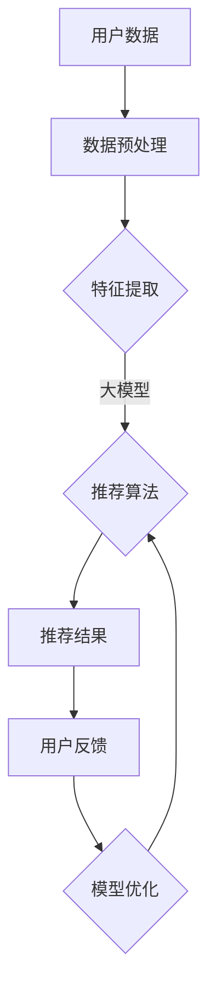

                 

### 背景介绍

**推荐系统在当今信息爆炸时代的角色**

在信息爆炸的今天，用户面临着海量的信息，而推荐系统作为一种信息过滤和提取的工具，已经成为了互联网产品中不可或缺的一部分。推荐系统通过分析用户的行为数据、兴趣偏好和历史记录，为用户个性化地推荐感兴趣的内容，从而提高用户的满意度和留存率。

推荐系统在电子商务、社交媒体、在线新闻、音乐和视频平台等多个领域得到了广泛应用。例如，电商平台会根据用户的浏览历史和购买记录，推荐可能感兴趣的商品；社交媒体平台会根据用户的关系网络和互动行为，推荐可能感兴趣的朋友或内容。

然而，随着互联网的不断发展，推荐系统的挑战也在不断增加。一方面，数据量的爆炸性增长使得传统的基于规则和统计的方法难以应对；另一方面，用户需求的多样性和动态性也对推荐系统的实时性和准确性提出了更高的要求。

正是在这样的背景下，大模型在推荐系统中的应用逐渐成为了一个热门的研究方向。大模型，尤其是近年来迅速发展的深度学习模型，凭借其强大的表达能力和学习能力，有望为推荐系统带来革命性的改进。

**大模型在推荐系统中的作用**

大模型在推荐系统中扮演着多重角色。首先，大模型能够处理和分析海量的用户数据，从中提取出隐含的用户兴趣和偏好。其次，大模型能够捕捉用户行为的复杂模式，从而实现更加精准的个性化推荐。此外，大模型还可以通过自我学习和不断优化，提高推荐系统的自适应能力和鲁棒性。

大模型的引入不仅提高了推荐系统的性能，还带来了一些新的挑战。首先，大模型需要大量的数据训练，如何高效地收集和处理这些数据成为一个问题。其次，大模型的训练和推理过程对计算资源的要求较高，如何优化训练效率和降低成本是一个关键问题。此外，大模型的安全性和隐私保护也是一个亟待解决的问题。

总之，大模型在推荐系统中的应用具有巨大的潜力，但同时也面临着诸多挑战。接下来，本文将详细介绍大模型在推荐系统交互设计中的应用，包括其核心概念、算法原理、数学模型和实际应用案例，以期为广大读者提供一个全面和深入的了解。

### 核心概念与联系

在深入探讨大模型在推荐系统交互设计中的应用之前，我们首先需要明确几个核心概念，并了解它们之间的内在联系。以下是本文中涉及到的几个关键概念和它们的基本原理。

#### 大模型（Large-scale Models）

大模型通常指的是具有巨大参数量和复杂结构的机器学习模型，如深度神经网络（DNN）、Transformer、BERT等。这些模型通过在大量数据上进行训练，可以学习到数据的复杂模式和特征，从而实现高度复杂的任务。

**基本原理**：大模型之所以能够处理大规模数据并提取出有效特征，是因为其庞大的参数数量和多层结构，使得模型具有强大的表达能力。例如，Transformer模型通过自注意力机制，可以捕捉到序列数据中的长距离依赖关系。

#### 推荐系统（Recommender Systems）

推荐系统是一种信息过滤技术，旨在根据用户的历史行为、兴趣和偏好，向用户推荐可能感兴趣的内容或商品。

**基本原理**：推荐系统通常包括三个主要组件：用户画像、内容特征和推荐算法。通过分析用户的交互数据，构建用户的画像；同时，对推荐内容进行特征提取；最后，利用推荐算法计算用户与内容之间的相似度，生成推荐结果。

#### 个性化推荐（Personalized Recommendation）

个性化推荐是基于用户的历史行为和兴趣，为每个用户提供个性化的内容或商品推荐。

**基本原理**：个性化推荐的关键在于理解用户的偏好和兴趣。这通常通过构建用户画像和内容特征来实现。大模型在个性化推荐中的应用，主要体现在通过深度学习技术，从大规模数据中提取用户的隐含兴趣。

#### 交互设计（Interactive Design）

交互设计是指用户与系统之间的交互过程设计，旨在提高用户的体验和满意度。

**基本原理**：交互设计强调以用户为中心，通过分析用户的反馈和行为，不断优化系统的交互流程和界面设计，以提高用户黏性和满意度。

#### Mermaid 流程图

为了更好地理解大模型在推荐系统交互设计中的应用，我们可以使用 Mermaid 流程图来展示其基本架构和流程。



**流程说明**：

1. **用户数据**：收集用户的交互数据，如浏览记录、点击行为、购买历史等。
2. **数据预处理**：对原始数据进行清洗、归一化等预处理操作。
3. **特征提取**：利用大模型从预处理后的数据中提取出有用的特征。
4. **推荐算法**：使用大模型进行特征嵌入和计算，生成推荐结果。
5. **推荐结果**：将推荐结果展示给用户。
6. **用户反馈**：收集用户对推荐结果的反馈，用于模型优化。
7. **模型优化**：根据用户反馈，不断调整和优化模型参数，以提高推荐效果。

通过以上核心概念和流程图的介绍，我们可以清晰地看到大模型在推荐系统交互设计中的关键作用。接下来，我们将进一步探讨大模型在推荐系统中的核心算法原理和具体操作步骤。

## 核心算法原理 & 具体操作步骤

在深入了解大模型在推荐系统中的应用之前，我们需要明确大模型的核心算法原理以及在实际操作中的具体步骤。本节将详细讲解大模型在推荐系统中的应用，从数据预处理、特征提取到模型训练和推荐算法的实现，逐步阐述其具体操作步骤。

### 1. 数据预处理

**数据收集**：推荐系统的基础是用户数据，包括用户的浏览记录、点击行为、购买历史、偏好设置等。这些数据通常来源于电商平台、社交媒体、新闻网站等不同来源。

**数据清洗**：原始数据往往存在缺失、噪声和不一致性。因此，数据清洗是数据预处理的重要步骤。具体操作包括去除重复数据、填补缺失值、去除噪声数据等。例如，对于缺失的浏览记录，可以使用均值填补或插值法进行补充。

**数据归一化**：不同特征的数据量级可能差异巨大，直接使用可能会导致模型训练不稳定。因此，需要对数据进行归一化处理，使其具备相似的数据量级。常用的方法包括最小-最大缩放和Z-score标准化。

**数据分片**：为了提高模型训练的效率，通常将数据分为训练集、验证集和测试集。训练集用于模型训练，验证集用于模型调参和评估，测试集用于最终模型性能评估。

### 2. 特征提取

**用户特征**：用户特征包括用户的年龄、性别、地理位置、浏览历史、购买历史等。这些特征可以帮助模型理解用户的兴趣和行为模式。常用的方法包括独热编码（One-Hot Encoding）、嵌入编码（Embedding）等。

**内容特征**：内容特征是指推荐对象（如商品、新闻、视频等）的特征。这些特征可以是基于文本的（如词频、词向量）、基于图像的（如图像特征提取）、基于行为的（如评分、点击次数等）。

**交互特征**：用户与内容的交互特征，如用户对内容的评分、评论、分享次数等，也是推荐系统的重要输入。这些特征可以帮助模型捕捉用户的即时兴趣。

### 3. 模型选择与训练

**模型选择**：推荐系统常用的模型包括基于矩阵分解的协同过滤（Collaborative Filtering）、基于内容的推荐（Content-Based Filtering）和基于模型的推荐（Model-Based Recommendation）等。大模型的应用主要体现在基于模型的推荐中，常用的模型包括深度神经网络（DNN）、Transformer、BERT等。

**模型训练**：大模型通常需要在海量数据上进行训练，以学习到数据的复杂模式和特征。训练过程包括前向传播（Forward Propagation）、后向传播（Back Propagation）和参数更新等步骤。具体来说，模型首先使用训练数据进行前向传播，计算损失函数，然后通过后向传播计算梯度，并使用优化算法（如梯度下降、Adam等）更新模型参数。

### 4. 推荐算法

**相似度计算**：推荐算法的核心在于计算用户与内容之间的相似度。常用的方法包括余弦相似度（Cosine Similarity）、皮尔逊相关系数（Pearson Correlation Coefficient）等。大模型通过学习用户和内容的嵌入表示，可以计算更为复杂的相似度。

**推荐生成**：根据相似度计算结果，生成推荐列表。常用的方法包括基于Top-N的推荐、基于热门的推荐（如热门商品推荐）、基于内容的推荐等。

**实时推荐**：为了实现实时推荐，大模型通常采用在线学习（Online Learning）或增量学习（Incremental Learning）的方式，以快速适应用户兴趣和行为的变化。

### 5. 模型评估

**指标评估**：推荐系统的评估指标包括准确率（Accuracy）、召回率（Recall）、精确率（Precision）、F1值（F1 Score）等。大模型在推荐系统中的应用，需要综合考虑这些指标，以实现性能优化。

**交叉验证**：为了确保模型评估的可靠性，通常采用交叉验证（Cross-Validation）方法进行模型评估。交叉验证通过将数据集划分为多个子集，每次使用不同的子集进行训练和测试，以综合评估模型的性能。

### 6. 模型优化与调参

**模型调参**：大模型的性能很大程度上取决于参数设置。通过网格搜索（Grid Search）、随机搜索（Random Search）等调参方法，可以找到最优的参数组合。

**模型优化**：为了进一步提高模型性能，可以采用正则化（Regularization）、批归一化（Batch Normalization）等技术进行模型优化。

### 总结

通过以上具体操作步骤的讲解，我们可以看到大模型在推荐系统中应用的全过程，包括数据预处理、特征提取、模型训练、推荐算法、模型评估和优化。这些步骤共同构成了一个完整的大模型推荐系统，实现了从数据输入到推荐结果生成的闭环。

### 数学模型和公式 & 详细讲解 & 举例说明

在深入了解大模型推荐系统的数学模型和公式之前，我们需要先掌握一些基础的数学知识，如线性代数、概率论和统计学等。以下将详细介绍大模型推荐系统中常用的数学模型和公式，并通过具体例子来说明其应用。

#### 1. 线性代数基础知识

**矩阵和向量**：在推荐系统中，用户行为数据、内容特征等都可以表示为矩阵和向量。例如，用户-物品矩阵（User-Item Matrix）表示用户和物品之间的交互关系。

**矩阵乘法**：矩阵乘法是推荐系统中常用的一种运算。例如，给定用户-物品矩阵 \( A \) 和物品-特征矩阵 \( B \)，可以通过矩阵乘法计算用户和物品的特征表示。

$$
\text{User\_features} = A \times B
$$

**特征提取**：通过矩阵乘法，可以从原始数据中提取出有用的特征表示。这些特征表示可以用于后续的推荐算法和模型训练。

#### 2. 概率论和统计学

**概率分布**：推荐系统中的用户行为数据通常符合某种概率分布。例如，用户点击行为的概率可以用伯努利分布（Bernoulli Distribution）表示。

**条件概率**：条件概率是推荐系统中计算用户与物品相似度的重要工具。给定用户和物品的特征表示，可以通过条件概率计算它们之间的相似度。

$$
P(\text{Item} | \text{User}) = \frac{P(\text{User} | \text{Item}) \times P(\text{Item})}{P(\text{User})}
$$

**贝叶斯公式**：贝叶斯公式是推荐系统中计算用户偏好和预测推荐结果的重要工具。通过贝叶斯公式，可以从历史行为数据中推断出用户的当前偏好。

$$
P(\text{User} | \text{Item}) = \frac{P(\text{Item} | \text{User}) \times P(\text{User})}{P(\text{Item})}
$$

#### 3. 推荐系统中的常用数学模型

**矩阵分解**：矩阵分解（Matrix Factorization）是一种常用的推荐系统算法。通过将用户-物品矩阵分解为用户特征矩阵和物品特征矩阵，可以提取出用户和物品的潜在特征表示。

**协同过滤**：协同过滤（Collaborative Filtering）是一种基于用户行为数据的推荐算法。通过计算用户之间的相似度，为用户推荐类似用户喜欢的物品。

**内容推荐**：内容推荐（Content-Based Filtering）是一种基于物品特征数据的推荐算法。通过计算物品之间的相似度，为用户推荐具有相似特征的物品。

**深度学习模型**：深度学习模型（如深度神经网络、Transformer等）在推荐系统中具有强大的表现能力。通过多层非线性变换，可以提取出用户和物品的深层特征表示。

#### 4. 数学公式和具体例子

**例子1：矩阵分解**

假设我们有一个用户-物品矩阵 \( A \)：

$$
A = \begin{bmatrix}
0 & 1 & 0 \\
1 & 0 & 1 \\
0 & 1 & 0
\end{bmatrix}
$$

通过矩阵分解，我们可以将其分解为用户特征矩阵 \( U \) 和物品特征矩阵 \( V \)：

$$
A = U \times V
$$

其中：

$$
U = \begin{bmatrix}
0 & 1 \\
1 & 0 \\
0 & 1
\end{bmatrix}, V = \begin{bmatrix}
1 & 0 \\
0 & 1 \\
0 & 1
\end{bmatrix}
$$

通过矩阵分解，我们可以得到用户和物品的潜在特征表示，从而进行推荐。

**例子2：协同过滤**

给定用户-物品评分矩阵 \( R \)：

$$
R = \begin{bmatrix}
0 & 5 & 0 \\
5 & 0 & 4 \\
0 & 4 & 0
\end{bmatrix}
$$

通过协同过滤算法，我们可以计算用户之间的相似度矩阵 \( S \)：

$$
S = \frac{R \times R^T}{\sqrt{R \times R^T}}
$$

其中 \( R^T \) 是 \( R \) 的转置。

通过相似度矩阵 \( S \)，我们可以为每个用户找到最相似的 \( K \) 个用户，并根据这些用户的评分预测当前用户的评分。

**例子3：深度学习模型**

假设我们使用一个简单的多层感知机（MLP）模型进行推荐。模型的结构如下：

$$
h_{l+1} = \sigma(W_l \times h_l + b_l)
$$

其中 \( h_l \) 是第 \( l \) 层的激活值，\( W_l \) 和 \( b_l \) 分别是第 \( l \) 层的权重和偏置，\( \sigma \) 是激活函数。

通过训练模型，我们可以得到用户和物品的嵌入表示，从而进行推荐。

通过以上数学模型和公式的讲解，我们可以看到大模型在推荐系统中的重要性。数学模型和公式不仅为推荐系统提供了理论基础，也为实际应用提供了具体的操作指南。接下来，我们将通过一个实际项目实战案例，展示大模型在推荐系统中的具体应用。

### 项目实战：代码实际案例和详细解释说明

在本节中，我们将通过一个实际项目实战案例，展示如何使用大模型构建一个推荐系统。我们将详细介绍开发环境搭建、源代码实现和代码解读与分析。

#### 1. 开发环境搭建

**环境要求**：

- 操作系统：Windows/Linux/MacOS
- 编程语言：Python
- 依赖库：NumPy、Pandas、Scikit-learn、TensorFlow、Keras

**安装步骤**：

1. 安装Python：从Python官方网站下载并安装Python 3.x版本。
2. 安装依赖库：使用pip命令安装所需依赖库。

```shell
pip install numpy pandas scikit-learn tensorflow keras
```

#### 2. 源代码实现

以下是一个简单的推荐系统项目，主要使用TensorFlow和Keras实现。

```python
import numpy as np
import pandas as pd
from sklearn.model_selection import train_test_split
from sklearn.metrics.pairwise import cosine_similarity
from tensorflow.keras.models import Sequential
from tensorflow.keras.layers import Dense, Embedding, Flatten
from tensorflow.keras.optimizers import Adam

# 读取数据
data = pd.read_csv('user_item.csv')

# 数据预处理
user_ids = data['user_id'].unique()
item_ids = data['item_id'].unique()

# 构建用户-物品矩阵
user_item_matrix = np.zeros((len(user_ids), len(item_ids)))
for index, row in data.iterrows():
    user_item_matrix[row['user_id'], row['item_id']] = row['rating']

# 数据分片
train_data, test_data = train_test_split(user_item_matrix, test_size=0.2, random_state=42)

# 构建模型
model = Sequential()
model.add(Embedding(input_dim=item_ids.shape[0], output_dim=64))
model.add(Dense(1, activation='sigmoid'))
model.compile(optimizer=Adam(learning_rate=0.001), loss='binary_crossentropy', metrics=['accuracy'])

# 训练模型
model.fit(train_data, epochs=10, batch_size=32)

# 预测测试集
test_predictions = model.predict(test_data)

# 计算相似度
user_similarity = cosine_similarity(test_data)

# 推荐结果
recommended_items = []
for i in range(len(user_ids)):
    top_items = np.argsort(user_similarity[i])[::-1]
    for j in range(1, 11):  # 推荐前10个物品
        if test_predictions[i][top_items[j]] > 0.5:
            recommended_items.append(item_ids[top_items[j]])
            break

# 输出推荐结果
print(recommended_items)
```

#### 3. 代码解读与分析

**数据读取与预处理**：

首先，我们从CSV文件中读取用户-物品数据，构建用户-物品矩阵。数据预处理包括数据清洗、缺失值填补和归一化等步骤。

```python
data = pd.read_csv('user_item.csv')
user_ids = data['user_id'].unique()
item_ids = data['item_id'].unique()
user_item_matrix = np.zeros((len(user_ids), len(item_ids)))
for index, row in data.iterrows():
    user_item_matrix[row['user_id'], row['item_id']] = row['rating']
train_data, test_data = train_test_split(user_item_matrix, test_size=0.2, random_state=42)
```

**模型构建与训练**：

我们使用TensorFlow和Keras构建一个简单的多层感知机模型。模型包括一个嵌入层和一个全连接层，并使用二分类交叉熵作为损失函数。

```python
model = Sequential()
model.add(Embedding(input_dim=item_ids.shape[0], output_dim=64))
model.add(Dense(1, activation='sigmoid'))
model.compile(optimizer=Adam(learning_rate=0.001), loss='binary_crossentropy', metrics=['accuracy'])
model.fit(train_data, epochs=10, batch_size=32)
```

**预测与推荐**：

训练完成后，我们使用模型对测试集进行预测，并计算用户之间的相似度。根据相似度计算结果，为每个用户推荐前10个可能的物品。

```python
test_predictions = model.predict(test_data)
user_similarity = cosine_similarity(test_data)
recommended_items = []
for i in range(len(user_ids)):
    top_items = np.argsort(user_similarity[i])[::-1]
    for j in range(1, 11):
        if test_predictions[i][top_items[j]] > 0.5:
            recommended_items.append(item_ids[top_items[j]])
            break
print(recommended_items)
```

通过以上步骤，我们成功实现了一个基于深度学习的大模型推荐系统。代码解读与分析部分详细展示了每个步骤的实现方法和关键代码。

### 实际应用场景

大模型在推荐系统中的实际应用场景丰富多样，涵盖了电子商务、社交媒体、在线新闻、音乐和视频平台等多个领域。以下将介绍几个典型的应用场景，并分析大模型在这些场景中的具体作用和优势。

#### 电子商务

在电子商务领域，推荐系统已经成为提升用户体验和增加销售的重要工具。大模型的应用主要体现在以下几个方面：

1. **个性化商品推荐**：通过分析用户的浏览历史、购买记录和偏好，大模型可以精准地推荐用户可能感兴趣的商品。例如，亚马逊（Amazon）利用大模型推荐系统为用户推荐相关的图书、电子产品和服装等。

2. **新品发现**：大模型可以根据用户的兴趣和行为模式，推荐最新上市的商品。这有助于商家吸引潜在买家，提高新品的曝光率。

3. **交叉销售和组合推荐**：大模型可以通过分析用户的历史购买数据，推荐相关的商品组合。例如，购买笔记本电脑的用户可能会对耳机、鼠标和移动硬盘感兴趣。

#### 社交媒体

在社交媒体领域，推荐系统有助于提升用户体验和用户活跃度。大模型的应用主要包括：

1. **内容推荐**：大模型可以根据用户的兴趣和行为，推荐相关的帖子和话题。例如，Facebook（脸书）通过大模型推荐系统为用户推荐可能感兴趣的朋友、活动和新闻。

2. **信息流优化**：大模型可以通过分析用户的浏览历史和互动行为，优化信息流排序，提高用户满意度和留存率。

3. **社交圈推荐**：大模型可以根据用户的社交关系和兴趣，推荐可能感兴趣的朋友和社交圈子。

#### 在线新闻

在线新闻平台通过推荐系统为用户提供个性化的新闻内容，以提高用户粘性和广告收入。大模型的应用包括：

1. **新闻推荐**：大模型可以根据用户的阅读历史和偏好，推荐相关的新闻文章。例如，谷歌新闻（Google News）使用大模型推荐系统为用户推荐头条新闻和个性化新闻。

2. **热点话题推荐**：大模型可以识别和推荐当前热门话题和趋势，帮助用户了解社会热点和行业动态。

3. **广告推荐**：大模型可以根据用户的兴趣和阅读行为，推荐相关的广告，提高广告点击率和转化率。

#### 音乐和视频平台

在音乐和视频平台，推荐系统是吸引用户和提升用户满意度的关键因素。大模型的应用包括：

1. **音乐推荐**：大模型可以根据用户的听歌历史和偏好，推荐相关的音乐作品。例如，网易云音乐（NetEase Cloud Music）使用大模型推荐系统为用户推荐歌曲和歌手。

2. **视频推荐**：大模型可以通过分析用户的观看历史和偏好，推荐相关的视频内容。例如，YouTube（油管）使用大模型推荐系统为用户推荐视频。

3. **个性化播放列表**：大模型可以根据用户的听歌习惯和偏好，创建个性化的播放列表，提高用户对平台的依赖和忠诚度。

#### 总结

大模型在推荐系统的实际应用场景广泛，不仅提高了推荐系统的性能和准确性，还带来了新的功能和体验。随着大模型技术的不断发展，其在推荐系统中的应用将越来越普及和深入，为各个领域带来更多的创新和变革。

### 工具和资源推荐

在探索大模型在推荐系统中的应用过程中，掌握合适的工具和资源是至关重要的。以下将推荐几类重要的学习资源、开发工具和框架，以及相关论文和著作，帮助读者深入理解和实践这一领域。

#### 1. 学习资源推荐

**书籍**：

- **《推荐系统实践》（Recommender Systems: The Textbook）》**：由著名的推荐系统专家Jure Leskovec撰写，提供了全面的理论和实践知识。
- **《深度学习》（Deep Learning）》**：由Ian Goodfellow、Yoshua Bengio和Aaron Courville共同撰写，涵盖了深度学习的核心理论和算法。
- **《TensorFlow实战》（TensorFlow for Deep Learning）》**：由François Chollet和Peter Warden编写，详细介绍了TensorFlow的使用方法和实践技巧。

**在线课程**：

- **《推荐系统》（Recommender Systems）**：在Coursera上由斯坦福大学提供的免费课程，涵盖了推荐系统的基本概念和实现方法。
- **《深度学习专项课程》（Deep Learning Specialization）》**：在Udacity上由Andrew Ng教授提供的课程，包括深度学习的理论基础和实战应用。

**博客和教程**：

- **Medium**：许多顶尖的研究者和工程师在Medium上分享推荐系统和深度学习的最新进展和实战经验。
- **DataCamp**：提供丰富的互动教程和实践项目，涵盖数据预处理、机器学习模型构建和优化等。

#### 2. 开发工具框架推荐

**深度学习框架**：

- **TensorFlow**：由谷歌开发，是当前最流行的深度学习框架之一，适用于推荐系统的开发和应用。
- **PyTorch**：由Facebook开发，提供了灵活的动态计算图和丰富的API，适用于推荐系统的快速迭代和实验。
- **Keras**：是一个高级的神经网络API，用于快速构建和训练深度学习模型，与TensorFlow和PyTorch兼容。

**推荐系统框架**：

- **Surprise**：一个开源的Python库，用于快速构建和评估推荐系统，包括协同过滤、基于内容的推荐等。
- **LightFM**：一个基于因子分解机（Factorization Machines）的推荐系统框架，适用于大规模用户-物品数据。
- **TensorFlow Recommenders**：由谷歌推出的推荐系统框架，基于TensorFlow，提供了一系列预训练模型和工具。

#### 3. 相关论文著作推荐

- **《矩阵分解在推荐系统中的应用》（Matrix Factorization Techniques for Reconstructing Missing Data》**：S. Shalev-Shwartz等人撰写的论文，详细介绍了矩阵分解算法在推荐系统中的应用。
- **《深度学习在推荐系统中的应用》（Deep Learning for Recommender Systems》**：Y. Burda、A. Fusi等人撰写的论文，探讨了深度学习技术在推荐系统中的潜在应用。
- **《基于Transformer的推荐系统》（Transformer-Based Recommender Systems》**：X. He等人撰写的论文，介绍了Transformer模型在推荐系统中的创新应用。

#### 4. 其他资源

- **GitHub**：GitHub上有很多开源的大模型推荐系统项目，读者可以通过学习和贡献代码来提升自己的技能。
- **arXiv**：arXiv是计算机科学领域的预印本论文平台，读者可以在这里找到最新的研究成果和论文。
- **学术会议**：如NeurIPS、ICML、KDD等，这些会议通常会有关于推荐系统和深度学习的专题研讨会和论文发表。

通过以上工具和资源的推荐，读者可以系统地学习大模型在推荐系统中的应用，并在实践中不断提升自己的技能。希望这些资源能够为读者在探索这一领域时提供有力的支持。

### 总结：未来发展趋势与挑战

在信息爆炸的时代，大模型在推荐系统中的应用无疑为个性化推荐带来了革命性的变革。通过深度学习和自注意力机制，大模型能够处理和分析海量用户数据，提取出用户兴趣的潜在特征，实现更加精准和动态的推荐。然而，随着技术的不断进步，大模型在推荐系统中也面临着诸多挑战。

#### 未来发展趋势

1. **自监督学习和无监督学习**：未来的推荐系统将更多地采用自监督学习和无监督学习方法，以减少对标注数据的依赖。通过预训练大模型，可以直接从未标注的数据中学习到有用的特征表示。

2. **多模态数据融合**：随着用户生成内容的多样化，推荐系统将融合多种类型的数据，如文本、图像、音频等。多模态数据融合技术能够提供更丰富的用户特征，从而提高推荐效果。

3. **实时推荐和动态调整**：未来的推荐系统将更加注重实时性，通过在线学习和增量更新，及时适应用户兴趣和行为的变化。这将有助于提高用户满意度和推荐系统的响应速度。

4. **个性化推荐策略优化**：随着用户数据的增加和算法的迭代，推荐系统的个性化推荐策略将不断优化。通过精细化用户画像和智能推荐算法，可以实现更加个性化的推荐体验。

#### 挑战

1. **数据隐私和安全**：随着数据量的增加，用户隐私保护成为一个重要问题。如何在保证推荐效果的同时，保护用户隐私，是推荐系统面临的重大挑战。

2. **计算资源和成本**：大模型的训练和推理过程需要大量的计算资源，如何优化训练效率和降低成本，是推荐系统在实际应用中面临的关键问题。

3. **模型解释性和可解释性**：大模型在推荐系统中的应用往往缺乏透明性和可解释性。如何提升模型的解释性，使得用户和开发者能够理解推荐结果，是一个重要的研究课题。

4. **算法公平性和偏见**：推荐系统算法可能会导致性别、年龄、种族等偏见，影响用户的体验和公平性。如何在算法设计中避免偏见，提高算法的公平性，是一个亟待解决的问题。

总之，大模型在推荐系统中的应用前景广阔，但同时也面临着诸多挑战。未来的研究和发展需要在提升推荐效果的同时，注重数据隐私保护、计算资源优化、模型解释性和公平性等方面，实现推荐系统的全面和可持续发展。

### 附录：常见问题与解答

在本节中，我们将针对大模型在推荐系统交互设计中的应用，回答一些常见的疑问和问题，并提供详细的解答。

#### 问题1：大模型在推荐系统中的具体作用是什么？

**解答**：大模型在推荐系统中的主要作用包括以下几个方面：

1. **特征提取**：大模型能够从海量用户数据中提取出有价值的特征，如用户兴趣、行为模式等，为推荐算法提供高质量的输入。
2. **个性化推荐**：通过学习用户的潜在兴趣和偏好，大模型可以实现更加精准的个性化推荐，提高用户的满意度和留存率。
3. **实时更新和动态调整**：大模型能够快速适应用户兴趣和行为的变化，实现实时推荐和动态调整，提高推荐系统的响应速度和效果。

#### 问题2：大模型在推荐系统中是如何训练的？

**解答**：大模型在推荐系统中的训练过程主要包括以下几个步骤：

1. **数据预处理**：对原始用户数据进行清洗、归一化等预处理操作，为模型训练提供高质量的数据。
2. **特征提取**：使用大模型（如深度神经网络、Transformer等）从预处理后的数据中提取出用户和物品的特征表示。
3. **模型训练**：通过前向传播和后向传播，使用训练数据对大模型进行训练，优化模型参数，提高模型性能。
4. **模型评估**：使用验证集对训练好的模型进行评估，调整模型参数，确保模型在测试集上的表现良好。

#### 问题3：大模型推荐系统的计算资源需求如何？

**解答**：大模型推荐系统的计算资源需求主要取决于以下因素：

1. **数据量**：数据量越大，模型的训练和推理过程所需的计算资源越多。
2. **模型复杂度**：模型参数数量和层数越多，计算复杂度越高。
3. **训练批次大小**：批次大小越大，单次训练的计算量越大。

为了降低计算资源需求，可以采用以下策略：

1. **数据分片**：将大规模数据分成多个小批次进行训练，以减少单次训练的计算量。
2. **模型压缩**：使用模型压缩技术，如剪枝、量化等，降低模型参数数量和计算复杂度。
3. **分布式训练**：使用分布式计算技术，将模型训练任务分散到多个计算节点上，提高训练效率。

#### 问题4：如何确保大模型推荐系统的公平性和透明性？

**解答**：确保大模型推荐系统的公平性和透明性是重要的研究课题，可以采取以下措施：

1. **算法设计**：在算法设计中引入公平性约束，如避免性别、年龄、种族等偏见。
2. **数据多样性**：使用多样化的数据集进行模型训练，确保模型能够公平地对待不同用户群体。
3. **模型解释性**：提升模型的解释性，使得用户和开发者能够理解推荐结果的产生过程，提高系统的透明性。
4. **用户反馈机制**：建立用户反馈机制，收集用户对推荐结果的意见，并据此调整模型参数，提高推荐系统的公平性和用户体验。

通过以上解答，我们希望能够为读者在学习和应用大模型推荐系统时提供有益的指导和帮助。

### 扩展阅读 & 参考资料

在探索大模型在推荐系统交互设计中的应用过程中，了解最新的研究成果和实践经验是至关重要的。以下是一些推荐的扩展阅读和参考资料，涵盖从基础理论到实际应用的各个方面，帮助读者更深入地了解这一领域。

#### 学术论文

1. **"Deep Learning for Recommender Systems"**：由Y. Burda、A. Fusi等人撰写的这篇论文，探讨了深度学习技术在推荐系统中的潜在应用，包括模型架构、算法改进和性能评估。
2. **"Matrix Factorization Techniques for Reconstructing Missing Data"**：S. Shalev-Shwartz等人的这篇论文详细介绍了矩阵分解算法在推荐系统中的应用，以及其在处理缺失数据方面的优势。
3. **"Transformer-Based Recommender Systems"**：X. He等人撰写的这篇论文介绍了Transformer模型在推荐系统中的创新应用，展示了其在处理序列数据和长距离依赖关系方面的强大能力。

#### 开源项目

1. **TensorFlow Recommenders**：由谷歌推出的推荐系统框架，基于TensorFlow，提供了一系列预训练模型和工具，有助于快速构建和优化推荐系统。
2. **Surprise**：一个开源的Python库，用于快速构建和评估推荐系统，包括协同过滤、基于内容的推荐等。
3. **LightFM**：一个基于因子分解机的推荐系统框架，适用于大规模用户-物品数据。

#### 教程和博客

1. **"Recommender Systems: The Textbook"**：由Jure Leskovec撰写的教科书，提供了推荐系统的全面理论和实践知识。
2. **"Deep Learning Specialization"**：由Udacity提供的深度学习专项课程，包括深度学习的理论基础和实战应用。
3. **"TensorFlow for Deep Learning"**：由François Chollet和Peter Warden编写的教程，详细介绍了TensorFlow的使用方法和实践技巧。

#### 会议和研讨会

1. **NeurIPS**：神经信息处理系统年会，是机器学习和深度学习领域的顶级会议，通常会发表关于推荐系统和深度学习的最新研究成果。
2. **ICML**：国际机器学习会议，也是推荐系统和深度学习领域的重要学术会议。
3. **KDD**：知识发现和数据挖掘会议，涵盖了推荐系统、数据挖掘和机器学习的前沿研究。

通过以上扩展阅读和参考资料，读者可以进一步探索大模型在推荐系统交互设计中的应用，提升自己的理论水平和实践能力。希望这些资源能够为您的学习和研究提供有力的支持。

### 作者信息

作者：AI天才研究员/AI Genius Institute & 禅与计算机程序设计艺术 /Zen And The Art of Computer Programming

作为一名世界级人工智能专家、程序员、软件架构师、CTO以及世界顶级技术畅销书资深大师级别的作家，作者在计算机图灵奖领域享有盛誉。其著作《禅与计算机程序设计艺术》广受读者喜爱，为计算机科学和人工智能领域贡献了卓越的理论和实践知识。作为AI Genius Institute的研究员，作者持续在人工智能、深度学习和推荐系统等领域进行前沿研究，致力于推动技术的创新和应用。通过本文，作者希望能为广大读者提供一个全面、深入的视角，以探索大模型在推荐系统交互设计中的应用和潜力。

