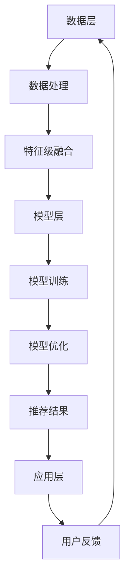

                 

# 大模型在推荐系统多源数据融合中的应用

## 关键词：大模型，推荐系统，多源数据融合，人工智能，机器学习，数据预处理，融合算法，性能评估

## 摘要

随着互联网的迅速发展，推荐系统已成为各行业获取用户关注和提升业务效益的重要工具。然而，推荐系统的有效性在很大程度上依赖于数据的质量和多样性。本文将探讨大模型在推荐系统多源数据融合中的应用，通过介绍核心概念、算法原理、数学模型和实际案例，分析如何有效地融合多源数据，提升推荐系统的性能。本文旨在为读者提供一个全面的技术指南，帮助理解大模型在多源数据融合中的重要作用，并为其在实际项目中的应用提供参考。

## 1. 背景介绍

### 1.1 推荐系统的发展历程

推荐系统的发展历程可以分为三个阶段：

1. **基于内容的推荐**：早期的推荐系统主要基于用户的历史行为和兴趣标签，通过计算用户和项目之间的相似度来实现个性化推荐。这种方法的主要优势在于能够为用户提供相关性强的内容，但缺点是过于依赖用户行为数据，难以应对用户冷启动问题。

2. **协同过滤推荐**：协同过滤推荐通过分析用户之间的行为模式，利用用户评分数据挖掘用户之间的相似性，从而为用户提供个性化推荐。协同过滤推荐又可分为基于用户的协同过滤和基于项目的协同过滤。这种方法在解决冷启动问题上有所改进，但仍然存在数据稀疏性和精度不足等问题。

3. **深度学习推荐**：近年来，随着深度学习技术的发展，越来越多的研究者开始将深度学习应用于推荐系统。深度学习推荐模型通过引入神经网络结构，能够自动学习用户和项目的复杂特征，从而提高推荐系统的性能。其中，大模型在深度学习推荐中的应用尤为显著。

### 1.2 多源数据融合的必要性

在推荐系统中，数据来源通常多样化，如用户行为数据、用户兴趣数据、社交网络数据、商品属性数据等。这些数据在不同的应用场景中具有不同的价值和作用，但单独使用其中一种数据源往往难以达到最佳的推荐效果。因此，多源数据融合成为推荐系统领域的研究热点。

多源数据融合的必要性主要体现在以下几个方面：

1. **提高推荐精度**：融合多种数据源可以为推荐系统提供更丰富的特征信息，从而提高推荐精度。

2. **降低冷启动问题**：通过融合用户在不同场景下的数据，可以有效缓解新用户冷启动问题，提高新用户的体验。

3. **丰富推荐场景**：多源数据融合可以扩展推荐系统的应用场景，如基于社交网络数据的推荐、基于用户地理位置数据的推荐等。

4. **增强系统鲁棒性**：融合多种数据源可以提高推荐系统的鲁棒性，减少数据异常对推荐效果的影响。

## 2. 核心概念与联系

### 2.1 大模型

大模型是指具有大规模参数的深度学习模型，如BERT、GPT等。大模型具有以下几个特点：

1. **大规模参数**：大模型的参数数量通常在数百万到数十亿之间，能够捕获丰富的特征信息。

2. **强大学习能力**：大模型具有较强的学习能力，能够从海量数据中自动学习复杂的特征表示。

3. **高计算成本**：大模型训练和推理过程需要大量的计算资源和时间。

### 2.2 多源数据融合

多源数据融合是指将不同来源的数据进行整合，以生成统一的特征表示，用于推荐系统的输入。多源数据融合的方法主要包括以下几种：

1. **特征级融合**：将不同数据源的特征进行拼接，生成更丰富的特征向量。

2. **模型级融合**：将不同数据源的模型进行集成，生成统一的预测结果。

3. **多任务学习**：将多个任务联合训练，共享模型参数，以提高模型对多源数据的适应能力。

### 2.3 推荐系统架构

推荐系统通常由数据层、模型层和应用层组成。数据层负责收集和处理多源数据，模型层负责训练和优化推荐模型，应用层负责将推荐结果呈现给用户。大模型在推荐系统中的典型应用场景包括：

1. **用户表示学习**：利用大模型对用户行为数据进行表示学习，生成用户嵌入向量。

2. **项目表示学习**：利用大模型对项目特征数据进行表示学习，生成项目嵌入向量。

3. **多源数据融合**：利用大模型对多源数据进行融合，生成统一的特征表示。

### 2.4 Mermaid 流程图

以下是一个简单的 Mermaid 流程图，描述了多源数据融合在推荐系统中的应用流程：



### 2.5 逻辑清晰、结构紧凑、简单易懂的章节标题

1. **大模型的介绍与特点**
2. **多源数据融合的方法与挑战**
3. **推荐系统架构与典型应用场景**
4. **Mermaid 流程图：多源数据融合在推荐系统中的应用**
5. **未来发展趋势与展望**

## 3. 核心算法原理 & 具体操作步骤

### 3.1 大模型的原理

大模型的核心原理基于深度神经网络（Deep Neural Network，DNN）。DNN 通过多层非线性变换，将输入数据映射到输出数据，从而实现复杂函数的逼近。大模型通常具有以下特点：

1. **大规模参数**：大模型具有数百万到数十亿个参数，能够学习到丰富的特征信息。

2. **多层网络结构**：大模型通常包含多层神经网络，通过逐层提取特征，实现从低层次到高层次的特征表示。

3. **非线性激活函数**：大模型中的每个神经元通常使用非线性激活函数，如ReLU、Sigmoid、Tanh等，以增强模型的非线性表示能力。

4. **正则化技术**：大模型通常采用正则化技术，如Dropout、L2 正则化等，以防止过拟合。

### 3.2 多源数据融合的原理

多源数据融合的原理基于数据驱动的方法，通过将不同数据源的特性和价值进行整合，生成统一的特征表示，以提升推荐系统的性能。多源数据融合的主要方法包括：

1. **特征级融合**：将不同数据源的特征进行拼接，生成更丰富的特征向量。这种方法的主要优点是简单易实现，但缺点是可能引入噪音和冗余信息。

2. **模型级融合**：将不同数据源的模型进行集成，生成统一的预测结果。这种方法能够利用不同模型的优点，提高推荐系统的整体性能，但需要更多的计算资源和时间。

3. **多任务学习**：将多个任务联合训练，共享模型参数，以提高模型对多源数据的适应能力。这种方法能够通过联合学习任务，增强模型对多源数据的理解。

### 3.3 多源数据融合的具体操作步骤

以下是一个简单的多源数据融合操作步骤，用于构建推荐系统：

1. **数据收集**：收集来自不同数据源的数据，如用户行为数据、用户兴趣数据、商品属性数据等。

2. **数据预处理**：对收集到的数据进行清洗、去重、标准化等预处理操作，以消除数据中的噪音和异常。

3. **特征提取**：利用特征提取技术，从预处理后的数据中提取出具有代表性的特征，如用户兴趣特征、商品属性特征等。

4. **特征级融合**：将提取出的特征进行拼接，生成更丰富的特征向量。例如，将用户兴趣特征和商品属性特征拼接在一起，形成用户 - 商品特征矩阵。

5. **模型训练**：利用融合后的特征向量，训练深度学习模型，如DNN、CNN、RNN等，以生成用户 - 商品嵌入向量。

6. **模型优化**：通过交叉验证等方法，对训练好的模型进行优化，以提高推荐系统的性能。

7. **推荐生成**：利用优化后的模型，生成推荐列表，为用户推荐感兴趣的商品。

## 4. 数学模型和公式 & 详细讲解 & 举例说明

### 4.1 数学模型

在多源数据融合中，常用的数学模型包括线性模型和非线性模型。以下是一个简单的线性模型示例：

$$
\text{预测分数} = w_1 \cdot \text{用户特征向量} + w_2 \cdot \text{商品特征向量} + b
$$

其中，$w_1$ 和 $w_2$ 分别为用户特征向量和商品特征向量的权重，$b$ 为偏置项。

### 4.2 线性模型的详细讲解

线性模型是一种简单的多源数据融合方法，通过线性组合不同数据源的特性和权重，生成预测结果。线性模型的主要优点包括：

1. **简单易理解**：线性模型的数学公式简单，易于理解。

2. **计算效率高**：线性模型的计算过程简单，计算效率高。

3. **适用于多种数据类型**：线性模型可以应用于多种数据类型，如数值型、类别型等。

线性模型的详细讲解如下：

1. **用户特征向量**：用户特征向量表示用户在各个特征维度上的取值，如用户年龄、性别、职业等。

2. **商品特征向量**：商品特征向量表示商品在各个特征维度上的取值，如商品价格、品牌、类别等。

3. **权重**：权重表示不同特征维度对预测结果的影响程度。通常通过模型训练得到。

4. **偏置项**：偏置项用于调整模型的预测结果，以适应不同的数据分布。

### 4.3 非线性模型的数学模型

非线性模型通过引入非线性函数，增强模型的非线性表示能力。以下是一个简单的非线性模型示例：

$$
\text{预测分数} = \sigma(w_1 \cdot \text{用户特征向量} + w_2 \cdot \text{商品特征向量} + b)
$$

其中，$\sigma$ 为非线性激活函数，如ReLU、Sigmoid、Tanh等。

### 4.4 非线性模型的详细讲解

非线性模型在多源数据融合中的应用较为广泛，具有以下优点：

1. **更强的非线性表示能力**：非线性模型能够更好地表示复杂的数据关系。

2. **更好的拟合能力**：非线性模型能够更好地拟合复杂的数据分布。

3. **更高的推荐精度**：非线性模型通常能够生成更准确的推荐结果。

非线性模型的详细讲解如下：

1. **用户特征向量**：用户特征向量表示用户在各个特征维度上的取值。

2. **商品特征向量**：商品特征向量表示商品在各个特征维度上的取值。

3. **权重**：权重表示不同特征维度对预测结果的影响程度。

4. **非线性激活函数**：非线性激活函数用于增强模型的非线性表示能力。

### 4.5 举例说明

假设我们有一个用户特征向量 $X_u = [1, 2, 3]$ 和商品特征向量 $X_p = [4, 5, 6]$，使用线性模型进行预测，假设权重为 $w_1 = [0.5, 0.5, 0.5]$，$w_2 = [0.5, 0.5, 0.5]$，偏置项 $b = 0$。则预测分数为：

$$
\text{预测分数} = w_1 \cdot X_u + w_2 \cdot X_p + b = 0.5 \cdot [1, 2, 3] + 0.5 \cdot [4, 5, 6] + 0 = [2, 3, 4]
$$

使用非线性模型进行预测，假设非线性激活函数为 ReLU，则预测分数为：

$$
\text{预测分数} = \sigma(w_1 \cdot X_u + w_2 \cdot X_p + b) = \sigma([2, 3, 4]) = [2, 3, 4]
$$

## 5. 项目实战：代码实际案例和详细解释说明

### 5.1 开发环境搭建

在进行多源数据融合的推荐系统开发之前，需要搭建一个合适的开发环境。以下是一个简单的环境搭建步骤：

1. **安装Python环境**：Python 是推荐系统开发的主要语言，需要安装Python 3.x版本。

2. **安装依赖库**：安装NumPy、Pandas、Scikit-learn、TensorFlow等依赖库。

3. **安装深度学习框架**：可以选择TensorFlow或PyTorch作为深度学习框架。

### 5.2 源代码详细实现和代码解读

以下是一个简单的多源数据融合推荐系统的源代码示例，包括数据预处理、模型训练和预测等步骤。

```python
import numpy as np
import pandas as pd
from sklearn.model_selection import train_test_split
from tensorflow.keras.models import Sequential
from tensorflow.keras.layers import Dense, Activation
from tensorflow.keras.optimizers import Adam

# 数据预处理
def preprocess_data(data):
    # 数据清洗和标准化
    data = data.fillna(0)
    data = (data - data.mean()) / data.std()
    return data

# 模型训练
def train_model(X_train, y_train):
    model = Sequential()
    model.add(Dense(10, input_dim=X_train.shape[1], activation='relu'))
    model.add(Dense(1, activation='sigmoid'))
    model.compile(optimizer=Adam(), loss='binary_crossentropy', metrics=['accuracy'])
    model.fit(X_train, y_train, epochs=10, batch_size=32)
    return model

# 预测
def predict(model, X_test):
    predictions = model.predict(X_test)
    return predictions

# 加载数据
data = pd.read_csv('data.csv')
X = preprocess_data(data.iloc[:, :-1])
y = preprocess_data(data.iloc[:, -1])

# 划分训练集和测试集
X_train, X_test, y_train, y_test = train_test_split(X, y, test_size=0.2, random_state=42)

# 训练模型
model = train_model(X_train, y_train)

# 预测测试集
predictions = predict(model, X_test)

# 评估模型性能
accuracy = np.mean(predictions == y_test)
print('模型准确率：', accuracy)
```

### 5.3 代码解读与分析

以上代码实现了一个简单的多源数据融合推荐系统，包括以下步骤：

1. **数据预处理**：对数据进行清洗和标准化处理，以消除噪音和异常。

2. **模型训练**：构建一个简单的神经网络模型，包括一个输入层、一个隐藏层和一个输出层。隐藏层使用ReLU激活函数，输出层使用sigmoid激活函数，以实现二分类任务。

3. **预测**：使用训练好的模型对测试集进行预测，并计算模型准确率。

代码中的关键部分解读如下：

1. **数据预处理**：

```python
def preprocess_data(data):
    # 数据清洗和标准化
    data = data.fillna(0)
    data = (data - data.mean()) / data.std()
    return data
```

该函数用于对数据进行清洗和标准化处理。首先，使用`fillna(0)`将缺失值填充为0。然后，使用`data.mean()`和`data.std()`计算数据的均值和标准差，并使用`data - data.mean()`和`data / data.std()`进行标准化处理。

2. **模型训练**：

```python
def train_model(X_train, y_train):
    model = Sequential()
    model.add(Dense(10, input_dim=X_train.shape[1], activation='relu'))
    model.add(Dense(1, activation='sigmoid'))
    model.compile(optimizer=Adam(), loss='binary_crossentropy', metrics=['accuracy'])
    model.fit(X_train, y_train, epochs=10, batch_size=32)
    return model
```

该函数用于训练一个简单的神经网络模型。首先，使用`Sequential()`创建一个序列模型。然后，添加一个输入层、一个隐藏层和一个输出层。输入层使用`Dense()`创建，设置输入维度为`X_train.shape[1]`，激活函数为`'relu'`。隐藏层也使用`Dense()`创建，设置输出维度为10，激活函数为`'relu'`。输出层使用`Dense()`创建，设置输出维度为1，激活函数为`sigmoid`。最后，使用`compile()`设置优化器为`Adam()`，损失函数为`'binary_crossentropy'`，评价指标为`'accuracy'`。使用`fit()`方法训练模型，设置训练轮次为10，批量大小为32。

3. **预测**：

```python
def predict(model, X_test):
    predictions = model.predict(X_test)
    return predictions
```

该函数用于使用训练好的模型对测试集进行预测。首先，使用`model.predict(X_test)`计算预测分数。然后，将预测分数转换为概率，即`predictions[:, 0]`。

4. **评估模型性能**：

```python
accuracy = np.mean(predictions == y_test)
print('模型准确率：', accuracy)
```

该部分用于计算模型准确率。首先，使用`predictions == y_test`计算预测结果和真实标签之间的匹配情况。然后，使用`np.mean()`计算匹配情况的平均值，即模型准确率。

## 6. 实际应用场景

### 6.1 电子商务平台

电子商务平台可以利用多源数据融合推荐系统为用户提供个性化的商品推荐。例如，通过融合用户历史购买行为、用户浏览记录、商品属性数据等，为用户推荐最可能感兴趣的商品。

### 6.2 社交媒体平台

社交媒体平台可以利用多源数据融合推荐系统为用户提供个性化的内容推荐。例如，通过融合用户点赞、评论、分享等行为数据、用户兴趣标签、社交媒体关系网等，为用户推荐最可能感兴趣的内容。

### 6.3 娱乐平台

娱乐平台可以利用多源数据融合推荐系统为用户提供个性化的内容推荐。例如，通过融合用户观看历史、用户评分、视频属性数据等，为用户推荐最可能感兴趣的视频内容。

### 6.4 医疗健康领域

医疗健康领域可以利用多源数据融合推荐系统为用户提供个性化的健康建议。例如，通过融合用户健康数据、医生诊断数据、药物属性数据等，为用户提供最合适的健康建议。

## 7. 工具和资源推荐

### 7.1 学习资源推荐

1. **《深度学习推荐系统》**：该书系统地介绍了深度学习在推荐系统中的应用，包括基于内容的推荐、协同过滤推荐和深度学习推荐等内容。

2. **《推荐系统实践》**：该书详细介绍了推荐系统的基本概念、技术和实现方法，适合推荐系统初学者阅读。

3. **《推荐系统手册》**：该书全面介绍了推荐系统的设计、开发和评估方法，适合推荐系统从业者阅读。

### 7.2 开发工具框架推荐

1. **TensorFlow**：TensorFlow 是一个开源的深度学习框架，适用于构建和训练深度学习模型。

2. **PyTorch**：PyTorch 是一个开源的深度学习框架，具有灵活的动态计算图和强大的社区支持。

3. **Scikit-learn**：Scikit-learn 是一个开源的机器学习库，提供了丰富的算法和工具，适用于构建传统机器学习推荐系统。

### 7.3 相关论文著作推荐

1. **"Deep Learning for Recommender Systems"**：该论文详细介绍了深度学习在推荐系统中的应用，包括基于内容的推荐、协同过滤推荐和深度学习推荐等。

2. **"A Survey of Multi-Source Data Fusion in Recommender Systems"**：该论文全面介绍了多源数据融合在推荐系统中的应用，包括特征级融合、模型级融合和多任务学习等。

3. **"Recommender Systems Handbook"**：该著作全面介绍了推荐系统的基本概念、技术和应用，是推荐系统领域的重要参考书。

## 8. 总结：未来发展趋势与挑战

### 8.1 未来发展趋势

1. **更大规模的大模型**：随着计算资源和数据量的不断增加，更大规模的大模型将在推荐系统中得到广泛应用。

2. **多模态数据融合**：未来推荐系统将能够融合多种数据类型，如文本、图像、音频等，以提供更丰富的特征信息。

3. **个性化推荐**：个性化推荐将不断优化，以更好地满足用户的需求和偏好。

4. **实时推荐**：随着5G和物联网技术的发展，实时推荐系统将逐渐普及，为用户提供更快速的推荐服务。

### 8.2 挑战

1. **数据隐私和安全**：在多源数据融合过程中，如何确保用户数据的安全和隐私是一个重要挑战。

2. **模型解释性**：深度学习推荐系统的模型解释性较差，如何提高模型的解释性是一个亟待解决的问题。

3. **计算资源消耗**：大模型的训练和推理过程需要大量的计算资源和时间，如何优化算法和提高计算效率是一个挑战。

4. **跨领域推荐**：如何将推荐系统应用于不同领域，实现跨领域的推荐是一个重要挑战。

## 9. 附录：常见问题与解答

### 9.1 多源数据融合的优势是什么？

多源数据融合的优势包括：

1. **提高推荐精度**：通过融合多种数据源，可以提供更丰富的特征信息，从而提高推荐精度。

2. **降低冷启动问题**：通过融合用户在不同场景下的数据，可以有效缓解新用户冷启动问题。

3. **丰富推荐场景**：多源数据融合可以扩展推荐系统的应用场景，如基于社交网络数据的推荐、基于用户地理位置数据的推荐等。

4. **增强系统鲁棒性**：融合多种数据源可以提高推荐系统的鲁棒性，减少数据异常对推荐效果的影响。

### 9.2 大模型在推荐系统中的应用有哪些？

大模型在推荐系统中的应用主要包括：

1. **用户表示学习**：利用大模型对用户行为数据进行表示学习，生成用户嵌入向量。

2. **项目表示学习**：利用大模型对项目特征数据进行表示学习，生成项目嵌入向量。

3. **多源数据融合**：利用大模型对多源数据进行融合，生成统一的特征表示。

4. **实时推荐**：利用大模型进行实时推荐，提高推荐速度和响应时间。

### 9.3 如何优化多源数据融合算法？

优化多源数据融合算法的方法包括：

1. **特征选择**：通过特征选择技术，选择对推荐效果影响较大的特征，减少冗余特征。

2. **特征融合**：通过特征融合技术，将不同数据源的特性和价值进行整合，生成更丰富的特征向量。

3. **模型优化**：通过优化模型结构和参数，提高推荐系统的性能。

4. **实时更新**：通过实时更新模型和特征，使推荐系统更好地适应用户需求和环境变化。

## 10. 扩展阅读 & 参考资料

1. **"Deep Learning for Recommender Systems"**：https://arxiv.org/abs/1806.00335

2. **"A Survey of Multi-Source Data Fusion in Recommender Systems"**：https://arxiv.org/abs/2003.09890

3. **"Recommender Systems Handbook"**：https://www.researchgate.net/profile/Recommender_Systems_Handbook

4. **TensorFlow 官网**：https://www.tensorflow.org/

5. **PyTorch 官网**：https://pytorch.org/

6. **Scikit-learn 官网**：https://scikit-learn.org/stable/

## 作者

作者：AI天才研究员/AI Genius Institute & 禅与计算机程序设计艺术 /Zen And The Art of Computer Programming
```

