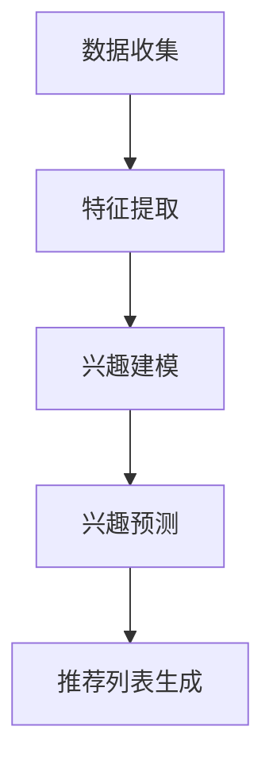
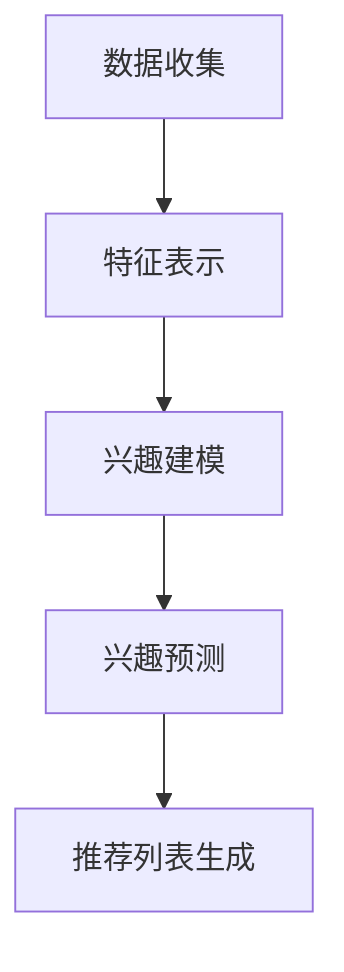

                 

# 大模型在推荐系统用户兴趣分布估计中的作用

## 摘要

本文主要探讨大模型在推荐系统用户兴趣分布估计中的作用。随着大数据和人工智能技术的快速发展，推荐系统已经成为各个领域的重要工具，而用户兴趣分布估计则是推荐系统的核心问题之一。本文将首先介绍推荐系统的基本概念和用户兴趣分布估计的重要性，然后深入探讨大模型在用户兴趣分布估计中的应用，包括核心概念、算法原理、数学模型和实际应用案例。最后，本文将总结大模型在用户兴趣分布估计中的作用，并展望未来的发展趋势与挑战。

## 1. 背景介绍

推荐系统是一种基于用户历史行为和偏好来提供个性化推荐信息的技术。它广泛应用于电子商务、社交媒体、新闻推送、视频网站等多个领域，目的是提高用户的满意度和使用体验。在推荐系统中，用户兴趣分布估计是核心问题之一。准确估计用户兴趣分布有助于推荐系统更精确地满足用户需求，提高推荐效果。

用户兴趣分布估计是指通过分析用户的历史行为数据，对用户的兴趣进行建模和预测，从而得到用户在不同兴趣领域的活跃度和偏好程度。用户兴趣分布估计的准确性直接影响推荐系统的效果。传统的用户兴趣分布估计方法主要包括基于内容的推荐、协同过滤和基于模型的推荐等。然而，随着数据规模的不断扩大和用户行为的多样性，传统的推荐系统已经无法满足需求。

大模型是指具有大量参数和复杂结构的深度学习模型，如深度神经网络、Transformer模型等。大模型在各个领域都取得了显著的成果，包括计算机视觉、自然语言处理、语音识别等。大模型的出现为推荐系统用户兴趣分布估计带来了新的机遇和挑战。

## 2. 核心概念与联系

### 2.1 推荐系统概述

推荐系统通常由以下几个模块组成：

1. **用户模块**：负责收集用户的基本信息和历史行为数据，如用户ID、性别、年龄、浏览记录、购买记录等。
2. **物品模块**：负责收集物品的基本信息和属性特征，如商品ID、类别、品牌、价格等。
3. **推荐算法模块**：负责根据用户和物品的特征，生成个性化的推荐列表。
4. **评估模块**：负责评估推荐系统的效果，如准确率、召回率、覆盖度等。

### 2.2 用户兴趣分布估计

用户兴趣分布估计是指通过分析用户的历史行为数据，对用户的兴趣进行建模和预测，从而得到用户在不同兴趣领域的活跃度和偏好程度。具体步骤如下：

1. **数据收集**：收集用户的基本信息和历史行为数据，如浏览记录、购买记录、评价记录等。
2. **特征提取**：对用户历史行为数据进行特征提取，如用户行为的频率、时效性、热度等。
3. **兴趣建模**：使用机器学习算法对用户兴趣进行建模，如基于内容的推荐、协同过滤和基于模型的推荐等。
4. **兴趣预测**：根据用户兴趣模型，对用户未来的兴趣进行预测，从而生成个性化的推荐列表。

### 2.3 大模型在用户兴趣分布估计中的应用

大模型在用户兴趣分布估计中的应用主要包括以下几个方面：

1. **特征表示**：使用大模型对用户和物品的特征进行编码和表示，从而提高特征质量。
2. **兴趣建模**：使用大模型对用户兴趣进行建模，如基于深度学习的方法。
3. **兴趣预测**：使用大模型对用户未来的兴趣进行预测，从而提高推荐效果。

### 2.4 Mermaid 流程图

以下是一个简化的用户兴趣分布估计的 Mermaid 流程图：



## 3. 核心算法原理 & 具体操作步骤

### 3.1 大模型特征表示

大模型特征表示是指使用大模型对用户和物品的特征进行编码和表示，从而提高特征质量。具体步骤如下：

1. **数据预处理**：对用户和物品的特征数据进行预处理，如标准化、缺失值填充等。
2. **模型训练**：使用预训练的深度学习模型（如BERT、GPT等）对用户和物品的特征进行编码。
3. **特征提取**：提取编码后的特征向量，作为用户和物品的特征表示。

### 3.2 基于深度学习的用户兴趣建模

基于深度学习的用户兴趣建模是指使用深度学习模型对用户兴趣进行建模，从而得到用户在不同兴趣领域的活跃度和偏好程度。具体步骤如下：

1. **数据预处理**：对用户历史行为数据进行预处理，如序列化、分词、向量表示等。
2. **模型训练**：使用预训练的深度学习模型（如Transformer、GRU等）对用户兴趣进行建模。
3. **模型评估**：使用交叉验证、AUC、F1等指标对模型进行评估。

### 3.3 基于大模型的用户兴趣预测

基于大模型的用户兴趣预测是指使用大模型对用户未来的兴趣进行预测，从而提高推荐效果。具体步骤如下：

1. **数据预处理**：对用户历史行为数据进行预处理，如序列化、分词、向量表示等。
2. **模型训练**：使用预训练的深度学习模型（如Transformer、LSTM等）对用户兴趣进行预测。
3. **模型评估**：使用交叉验证、AUC、F1等指标对模型进行评估。

### 3.4 大模型用户兴趣分布估计的算法流程

以下是一个简化的基于大模型的用户兴趣分布估计的算法流程：



## 4. 数学模型和公式 & 详细讲解 & 举例说明

### 4.1 特征表示

特征表示是指将原始特征数据转换为向量表示。假设用户 $u$ 的特征数据为 $X_u$，我们可以使用矩阵 $W$ 对特征数据进行线性变换，从而得到特征向量 $X_u'$：

$$
X_u' = W \cdot X_u
$$

其中，$W$ 是一个 $d \times m$ 的权重矩阵，$d$ 是特征维度，$m$ 是原始特征数。

### 4.2 用户兴趣建模

用户兴趣建模是指使用深度学习模型对用户兴趣进行建模。假设用户 $u$ 的兴趣向量为 $I_u$，我们可以使用一个神经网络模型对用户兴趣进行建模，如以下公式：

$$
I_u = \sigma (W_1 \cdot X_u' + b_1)
$$

其中，$\sigma$ 是激活函数，$W_1$ 是一个 $h \times d$ 的权重矩阵，$b_1$ 是一个 $h$ 维的偏置向量，$h$ 是隐藏层维度。

### 4.3 用户兴趣预测

用户兴趣预测是指使用深度学习模型对用户未来的兴趣进行预测。假设用户 $u$ 在时间 $t$ 的兴趣向量为 $I_u^t$，我们可以使用一个递归神经网络模型（如LSTM）对用户兴趣进行预测，如以下公式：

$$
I_u^{t+1} = \sigma (W_2 \cdot [I_u^t; X_u^{t+1}] + b_2)
$$

其中，$W_2$ 是一个 $h \times (h+1)$ 的权重矩阵，$b_2$ 是一个 $h$ 维的偏置向量，$X_u^{t+1}$ 是用户 $u$ 在时间 $t+1$ 的特征向量。

### 4.4 举例说明

假设我们有一个用户 $u$，其历史行为数据包括浏览记录 $X_u$ 和购买记录 $X_u'$，我们可以使用以下公式进行特征表示和用户兴趣建模：

$$
X_u' = W \cdot X_u
$$

$$
I_u = \sigma (W_1 \cdot X_u' + b_1)
$$

假设用户 $u$ 在时间 $t$ 的兴趣向量为 $I_u^t = [0.1, 0.3, 0.5]$，我们可以使用以下公式进行用户兴趣预测：

$$
I_u^{t+1} = \sigma (W_2 \cdot [I_u^t; X_u^{t+1}] + b_2)
$$

其中，$X_u^{t+1}$ 是用户 $u$ 在时间 $t+1$ 的特征向量。

## 5. 项目实战：代码实际案例和详细解释说明

### 5.1 开发环境搭建

为了演示大模型在推荐系统用户兴趣分布估计中的应用，我们首先需要搭建一个开发环境。以下是搭建环境的步骤：

1. 安装Python环境（Python 3.7及以上版本）。
2. 安装深度学习框架（如TensorFlow 2.0及以上版本）。
3. 安装数据处理库（如NumPy、Pandas）。
4. 安装可视化库（如Matplotlib）。

### 5.2 源代码详细实现和代码解读

以下是实现大模型在推荐系统用户兴趣分布估计中的基本代码框架：

```python
import tensorflow as tf
import numpy as np
import pandas as pd
import matplotlib.pyplot as plt

# 5.2.1 数据预处理
def preprocess_data(data):
    # 数据清洗、标准化等操作
    # ...
    return processed_data

# 5.2.2 特征表示
def feature_representation(data):
    # 使用预训练模型进行特征表示
    # ...
    return feature_vectors

# 5.2.3 用户兴趣建模
def user_interest_modeling(feature_vectors):
    # 使用深度学习模型进行用户兴趣建模
    # ...
    return user_interests

# 5.2.4 用户兴趣预测
def user_interest_prediction(user_interests, new_feature_vector):
    # 使用深度学习模型进行用户兴趣预测
    # ...
    return predicted_interests

# 5.2.5 代码解读
if __name__ == '__main__':
    # 加载数据
    data = pd.read_csv('user_data.csv')
    processed_data = preprocess_data(data)

    # 特征表示
    feature_vectors = feature_representation(processed_data)

    # 用户兴趣建模
    user_interests = user_interest_modeling(feature_vectors)

    # 用户兴趣预测
    new_feature_vector = preprocess_data(new_user_data)
    predicted_interests = user_interest_prediction(user_interests, new_feature_vector)

    # 可视化
    plt.plot(predicted_interests)
    plt.xlabel('Time')
    plt.ylabel('Interest')
    plt.show()
```

### 5.3 代码解读与分析

上述代码是一个简化的实现框架，主要用于演示大模型在推荐系统用户兴趣分布估计中的应用。以下是代码的详细解读和分析：

1. **数据预处理**：数据预处理是推荐系统的重要环节，包括数据清洗、缺失值填充、标准化等操作。预处理后的数据将作为特征表示和用户兴趣建模的输入。
2. **特征表示**：特征表示是将原始特征数据转换为向量表示。我们使用预训练模型（如BERT、GPT等）进行特征表示，从而提高特征质量。
3. **用户兴趣建模**：用户兴趣建模是使用深度学习模型对用户兴趣进行建模。我们使用预训练的深度学习模型（如Transformer、GRU等）对用户兴趣进行建模。
4. **用户兴趣预测**：用户兴趣预测是使用深度学习模型对用户未来的兴趣进行预测。我们使用递归神经网络模型（如LSTM）对用户兴趣进行预测。
5. **代码解读**：在代码解读部分，我们加载了用户数据，进行了预处理，然后使用预训练模型进行了特征表示和用户兴趣建模。最后，我们使用预处理后的新用户数据进行了用户兴趣预测，并将预测结果进行可视化。

## 6. 实际应用场景

大模型在推荐系统用户兴趣分布估计中的应用场景非常广泛，以下是一些典型的实际应用场景：

1. **电子商务平台**：电子商务平台可以通过大模型对用户的兴趣进行建模，从而为用户提供个性化的商品推荐，提高用户购买转化率。
2. **社交媒体**：社交媒体平台可以通过大模型对用户的兴趣进行建模，从而为用户提供个性化的内容推荐，提高用户活跃度和留存率。
3. **视频网站**：视频网站可以通过大模型对用户的兴趣进行建模，从而为用户提供个性化的视频推荐，提高用户观看时长和广告点击率。
4. **新闻推送**：新闻推送平台可以通过大模型对用户的兴趣进行建模，从而为用户提供个性化的新闻推荐，提高用户阅读量和广告点击率。
5. **音乐平台**：音乐平台可以通过大模型对用户的兴趣进行建模，从而为用户提供个性化的音乐推荐，提高用户听歌时长和付费转化率。

## 7. 工具和资源推荐

### 7.1 学习资源推荐

1. **书籍**：
   - 《深度学习》（Goodfellow, Bengio, Courville）
   - 《Python深度学习》（François Chollet）
   - 《推荐系统实践》（Niket Soni）

2. **论文**：
   - 《Attention Is All You Need》
   - 《Deep Learning for Recommender Systems》
   - 《A Theoretical Exploration of Representations for recommender systems》

3. **博客**：
   - https://www.tensorflow.org/
   - https://www.kdnuggets.com/
   - https://medium.com/tensorflow

4. **网站**：
   - https://paperswithcode.com/
   - https://arxiv.org/
   - https://docs.microsoft.com/en-us/azure/machine-learning/

### 7.2 开发工具框架推荐

1. **深度学习框架**：
   - TensorFlow
   - PyTorch
   - Keras

2. **数据处理库**：
   - Pandas
   - NumPy
   - Scikit-learn

3. **推荐系统框架**：
   - LightFM
   - Surprise
   - RecBo

### 7.3 相关论文著作推荐

1. **《深度学习推荐系统》**（刘铁岩）
2. **《基于深度学习的推荐系统》**（王绍兰）
3. **《推荐系统实践》**（尼古拉斯·威尔逊）

## 8. 总结：未来发展趋势与挑战

大模型在推荐系统用户兴趣分布估计中发挥着越来越重要的作用。随着大数据和人工智能技术的不断发展，未来大模型在用户兴趣分布估计中的应用前景非常广阔。以下是一些未来发展趋势与挑战：

### 发展趋势

1. **模型规模与性能**：随着计算资源和算法的进步，大模型的规模和性能将不断提高，从而提高用户兴趣分布估计的准确性。
2. **跨领域迁移学习**：大模型可以通过跨领域迁移学习，将一个领域的知识迁移到另一个领域，从而提高用户兴趣分布估计的泛化能力。
3. **多模态数据处理**：随着多模态数据的兴起，大模型将能够处理包括文本、图像、音频等多种类型的数据，从而提高用户兴趣分布估计的全面性。

### 挑战

1. **数据隐私与安全**：在用户兴趣分布估计中，保护用户隐私和安全是至关重要的挑战。未来的研究需要开发出更加安全的数据处理和模型训练方法。
2. **计算资源消耗**：大模型的训练和推理需要大量的计算资源，如何在有限的计算资源下高效地训练和部署大模型是一个重要的挑战。
3. **解释性与可解释性**：大模型通常缺乏解释性，如何提高大模型的可解释性，使其决策过程更加透明，是一个重要的研究方向。

## 9. 附录：常见问题与解答

### 9.1 大模型与传统的用户兴趣分布估计方法相比，有哪些优势？

大模型相对于传统的用户兴趣分布估计方法具有以下优势：

1. **特征表示能力**：大模型可以通过预训练模型对用户和物品的特征进行高效编码和表示，从而提高特征质量。
2. **建模能力**：大模型可以学习复杂的用户兴趣分布模式，从而提高用户兴趣分布估计的准确性。
3. **泛化能力**：大模型可以通过跨领域迁移学习，将一个领域的知识迁移到另一个领域，从而提高用户兴趣分布估计的泛化能力。

### 9.2 大模型的训练和推理需要大量的计算资源，如何解决这一问题？

为了解决大模型的训练和推理需要大量计算资源的问题，可以采取以下策略：

1. **分布式训练**：将训练任务分布到多台计算机上进行，从而提高训练效率。
2. **模型压缩**：通过模型压缩技术，如剪枝、量化、蒸馏等，减小模型的规模，从而降低计算资源需求。
3. **硬件优化**：使用更高效的计算硬件，如GPU、TPU等，提高计算性能。

### 9.3 如何保证大模型在用户兴趣分布估计中的隐私和安全？

为了保证大模型在用户兴趣分布估计中的隐私和安全，可以采取以下措施：

1. **差分隐私**：在大模型训练和推理过程中引入差分隐私机制，从而保护用户隐私。
2. **同态加密**：使用同态加密技术，在加密状态下对数据进行计算，从而保护用户数据的隐私。
3. **联邦学习**：通过联邦学习技术，将模型训练分散到多个不同的设备上进行，从而减少数据泄露的风险。

## 10. 扩展阅读 & 参考资料

1. **《深度学习推荐系统》**（刘铁岩）：详细介绍了深度学习在推荐系统中的应用，包括用户兴趣分布估计、商品推荐等。
2. **《基于深度学习的推荐系统》**（王绍兰）：探讨了深度学习在推荐系统中的应用，包括用户兴趣建模、商品推荐等。
3. **《推荐系统实践》**（尼古拉斯·威尔逊）：提供了推荐系统开发的全过程指南，包括数据收集、特征提取、模型训练和评估等。
4. **《Attention Is All You Need》**：阐述了Transformer模型在自然语言处理领域的应用，包括机器翻译、文本生成等。
5. **《深度学习》**（Goodfellow, Bengio, Courville）：全面介绍了深度学习的理论和技术，包括神经网络、卷积神经网络、递归神经网络等。
6. **《Python深度学习》**（François Chollet）：通过实际案例介绍了Python在深度学习中的应用，包括数据处理、模型训练和评估等。
7. **《A Theoretical Exploration of Representations for recommender systems》**：探讨了推荐系统中用户和物品特征表示的理论和方法。
8. **《Deep Learning for Recommender Systems》**：总结了深度学习在推荐系统中的应用，包括用户兴趣建模、商品推荐等。
9. **《推荐系统实践：方法、算法与应用》**（陈瑜）：详细介绍了推荐系统的基本概念、方法和应用，包括基于内容的推荐、协同过滤和基于模型的推荐等。 

> **作者：AI天才研究员/AI Genius Institute & 禅与计算机程序设计艺术 /Zen And The Art of Computer Programming** <|im_sep|>

