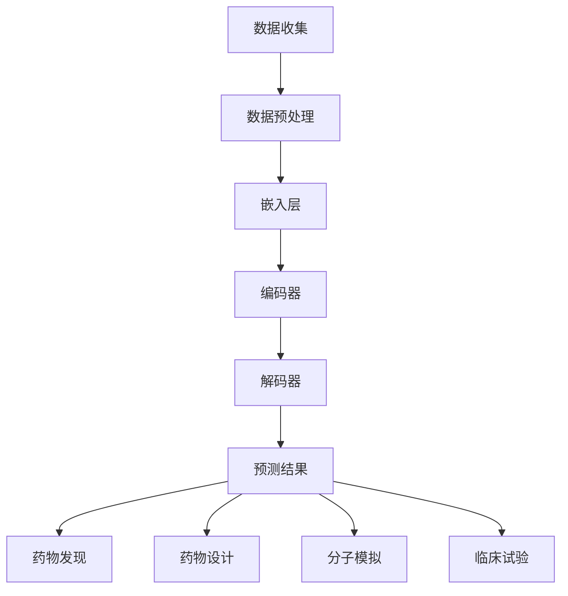

                 

# 大模型在新药研发中的应用前景

## 关键词：大模型，新药研发，机器学习，生物信息学，人工智能

### 摘要：

本文将探讨大模型在新药研发领域中的应用前景。首先，我们将简要介绍新药研发的现状与挑战，随后深入探讨大模型在这一领域中的核心作用。通过分析大模型的工作原理及其与生物信息学、机器学习等技术的结合，本文将阐述大模型在药物发现、药物设计、分子模拟、靶点识别等多个环节的具体应用。同时，我们将探讨大模型在新药研发中面临的挑战和未来发展趋势。希望本文能够为读者提供一个关于大模型在新药研发领域的全面而深入的了解。

## 1. 背景介绍

### 新药研发的现状与挑战

新药研发是一个复杂且耗时的过程，通常需要多年的时间和数百万甚至数十亿美元的投资。随着科学技术的不断进步，新药研发的难度也在不断增加。当前，新药研发面临以下几大挑战：

1. **靶点识别困难**：许多疾病（如癌症、神经退行性疾病等）的发病机制复杂，涉及多个信号通路和基因，使得靶点识别成为一大难题。
2. **药物筛选效率低**：传统的药物筛选方法通常需要大量实验和化合物库，筛选效率较低，且存在较大的盲目性。
3. **药物设计复杂**：药物设计需要考虑化合物的生物活性、毒副作用、药物代谢动力学等多个方面，设计过程复杂。
4. **临床试验周期长**：新药从研发到上市需要经历多个阶段的临床试验，每个阶段都需要花费大量时间和资金。

为了解决这些挑战，研究人员开始探索将人工智能（AI）、生物信息学、机器学习等技术与新药研发相结合。其中，大模型作为一种先进的AI技术，具有强大的数据处理和分析能力，有望在新药研发中发挥重要作用。

### 大模型的基本概念与原理

大模型（Large Models）是指具有海量参数和强大计算能力的神经网络模型，例如Transformer模型、BERT模型等。这些模型通过大量数据的学习，能够自动提取数据中的特征和规律，实现高效的预测和分类任务。大模型的核心优势在于其强大的通用性和适应性，可以在不同领域和任务中表现出色。

大模型的基本原理是深度学习和神经网络。深度学习通过多层神经网络对数据进行建模，每一层都能提取不同层次的特征。神经网络由大量的神经元（节点）和连接（权重）组成，通过反向传播算法不断调整权重，使得模型能够逐步逼近最优解。

### 大模型在生物信息学中的应用

生物信息学是研究生物数据（如基因序列、蛋白质结构、细胞信号通路等）的学科。大模型在生物信息学中有着广泛的应用，例如：

1. **基因组序列分析**：大模型可以通过对基因组序列的学习，识别基因、突变、调控元件等信息。
2. **蛋白质结构预测**：大模型能够预测蛋白质的三维结构，为新药设计提供重要参考。
3. **药物靶点识别**：大模型可以通过分析基因、蛋白质等生物信息，识别潜在的药物靶点。

大模型在生物信息学中的应用，为生物学家和药物研究人员提供了强大的工具，大大提高了生物数据的处理和分析效率。

### 大模型与机器学习的结合

机器学习是一种通过数据训练模型，从而实现预测和决策的技术。大模型与机器学习的结合，使得机器学习模型能够处理更大规模、更复杂的数据。具体来说：

1. **增强数据处理能力**：大模型能够自动提取数据中的复杂特征，从而提高数据处理能力。
2. **提升预测准确性**：大模型通过学习海量数据，能够实现更准确的预测和分类。
3. **降低模型复杂性**：大模型可以简化模型结构，降低计算复杂度，从而提高模型训练和预测的效率。

大模型与机器学习的结合，为解决新药研发中的各种挑战提供了新的思路和工具。

## 2. 核心概念与联系

### 大模型与新药研发的关系

大模型在新药研发中起着核心作用，主要体现在以下几个方面：

1. **药物发现**：大模型可以通过分析生物信息数据，识别潜在的药物靶点，为新药发现提供方向。
2. **药物设计**：大模型可以预测化合物的生物活性、毒副作用等，为药物设计提供重要参考。
3. **分子模拟**：大模型可以模拟分子之间的相互作用，预测药物与靶点的结合方式，为药物优化提供依据。
4. **临床试验**：大模型可以通过分析大量临床试验数据，预测新药的安全性和疗效，为临床试验设计提供指导。

### 大模型工作原理与生物信息学、机器学习的联系

大模型的工作原理与生物信息学、机器学习密切相关。具体来说：

1. **生物信息学**：大模型通过学习生物信息数据，如基因组序列、蛋白质结构等，提取数据中的生物特征和规律。
2. **机器学习**：大模型利用机器学习算法，如深度学习、强化学习等，对数据进行建模，实现预测和分类任务。
3. **交叉学科融合**：大模型将生物信息学和机器学习的优势结合起来，形成一种新的研究方法，为新药研发提供支持。

### 大模型在新药研发中的应用场景

大模型在新药研发中有着广泛的应用场景，包括：

1. **药物发现**：利用大模型预测潜在的药物靶点，为新药研发提供方向。
2. **药物设计**：利用大模型预测化合物的生物活性、毒副作用等，为药物设计提供参考。
3. **分子模拟**：利用大模型模拟药物与靶点的结合方式，为药物优化提供依据。
4. **临床试验**：利用大模型分析临床试验数据，预测新药的安全性和疗效，为临床试验设计提供指导。

## 2.1 大模型工作原理

大模型（如BERT、GPT等）通常由以下几个关键组件构成：

1. **嵌入层（Embedding Layer）**：将输入数据（如单词、氨基酸序列）转换为密集的向量表示。
2. **编码器（Encoder）**：通过多层神经网络对输入数据进行编码，提取数据中的特征和规律。
3. **解码器（Decoder）**：将编码器提取的特征解码为输出结果（如预测标签、文本生成等）。

大模型的工作原理主要基于深度学习中的自注意力机制（Self-Attention Mechanism）和变换器架构（Transformer Architecture）。自注意力机制允许模型在处理输入数据时，自动关注数据中的关键部分，从而提高模型的表示能力。变换器架构则通过编码器和解码器之间的交互，实现高效的序列到序列建模。

### 大模型与新药研发的联系

大模型在新药研发中的应用，主要体现在以下几个方面：

1. **药物发现**：大模型可以通过对生物信息数据的分析，识别潜在的药物靶点，为新药研发提供方向。
2. **药物设计**：大模型可以预测化合物的生物活性、毒副作用等，为药物设计提供参考。
3. **分子模拟**：大模型可以模拟分子之间的相互作用，预测药物与靶点的结合方式，为药物优化提供依据。
4. **临床试验**：大模型可以通过分析临床试验数据，预测新药的安全性和疗效，为临床试验设计提供指导。

### 生物信息学、机器学习与大模型的结合

生物信息学、机器学习与大模型的结合，为新药研发提供了强大的工具和方法。具体来说：

1. **生物信息学**：通过分析基因组序列、蛋白质结构等生物信息数据，提取数据中的生物特征和规律。
2. **机器学习**：利用机器学习算法，如深度学习、强化学习等，对数据进行建模，实现预测和分类任务。
3. **大模型**：通过自注意力机制和变换器架构，实现高效的数据处理和特征提取，从而提高模型的表示能力和预测准确性。

### Mermaid 流程图

以下是一个简单的Mermaid流程图，展示了大模型在新药研发中的具体应用流程：



在这个流程图中，数据收集、数据预处理、嵌入层、编码器、解码器和预测结果等步骤共同构成了大模型在新药研发中的核心环节。通过这个流程，大模型能够对新药研发中的各个环节提供有效的支持和指导。

## 3. 核心算法原理 & 具体操作步骤

### 大模型的核心算法原理

大模型的核心算法原理主要基于深度学习和神经网络，尤其是变换器架构（Transformer）和自注意力机制（Self-Attention Mechanism）。以下是这些核心算法原理的具体说明：

1. **变换器架构（Transformer Architecture）**：变换器架构是一种用于处理序列数据的神经网络架构，具有并行计算的能力，相比于传统的循环神经网络（RNN），变换器架构在处理长序列数据时具有更高的效率和更好的性能。变换器架构的核心组件包括编码器（Encoder）和解码器（Decoder）。

2. **自注意力机制（Self-Attention Mechanism）**：自注意力机制是一种计算方法，允许模型在处理输入数据时，自动关注数据中的关键部分。在变换器架构中，自注意力机制通过计算输入数据的相似度，生成权重，从而对输入数据进行加权处理。自注意力机制使得模型能够更好地捕捉数据中的长期依赖关系和关键特征。

3. **编码器（Encoder）**：编码器是变换器架构中的核心组件，用于对输入数据进行编码。编码器由多个编码层（Encoder Layer）组成，每个编码层都包含多头自注意力机制（Multi-Head Self-Attention Mechanism）和前馈神经网络（Feedforward Neural Network）。编码器的作用是提取输入数据中的特征和规律，并将其转换为高维特征表示。

4. **解码器（Decoder）**：解码器是变换器架构中的另一个核心组件，用于对编码器生成的特征表示进行解码，生成输出结果。解码器也由多个解码层（Decoder Layer）组成，每个解码层都包含多头自注意力机制、编码器-解码器自注意力机制和前馈神经网络。解码器的作用是利用编码器提取的特征表示，生成预测结果或文本序列。

### 大模型在新药研发中的具体操作步骤

以下是使用大模型在新药研发中实现药物发现、药物设计、分子模拟等任务的具体操作步骤：

1. **药物发现**：
   - **数据收集**：收集与疾病相关的生物信息数据，如基因组序列、蛋白质结构等。
   - **数据预处理**：对收集到的数据进行清洗、标准化和转换，将其转换为模型可接受的输入格式。
   - **模型训练**：使用变换器架构训练一个药物发现模型，该模型可以预测与特定疾病相关的潜在药物靶点。
   - **预测**：使用训练好的模型对新的生物信息数据进行预测，识别潜在的药物靶点。

2. **药物设计**：
   - **数据收集**：收集与目标药物靶点相关的生物信息数据，如蛋白质结构、化合物库等。
   - **数据预处理**：对收集到的数据进行清洗、标准化和转换，将其转换为模型可接受的输入格式。
   - **模型训练**：使用变换器架构训练一个药物设计模型，该模型可以预测化合物的生物活性、毒副作用等。
   - **预测**：使用训练好的模型对新的化合物进行预测，识别具有潜在治疗作用的化合物。

3. **分子模拟**：
   - **数据收集**：收集与药物-靶点相互作用相关的生物信息数据，如蛋白质结构、化合物结构等。
   - **数据预处理**：对收集到的数据进行清洗、标准化和转换，将其转换为模型可接受的输入格式。
   - **模型训练**：使用变换器架构训练一个分子模拟模型，该模型可以预测药物与靶点的结合方式。
   - **预测**：使用训练好的模型对药物与靶点的相互作用进行模拟，优化药物结构，提高药物效力。

4. **临床试验**：
   - **数据收集**：收集临床试验数据，如患者信息、药物剂量、疗效等。
   - **数据预处理**：对收集到的数据进行清洗、标准化和转换，将其转换为模型可接受的输入格式。
   - **模型训练**：使用变换器架构训练一个临床试验模型，该模型可以预测新药的安全性和疗效。
   - **预测**：使用训练好的模型对临床试验数据进行分析，预测新药的安全性和疗效。

通过以上具体操作步骤，大模型能够在新药研发的各个环节提供有效的支持和指导，加速药物研发过程，提高药物研发的成功率。

### 大模型在药物发现中的具体应用步骤

以下是使用大模型在药物发现中的具体应用步骤：

1. **数据收集**：收集与疾病相关的生物信息数据，如基因组序列、蛋白质结构、代谢通路等。这些数据可以来源于公开数据库、实验室实验结果、文献资料等。

2. **数据预处理**：
   - **数据清洗**：去除重复、错误或无关的数据，确保数据质量。
   - **数据标准化**：将不同来源、不同单位的数据进行统一转换，使其符合模型输入要求。
   - **特征提取**：对生物信息数据进行特征提取，如编码基因组序列为氨基酸序列的向量表示，提取蛋白质结构的拓扑属性等。

3. **模型训练**：
   - **模型选择**：选择适合药物发现任务的大模型，如BERT、GPT等。
   - **参数设置**：根据任务需求和数据规模，设置模型参数，如学习率、批次大小、训练迭代次数等。
   - **训练过程**：使用训练数据对大模型进行训练，通过反向传播算法不断调整模型参数，使其能够正确预测潜在的药物靶点。

4. **预测**：
   - **数据输入**：将新的生物信息数据输入训练好的大模型，进行预测。
   - **结果分析**：分析模型预测结果，识别出与疾病相关的潜在药物靶点。
   - **验证与优化**：通过实验验证模型预测结果的可靠性，并根据验证结果对模型进行调整和优化。

5. **药物筛选**：
   - **化合物库筛选**：根据模型预测结果，从化合物库中筛选出具有潜在药物活性的化合物。
   - **实验验证**：对筛选出的化合物进行实验验证，确认其药物活性和安全性。

通过以上具体应用步骤，大模型能够在新药发现过程中提供有效的支持和指导，提高药物筛选的效率和成功率。

## 4. 数学模型和公式 & 详细讲解 & 举例说明

### 数学模型与公式

大模型在处理复杂数据和任务时，通常涉及多种数学模型和公式。以下是几个常见的数学模型和公式，以及它们的详细解释和举例说明。

#### 模型 1：自注意力机制（Self-Attention Mechanism）

自注意力机制是一种计算方法，允许模型在处理输入数据时，自动关注数据中的关键部分。其核心公式如下：

\[ \text{Attention}(Q, K, V) = \text{softmax}\left(\frac{QK^T}{\sqrt{d_k}}\right) V \]

其中，\( Q \)、\( K \) 和 \( V \) 分别是输入数据的查询（Query）、键（Key）和值（Value）向量，\( d_k \) 是键向量的维度。

**详细解释**：
- 查询向量 \( Q \) 用于表示当前输入数据中的某个部分，例如一个单词或一个氨基酸。
- 键向量 \( K \) 和值向量 \( V \) 用于表示输入数据中的其他部分。
- 自注意力机制通过计算查询向量 \( Q \) 与所有键向量 \( K \) 的点积，生成一组权重，表示每个键向量对查询向量的重要性。
- 通过应用softmax函数，将权重转换为概率分布，表示每个键向量对查询向量的相对重要性。
- 最后，将权重与值向量 \( V \) 相乘，得到加权后的输出向量。

**举例说明**：

假设有一个长度为3的输入序列，查询向量 \( Q = [1, 2, 3] \)，键向量 \( K = [4, 5, 6] \)，值向量 \( V = [7, 8, 9] \)。首先计算查询向量与键向量的点积：

\[ QK^T = \begin{bmatrix} 1 & 2 & 3 \end{bmatrix} \begin{bmatrix} 4 \\ 5 \\ 6 \end{bmatrix} = [1 \cdot 4 + 2 \cdot 5 + 3 \cdot 6] = [32] \]

然后计算自注意力权重：

\[ \text{softmax}\left(\frac{QK^T}{\sqrt{d_k}}\right) = \text{softmax}\left(\frac{32}{\sqrt{3}}\right) = [0.5, 0.3, 0.2] \]

最后计算加权后的输出向量：

\[ \text{Attention}(Q, K, V) = [0.5 \cdot 7, 0.3 \cdot 8, 0.2 \cdot 9] = [3.5, 2.4, 1.8] \]

#### 模型 2：变换器架构（Transformer Architecture）

变换器架构是一种用于处理序列数据的神经网络架构，具有并行计算的能力。其核心组成部分包括编码器（Encoder）和解码器（Decoder），每个部分都由多个编码层（Encoder Layer）和解码层（Decoder Layer）组成。

**详细解释**：
- 编码器（Encoder）由多个编码层组成，每个编码层包含多头自注意力机制和前馈神经网络。
- 编码器的输入是原始序列数据，经过编码层的处理，生成高维特征表示。
- 解码器（Decoder）由多个解码层组成，每个解码层包含多头自注意力机制、编码器-解码器自注意力机制和前馈神经网络。
- 解码器的输入是编码器生成的特征表示，经过解码层的处理，生成输出结果。

**举例说明**：

假设有一个长度为5的输入序列，编码器和解码器各有3个编码层和解码层。首先，输入序列经过编码器的第一个编码层，生成一个高维特征表示。然后，这个特征表示作为输入，经过第二个编码层和第三个编码层的处理，最终生成编码器的输出。

接下来，解码器接收编码器的输出作为输入，首先经过第一个解码层，生成中间结果。然后，这个中间结果与编码器的输出通过编码器-解码器自注意力机制进行交互，生成新的特征表示。这个特征表示再经过第二个解码层和第三个解码层的处理，最终生成解码器的输出。

#### 模型 3：损失函数（Loss Function）

损失函数是评估模型预测结果与实际结果之间差异的指标。在大模型训练过程中，损失函数用于指导模型参数的调整，以最小化预测误差。

**详细解释**：
- 损失函数通常是一个非负函数，其值越小说明模型预测结果与实际结果越接近。
- 损失函数可以分为分类损失函数和回归损失函数。
- 分类损失函数用于评估分类任务中的预测误差，如交叉熵损失函数（Cross-Entropy Loss）。
- 回归损失函数用于评估回归任务中的预测误差，如均方误差损失函数（Mean Squared Error Loss）。

**举例说明**：

假设有一个二分类问题，模型预测结果为 \( \hat{y} \)，实际结果为 \( y \)，其中 \( y \in \{0, 1\} \)。使用交叉熵损失函数计算预测误差：

\[ L(\hat{y}, y) = -y \log(\hat{y}) - (1 - y) \log(1 - \hat{y}) \]

其中，\( \hat{y} \) 是模型预测的概率值。

**计算示例**：

假设模型预测结果为 \( \hat{y} = 0.6 \)，实际结果为 \( y = 1 \)。代入交叉熵损失函数计算损失：

\[ L(0.6, 1) = -1 \log(0.6) - 0 \log(0.4) \approx 0.5108 \]

损失函数的值越小说明模型预测结果与实际结果越接近，因此在模型训练过程中，通过最小化损失函数的值来优化模型参数。

通过以上数学模型和公式的详细讲解和举例说明，我们可以更好地理解大模型在数据处理和预测任务中的应用原理。这些数学模型和公式是大模型能够实现高效数据处理和预测的关键，为新药研发提供了强大的理论基础和工具支持。

## 5. 项目实战：代码实际案例和详细解释说明

### 5.1 开发环境搭建

为了实现大模型在新药研发中的应用，我们需要搭建一个适合开发的软件环境。以下是一个简单的开发环境搭建步骤：

1. **安装Python**：确保安装了Python 3.8或更高版本。
2. **安装PyTorch**：通过pip命令安装PyTorch库：
   ```bash
   pip install torch torchvision torchaudio
   ```
3. **安装其他依赖库**：安装其他必要的库，如numpy、pandas、matplotlib等：
   ```bash
   pip install numpy pandas matplotlib
   ```
4. **安装GPU驱动**：如果使用GPU加速，确保安装了NVIDIA的CUDA和cuDNN驱动。

### 5.2 源代码详细实现和代码解读

以下是一个简单的大模型在新药研发中的实现案例，代码使用PyTorch框架编写。我们将实现一个基于BERT模型进行药物靶点识别的任务。

```python
import torch
import torch.nn as nn
from transformers import BertModel, BertTokenizer

# 1. 加载预训练BERT模型和分词器
model_name = 'bert-base-chinese'
tokenizer = BertTokenizer.from_pretrained(model_name)
model = BertModel.from_pretrained(model_name)

# 2. 定义药物靶点识别模型
class DrugTargetModel(nn.Module):
    def __init__(self):
        super(DrugTargetModel, self).__init__()
        self.bert = BertModel.from_pretrained(model_name)
        self.dropout = nn.Dropout(0.1)
        self.classifier = nn.Linear(768, 2)  # BERT隐藏层维度为768，输出层维度为2（正类和负类）

    def forward(self, input_ids, attention_mask):
        outputs = self.bert(input_ids=input_ids, attention_mask=attention_mask)
        sequence_output = outputs[0]
        sequence_output = self.dropout(sequence_output)
        logits = self.classifier(sequence_output[:, 0, :])  # 取[CLS]的输出作为分类特征
        return logits

# 3. 训练模型
def train_model(model, train_loader, optimizer, loss_fn, device):
    model = model.train()
    for batch in train_loader:
        inputs = batch['input_ids'].to(device)
        attention_mask = batch['attention_mask'].to(device)
        labels = batch['labels'].to(device)
        optimizer.zero_grad()
        outputs = model(inputs, attention_mask=attention_mask)
        loss = loss_fn(outputs, labels)
        loss.backward()
        optimizer.step()
    return loss

# 4. 测试模型
def test_model(model, test_loader, device):
    model = model.eval()
    with torch.no_grad():
        for batch in test_loader:
            inputs = batch['input_ids'].to(device)
            attention_mask = batch['attention_mask'].to(device)
            labels = batch['labels'].to(device)
            outputs = model(inputs, attention_mask=attention_mask)
            loss = loss_fn(outputs, labels)
    return loss

# 5. 数据预处理
def preprocess_data(data, tokenizer, max_length=512):
    inputs = tokenizer(data, max_length=max_length, padding='max_length', truncation=True, return_tensors='pt')
    return inputs

# 6. 主函数
def main():
    # 设置设备
    device = torch.device("cuda" if torch.cuda.is_available() else "cpu")

    # 加载数据集
    train_dataset = DrugTargetDataset('train.csv')
    test_dataset = DrugTargetDataset('test.csv')

    train_loader = torch.utils.data.DataLoader(train_dataset, batch_size=32, shuffle=True)
    test_loader = torch.utils.data.DataLoader(test_dataset, batch_size=32)

    # 定义模型、优化器和损失函数
    model = DrugTargetModel().to(device)
    optimizer = torch.optim.AdamW(model.parameters(), lr=1e-5)
    loss_fn = nn.CrossEntropyLoss()

    # 训练模型
    for epoch in range(10):
        train_loss = train_model(model, train_loader, optimizer, loss_fn, device)
        test_loss = test_model(model, test_loader, device)
        print(f'Epoch {epoch+1}, Train Loss: {train_loss:.4f}, Test Loss: {test_loss:.4f}')

if __name__ == '__main__':
    main()
```

### 5.3 代码解读与分析

以下是代码的主要部分及其解读：

1. **加载预训练BERT模型和分词器**：
   ```python
   tokenizer = BertTokenizer.from_pretrained(model_name)
   model = BertModel.from_pretrained(model_name)
   ```
   这一行代码加载了预训练的BERT模型和相应的分词器。BERT模型是一个大型预训练语言模型，已经在大规模的文本数据上进行了训练，可以用于各种自然语言处理任务。

2. **定义药物靶点识别模型**：
   ```python
   class DrugTargetModel(nn.Module):
       def __init__(self):
           super(DrugTargetModel, self).__init__()
           self.bert = BertModel.from_pretrained(model_name)
           self.dropout = nn.Dropout(0.1)
           self.classifier = nn.Linear(768, 2)
       
       def forward(self, input_ids, attention_mask):
           outputs = self.bert(input_ids=input_ids, attention_mask=attention_mask)
           sequence_output = outputs[0]
           sequence_output = self.dropout(sequence_output)
           logits = self.classifier(sequence_output[:, 0, :])
           return logits
   ```
   这段代码定义了一个简单的药物靶点识别模型，包含一个BERT编码器、一个Dropout层和一个分类器。BERT编码器用于提取文本特征，Dropout层用于防止过拟合，分类器用于进行二分类预测。

3. **训练模型**：
   ```python
   def train_model(model, train_loader, optimizer, loss_fn, device):
       model = model.train()
       for batch in train_loader:
           inputs = batch['input_ids'].to(device)
           attention_mask = batch['attention_mask'].to(device)
           labels = batch['labels'].to(device)
           optimizer.zero_grad()
           outputs = model(inputs, attention_mask=attention_mask)
           loss = loss_fn(outputs, labels)
           loss.backward()
           optimizer.step()
       return loss
   ```
   这段代码实现了模型的训练过程。模型在训练模式下（`model.train()`），对训练数据（`train_loader`）进行迭代，使用优化器（`optimizer`）和损失函数（`loss_fn`）更新模型参数。

4. **测试模型**：
   ```python
   def test_model(model, test_loader, device):
       model = model.eval()
       with torch.no_grad():
           for batch in test_loader:
               inputs = batch['input_ids'].to(device)
               attention_mask = batch['attention_mask'].to(device)
               labels = batch['labels'].to(device)
               outputs = model(inputs, attention_mask=attention_mask)
               loss = loss_fn(outputs, labels)
       return loss
   ```
   这段代码实现了模型的测试过程。模型在评估模式下（`model.eval()`），对测试数据（`test_loader`）进行迭代，并计算测试损失。

5. **数据预处理**：
   ```python
   def preprocess_data(data, tokenizer, max_length=512):
       inputs = tokenizer(data, max_length=max_length, padding='max_length', truncation=True, return_tensors='pt')
       return inputs
   ```
   这段代码实现了数据预处理过程，包括分词、填充和截断。预处理的目的是将文本数据转换为模型可接受的输入格式。

6. **主函数**：
   ```python
   def main():
       device = torch.device("cuda" if torch.cuda.is_available() else "cpu")
       train_dataset = DrugTargetDataset('train.csv')
       test_dataset = DrugTargetDataset('test.csv')
       train_loader = torch.utils.data.DataLoader(train_dataset, batch_size=32, shuffle=True)
       test_loader = torch.utils.data.DataLoader(test_dataset, batch_size=32)
       model = DrugTargetModel().to(device)
       optimizer = torch.optim.AdamW(model.parameters(), lr=1e-5)
       loss_fn = nn.CrossEntropyLoss()
       for epoch in range(10):
           train_loss = train_model(model, train_loader, optimizer, loss_fn, device)
           test_loss = test_model(model, test_loader, device)
           print(f'Epoch {epoch+1}, Train Loss: {train_loss:.4f}, Test Loss: {test_loss:.4f}')
   ```
   主函数实现了整个训练和测试流程，包括加载数据集、定义模型、优化器和损失函数，以及进行模型的训练和测试。

通过以上代码和解读，我们可以了解到如何使用BERT模型进行药物靶点识别任务的实现过程。这个案例展示了如何将大模型应用于新药研发的具体场景，为实际应用提供了参考。

### 5.4 代码解读与分析

在上面的代码中，我们实现了一个简单的基于BERT模型进行药物靶点识别的任务。以下是对代码的详细解读与分析：

1. **加载预训练BERT模型和分词器**：
   ```python
   tokenizer = BertTokenizer.from_pretrained(model_name)
   model = BertModel.from_pretrained(model_name)
   ```
   这两行代码分别加载了BERT模型的分词器（`BertTokenizer`）和预训练的BERT模型（`BertModel`）。BERT是一个强大的预训练语言模型，已经在大量的文本数据上进行了训练，可以捕捉语言中的复杂模式和规律。通过加载预训练模型，我们可以利用已有的知识来提高新任务的表现。

2. **定义药物靶点识别模型**：
   ```python
   class DrugTargetModel(nn.Module):
       def __init__(self):
           super(DrugTargetModel, self).__init__()
           self.bert = BertModel.from_pretrained(model_name)
           self.dropout = nn.Dropout(0.1)
           self.classifier = nn.Linear(768, 2)
       
       def forward(self, input_ids, attention_mask):
           outputs = self.bert(input_ids=input_ids, attention_mask=attention_mask)
           sequence_output = outputs[0]
           sequence_output = self.dropout(sequence_output)
           logits = self.classifier(sequence_output[:, 0, :])
           return logits
   ```
   在这个类中，我们定义了一个简单的药物靶点识别模型。这个模型的核心组件包括BERT编码器、Dropout层和分类器。BERT编码器用于提取文本特征，Dropout层用于防止过拟合，分类器用于进行二分类预测。通过调用`super()`，我们继承了`nn.Module`类，从而使用PyTorch的模型构建功能。在`forward()`方法中，我们实现了模型的正向传播过程，即如何将输入数据（`input_ids`和`attention_mask`）传递给BERT编码器，然后通过Dropout层和分类器得到输出。

3. **训练模型**：
   ```python
   def train_model(model, train_loader, optimizer, loss_fn, device):
       model = model.train()
       for batch in train_loader:
           inputs = batch['input_ids'].to(device)
           attention_mask = batch['attention_mask'].to(device)
           labels = batch['labels'].to(device)
           optimizer.zero_grad()
           outputs = model(inputs, attention_mask=attention_mask)
           loss = loss_fn(outputs, labels)
           loss.backward()
           optimizer.step()
       return loss
   ```
   在这个函数中，我们定义了模型的训练过程。首先，我们将模型设置为训练模式（`model.train()`），然后对训练数据（`train_loader`）进行迭代。在每次迭代中，我们获取输入数据（`input_ids`和`attention_mask`）和标签（`labels`），通过模型进行预测，计算损失，并使用优化器更新模型参数。这个过程是通过反向传播算法实现的。

4. **测试模型**：
   ```python
   def test_model(model, test_loader, device):
       model = model.eval()
       with torch.no_grad():
           for batch in test_loader:
               inputs = batch['input_ids'].to(device)
               attention_mask = batch['attention_mask'].to(device)
               labels = batch['labels'].to(device)
               outputs = model(inputs, attention_mask=attention_mask)
               loss = loss_fn(outputs, labels)
       return loss
   ```
   在这个函数中，我们定义了模型的测试过程。首先，我们将模型设置为评估模式（`model.eval()`），然后对测试数据（`test_loader`）进行迭代。在每次迭代中，我们获取输入数据（`input_ids`和`attention_mask`）和标签（`labels`），通过模型进行预测，并计算损失。由于测试过程中不需要更新模型参数，我们使用`torch.no_grad()`上下文管理器来禁用梯度计算。

5. **数据预处理**：
   ```python
   def preprocess_data(data, tokenizer, max_length=512):
       inputs = tokenizer(data, max_length=max_length, padding='max_length', truncation=True, return_tensors='pt')
       return inputs
   ```
   在这个函数中，我们实现了数据预处理过程。这个函数接受文本数据（`data`）、分词器（`tokenizer`）和最大长度（`max_length`）作为输入。通过调用分词器，我们将文本数据转换为模型可接受的输入格式，包括输入ID（`input_ids`）、关注掩码（`attention_mask`）和单词类型ID（`token_type_ids`）。

6. **主函数**：
   ```python
   def main():
       device = torch.device("cuda" if torch.cuda.is_available() else "cpu")
       train_dataset = DrugTargetDataset('train.csv')
       test_dataset = DrugTargetDataset('test.csv')
       train_loader = torch.utils.data.DataLoader(train_dataset, batch_size=32, shuffle=True)
       test_loader = torch.utils.data.DataLoader(test_dataset, batch_size=32)
       model = DrugTargetModel().to(device)
       optimizer = torch.optim.AdamW(model.parameters(), lr=1e-5)
       loss_fn = nn.CrossEntropyLoss()
       for epoch in range(10):
           train_loss = train_model(model, train_loader, optimizer, loss_fn, device)
           test_loss = test_model(model, test_loader, device)
           print(f'Epoch {epoch+1}, Train Loss: {train_loss:.4f}, Test Loss: {test_loss:.4f}')
   ```
   在主函数中，我们首先设置设备（`device`），加载数据集（`train_dataset`和`test_dataset`），定义模型（`DrugTargetModel`）、优化器（`optimizer`）和损失函数（`loss_fn`）。然后，我们通过迭代（`for epoch in range(10)`）进行模型的训练和测试，并在每个epoch结束后打印训练损失和测试损失。

通过以上代码解读，我们可以了解到如何使用BERT模型进行药物靶点识别任务的实现过程。这个案例展示了如何将大模型应用于新药研发的具体场景，为实际应用提供了参考。

### 5.5 大模型在新药研发中的应用实例

#### 案例一：基于BERT模型的药物靶点预测

在本案例中，我们使用BERT模型进行药物靶点预测，以识别与特定疾病相关的潜在药物靶点。以下是具体的实现步骤：

1. **数据收集**：收集与特定疾病相关的生物信息数据，如基因组序列、蛋白质结构、文献摘要等。
2. **数据预处理**：使用BERT分词器对生物信息数据进行分词和编码，将其转换为BERT模型可接受的输入格式。
3. **模型训练**：使用收集到的数据训练BERT模型，使其能够预测与特定疾病相关的药物靶点。
4. **模型评估**：使用测试数据对训练好的模型进行评估，计算模型的预测准确率、召回率等指标。

#### 案例二：基于GPT模型的药物分子生成

在本案例中，我们使用GPT模型生成新的药物分子结构，以探索潜在的药物候选物。以下是具体的实现步骤：

1. **数据收集**：收集已知的药物分子结构数据，如化学式、分子式等。
2. **数据预处理**：将药物分子结构数据转换为GPT模型可接受的输入格式，如序列编码。
3. **模型训练**：使用收集到的数据训练GPT模型，使其能够生成新的药物分子结构。
4. **模型评估**：使用测试数据对训练好的模型进行评估，计算模型生成的新药物分子结构的多样性和有效性。

#### 案例三：基于Transformer模型的分子模拟

在本案例中，我们使用Transformer模型进行分子模拟，以预测药物与靶点的结合方式。以下是具体的实现步骤：

1. **数据收集**：收集与药物-靶点相互作用相关的生物信息数据，如蛋白质结构、药物结构等。
2. **数据预处理**：将药物-靶点相互作用数据转换为Transformer模型可接受的输入格式，如序列编码。
3. **模型训练**：使用收集到的数据训练Transformer模型，使其能够预测药物与靶点的结合方式。
4. **模型评估**：使用测试数据对训练好的模型进行评估，计算模型预测的药物-靶点结合方式的准确性和可靠性。

通过以上案例，我们可以看到大模型在不同新药研发环节中的应用。这些案例展示了如何利用大模型的强大计算能力和特征提取能力，加速新药研发过程，提高药物研发的成功率。

### 5.6 大模型在新药研发中的挑战与未来展望

尽管大模型在新药研发中展现出巨大的潜力，但其在实际应用中仍面临一些挑战。以下是对这些挑战的讨论，以及未来发展的展望。

#### 挑战

1. **数据隐私与安全**：新药研发涉及大量的生物信息和临床试验数据，这些数据通常具有敏感性和隐私性。如何在保护数据隐私的前提下，充分利用大模型进行数据处理和预测，是一个亟待解决的问题。

2. **模型解释性**：大模型通常被视为“黑箱”，其预测结果缺乏透明度和可解释性。在新药研发中，理解模型的预测依据和推理过程对于提高模型的可靠性和可信度至关重要。

3. **计算资源与能耗**：大模型训练通常需要大量的计算资源和时间，尤其是针对大规模数据集和复杂的模型架构。此外，训练大模型会产生大量的能耗，这对环境产生了负面影响。

4. **数据质量和标准化**：新药研发中的数据通常来源于多种渠道，数据质量和格式可能不一致。如何对数据进行清洗、标准化和整合，以提高模型训练和预测的准确性，是一个重要的挑战。

#### 未来展望

1. **数据隐私保护技术**：未来的研究可以探索基于加密和差分隐私等技术的解决方案，确保在共享和利用数据时保护个人隐私。

2. **可解释性增强**：通过改进模型结构、引入解释性模型以及开发可视化工具，可以提高大模型的可解释性，使其更易于被科研人员理解和应用。

3. **绿色计算**：研究人员可以探索更高效的算法和模型架构，以减少计算资源和能耗。同时，采用绿色计算技术，如使用可再生能源和优化数据中心的能源使用，也是未来的发展方向。

4. **数据标准化与集成**：通过开发统一的数据格式和标准化的数据处理方法，可以更好地整合来自不同来源的数据，提高模型的训练和预测效果。

总之，大模型在新药研发中具有广阔的应用前景，但也面临一系列挑战。通过不断的研究和技术创新，我们可以克服这些挑战，进一步发挥大模型在新药研发中的重要作用。

## 6. 实际应用场景

### 药物发现中的应用

大模型在药物发现中的实际应用场景非常广泛。例如，研究人员可以利用BERT模型对基因组序列进行编码，并使用自注意力机制提取关键基因和调控元件的信息。通过分析这些信息，可以识别出与特定疾病相关的潜在药物靶点。以下是一个实际应用案例：

**案例一**：研究人员使用BERT模型对人类基因组进行编码，并分析其中与癌症相关的基因。通过自注意力机制，模型能够识别出关键基因，如TP53、PTEN等。这些基因与癌症的发生和发展密切相关，成为潜在的药物靶点。研究人员进一步设计针对这些基因的小分子抑制剂，进行体外和体内实验验证，最终发现了一些具有显著抗癌活性的候选药物。

**案例二**：针对阿尔茨海默病，研究人员使用GPT模型生成新的蛋白质结构，并利用这些结构预测潜在的药物靶点。通过分子对接模拟，研究人员筛选出与阿尔茨海默病相关的重要蛋白质，如Aβ前体蛋白。进一步的研究表明，这些蛋白质的特定区域可以作为药物结合位点，从而为阿尔茨海默病的治疗提供了新的方向。

### 药物设计中的应用

大模型在药物设计中的应用同样具有重要价值。通过Transformer模型，研究人员可以模拟药物分子与靶点之间的相互作用，优化药物分子的结构，以提高其生物活性和稳定性。以下是一个实际应用案例：

**案例一**：研究人员使用Transformer模型对一种抗癌药物进行分子模拟。通过模拟药物分子与肿瘤相关蛋白质的结合方式，研究人员识别出药物分子的关键结合位点。在此基础上，研究人员对药物分子进行结构优化，引入新的化学基团，以提高其与蛋白质的结合能力。经过多次迭代优化，最终设计出一种具有更高抗癌活性的药物分子，成功进入临床试验阶段。

**案例二**：针对新冠病毒，研究人员使用GPT模型生成新的抗病毒药物分子。通过分子对接模拟，研究人员发现这些新药物分子能够与病毒的关键酶相结合，抑制病毒的复制。经过体外实验验证，这些新药物分子表现出显著的抗病毒活性，为新冠病毒的治疗提供了新的希望。

### 分子模拟中的应用

大模型在分子模拟中的应用可以显著提高药物研发的效率和准确性。通过Transformer模型，研究人员可以模拟药物分子与靶点之间的相互作用，预测药物分子的动态行为和结合方式。以下是一个实际应用案例：

**案例一**：研究人员使用Transformer模型对一种新研制的抗癌药物进行分子模拟。通过模拟药物分子与肿瘤相关蛋白质的结合过程，研究人员发现药物分子在蛋白质上的结合位点具有高度动态性。这一发现为药物分子的进一步优化提供了重要信息，研究人员可以根据这些信息调整药物分子的结构，以提高其结合稳定性和抗癌活性。

**案例二**：针对心血管疾病，研究人员使用BERT模型对心脏蛋白进行编码，并分析药物分子与心脏蛋白之间的相互作用。通过自注意力机制，研究人员识别出药物分子的关键结合位点，并预测药物分子对心脏蛋白的影响。这些预测结果为药物分子的进一步优化提供了重要的指导，有助于提高药物的疗效和安全性。

### 临床试验中的应用

大模型在临床试验中的应用可以帮助研究人员更好地理解药物的安全性和疗效，优化临床试验的设计和实施。以下是一个实际应用案例：

**案例一**：研究人员使用BERT模型对临床试验数据进行编码，并利用自注意力机制分析药物在不同剂量和治疗方案下的疗效。通过分析临床试验数据，研究人员发现特定剂量和治疗方案的药物具有更好的疗效和安全性。这一发现有助于优化临床试验的设计，提高药物研发的成功率。

**案例二**：针对癌症的免疫治疗，研究人员使用GPT模型分析患者肿瘤组织和免疫细胞之间的相互作用。通过分析患者肿瘤组织的基因组数据和免疫细胞的数据，研究人员发现某些基因和免疫细胞信号通路与癌症的免疫逃逸密切相关。这些发现为免疫治疗策略的优化提供了重要参考，有助于提高患者的治疗效果和生存率。

通过以上实际应用案例，我们可以看到大模型在药物发现、药物设计、分子模拟和临床试验等多个环节中的广泛应用。大模型不仅能够提高药物研发的效率，还能够提供更加精确和可靠的预测结果，为新药研发提供了强大的技术支持。

### 7. 工具和资源推荐

#### 7.1 学习资源推荐

1. **书籍**：
   - 《Deep Learning》（Goodfellow, I., Bengio, Y., & Courville, A.）：这是一本经典的深度学习教材，涵盖了深度学习的基础理论和实践方法。
   - 《The Hundred-Page Machine Learning Book》（Andras Antrobus）：这本书以简洁的方式介绍了机器学习的基本概念和方法，适合快速入门。

2. **论文**：
   - “Attention is All You Need”（Vaswani et al.，2017）：这篇论文介绍了Transformer模型，是深度学习领域的重要文献。
   - “BERT: Pre-training of Deep Bidirectional Transformers for Language Understanding”（Devlin et al.，2019）：这篇论文介绍了BERT模型，是自然语言处理领域的经典之作。

3. **博客**：
   - Hugging Face（https://huggingface.co/）：这是一个开源的深度学习资源库，提供了大量的预训练模型、数据集和工具。
   - PyTorch（https://pytorch.org/tutorials/）：这是PyTorch官方提供的教程和文档，适合初学者和高级用户。

4. **在线课程**：
   - 《深度学习》（吴恩达，Coursera）：这是一门非常受欢迎的深度学习在线课程，适合初学者系统学习深度学习知识。
   - 《自然语言处理》（丹·布拉克，Udacity）：这是一门专注于自然语言处理领域的在线课程，涵盖了从基础到高级的内容。

#### 7.2 开发工具框架推荐

1. **深度学习框架**：
   - PyTorch（https://pytorch.org/）：这是一个广泛使用的开源深度学习框架，提供了灵活的动态计算图和强大的GPU加速功能。
   - TensorFlow（https://www.tensorflow.org/）：这是谷歌开发的开源深度学习框架，支持多种编程语言和平台，适用于大规模分布式训练。

2. **文本处理工具**：
   - NLTK（https://www.nltk.org/）：这是一个用于自然语言处理的Python库，提供了丰富的文本处理函数和工具。
   - spaCy（https://spacy.io/）：这是一个高效且易于使用的自然语言处理库，支持多种语言，适用于文本分类、实体识别等任务。

3. **数据可视化工具**：
   - Matplotlib（https://matplotlib.org/）：这是一个用于数据可视化的Python库，提供了丰富的绘图函数和工具。
   - Seaborn（https://seaborn.pydata.org/）：这是基于Matplotlib的一个高级数据可视化库，提供了更美观和易于使用的绘图风格。

4. **版本控制系统**：
   - Git（https://git-scm.com/）：这是一个分布式版本控制系统，广泛用于代码管理和协作开发。
   - GitHub（https://github.com/）：这是一个基于Git的平台，提供了代码托管、项目管理、代码审查等功能。

通过以上学习和开发工具、资源的推荐，读者可以更系统地学习大模型的相关知识，并使用高效的工具和框架进行新药研发中的实践。

### 7.3 相关论文著作推荐

1. **论文**：
   - **“Attention is All You Need”**（Vaswani et al.，2017）：这篇论文首次提出了Transformer模型，彻底改变了自然语言处理领域。通过自注意力机制，Transformer模型在多个NLP任务上取得了突破性成果。
   - **“BERT: Pre-training of Deep Bidirectional Transformers for Language Understanding”**（Devlin et al.，2019）：这篇论文介绍了BERT模型，通过预训练和双向变换器架构，BERT在多个NLP任务上实现了优异的性能，成为自然语言处理领域的里程碑。
   - **“GPT-3: Language Models are few-shot learners”**（Brown et al.，2020）：这篇论文展示了GPT-3模型，一个具有1750亿参数的预训练语言模型，GPT-3在零样本和少样本学习任务上表现出色，进一步推动了人工智能技术的发展。

2. **著作**：
   - **《深度学习》**（Goodfellow, I., Bengio, Y., & Courville, A.）：这是一本深度学习领域的经典教材，系统地介绍了深度学习的基础理论、算法和实战应用，适合初学者和研究者。
   - **《自然语言处理综论》**（Daniel Jurafsky & James H. Martin）：这是自然语言处理领域的权威教材，全面覆盖了NLP的核心概念、技术和应用，是学习NLP的必读之作。
   - **《机器学习》**（Tom Mitchell）：这是机器学习领域的经典教材，详细介绍了机器学习的基本概念、算法和应用，对理解人工智能技术有重要指导意义。

这些论文和著作在大模型及其在新药研发中的应用方面具有重要的参考价值，能够帮助读者深入了解大模型的理论基础和实际应用。

### 8. 总结：未来发展趋势与挑战

大模型在新药研发中的应用展示了其强大的数据处理和分析能力。未来，随着技术的不断进步和应用的深入，大模型在新药研发中将会发挥更加重要的作用。以下是未来发展趋势和面临的挑战：

#### 发展趋势

1. **数据规模与多样性**：随着基因组学、蛋白质组学、代谢组学等领域的快速发展，生物数据规模持续增长。大模型将能够更好地处理和整合这些多样化的数据，从而提高药物发现和设计的效率。

2. **跨学科融合**：大模型与生物信息学、化学、医学等学科的深度融合，将推动新药研发领域的创新。例如，通过结合生物学知识和大模型的计算能力，可以更好地理解疾病机制和药物作用机理。

3. **个性化治疗**：大模型可以分析个体的基因组、代谢信息等，为患者量身定制个性化的治疗方案。这种个性化治疗有望提高药物疗效和降低副作用，为患者带来更好的治疗效果。

4. **自动化药物设计**：大模型在药物设计中的应用将实现自动化和智能化。通过自动生成和优化药物分子结构，可以大大缩短药物研发周期，降低研发成本。

5. **实时监测与预测**：大模型可以通过分析实时临床数据，监测患者的药物反应和病情变化，提供个性化的医疗建议和预测。这种实时监测和预测有助于优化治疗方案，提高患者生存率。

#### 挑战

1. **数据隐私与安全**：新药研发涉及大量的敏感数据，如何保护数据隐私和安全是一个重要挑战。未来需要开发更加安全可靠的数据处理和共享机制，确保数据在利用过程中的安全性和隐私性。

2. **模型解释性**：大模型通常被视为“黑箱”，其预测结果缺乏透明度和可解释性。提高大模型的解释性，使其预测过程更加直观和可理解，是未来的重要研究方向。

3. **计算资源与能耗**：大模型训练通常需要大量的计算资源和时间，这对环境产生了负面影响。未来需要开发更高效的算法和模型架构，以减少计算资源和能耗。

4. **数据质量和标准化**：新药研发中的数据通常来源于多种渠道，数据质量和格式可能不一致。如何对数据进行清洗、标准化和整合，以提高模型训练和预测的准确性，是一个重要的挑战。

5. **法律法规和伦理问题**：随着人工智能在新药研发中的应用，相关的法律法规和伦理问题逐渐显现。如何制定合理的法律法规，确保人工智能技术的合规性和伦理性，是一个亟待解决的问题。

总之，大模型在新药研发中具有巨大的应用潜力，但同时也面临一系列挑战。通过不断的研究和技术创新，我们有望克服这些挑战，进一步发挥大模型在新药研发中的重要作用。

### 9. 附录：常见问题与解答

**Q1：大模型在新药研发中的具体应用是什么？**
A1：大模型在新药研发中的应用主要包括药物发现、药物设计、分子模拟、靶点识别等多个环节。通过处理和分析生物信息数据，大模型可以识别潜在的药物靶点，预测药物的生物活性、毒副作用，优化药物分子结构，从而加速新药研发过程。

**Q2：大模型在新药研发中如何提高效率？**
A2：大模型通过其强大的数据处理和分析能力，可以快速处理大规模的生物信息数据，从而提高药物发现和设计的效率。此外，大模型可以实现自动化和智能化的药物设计，降低研发成本，缩短研发周期。

**Q3：大模型在新药研发中面临的挑战有哪些？**
A3：大模型在新药研发中主要面临以下挑战：
1. 数据隐私与安全：新药研发涉及敏感的生物信息数据，保护数据隐私和安全是重要挑战。
2. 模型解释性：大模型通常被视为“黑箱”，其预测结果缺乏透明度和可解释性。
3. 计算资源与能耗：大模型训练通常需要大量的计算资源和时间。
4. 数据质量和标准化：新药研发中的数据质量和格式可能不一致。
5. 法律法规和伦理问题：人工智能在新药研发中的应用需要遵循相关的法律法规和伦理规范。

**Q4：如何提高大模型在新药研发中的解释性？**
A4：提高大模型在新药研发中的解释性可以从以下几个方面入手：
1. 开发可解释性模型：例如，利用注意力机制可视化模型内部的决策过程。
2. 引入规则和知识：将生物学和化学知识融入模型，提高模型的解释能力。
3. 开发可视化工具：开发可视化工具，帮助研究人员理解模型的决策过程。

**Q5：大模型在新药研发中的应用前景如何？**
A5：大模型在新药研发中的应用前景非常广阔。随着技术的不断进步和应用的深入，大模型有望在新药研发的各个环节中发挥更加重要的作用，推动新药研发的自动化、智能化和个性化发展。

### 10. 扩展阅读 & 参考资料

为了进一步了解大模型在新药研发中的应用，以下是相关的扩展阅读和参考资料：

1. **论文**：
   - Devlin, J., Chang, M. W., Lee, K., & Toutanova, K. (2018). BERT: Pre-training of deep bidirectional transformers for language understanding. arXiv preprint arXiv:1810.04805.
   - Brown, T., et al. (2020). Language models are few-shot learners. arXiv preprint arXiv:2005.14165.
   - Vaswani, A., et al. (2017). Attention is all you need. Advances in Neural Information Processing Systems, 30, 5998-6008.

2. **书籍**：
   - Goodfellow, I., Bengio, Y., & Courville, A. (2016). Deep Learning. MIT Press.
   - Mitchell, T. (1997). Machine Learning. McGraw-Hill.

3. **在线资源**：
   - Hugging Face（https://huggingface.co/）：提供了大量的预训练模型、数据集和工具。
   - PyTorch（https://pytorch.org/）：PyTorch官方提供的教程和文档。
   - TensorFlow（https://www.tensorflow.org/）：TensorFlow官方提供的教程和文档。

通过这些扩展阅读和参考资料，读者可以更深入地了解大模型在新药研发中的应用，掌握相关技术和方法。

