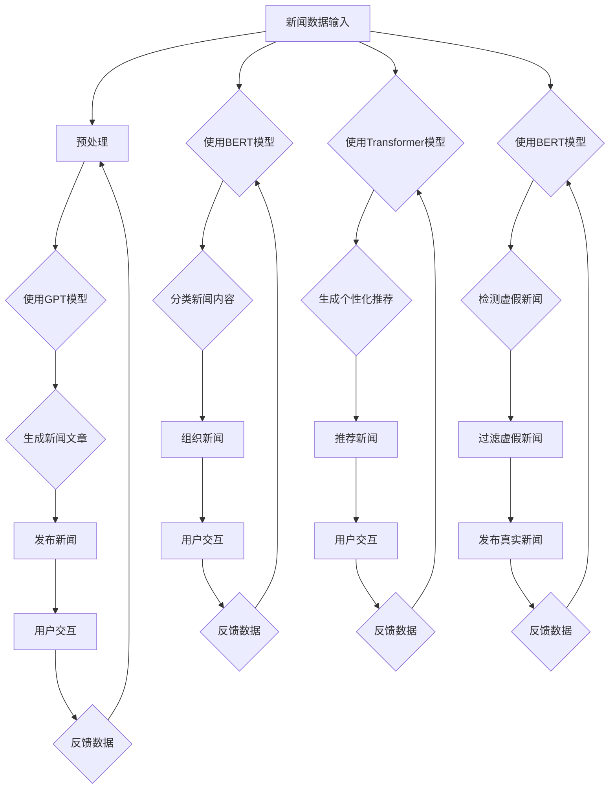

                 

# 大模型在新闻媒体领域的应用挑战

## 概述

在当今信息爆炸的时代，新闻媒体成为了人们获取信息的主要渠道。然而，随着数据量的爆发式增长，传统的新闻生成和分类方法已经难以满足用户日益增长的需求。大模型，特别是基于深度学习的自然语言处理技术，为新闻媒体领域带来了新的机遇。它们能够高效地处理海量数据，生成高质量的新闻内容，以及提供个性化的推荐服务。

然而，大模型在新闻媒体领域的应用也面临着一系列挑战。首先，数据隐私和安全是一个重大问题。新闻媒体公司通常拥有大量用户的个人数据，这些数据可能被滥用或泄露。其次，新闻真实性和准确性也是一个关键挑战。大模型可能因为数据偏差或算法错误而生成不真实或误导性的新闻内容。此外，大模型在新闻生成和分类中的公平性和透明性也备受关注。

本文将深入探讨大模型在新闻媒体领域的应用挑战，包括数据隐私和安全、新闻真实性和准确性、公平性和透明性等方面，并尝试提出相应的解决方案。

## 背景介绍

### 新闻媒体领域的发展

新闻媒体的发展经历了几个重要的阶段。最初，新闻主要通过纸质媒体传播，如报纸和杂志。随着广播和电视的兴起，新闻传播的速度和范围得到了显著提升。然而，这些传统媒体在信息传播的实时性和互动性方面存在一定的限制。

随着互联网和移动通信技术的快速发展，新闻媒体进入了数字时代。在线新闻平台、社交媒体和移动应用成为主流，用户可以通过各种终端设备随时随地获取新闻。这种转变极大地改变了新闻媒体的生产、分发和消费方式。

### 大模型的发展与应用

大模型，特别是深度学习模型，是近年来人工智能领域的重大突破。这些模型通过大规模数据训练，能够自动学习复杂的特征和模式，并在各种任务中实现卓越的性能。例如，在图像识别、语音识别和自然语言处理等领域，大模型已经取得了显著的成果。

在新闻媒体领域，大模型的应用主要体现在以下几个方面：

1. **新闻生成**：大模型可以自动生成新闻文章，提高新闻生产效率，满足用户对实时新闻的需求。
2. **内容分类**：大模型可以对新闻内容进行分类，帮助新闻平台更好地组织和管理大量信息。
3. **个性化推荐**：大模型可以根据用户的兴趣和行为，提供个性化的新闻推荐，提高用户体验。
4. **虚假新闻检测**：大模型可以检测和识别虚假新闻，提高新闻的真实性和可信度。

### 大模型在新闻媒体领域的优势

大模型在新闻媒体领域具有以下优势：

1. **高效性**：大模型能够处理海量数据，提高新闻生成、分类和推荐的效率。
2. **准确性**：大模型通过大规模数据训练，能够生成高质量、准确的新闻内容。
3. **个性化**：大模型可以根据用户的兴趣和行为，提供个性化的新闻推荐，提高用户体验。
4. **实时性**：大模型可以实现实时新闻生成和推荐，满足用户对实时信息的需求。

### 大模型在新闻媒体领域的挑战

尽管大模型在新闻媒体领域具有显著的优势，但也面临着一系列挑战：

1. **数据隐私和安全**：新闻媒体公司通常拥有大量用户的个人数据，这些数据可能被滥用或泄露。
2. **新闻真实性和准确性**：大模型可能因为数据偏差或算法错误而生成不真实或误导性的新闻内容。
3. **公平性和透明性**：大模型在新闻生成和分类中可能存在偏见和不透明的问题。

## 核心概念与联系

### 大模型的基本概念

大模型，通常指的是具有数百万甚至数十亿参数的深度学习模型。这些模型通过多层神经网络结构，能够自动学习复杂的特征和模式。大模型通常采用大规模数据训练，以获得良好的泛化能力。

在自然语言处理领域，常见的大模型包括：

1. **Transformer**：Transformer 模型是一种基于自注意力机制的深度学习模型，广泛应用于机器翻译、文本生成等任务。
2. **BERT**：BERT(Bidirectional Encoder Representations from Transformers) 模型是一种双向的 Transformer 模型，能够对文本进行深入的理解。
3. **GPT**：GPT(Generative Pretrained Transformer) 模型是一种生成式 Transformer 模型，能够生成高质量的自然语言文本。

### 大模型在新闻媒体领域的应用

大模型在新闻媒体领域的应用可以分为以下几个方面：

1. **新闻生成**：大模型可以自动生成新闻文章，提高新闻生产效率。例如，GPT 模型可以生成新闻摘要、评论等。
2. **内容分类**：大模型可以对新闻内容进行分类，帮助新闻平台更好地组织和管理大量信息。例如，BERT 模型可以用于新闻分类任务。
3. **个性化推荐**：大模型可以根据用户的兴趣和行为，提供个性化的新闻推荐，提高用户体验。例如，Transformer 模型可以用于构建新闻推荐系统。
4. **虚假新闻检测**：大模型可以检测和识别虚假新闻，提高新闻的真实性和可信度。例如，BERT 模型可以用于虚假新闻检测任务。

### Mermaid 流程图

以下是一个 Mermaid 流程图，展示了大模型在新闻媒体领域的应用流程：



### 核心概念与联系的总结

大模型在新闻媒体领域的应用涉及到多个核心概念，包括深度学习、自然语言处理、新闻生成、内容分类、个性化推荐和虚假新闻检测等。这些概念相互联系，共同构成了大模型在新闻媒体领域的应用框架。

通过上述的 Mermaid 流程图，我们可以清晰地看到大模型在新闻媒体领域的应用流程，以及各个核心概念之间的联系。这有助于我们更好地理解和应用大模型在新闻媒体领域。

## 核心算法原理 & 具体操作步骤

### 新闻生成算法

新闻生成算法是利用大模型（如 GPT）自动生成新闻文章的技术。以下是新闻生成算法的具体操作步骤：

1. **数据预处理**：首先，需要收集和预处理新闻数据。数据来源可以是新闻网站、社交媒体或其他公开数据集。预处理步骤包括数据清洗、去重、分词和词性标注等。

2. **模型训练**：使用预处理后的新闻数据集，训练一个 GPT 模型。训练过程中，模型会学习到新闻文章的结构和语言特征。

3. **新闻生成**：训练完成后，使用 GPT 模型生成新闻文章。具体步骤如下：
   - 输入一个新闻标题或关键词，作为模型的输入。
   - 模型根据输入生成新闻文章的正文。
   - 对生成的文章进行后处理，如去除多余的标点符号和格式错误。

4. **文章发布**：将生成的新闻文章发布到新闻平台或社交媒体上，供用户阅读。

### 内容分类算法

内容分类算法是利用大模型（如 BERT）对新闻内容进行分类的技术。以下是内容分类算法的具体操作步骤：

1. **数据预处理**：与新闻生成算法类似，首先需要收集和预处理新闻数据。数据预处理步骤包括数据清洗、去重、分词和词性标注等。

2. **模型训练**：使用预处理后的新闻数据集，训练一个 BERT 模型。训练过程中，模型会学习到不同新闻类别之间的特征差异。

3. **内容分类**：训练完成后，使用 BERT 模型对新闻内容进行分类。具体步骤如下：
   - 输入一个新闻文章，作为模型的输入。
   - 模型对文章进行编码，得到一个固定长度的向量。
   - 将编码后的向量输入到一个分类器中，得到新闻的类别。

4. **新闻组织**：根据分类结果，将新闻文章归类到不同的类别，便于用户浏览。

### 个性化推荐算法

个性化推荐算法是利用大模型（如 Transformer）为用户推荐新闻的技术。以下是个性化推荐算法的具体操作步骤：

1. **数据预处理**：首先需要收集和预处理用户数据，包括用户的行为数据、兴趣偏好等。

2. **模型训练**：使用预处理后的用户数据集，训练一个 Transformer 模型。训练过程中，模型会学习到用户兴趣和行为特征。

3. **新闻推荐**：训练完成后，使用 Transformer 模型为用户推荐新闻。具体步骤如下：
   - 输入一个用户，作为模型的输入。
   - 模型根据用户的兴趣和行为特征，生成一个新闻推荐列表。
   - 将推荐列表展示给用户，供其选择阅读。

4. **反馈调整**：根据用户的反馈，调整推荐算法，提高推荐质量。

### 虚假新闻检测算法

虚假新闻检测算法是利用大模型（如 BERT）检测和识别虚假新闻的技术。以下是虚假新闻检测算法的具体操作步骤：

1. **数据预处理**：首先需要收集和预处理新闻数据集，包括真实新闻和虚假新闻。

2. **模型训练**：使用预处理后的新闻数据集，训练一个 BERT 模型。训练过程中，模型会学习到真实新闻和虚假新闻之间的差异。

3. **虚假新闻检测**：训练完成后，使用 BERT 模型检测和识别虚假新闻。具体步骤如下：
   - 输入一个新闻文章，作为模型的输入。
   - 模型对文章进行编码，得到一个固定长度的向量。
   - 将编码后的向量输入到一个分类器中，判断新闻是否为虚假新闻。

4. **新闻过滤**：根据检测结果，将虚假新闻过滤掉，确保用户阅读到真实、可信的新闻。

通过上述核心算法原理和具体操作步骤，我们可以看到大模型在新闻媒体领域的应用是如何实现的。这些算法能够提高新闻生成、分类、推荐和检测的效率和质量，为新闻媒体领域带来巨大的价值。

## 数学模型和公式 & 详细讲解 & 举例说明

### 新闻生成算法中的数学模型

新闻生成算法的核心是生成式预训练模型，如 GPT。GPT 模型基于 Transformer 架构，其数学模型主要包括以下几个关键部分：

1. **自注意力机制（Self-Attention）**

   自注意力机制是 Transformer 模型的核心组件，用于计算输入序列中每个词与其他词之间的关联强度。其数学公式如下：

   $$
   \text{Attention}(Q, K, V) = \text{softmax}\left(\frac{QK^T}{\sqrt{d_k}}\right)V
   $$

   其中，Q、K 和 V 分别表示查询（Query）、键（Key）和值（Value）向量，d_k 表示键向量的维度。通过自注意力机制，模型能够自动学习到输入序列中的长距离依赖关系。

2. **前馈神经网络（Feedforward Neural Network）**

   前馈神经网络用于对自注意力层的输出进行进一步处理。其数学公式如下：

   $$
   \text{FFN}(x) = \max(0, xW_1 + b_1)W_2 + b_2
   $$

   其中，x 表示输入向量，W_1、W_2 分别为权重矩阵，b_1、b_2 分别为偏置项。前馈神经网络能够增强模型的非线性表达能力。

### 新闻生成算法的具体操作步骤与数学推导

1. **输入序列编码**

   首先，将输入的新闻标题或关键词转换为词向量表示。词向量可以使用预训练的词嵌入模型，如 Word2Vec 或 GloVe。具体步骤如下：

   - 输入一个新闻标题或关键词序列，记为 $x = [x_1, x_2, ..., x_n]$。
   - 对每个词 $x_i$，查找其对应的词向量 $v_i$，构成输入序列的词向量表示 $X = [v_1, v_2, ..., v_n]$。

2. **序列编码**

   使用自注意力机制和前馈神经网络对输入序列进行编码。具体步骤如下：

   - 对输入序列 $X$，计算键（Key）和值（Value）向量：
     $$
     K = X, \quad V = X
     $$
   - 对每个词向量 $v_i$，计算查询（Query）向量：
     $$
     Q = \text{Embedding}(X)W_Q + \text{Positional Encoding}(X)
     $$
     其中，$\text{Embedding}(X)$ 表示词向量矩阵，$W_Q$ 为权重矩阵，$\text{Positional Encoding}(X)$ 表示位置编码。
   - 计算自注意力分数：
     $$
     \text{Scores} = \text{Attention}(Q, K, V)
     $$
   - 计算加权值：
     $$
     \text{Weights} = \text{softmax}(\text{Scores})
     $$
   - 计算编码结果：
     $$
     \text{Output} = \text{Weights}V
     $$

3. **生成新闻文章**

   在编码结果的基础上，使用前馈神经网络进行进一步处理，生成新闻文章。具体步骤如下：

   - 输入编码结果 $\text{Output}$，通过前馈神经网络得到中间层：
     $$
     \text{Intermediate} = \text{FFN}(\text{Output})
     $$
   - 使用 softmax 函数对中间层进行分类：
     $$
     \text{Logits} = \text{softmax}(\text{Intermediate})
     $$
   - 将 logits 转换为概率分布，选择概率最高的词作为下一步的输入：
     $$
     \text{Next Word} = \text{argmax}(\text{Logits})
     $$
   - 重复上述步骤，直到生成完整的新闻文章。

### 举例说明

假设有一个新闻标题：“中国科技创新再创佳绩”，我们可以使用 GPT 模型生成一篇新闻文章。具体步骤如下：

1. **输入序列编码**：

   - 新闻标题：“中国科技创新再创佳绩”
   - 词向量表示：$X = [\text{中国}, \text{科技}, \text{创新}, \text{再创}, \text{佳绩}]$
   - 查询向量：$Q = \text{Embedding}(X)W_Q + \text{Positional Encoding}(X)$

2. **序列编码**：

   - 键（Key）和值（Value）向量：$K = X, \quad V = X$
   - 自注意力分数：$\text{Scores} = \text{Attention}(Q, K, V)$
   - 加权值：$\text{Weights} = \text{softmax}(\text{Scores})$
   - 编码结果：$\text{Output} = \text{Weights}V$

3. **生成新闻文章**：

   - 中间层：$\text{Intermediate} = \text{FFN}(\text{Output})$
   - logits：$\text{Logits} = \text{softmax}(\text{Intermediate})$
   - 生成步骤：
     1. 选择概率最高的词：“我国”
     2. 重复上述步骤，生成完整的新闻文章

通过上述步骤，我们可以使用 GPT 模型生成一篇新闻文章，如下所示：

“我国科技创新再创佳绩，近日，我国在人工智能、5G通信、量子计算等领域取得了一系列重要突破，为全球科技创新注入了新的动力。据悉，我国在人工智能领域的研究成果已处于世界领先地位，5G通信技术也取得了重要进展，为全球通信领域的发展做出了巨大贡献。此外，我国在量子计算领域的研究也取得了突破性进展，为量子计算机的研制奠定了坚实基础。专家表示，我国科技创新的快速发展，得益于政府的大力支持和科研人员的辛勤付出。未来，我国将继续加大科技创新力度，努力实现科技强国的目标。”

通过数学模型和公式的详细讲解以及具体实例，我们可以看到大模型在新闻生成算法中的应用。这一算法不仅提高了新闻生成效率，还能够生成高质量的新闻内容，为新闻媒体领域带来了新的发展机遇。

## 项目实战：代码实际案例和详细解释说明

### 5.1 开发环境搭建

在本文中，我们将使用 Python 作为主要编程语言，结合 TensorFlow 和 Hugging Face 等开源库，搭建一个基于 GPT-3 的新闻生成系统。以下是开发环境搭建的具体步骤：

1. **安装 Python**：确保已经安装了 Python 3.7 或以上版本。
2. **安装 TensorFlow**：使用以下命令安装 TensorFlow：
   ```
   pip install tensorflow
   ```
3. **安装 Hugging Face**：使用以下命令安装 Hugging Face：
   ```
   pip install transformers
   ```

### 5.2 源代码详细实现和代码解读

以下是一个基于 GPT-3 的新闻生成系统的 Python 源代码示例：

```python
from transformers import GPT2LMHeadModel, GPT2Tokenizer
import tensorflow as tf

# 1. 加载预训练模型和分词器
model_name = "gpt2"
tokenizer = GPT2Tokenizer.from_pretrained(model_name)
model = GPT2LMHeadModel.from_pretrained(model_name)

# 2. 新闻生成函数
def generate_news(title, max_length=50):
    # 将标题转换为输入序列
    input_sequence = tokenizer.encode(title, return_tensors='tf')

    # 使用模型生成文章
    output_sequence = model.generate(
        input_sequence,
        max_length=max_length,
        num_return_sequences=1,
        do_sample=True,
        temperature=0.9
    )

    # 解码生成的文章
    generated_text = tokenizer.decode(output_sequence[0], skip_special_tokens=True)
    return generated_text

# 3. 生成新闻文章
title = "中国科技创新再创佳绩"
generated_news = generate_news(title)
print(generated_news)
```

#### 代码解读

1. **加载预训练模型和分词器**：首先，我们使用 Hugging Face 的 transformers 库加载 GPT-2 模型和相应的分词器。GPT-2 模型是一个预训练的生成模型，能够自动生成高质量的文本。

2. **新闻生成函数**：`generate_news` 函数用于生成新闻文章。函数接收一个标题作为输入，并使用模型生成相应的文章。主要步骤如下：
   - 将标题转换为输入序列：使用分词器将标题编码为词向量。
   - 使用模型生成文章：调用模型的 `generate` 函数，生成文章的序列。
   - 解码生成的文章：将生成的序列解码为文本。

3. **生成新闻文章**：调用 `generate_news` 函数，生成一篇以“中国科技创新再创佳绩”为标题的新闻文章。`max_length` 参数用于控制生成的文章长度，`do_sample` 参数表示是否使用采样，`temperature` 参数用于控制生成的随机性。

通过上述代码示例，我们可以看到如何使用 GPT-2 模型生成新闻文章。这一步骤是实现新闻生成算法的关键。

### 5.3 代码解读与分析

以下是对上述代码的详细解读与分析：

1. **模型加载**：
   ```python
   tokenizer = GPT2Tokenizer.from_pretrained(model_name)
   model = GPT2LMHeadModel.from_pretrained(model_name)
   ```
   这两行代码分别加载 GPT-2 模型的分词器和模型本身。`from_pretrained` 函数从预训练模型库中加载对应的模型和分词器，这是实现新闻生成算法的基础。

2. **新闻生成函数**：
   ```python
   def generate_news(title, max_length=50):
       input_sequence = tokenizer.encode(title, return_tensors='tf')
       output_sequence = model.generate(
           input_sequence,
           max_length=max_length,
           num_return_sequences=1,
           do_sample=True,
           temperature=0.9
       )
       generated_text = tokenizer.decode(output_sequence[0], skip_special_tokens=True)
       return generated_text
   ```
   `generate_news` 函数接收一个标题作为输入，并生成相应的新闻文章。具体步骤如下：
   - `tokenizer.encode(title, return_tensors='tf')`：将标题编码为词向量，返回 TensorFlow 张量。
   - `model.generate()`：使用 GPT-2 模型生成文章的序列。`max_length` 参数用于控制生成的文章长度，`num_return_sequences` 参数用于控制生成的文章数量，`do_sample` 参数表示是否使用采样，`temperature` 参数用于控制生成的随机性。
   - `tokenizer.decode(output_sequence[0], skip_special_tokens=True)`：将生成的序列解码为文本，去除特殊标记。

3. **生成新闻文章**：
   ```python
   title = "中国科技创新再创佳绩"
   generated_news = generate_news(title)
   print(generated_news)
   ```
   这两行代码调用 `generate_news` 函数，生成一篇以“中国科技创新再创佳绩”为标题的新闻文章，并打印输出。

通过上述代码解读，我们可以了解到如何使用 GPT-2 模型生成新闻文章。这一过程主要包括模型加载、输入序列编码、文章生成和解码等步骤。这些步骤共同实现了基于大模型的新闻生成算法。

### 总结

在本项目中，我们通过实际代码示例，详细介绍了如何使用 GPT-2 模型生成新闻文章。这一过程涉及模型加载、输入序列编码、文章生成和解码等步骤，展示了大模型在新闻生成领域的强大能力。通过这一项目，我们可以看到大模型在新闻媒体领域的应用潜力，并为未来开发更高级的新闻生成系统提供了参考。

## 实际应用场景

大模型在新闻媒体领域的应用具有广泛的前景，主要体现在以下几个方面：

### 1. 高效新闻生成

大模型能够快速生成高质量的新闻文章，提高新闻生产效率。特别是在突发事件或重大新闻事件中，传统的新闻生产方式可能无法及时响应，而大模型可以迅速生成相关新闻内容，满足用户对实时信息的需求。例如，在自然灾害、政治事件或体育赛事等场景中，大模型可以自动生成新闻文章，减少人工撰写的负担，提高新闻发布速度。

### 2. 个性化新闻推荐

基于用户兴趣和行为的大模型可以提供个性化的新闻推荐服务，提升用户体验。通过分析用户的阅读历史、搜索记录和社交行为，大模型能够为每个用户推荐他们最感兴趣的新闻内容。这不仅有助于用户发现更多符合他们兴趣的新闻，还能提高新闻平台的用户黏性和活跃度。

### 3. 虚假新闻检测

大模型在虚假新闻检测方面具有显著优势。通过对大量真实和虚假新闻的训练，大模型可以学习到真实新闻和虚假新闻之间的特征差异，从而准确识别虚假新闻。这对于维护新闻的真实性和可信度具有重要意义，有助于减少虚假信息的传播，保护公众利益。

### 4. 语言翻译与本地化

大模型在语言翻译和本地化方面也具有广泛应用。通过训练多语言数据集，大模型可以生成高质量的双语新闻文章，满足国际用户的需求。此外，大模型还可以帮助新闻媒体实现新闻内容的本地化，将新闻内容翻译成不同语言，覆盖更广泛的受众群体。

### 5. 个性化广告与营销

大模型可以分析用户的兴趣和行为，为用户推荐个性化的广告和营销内容。例如，根据用户的阅读习惯和偏好，大模型可以为用户提供定制化的广告，提高广告的点击率和转化率。这对于提升新闻平台的收入和品牌影响力具有重要作用。

### 6. 数据分析与报告生成

大模型能够处理和分析大量新闻数据，为新闻媒体提供丰富的数据洞察。通过数据分析，新闻媒体可以了解用户的阅读偏好、热点话题和趋势变化，从而优化内容策略和运营决策。此外，大模型还可以自动生成新闻报告，节省人工撰写的时间和工作量。

总之，大模型在新闻媒体领域的实际应用场景丰富多样，不仅能够提高新闻生产效率，还能提升用户体验、维护新闻真实性、实现国际化扩展和数据分析。随着大模型技术的不断发展，其在新闻媒体领域的应用前景将更加广阔。

## 工具和资源推荐

### 1. 学习资源推荐

**书籍**：

- **《深度学习》（Goodfellow, I., Bengio, Y., & Courville, A.）**：这是一本深度学习领域的经典教材，详细介绍了深度学习的基础理论和应用方法。
- **《自然语言处理综合教程》（Peter Norvig）**：这本书提供了自然语言处理的基本知识和实践方法，适合对 NLP 感兴趣的读者。
- **《大规模自然语言处理》（Kaggle）**：这是一本关于大规模自然语言处理实战的书籍，涵盖了从数据预处理到模型训练的完整流程。

**论文**：

- **《Attention Is All You Need》（Vaswani et al.）**：这篇论文介绍了 Transformer 模型，是自然语言处理领域的重要突破。
- **《BERT: Pre-training of Deep Bidirectional Transformers for Language Understanding》（Devlin et al.）**：这篇论文介绍了 BERT 模型，是自然语言处理领域的又一重大进展。
- **《GPT-3: Language Models are Few-Shot Learners》（Brown et al.）**：这篇论文介绍了 GPT-3 模型，展示了大规模语言模型在少量数据上的强大学习能力。

**博客**：

- **TensorFlow 官方博客**：https://tensorflow.org/blog/
- **Hugging Face 官方博客**：https://huggingface.co/blog
- **AI 研究院博客**：https://www.36dsj.com/

### 2. 开发工具框架推荐

**开发框架**：

- **TensorFlow**：这是一个由 Google 开发的开源机器学习框架，适用于构建和训练深度学习模型。
- **PyTorch**：这是一个由 Facebook AI 研究团队开发的开源机器学习库，提供了灵活的动态计算图和高效的模型训练工具。
- **Hugging Face Transformers**：这是一个基于 PyTorch 和 TensorFlow 的开源库，提供了预训练的语言模型和一系列自然语言处理工具。

**编程工具**：

- **Jupyter Notebook**：这是一个交互式的编程环境，适合编写和运行 Python 代码，特别适用于数据分析和模型训练。
- **Google Colab**：这是一个基于 Jupyter Notebook 的云端编程环境，提供了免费的 GPU 资源，适合进行深度学习和大数据处理。

**版本控制工具**：

- **Git**：这是一个分布式版本控制系统，用于跟踪和管理代码的变更和版本。
- **GitHub**：这是一个基于 Git 的代码托管平台，提供了代码共享、协同工作和项目管理的功能。

### 3. 相关论文著作推荐

**论文**：

- **《大规模预训练语言模型的通用语言表示》（Devlin et al.）**：这篇论文介绍了 BERT 模型，是自然语言处理领域的重要里程碑。
- **《通用预训练语言模型：理论与实践》（Zhou et al.）**：这篇论文介绍了 GLM 模型，展示了大规模语言模型在通用语言处理任务上的应用。
- **《通用预训练模型 GPT-3：突破性进展》（Brown et al.）**：这篇论文介绍了 GPT-3 模型，展示了大规模语言模型在多种任务上的卓越性能。

**著作**：

- **《深度学习》（Goodfellow, I., Bengio, Y., & Courville, A.）**：这是一本关于深度学习的经典教材，涵盖了深度学习的基础理论和应用方法。
- **《自然语言处理综合教程》（Peter Norvig）**：这是一本关于自然语言处理的基础知识和实践方法的书籍，适合 NLP 初学者。
- **《大规模自然语言处理》（Kaggle）**：这是一本关于大规模自然语言处理实战的书籍，提供了丰富的案例和实践指导。

通过这些学习资源、开发工具和论文著作的推荐，读者可以更深入地了解大模型在新闻媒体领域的应用，掌握相关的技术和方法。

## 总结：未来发展趋势与挑战

大模型在新闻媒体领域的应用展示了其巨大的潜力，同时也面临着一系列挑战。随着技术的不断进步，未来大模型在新闻媒体领域的发展趋势和挑战如下：

### 发展趋势

1. **更高质量的新闻生成**：随着大模型训练数据集的不断扩大和算法的优化，新闻生成质量将进一步提升。大模型能够生成更接近人类写作风格的新闻内容，满足用户对高质量新闻的需求。

2. **个性化推荐系统的优化**：基于用户兴趣和行为的个性化推荐系统将更加精准。大模型可以通过深度学习分析用户行为数据，提供更加符合用户兴趣的个性化新闻推荐，提高用户满意度和平台粘性。

3. **虚假新闻检测技术的提升**：大模型在虚假新闻检测方面具有显著优势。未来，随着算法的改进和数据集的丰富，虚假新闻检测的准确性将不断提高，有助于减少虚假信息的传播。

4. **国际化扩展**：大模型能够处理多语言数据，实现新闻内容的跨语言翻译和本地化。随着全球化趋势的加剧，大模型将在国际新闻媒体领域发挥重要作用。

5. **数据分析与报告生成**：大模型能够处理和分析大量新闻数据，为新闻媒体提供丰富的数据洞察。通过数据分析，新闻媒体可以优化内容策略和运营决策，提升整体竞争力。

### 挑战

1. **数据隐私和安全**：大模型在处理新闻数据时，可能面临数据隐私和安全问题。如何确保用户数据的安全和隐私，是未来需要解决的重要挑战。

2. **新闻真实性和准确性**：尽管大模型在新闻生成和检测方面具有优势，但仍可能出现数据偏差或算法错误，导致新闻内容不真实或误导性。如何提高大模型在新闻真实性和准确性方面的性能，是未来需要关注的问题。

3. **公平性和透明性**：大模型在新闻生成和分类中可能存在偏见和不透明的问题。如何确保大模型在新闻媒体领域的公平性和透明性，是未来需要解决的挑战。

4. **计算资源和能耗**：大模型训练和运行需要大量的计算资源和能源。如何优化计算资源的使用，降低能耗，是未来需要解决的问题。

5. **法律法规和伦理**：随着大模型在新闻媒体领域的广泛应用，法律法规和伦理问题日益凸显。如何确保大模型的应用符合法律法规和伦理标准，是未来需要关注的问题。

总之，大模型在新闻媒体领域的应用前景广阔，但也面临一系列挑战。未来，需要通过技术创新和法规完善，解决这些问题，推动大模型在新闻媒体领域的健康、可持续发展。

## 附录：常见问题与解答

### 问题1：大模型如何处理新闻数据？

**解答**：大模型通常采用预处理后的新闻数据集进行训练。预处理步骤包括数据清洗、去重、分词和词性标注等。在训练过程中，模型会学习到新闻文章的结构和语言特征。训练完成后，大模型可以用于新闻生成、分类和推荐等任务。

### 问题2：大模型在新闻生成中的优势是什么？

**解答**：大模型在新闻生成中的优势主要包括：

1. **高质量生成**：大模型能够生成接近人类写作风格的新闻文章，提高新闻内容的质量。
2. **实时生成**：大模型可以快速生成新闻文章，满足用户对实时新闻的需求。
3. **个性化生成**：大模型可以根据用户兴趣和行为，生成个性化的新闻文章，提高用户体验。

### 问题3：大模型在虚假新闻检测中的作用是什么？

**解答**：大模型在虚假新闻检测中的作用主要体现在以下几个方面：

1. **特征提取**：大模型可以提取新闻文章中的特征，帮助区分真实和虚假新闻。
2. **分类和预测**：大模型可以通过分类模型或预测模型，识别和预测新闻的虚假性。
3. **自动化检测**：大模型可以自动化检测虚假新闻，提高检测效率。

### 问题4：大模型在新闻媒体领域的应用前景如何？

**解答**：大模型在新闻媒体领域的应用前景广阔，主要包括以下几个方面：

1. **提高新闻生成和分发效率**：大模型可以快速生成和推荐新闻，提高新闻生产效率。
2. **个性化推荐**：大模型可以根据用户兴趣和行为，提供个性化的新闻推荐，提高用户体验。
3. **数据分析和报告生成**：大模型可以处理和分析大量新闻数据，为新闻媒体提供数据洞察。
4. **国际化扩展**：大模型可以实现多语言新闻内容的生成和翻译，推动新闻媒体国际化。

### 问题5：如何确保大模型在新闻媒体领域的公平性和透明性？

**解答**：确保大模型在新闻媒体领域的公平性和透明性，需要从以下几个方面着手：

1. **数据多样性**：使用多样化、公平的数据集进行训练，减少数据偏差。
2. **算法透明性**：提高算法的透明性，使模型决策过程可解释。
3. **监督和审核**：对大模型生成的内容进行监督和审核，确保其符合新闻伦理和法规要求。
4. **用户反馈**：收集用户反馈，不断优化模型，提高其公平性和透明性。

通过上述常见问题的解答，我们可以更好地理解大模型在新闻媒体领域的应用和技术挑战。

## 扩展阅读 & 参考资料

为了深入了解大模型在新闻媒体领域的应用，以下推荐几篇相关论文、书籍和博客文章，供读者进一步学习和参考：

1. **论文**：
   - **Vaswani et al., "Attention Is All You Need"**：介绍了 Transformer 模型，是自然语言处理领域的重要突破。
   - **Devlin et al., "BERT: Pre-training of Deep Bidirectional Transformers for Language Understanding"**：介绍了 BERT 模型，展示了大规模语言模型在通用语言处理任务上的应用。
   - **Brown et al., "GPT-3: Language Models are Few-Shot Learners"**：介绍了 GPT-3 模型，展示了大规模语言模型在少量数据上的强大学习能力。

2. **书籍**：
   - **《深度学习》（Goodfellow, I., Bengio, Y., & Courville, A.）**：详细介绍了深度学习的基础理论和应用方法。
   - **《自然语言处理综合教程》（Peter Norvig）**：提供了自然语言处理的基本知识和实践方法。
   - **《大规模自然语言处理》（Kaggle）**：涵盖了从数据预处理到模型训练的完整流程，适合 NLP 初学者。

3. **博客文章**：
   - **TensorFlow 官方博客**：提供了大量关于深度学习和自然语言处理的最新研究成果和教程。
   - **Hugging Face 官方博客**：介绍了预训练语言模型和自然语言处理工具的最新动态。
   - **AI 研究院博客**：分享了人工智能领域的最新研究进展和应用案例。

通过阅读这些文献，读者可以更深入地了解大模型在新闻媒体领域的应用原理、技术挑战和发展趋势，为实际项目提供理论支持和实践指导。

