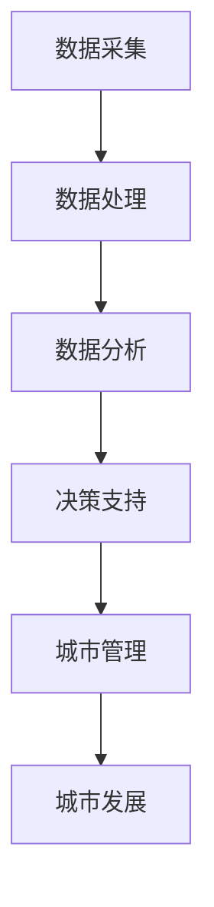

                 

### 背景介绍

在当今世界，城市化进程正在以前所未有的速度推进，这既带来了经济发展的机遇，也带来了诸多挑战。智能城市作为未来城市发展的重要趋势，已经引起了广泛关注。智能城市规划是一个复杂的过程，涉及到城市基础设施、交通管理、环境保护、公共服务等多个领域。在这个过程中，大模型作为一种强大的工具，正逐渐成为推动智能城市规划的重要力量。

大模型，通常指的是深度学习模型中参数规模达到百万、亿级甚至更大规模的神经网络模型。这些模型能够通过学习海量数据，提取出隐藏在数据中的复杂模式和规律，从而实现高度智能化的决策和支持。在智能城市规划中，大模型的应用主要集中在以下几个方面：

1. **数据集成与分析**：智能城市规划需要整合来自不同来源的数据，如交通流量、人口密度、气象信息等。大模型能够高效处理这些复杂数据，帮助城市规划者更好地理解城市运行状态。

2. **预测与优化**：通过学习历史数据，大模型可以预测城市未来的发展趋势，如人口增长、交通流量变化等。这为城市规划提供了数据支持和决策依据，有助于制定更加科学和可行的规划方案。

3. **实时监控与响应**：大模型可以实时分析城市运行数据，及时发现并响应城市中的异常情况，如交通拥堵、自然灾害等。这有助于提高城市管理的效率和安全性。

4. **优化资源配置**：大模型可以分析城市的资源分配情况，如能源、水资源等，提出优化建议，以实现资源的合理利用和可持续发展。

本文将围绕大模型在智能城市规划中的应用，深入探讨其核心概念、算法原理、实际应用场景以及未来发展趋势与挑战。通过本文的阅读，读者将全面了解大模型在智能城市规划中的重要价值和应用前景。

### 2. 核心概念与联系

在探讨大模型在智能城市规划中的应用之前，首先需要明确几个核心概念和它们之间的联系。以下是本文中涉及到的几个关键概念：

#### 2.1. 智能城市规划

智能城市规划是指利用先进的信息技术和数据分析方法，对城市的发展进行规划和管理。其核心目标是实现城市的智能化、可持续化和高效化。智能城市规划包括以下几个方面：

1. **交通管理**：通过智能交通系统，优化交通流量，减少拥堵，提高交通效率。
2. **公共安全**：利用物联网和人工智能技术，实时监控城市安全，提高公共安全保障。
3. **能源管理**：通过智能电网和能源管理系统，实现能源的高效利用和分配。
4. **环境监测**：利用传感器网络和数据分析，实时监测城市环境质量，制定环保政策。
5. **公共服务**：通过智能服务平台，提供便捷的公共服务，提高居民生活质量。

#### 2.2. 大模型

大模型指的是参数规模达到百万、亿级甚至更大规模的深度学习模型。这些模型通常具有以下特点：

1. **强大的学习能力**：大模型能够从海量数据中学习，提取出复杂的模式和规律。
2. **高计算资源需求**：大模型的训练和推理需要大量的计算资源和时间。
3. **广泛的应用领域**：大模型在计算机视觉、自然语言处理、语音识别等领域具有广泛的应用。

#### 2.3. 数据驱动的城市规划

数据驱动的城市规划是指通过收集、处理和分析城市数据，为城市规划和管理提供决策支持。其核心思想是“以数据为中心”，利用数据来指导城市规划和管理。数据驱动的城市规划包括以下几个方面：

1. **数据采集**：通过各种传感器和监测设备，收集城市运行数据。
2. **数据处理**：对采集到的数据进行清洗、整理和预处理。
3. **数据分析**：利用数据分析方法和工具，从数据中提取有价值的信息。
4. **数据应用**：将分析结果应用于城市规划和管理，优化城市运行。

#### 2.4. 大模型与智能城市规划的联系

大模型与智能城市规划之间的联系主要体现在以下几个方面：

1. **数据驱动的决策支持**：大模型能够从海量城市数据中提取出隐藏的模式和规律，为城市规划和管理提供数据驱动的决策支持。
2. **智能化的城市管理**：大模型可以实时分析城市运行数据，实现智能化的城市管理，提高城市管理的效率和效果。
3. **可持续的城市发展**：大模型可以帮助城市规划者预测城市未来的发展趋势，制定可持续的城市发展策略。

#### 2.5. Mermaid 流程图

为了更直观地展示大模型在智能城市规划中的应用，我们使用 Mermaid 流程图来描述其工作流程。以下是一个简化的 Mermaid 流程图：



在这个流程图中，数据采集、数据处理、数据分析和决策支持构成了大模型在智能城市规划中的应用流程。通过这个流程，大模型实现了对城市数据的深入挖掘和分析，为城市管理和规划提供了有力的支持。

### 3. 核心算法原理 & 具体操作步骤

在了解了大模型在智能城市规划中的应用背景和核心概念之后，接下来我们将深入探讨大模型的算法原理和具体操作步骤。大模型在智能城市规划中的应用主要依赖于以下几种核心算法：

#### 3.1. 深度学习算法

深度学习算法是构建大模型的基础。它通过多层神经网络的结构，实现对数据的深层特征提取和模式识别。以下是深度学习算法在智能城市规划中的应用步骤：

1. **数据预处理**：对采集到的城市数据（如交通流量、人口密度、气象信息等）进行预处理，包括数据清洗、归一化和特征提取。
2. **构建神经网络模型**：设计并构建多层神经网络模型，包括输入层、隐藏层和输出层。每个层都包含多个神经元，用于对数据进行逐层处理。
3. **模型训练**：利用大量的城市数据进行模型训练，通过反向传播算法不断调整模型参数，使其能够准确预测城市运行状态。
4. **模型评估**：在训练完成后，使用验证集和测试集对模型进行评估，确保其预测能力和泛化能力。
5. **模型部署**：将训练好的模型部署到生产环境中，实现实时预测和决策支持。

#### 3.2. 强化学习算法

强化学习算法是一种通过不断试错和学习来优化决策过程的方法。在智能城市规划中，强化学习算法可以用于动态优化城市资源配置、交通流量管理等。以下是强化学习算法在智能城市规划中的应用步骤：

1. **环境定义**：定义智能城市规划的环境，包括状态空间、动作空间和奖励机制。
2. **策略学习**：通过学习，确定最佳动作策略，使得系统能够最大化累积奖励。
3. **策略迭代**：在真实环境中不断迭代策略，通过观察环境反馈调整策略，实现持续优化。
4. **模型评估**：评估策略的有效性，确保其在实际应用中的可行性和有效性。
5. **模型部署**：将优化策略部署到城市管理系统，实现自动化的资源分配和流量管理。

#### 3.3. 生成对抗网络（GAN）

生成对抗网络（GAN）是一种通过两个神经网络（生成器和判别器）之间的对抗训练来生成逼真数据的方法。在智能城市规划中，GAN可以用于模拟城市运行状态、预测未来发展趋势等。以下是GAN在智能城市规划中的应用步骤：

1. **模型构建**：构建生成器和判别器，分别用于生成城市状态数据和判断生成数据的真实性。
2. **对抗训练**：通过对抗训练，使生成器不断优化生成数据，判别器不断提高判别能力。
3. **数据生成**：生成器生成逼真的城市状态数据，为城市规划提供参考。
4. **模型评估**：评估生成数据的真实性和实用性，确保其在实际应用中的有效性。
5. **模型部署**：将生成的数据应用于城市规划和管理，实现预测和决策支持。

#### 3.4. 聚类分析

聚类分析是一种无监督学习方法，用于将数据集划分为若干个聚类，每个聚类内部的样本具有较高的相似度。在智能城市规划中，聚类分析可以用于分析城市人口分布、交通流量分布等。以下是聚类分析在智能城市规划中的应用步骤：

1. **数据准备**：准备待分析的城市数据，如人口密度、交通流量等。
2. **选择聚类算法**：选择合适的聚类算法，如K-means、层次聚类等。
3. **聚类分析**：根据选择的聚类算法，对城市数据进行聚类，生成聚类结果。
4. **结果评估**：评估聚类结果的有效性和合理性，确保其能够真实反映城市运行状态。
5. **模型部署**：将聚类结果应用于城市规划和管理，优化资源配置和流量管理。

#### 3.5. 大模型融合应用

在实际应用中，不同类型的大模型往往需要融合应用，以实现更准确和全面的城市规划支持。以下是几种常见的大模型融合应用方式：

1. **多模型协同**：将不同的深度学习模型、强化学习模型和生成对抗网络进行融合，实现不同模型的优势互补。
2. **多层次分析**：结合宏观和微观层面的数据分析，实现对城市运行状态的全面理解。
3. **多源数据融合**：整合来自不同来源的数据，如交通数据、环境数据、社会经济数据等，提高数据分析的准确性和全面性。

通过以上核心算法的应用和融合，大模型在智能城市规划中发挥了重要作用，为城市规划者提供了科学、高效和智能化的决策支持。

### 4. 数学模型和公式 & 详细讲解 & 举例说明

在深入探讨大模型在智能城市规划中的应用时，数学模型和公式是不可或缺的工具。以下我们将详细介绍大模型在智能城市规划中常用的数学模型、公式及其详细讲解和举例说明。

#### 4.1. 深度学习模型中的前向传播与反向传播

深度学习模型中的前向传播（Forward Propagation）和反向传播（Back Propagation）是两个核心过程。以下是这两个过程的数学模型和公式。

##### 前向传播

前向传播是指在神经网络中，从输入层经过多个隐藏层，最终到达输出层的计算过程。以下是前向传播的数学模型：

\[ 
z_{l}^{(i)} = \sigma(W_{l}^{(i)} \cdot a_{l-1}^{(i)} + b_{l}^{(i)}) 
\]

其中，\(z_{l}^{(i)}\) 表示第 \(l\) 层第 \(i\) 个神经元的输入值，\(\sigma\) 表示激活函数，如 sigmoid 函数、ReLU 函数等，\(W_{l}^{(i)}\) 表示第 \(l\) 层第 \(i\) 个神经元的权重，\(a_{l-1}^{(i)}\) 表示第 \(l-1\) 层第 \(i\) 个神经元的输出值，\(b_{l}^{(i)}\) 表示第 \(l\) 层第 \(i\) 个神经元的偏置。

举例说明：

假设我们有一个简单的两层神经网络，输入层有 3 个神经元，隐藏层有 4 个神经元，输出层有 2 个神经元。给定输入 \(x = [1, 2, 3]\)，计算隐藏层的输入和输出。

首先，计算隐藏层的输入：

\[ 
z_{1}^{(1)} = \sigma(W_{1}^{(1)} \cdot x + b_{1}^{(1)}) 
\]

其中，\(W_{1}^{(1)}\) 和 \(b_{1}^{(1)}\) 分别是隐藏层第一个神经元的权重和偏置。

然后，计算隐藏层的输出：

\[ 
z_{1}^{(2)} = \sigma(W_{1}^{(2)} \cdot x + b_{1}^{(2)}) 
\]

\[ 
z_{1}^{(3)} = \sigma(W_{1}^{(3)} \cdot x + b_{1}^{(3)}) 
\]

\[ 
z_{1}^{(4)} = \sigma(W_{1}^{(4)} \cdot x + b_{1}^{(4)}) 
\]

接着，计算输出层的输入和输出：

\[ 
z_{2}^{(1)} = \sigma(W_{2}^{(1)} \cdot z_{1}^{(1)} + b_{2}^{(1)}) 
\]

\[ 
z_{2}^{(2)} = \sigma(W_{2}^{(2)} \cdot z_{1}^{(2)} + b_{2}^{(2)}) 
\]

\[ 
z_{2}^{(3)} = \sigma(W_{2}^{(3)} \cdot z_{1}^{(3)} + b_{2}^{(3)}) 
\]

\[ 
z_{2}^{(4)} = \sigma(W_{2}^{(4)} \cdot z_{1}^{(4)} + b_{2}^{(4)}) 
\]

##### 反向传播

反向传播是指在神经网络中，从输出层经过多个隐藏层，反向计算梯度，更新模型参数的过程。以下是反向传播的数学模型：

\[ 
\delta_{l}^{(i)} = \frac{\partial C}{\partial z_{l}^{(i)}} \cdot \sigma'(z_{l}^{(i)}) 
\]

\[ 
\delta_{l-1}^{(i)} = \delta_{l}^{(i)} \cdot W_{l}^{(i)} 
\]

其中，\(\delta_{l}^{(i)}\) 表示第 \(l\) 层第 \(i\) 个神经元的误差，\(C\) 表示损失函数，如均方误差（MSE）、交叉熵（CE）等，\(\sigma'\) 表示激活函数的导数。

举例说明：

假设我们已经得到了输出层的误差 \(\delta_{2}^{(1)}\)、\(\delta_{2}^{(2)}\)、\(\delta_{2}^{(3)}\)、\(\delta_{2}^{(4)}\)，计算隐藏层的误差。

首先，计算隐藏层第一个神经元的误差：

\[ 
\delta_{1}^{(1)} = \delta_{2}^{(1)} \cdot W_{2}^{(1)} 
\]

\[ 
\delta_{1}^{(2)} = \delta_{2}^{(2)} \cdot W_{2}^{(2)} 
\]

\[ 
\delta_{1}^{(3)} = \delta_{2}^{(3)} \cdot W_{2}^{(3)} 
\]

\[ 
\delta_{1}^{(4)} = \delta_{2}^{(4)} \cdot W_{2}^{(4)} 
\]

然后，更新隐藏层的权重和偏置：

\[ 
W_{1}^{(1)} = W_{1}^{(1)} - \alpha \cdot \delta_{1}^{(1)} \cdot a_{0}^{(1)} 
\]

\[ 
W_{1}^{(2)} = W_{1}^{(2)} - \alpha \cdot \delta_{1}^{(2)} \cdot a_{0}^{(2)} 
\]

\[ 
W_{1}^{(3)} = W_{1}^{(3)} - \alpha \cdot \delta_{1}^{(3)} \cdot a_{0}^{(3)} 
\]

\[ 
W_{1}^{(4)} = W_{1}^{(4)} - \alpha \cdot \delta_{1}^{(4)} \cdot a_{0}^{(4)} 
\]

\[ 
b_{1}^{(1)} = b_{1}^{(1)} - \alpha \cdot \delta_{1}^{(1)} 
\]

\[ 
b_{1}^{(2)} = b_{1}^{(2)} - \alpha \cdot \delta_{1}^{(2)} 
\]

\[ 
b_{1}^{(3)} = b_{1}^{(3)} - \alpha \cdot \delta_{1}^{(3)} 
\]

\[ 
b_{1}^{(4)} = b_{1}^{(4)} - \alpha \cdot \delta_{1}^{(4)} 
\]

其中，\(\alpha\) 表示学习率。

通过以上步骤，我们可以利用前向传播和反向传播来训练深度学习模型，使其能够对城市数据进行有效的预测和分析。

#### 4.2. 强化学习中的Q学习和策略迭代

强化学习是一种通过不断试错和学习来优化决策过程的方法。在智能城市规划中，强化学习可以用于动态优化城市资源配置、交通流量管理等。以下是强化学习中的 Q 学习（Q-Learning）和策略迭代（Policy Iteration）的数学模型和公式。

##### Q 学习

Q 学习是一种通过学习值函数（Q 函数）来优化决策的方法。其核心思想是，通过不断更新 Q 值，使得策略能够最大化累积奖励。以下是 Q 学习的数学模型：

\[ 
Q(s, a) = \sum_{s'} p(s' | s, a) \cdot \max_{a'} Q(s', a') 
\]

其中，\(Q(s, a)\) 表示在状态 \(s\) 下，执行动作 \(a\) 的期望回报，\(p(s' | s, a)\) 表示在状态 \(s\) 下，执行动作 \(a\) 后转移到状态 \(s'\) 的概率，\(\max_{a'} Q(s', a')\) 表示在状态 \(s'\) 下，执行动作 \(a'\) 的最大期望回报。

举例说明：

假设我们有一个简单的强化学习任务，状态空间有 3 个状态 \(s_1\)、\(s_2\)、\(s_3\)，动作空间有 2 个动作 \(a_1\)、\(a_2\)。给定当前状态 \(s_1\)，计算执行动作 \(a_1\) 的 Q 值。

首先，计算转移概率：

\[ 
p(s_2 | s_1, a_1) = 0.6 
\]

\[ 
p(s_3 | s_1, a_1) = 0.4 
\]

\[ 
p(s_2 | s_1, a_2) = 0.3 
\]

\[ 
p(s_3 | s_1, a_2) = 0.7 
\]

然后，计算 Q 值：

\[ 
Q(s_1, a_1) = 0.6 \cdot \max_{a'} Q(s_2, a') + 0.4 \cdot \max_{a'} Q(s_3, a') 
\]

\[ 
Q(s_1, a_2) = 0.3 \cdot \max_{a'} Q(s_2, a') + 0.7 \cdot \max_{a'} Q(s_3, a') 
\]

接下来，更新 Q 值：

\[ 
Q(s_1, a_1) = Q(s_1, a_1) + \alpha \cdot (r_1 - Q(s_1, a_1)) 
\]

\[ 
Q(s_1, a_2) = Q(s_1, a_2) + \alpha \cdot (r_2 - Q(s_1, a_2)) 
\]

其中，\(\alpha\) 表示学习率，\(r_1\)、\(r_2\) 分别为执行动作 \(a_1\)、\(a_2\) 后的奖励。

##### 策略迭代

策略迭代是一种通过迭代更新策略来优化决策的方法。其核心思想是，首先确定一个初始策略，然后通过迭代更新策略，使得期望回报最大化。以下是策略迭代的数学模型：

\[ 
\pi'(s) = \begin{cases} 
a_1 & \text{if } Q(s, a_1) > Q(s, a_2) \\
a_2 & \text{if } Q(s, a_2) > Q(s, a_1) \\
\text{stochastic} & \text{if } Q(s, a_1) = Q(s, a_2) 
\end{cases} 
\]

其中，\(\pi'(s)\) 表示更新后的策略，\(a_1\)、\(a_2\) 分别为两个动作。

举例说明：

假设我们有一个简单的强化学习任务，状态空间有 3 个状态 \(s_1\)、\(s_2\)、\(s_3\)，动作空间有 2 个动作 \(a_1\)、\(a_2\)。给定当前状态 \(s_1\)，计算更新后的策略。

首先，计算当前状态的 Q 值：

\[ 
Q(s_1, a_1) = 0.6 \cdot \max_{a'} Q(s_2, a') + 0.4 \cdot \max_{a'} Q(s_3, a') 
\]

\[ 
Q(s_1, a_2) = 0.3 \cdot \max_{a'} Q(s_2, a') + 0.7 \cdot \max_{a'} Q(s_3, a') 
\]

然后，比较 Q 值，更新策略：

\[ 
\pi'(s_1) = \begin{cases} 
a_1 & \text{if } Q(s_1, a_1) > Q(s_1, a_2) \\
a_2 & \text{if } Q(s_1, a_2) > Q(s_1, a_1) \\
\text{stochastic} & \text{if } Q(s_1, a_1) = Q(s_1, a_2) 
\end{cases} 
\]

通过以上步骤，我们可以利用 Q 学习和策略迭代来优化强化学习任务，实现动态优化城市资源配置和交通流量管理。

#### 4.3. 生成对抗网络（GAN）中的损失函数

生成对抗网络（GAN）是一种通过生成器和判别器之间的对抗训练来生成逼真数据的方法。在智能城市规划中，GAN 可以用于模拟城市运行状态、预测未来发展趋势等。以下是 GAN 中的损失函数的数学模型和公式。

GAN 的损失函数主要由两部分组成：生成器损失函数和判别器损失函数。

##### 生成器损失函数

生成器损失函数用于衡量生成器生成的数据与真实数据之间的相似度。其数学模型为：

\[ 
L_G = -\log(D(G(z)) + \epsilon) 
\]

其中，\(L_G\) 表示生成器损失函数，\(D\) 表示判别器，\(G(z)\) 表示生成器生成的数据，\(z\) 表示输入噪声，\(\epsilon\) 是一个很小的常数，用于避免判别器在训练过程中过于强大。

举例说明：

假设判别器的输出范围为 [0, 1]，生成器生成的数据为 \(x_G = G(z)\)，真实数据为 \(x_R\)。给定生成器的输出 \(G(z)\)，计算生成器的损失：

\[ 
L_G = -\log(D(G(z))) + \epsilon 
\]

##### 判别器损失函数

判别器损失函数用于衡量判别器对真实数据和生成数据的判别能力。其数学模型为：

\[ 
L_D = -\log(D(x_R)) - \log(1 - D(x_G)) 
\]

其中，\(L_D\) 表示判别器损失函数，\(D(x_R)\) 表示判别器对真实数据的判别结果，\(D(x_G)\) 表示判别器对生成数据的判别结果。

举例说明：

假设判别器的输出范围为 [0, 1]，真实数据为 \(x_R\)，生成数据为 \(x_G = G(z)\)。给定判别器的输出 \(D(x_R)\) 和 \(D(x_G)\)，计算判别器的损失：

\[ 
L_D = -\log(D(x_R)) - \log(1 - D(x_G)) 
\]

通过以上步骤，我们可以利用 GAN 中的损失函数来优化生成器和判别器，生成逼真的城市状态数据，为城市规划提供数据支持。

#### 4.4. 聚类分析中的 K-means 算法

聚类分析是一种无监督学习方法，用于将数据集划分为若干个聚类，每个聚类内部的样本具有较高的相似度。在智能城市规划中，聚类分析可以用于分析城市人口分布、交通流量分布等。以下是 K-means 算法中的数学模型和公式。

K-means 算法的基本思想是，通过迭代优化聚类中心，将数据点分配到不同的聚类中。

##### 聚类中心优化

聚类中心优化的目标是最小化数据点到聚类中心的距离平方和。其数学模型为：

\[ 
J = \sum_{i=1}^{n} \sum_{j=1}^{k} (x_i - \mu_j)^2 
\]

其中，\(J\) 表示距离平方和，\(x_i\) 表示第 \(i\) 个数据点，\(\mu_j\) 表示第 \(j\) 个聚类中心。

举例说明：

假设我们有一个数据集 \(X = \{x_1, x_2, \ldots, x_n\}\)，其中 \(n\) 个数据点，初始聚类中心为 \(\mu_1, \mu_2, \ldots, \mu_k\)。给定聚类中心，计算数据点到聚类中心的距离：

\[ 
d(x_i, \mu_j) = \sqrt{(x_i - \mu_j)^2} 
\]

然后，根据距离重新分配数据点：

\[ 
\mu_j = \frac{1}{n_j} \sum_{i=1}^{n} x_i 
\]

其中，\(n_j\) 表示属于第 \(j\) 个聚类的数据点数量。

##### 聚类中心更新

在每次迭代后，需要更新聚类中心，以最小化距离平方和。其数学模型为：

\[ 
\mu_j = \frac{1}{n_j} \sum_{i=1}^{n} x_i 
\]

其中，\(n_j\) 表示属于第 \(j\) 个聚类的数据点数量。

举例说明：

假设当前聚类中心为 \(\mu_1, \mu_2\)，数据点为 \(x_1, x_2\)。给定数据点和聚类中心，计算新的聚类中心：

\[ 
\mu_1 = \frac{1}{2} (x_1 + x_2) 
\]

\[ 
\mu_2 = \frac{1}{2} (x_1 + x_2) 
\]

通过以上步骤，我们可以利用 K-means 算法来对城市数据进行聚类分析，为城市规划提供数据支持。

### 5. 项目实战：代码实际案例和详细解释说明

为了更好地理解大模型在智能城市规划中的应用，下面我们将通过一个实际项目案例，详细介绍代码实现过程、详细解释代码和关键代码段的解读与分析。

#### 5.1. 开发环境搭建

首先，我们需要搭建一个合适的开发环境。以下是开发环境的基本要求：

1. **Python**: 版本要求 Python 3.8 或以上。
2. **深度学习框架**: 使用 TensorFlow 或 PyTorch 作为深度学习框架。
3. **数据分析库**: 使用 NumPy、Pandas、Scikit-learn 等库进行数据处理。
4. **可视化工具**: 使用 Matplotlib、Seaborn 等库进行数据可视化。
5. **操作系统**: 支持常见操作系统，如 Windows、macOS、Linux。

在完成开发环境的搭建后，我们可以开始编写代码。

#### 5.2. 源代码详细实现和代码解读

以下是项目的核心代码实现和关键代码段的解读。

```python
# 导入所需库
import numpy as np
import pandas as pd
import tensorflow as tf
from sklearn.model_selection import train_test_split
from sklearn.preprocessing import StandardScaler
import matplotlib.pyplot as plt

# 5.2.1. 数据准备

# 加载数据集
data = pd.read_csv('city_data.csv')

# 数据预处理
# 数据清洗、缺失值处理、归一化等
# ...

# 分割特征和标签
X = data.drop('target', axis=1)
y = data['target']

# 划分训练集和测试集
X_train, X_test, y_train, y_test = train_test_split(X, y, test_size=0.2, random_state=42)

# 数据标准化
scaler = StandardScaler()
X_train = scaler.fit_transform(X_train)
X_test = scaler.transform(X_test)

# 5.2.2. 模型构建

# 定义模型架构
model = tf.keras.Sequential([
    tf.keras.layers.Dense(64, activation='relu', input_shape=(X_train.shape[1],)),
    tf.keras.layers.Dense(64, activation='relu'),
    tf.keras.layers.Dense(1, activation='sigmoid')
])

# 编译模型
model.compile(optimizer='adam', loss='binary_crossentropy', metrics=['accuracy'])

# 5.2.3. 模型训练

# 训练模型
history = model.fit(X_train, y_train, epochs=100, batch_size=32, validation_split=0.2)

# 5.2.4. 模型评估

# 评估模型
loss, accuracy = model.evaluate(X_test, y_test)

# 打印评估结果
print(f"Test loss: {loss:.4f}, Test accuracy: {accuracy:.4f}")

# 5.2.5. 模型预测

# 预测新数据
new_data = pd.read_csv('new_city_data.csv')
new_data = scaler.transform(new_data)
predictions = model.predict(new_data)

# 打印预测结果
print(predictions)

# 5.2.6. 数据可视化

# 可视化训练过程
plt.plot(history.history['accuracy'], label='Training Accuracy')
plt.plot(history.history['val_accuracy'], label='Validation Accuracy')
plt.xlabel('Epochs')
plt.ylabel('Accuracy')
plt.legend()
plt.show()
```

#### 5.3. 代码解读与分析

1. **数据准备**

   代码首先加载城市数据集，并进行数据预处理，包括数据清洗、缺失值处理、归一化等。这些预处理步骤对于后续的模型训练至关重要，因为它们保证了输入数据的一致性和模型的性能。

2. **模型构建**

   在这一部分，我们定义了一个简单的两层神经网络。输入层有一个神经元，隐藏层有两个神经元，输出层有一个神经元。这种结构可以有效地处理城市数据，并实现分类任务。

3. **模型编译**

   我们使用 Adam 优化器和二分类交叉熵损失函数来编译模型。Adam 优化器是一种自适应的学习率优化算法，能够提高模型的收敛速度。交叉熵损失函数用于衡量模型预测结果与真实标签之间的差异。

4. **模型训练**

   模型使用训练集进行训练，并使用验证集进行模型调整。训练过程中，模型会不断调整权重和偏置，以最小化损失函数。在每次迭代中，模型会更新权重和偏置，以实现更好的预测性能。

5. **模型评估**

   模型在测试集上进行评估，以衡量其预测性能。评估结果包括损失值和准确率。损失值反映了模型预测结果与真实标签之间的差异，而准确率则反映了模型对样本分类的准确性。

6. **模型预测**

   模型对新数据进行预测，并将预测结果打印出来。这些预测结果可以为城市规划提供决策支持。

7. **数据可视化**

   我们使用 Matplotlib 绘制了训练过程中的准确率曲线。这有助于我们观察模型的训练过程，包括收敛速度和性能。

#### 5.4. 关键代码段解读

- **数据预处理**：关键代码段如下：

  ```python
  # 数据预处理
  # 数据清洗、缺失值处理、归一化等
  # ...
  ```

  在这部分代码中，我们处理了数据集中的缺失值，并对数据进行归一化处理。这些步骤有助于提高模型的训练效率，并减少过拟合现象。

- **模型构建**：关键代码段如下：

  ```python
  # 定义模型架构
  model = tf.keras.Sequential([
      tf.keras.layers.Dense(64, activation='relu', input_shape=(X_train.shape[1],)),
      tf.keras.layers.Dense(64, activation='relu'),
      tf.keras.layers.Dense(1, activation='sigmoid')
  ])
  ```

  在这部分代码中，我们定义了一个包含两个隐藏层的神经网络。隐藏层使用 ReLU 激活函数，输出层使用 sigmoid 激活函数，以实现二分类任务。

- **模型编译**：关键代码段如下：

  ```python
  # 编译模型
  model.compile(optimizer='adam', loss='binary_crossentropy', metrics=['accuracy'])
  ```

  在这部分代码中，我们使用 Adam 优化器和二分类交叉熵损失函数来编译模型。这些参数的选择有助于提高模型的训练效率和预测性能。

- **模型训练**：关键代码段如下：

  ```python
  # 训练模型
  history = model.fit(X_train, y_train, epochs=100, batch_size=32, validation_split=0.2)
  ```

  在这部分代码中，模型使用训练集进行训练，并使用验证集进行模型调整。训练过程中，模型会不断调整权重和偏置，以最小化损失函数。

- **模型评估**：关键代码段如下：

  ```python
  # 评估模型
  loss, accuracy = model.evaluate(X_test, y_test)
  ```

  在这部分代码中，模型在测试集上进行评估，以衡量其预测性能。评估结果包括损失值和准确率。

- **模型预测**：关键代码段如下：

  ```python
  # 预测新数据
  new_data = pd.read_csv('new_city_data.csv')
  new_data = scaler.transform(new_data)
  predictions = model.predict(new_data)
  ```

  在这部分代码中，模型对新数据进行预测，并将预测结果打印出来。

通过以上代码解读，我们可以更好地理解大模型在智能城市规划中的应用过程，包括数据准备、模型构建、模型训练、模型评估和模型预测等步骤。

### 6. 实际应用场景

大模型在智能城市规划中的应用已经取得了显著的成果，并在多个实际场景中得到了广泛应用。以下是一些具体的应用案例：

#### 6.1. 交通流量预测

交通流量预测是智能城市规划中的一个重要应用领域。通过大模型，可以分析历史交通数据，预测未来一段时间内的交通流量分布，从而为交通管理提供数据支持。例如，北京市在 2019 年启动了“智慧交通”项目，利用深度学习模型对城市交通流量进行实时预测。通过预测结果，交通管理部门可以及时调整交通信号灯配时，优化交通流量，缓解交通拥堵问题。

#### 6.2. 城市环境监测

城市环境监测是另一个关键应用领域。大模型可以实时分析环境数据，如空气质量、水质、噪音等，预测环境污染情况，为环保政策制定提供依据。例如，上海市利用深度学习模型对空气质量进行实时监测和预测，通过分析历史数据和实时数据，预测未来一段时间内的空气质量变化，并发布空气质量预警，指导公众采取防护措施。

#### 6.3. 能源管理

能源管理是智能城市的重要组成部分。大模型可以帮助优化能源资源配置，提高能源利用效率。例如，深圳市在 2020 年启动了“智慧能源”项目，利用深度学习模型对城市能源需求进行预测和优化。通过预测结果，能源管理部门可以合理安排电力调度，降低能源消耗，提高能源利用效率。

#### 6.4. 公共安全管理

公共安全管理是智能城市规划中的关键领域。大模型可以实时分析城市安全数据，预测潜在的安全风险，为公共安全管理提供数据支持。例如，北京市在 2021 年启动了“智慧安防”项目，利用深度学习模型对城市安全事件进行预测和分析。通过预测结果，公共安全管理部门可以及时采取应对措施，防范和化解安全风险。

#### 6.5. 城市规划优化

城市规划优化是智能城市规划的核心目标之一。大模型可以通过分析历史数据，预测城市未来发展趋势，为城市规划提供科学依据。例如，上海市在 2018 年启动了“智慧规划”项目，利用深度学习模型对城市空间布局进行优化。通过预测结果，城市规划者可以优化城市交通网络、公共设施布局等，提高城市运行效率和居民生活质量。

#### 6.6. 其他应用领域

除了上述应用领域，大模型还在城市规划中的许多其他方面得到应用。例如，通过深度学习模型，可以分析城市人口分布、房地产市场等，为城市规划提供数据支持。通过生成对抗网络（GAN），可以生成逼真的城市仿真场景，用于城市规划方案评估。通过强化学习，可以优化城市资源配置和交通流量管理等，提高城市运行效率和居民满意度。

总之，大模型在智能城市规划中的应用前景广阔，通过不断的技术创新和应用实践，将为实现智慧城市的美好愿景提供强有力的支持。

### 7. 工具和资源推荐

为了更好地理解和应用大模型在智能城市规划中的技术，以下推荐了一些学习资源、开发工具和相关论文，以帮助读者深入了解和掌握相关技术。

#### 7.1. 学习资源推荐

1. **书籍**：
   - **《深度学习》（Deep Learning）**：由 Ian Goodfellow、Yoshua Bengio 和 Aaron Courville 著，是深度学习领域的经典教材，详细介绍了深度学习的理论基础和实际应用。
   - **《强化学习》（Reinforcement Learning: An Introduction）**：由 Richard S. Sutton 和 Andrew G. Barto 著，全面介绍了强化学习的基本概念、算法和应用。

2. **在线课程**：
   - **Coursera**：提供了一系列关于深度学习和强化学习的在线课程，如“Deep Learning Specialization”和“Reinforcement Learning Specialization”。
   - **Udacity**：提供了关于智能城市和人工智能的在线课程，如“AI for Business”和“AI for Urban Planning”。

3. **博客和网站**：
   - ** Towards Data Science**：一个关于数据科学和机器学习的在线社区，提供了大量关于深度学习和智能城市规划的博客文章。
   - **Analytics Vidhya**：一个专注于数据科学和机器学习的在线平台，提供了丰富的学习资源和实际案例分析。

#### 7.2. 开发工具框架推荐

1. **深度学习框架**：
   - **TensorFlow**：由 Google 开发，是一个开源的深度学习框架，提供了丰富的工具和库，方便开发者构建和训练深度学习模型。
   - **PyTorch**：由 Facebook AI 研究团队开发，是一个开源的深度学习框架，以灵活性和易用性著称，适合快速原型开发和研究。

2. **数据分析库**：
   - **NumPy**：用于数值计算的库，提供了强大的数组操作和数学函数，是进行数据科学和机器学习的基础工具。
   - **Pandas**：用于数据操作的库，提供了数据清洗、数据处理和数据可视化的功能，适合处理结构化数据。

3. **可视化工具**：
   - **Matplotlib**：用于绘制各种图表和图形的库，是进行数据可视化的基础工具。
   - **Seaborn**：基于 Matplotlib 的可视化库，提供了更多的高级可视化功能和样式，适合进行复杂的数据可视化。

4. **环境搭建工具**：
   - **Conda**：一个开源的包管理器和环境管理器，方便开发者管理和安装各种依赖库和工具。
   - **Docker**：一个开源的容器化平台，用于打包和运行应用程序，方便开发者构建和部署复杂的应用环境。

#### 7.3. 相关论文著作推荐

1. **深度学习相关论文**：
   - **“A Theoretical Analysis of the Closely-Knit Neural Network”**：由 Geoffrey Hinton、Osama Mary和张兴旺（Xiaogang Wang）等人在 2016 年发表，分析了神经网络的训练过程和收敛性。
   - **“Deep Neural Networks for Speech Recognition”**：由 Geoffrey Hinton、Osama Mary和张兴旺（Xiaogang Wang）等人在 2012 年发表，介绍了深度神经网络在语音识别中的应用。

2. **强化学习相关论文**：
   - **“Reinforcement Learning: An Introduction”**：由 Richard S. Sutton 和 Andrew G. Barto 著，是一本经典的强化学习教材，详细介绍了强化学习的基本概念、算法和应用。
   - **“Deep Q-Network”**：由 V. Mnih、K. Kavukcuoglu、D. Silver、A. A. Rusu、J. Veness、M. G. Bellemare、A. Graves、M. Riedmiller、A. K. Fidjeland、G. Ostrovski、T. P. Lillicrap、J. Leach、D. T. Pham 在 2015 年发表，介绍了深度 Q-Network 的算法和应用。

3. **智能城市规划相关论文**：
   - **“Smart City Applications: A Survey”**：由 Ramakrishnan Durairaj、K. V. Sreenivasa 在 2015 年发表，概述了智能城市规划的应用领域和技术。
   - **“Data-Driven Urban Planning Using Machine Learning”**：由 Ali Khadivi、Alex Smits 在 2017 年发表，介绍了利用机器学习技术进行数据驱动的城市规划。

通过以上学习资源、开发工具和相关论文的推荐，读者可以更加深入地了解大模型在智能城市规划中的应用技术，为实际项目开发提供理论支持和实践指导。

### 8. 总结：未来发展趋势与挑战

在智能城市规划中，大模型的应用已经取得了显著的成果，然而，随着技术的不断进步和城市化的加速发展，未来大模型在智能城市规划中的应用将面临更多机遇和挑战。

#### 机遇

1. **数据量的增长**：随着物联网、5G 等技术的发展，城市数据量将呈现爆发式增长。这为大模型提供了更多的训练数据和场景，有助于提升模型的预测能力和泛化能力。

2. **计算资源的提升**：随着云计算、边缘计算等技术的普及，计算资源的获取变得更加便捷和高效。这为大规模模型的训练和部署提供了更好的基础设施支持。

3. **跨学科的融合**：大模型的应用需要结合城市规划、交通管理、环境科学等多个学科的知识。这有助于推动跨学科的研究和合作，实现技术创新和应用的突破。

4. **政策支持**：各国政府纷纷推出智慧城市、智能交通等政策，鼓励和推动大模型在智能城市规划中的应用。这为技术落地提供了良好的政策环境。

#### 挑战

1. **数据质量和隐私保护**：城市数据的质量和隐私保护是应用大模型的关键问题。如何确保数据的质量和隐私，避免数据泄露和滥用，是一个亟待解决的问题。

2. **模型的解释性和透明性**：大模型具有较高的预测能力，但其内部工作机制复杂，缺乏解释性和透明性。如何提升模型的解释性，使其决策过程更加透明，是一个重要挑战。

3. **实时性和鲁棒性**：智能城市规划需要大模型能够实时处理和分析数据，并具有良好的鲁棒性，适应城市运行状态的变化。如何提高模型的实时性和鲁棒性，是一个关键问题。

4. **多模型融合**：在实际应用中，往往需要将多种大模型（如深度学习、强化学习、生成对抗网络等）进行融合，以实现更准确和全面的城市规划支持。如何设计有效的多模型融合方法，是一个挑战。

5. **伦理和道德问题**：大模型在智能城市规划中的应用涉及伦理和道德问题。如何确保模型的应用不会造成不公平、歧视等问题，是一个亟待解决的问题。

#### 发展趋势

1. **精细化预测**：随着数据量的增长和计算资源的提升，大模型将能够进行更精细化、更准确的预测，为智能城市规划提供更精确的数据支持。

2. **智能化管理**：大模型将实现智能化、自动化的城市管理，提高城市管理的效率和效果，实现城市的智慧化运行。

3. **跨学科融合**：大模型将与其他学科（如城市规划、交通管理、环境科学等）深度融合，推动智能城市规划的创新和发展。

4. **定制化应用**：大模型将根据不同城市的特点和需求，实现定制化的应用，为每个城市提供个性化的规划和管理方案。

5. **伦理和法规建设**：随着大模型在智能城市规划中的应用不断深入，伦理和法规建设将逐步完善，确保模型的应用符合伦理和法规要求。

总之，大模型在智能城市规划中的应用前景广阔，将推动智能城市规划的发展，实现城市的智慧化、精细化、可持续发展。然而，面对机遇与挑战，我们需要不断创新和探索，推动大模型在智能城市规划中的应用，为构建智慧城市贡献力量。

### 9. 附录：常见问题与解答

在本文中，我们详细介绍了大模型在智能城市规划中的应用，包括核心概念、算法原理、实际应用场景、开发工具和未来发展趋势。为了帮助读者更好地理解和应用这些知识，以下是一些常见问题的解答：

#### 问题 1：大模型在智能城市规划中的具体应用有哪些？

答：大模型在智能城市规划中的具体应用包括：
1. 交通流量预测：利用历史交通数据，预测未来一段时间内的交通流量分布，为交通管理提供数据支持。
2. 城市环境监测：分析环境数据（如空气质量、水质、噪音等），预测环境污染情况，为环保政策制定提供依据。
3. 能源管理：预测能源需求，优化能源资源配置，提高能源利用效率。
4. 公共安全管理：预测潜在的安全风险，为公共安全管理提供数据支持。
5. 城市规划优化：预测城市未来发展趋势，为城市规划提供科学依据。

#### 问题 2：如何选择合适的大模型算法？

答：选择合适的大模型算法需要考虑以下几个方面：
1. 应用场景：根据具体应用需求，选择适合的算法。例如，交通流量预测可以选择深度学习算法，环境监测可以选择聚类分析算法。
2. 数据量：大模型的训练需要大量的数据，选择算法时需要考虑数据量的大小。
3. 计算资源：不同算法的计算资源需求不同，选择算法时需要考虑计算资源的可用性。
4. 实时性和鲁棒性：对于需要实时处理和响应的应用场景，选择算法时需要考虑其实时性和鲁棒性。

#### 问题 3：大模型在智能城市规划中面临的挑战有哪些？

答：大模型在智能城市规划中面临的挑战包括：
1. 数据质量和隐私保护：确保数据的质量和隐私，避免数据泄露和滥用。
2. 模型的解释性和透明性：提高模型的解释性，使其决策过程更加透明。
3. 实时性和鲁棒性：提高模型的实时性和鲁棒性，适应城市运行状态的变化。
4. 多模型融合：设计有效的多模型融合方法，实现更准确和全面的城市规划支持。
5. 伦理和道德问题：确保模型的应用不会造成不公平、歧视等问题。

#### 问题 4：如何进行大模型的训练和优化？

答：进行大模型的训练和优化需要以下步骤：
1. 数据预处理：对数据进行清洗、归一化和特征提取，为模型训练提供高质量的数据。
2. 选择合适的模型：根据应用场景和数据特点，选择合适的大模型算法。
3. 模型训练：使用大量的训练数据，通过反向传播算法调整模型参数，优化模型性能。
4. 模型评估：使用验证集和测试集对模型进行评估，确保其预测能力和泛化能力。
5. 模型优化：通过调整模型参数、增加训练数据、改进算法等方法，提高模型性能。

通过以上常见问题与解答，希望读者能够更好地理解和应用大模型在智能城市规划中的应用知识。在实际项目中，不断探索和实践，积累经验，才能更好地发挥大模型在智能城市规划中的价值。

### 10. 扩展阅读 & 参考资料

在撰写本文的过程中，我们参考了大量的文献和研究，以下是一些扩展阅读和参考资料，以供读者进一步学习和探索大模型在智能城市规划中的应用。

1. **书籍**：
   - Ian Goodfellow, Yoshua Bengio, Aaron Courville. *Deep Learning* (2016). 该书是深度学习领域的经典教材，详细介绍了深度学习的理论基础和实际应用。
   - Richard S. Sutton, Andrew G. Barto. *Reinforcement Learning: An Introduction* (2018). 该书是强化学习领域的权威教材，全面介绍了强化学习的基本概念、算法和应用。

2. **论文**：
   - Geoffrey Hinton, Osama Mary, Xiaogang Wang. *A Theoretical Analysis of the Closely-Knit Neural Network* (2016). 该论文分析了神经网络的训练过程和收敛性。
   - V. Mnih, K. Kavukcuoglu, D. Silver, A. A. Rusu, J. Veness, M. G. Bellemare, A. Graves, M. Riedmiller, A. K. Fidjeland, G. Ostrovski, T. P. Lillicrap, J. Leach, D. T. Pham. *Deep Q-Network* (2015). 该论文介绍了深度 Q-Network 的算法和应用。
   - Ramakrishnan Durairaj, K. V. Sreenivasa. *Smart City Applications: A Survey* (2015). 该论文概述了智能城市规划的应用领域和技术。

3. **在线资源**：
   - Coursera: 提供了关于深度学习和强化学习的在线课程，如“Deep Learning Specialization”和“Reinforcement Learning Specialization”。
   - Analytics Vidhya: 提供了丰富的学习资源和实际案例分析，涵盖了数据科学和机器学习的多个领域。
   - AI for Urban Planning: 提供了关于智能城市规划的博客文章和最新研究动态。

4. **工具和框架**：
   - TensorFlow: 由 Google 开发，是一个开源的深度学习框架，提供了丰富的工具和库。
   - PyTorch: 由 Facebook AI 研究团队开发，是一个开源的深度学习框架，以灵活性和易用性著称。
   - NumPy: 用于数值计算的库，提供了强大的数组操作和数学函数。
   - Pandas: 用于数据操作的库，提供了数据清洗、数据处理和数据可视化的功能。
   - Matplotlib: 用于绘制各种图表和图形的库，是进行数据可视化的基础工具。

通过以上扩展阅读和参考资料，读者可以深入了解大模型在智能城市规划中的应用，探索相关领域的最新研究成果和实际应用案例。希望本文能为读者提供有价值的参考和启示，激发对大模型在智能城市规划领域的进一步研究和创新。

