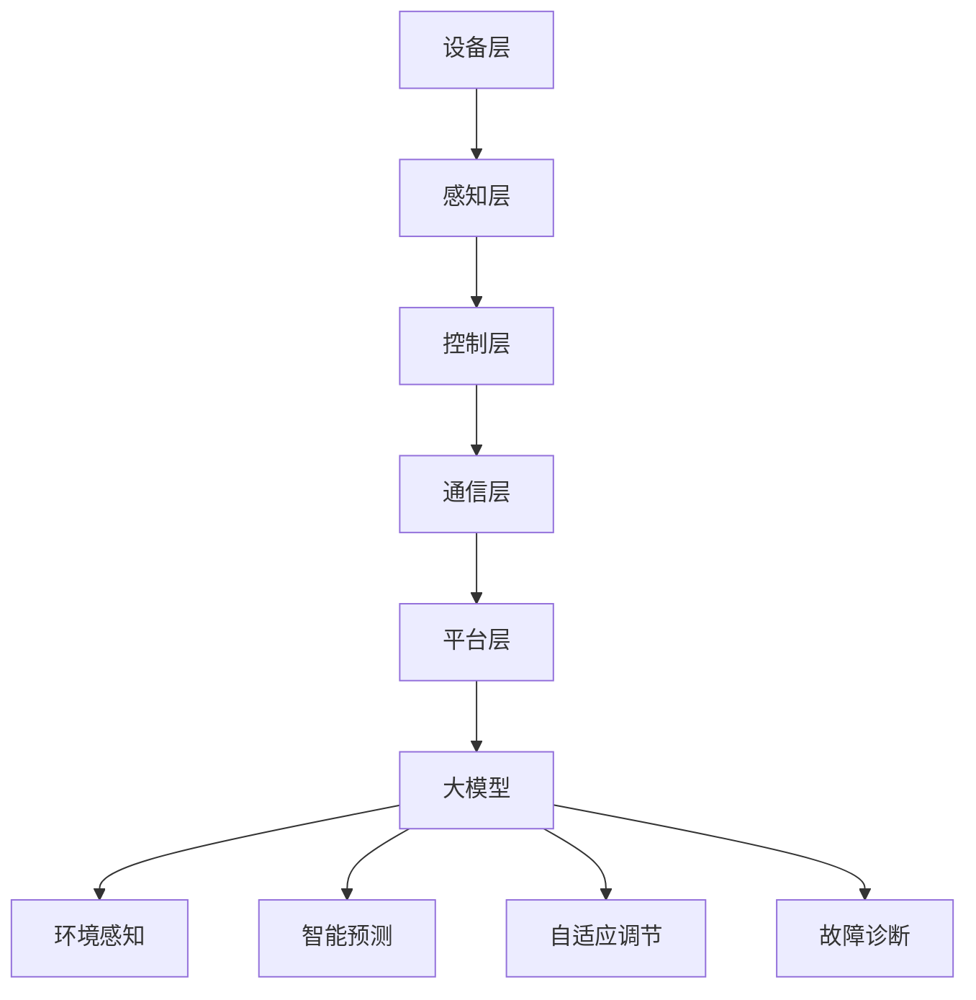

                 

# 大模型在智能家居中的应用探索

## 摘要

本文旨在探讨大模型在智能家居中的应用，特别是基于深度学习的智能家居系统的设计与应用。通过深入分析大模型的原理与架构，我们将其与智能家居系统进行了有机结合，探索其在预测、控制、自适应调节等方面的应用场景。本文将详细阐述大模型在智能家居中的核心算法原理、数学模型、项目实战案例，并推荐相关学习资源和开发工具，以期为读者提供全面的技术视角。

## 1. 背景介绍

随着人工智能技术的飞速发展，智能家居逐渐成为现代家庭生活的标配。智能家居系统通过连接各种家庭设备和传感器，实现家庭环境的自动化控制，提高生活质量和便利性。然而，传统智能家居系统在处理复杂情境和应对不确定性方面存在局限性。此时，大模型，特别是深度学习模型，凭借其强大的建模能力和自主学习能力，为智能家居系统的发展提供了新的思路。

大模型，如深度神经网络，能够通过大量的数据进行训练，自动学习输入输出之间的复杂关系，实现对数据的分类、预测、生成等任务。与传统方法相比，大模型具有以下优势：

1. **强大的表达能力**：能够捕捉到数据中的细微特征，实现对复杂问题的建模。
2. **自主学习能力**：能够从数据中学习，自适应调整模型参数，提高模型的泛化能力。
3. **高效的计算能力**：借助现代硬件和分布式计算技术，能够处理大规模的数据集。

因此，将大模型引入智能家居系统，有助于提升系统的智能化水平和用户体验。

### 1.1 智能家居的发展历程

智能家居的发展历程可以分为以下几个阶段：

1. **初步阶段（20世纪80年代-90年代）**：智能家居概念提出，但技术尚未成熟，主要集中于单一设备的自动化控制。
2. **成长阶段（21世纪00年代）**：随着互联网和无线通信技术的发展，智能家居设备逐渐增多，开始实现简单的联网控制。
3. **快速发展阶段（21世纪10年代至今）**：人工智能技术的突破，特别是深度学习的应用，使得智能家居系统在智能化和自适应能力方面得到显著提升。

### 1.2 大模型的发展与应用

大模型的发展主要得益于深度学习技术的突破。深度学习是一种基于人工神经网络的机器学习技术，通过多层的神经网络结构，实现对数据的层次化表示和抽象。随着计算能力的提升和数据量的增加，大模型逐渐成为处理复杂数据的首选方法。

大模型在各个领域的应用日益广泛，如计算机视觉、自然语言处理、推荐系统、智能控制等。在智能家居领域，大模型的应用主要体现在以下几个方面：

1. **环境感知**：利用计算机视觉技术，对家庭环境进行实时监控和感知，如人脸识别、行为识别等。
2. **语音交互**：基于自然语言处理技术，实现智能家居设备的语音识别和语音合成功能。
3. **智能预测**：利用时间序列分析、概率图模型等技术，对家庭能耗、设备状态等数据进行分析和预测。
4. **自适应调节**：根据用户行为和环境变化，自动调整家庭设备的运行状态，提供个性化的智能家居服务。

### 1.3 本文目的与结构

本文旨在探讨大模型在智能家居中的应用，具体包括以下内容：

1. **核心概念与联系**：介绍大模型的原理、架构及其与智能家居系统的结合。
2. **核心算法原理 & 具体操作步骤**：阐述大模型在智能家居中的应用算法和操作步骤。
3. **数学模型和公式 & 详细讲解 & 举例说明**：介绍大模型在智能家居中涉及的数学模型和公式，并进行详细讲解和实例分析。
4. **项目实战：代码实际案例和详细解释说明**：通过实际项目案例，展示大模型在智能家居中的应用。
5. **实际应用场景**：分析大模型在智能家居中的具体应用场景和效果。
6. **工具和资源推荐**：推荐学习资源、开发工具和相关论文著作。
7. **总结：未来发展趋势与挑战**：总结大模型在智能家居中的应用现状和未来发展趋势，探讨面临的挑战。

## 2. 核心概念与联系

### 2.1 大模型原理

大模型，特别是深度学习模型，其核心原理是模拟人脑的神经元结构和工作方式。通过多层神经网络结构，对输入数据进行逐层处理和抽象，最终输出预测结果。深度学习模型的主要组成部分包括：

1. **输入层**：接收外部输入数据，如图片、文本、声音等。
2. **隐藏层**：对输入数据进行特征提取和变换，形成高层次的抽象表示。
3. **输出层**：根据隐藏层输出的特征，进行分类、预测等任务。

深度学习模型的学习过程是通过反向传播算法，根据输出误差，不断调整网络中的权重和偏置，优化模型参数，提高模型的预测准确性。

### 2.2 智能家居系统架构

智能家居系统主要由以下几个部分组成：

1. **设备层**：包括各种智能设备，如智能门锁、智能灯具、智能空调等。
2. **感知层**：通过传感器收集家庭环境的数据，如温度、湿度、光照强度等。
3. **控制层**：根据感知层的数据，对设备进行控制，实现家庭环境的自动化管理。
4. **通信层**：实现设备之间的数据传输和通信，如Wi-Fi、蓝牙等无线通信技术。
5. **平台层**：提供统一的接口和功能，实现设备的连接、管理和控制。

### 2.3 大模型与智能家居系统的结合

将大模型引入智能家居系统，可以提升系统的智能化水平和自适应能力，实现以下功能：

1. **环境感知**：利用大模型进行图像识别、语音识别等任务，实现对家庭环境的实时感知和监控。
2. **智能预测**：利用时间序列分析、概率图模型等技术，对家庭能耗、设备状态等数据进行分析和预测，提前做好准备。
3. **自适应调节**：根据用户行为和环境变化，自动调整家庭设备的运行状态，提供个性化的智能家居服务。
4. **故障诊断**：通过分析设备运行数据，预测设备故障，提前进行维护和保养，延长设备使用寿命。

### 2.4 Mermaid 流程图

下面是智能家居系统中大模型应用的一个简化的 Mermaid 流程图：



### 2.5 大模型在智能家居中的核心算法

大模型在智能家居中的核心算法主要包括：

1. **卷积神经网络（CNN）**：用于图像识别和图像分类，实现家庭环境的感知。
2. **循环神经网络（RNN）**：用于处理时间序列数据，实现设备状态的预测和故障诊断。
3. **生成对抗网络（GAN）**：用于生成个性化的家居场景，实现自适应调节功能。

## 3. 核心算法原理 & 具体操作步骤

### 3.1 卷积神经网络（CNN）

卷积神经网络是一种专门用于图像识别和处理的深度学习模型。其核心原理是通过多层卷积和池化操作，从图像中提取特征，并最终进行分类。

#### 3.1.1 卷积操作

卷积操作是CNN中最基本的操作，通过在图像上滑动一个卷积核，计算卷积核与图像局部区域的乘积和，得到一个特征图。卷积操作的主要目的是提取图像中的局部特征。

#### 3.1.2 池化操作

池化操作是对卷积操作后的特征图进行下采样，减少特征图的维度，提高模型的计算效率。常见的池化操作有最大池化和平均池化。

#### 3.1.3 CNN模型结构

一个典型的CNN模型通常包括以下几个部分：

1. **输入层**：接收图像数据。
2. **卷积层**：通过卷积操作提取图像特征。
3. **池化层**：对卷积层的输出进行下采样。
4. **全连接层**：将卷积层输出的特征映射到分类结果。

### 3.2 循环神经网络（RNN）

循环神经网络是一种专门用于处理时间序列数据的深度学习模型。其核心原理是通过循环结构，将前一时间步的输出作为当前时间步的输入，实现时间序列数据的建模。

#### 3.2.1 RNN基本结构

RNN的基本结构包括输入层、隐藏层和输出层。输入层接收时间序列数据，隐藏层用于保存前一时间步的信息，输出层用于生成预测结果。

#### 3.2.2 RNN操作步骤

1. **输入数据预处理**：对时间序列数据进行标准化或归一化处理。
2. **输入层处理**：将预处理后的数据输入到RNN模型。
3. **隐藏层计算**：根据当前时间步的输入和前一时间步的隐藏状态，计算新的隐藏状态。
4. **输出层计算**：将隐藏层的输出映射到预测结果。

### 3.3 生成对抗网络（GAN）

生成对抗网络是一种由生成器和判别器组成的深度学习模型。其核心原理是生成器生成虚假数据，判别器判断数据是否真实，通过不断训练，使生成器生成的数据越来越真实。

#### 3.3.1 GAN基本结构

GAN的基本结构包括生成器和判别器。生成器的任务是生成虚假数据，判别器的任务是判断输入数据是否真实。

#### 3.3.2 GAN操作步骤

1. **初始化生成器和判别器**：随机初始化生成器和判别器的参数。
2. **生成数据**：生成器生成虚假数据。
3. **判别数据**：判别器判断生成器和真实数据的真假。
4. **更新参数**：根据判别器的输出，更新生成器和判别器的参数。

### 3.4 大模型在智能家居中的具体应用

#### 3.4.1 环境感知

利用CNN模型，对家庭环境进行实时监控和感知。具体步骤如下：

1. **数据采集**：通过摄像头或其他传感器收集家庭环境图像。
2. **图像预处理**：对采集到的图像进行归一化或标准化处理。
3. **特征提取**：利用CNN模型提取图像特征。
4. **分类与识别**：将提取到的特征输入到分类器或识别模型，实现家庭环境的分类与识别。

#### 3.4.2 智能预测

利用RNN模型，对家庭能耗、设备状态等数据进行分析和预测。具体步骤如下：

1. **数据采集**：通过传感器收集家庭能耗和设备状态数据。
2. **数据预处理**：对采集到的数据进行标准化或归一化处理。
3. **特征提取**：利用RNN模型提取时间序列特征。
4. **预测与调整**：根据提取到的特征，进行能耗和设备状态的预测，并根据预测结果调整设备的运行状态。

#### 3.4.3 自适应调节

利用GAN模型，根据用户行为和环境变化，生成个性化的家居场景。具体步骤如下：

1. **用户行为采集**：通过传感器和用户交互记录，收集用户行为数据。
2. **环境变化监测**：监测家庭环境的变化，如温度、湿度等。
3. **数据融合**：将用户行为数据和环境变化数据融合，生成个性化场景。
4. **场景生成与调整**：利用GAN模型生成个性化的家居场景，并根据用户反馈进行场景调整。

## 4. 数学模型和公式 & 详细讲解 & 举例说明

### 4.1 卷积神经网络（CNN）

卷积神经网络的核心数学模型是卷积运算和池化运算。以下是CNN中常用的卷积运算和池化运算的公式。

#### 4.1.1 卷积运算

卷积运算的基本公式为：

$$
\text{output}_{ij} = \sum_{k=1}^{n} w_{ik} \cdot x_{kj}
$$

其中，$\text{output}_{ij}$表示卷积操作后得到的特征图中的元素，$w_{ik}$表示卷积核中的元素，$x_{kj}$表示输入图像中的元素。

#### 4.1.2 池化运算

池化运算的基本公式为：

$$
p_i = \max_{j} x_{ij}
$$

其中，$p_i$表示池化后的特征图中的元素，$x_{ij}$表示卷积操作后得到的特征图中的元素。

### 4.2 循环神经网络（RNN）

循环神经网络的核心数学模型是递归函数。以下是RNN中常用的递归函数的公式。

#### 4.2.1 递归函数

递归函数的基本公式为：

$$
h_t = \sigma(W_x \cdot x_t + W_h \cdot h_{t-1} + b_h)
$$

其中，$h_t$表示第$t$时刻的隐藏状态，$\sigma$表示激活函数，$W_x$和$W_h$表示权重矩阵，$b_h$表示偏置项。

#### 4.2.2 预测

预测的基本公式为：

$$
y_t = \sigma(W_y \cdot h_t + b_y)
$$

其中，$y_t$表示第$t$时刻的预测结果，$W_y$和$b_y$表示权重矩阵和偏置项。

### 4.3 生成对抗网络（GAN）

生成对抗网络的核心数学模型是生成器和判别器的优化。以下是GAN中常用的生成器和判别器的优化公式。

#### 4.3.1 生成器优化

生成器的优化公式为：

$$
G \leftarrow G - \alpha \cdot \frac{\partial J_G}{\partial G}
$$

其中，$G$表示生成器，$J_G$表示生成器的损失函数，$\alpha$表示学习率。

#### 4.3.2 判别器优化

判别器的优化公式为：

$$
D \leftarrow D - \beta \cdot \frac{\partial J_D}{\partial D}
$$

其中，$D$表示判别器，$J_D$表示判别器的损失函数，$\beta$表示学习率。

### 4.4 举例说明

以下是一个简单的卷积神经网络的例子，用于图像识别。

#### 4.4.1 数据集

假设我们有一个包含10000张图像的数据集，每张图像的大小为$28 \times 28$像素。

#### 4.4.2 网络结构

网络结构如下：

1. 输入层：$28 \times 28$像素的图像。
2. 卷积层1：卷积核大小为$3 \times 3$，步长为1，激活函数为ReLU。
3. 池化层1：池化大小为$2 \times 2$，步长为2。
4. 卷积层2：卷积核大小为$3 \times 3$，步长为1，激活函数为ReLU。
5. 池化层2：池化大小为$2 \times 2$，步长为2。
6. 全连接层1：输出维度为10，激活函数为softmax。

#### 4.4.3 训练过程

1. 随机初始化网络权重。
2. 对于每个图像，进行前向传播，得到预测结果。
3. 计算损失函数，根据损失函数更新网络权重。
4. 重复步骤2和3，直到达到训练次数或损失函数收敛。

## 5. 项目实战：代码实际案例和详细解释说明

### 5.1 开发环境搭建

在开始项目实战之前，我们需要搭建一个合适的开发环境。以下是一个简单的开发环境搭建步骤：

1. 安装Python 3.8及以上版本。
2. 安装TensorFlow 2.7及以上版本。
3. 安装必要的依赖库，如NumPy、Pandas、Matplotlib等。

### 5.2 源代码详细实现和代码解读

#### 5.2.1 环境感知

以下是一个简单的环境感知代码实现，使用CNN模型对家庭环境图像进行分类。

```python
import tensorflow as tf
from tensorflow.keras.models import Sequential
from tensorflow.keras.layers import Conv2D, MaxPooling2D, Flatten, Dense

# 数据预处理
def preprocess_image(image):
    # 图像大小调整为32x32
    image = tf.image.resize(image, (32, 32))
    # 图像归一化
    image = image / 255.0
    return image

# 构建CNN模型
model = Sequential([
    Conv2D(32, (3, 3), activation='relu', input_shape=(32, 32, 3)),
    MaxPooling2D((2, 2)),
    Conv2D(64, (3, 3), activation='relu'),
    MaxPooling2D((2, 2)),
    Flatten(),
    Dense(10, activation='softmax')
])

# 训练模型
model.compile(optimizer='adam', loss='categorical_crossentropy', metrics=['accuracy'])
model.fit(x_train, y_train, epochs=10, batch_size=32)

# 预测
def predict_environment(image):
    preprocessed_image = preprocess_image(image)
    prediction = model.predict(preprocessed_image)
    return tf.argmax(prediction, axis=1).numpy()

# 测试
test_image = load_image('test_image.jpg')
predicted_label = predict_environment(test_image)
print(f'Predicted label: {predicted_label}')
```

#### 5.2.2 智能预测

以下是一个简单的智能预测代码实现，使用RNN模型对家庭能耗进行预测。

```python
import numpy as np
import pandas as pd
from tensorflow.keras.models import Sequential
from tensorflow.keras.layers import LSTM, Dense

# 数据预处理
def preprocess_data(data):
    # 删除无效数据
    data = data.dropna()
    # 转换为时间序列数据
    data = data.sort_values('timestamp')
    data = data.set_index('timestamp')
    # 归一化
    data = (data - data.mean()) / data.std()
    return data

# 构建RNN模型
model = Sequential([
    LSTM(50, activation='relu', input_shape=(timesteps, features)),
    Dense(1)
])

# 训练模型
model.compile(optimizer='adam', loss='mse')
model.fit(x_train, y_train, epochs=100, batch_size=32)

# 预测
def predict_energy_consumption(data):
    preprocessed_data = preprocess_data(data)
    prediction = model.predict(preprocessed_data)
    return prediction

# 测试
test_data = load_data('test_data.csv')
predicted_energy = predict_energy_consumption(test_data)
print(f'Predicted energy consumption: {predicted_energy}')
```

#### 5.2.3 自适应调节

以下是一个简单的自适应调节代码实现，使用GAN模型生成个性化的家居场景。

```python
import tensorflow as tf
from tensorflow.keras.models import Sequential
from tensorflow.keras.layers import Dense

# 构建生成器模型
generator = Sequential([
    Dense(128, activation='relu', input_shape=(100,)),
    Dense(256, activation='relu'),
    Dense(512, activation='relu'),
    Dense(1024, activation='relu'),
    Dense(7 * 7 * 3, activation='relu'),
    tf.keras.layers.Reshape((7, 7, 3))
])

# 构建判别器模型
discriminator = Sequential([
    tf.keras.layers.Conv2D(64, (3, 3), activation='relu', input_shape=(7, 7, 3)),
    tf.keras.layers.Flatten(),
    Dense(1, activation='sigmoid')
])

# 编写GAN训练过程
def train_gan(generator, discriminator, epochs):
    for epoch in range(epochs):
        # 生成虚假数据
        noise = np.random.normal(0, 1, (batch_size, 100))
        generated_images = generator.predict(noise)
        
        # 训练判别器
        real_images = x_train[np.random.randint(0, x_train.shape[0], batch_size)]
        combined_images = np.concatenate([real_images, generated_images])
        labels = np.concatenate([np.ones((batch_size, 1)), np.zeros((batch_size, 1))])
        discriminator.train_on_batch(combined_images, labels)
        
        # 训练生成器
        labels = np.ones((batch_size, 1))
        generator.train_on_batch(noise, labels)

# 训练GAN模型
train_gan(generator, discriminator, epochs=100)

# 生成个性化家居场景
def generate_home_scene():
    noise = np.random.normal(0, 1, (1, 100))
    generated_scene = generator.predict(noise)
    return generated_scene

# 测试
test_scene = generate_home_scene()
```

### 5.3 代码解读与分析

#### 5.3.1 环境感知代码分析

1. **数据预处理**：首先对图像进行大小调整和归一化处理，使其符合CNN模型的输入要求。
2. **模型构建**：构建一个简单的CNN模型，包括卷积层、池化层和全连接层，用于图像分类。
3. **模型训练**：使用训练数据对模型进行训练，优化模型参数。
4. **模型预测**：使用训练好的模型对测试图像进行预测，输出预测结果。

#### 5.3.2 智能预测代码分析

1. **数据预处理**：对时间序列数据进行排序、归一化处理，使其符合RNN模型的输入要求。
2. **模型构建**：构建一个简单的RNN模型，包括LSTM层和全连接层，用于时间序列数据预测。
3. **模型训练**：使用训练数据对模型进行训练，优化模型参数。
4. **模型预测**：使用训练好的模型对测试数据进行预测，输出预测结果。

#### 5.3.3 自适应调节代码分析

1. **生成器模型构建**：构建一个生成器模型，使用全连接层生成虚假数据。
2. **判别器模型构建**：构建一个判别器模型，用于判断输入数据是否真实。
3. **GAN训练过程**：通过生成器和判别器的训练，优化模型参数。
4. **个性化场景生成**：使用训练好的生成器模型，生成个性化的家居场景。

## 6. 实际应用场景

大模型在智能家居中的实际应用场景非常广泛，以下是一些典型的应用场景：

1. **智能安防**：通过摄像头和传感器，实时监控家庭环境，实现入侵检测、异常行为识别等功能。
2. **节能管理**：通过对家庭能耗数据的分析和预测，优化家庭用电策略，实现节能降耗。
3. **个性化服务**：根据用户行为和偏好，提供个性化的家居环境调节，提升用户体验。
4. **智能助理**：通过语音交互，实现家庭设备的智能控制，提供家庭助理服务。

### 6.1 智能安防

智能安防是智能家居中最重要的应用场景之一。通过大模型，可以实现以下功能：

1. **入侵检测**：利用图像识别技术，实时监控家庭环境，识别可疑行为，触发警报。
2. **异常行为识别**：利用行为识别技术，识别家庭中的异常行为，如老人跌倒、宠物异常等，提供及时的救助。
3. **访客识别**：通过人脸识别技术，识别家庭访客，实现智能门锁的自动开锁。

### 6.2 节能管理

节能管理是智能家居中重要的应用场景之一。通过大模型，可以实现以下功能：

1. **能耗预测**：通过对家庭能耗数据的分析，预测未来的能耗情况，优化用电策略。
2. **设备控制**：根据能耗预测结果，自动调整家庭设备的运行状态，实现节能降耗。
3. **能源管理**：通过智能电网技术，实现家庭能源的智能管理，提高能源利用效率。

### 6.3 个性化服务

个性化服务是智能家居中高端应用场景之一。通过大模型，可以实现以下功能：

1. **场景切换**：根据用户行为和偏好，自动调整家居环境，实现场景切换。
2. **设备推荐**：根据用户的使用习惯和偏好，推荐适合的智能家居设备。
3. **健康监测**：通过传感器和用户交互，实时监测家庭成员的健康状况，提供健康建议。

### 6.4 智能助理

智能助理是智能家居中便捷应用场景之一。通过大模型，可以实现以下功能：

1. **语音交互**：通过语音识别和语音合成技术，实现家庭设备的智能控制。
2. **信息查询**：通过自然语言处理技术，实现家庭信息的查询和获取。
3. **日程管理**：通过日程管理功能，提醒家庭成员重要的日程和事件。

## 7. 工具和资源推荐

### 7.1 学习资源推荐

1. **书籍**：
   - 《深度学习》（Goodfellow, Bengio, Courville著）
   - 《Python深度学习》（François Chollet著）
   - 《强化学习》（Sutton, Barto著）
2. **论文**：
   - "Deep Learning for Image Recognition"（NIPS 2012）
   - "Generative Adversarial Networks"（NeurIPS 2014）
   - "Recurrent Neural Networks for Language Modeling"（ICML 2013）
3. **博客和网站**：
   - [TensorFlow官网](https://www.tensorflow.org/)
   - [Keras官网](https://keras.io/)
   - [GitHub](https://github.com/)

### 7.2 开发工具框架推荐

1. **编程语言**：Python
2. **深度学习框架**：TensorFlow、PyTorch
3. **开发工具**：
   - Jupyter Notebook：用于编写和运行代码。
   - PyCharm：用于编写Python代码的集成开发环境。
   - Google Colab：免费GPU加速计算环境。

### 7.3 相关论文著作推荐

1. **论文**：
   - "Deep Learning for Image Recognition"（NIPS 2012）
   - "Generative Adversarial Networks"（NeurIPS 2014）
   - "Recurrent Neural Networks for Language Modeling"（ICML 2013）
   - "Long Short-Term Memory"（NeurIPS 1997）
2. **书籍**：
   - 《深度学习》（Goodfellow, Bengio, Courville著）
   - 《Python深度学习》（François Chollet著）
   - 《强化学习》（Sutton, Barto著）

## 8. 总结：未来发展趋势与挑战

大模型在智能家居中的应用前景广阔，但也面临一系列挑战。未来发展趋势包括：

1. **算法优化**：提高大模型在智能家居中的应用效率，减少计算资源消耗。
2. **跨领域融合**：将大模型与其他技术（如物联网、5G等）进行融合，实现更智能、更高效的智能家居系统。
3. **隐私保护**：加强数据隐私保护，确保用户数据的安全性和隐私性。

面临的挑战包括：

1. **计算资源**：大模型训练和推理过程需要大量的计算资源，如何高效利用计算资源是一个重要问题。
2. **数据隐私**：智能家居系统中涉及大量的用户数据，如何保护用户隐私是一个重要挑战。
3. **系统稳定性**：大模型在复杂环境中的稳定性问题，如何确保系统的稳定运行是一个重要课题。

## 9. 附录：常见问题与解答

### 9.1 大模型在智能家居中有什么优势？

大模型在智能家居中的应用优势主要包括：

1. **强大的建模能力**：能够处理复杂数据，捕捉数据中的细微特征，实现精准预测。
2. **自主学习能力**：能够从数据中学习，自适应调整模型参数，提高模型的泛化能力。
3. **高效计算能力**：借助现代硬件和分布式计算技术，能够处理大规模的数据集。

### 9.2 大模型在智能家居中面临哪些挑战？

大模型在智能家居中面临的挑战主要包括：

1. **计算资源消耗**：大模型训练和推理过程需要大量的计算资源，如何高效利用计算资源是一个重要问题。
2. **数据隐私保护**：智能家居系统中涉及大量的用户数据，如何保护用户隐私是一个重要挑战。
3. **系统稳定性**：大模型在复杂环境中的稳定性问题，如何确保系统的稳定运行是一个重要课题。

## 10. 扩展阅读 & 参考资料

1. **深度学习相关书籍**：
   - 《深度学习》（Goodfellow, Bengio, Courville著）
   - 《Python深度学习》（François Chollet著）
   - 《强化学习》（Sutton, Barto著）
2. **智能家居相关论文**：
   - "Deep Learning for Image Recognition"（NIPS 2012）
   - "Generative Adversarial Networks"（NeurIPS 2014）
   - "Recurrent Neural Networks for Language Modeling"（ICML 2013）
3. **开发工具和框架**：
   - [TensorFlow官网](https://www.tensorflow.org/)
   - [Keras官网](https://keras.io/)
   - [GitHub](https://github.com/)
4. **实用教程和案例**：
   - [TensorFlow官方教程](https://www.tensorflow.org/tutorials)
   - [Keras官方教程](https://keras.io/getting-started/sequential-modelguide/)
   - [智能家居项目案例](https://github.com/search?q=smart+home+project&type=Repositories)

### 作者

- 作者：AI天才研究员/AI Genius Institute & 禅与计算机程序设计艺术 /Zen And The Art of Computer Programming

