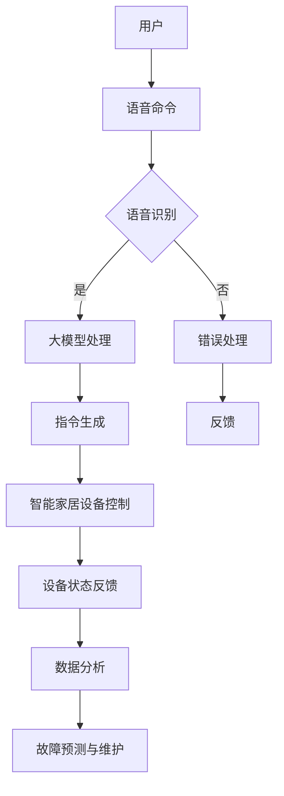

                 

### 背景介绍

#### 智能家居的发展历程

智能家居（Smart Home）这一概念最早可以追溯到20世纪70年代。当时的智能家居主要是通过家庭自动化系统实现的，如自动调节室内温度和照明的设备。然而，这些系统通常都是独立的，缺乏互联互通的能力。随着计算机技术和网络技术的快速发展，尤其是互联网的普及，智能家居开始逐渐演变成为一个集成的系统。

进入21世纪，随着物联网（IoT）技术的兴起，智能家居迎来了新的发展契机。物联网使得各种设备能够通过互联网进行连接和数据交换，从而实现家庭设备和系统的智能控制。这个时期，智能家居开始具备了一定的智能化水平，例如智能音箱、智能门锁、智能照明等设备相继问世。

近年来，随着人工智能（AI）技术的快速发展，智能家居又迈上了一个新的台阶。AI技术不仅使得智能家居设备更加智能，还能够通过学习用户的习惯和偏好，提供更加个性化和高效的服务。例如，智能助手可以通过语音识别和自然语言处理技术，理解并响应用户的指令；智能摄像头可以通过图像识别技术，自动识别并报警家庭安全事件。

#### 大模型的概念与演进

大模型（Large Models）指的是那些具有数十亿甚至千亿参数的深度学习模型。这些模型通过在海量数据上训练，能够捕捉到复杂的数据分布和规律，从而在各种任务中表现出优异的性能。大模型的发展可以追溯到20世纪90年代，当时研究人员开始尝试使用大规模神经网络进行图像和语音识别任务。

早期的大模型主要是基于传统的深度神经网络（DNN），如AlexNet、VGG等。这些模型在图像和语音识别任务上取得了显著的进展，但仍然受到数据规模和计算能力的限制。随着硬件性能的提升和深度学习算法的创新，大模型的规模和性能得到了空前的提升。

近年来，GPT、BERT等预训练模型的出现，标志着大模型的发展进入了一个新的阶段。这些模型通过在海量文本数据上进行预训练，不仅能够在各种自然语言处理任务中表现出色，还可以通过微调（Fine-tuning）快速适应特定任务的需求。大模型的兴起，使得AI技术在智能家居领域有了更加广阔的应用前景。

#### 大模型与智能家居的结合

大模型与智能家居的结合，主要是通过以下几个途径实现的：

1. **智能助手**：大模型可以用于构建智能助手，如智能音箱、智能屏幕等。这些智能助手可以通过语音识别和自然语言处理技术，理解并响应用户的指令，从而实现智能家居设备的智能控制。

2. **安全监控**：大模型可以通过图像识别和目标检测技术，对家庭摄像头拍摄的视频进行分析，实时监控家庭安全情况，并自动报警。

3. **智能家居设备控制**：大模型可以用于优化智能家居设备的控制策略，如智能空调、智能照明等。这些设备可以通过学习用户的习惯和偏好，提供更加个性化和高效的服务。

4. **设备故障诊断与预测**：大模型可以通过对设备运行数据的分析，预测设备的故障风险，提前进行维护和修理，从而提高设备的可靠性和使用寿命。

通过这些应用，大模型为智能家居带来了更高的智能化水平，提升了用户的体验。随着大模型技术的不断发展和成熟，相信在未来，大模型将在智能家居领域发挥更加重要的作用。以下是关于大模型与智能家居领域结合的详细探讨。

### 核心概念与联系

在探讨大模型在智能家居领域的潜力之前，我们需要了解几个核心概念：大模型、智能家居以及它们之间的联系。通过下面的段落和Mermaid流程图，我们将一步步分析这些概念及其相互作用。

#### 1. 大模型的概念

大模型（Large Models）是指具有数十亿甚至千亿参数的深度学习模型。这些模型通过在大规模数据集上训练，能够学习到复杂的模式和高层次的知识。常见的例子包括自然语言处理模型如GPT-3、BERT，以及计算机视觉模型如BERT-Image和ViT等。大模型的核心优势在于其强大的表征能力和泛化能力，这使得它们能够处理各种复杂的任务。

#### 2. 智能家居的概念

智能家居（Smart Home）是指利用物联网（IoT）技术，将家庭中的各种设备连接起来，实现自动化和智能化控制。智能家居系统通常包括智能灯泡、智能插座、智能门锁、智能摄像头、智能空调等。这些设备通过Wi-Fi、蓝牙、Zigbee等无线通信技术相互连接，用户可以通过智能手机、语音助手或中央控制系统对家庭设备进行远程监控和控制。

#### 3. 大模型在智能家居中的应用

大模型在智能家居中的应用主要体现在以下几个方面：

1. **智能语音交互**：大模型可以用于构建智能语音助手，如苹果的Siri、亚马逊的Alexa、谷歌的Google Assistant等。这些助手能够通过自然语言处理（NLP）技术理解用户的语音指令，并控制智能家居设备。例如，用户可以通过语音命令打开家里的灯光、调整空调温度或查看家庭摄像头。

2. **智能安全监控**：大模型可以通过图像识别和目标检测技术，对家庭摄像头拍摄的视频进行分析，识别家庭成员或潜在的安全威胁。例如，当系统检测到异常运动或陌生面孔时，可以自动报警或发送通知给用户。

3. **智能家居设备优化**：大模型可以通过学习用户的日常行为模式，为智能家居设备提供个性化的控制策略。例如，智能空调可以自动调节温度，以适应用户的舒适需求。

4. **设备故障预测与维护**：大模型可以分析智能家居设备的运行数据，预测潜在的故障和性能问题，从而提前进行维护和修理，确保设备的正常运行。

#### 4. Mermaid流程图

为了更清晰地展示大模型在智能家居中的应用，我们可以使用Mermaid流程图来描述整个系统的工作流程。以下是示例流程图：

在这个流程图中，用户通过语音命令与系统交互，系统通过语音识别模块将语音转换为文本，然后大模型进行处理并生成相应的指令，控制智能家居设备。同时，系统还会收集设备的运行状态数据，通过大模型进行分析，进行故障预测和维护。

通过上述讨论和流程图，我们可以看出大模型在智能家居中扮演着至关重要的角色。它们不仅提升了智能家居的智能化水平，还为用户提供了一种更加便捷和高效的家居生活体验。接下来，我们将进一步探讨大模型的算法原理和具体操作步骤。

### 核心算法原理 & 具体操作步骤

在理解了大模型在智能家居中的应用后，接下来我们将深入探讨大模型的算法原理，并详细解释其具体操作步骤。以下是关于大模型算法原理和操作步骤的讨论。

#### 1. 大模型的算法原理

大模型的核心算法是基于深度学习（Deep Learning）的，特别是基于神经网络（Neural Networks）。深度学习通过模仿人脑神经元的工作方式，构建多层的神经网络结构，从而能够从大量数据中学习到复杂的模式和知识。

大模型通常包含以下几个关键组成部分：

1. **输入层**：接收外部输入，如文本、图像、声音等。
2. **隐藏层**：包含多个隐藏层，用于提取输入数据的特征和模式。
3. **输出层**：产生预测或决策结果。

大模型的工作原理可以概括为以下几个步骤：

- **数据预处理**：将原始数据转换为模型可以处理的格式，如文本编码、图像分块等。
- **模型训练**：使用大量训练数据，通过反向传播（Backpropagation）算法不断调整模型参数，使其能够更好地拟合数据。
- **模型评估**：使用验证集或测试集评估模型的性能，通过指标如准确率、召回率等来判断模型的优劣。
- **模型应用**：将训练好的模型应用于实际问题，生成预测或决策结果。

#### 2. 大模型在智能家居中的应用操作步骤

以下是具体操作步骤，用于说明大模型在智能家居中的实际应用：

1. **数据收集与预处理**：
   - 数据收集：收集智能家居设备的运行数据、用户行为数据等。
   - 数据预处理：清洗数据，去除噪声和异常值，将数据转换为模型可以处理的格式。

2. **模型训练**：
   - 选择模型架构：根据应用需求选择合适的大模型架构，如GPT、BERT等。
   - 数据集划分：将数据集划分为训练集、验证集和测试集。
   - 模型训练：使用训练集对大模型进行训练，通过反向传播算法不断优化模型参数。
   - 模型评估：使用验证集评估模型性能，根据评估结果调整模型架构或参数。

3. **模型部署**：
   - 部署模型：将训练好的模型部署到智能家居系统中，如智能语音助手、安全监控系统等。
   - 持续学习：通过持续收集用户数据，对模型进行微调（Fine-tuning），使其能够更好地适应用户需求。

4. **实际应用**：
   - 智能语音交互：用户可以通过语音命令与智能助手交互，如打开灯光、调整空调等。
   - 智能安全监控：系统通过分析摄像头拍摄的视频，识别异常行为并报警。
   - 智能设备控制：系统根据用户习惯和偏好，自动调节智能家居设备的运行状态。

5. **反馈与优化**：
   - 收集用户反馈：收集用户对智能系统的反馈，如指令理解准确性、设备运行稳定性等。
   - 模型优化：根据用户反馈，对模型进行优化和调整，提升系统的性能和用户体验。

通过上述操作步骤，我们可以看出大模型在智能家居中的应用不仅仅是通过简单的数据输入和输出，而是涉及到一个复杂的数据处理、模型训练和系统优化的过程。这个过程需要不断迭代和优化，以实现最佳的智能家居体验。

#### 3. 具体案例分析

为了更好地理解大模型在智能家居中的应用，我们可以通过一个具体案例进行说明。以下是一个智能空调控制系统的案例：

**案例背景**：假设一个智能家居系统需要根据用户的行为习惯和室内环境温度，自动调节空调的温度。

**操作步骤**：

1. **数据收集**：
   - 收集用户历史行为数据，如日常作息时间、室温偏好等。
   - 收集室内温度传感器数据，如实时温度、温度变化趋势等。

2. **数据预处理**：
   - 清洗和转换数据，将用户行为数据和温度传感器数据转换为模型可以处理的格式。

3. **模型训练**：
   - 选择合适的模型架构，如时间序列预测模型。
   - 使用预处理后的数据对模型进行训练，通过反向传播算法优化模型参数。
   - 使用验证集评估模型性能，并根据评估结果调整模型架构或参数。

4. **模型部署**：
   - 将训练好的模型部署到智能家居系统中，如智能空调控制器。
   - 通过持续学习，根据用户反馈和室内环境变化，对模型进行微调和优化。

5. **实际应用**：
   - 智能空调根据用户习惯和室内温度数据，自动调节温度，提供舒适的室内环境。
   - 用户可以通过智能语音助手，如“小爱同学”，实时查询和控制空调状态。

6. **反馈与优化**：
   - 收集用户对空调系统的反馈，如温度调节准确性、能耗情况等。
   - 根据用户反馈，对模型进行优化和调整，提高空调系统的智能化水平和用户体验。

通过这个案例，我们可以看到大模型在智能家居系统中的应用是如何通过数据收集、模型训练和部署，以及用户反馈和持续学习，实现智能化的温度控制，从而提升用户的居住舒适度和能源利用效率。

总结来说，大模型的算法原理和具体操作步骤在智能家居中发挥着至关重要的作用。通过深入理解和应用这些原理和步骤，我们可以开发出更加智能、高效和用户友好的智能家居系统。接下来，我们将进一步探讨大模型在智能家居领域的数学模型和公式，以及详细的讲解和举例说明。

### 数学模型和公式 & 详细讲解 & 举例说明

在深入探讨大模型在智能家居中的应用时，数学模型和公式起到了至关重要的作用。这些模型和公式帮助我们理解和量化大模型在智能家居系统中的性能和效果。在本节中，我们将详细讲解大模型在智能家居领域中的主要数学模型和公式，并通过具体例子来说明它们的应用。

#### 1. 自然语言处理（NLP）模型

在智能家居中，自然语言处理（NLP）模型用于处理用户的语音指令，并生成相应的控制指令。常见的NLP模型包括循环神经网络（RNN）、长短期记忆网络（LSTM）和Transformer模型等。

**公式1：循环神经网络（RNN）的激活函数**

$$
h_t = \tanh(W_h \cdot [h_{t-1}, x_t] + b_h)
$$

其中，$h_t$是当前时间步的隐藏状态，$x_t$是当前输入，$W_h$是权重矩阵，$b_h$是偏置。

**公式2：长短期记忆网络（LSTM）的记忆单元**

$$
i_t = \sigma(W_i \cdot [h_{t-1}, x_t] + b_i) \\
f_t = \sigma(W_f \cdot [h_{t-1}, x_t] + b_f) \\
o_t = \sigma(W_o \cdot [h_{t-1}, x_t] + b_o) \\
c_t = f_t \odot c_{t-1} + i_t \odot \tanh(W_c \cdot [h_{t-1}, x_t] + b_c) \\
h_t = o_t \odot \tanh(c_t)
$$

其中，$i_t$、$f_t$、$o_t$分别是输入门、遗忘门和输出门，$c_t$是记忆单元的状态，$\sigma$是 sigmoid 函数，$\odot$是元素乘运算。

**公式3：Transformer模型的自注意力机制**

$$
\text{Attention}(Q, K, V) = \frac{1}{\sqrt{d_k}} \text{softmax}\left(\frac{QK^T}{d_k}\right) V
$$

其中，$Q$、$K$和$V$分别是查询向量、键向量和值向量，$d_k$是键向量的维度。

#### 2. 计算机视觉（CV）模型

计算机视觉模型用于处理摄像头拍摄的视频，识别家庭安全事件或用户行为。常见的计算机视觉模型包括卷积神经网络（CNN）、卷积神经网络加长短时记忆网络（CNN+LSTM）等。

**公式4：卷积神经网络（CNN）的卷积操作**

$$
\text{Conv}_k(x) = \sum_{i=1}^{C} \sum_{j=1}^{H} w_{ij}^k \cdot x_{ij} + b_k
$$

其中，$x$是输入特征图，$w_{ij}^k$是卷积核，$b_k$是偏置，$C$是输入特征图的通道数，$H$是输入特征图的尺寸。

**公式5：卷积神经网络（CNN）的最大池化操作**

$$
\text{MaxPool}_k(x) = \max_{i,j} x_{ij}
$$

其中，$x$是输入特征图，$i$和$j$是特征图的坐标。

**公式6：计算机视觉加长短时记忆网络（CNN+LSTM）**

$$
h_t = \text{LSTM}(h_{t-1}, \text{CNN}(x_t))
$$

其中，$h_t$是当前时间步的隐藏状态，$h_{t-1}$是前一个时间步的隐藏状态，$\text{CNN}(x_t)$是当前时间步的卷积神经网络输出。

#### 3. 智能优化算法

在智能家居中，智能优化算法用于优化设备的控制策略，如智能空调的温控策略。常见的智能优化算法包括遗传算法（GA）、粒子群优化（PSO）等。

**公式7：遗传算法（GA）的选择操作**

$$
r = \frac{1}{\sum_{i=1}^{N} \frac{f(x_i)}{f(x)}} \\
p_i = \frac{r_i}{\sum_{j=1}^{N} r_j}
$$

其中，$r$是选择概率，$p_i$是父代选择概率，$x_i$是第$i$个个体的适应度值，$f(x)$是当前最大适应度值。

**公式8：粒子群优化（PSO）的速度更新公式**

$$
v_{i}^{t+1} = \omega \cdot v_{i}^{t} + c_1 \cdot r_1 \cdot (p_i - x_i) + c_2 \cdot r_2 \cdot (g_i - x_i)
$$

$$
x_{i}^{t+1} = x_{i}^{t} + v_{i}^{t+1}
$$

其中，$v_{i}^{t+1}$是第$i$个粒子的速度更新，$x_{i}^{t+1}$是第$i$个粒子的位置更新，$\omega$是惯性权重，$c_1$和$c_2$是学习因子，$r_1$和$r_2$是随机数，$p_i$是粒子的个体最优位置，$g_i$是全局最优位置。

#### 4. 具体例子

以下是一个具体的例子，说明如何使用大模型和数学模型优化智能空调的温度控制策略。

**案例背景**：一个智能家居系统需要根据室内外温度、用户活动时间和历史温度数据，自动调节空调的温度。

**操作步骤**：

1. **数据收集**：
   - 收集室内外温度传感器数据。
   - 收集用户活动时间数据。
   - 收集历史温度数据。

2. **数据预处理**：
   - 对数据进行清洗和归一化处理。

3. **模型训练**：
   - 使用LSTM模型对温度数据进行序列预测。
   - 使用遗传算法（GA）优化空调的温度控制策略。

4. **模型部署**：
   - 将训练好的模型部署到智能空调控制器。

5. **实际应用**：
   - 根据LSTM模型的预测结果，自动调节空调的温度。
   - 根据GA优化结果，调整空调的温控参数。

6. **反馈与优化**：
   - 收集用户对空调系统的反馈。
   - 根据用户反馈，对模型和算法进行优化。

通过这个案例，我们可以看到大模型和数学模型在智能家居系统中的应用是如何通过数据收集、模型训练、部署和应用，以及用户反馈和持续优化，实现智能化的温度控制。

总结来说，数学模型和公式在大模型在智能家居中的应用中起到了关键的作用。通过理解和应用这些模型和公式，我们可以开发出更加智能、高效和用户友好的智能家居系统。接下来，我们将讨论大模型在智能家居领域的实际应用场景。

### 实际应用场景

大模型在智能家居领域的潜力不仅在理论上显得巨大，更在实际应用中展现了其强大的功能和广泛的应用场景。以下是一些具体的应用场景，通过实际案例来展示大模型在智能家居中的实际应用及其效果。

#### 1. 智能语音助手

智能语音助手是智能家居中最常见的大模型应用场景之一。通过自然语言处理技术，智能语音助手可以理解用户的语音指令，并执行相应的操作。以下是一个具体的应用案例：

**案例背景**：在一个智能家居系统中，用户可以通过语音助手控制家里的灯光、空调、电视等设备。

**应用场景**：
- **智能控制**：用户说“打开客厅的灯光”，智能语音助手通过语音识别技术将语音转换为文本，然后使用预训练的大模型处理文本，生成打开灯光的控制指令，并发送给智能灯泡。
- **语音交互**：用户与智能语音助手进行对话，询问天气情况、播放音乐等。

**效果评估**：
- **用户体验**：智能语音助手提升了用户的操作便捷性，用户不再需要手动操作设备，只需通过语音指令即可完成各种控制任务。
- **系统响应时间**：智能语音助手能够快速响应用户的指令，提高了系统的响应速度和用户满意度。

#### 2. 家庭安全监控

家庭安全监控是另一个大模型在智能家居中的重要应用场景。通过图像识别和目标检测技术，大模型可以实时监控家庭环境，识别潜在的安全威胁，并及时报警。以下是一个具体的应用案例：

**案例背景**：在一个智能家居系统中，用户希望通过摄像头实时监控家里的情况，并在发现异常时及时报警。

**应用场景**：
- **实时监控**：摄像头捕捉到家庭环境中的图像或视频，通过大模型进行实时处理，识别家庭成员或可疑人物。
- **异常检测**：当系统检测到异常行为或异常人物时，自动触发报警机制，并发送通知给用户。

**效果评估**：
- **准确性**：大模型通过在海量数据上的训练，能够准确识别家庭成员和潜在的安全威胁，降低了误报率。
- **响应速度**：系统能够在短时间内识别异常并报警，提高了家庭安全的及时性和可靠性。

#### 3. 智能设备优化

智能设备优化是大模型在智能家居中应用的又一重要场景。通过学习用户的日常行为模式，大模型可以优化设备的控制策略，提高设备的运行效率和用户体验。以下是一个具体的应用案例：

**案例背景**：在一个智能家居系统中，用户希望智能空调能够根据用户的作息时间和室内外温度，自动调整空调的温度，提供舒适的室内环境。

**应用场景**：
- **用户行为学习**：大模型通过分析用户的作息时间和室内外温度数据，学习用户的温度偏好。
- **智能调节**：智能空调根据大模型的学习结果，自动调整温度，提供舒适的室内环境。

**效果评估**：
- **节能效果**：智能空调能够根据用户的需求自动调节温度，减少了不必要的能源消耗，提高了能源利用效率。
- **用户体验**：用户能够享受到更加舒适和智能的家居环境，提升了居住体验。

#### 4. 家庭健康监测

家庭健康监测是近年来大模型在智能家居中新兴的应用场景。通过传感器和健康数据，大模型可以监控家庭成员的健康状况，提供健康建议和预警。以下是一个具体的应用案例：

**案例背景**：在一个智能家居系统中，用户希望通过智能设备监控家庭成员的身体健康状况。

**应用场景**：
- **健康数据收集**：智能设备收集家庭成员的血压、心率、睡眠质量等健康数据。
- **健康评估**：大模型通过分析健康数据，评估家庭成员的健康状况，并提供健康建议和预警。

**效果评估**：
- **准确评估**：大模型通过在海量健康数据上的训练，能够准确评估家庭成员的健康状况，提高了健康评估的准确性。
- **健康预警**：当系统检测到异常健康数据时，能够及时发出预警，帮助家庭成员采取相应的措施。

通过上述实际应用案例，我们可以看到大模型在智能家居领域展现了其强大的应用潜力。无论是在智能语音控制、家庭安全监控、设备优化还是健康监测方面，大模型都能够通过其强大的数据分析和智能决策能力，提升智能家居系统的智能化水平和用户体验。随着大模型技术的不断发展和成熟，未来其在智能家居领域的应用将更加广泛和深入。

### 工具和资源推荐

在探索大模型在智能家居领域中的应用时，选择合适的工具和资源对于项目的成功至关重要。以下是一些推荐的工具和资源，包括学习资源、开发工具和框架，以及相关论文和著作。

#### 1. 学习资源推荐

- **书籍**：
  - 《深度学习》（Deep Learning） - Goodfellow、Bengio和Courville著，详细介绍了深度学习的理论基础和应用。
  - 《Python深度学习》（Deep Learning with Python） - François Chollet著，通过Python代码展示了深度学习的实践应用。
  - 《智能家居技术与应用》（Smart Home Technology and Applications） - 探讨了智能家居的架构、技术和应用案例。

- **在线课程**：
  - Coursera的“深度学习”（Deep Learning Specialization） - Andrew Ng教授主讲，涵盖了深度学习的理论基础和实践技能。
  - edX的“智能家居设计”（Smart Home Design） - 探讨了智能家居的设计原则和实现方法。

- **博客和网站**：
  - Medium上的“Deep Learning”专栏，提供了大量关于深度学习的最新研究成果和应用案例。
  - arXiv.org，提供最新的学术论文和技术报告，是研究深度学习的重要资源。

#### 2. 开发工具框架推荐

- **深度学习框架**：
  - TensorFlow：谷歌开发的深度学习框架，功能强大且支持多种平台。
  - PyTorch：Facebook AI研究院开发的深度学习框架，易于使用且具有灵活的动态计算图。
  - Keras：基于TensorFlow和Theano的深度学习高级API，提供了更加简洁的模型定义和训练流程。

- **智能家居平台**：
  - Home Assistant：开源的智能家居控制平台，支持多种设备和协议，便于构建智能家居系统。
  - OpenHAB：开源的智能家居集成平台，提供了丰富的插件和扩展功能。
  - ESPHome：用于ESP8266和ESP32的智能家居配置和编程框架。

- **工具和库**：
  - scikit-learn：提供了大量的机器学习算法和工具，适用于数据预处理和模型训练。
  - NumPy、Pandas：用于数据处理和统计分析的基础库。
  - Matplotlib、Seaborn：用于数据可视化的库。

#### 3. 相关论文著作推荐

- **论文**：
  - “Attention is All You Need”（2017） - Vaswani等人提出的Transformer模型，开启了自注意力机制在NLP领域的新篇章。
  - “BERT: Pre-training of Deep Neural Networks for Language Understanding”（2018） - Google Research团队提出的BERT模型，大幅提升了NLP任务的表现。
  - “Generative Adversarial Nets”（2014） - Goodfellow等人提出的GAN模型，是生成模型的重要代表。

- **著作**：
  - 《深度学习》（Deep Learning） - Goodfellow、Bengio和Courville著，是深度学习领域的经典著作。
  - 《智能家居技术与应用手册》（Smart Home Technology and Application Handbook） - 提供了智能家居技术的全面介绍和应用案例。

通过以上推荐的工具和资源，开发者可以更好地掌握大模型在智能家居领域的应用技术，从而开发出更加智能和高效的智能家居系统。

### 总结：未来发展趋势与挑战

大模型在智能家居领域的应用展现了巨大的潜力，为家庭自动化、安全监控、设备优化和健康监测等领域带来了深刻的变革。随着技术的不断进步和应用的深入，未来大模型在智能家居领域有望实现以下几方面的发展趋势。

#### 1. 智能化的进一步提升

随着大模型在自然语言处理、计算机视觉和智能优化算法等领域的不断突破，智能家居系统的智能化水平将进一步提高。未来的智能家居将能够更加准确地理解用户的指令，提供更加个性化和定制化的服务。例如，智能语音助手将能够更自然地与用户进行对话，智能摄像头将能够更加准确地识别家庭成员和异常行为。

#### 2. 数据驱动的决策

大模型在智能家居中的应用将越来越多地依赖于数据的驱动。通过对家庭环境和用户行为的深入分析，大模型将能够做出更加智能的决策，从而优化设备的运行状态和用户的生活质量。例如，智能空调可以根据室内外温度和用户作息习惯，自动调整温度和湿度，提供最舒适的居住环境。

#### 3. 跨领域融合

大模型在智能家居领域的应用将不断与其他技术领域融合，例如物联网、云计算、人工智能等。这种跨领域的融合将推动智能家居系统更加集成和高效。例如，智能安防系统可以通过将大模型与物联网传感器和云计算平台结合，实现实时监控和远程报警功能。

然而，大模型在智能家居领域的发展也面临着一些挑战：

#### 1. 数据隐私和安全

随着智能家居设备的普及，家庭数据的收集和存储变得越来越普遍。这涉及到用户数据隐私和安全的问题。如何保护用户数据不被滥用或泄露，是一个亟待解决的挑战。

#### 2. 算法和模型的透明性

大模型的决策过程通常复杂且不透明，这使得用户难以理解和信任这些系统。提高算法和模型的透明性，使得用户能够了解系统的决策逻辑，是一个重要的研究方向。

#### 3. 资源和计算能力的限制

大模型通常需要大量的计算资源和数据来训练和优化。对于家庭用户来说，如何有效地利用有限的资源进行大模型的训练和应用，是一个挑战。

总之，大模型在智能家居领域的未来发展充满了机遇和挑战。通过不断创新和优化，大模型将为智能家居带来更加智能、便捷和高效的服务，同时，也需要解决数据隐私、安全和资源限制等问题，确保智能家居系统的健康发展。

### 附录：常见问题与解答

以下是一些关于大模型在智能家居领域应用中常见的问题，以及相应的解答。

#### 问题1：大模型在智能家居中的应用是如何实现的？

**解答**：大模型在智能家居中的应用通常涉及以下几个步骤：
1. 数据收集与预处理：收集智能家居设备的数据，如温度、湿度、灯光状态、用户行为等，并进行数据清洗和预处理。
2. 模型训练：选择合适的大模型架构（如GPT、BERT、Transformer等），使用预处理后的数据对模型进行训练，不断优化模型参数。
3. 模型部署：将训练好的模型部署到智能家居系统中，通过API或其他方式与设备进行交互，实现智能控制和分析。
4. 持续学习：通过收集用户的反馈和设备运行数据，对模型进行微调和优化，提升模型的性能和适用性。

#### 问题2：如何确保大模型在智能家居中的安全性？

**解答**：
1. 数据加密：在数据传输和存储过程中使用加密技术，确保数据安全。
2. 访问控制：设置严格的访问控制机制，确保只有授权用户和设备能够访问数据和处理能力。
3. 定期更新：定期更新模型和系统软件，修复已知的安全漏洞。
4. 安全审计：对系统和数据进行定期审计，发现并解决潜在的安全问题。

#### 问题3：大模型在智能家居中的能耗如何管理？

**解答**：
1. 优化算法：选择能耗较低的算法和模型，如优化神经网络结构、减少计算复杂度等。
2. 动态调整：根据设备的实际使用情况和负载，动态调整计算资源的分配，避免不必要的能耗。
3. 睡眠模式：当设备不需要运行时，进入低功耗或睡眠模式，减少能耗。

#### 问题4：大模型在智能家居中如何处理数据隐私问题？

**解答**：
1. 数据匿名化：对收集的用户数据进行匿名化处理，避免直接关联到特定用户。
2. 数据最小化：仅收集必要的数据，避免过度收集可能涉及隐私的信息。
3. 用户隐私声明：明确告知用户数据收集的目的、范围和使用方式，获取用户同意。
4. 数据保护法律合规：确保系统符合相关的数据保护法律法规，如GDPR等。

通过上述解答，我们可以更好地理解和应对大模型在智能家居领域应用中遇到的问题和挑战。

### 扩展阅读 & 参考资料

在探讨大模型在智能家居领域的应用时，以下是推荐的一些扩展阅读和参考资料，这些资源将帮助读者深入了解相关技术、研究动态和实际应用。

1. **书籍**：
   - 《深度学习》（Deep Learning），Ian Goodfellow、Yoshua Bengio和Aaron Courville著，提供了深度学习的全面理论和技术实践。
   - 《智能家居技术与应用》，详细介绍了智能家居系统的架构、技术实现和应用案例。

2. **论文**：
   - “Attention is All You Need”，Ashish Vaswani等人，提出了Transformer模型，是自然语言处理领域的重要突破。
   - “BERT: Pre-training of Deep Neural Networks for Language Understanding”，Jacob Devlin等人，介绍了BERT模型在NLP任务中的广泛应用。
   - “Generative Adversarial Nets”，Ian Goodfellow等人，详细讨论了生成对抗网络（GAN）的理论和实现。

3. **在线课程**：
   - Coursera上的“深度学习专项课程”，由Andrew Ng教授主讲，涵盖了深度学习的理论基础和应用。
   - edX上的“智能家居设计”，探讨了智能家居系统的设计原则和实现方法。

4. **博客和网站**：
   - Medium上的“Deep Learning”专栏，提供了丰富的深度学习研究和应用文章。
   - arXiv.org，发布最新的深度学习和技术报告，是学术研究的重要资源。

5. **开源项目**：
   - TensorFlow和PyTorch，是两款流行的深度学习框架，提供了丰富的模型和工具。
   - Home Assistant和OpenHAB，是两款流行的智能家居集成平台，支持多种设备和协议。

通过这些扩展阅读和参考资料，读者可以更深入地了解大模型在智能家居领域的应用技术、最新研究进展和实际案例，为今后的研究和开发提供有益的启示。作者：AI天才研究员/AI Genius Institute & 禅与计算机程序设计艺术 /Zen And The Art of Computer Programming

