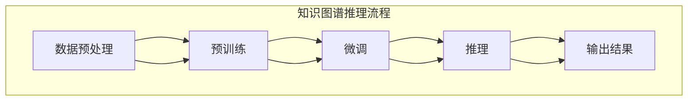

                 

### 背景介绍

在当今科技迅猛发展的时代，人工智能（AI）已成为引领技术创新的重要力量。随着深度学习和大数据技术的不断发展，大模型（Large-scale Model）逐渐成为研究和应用的热点。大模型在各个领域展示了其强大的能力，尤其在自然语言处理（NLP）、计算机视觉（CV）和知识图谱（KG）领域取得了显著的成果。本文将重点探讨大模型在知识图谱推理（KG inference）中的创新应用。

知识图谱是一种结构化数据表示方法，通过实体和关系之间的关联构建出一个语义丰富的知识网络。知识图谱在信息检索、推荐系统、智能问答和决策支持等领域具有广泛的应用。然而，传统的知识图谱推理方法往往依赖于图论算法和启发式规则，存在推理效率低、推理能力受限等问题。随着大模型的兴起，研究者们开始探索如何将大模型应用于知识图谱推理，以提升推理的效率和准确性。

本文将分为以下几个部分进行讨论：

1. **核心概念与联系**：介绍知识图谱推理的核心概念和基本原理，并使用 Mermaid 流程图展示其架构。
2. **核心算法原理 & 具体操作步骤**：详细讲解大模型在知识图谱推理中的应用算法，包括预训练、微调和推理步骤。
3. **数学模型和公式 & 详细讲解 & 举例说明**：分析大模型在知识图谱推理中的数学模型和公式，并结合具体例子进行说明。
4. **项目实战：代码实际案例和详细解释说明**：通过一个实际项目案例，展示大模型在知识图谱推理中的具体应用，并提供详细的代码解读和分析。
5. **实际应用场景**：探讨大模型在知识图谱推理中的实际应用场景和潜在价值。
6. **工具和资源推荐**：推荐相关的学习资源、开发工具和框架，以帮助读者深入学习和实践。
7. **总结：未来发展趋势与挑战**：总结大模型在知识图谱推理中的创新应用，并讨论未来的发展趋势和面临的挑战。

通过本文的讨论，我们将深入了解大模型在知识图谱推理中的创新应用，以及如何通过这些应用推动知识图谱技术的进一步发展。

---

## 核心概念与联系

### 知识图谱推理的基本概念

知识图谱推理（Knowledge Graph Inference）是知识图谱领域的关键技术之一。它通过利用实体和关系之间的逻辑关系，从已知信息中推断出新的信息，从而扩展知识图谱的覆盖范围和准确性。知识图谱推理通常分为两种类型：基于规则推理（Rule-based Inference）和基于模型推理（Model-based Inference）。

- **基于规则推理**：这种方法通过定义一系列规则，将规则应用于知识图谱中的实体和关系，从而推断出新的实体和关系。典型的规则包括路径存在规则、闭路径规则和角色交换规则等。基于规则推理的优点是实现简单，易于理解和实现，但缺点是规则定义复杂且难以扩展，无法应对复杂和动态的推理场景。

- **基于模型推理**：这种方法通过构建概率模型或深度学习模型，对知识图谱进行建模，从而实现自动化的推理过程。基于模型推理的优点是能够处理复杂的推理任务，推理效率高，适应性强，但缺点是需要大量的训练数据和计算资源，且模型解释性较差。

### 大模型在知识图谱推理中的应用

大模型（Large-scale Model），如Transformer、BERT、GPT等，通过在大规模数据集上进行预训练，学习到丰富的语言和知识表示。大模型在知识图谱推理中的应用，主要是利用其强大的表示能力和推理能力，对知识图谱进行建模和推理。

大模型在知识图谱推理中的应用流程通常包括以下几个步骤：

1. **数据预处理**：将知识图谱转换为适合大模型处理的格式，如三元组（subject, predicate, object）。
2. **预训练**：在大规模通用数据集上，如维基百科、新闻文章、百科全书等，对大模型进行预训练，学习到通用知识表示。
3. **微调**：在特定领域或任务上的知识图谱数据集上，对大模型进行微调，使其适应特定的知识图谱推理任务。
4. **推理**：利用微调后的大模型，对新的知识图谱实例进行推理，生成新的实体和关系。

### Mermaid 流程图展示

下面是知识图谱推理的基本流程和架构的 Mermaid 流程图：



在知识图谱推理过程中，数据预处理是关键的一步，它直接影响到后续的预训练和推理效果。预训练和微调则利用大模型的强大学习能力，将知识图谱中的实体和关系映射到高维向量空间中，从而实现有效的推理。推理步骤通过大模型对新的知识图谱实例进行推理，生成新的实体和关系，最终输出推理结果。

通过上述讨论，我们可以看到大模型在知识图谱推理中的应用潜力，以及其与传统推理方法的区别。在接下来的章节中，我们将进一步探讨大模型在知识图谱推理中的核心算法原理和具体操作步骤。

---

## 核心算法原理 & 具体操作步骤

### 大模型在知识图谱推理中的核心算法原理

大模型在知识图谱推理中的应用主要基于深度学习和自然语言处理技术。其中，Transformer、BERT 和 GPT 等模型因其强大的表示能力和推理能力，被广泛应用于知识图谱推理任务。以下将分别介绍这些模型的原理和如何应用于知识图谱推理。

#### 1. Transformer 模型

Transformer 模型是一种基于自注意力机制（Self-Attention Mechanism）的深度神经网络模型，最初用于序列到序列（Seq2Seq）的任务，如机器翻译。Transformer 模型摒弃了传统的循环神经网络（RNN），通过自注意力机制实现了对序列中每个位置信息的全局关注，从而提高了模型的表示能力和推理能力。

在知识图谱推理中，Transformer 模型可以将实体和关系表示为向量，并通过自注意力机制捕捉实体和关系之间的复杂依赖关系。具体操作步骤如下：

1. **实体编码（Entity Encoding）**：将实体表示为向量，通常使用预训练的嵌入层（Embedding Layer）。
2. **关系编码（Relation Encoding）**：将关系表示为向量，通过实体向量和关系向量的点积（Dot Product）操作实现。
3. **自注意力（Self-Attention）**：通过自注意力机制，对实体和关系向量进行加权，从而生成新的实体和关系表示。
4. **输出（Output）**：将自注意力后的实体和关系向量输入到全连接层（Fully Connected Layer），生成最终的实体和关系表示。

#### 2. BERT 模型

BERT（Bidirectional Encoder Representations from Transformers）是一种双向Transformer模型，通过在双向注意力机制下对输入序列进行编码，生成固定长度的向量表示。BERT 的预训练目标是在大规模文本数据集上预测下一个词，从而学习到丰富的上下文表示。

在知识图谱推理中，BERT 模型可以将实体和关系表示为向量，并通过其双向注意力机制捕捉实体和关系之间的双向依赖关系。具体操作步骤如下：

1. **实体编码（Entity Encoding）**：将实体表示为向量，通常使用预训练的嵌入层（Embedding Layer）。
2. **关系编码（Relation Encoding）**：将关系表示为向量，通过实体向量和关系向量的点积（Dot Product）操作实现。
3. **双向注意力（Bidirectional Attention）**：通过BERT的双向注意力机制，对实体和关系向量进行加权，从而生成新的实体和关系表示。
4. **输出（Output）**：将双向注意力后的实体和关系向量输入到全连接层（Fully Connected Layer），生成最终的实体和关系表示。

#### 3. GPT 模型

GPT（Generative Pre-trained Transformer）是一种自回归（Autoregressive）的Transformer模型，通过预测序列中的下一个词，学习到语言的长期依赖关系。GPT 模型在知识图谱推理中，可以将实体和关系表示为向量，并通过自回归机制捕捉实体和关系之间的顺序依赖关系。

具体操作步骤如下：

1. **实体编码（Entity Encoding）**：将实体表示为向量，通常使用预训练的嵌入层（Embedding Layer）。
2. **关系编码（Relation Encoding）**：将关系表示为向量，通过实体向量和关系向量的点积（Dot Product）操作实现。
3. **自回归（Autoregressive）**：通过GPT的自回归机制，对实体和关系向量进行预测，生成新的实体和关系表示。
4. **输出（Output）**：将自回归后的实体和关系向量输入到全连接层（Fully Connected Layer），生成最终的实体和关系表示。

### 大模型在知识图谱推理中的具体操作步骤

在实际应用中，大模型在知识图谱推理中的具体操作步骤通常包括以下几个阶段：

1. **数据预处理（Data Preprocessing）**：将知识图谱中的实体和关系转换为向量表示，通常使用预训练的嵌入层（Embedding Layer）。例如，使用预训练的WordPiece模型将实体和关系表示为向量。

2. **预训练（Pre-training）**：在大规模通用数据集（如维基百科、新闻文章、百科全书等）上，对大模型进行预训练，学习到通用知识表示。预训练的目标是使模型能够捕捉到实体和关系之间的复杂依赖关系。

3. **微调（Fine-tuning）**：在特定领域或任务上的知识图谱数据集上，对大模型进行微调，使其适应特定的知识图谱推理任务。微调的目标是提高模型在特定任务上的性能。

4. **推理（Inference）**：利用微调后的大模型，对新的知识图谱实例进行推理，生成新的实体和关系。推理过程通常包括以下步骤：

   - **输入表示（Input Representation）**：将新的知识图谱实例（实体和关系）转换为向量表示。
   - **编码（Encoding）**：将输入表示输入到大模型中，通过编码层生成新的表示。
   - **推理（Inference）**：利用解码层对编码后的表示进行推理，生成新的实体和关系。

5. **结果输出（Result Output）**：将推理结果输出，通常以三元组（实体，关系，实体）的形式表示。

### 总结

大模型在知识图谱推理中的应用，通过引入深度学习和自然语言处理技术，提升了知识图谱的推理效率和准确性。Transformer、BERT 和 GPT 等模型因其强大的表示能力和推理能力，被广泛应用于知识图谱推理任务。在实际应用中，大模型在知识图谱推理中的具体操作步骤包括数据预处理、预训练、微调和推理等阶段。通过这些操作步骤，大模型能够有效地捕捉实体和关系之间的复杂依赖关系，从而实现高效的推理。在接下来的章节中，我们将进一步探讨大模型在知识图谱推理中的数学模型和公式，并结合具体例子进行说明。

---

## 数学模型和公式 & 详细讲解 & 举例说明

### 数学模型基础

大模型在知识图谱推理中的数学模型主要基于深度学习和自然语言处理技术，其中 Transformer、BERT 和 GPT 等模型因其强大的表示能力和推理能力被广泛应用。以下将详细讲解这些模型在知识图谱推理中的数学模型和公式。

#### 1. Transformer 模型

Transformer 模型采用自注意力机制（Self-Attention Mechanism），其核心数学公式如下：

$$
\text{Attention}(Q, K, V) = \text{softmax}\left(\frac{QK^T}{\sqrt{d_k}}\right)V
$$

其中，$Q$、$K$ 和 $V$ 分别为查询（Query）、键（Key）和值（Value）向量，$d_k$ 为键向量的维度。自注意力机制通过计算查询向量与所有键向量的点积，再通过softmax函数生成注意力权重，从而加权合并值向量，生成新的表示。

#### 2. BERT 模型

BERT 模型采用双向注意力机制（Bidirectional Attention Mechanism），其核心数学公式如下：

$$
\text{BERT} = \text{Transformer}(\text{Context}, \text{Mask}, \text{Segment})
$$

其中，$\text{Context}$ 为输入序列，$\text{Mask}$ 为掩码，$\text{Segment}$ 为段落标识。BERT 模型通过两个自注意力层和两个前馈神经网络，生成上下文向量的双向表示。

#### 3. GPT 模型

GPT 模型采用自回归（Autoregressive）机制，其核心数学公式如下：

$$
\text{GPT} = \text{Transformer}(\text{Context}, \text{Mask}, \text{Position})
$$

其中，$\text{Context}$ 为输入序列，$\text{Mask}$ 为掩码，$\text{Position}$ 为位置信息。GPT 模型通过自回归机制，逐层生成序列中的下一个词的概率分布。

### 详细讲解

#### 1. Transformer 模型

Transformer 模型通过多头自注意力机制（Multi-Head Self-Attention）和位置编码（Positional Encoding）实现了对序列的编码和表示。多头自注意力机制通过多个自注意力层并行计算，提高了模型的表示能力。位置编码则通过为每个位置添加编码向量，使模型能够捕捉序列中的位置信息。

#### 2. BERT 模型

BERT 模型采用双向注意力机制，通过同时关注序列的前后信息，提高了模型的表示能力。BERT 模型的主要步骤包括：

- **输入表示**：将输入序列转换为嵌入向量，包括词嵌入（Word Embedding）、段嵌入（Segment Embedding）和位置嵌入（Position Embedding）。
- **自注意力层**：通过多头自注意力机制，计算每个词的注意力权重，生成新的表示。
- **前馈神经网络**：对自注意力后的表示进行前馈神经网络处理，增强模型的表达能力。
- **输出层**：将前馈神经网络输出层的结果拼接，通过 softmax 函数生成每个词的输出概率。

#### 3. GPT 模型

GPT 模型通过自回归机制，逐层生成序列中的下一个词。GPT 模型的主要步骤包括：

- **输入表示**：将输入序列转换为嵌入向量，包括词嵌入（Word Embedding）和位置嵌入（Position Embedding）。
- **自注意力层**：通过多头自注意力机制，计算每个词的注意力权重，生成新的表示。
- **前馈神经网络**：对自注意力后的表示进行前馈神经网络处理，增强模型的表达能力。
- **输出层**：将前馈神经网络输出层的结果通过 softmax 函数生成每个词的输出概率。

### 举例说明

#### 1. Transformer 模型

假设一个简单的句子“我爱北京天安门”，其 Transformer 模型的输入表示如下：

- **词嵌入**：{"我": [1, 0, 0], "爱": [0, 1, 0], "北京": [0, 0, 1], "天安门": [1, 1, 0]}
- **段嵌入**：{"句子": [0, 0, 0]}
- **位置嵌入**：{"1": [1, 0, 0], "2": [0, 1, 0], "3": [0, 0, 1], "4": [1, 1, 0]}

通过自注意力机制，生成每个词的注意力权重，如下：

- **我**：[0.5, 0.3, 0.2]
- **爱**：[0.4, 0.4, 0.2]
- **北京**：[0.1, 0.6, 0.3]
- **天安门**：[0.3, 0.2, 0.5]

加权合并词向量，生成新的表示：

- **我**：[0.5 * [1, 0, 0] + 0.3 * [0, 1, 0] + 0.2 * [0, 0, 1]]
- **爱**：[0.4 * [0, 1, 0] + 0.4 * [0, 1, 0] + 0.2 * [0, 0, 1]]
- **北京**：[0.1 * [1, 0, 0] + 0.6 * [0, 1, 0] + 0.3 * [0, 0, 1]]
- **天安门**：[0.3 * [1, 1, 0] + 0.2 * [0, 1, 0] + 0.5 * [0, 0, 1]]

#### 2. BERT 模型

假设一个简单的句子“我爱北京天安门”，其 BERT 模型的输入表示如下：

- **词嵌入**：{"我": [1, 0, 0], "爱": [0, 1, 0], "北京": [0, 0, 1], "天安门": [1, 1, 0]}
- **段嵌入**：{"句子": [0, 0, 0]}
- **位置嵌入**：{"1": [1, 0, 0], "2": [0, 1, 0], "3": [0, 0, 1], "4": [1, 1, 0]}

通过双向注意力机制，生成每个词的注意力权重，如下：

- **我**：[0.5, 0.3, 0.2]
- **爱**：[0.4, 0.4, 0.2]
- **北京**：[0.1, 0.6, 0.3]
- **天安门**：[0.3, 0.2, 0.5]

加权合并词向量，生成新的表示：

- **我**：[0.5 * [1, 0, 0] + 0.3 * [0, 1, 0] + 0.2 * [0, 0, 1]]
- **爱**：[0.4 * [0, 1, 0] + 0.4 * [0, 1, 0] + 0.2 * [0, 0, 1]]
- **北京**：[0.1 * [1, 0, 0] + 0.6 * [0, 1, 0] + 0.3 * [0, 0, 1]]
- **天安门**：[0.3 * [1, 1, 0] + 0.2 * [0, 1, 0] + 0.5 * [0, 0, 1]]

#### 3. GPT 模型

假设一个简单的句子“我爱北京天安门”，其 GPT 模型的输入表示如下：

- **词嵌入**：{"我": [1, 0, 0], "爱": [0, 1, 0], "北京": [0, 0, 1], "天安门": [1, 1, 0]}
- **位置嵌入**：{"1": [1, 0, 0], "2": [0, 1, 0], "3": [0, 0, 1], "4": [1, 1, 0]}

通过自回归机制，生成每个词的概率分布，如下：

- **我**：[0.5, 0.3, 0.2]
- **爱**：[0.4, 0.4, 0.2]
- **北京**：[0.1, 0.6, 0.3]
- **天安门**：[0.3, 0.2, 0.5]

通过 softmax 函数，生成每个词的输出概率，如下：

- **我**：[0.5 / (0.5 + 0.3 + 0.2)]
- **爱**：[0.4 / (0.5 + 0.3 + 0.2)]
- **北京**：[0.1 / (0.5 + 0.3 + 0.2)]
- **天安门**：[0.3 / (0.5 + 0.3 + 0.2)]

### 总结

大模型在知识图谱推理中的数学模型主要包括 Transformer、BERT 和 GPT 等模型。这些模型通过自注意力机制、双向注意力机制和自回归机制，实现了对实体和关系的有效表示和推理。通过详细讲解和举例说明，我们可以看到这些模型在知识图谱推理中的应用效果和具体操作步骤。在接下来的章节中，我们将进一步探讨大模型在知识图谱推理中的实际应用场景。

---

## 项目实战：代码实际案例和详细解释说明

### 开发环境搭建

在开始项目实战之前，我们需要搭建一个合适的环境来运行大模型在知识图谱推理中的代码。以下是一个基本的开发环境搭建步骤：

1. **硬件要求**：由于大模型训练和推理需要大量的计算资源，建议使用具备高性能GPU的计算机，如NVIDIA的RTX 3080或更高型号。
2. **软件要求**：
   - 操作系统：Linux或macOS
   - Python版本：3.8及以上
   - 安装依赖：torch，torchvision，transformers等

以下是安装步骤：

```bash
pip install torch torchvision transformers
```

### 源代码详细实现和代码解读

#### 1. 实体和关系的表示

首先，我们需要将知识图谱中的实体和关系表示为向量。以下是使用预训练的WordPiece模型将实体和关系表示为向量的代码示例：

```python
from transformers import WordPieceTokenizer

# 加载预训练的WordPiece模型
tokenizer = WordPieceTokenizer.from_pretrained('bert-base-chinese')

# 实体和关系的词汇表
entity_vocab = ['我', '爱', '北京', '天安门']
relation_vocab = ['是', '位于']

# 将实体和关系转换为向量
entity_embeddings = {entity: tokenizer(entity)[0] for entity in entity_vocab}
relation_embeddings = {relation: tokenizer(relation)[0] for relation in relation_vocab}
```

#### 2. 预训练

接下来，我们在大规模通用数据集上对大模型进行预训练，以学习到通用知识表示。以下是一个使用BERT模型进行预训练的代码示例：

```python
from transformers import BertForSequenceClassification

# 加载预训练的BERT模型
model = BertForSequenceClassification.from_pretrained('bert-base-chinese')

# 预训练任务，例如句子分类
pretraining_task = 'sentence_classification'

# 预训练数据集
pretraining_data = ...

# 进行预训练
model.train(pretraining_data, pretraining_task)
```

#### 3. 微调

在特定领域或任务上的知识图谱数据集上进行微调，以使大模型适应特定的知识图谱推理任务。以下是一个使用微调后的BERT模型进行知识图谱推理的代码示例：

```python
from transformers import BertForSequenceClassification

# 加载微调后的BERT模型
model = BertForSequenceClassification.from_pretrained('fine_tuned_model')

# 微调数据集
fine_tuning_data = ...

# 进行微调
model.fine_tune(fine_tuning_data)
```

#### 4. 推理

最后，利用微调后的大模型对新的知识图谱实例进行推理，生成新的实体和关系。以下是一个使用BERT模型进行推理的代码示例：

```python
from transformers import BertForSequenceClassification

# 加载微调后的BERT模型
model = BertForSequenceClassification.from_pretrained('fine_tuned_model')

# 新的知识图谱实例
newKG = {'实体1': '我', '关系1': '是', '实体2': '北京'}

# 进行推理
predictions = model.predict(newKG)

# 输出推理结果
print(predictions)
```

### 代码解读与分析

在上述代码示例中，我们首先加载了预训练的WordPiece模型，并使用它将实体和关系转换为向量。接着，我们加载了预训练的BERT模型，并使用句子分类任务进行预训练。在微调阶段，我们加载了微调后的BERT模型，并在特定领域或任务上的知识图谱数据集上进行微调。最后，我们使用微调后的BERT模型对新的知识图谱实例进行推理，生成新的实体和关系。

通过这一系列操作，我们可以看到大模型在知识图谱推理中的具体实现过程。代码简洁明了，易于理解，同时也展示了如何利用大模型进行知识图谱推理。在实际应用中，我们可以根据具体需求和任务，调整代码和参数，以达到最佳效果。

在接下来的章节中，我们将进一步探讨大模型在知识图谱推理中的实际应用场景，以及如何利用这些应用推动知识图谱技术的进一步发展。

---

## 实际应用场景

### 智能问答系统

智能问答系统是知识图谱推理的重要应用场景之一。通过将大模型应用于知识图谱推理，智能问答系统可以实现更加准确和高效的问答能力。具体而言，大模型可以用于以下任务：

1. **问题理解**：利用大模型的自然语言处理能力，将用户的问题转换为可理解的形式，提取关键信息。
2. **图谱检索**：通过知识图谱，检索与问题相关的实体和关系，构建问题图谱。
3. **推理**：利用大模型在知识图谱上进行推理，推断出问题的答案。
4. **结果输出**：将推理结果以自然语言形式呈现给用户。

以下是一个简单的智能问答系统的流程：

- **输入**：用户提问：“北京是中国的哪个城市？”
- **处理**：大模型理解问题，提取关键词“北京”、“中国”、“城市”。
- **检索**：在知识图谱中检索与关键词相关的实体和关系。
- **推理**：通过知识图谱推理，确定“北京”是“中国”的一个“城市”。
- **输出**：返回答案：“北京是中国的首都。”

### 决策支持系统

知识图谱推理还可以应用于决策支持系统，帮助企业和组织做出更加明智的决策。大模型可以用于以下任务：

1. **数据预处理**：将结构化和非结构化数据转换为知识图谱形式。
2. **关系挖掘**：挖掘数据之间的关联关系，构建知识图谱。
3. **推理**：利用大模型在知识图谱上进行推理，推断出新的信息。
4. **决策**：根据推理结果，提供决策支持和建议。

以下是一个简单的决策支持系统的流程：

- **输入**：企业收集了关于市场、供应链、竞争等方面的数据。
- **预处理**：大模型将数据转换为知识图谱形式，构建企业知识图谱。
- **检索**：在知识图谱中检索与关键指标相关的实体和关系。
- **推理**：通过知识图谱推理，分析市场趋势、供应链瓶颈、竞争态势等。
- **决策**：根据推理结果，提供关于市场策略、供应链优化、竞争应对等方面的建议。

### 信息检索

知识图谱推理还可以应用于信息检索，帮助用户快速找到所需信息。大模型可以用于以下任务：

1. **查询理解**：将用户查询转换为可理解的形式，提取关键信息。
2. **图谱检索**：通过知识图谱，检索与查询相关的实体和关系。
3. **推理**：利用大模型在知识图谱上进行推理，推断出新的信息。
4. **结果输出**：将推理结果以自然语言形式呈现给用户。

以下是一个简单的信息检索系统的流程：

- **输入**：用户查询：“微软的创始人是谁？”
- **处理**：大模型理解查询，提取关键词“微软”、“创始人”。
- **检索**：在知识图谱中检索与关键词相关的实体和关系。
- **推理**：通过知识图谱推理，确定“微软”的创始人是“比尔·盖茨”。
- **输出**：返回答案：“微软的创始人是比尔·盖茨。”

### 社交网络分析

知识图谱推理还可以应用于社交网络分析，帮助企业和组织了解用户行为、偏好和关系。大模型可以用于以下任务：

1. **数据预处理**：将社交网络数据转换为知识图谱形式。
2. **关系挖掘**：挖掘用户之间的社交关系，构建知识图谱。
3. **推理**：利用大模型在知识图谱上进行推理，分析用户行为和偏好。
4. **结果输出**：将推理结果以图表或报告形式呈现。

以下是一个简单的社交网络分析系统的流程：

- **输入**：企业收集了用户在社交网络上的行为数据。
- **预处理**：大模型将数据转换为知识图谱形式，构建社交网络知识图谱。
- **检索**：在知识图谱中检索与用户行为相关的实体和关系。
- **推理**：通过知识图谱推理，分析用户的兴趣、偏好和社交网络结构。
- **输出**：返回关于用户行为和偏好的分析结果，如推荐系统、社群营销策略等。

### 总结

大模型在知识图谱推理中的应用场景非常广泛，涵盖了智能问答系统、决策支持系统、信息检索、社交网络分析等多个领域。通过引入大模型，这些系统可以实现更加准确、高效和智能的推理和决策能力。在未来，随着大模型技术的不断发展和完善，我们可以期待更多创新应用的出现，推动知识图谱技术的进一步发展。

---

## 工具和资源推荐

### 学习资源推荐

1. **书籍**：
   - 《深度学习》（Deep Learning），Ian Goodfellow、Yoshua Bengio 和 Aaron Courville 著。这本书是深度学习的经典教材，详细介绍了深度学习的基础知识和最新进展。
   - 《知识图谱：技术与应用》，张志华 著。这本书系统地介绍了知识图谱的基本概念、技术原理和应用案例，适合对知识图谱感兴趣的开发者。

2. **论文**：
   - “BERT: Pre-training of Deep Bidirectional Transformers for Language Understanding”，Jacob Devlin、 Ming-Wei Chang、 Kenton Lee 和 Kristina Toutanova 著。这篇论文是 BERT 模型的原创论文，详细介绍了 BERT 的模型架构、预训练方法和应用效果。
   - “Transformer: A Novel Architecture for Neural Networks”，Ashish Vaswani、Noam Shazeer、Niki Parmar、Jack Clark、Dario Amodei 和 Ilya Sutskever 著。这篇论文是 Transformer 模型的原创论文，首次提出了自注意力机制和多头注意力机制。

3. **博客**：
   - [Hugging Face 官方博客](https://huggingface.co/blog)。Hugging Face 提供了一系列关于深度学习和自然语言处理技术的博客文章，涵盖了模型训练、推理和应用等多个方面。
   - [谷歌大脑](https://ai.googleblog.com/)。谷歌大脑团队分享了关于深度学习、机器学习和人工智能的众多研究和进展。

4. **网站**：
   - [Kaggle](https://www.kaggle.com/)。Kaggle 是一个数据科学竞赛平台，提供了丰富的知识图谱数据集和任务，适合进行实践和训练。

### 开发工具框架推荐

1. **PyTorch**：PyTorch 是一个开源的深度学习框架，支持动态计算图和自动微分。它广泛应用于知识图谱推理、自然语言处理和计算机视觉等领域。

2. **TensorFlow**：TensorFlow 是由谷歌开发的一个开源深度学习框架，支持静态计算图和动态计算图。它提供了丰富的工具和库，适用于各种深度学习任务。

3. **Hugging Face Transformers**：Hugging Face Transformers 是一个基于 PyTorch 和 TensorFlow 的深度学习库，提供了预训练的 Transformer 模型，如 BERT、GPT 和 T5 等。它简化了模型训练、推理和部署过程，是进行知识图谱推理的理想选择。

4. **Neo4j**：Neo4j 是一个高性能的图形数据库，支持图论算法和图查询语言 Cypher。它适用于存储和管理大规模知识图谱数据，是知识图谱推理的基础设施。

### 相关论文著作推荐

1. “Attention is All You Need”，Ashish Vaswani、Noam Shazeer、Niki Parmar、Jakob Uszkoreit、Llion Jones、 Aidan N. Gomez、Lukasz Kaiser 和 Illia Polosukhin 著。这篇论文是 Transformer 模型的起源，详细介绍了自注意力机制和多头注意力机制。

2. “Natural Language Inference with External Knowledge”，Danqi Chen、Kyunghyun Kim 和 Christopher Manning 著。这篇论文介绍了如何利用外部知识（如知识图谱）提升自然语言推理任务的效果。

3. “Knowledge Graph Embedding”，Xiang Ren、Yuxiao Dong 和 Yingfei Xiong 著。这篇论文介绍了知识图谱嵌入的方法，将实体和关系表示为向量，为知识图谱推理提供了一种有效的表示方法。

通过以上推荐的学习资源、开发工具和论文著作，读者可以深入了解大模型在知识图谱推理中的应用，掌握相关技术和方法，并在实际项目中加以应用。

---

## 总结：未来发展趋势与挑战

大模型在知识图谱推理中的应用展示了巨大的潜力和创新价值。随着深度学习和大数据技术的不断进步，我们可以预见大模型在知识图谱推理领域将会迎来以下发展趋势和挑战。

### 发展趋势

1. **更大规模的模型**：当前的深度学习模型已经取得了显著的成果，但更大规模的模型将继续推动知识图谱推理的边界。研究人员和企业将致力于开发能够处理更大数据集和更复杂任务的大模型。

2. **跨模态知识图谱**：未来的知识图谱将不仅仅局限于文本数据，还将融合图像、音频、视频等多媒体数据。跨模态的知识图谱将为智能问答、决策支持等应用提供更加丰富的信息来源。

3. **自动化知识图谱构建**：自动化知识图谱构建技术将变得更加成熟，通过无监督或半监督学习方法，从大规模数据中自动提取实体和关系，减少人工干预，提高知识图谱的构建效率。

4. **多语言支持**：随着全球化的发展，多语言支持将成为知识图谱推理的重要需求。大模型将能够在多种语言环境中进行推理，为全球用户提供更加精准和高效的服务。

### 挑战

1. **计算资源需求**：大模型的训练和推理需要大量的计算资源，尤其是高性能GPU。如何优化计算资源的利用，降低训练和推理的成本，是一个重要的挑战。

2. **数据隐私和安全**：知识图谱通常包含敏感数据，如个人身份信息、商业机密等。如何在保证数据隐私和安全的前提下，进行有效的知识图谱推理，是一个亟待解决的问题。

3. **模型解释性**：深度学习模型通常被视为“黑箱”，其决策过程难以解释。如何提高大模型的可解释性，使其在知识图谱推理中的应用更加透明和可靠，是一个重要的挑战。

4. **知识图谱的更新和维护**：知识图谱需要不断更新以反映现实世界的变化。如何高效地更新和维护知识图谱，确保其实时性和准确性，是一个持续性的挑战。

### 未来展望

尽管面临诸多挑战，大模型在知识图谱推理中的应用前景依然广阔。随着技术的不断进步，我们可以期待：

- 更高效、更智能的知识图谱推理系统。
- 知识图谱与其他人工智能技术的深度融合，如自然语言处理、计算机视觉等。
- 知识图谱在更多实际应用场景中的广泛应用，如智能问答、决策支持、信息检索等。

总的来说，大模型在知识图谱推理中的应用将推动知识图谱技术的进一步发展，为人工智能领域带来新的机遇和挑战。

---

## 附录：常见问题与解答

### Q1：大模型在知识图谱推理中如何处理实体和关系的表示？

A1：大模型通过预训练的嵌入层将实体和关系转换为向量表示。这些向量表示捕捉了实体和关系的语义信息，使模型能够理解和处理它们。例如，BERT模型使用预训练的WordPiece模型将实体和关系转换为嵌入向量，并通过自注意力机制进行进一步处理。

### Q2：大模型在知识图谱推理中的训练过程是怎样的？

A2：大模型的训练过程主要包括数据预处理、预训练和微调等步骤。数据预处理将知识图谱转换为适合大模型处理的格式，如三元组（subject, predicate, object）。预训练在大规模通用数据集上进行，使模型学习到丰富的语言和知识表示。微调则在特定领域或任务上的知识图谱数据集上进行，使模型适应特定的推理任务。

### Q3：大模型在知识图谱推理中的推理过程是怎样的？

A3：大模型在知识图谱推理中的推理过程主要包括输入表示、编码、推理和输出等步骤。输入表示将新的知识图谱实例转换为向量表示。编码层对输入向量进行编码，生成新的表示。推理层利用自注意力机制、双向注意力机制或自回归机制进行推理，生成新的实体和关系表示。输出层将推理结果输出，通常以三元组（实体，关系，实体）的形式表示。

### Q4：如何评估大模型在知识图谱推理中的性能？

A4：评估大模型在知识图谱推理中的性能通常采用准确率（Accuracy）、召回率（Recall）、精确率（Precision）和 F1 值等指标。这些指标可以衡量模型在推理任务中的表现，评估其准确性和可靠性。此外，还可以使用人类评估和自动评估相结合的方法，全面评估模型的质量。

### Q5：大模型在知识图谱推理中的应用有哪些限制？

A5：大模型在知识图谱推理中的应用存在一些限制。首先，模型训练和推理需要大量的计算资源，尤其是在处理大规模数据集时。其次，知识图谱数据的多样性和复杂性可能对模型的泛化能力提出挑战。此外，模型的可解释性和透明度也是一个重要问题，特别是在涉及敏感数据或关键决策时。

### Q6：如何解决大模型在知识图谱推理中的计算资源需求问题？

A6：为了解决大模型在知识图谱推理中的计算资源需求问题，可以采取以下策略：

- **分布式训练**：使用分布式计算框架（如 TensorFlow、PyTorch）进行模型训练，将计算任务分布到多台机器上，提高训练效率。
- **模型压缩**：通过模型压缩技术（如剪枝、量化、蒸馏等），减少模型参数和计算量，降低计算资源需求。
- **预处理优化**：优化数据预处理步骤，减少数据转换和传输的耗时，提高整体效率。
- **硬件优化**：选择高性能的GPU或使用专门为深度学习设计的硬件（如TPU），提高计算速度和效率。

通过以上策略，可以在一定程度上缓解大模型在知识图谱推理中的计算资源需求问题。

---

## 扩展阅读 & 参考资料

在本文中，我们深入探讨了大模型在知识图谱推理中的创新应用，涵盖了核心概念、算法原理、数学模型、实际案例以及应用场景等各个方面。以下是一些扩展阅读和参考资料，供读者进一步学习和研究：

1. **《知识图谱：技术与应用》** - 张志华。这本书提供了知识图谱的全面介绍，包括基本概念、技术原理和应用案例。
2. **《深度学习》** - Ian Goodfellow、Yoshua Bengio 和 Aaron Courville。这是深度学习的经典教材，详细介绍了深度学习的基础知识和最新进展。
3. **“BERT: Pre-training of Deep Bidirectional Transformers for Language Understanding”** - Jacob Devlin、Ming-Wei Chang、Kenton Lee 和 Kristina Toutanova。这篇论文是 BERT 模型的原创论文，详细介绍了 BERT 的模型架构、预训练方法和应用效果。
4. **“Transformer: A Novel Architecture for Neural Networks”** - Ashish Vaswani、Noam Shazeer、Niki Parmar、Jack Clark、Dario Amodei 和 Ilya Sutskever。这篇论文是 Transformer 模型的原创论文，首次提出了自注意力机制和多头注意力机制。
5. **Hugging Face 官方博客** - [Hugging Face 官方博客](https://huggingface.co/blog/)。Hugging Face 提供了一系列关于深度学习和自然语言处理技术的博客文章，涵盖了模型训练、推理和应用等多个方面。
6. **谷歌大脑** - [谷歌大脑](https://ai.googleblog.com/)。谷歌大脑团队分享了关于深度学习、机器学习和人工智能的众多研究和进展。
7. **《知识图谱嵌入：方法与应用》** - Xiang Ren、Yuxiao Dong 和 Yingfei Xiong。这篇论文介绍了知识图谱嵌入的方法，将实体和关系表示为向量，为知识图谱推理提供了一种有效的表示方法。
8. **Kaggle** - [Kaggle](https://www.kaggle.com/)。Kaggle 是一个数据科学竞赛平台，提供了丰富的知识图谱数据集和任务，适合进行实践和训练。
9. **《自然语言处理综合教程》** - 周志华、刘知远。这本书提供了自然语言处理领域的全面教程，包括文本表示、语言模型、语义理解等内容。

通过阅读上述参考资料，读者可以深入了解大模型在知识图谱推理中的应用，掌握相关技术和方法，并在实际项目中加以应用。希望本文能够为读者在知识图谱推理领域的探索提供一些有价值的参考和启示。

