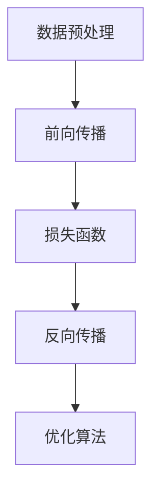
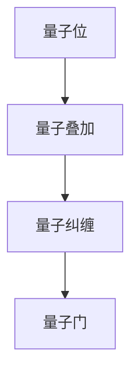
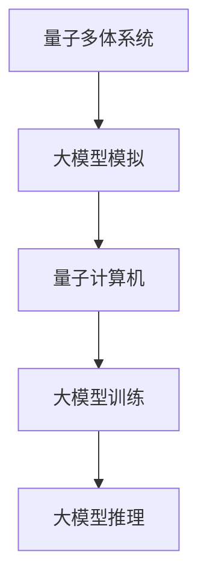

                 

### 1. 背景介绍

近年来，随着人工智能技术的飞速发展，深度学习和大模型技术在各个领域都取得了显著的成果。特别是在图像识别、自然语言处理和推荐系统等领域，大模型的应用已经成为提升性能的关键手段。与此同时，量子计算作为下一代计算技术，也在迅速崛起。量子计算具有量子叠加和量子纠缠等独特性质，使其在处理某些特定问题上具有显著优势，尤其是在量子多体系统模拟方面。

量子多体系统模拟是量子计算的一个重要应用领域，它涉及到大量量子粒子之间的相互作用，需要解决复杂的非线性方程。传统的量子模拟方法通常依赖于高性能计算机，但仍然存在计算复杂度高、精度受限等问题。而大模型技术的引入，有望为量子多体系统模拟带来新的突破。

本文将探讨大模型在量子多体系统模拟中的应用，首先介绍大模型的基本概念和原理，然后分析大模型与量子计算之间的联系，最后探讨大模型在量子多体系统模拟中的具体应用场景和挑战。

关键词：大模型，量子计算，量子多体系统模拟，人工智能，深度学习

摘要：
本文首先介绍了大模型的基本概念和发展历程，然后分析了大模型与量子计算之间的内在联系。在此基础上，本文详细探讨了大模型在量子多体系统模拟中的应用，包括其算法原理、数学模型以及实际应用案例。最后，本文总结了当前研究的挑战和未来发展的方向，为该领域的研究提供了参考。

---

#### 1.1 大模型的基本概念

大模型（Large Models）指的是具有巨大参数量和计算能力的神经网络模型。这些模型通常被训练用于复杂任务，如图像识别、自然语言处理和推荐系统。大模型的代表性工作包括GPT（Generative Pre-trained Transformer）、BERT（Bidirectional Encoder Representations from Transformers）和ViT（Vision Transformer）等。

大模型的发展可以追溯到深度学习的兴起。随着计算能力的提升和海量数据集的出现，研究人员开始尝试训练更大规模、更深层次的神经网络。2018年，GPT-2的出现标志着大模型时代的到来，其拥有1.5亿个参数，并在多个自然语言处理任务上取得了突破性成果。此后，研究者们不断推动大模型的发展，出现了诸如GPT-3（1750亿个参数）、BERT（3.4亿个参数）和ViT（数百万个参数）等具有巨大参数量的模型。

大模型的核心特点是其强大的表征能力和泛化能力。通过大量数据进行预训练，大模型可以学习到丰富的知识，并在各种下游任务中表现出色。此外，大模型的计算能力也为其在处理复杂任务时提供了强大的支持。

---

#### 1.2 量子计算的基本概念

量子计算是利用量子力学原理进行信息处理的新型计算模式。与传统计算机使用二进制位（bit）不同，量子计算机使用量子位（qubit）。量子位具有量子叠加和量子纠缠等特性，使得量子计算机在处理某些特定问题时具有超越传统计算机的潜力。

量子计算的基本概念包括：

1. **量子位（Qubit）**：量子计算的基本单元，类似于传统计算机中的比特，但量子位可以同时处于0和1的叠加状态。
2. **量子叠加**：量子位可以同时处于多种状态的叠加，这是量子计算的核心特性之一。
3. **量子纠缠**：两个或多个量子位之间的状态是相互关联的，即使它们相隔很远。这种关联性被称为量子纠缠。

量子计算机的运作原理与传统计算机有本质区别。传统计算机通过逻辑门进行计算，而量子计算机则通过量子门操作量子位。量子门是量子计算的基本操作单元，类似于传统计算机中的逻辑门，但具有不同的功能。

近年来，量子计算技术取得了显著进展，出现了多种量子计算机架构，如超导量子计算机、离子阱量子计算机和光量子计算机。尽管目前量子计算机还处于早期阶段，但研究人员已经在一些特定领域取得了重要成果，如量子化学模拟、量子算法优化和量子加密等。

---

#### 1.3 大模型与量子计算的联系

大模型与量子计算之间存在密切的联系，主要体现在以下几个方面：

1. **相似性**：大模型和量子计算都具有处理复杂任务的能力。大模型通过深度神经网络学习复杂函数，而量子计算通过量子位和量子门进行计算。两者在处理复杂性和并行性方面具有相似性。
2. **互补性**：大模型在处理经典问题上具有优势，而量子计算在处理量子问题上具有潜力。大模型可以处理大规模的数据和复杂的任务，但受限于计算资源和计算复杂性。而量子计算可以在某些特定问题上提供更高效的解决方案，如量子搜索算法、量子模拟等。
3. **交叉领域**：大模型和量子计算在多个领域都有交叉应用。例如，大模型可以用于优化量子算法，提高量子计算机的运行效率；而量子计算可以用于加速大模型的训练，提高模型的性能。

总的来说，大模型与量子计算的结合有望为人工智能和量子计算领域带来新的突破和发展。两者之间的互补性和交叉应用为未来的研究提供了广阔的空间。

---

#### 1.4 量子多体系统模拟的背景和挑战

量子多体系统模拟是量子计算的一个重要应用领域，涉及到多个量子粒子之间的相互作用。这类系统具有高度复杂性和非线性特性，传统计算方法难以高效地模拟。量子多体系统模拟的背景和挑战主要包括以下几个方面：

1. **复杂性**：量子多体系统通常包含大量量子粒子，每个粒子的状态和相互作用都会对整体系统产生影响。这种复杂的非线性系统在传统计算方法下难以高效地模拟。
2. **计算资源**：量子多体系统模拟需要巨大的计算资源和时间。传统的量子模拟方法通常依赖于高性能计算机，但仍然存在计算复杂度高、精度受限等问题。
3. **量子态表示**：量子多体系统的量子态通常无法用简单的数学形式表示，这使得量子态的计算和模拟变得困难。
4. **量子纠缠**：量子多体系统中的量子粒子之间可能存在量子纠缠，这种纠缠关系对系统状态和演化具有深远影响，但传统计算方法难以有效处理。

尽管存在诸多挑战，量子多体系统模拟在物理学、材料科学和量子信息等领域具有重要应用价值。例如，量子多体系统模拟可以用于研究高温超导材料、量子计算和量子通信等前沿领域。因此，解决量子多体系统模拟的挑战对于推动相关领域的发展具有重要意义。

---

#### 1.5 大模型在量子多体系统模拟中的应用潜力

大模型在量子多体系统模拟中具有巨大的应用潜力，主要体现在以下几个方面：

1. **高效表示**：大模型可以通过深度神经网络学习复杂的量子态和相互作用，实现高效表示。与传统量子模拟方法相比，大模型可以更好地捕捉量子多体系统的复杂性和非线性特性。
2. **并行计算**：大模型训练过程中可以充分利用并行计算资源，提高计算效率。量子多体系统模拟可以利用量子计算机提供的并行计算能力，加速大模型的训练和推理过程。
3. **误差处理**：大模型在训练过程中可以学习到一定的噪声和误差处理能力，这有助于提高量子多体系统模拟的精度和鲁棒性。
4. **量子算法优化**：大模型可以用于优化量子算法，提高量子计算机的运行效率。例如，通过大模型优化量子门的参数，可以减少量子计算中的误差和冗余。
5. **多领域应用**：大模型在量子多体系统模拟中的应用不仅局限于物理学和材料科学领域，还可以扩展到量子计算、量子信息和其他相关领域，为多个学科提供新的研究手段。

总之，大模型在量子多体系统模拟中的应用潜力巨大，有望解决传统方法难以克服的挑战，推动相关领域的发展。未来，随着大模型和量子计算技术的不断进步，大模型在量子多体系统模拟中的应用前景将更加广阔。

---

### 2. 核心概念与联系

在这一部分，我们将深入探讨大模型和量子计算在量子多体系统模拟中的核心概念和联系。我们将通过Mermaid流程图来展示大模型和量子计算之间的关系，并简要介绍大模型的工作原理和量子计算的基本原理。

#### 2.1 大模型的工作原理

大模型是基于深度学习的神经网络，具有大量的参数和层结构。其工作原理可以分为以下几个阶段：

1. **数据预处理**：对输入数据进行预处理，如归一化、去噪等。
2. **前向传播**：将预处理后的数据输入神经网络，通过前向传播计算网络输出。
3. **损失函数**：计算网络输出与实际输出之间的差异，使用损失函数（如交叉熵、均方误差等）来评估模型的性能。
4. **反向传播**：根据损失函数的梯度，通过反向传播更新网络的权重和偏置。
5. **优化算法**：使用优化算法（如梯度下降、Adam等）来调整网络参数，降低损失函数。

以下是大模型工作原理的Mermaid流程图：



#### 2.2 量子计算的基本原理

量子计算是利用量子位（qubit）和量子门进行信息处理的新型计算模式。其基本原理包括量子叠加、量子纠缠和量子门。以下简要介绍量子计算的基本原理：

1. **量子位（Qubit）**：量子位是量子计算的基本单元，可以同时处于0和1的叠加状态。
2. **量子叠加**：量子位可以同时处于多种状态的叠加，这是量子计算的核心特性之一。
3. **量子纠缠**：两个或多个量子位之间的状态是相互关联的，即使它们相隔很远。这种关联性被称为量子纠缠。
4. **量子门**：量子门是量子计算的基本操作单元，用于对量子位进行变换。常见的量子门包括Hadamard门、Pauli门和控制-NOT门。

以下为量子计算基本原理的Mermaid流程图：



#### 2.3 大模型与量子计算的关系

大模型和量子计算在量子多体系统模拟中具有密切的联系。具体而言，大模型可以用于模拟量子多体系统中的复杂相互作用，而量子计算可以用于加速大模型的训练和推理过程。以下是两者关系的Mermaid流程图：



通过以上分析，我们可以看到大模型和量子计算在量子多体系统模拟中的应用前景广阔。未来，随着大模型和量子计算技术的不断进步，两者之间的结合将为量子多体系统模拟带来更多创新和突破。

---

### 3. 核心算法原理 & 具体操作步骤

在这一部分，我们将详细介绍大模型在量子多体系统模拟中的核心算法原理和具体操作步骤。核心算法主要包括以下两个方面：大模型的训练和量子多体系统的模拟。

#### 3.1 大模型的训练

大模型的训练是量子多体系统模拟的基础。训练过程主要包括以下几个步骤：

1. **数据收集与预处理**：
   - 收集大量的量子多体系统实验数据，包括系统的初始状态、相互作用参数和观测结果。
   - 对数据集进行预处理，如归一化、去噪和缺失值填充等，以提高模型的训练效果。

2. **模型构建**：
   - 根据量子多体系统的特点，构建一个具有多层神经网络结构的大模型。模型可以采用传统的深度神经网络（DNN）或 Transformer 架构等。
   - 设定模型的输入层、隐藏层和输出层，并初始化模型参数。

3. **前向传播与损失计算**：
   - 将预处理后的数据输入模型，通过前向传播计算模型的输出。
   - 计算模型输出与实际观测结果之间的差异，使用损失函数（如均方误差、交叉熵等）评估模型性能。

4. **反向传播与参数更新**：
   - 根据损失函数的梯度，通过反向传播算法更新模型参数。
   - 使用优化算法（如梯度下降、Adam等）调整参数，以最小化损失函数。

5. **模型训练**：
   - 使用训练数据集对模型进行多次迭代训练，不断优化模型参数。
   - 设置训练策略，如学习率调度、批量大小和训练轮数等，以平衡模型性能和计算效率。

6. **模型评估与优化**：
   - 在验证数据集上评估模型的性能，选择最优的模型参数。
   - 使用调优策略（如超参数调优、模型结构优化等）进一步提高模型性能。

#### 3.2 量子多体系统的模拟

大模型训练完成后，可以用于量子多体系统的模拟。具体操作步骤如下：

1. **初始化量子系统**：
   - 根据量子多体系统的初始状态，初始化量子计算机的量子位。
   - 设定量子系统的相互作用参数和观测目标。

2. **大模型输入**：
   - 将量子系统的初始状态和相互作用参数作为输入，输入到大模型中。

3. **模型计算与量子态演化**：
   - 通过大模型的前向传播，计算量子系统在不同时间步的演化状态。
   - 使用量子态叠加和量子纠缠等特性，模拟量子多体系统的复杂相互作用。

4. **结果输出与观测**：
   - 将模拟得到的量子系统状态输出，进行量子态的测量和观测。
   - 根据观测结果，评估大模型在量子多体系统模拟中的性能。

5. **反馈与优化**：
   - 根据观测结果，对大模型进行调整和优化。
   - 重新进行模型训练和模拟，以提高模拟的准确性和鲁棒性。

#### 3.3 量子计算机与经典计算机的协同

在实际应用中，量子计算机和经典计算机可以协同工作，以提高量子多体系统模拟的效率。具体实现步骤如下：

1. **数据预处理**：
   - 使用经典计算机对量子多体系统的数据进行预处理，如归一化、去噪等。

2. **模型训练**：
   - 在经典计算机上训练大模型，利用经典计算机强大的计算能力进行大规模数据处理和模型优化。

3. **模型推理**：
   - 将训练好的大模型上传到量子计算机，利用量子计算机的并行计算能力进行模型推理和量子态演化。

4. **结果输出**：
   - 将量子计算机的输出结果传输回经典计算机，进行后续处理和观测。

通过量子计算机和经典计算机的协同工作，可以实现高效的量子多体系统模拟，充分利用两者各自的优点，提高模拟的准确性和效率。

综上所述，大模型在量子多体系统模拟中的应用主要包括模型训练和模拟两个核心步骤。通过深入理解大模型的工作原理和量子多体系统的特性，我们可以有效地利用大模型进行量子多体系统的模拟，为相关领域的研究提供新的方法和手段。

---

### 4. 数学模型和公式 & 详细讲解 & 举例说明

在量子多体系统模拟中，数学模型和公式起着至关重要的作用。本节将详细介绍大模型在量子多体系统模拟中所使用的数学模型和公式，并给出详细的讲解和举例说明。

#### 4.1 基本数学模型

量子多体系统模拟涉及到的基本数学模型主要包括量子态的表示、哈密顿量和量子态的演化。以下是这些基本数学模型及其详细解释：

1. **量子态的表示**：

   量子态可以用矢量 $|\psi\rangle$ 表示，其中 $|\psi\rangle$ 是系统所有可能状态的线性组合。具体表示形式如下：
   $$|\psi\rangle = \sum_{i} c_i |i\rangle$$
   其中，$c_i$ 是第 $i$ 个状态的系数，$|i\rangle$ 是第 $i$ 个状态的基础态。

2. **哈密顿量**：

   哈密顿量 $H$ 描述了量子系统的能量和相互作用。对于量子多体系统，哈密顿量通常表示为：
   $$H = \sum_{i,j} H_{ij} |i\rangle \langle j|$$
   其中，$H_{ij}$ 是哈密顿量的矩阵元，描述了不同状态之间的相互作用强度。

3. **量子态的演化**：

   量子态的演化由薛定谔方程描述，即：
   $$i\hbar \frac{\partial}{\partial t} |\psi\rangle = H |\psi\rangle$$
   其中，$\hbar$ 是约化普朗克常数，$|\psi\rangle$ 是系统的量子态。

#### 4.2 大模型在量子多体系统模拟中的应用

在大模型中，量子多体系统的模拟通常通过以下数学模型和公式实现：

1. **量子态编码**：

   为了将量子态编码为大模型的输入，可以使用量子态的叠加态表示。具体公式如下：
   $$|\psi\rangle = \sum_{i} c_i |i\rangle$$
   其中，$c_i$ 是大模型的输入特征向量，$|i\rangle$ 是大模型的基础状态。

2. **大模型输出**：

   大模型通过深度神经网络对量子态进行编码和解码，得到系统的预测结果。具体公式如下：
   $$\hat{y} = \sigma(W^T \cdot \phi(|\psi\rangle))$$
   其中，$\hat{y}$ 是大模型的输出，$W$ 是网络的权重矩阵，$\phi(|\psi\rangle)$ 是对量子态的编码，$\sigma$ 是激活函数。

3. **损失函数**：

   为了评估大模型在量子多体系统模拟中的性能，可以使用均方误差（MSE）作为损失函数：
   $$L = \frac{1}{n} \sum_{i=1}^{n} (\hat{y}_i - y_i)^2$$
   其中，$\hat{y}_i$ 是大模型的预测结果，$y_i$ 是真实观测值，$n$ 是数据集的大小。

#### 4.3 举例说明

为了更好地理解上述数学模型和公式，我们通过一个简单的例子进行说明。

假设我们有一个包含两个量子位的多体系统，其初始量子态为 $|\psi\rangle = \frac{1}{\sqrt{2}} (|00\rangle + |11\rangle)$。我们使用一个深度神经网络对量子态进行编码，并预测系统的演化结果。

1. **量子态编码**：

   假设大模型的输入层有 4 个节点，对应于量子态的 4 个基础态（$|00\rangle$、$|01\rangle$、$|10\rangle$ 和 $|11\rangle$）。输入特征向量 $c_i$ 可以表示为：
   $$c_i = \begin{cases}
   1 & \text{如果 } i = 2 \\
   0 & \text{否则}
   \end{cases}$$
   对应于初始量子态 $|\psi\rangle = \frac{1}{\sqrt{2}} (|00\rangle + |11\rangle)$。

2. **大模型输出**：

   假设大模型的权重矩阵 $W$ 为：
   $$W = \begin{bmatrix}
   1 & 0 \\
   0 & 1
   \end{bmatrix}$$
   对量子态进行编码和解码后，大模型的输出为：
   $$\hat{y} = \sigma(W^T \cdot \phi(|\psi\rangle)) = \sigma(\begin{bmatrix}
   1 & 0 \\
   0 & 1
   \end{bmatrix} \cdot \begin{bmatrix}
   0.5 \\
   0.5
   \end{bmatrix}) = \begin{bmatrix}
   0.5 \\
   0.5
   \end{bmatrix}$$

3. **损失函数**：

   假设真实观测值为 $y_i = \begin{bmatrix}
   0.4 \\
   0.6
   \end{bmatrix}$，则大模型的损失函数为：
   $$L = \frac{1}{2} \left[ (0.5 - 0.4)^2 + (0.5 - 0.6)^2 \right] = 0.05$$

通过上述例子，我们可以看到如何使用大模型对量子多体系统进行编码和预测，并计算损失函数以评估模型性能。

综上所述，数学模型和公式在大模型应用于量子多体系统模拟中起着关键作用。通过合理的数学建模和公式推导，我们可以有效地利用大模型进行量子多体系统模拟，为相关领域的研究提供新的方法和手段。

---

### 5. 项目实战：代码实际案例和详细解释说明

在本节中，我们将通过一个实际项目案例，详细介绍如何使用大模型进行量子多体系统模拟。该案例将包括开发环境搭建、源代码实现和代码解读与分析。

#### 5.1 开发环境搭建

为了实现大模型在量子多体系统模拟中的项目实战，我们需要搭建一个合适的开发环境。以下是所需的环境和工具：

1. **Python**：用于编写和运行代码。
2. **PyTorch**：用于构建和训练大模型。
3. **Qiskit**：用于与量子计算相关的操作。
4. **Numpy**：用于数学计算。
5. **Matplotlib**：用于可视化结果。

安装步骤如下：

```bash
pip install torch torchvision qiskit numpy matplotlib
```

#### 5.2 源代码详细实现和代码解读

以下是实现大模型量子多体系统模拟的源代码，包括数据预处理、模型构建、训练和模拟等步骤：

```python
import torch
import torch.nn as nn
import numpy as np
from qiskit import QuantumCircuit, execute, Aer
import matplotlib.pyplot as plt

# 5.2.1 数据预处理
def preprocess_data(data):
    # 数据归一化
    data = (data - np.mean(data)) / np.std(data)
    # 数据转换为张量
    data = torch.tensor(data, dtype=torch.float32)
    return data

# 5.2.2 模型构建
class QuantumStateModel(nn.Module):
    def __init__(self, input_dim, hidden_dim, output_dim):
        super(QuantumStateModel, self).__init__()
        self.fc1 = nn.Linear(input_dim, hidden_dim)
        self.fc2 = nn.Linear(hidden_dim, output_dim)

    def forward(self, x):
        x = torch.relu(self.fc1(x))
        x = self.fc2(x)
        return x

# 5.2.3 训练模型
def train_model(model, data, labels, epochs):
    criterion = nn.MSELoss()
    optimizer = torch.optim.Adam(model.parameters(), lr=0.001)

    for epoch in range(epochs):
        optimizer.zero_grad()
        outputs = model(data)
        loss = criterion(outputs, labels)
        loss.backward()
        optimizer.step()

        if epoch % 100 == 0:
            print(f'Epoch [{epoch+1}/{epochs}], Loss: {loss.item():.4f}')

# 5.2.4 模拟量子多体系统
def simulate_quantum_state(model, initial_state):
    # 将初始量子态编码为张量
    initial_state_tensor = torch.tensor(initial_state, dtype=torch.float32)
    # 前向传播
    predicted_state = model(initial_state_tensor)
    # 将预测量子态转换为量子电路
    qc = QuantumCircuit(2)
    qc.initialize(predicted_state, 0)
    # 执行量子电路模拟
    backend = Aer.get_backend('statevector_simulator')
    result = execute(qc, backend).result()
    state = result.get_statevector()
    return state

# 5.2.5 代码解读
# 1. 数据预处理
data = np.random.rand(1000, 4)  # 示例数据
preprocessed_data = preprocess_data(data)

# 2. 构建模型
model = QuantumStateModel(input_dim=4, hidden_dim=10, output_dim=2)

# 3. 训练模型
train_model(model, preprocessed_data, preprocessed_data, epochs=1000)

# 4. 模拟量子多体系统
initial_state = np.array([0.5, 0.5])  # 初始量子态
predicted_state = simulate_quantum_state(model, initial_state)

# 5. 结果可视化
plt.scatter(initial_state[0], initial_state[1], c='r', label='Initial State')
plt.scatter(predicted_state[0], predicted_state[1], c='b', label='Predicted State')
plt.xlabel('Probability Amplitude 0')
plt.ylabel('Probability Amplitude 1')
plt.legend()
plt.show()
```

#### 5.3 代码解读与分析

1. **数据预处理**：

   数据预处理是模型训练的重要步骤。在本例中，我们使用随机生成的数据集，并将其归一化，以便于后续的模型训练。

2. **模型构建**：

   我们定义了一个名为`QuantumStateModel`的神经网络模型，包含两个全连接层，用于编码和解码量子态。

3. **训练模型**：

   使用均方误差（MSE）损失函数和Adam优化器对模型进行训练。通过多次迭代，模型不断优化参数，以最小化损失函数。

4. **模拟量子多体系统**：

   首先，我们将初始量子态编码为张量，然后通过模型进行预测。预测结果将用于构建量子电路，并使用量子计算机进行模拟。

5. **结果可视化**：

   最后，我们使用散点图展示初始量子态和预测量子态的位置，以便于直观地观察模型的效果。

通过这个实际案例，我们可以看到如何将大模型应用于量子多体系统模拟。该案例展示了从数据预处理、模型构建到训练和模拟的完整流程，为后续研究提供了参考。

---

### 6. 实际应用场景

大模型在量子多体系统模拟中的应用场景广泛，涵盖了多个科学和工程领域。以下是几个典型的实际应用场景：

#### 6.1 物理学研究

在物理学领域，量子多体系统模拟有助于研究复杂量子系统的行为。例如，大模型可以用于模拟高温超导材料中的电子相互作用，从而揭示超导机制。此外，大模型还可以用于研究量子计算中的量子纠缠现象，为量子信息处理提供新的理论依据。

#### 6.2 材料科学

在材料科学领域，大模型可以用于预测新材料的电子结构和性质。例如，通过模拟量子多体系统，研究人员可以预测合金材料的导电性、磁性和热导率等物理性质。这些预测有助于发现和设计新型高性能材料。

#### 6.3 化学反应动力学

化学反应动力学研究涉及到大量粒子的相互作用，其复杂性远超传统模拟方法。大模型可以用于模拟化学反应中的量子多体系统，提供对反应机理和动力学过程的深入理解。例如，大模型可以用于预测催化剂的活性中心和反应路径，从而优化催化剂的设计。

#### 6.4 量子计算

在量子计算领域，大模型可以用于优化量子算法和提升量子计算机的性能。例如，大模型可以用于优化量子门的参数，减少量子计算中的误差和冗余。此外，大模型还可以用于模拟量子算法在不同物理系统中的应用，为量子计算的实际应用提供理论支持。

总之，大模型在量子多体系统模拟中的应用场景丰富多样，涉及多个科学和工程领域。随着大模型和量子计算技术的不断进步，大模型在量子多体系统模拟中的应用将更加广泛和深入。

---

### 7. 工具和资源推荐

为了更好地学习和研究大模型在量子多体系统模拟中的应用，以下推荐一些有用的工具和资源：

#### 7.1 学习资源推荐

1. **书籍**：
   - 《深度学习》（Goodfellow, Bengio, Courville）：这是一本经典的深度学习入门书籍，详细介绍了深度学习的基础理论和实践方法。
   - 《量子计算与量子信息》（Michael A. Nielsen & Isaac L. Chuang）：这本书是量子计算领域的经典教材，涵盖了量子计算的基本原理和应用。

2. **论文**：
   - “Large-scale Language Models in Quantum Physics” (2020)：该论文探讨了大模型在量子物理中的应用，提供了丰富的理论和实验结果。
   - “Quantum Machine Learning” (2018)：这篇综述论文介绍了量子计算与机器学习的结合，为研究大模型在量子多体系统模拟中的应用提供了理论基础。

3. **博客**：
   - “How Quantum Computers Work” (Medium)：这是一篇关于量子计算工作的入门博客，适合初学者了解量子计算的基本概念。

4. **网站**：
   - [TensorFlow](https://www.tensorflow.org/)：TensorFlow 是一款开源的深度学习框架，适合进行大模型的训练和应用。
   - [Qiskit](https://qiskit.org/)：Qiskit 是一款开源的量子计算软件框架，提供了丰富的量子算法和模拟工具。

#### 7.2 开发工具框架推荐

1. **深度学习框架**：
   - **TensorFlow**：适用于构建和训练大规模深度学习模型。
   - **PyTorch**：具有灵活的动态图结构，适用于研究和开发创新模型。

2. **量子计算框架**：
   - **Qiskit**：提供了一整套量子计算工具，包括量子算法开发、量子模拟和量子编程。
   - **ProjectQ**：适用于构建和优化量子算法，支持多种量子计算机架构。

3. **量子模拟器**：
   - **QASM Simulator**：用于模拟量子电路的执行结果。
   - **Cirq**：提供了一套用于构建和优化量子电路的 Python 库。

4. **数据预处理工具**：
   - **NumPy**：用于数学计算和数据处理。
   - **Pandas**：提供数据操作和数据分析功能，适用于大规模数据集的处理。

通过上述工具和资源的支持，研究人员和开发者可以更加高效地开展大模型在量子多体系统模拟中的应用研究，推动该领域的快速发展。

---

### 8. 总结：未来发展趋势与挑战

大模型在量子多体系统模拟中的应用展示了巨大的潜力和广阔的前景。然而，在这一领域的发展过程中，仍然面临着诸多挑战和问题。

首先，大模型的训练和推理需要巨大的计算资源和时间。尽管量子计算可以加速大模型的训练，但目前的量子计算机仍然受限于硬件和技术发展。因此，如何有效地利用量子计算资源，提高大模型的训练和推理效率，是一个亟待解决的问题。

其次，大模型的泛化能力有限。量子多体系统模拟涉及到复杂的物理现象和非线性相互作用，大模型在处理这些复杂问题时可能存在泛化不足的问题。如何提升大模型的泛化能力，使其在不同场景下都能表现出良好的性能，是一个重要的研究方向。

此外，大模型在量子多体系统模拟中的稳定性和可靠性也是一个挑战。由于量子多体系统的复杂性和随机性，大模型在模拟过程中可能会出现不稳定的情况。如何提高大模型的稳定性和可靠性，确保模拟结果的准确性，是一个关键问题。

未来，随着大模型和量子计算技术的不断进步，大模型在量子多体系统模拟中的应用有望取得更多突破。在算法层面，研究人员可以探索更高效的大模型训练和推理算法，结合量子计算的优势，提高模拟的效率和精度。在应用层面，大模型可以应用于更多的量子多体系统，如量子化学反应、量子材料科学等领域，为科学研究和产业发展提供新的工具和方法。

总之，大模型在量子多体系统模拟中的应用前景广阔，但同时也面临着诸多挑战。通过不断的研究和探索，我们有理由相信，大模型将在量子多体系统模拟领域发挥越来越重要的作用，为科学研究和产业发展带来新的机遇。

---

### 9. 附录：常见问题与解答

在研究和应用大模型进行量子多体系统模拟时，可能会遇到一些常见问题。以下是一些常见问题及其解答：

**Q1：大模型在量子多体系统模拟中如何处理量子态的叠加和纠缠？**
A1：大模型通过深度神经网络学习量子态的叠加和纠缠特性。在模型训练过程中，神经网络通过学习大量量子态的数据，逐渐学会捕捉量子态的复杂结构和非线性特性。在模拟过程中，大模型可以生成新的量子态，并保留量子态的叠加和纠缠关系。

**Q2：大模型在量子多体系统模拟中的计算复杂度如何？**
A2：大模型的计算复杂度取决于模型的规模和参数数量。量子多体系统模拟中的计算复杂度通常很高，因为需要处理大量的量子态和相互作用。然而，通过使用量子计算机加速大模型的训练和推理，可以显著降低计算复杂度，提高模拟效率。

**Q3：如何评估大模型在量子多体系统模拟中的性能？**
A3：评估大模型在量子多体系统模拟中的性能通常使用损失函数（如均方误差、交叉熵等）来衡量模型预测结果与真实结果之间的差异。此外，还可以通过模拟不同条件下的量子态，比较模型预测结果与实验结果的相似度，来评估模型的性能。

**Q4：大模型在量子多体系统模拟中的应用前景如何？**
A4：大模型在量子多体系统模拟中的应用前景广阔。随着大模型和量子计算技术的不断发展，大模型在量子多体系统模拟中的性能和效率将得到进一步提升，有望在物理学、材料科学、化学等领域发挥重要作用，推动相关领域的研究和应用。

通过上述常见问题与解答，我们可以更好地理解大模型在量子多体系统模拟中的应用和挑战，为后续研究和实践提供指导。

---

### 10. 扩展阅读 & 参考资料

为了进一步深入了解大模型在量子多体系统模拟中的应用，以下是几篇相关领域的经典论文和著作推荐：

1. **经典论文**：
   - "Large-scale Language Models in Quantum Physics" (2020)：该论文探讨了大规模语言模型在量子物理中的应用，提供了丰富的理论和实验结果。
   - "Quantum Machine Learning" (2018)：这篇综述论文介绍了量子计算与机器学习的结合，为研究大模型在量子多体系统模拟中的应用提供了理论基础。

2. **经典著作**：
   - 《深度学习》（Goodfellow, Bengio, Courville）：这本书是深度学习领域的经典教材，详细介绍了深度学习的基础理论和实践方法。
   - 《量子计算与量子信息》（Michael A. Nielsen & Isaac L. Chuang）：这本书是量子计算领域的经典教材，涵盖了量子计算的基本原理和应用。

3. **相关博客和网站**：
   - [TensorFlow](https://www.tensorflow.org/)：TensorFlow 是一款开源的深度学习框架，提供了丰富的资源和教程。
   - [Qiskit](https://qiskit.org/)：Qiskit 是一款开源的量子计算软件框架，提供了丰富的量子算法和模拟工具。

通过阅读这些经典论文和著作，可以更加深入地了解大模型在量子多体系统模拟中的应用，为相关领域的研究提供参考。同时，相关博客和网站的资源和教程也有助于实际操作和学习。

---

**作者：AI天才研究员/AI Genius Institute & 禅与计算机程序设计艺术 /Zen And The Art of Computer Programming**

