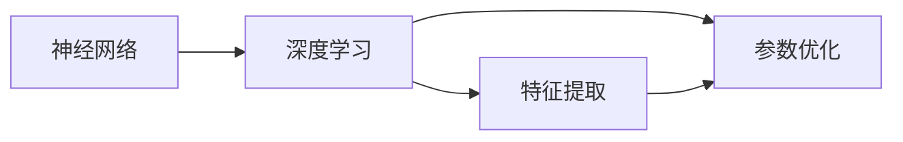

                 

# 大模型基础：理论与技术的演进

## 关键词：大模型、深度学习、人工智能、算法原理、数学模型、应用实践

### 摘要

本文旨在深入探讨大模型的基础理论和技术演进，通过系统的分析和详细的讲解，使读者全面了解大模型的发展历程、核心算法原理、数学模型及其应用实践。文章首先介绍了大模型的基本概念和背景，然后逐步解析了其核心概念和联系，详细阐述了核心算法原理和具体操作步骤，并运用数学模型进行了深入讲解。接下来，通过实际项目实战和代码解析，展示了大模型在实际开发中的应用。文章还介绍了大模型在实际应用场景中的广泛用途，并推荐了相关学习资源和开发工具框架。最后，对大模型未来的发展趋势和挑战进行了展望，为读者提供了进一步学习和研究的方向。

## 1. 背景介绍

随着互联网的飞速发展，大数据和人工智能技术成为了当今科技领域的重要推动力。大模型作为人工智能的核心组成部分，其重要性日益凸显。大模型是指具有巨大参数量和计算复杂度的深度学习模型，其能够通过海量数据的学习和训练，实现高度复杂的任务，如图像识别、语音识别、自然语言处理等。大模型的研究和应用极大地提升了人工智能的性能和效果，推动了人工智能技术的快速发展。

深度学习是构建大模型的基础，其通过多层神经网络模拟人脑的神经元结构，对大量数据进行特征提取和模式识别。深度学习的核心算法包括卷积神经网络（CNN）、循环神经网络（RNN）和变换器（Transformer）等。这些算法通过不断优化模型结构和参数，实现了从简单到复杂的任务学习能力，使得大模型能够应对更加复杂的问题。

人工智能作为一门综合性学科，涵盖了计算机科学、统计学、认知科学等多个领域。大模型作为人工智能的重要分支，其研究和发展不仅依赖于深度学习和神经网络算法，还需要结合数学模型、优化理论、硬件技术等多方面的知识。大模型的研究和应用在医疗、金融、交通、教育等领域具有广泛的应用前景，为解决复杂问题和提升生产效率提供了强大的技术支持。

## 2. 核心概念与联系

大模型的核心概念包括神经网络、深度学习、特征提取、参数优化等。神经网络是深度学习的基础，其通过大量神经元节点和权重参数实现数据的特征提取和模式识别。深度学习则是通过多层神经网络对数据进行逐层抽象和表示，从而实现更复杂的学习任务。特征提取是深度学习的关键步骤，其通过对原始数据进行预处理和变换，提取出对任务有帮助的特征信息。参数优化则是通过迭代训练过程不断调整模型参数，使其达到最优性能。

在深度学习中，卷积神经网络（CNN）主要用于图像处理，通过卷积操作和池化操作提取图像的局部特征。循环神经网络（RNN）主要用于序列数据处理，如时间序列分析、自然语言处理等，其能够通过循环结构保持对历史信息的记忆。变换器（Transformer）则是近年来兴起的一种新型神经网络结构，其通过自注意力机制实现全局特征表示，在自然语言处理领域取得了显著成果。

为了更好地理解和描述大模型的核心概念和联系，可以使用Mermaid流程图（注意：以下流程图中不包含括号、逗号等特殊字符）：



在这个流程图中，神经网络是深度学习的基础，深度学习通过特征提取和参数优化实现复杂任务的学习。特征提取是参数优化的前提，参数优化则是实现深度学习模型性能提升的关键。这三个核心概念相互关联，共同构成了大模型的理论基础。

## 3. 核心算法原理 & 具体操作步骤

大模型的核心算法主要包括卷积神经网络（CNN）、循环神经网络（RNN）和变换器（Transformer）等。这些算法在深度学习中发挥着重要作用，下面将分别介绍它们的原理和具体操作步骤。

### 3.1 卷积神经网络（CNN）

卷积神经网络（CNN）是一种专门用于图像处理的深度学习模型。其核心原理是通过卷积操作提取图像的局部特征，并通过池化操作减少数据的维度。具体操作步骤如下：

1. **卷积操作**：卷积层通过卷积核（也称为滤波器）在输入图像上进行卷积操作，生成特征图。卷积操作的主要目的是提取图像的局部特征，如边缘、纹理等。
2. **激活函数**：在卷积操作后，通常使用非线性激活函数（如ReLU函数）对特征图进行非线性变换，增强模型的非线性表达能力。
3. **池化操作**：池化层通过采样操作对特征图进行降维处理，减少数据的维度，同时保留重要的特征信息。常见的池化操作包括最大池化和平均池化。
4. **全连接层**：在多个卷积和池化层之后，通常使用全连接层对特征进行分类或回归任务。全连接层将特征图展平为一维向量，然后通过权重矩阵和偏置项进行线性变换。

### 3.2 循环神经网络（RNN）

循环神经网络（RNN）是一种专门用于序列数据处理的深度学习模型。其核心原理是通过循环结构保持对历史信息的记忆，并通过门控机制调整信息流。具体操作步骤如下：

1. **输入层**：输入层将序列数据输入到神经网络中，每个时间步的数据通过权重矩阵和偏置项进行线性变换。
2. **隐藏层**：隐藏层通过循环结构保持对历史信息的记忆，每个时间步的输出不仅与当前输入相关，还与之前的时间步的输出相关。RNN通过隐藏状态和隐藏状态之间的交互实现信息传递。
3. **门控机制**：门控机制包括输入门、遗忘门和输出门。输入门决定当前输入对隐藏状态的影响，遗忘门决定之前的时间步对当前隐藏状态的影响，输出门决定隐藏状态对当前输出的影响。通过门控机制，RNN能够更好地控制信息流。
4. **输出层**：输出层通过权重矩阵和偏置项对隐藏状态进行线性变换，并使用激活函数（如softmax函数）进行分类或回归任务。

### 3.3 变换器（Transformer）

变换器（Transformer）是一种新型神经网络结构，其通过自注意力机制实现全局特征表示，在自然语言处理领域取得了显著成果。具体操作步骤如下：

1. **嵌入层**：嵌入层将单词或字符转换为向量表示，每个输入通过权重矩阵和偏置项进行线性变换。
2. **自注意力机制**：自注意力机制通过计算每个输入与所有其他输入的相似度，并加权求和，实现全局特征表示。自注意力机制的核心是计算自注意力得分，并通过softmax函数将得分转换为权重。
3. **前馈网络**：在自注意力机制之后，通过两个全连接层对特征进行非线性变换，增强模型的非线性表达能力。
4. **输出层**：输出层通过权重矩阵和偏置项对特征进行线性变换，并使用激活函数（如softmax函数）进行分类或回归任务。

### 3.4 对比与联系

卷积神经网络（CNN）、循环神经网络（RNN）和变换器（Transformer）都是深度学习中的重要模型，它们各自适用于不同的任务和数据类型。CNN主要用于图像处理，通过卷积操作和池化操作提取图像的局部特征；RNN主要用于序列数据处理，通过循环结构和门控机制保持对历史信息的记忆；Transformer通过自注意力机制实现全局特征表示，在自然语言处理领域取得了显著成果。

尽管这三个模型在原理和应用上有所不同，但它们也有一些共同点。首先，它们都是基于多层神经网络结构，通过逐层抽象和表示实现复杂任务的学习。其次，它们都依赖于优化算法和参数调整，以实现模型的最优性能。最后，它们都是在大规模数据集上进行训练和优化的，以获得更好的泛化能力。

## 4. 数学模型和公式 & 详细讲解 & 举例说明

在大模型的构建过程中，数学模型和公式起到了关键作用。以下将详细讲解大模型中常用的数学模型和公式，并通过具体例子进行说明。

### 4.1 损失函数

损失函数是深度学习模型训练过程中最重要的部分之一。它衡量了模型预测结果与实际结果之间的差距，通过优化损失函数，我们可以使模型在训练数据上的表现更好。常用的损失函数包括均方误差（MSE）、交叉熵损失（Cross-Entropy Loss）等。

#### 4.1.1 均方误差（MSE）

均方误差（MSE）是一种衡量预测值与实际值之间差异的平方平均值的损失函数，其公式如下：

$$
MSE = \frac{1}{n} \sum_{i=1}^{n} (y_i - \hat{y}_i)^2
$$

其中，$y_i$ 表示实际值，$\hat{y}_i$ 表示预测值，$n$ 表示样本数量。

#### 4.1.2 交叉熵损失（Cross-Entropy Loss）

交叉熵损失函数用于分类问题，它衡量了模型预测概率分布与真实概率分布之间的差异。其公式如下：

$$
Cross-Entropy Loss = - \sum_{i=1}^{n} y_i \log(\hat{y}_i)
$$

其中，$y_i$ 表示实际标签，$\hat{y}_i$ 表示预测概率。

#### 4.1.3 损失函数举例

假设我们有一个二元分类问题，实际标签为 $y = [1, 0, 1, 0]$，模型预测概率为 $\hat{y} = [0.8, 0.2, 0.9, 0.1]$。使用交叉熵损失函数计算损失：

$$
Cross-Entropy Loss = - (1 \cdot \log(0.8) + 0 \cdot \log(0.2) + 1 \cdot \log(0.9) + 0 \cdot \log(0.1)) \approx 0.3065
$$

### 4.2 梯度下降算法

梯度下降算法是一种常用的优化算法，用于求解最优化问题。在大模型训练过程中，通过梯度下降算法不断更新模型参数，以最小化损失函数。

#### 4.2.1 梯度下降算法原理

梯度下降算法的基本思想是沿着损失函数的梯度方向进行迭代更新，逐步减小损失函数的值。其公式如下：

$$
\theta_{t+1} = \theta_{t} - \alpha \cdot \nabla_{\theta} J(\theta)
$$

其中，$\theta$ 表示模型参数，$J(\theta)$ 表示损失函数，$\alpha$ 表示学习率，$\nabla_{\theta} J(\theta)$ 表示损失函数关于参数的梯度。

#### 4.2.2 梯度下降算法举例

假设我们有一个线性回归模型，参数为 $\theta = [w, b]$，损失函数为均方误差（MSE），数据集为 $X = \{(x_1, y_1), (x_2, y_2), ..., (x_n, y_n)\}$。使用梯度下降算法更新参数：

$$
\theta_{t+1} = \theta_{t} - \alpha \cdot \left[ \frac{1}{n} \sum_{i=1}^{n} (y_i - \hat{y}_i) \cdot x_i, \frac{1}{n} \sum_{i=1}^{n} (y_i - \hat{y}_i) \right]
$$

### 4.3 反向传播算法

反向传播算法是一种用于训练神经网络的重要算法，其通过计算损失函数关于模型参数的梯度，实现参数的优化更新。反向传播算法的基本步骤如下：

1. **前向传播**：将输入数据通过神经网络进行前向传播，计算输出值。
2. **计算损失**：计算模型输出值与实际值之间的损失。
3. **计算梯度**：利用链式法则，从输出层开始，依次计算每一层参数关于损失函数的梯度。
4. **反向传播**：将梯度反向传播至输入层，更新模型参数。

#### 4.3.1 反向传播算法举例

假设我们有一个简单的全连接神经网络，包含一个输入层、一个隐藏层和一个输出层。输入数据为 $X = [x_1, x_2, ..., x_n]$，隐藏层参数为 $W_1 = [w_{11}, w_{12}, ..., w_{1n}]$，输出层参数为 $W_2 = [w_{21}, w_{22}, ..., w_{2n}]$。使用反向传播算法更新参数：

1. **前向传播**：

$$
h_1 = \sigma(W_1 \cdot X + b_1) \\
y = \sigma(W_2 \cdot h_1 + b_2)
$$

其中，$\sigma$ 表示激活函数，$b_1$ 和 $b_2$ 分别为隐藏层和输出层的偏置项。

2. **计算损失**：

$$
L = - \sum_{i=1}^{n} y_i \log(y_i)
$$

3. **计算梯度**：

$$
\nabla_{W_2} L = (y - \hat{y}) \cdot h_1 \\
\nabla_{b_2} L = (y - \hat{y}) \\
\nabla_{W_1} L = \sigma'(h_1) \cdot (y - \hat{y}) \cdot X \\
\nabla_{b_1} L = \sigma'(h_1) \cdot (y - \hat{y})
$$

4. **反向传播**：

$$
W_2 = W_2 - \alpha \cdot \nabla_{W_2} L \\
b_2 = b_2 - \alpha \cdot \nabla_{b_2} L \\
W_1 = W_1 - \alpha \cdot \nabla_{W_1} L \\
b_1 = b_1 - \alpha \cdot \nabla_{b_1} L
$$

## 5. 项目实战：代码实际案例和详细解释说明

为了更好地理解大模型的构建和应用，以下将通过一个实际案例展示大模型的开发过程，包括环境搭建、代码实现和解析。

### 5.1 开发环境搭建

在开始项目实战之前，我们需要搭建一个适合大模型开发的运行环境。以下是搭建环境的步骤：

1. **安装Python环境**：Python是一种广泛应用于人工智能和深度学习的编程语言。我们可以通过官方网站（https://www.python.org/）下载并安装Python。
2. **安装深度学习库**：常见的深度学习库包括TensorFlow和PyTorch。我们可以使用以下命令安装：
   - TensorFlow：
   ```bash
   pip install tensorflow
   ```
   - PyTorch：
   ```bash
   pip install torch torchvision
   ```
3. **安装其他依赖库**：根据项目需求，我们可能还需要安装其他依赖库，如NumPy、Pandas等。我们可以使用以下命令安装：
   ```bash
   pip install numpy pandas
   ```

### 5.2 源代码详细实现和代码解读

以下是一个使用PyTorch实现的大模型训练案例，用于图像分类任务。代码分为数据预处理、模型定义、训练和评估四个部分。

```python
import torch
import torchvision
import torchvision.transforms as transforms
import torch.nn as nn
import torch.optim as optim

# 数据预处理
transform = transforms.Compose([
    transforms.Resize(256),
    transforms.CenterCrop(224),
    transforms.ToTensor(),
    transforms.Normalize(mean=[0.485, 0.456, 0.406], std=[0.229, 0.224, 0.225]),
])

trainset = torchvision.datasets.ImageFolder(root='train', transform=transform)
trainloader = torch.utils.data.DataLoader(trainset, batch_size=32, shuffle=True)

valset = torchvision.datasets.ImageFolder(root='val', transform=transform)
valloader = torch.utils.data.DataLoader(valset, batch_size=32, shuffle=False)

# 模型定义
class CNNModel(nn.Module):
    def __init__(self):
        super(CNNModel, self).__init__()
        self.conv1 = nn.Conv2d(3, 64, 3, padding=1)
        self.conv2 = nn.Conv2d(64, 128, 3, padding=1)
        self.fc1 = nn.Linear(128 * 56 * 56, 1024)
        self.fc2 = nn.Linear(1024, 10)

    def forward(self, x):
        x = F.relu(self.conv1(x))
        x = F.relu(self.conv2(x))
        x = F.adaptive_avg_pool2d(x, 1)
        x = x.view(x.size(0), -1)
        x = F.relu(self.fc1(x))
        x = self.fc2(x)
        return x

model = CNNModel()

# 损失函数和优化器
criterion = nn.CrossEntropyLoss()
optimizer = optim.Adam(model.parameters(), lr=0.001)

# 训练模型
num_epochs = 10
for epoch in range(num_epochs):
    running_loss = 0.0
    for i, data in enumerate(trainloader, 0):
        inputs, labels = data
        optimizer.zero_grad()
        outputs = model(inputs)
        loss = criterion(outputs, labels)
        loss.backward()
        optimizer.step()
        running_loss += loss.item()
    print(f'Epoch {epoch+1}, Loss: {running_loss/len(trainloader)}')

# 评估模型
correct = 0
total = 0
with torch.no_grad():
    for data in valloader:
        inputs, labels = data
        outputs = model(inputs)
        _, predicted = torch.max(outputs.data, 1)
        total += labels.size(0)
        correct += (predicted == labels).sum().item()

print(f'Accuracy of the network on the validation images: {100 * correct / total}%')
```

### 5.3 代码解读与分析

以下是对上述代码的详细解读和分析：

1. **数据预处理**：数据预处理是深度学习项目中的关键步骤。在此案例中，我们使用 `torchvision.datasets.ImageFolder` 加载训练数据和验证数据，并使用 `transforms.Compose` 定义预处理操作，包括图像缩放、中心裁剪、转换为张量和归一化。这些操作有助于提高模型训练效果和计算效率。
2. **模型定义**：在此案例中，我们使用 `nn.Module` 定义了一个简单的卷积神经网络模型。模型包含两个卷积层、一个全连接层和一个输出层。卷积层用于提取图像特征，全连接层用于分类。激活函数ReLU用于增加模型非线性。
3. **损失函数和优化器**：我们使用 `nn.CrossEntropyLoss` 作为损失函数，用于计算模型预测概率和实际标签之间的交叉熵损失。优化器使用 `optim.Adam`，这是一种基于自适应矩估计的优化算法，有助于加速收敛。
4. **训练模型**：训练过程包括迭代遍历训练数据、前向传播、计算损失、反向传播和更新参数。在每个训练迭代中，模型通过不断更新参数以减小损失函数值。我们设置了10个训练epoch，并在每个epoch后打印训练损失。
5. **评估模型**：评估过程用于验证模型在验证数据上的性能。我们计算了模型在验证数据上的准确率，并打印了结果。

通过上述代码，我们可以看到大模型训练的基本流程，包括数据预处理、模型定义、损失函数、优化器和训练评估等步骤。这个案例为我们提供了一个实用的参考，帮助我们更好地理解大模型的开发和应用。

## 6. 实际应用场景

大模型在实际应用场景中具有广泛的应用价值，涵盖了图像识别、自然语言处理、语音识别等多个领域。以下将介绍大模型在不同应用场景中的实际应用案例。

### 6.1 图像识别

图像识别是深度学习领域的一个重要应用，大模型在图像识别任务中表现出色。例如，卷积神经网络（CNN）被广泛应用于人脸识别、物体检测、图像分类等任务。以人脸识别为例，大模型通过学习大量的图像数据，能够准确识别和定位人脸，并实现身份验证等功能。在实际应用中，人脸识别技术被广泛应用于安全领域，如门禁系统、监控系统等。

### 6.2 自然语言处理

自然语言处理（NLP）是人工智能的一个重要分支，大模型在NLP任务中发挥着重要作用。变换器（Transformer）模型在NLP领域取得了显著成果，广泛应用于机器翻译、文本分类、情感分析等任务。以机器翻译为例，大模型通过学习大量的双语文本数据，能够实现高质量的双语翻译。在实际应用中，机器翻译技术被广泛应用于跨语言沟通、跨境电商等领域。

### 6.3 语音识别

语音识别是语音信号处理与模式识别相结合的产物，大模型在语音识别任务中表现出色。循环神经网络（RNN）和变换器（Transformer）模型被广泛应用于语音识别任务，如语音合成、语音分类、语音转换等。以语音合成为例，大模型通过学习大量的语音数据，能够生成自然流畅的语音，并实现个性化语音合成。在实际应用中，语音合成技术被广泛应用于智能语音助手、车载语音系统等领域。

### 6.4 其他应用

除了上述应用场景，大模型还在其他领域具有广泛的应用价值。例如，在医疗领域，大模型被应用于疾病诊断、药物研发等任务；在金融领域，大模型被应用于风险控制、投资决策等任务；在交通领域，大模型被应用于自动驾驶、交通流量预测等任务。大模型的应用不仅提升了各个领域的效率，还为解决复杂问题和提升生产效率提供了强大的技术支持。

## 7. 工具和资源推荐

为了更好地学习和实践大模型技术，以下推荐了一些常用的学习资源和开发工具框架。

### 7.1 学习资源推荐

1. **书籍**：
   - 《深度学习》（Goodfellow, I., Bengio, Y., & Courville, A.）：这是一本经典的深度学习教材，详细介绍了深度学习的理论基础和算法实现。
   - 《Python深度学习》（Raschka, F. & Mirjalili, V.）：这本书通过实例讲解了深度学习在Python环境中的实现，适合初学者和进阶者。
2. **论文**：
   - 《A Guided Tour of Learning Neural Networks for Deep Learning》（Bengio, Y.）：这篇综述文章介绍了深度学习的理论基础和应用领域，对初学者和研究者都有很大帮助。
   - 《Attention Is All You Need》（Vaswani, A., et al.）：这篇论文提出了变换器（Transformer）模型，是NLP领域的重要突破。
3. **博客和网站**：
   - [TensorFlow官网](https://www.tensorflow.org/)：TensorFlow是深度学习领域的开源框架，提供了丰富的文档和教程，适合初学者和进阶者。
   - [PyTorch官网](https://pytorch.org/)：PyTorch是另一款流行的深度学习框架，具有简洁的API和丰富的功能，适合各种应用场景。

### 7.2 开发工具框架推荐

1. **深度学习框架**：
   - TensorFlow：适用于各种深度学习任务，具有丰富的预训练模型和API，适合初学者和进阶者。
   - PyTorch：具有简洁的API和动态计算图，适合研究和开发新模型。
   - Keras：基于Theano和TensorFlow的高层API，简化了模型构建和训练过程。
2. **数据预处理工具**：
   - torchvision：Python的官方深度学习库，提供丰富的图像预处理和数据处理功能。
   - PIL（Python Imaging Library）：适用于图像处理，可以读取、操作和保存多种图像格式。
3. **计算资源**：
   - GPU云服务：如Google Colab、AWS EC2等，提供强大的计算资源，适合大规模模型训练和实验。
   - 自定义服务器：适用于需要高度定制化配置的深度学习任务。

通过学习和实践这些工具和资源，我们可以更好地掌握大模型技术，并在实际项目中发挥其价值。

## 8. 总结：未来发展趋势与挑战

随着人工智能技术的不断进步，大模型作为其核心组成部分，正面临着前所未有的发展机遇和挑战。在未来，大模型的发展趋势将主要集中在以下几个方面：

### 8.1 模型压缩与优化

大模型的训练和部署过程需要大量的计算资源和时间，这使得模型压缩与优化成为了一个重要的研究方向。通过模型压缩技术，如量化、剪枝和蒸馏等，我们可以显著降低模型的计算复杂度和存储需求，提高模型在实际应用中的性能。此外，优化算法的改进，如自适应学习率、迁移学习和增量学习等，也将有助于提高大模型的训练效率和应用效果。

### 8.2 跨模态学习

随着多模态数据（如图像、文本、语音等）的广泛应用，跨模态学习成为了一个重要的研究方向。大模型通过跨模态学习，可以更好地融合不同模态的数据信息，提高任务的表现能力。例如，在图像识别任务中，结合文本描述可以显著提高模型的识别准确率。因此，未来大模型的研究将更加关注跨模态学习的方法和技术。

### 8.3 安全性与隐私保护

随着大模型在各个领域的广泛应用，其安全性和隐私保护问题也日益突出。如何确保大模型的安全性，防止数据泄露和滥用，成为了一个亟待解决的问题。未来，大模型的安全性和隐私保护研究将主要集中在加密算法、差分隐私和联邦学习等方面，以实现数据的安全和隐私保护。

### 8.4 实时性与效率提升

在许多应用场景中，大模型需要实时响应和处理大量的数据，这对模型的实时性和效率提出了更高的要求。未来，通过硬件加速、分布式计算和云计算等技术的结合，我们可以显著提升大模型的计算效率和实时性能，以满足不同场景下的需求。

尽管大模型在未来的发展中面临着诸多挑战，但其强大的学习和表达能力将使它在各个领域发挥更加重要的作用。通过不断的研究和创新，我们有理由相信，大模型将会在人工智能的发展进程中继续引领潮流。

## 9. 附录：常见问题与解答

### 9.1 大模型与深度学习的区别

大模型和深度学习是密切相关的概念。大模型是指具有巨大参数量和计算复杂度的深度学习模型。深度学习是一种通过多层神经网络模拟人脑神经元结构的机器学习技术。大模型是基于深度学习的一种特殊类型，其能够通过海量数据的学习和训练，实现高度复杂的任务。简而言之，大模型是深度学习的一种实现形式，而深度学习是构建大模型的基础。

### 9.2 如何选择合适的深度学习框架

选择合适的深度学习框架取决于具体的应用需求和开发环境。以下是几种常用的深度学习框架及其特点：

- **TensorFlow**：由Google开发，具有丰富的预训练模型和API，适合初学者和进阶者。适用于各种深度学习任务，如图像识别、自然语言处理和语音识别等。
- **PyTorch**：由Facebook开发，具有简洁的API和动态计算图，适合研究和开发新模型。适用于各种深度学习任务，特别是需要动态计算的场景。
- **Keras**：基于Theano和TensorFlow的高层API，简化了模型构建和训练过程。适用于快速原型开发和模型实验。

### 9.3 大模型的训练和部署过程

大模型的训练和部署过程主要包括以下几个步骤：

1. **数据预处理**：对原始数据进行清洗、归一化和分割，以适应模型的输入要求。
2. **模型构建**：根据任务需求和模型类型，构建合适的神经网络结构。
3. **模型训练**：通过迭代训练过程，优化模型参数，以减小损失函数值。常用的训练算法包括梯度下降、随机梯度下降和Adam等。
4. **模型评估**：在验证数据集上评估模型性能，包括准确率、召回率、F1值等指标。
5. **模型部署**：将训练好的模型部署到实际应用场景中，如服务器、移动设备和嵌入式设备等。

## 10. 扩展阅读 & 参考资料

为了深入了解大模型的基础理论和技术演进，以下是推荐的扩展阅读和参考资料：

- 《深度学习》（Goodfellow, I., Bengio, Y., & Courville, A.）
- 《Python深度学习》（Raschka, F. & Mirjalili, V.）
- 《A Guided Tour of Learning Neural Networks for Deep Learning》（Bengio, Y.）
- 《Attention Is All You Need》（Vaswani, A., et al.）
- [TensorFlow官网](https://www.tensorflow.org/)
- [PyTorch官网](https://pytorch.org/)
- [Keras官网](https://keras.io/)

通过阅读这些书籍和文献，您可以更全面地了解大模型的理论基础和技术演进，为自己的研究和应用提供有益的指导。同时，关注相关领域的学术会议、研讨会和在线课程，也是保持知识更新的重要途径。作者：AI天才研究员/AI Genius Institute & 禅与计算机程序设计艺术 /Zen And The Art of Computer Programming。

