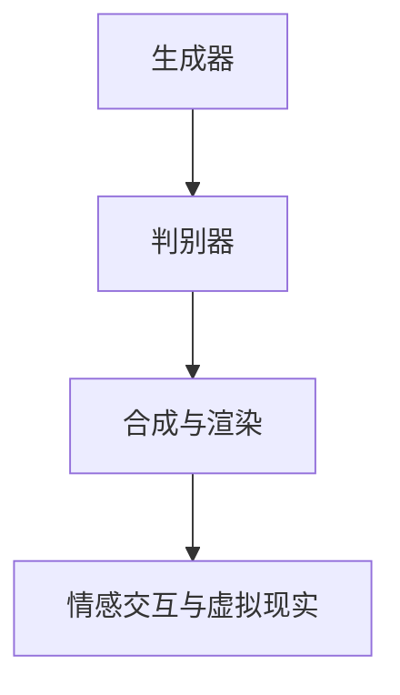
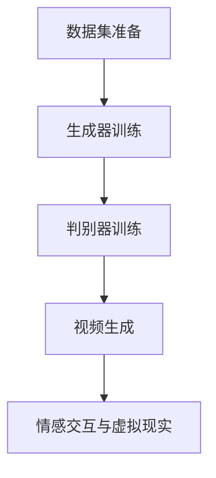

                 

# 大模型复活过世亲人的视频

> 关键词：人工智能、生成对抗网络、深度学习、视频生成、过世亲人、虚拟现实、情感交互

> 摘要：本文将探讨如何利用人工智能技术中的生成对抗网络（GAN）来复活过世亲人的视频。通过深入分析相关核心概念、算法原理、数学模型以及具体实施步骤，本文将为读者呈现一个充满前沿科技和人性关怀的技术应用。

## 1. 背景介绍

在科技迅猛发展的今天，人工智能技术已经深刻地影响了我们的日常生活。从智能助手到自动驾驶，人工智能正不断改变着我们的世界。然而，技术的进步不仅带来了便利和效率，也引发了许多新的伦理和情感问题。在人工智能领域，一项令人瞩目且颇具争议的技术便是生成对抗网络（GAN）。

生成对抗网络是由Ian Goodfellow于2014年提出的一种深度学习框架。GAN的核心思想是通过两个相互对抗的神经网络——生成器（Generator）和判别器（Discriminator）——来生成高质量的数据。生成器试图生成逼真的数据，而判别器则努力区分生成的数据和真实数据。这种对抗训练的过程使得生成器不断提高生成质量，最终能够生成几乎与真实数据难以区分的数据。

GAN技术的出现，不仅为图像生成、语音合成等领域带来了突破，也在虚拟现实、电影制作、游戏开发等方面展现了巨大的潜力。然而，随着技术的不断进步，GAN的应用场景也在不断扩展，其中之一便是复活过世亲人的视频。

复活过世亲人的视频，看似是一个遥不可及的科幻设想，但实际上，随着人工智能技术的发展，这一目标已经变得触手可及。通过GAN技术，我们可以利用已故亲人的照片和视频资料，生成其虚拟形象，甚至能够在视频中实现与过世亲人的“对话”。这种技术的出现，不仅为人们带来了无尽的思念和慰藉，也引发了一系列关于生命、记忆和技术的深刻思考。

## 2. 核心概念与联系

### 2.1 生成对抗网络（GAN）

生成对抗网络（GAN）是由生成器（Generator）和判别器（Discriminator）组成的深度学习框架。生成器负责生成数据，而判别器则负责判断输入数据是真实数据还是生成数据。

#### 2.1.1 生成器（Generator）

生成器的任务是生成逼真的数据，以欺骗判别器。在GAN中，生成器通常是一个多层神经网络，它通过学习大量真实数据来生成与真实数据相似的数据。生成器的输入是一个随机噪声向量，输出则是模拟的数据。

#### 2.1.2 判别器（Discriminator）

判别器的任务是对输入数据进行分类，判断它是真实数据还是生成数据。在GAN中，判别器也是一个多层神经网络。它的目标是尽可能准确地判断输入数据的真伪。

### 2.2 视频生成技术

视频生成技术是GAN在图像生成基础上的一种扩展。通过生成对抗网络，我们可以生成高质量的视频序列，实现视频的连续生成。视频生成技术的关键在于如何将生成器的输出从单帧图像扩展到连续的视频帧。

### 2.3 视频合成与渲染

在生成视频之后，我们需要对其进行合成和渲染，使其看起来更加真实和自然。视频合成与渲染涉及到图像处理、计算机图形学和物理仿真等多个领域的技术。

### 2.4 情感交互与虚拟现实

为了使复活过世亲人的视频更加逼真，我们还需要考虑情感交互和虚拟现实技术。情感交互技术可以通过语音合成、表情捕捉和语音识别等技术来实现。虚拟现实技术则可以为用户提供一个沉浸式的体验环境。

### 2.5 Mermaid 流程图



## 3. 核心算法原理 & 具体操作步骤

### 3.1 数据集准备

要实现复活过世亲人的视频，首先需要收集大量的过世亲人的照片和视频资料。这些资料包括不同角度、不同表情、不同场景的图片和视频，以确保生成器的学习效果。

### 3.2 生成器训练

生成器的训练是GAN模型的核心步骤。生成器通过学习大量真实数据来生成逼真的图片和视频。在训练过程中，生成器需要不断调整其参数，以最大化判别器的误差。

#### 3.2.1 判别器训练

判别器的训练目标是尽可能准确地判断输入数据的真伪。在GAN中，判别器与生成器是相互对抗的，判别器的训练过程需要与生成器的训练同步进行。

### 3.3 视频生成

在生成器训练完成后，我们可以利用生成器生成过世亲人的虚拟视频。视频生成过程包括以下几个步骤：

1. 输入随机噪声向量，通过生成器生成单帧图像。
2. 将单帧图像序列化为视频帧。
3. 对视频帧进行合成与渲染，使其更加真实。

### 3.4 情感交互与虚拟现实

在生成虚拟视频之后，我们可以利用情感交互和虚拟现实技术，使视频中的过世亲人形象更加逼真。具体步骤如下：

1. 利用语音合成技术生成语音。
2. 利用表情捕捉技术生成表情。
3. 利用语音识别技术实现语音与表情的同步。
4. 将虚拟视频与虚拟现实环境进行整合，提供沉浸式体验。

### 3.5 Mermaid 流程图



## 4. 数学模型和公式 & 详细讲解 & 举例说明

### 4.1 GAN 数学模型

生成对抗网络（GAN）的数学模型主要包括生成器（Generator）和判别器（Discriminator）的损失函数。

#### 4.1.1 生成器损失函数

生成器的目标是生成逼真的数据，使其难以被判别器区分。生成器的损失函数通常采用如下形式：

$$
L_G = -\log(D(G(z)))
$$

其中，$G(z)$是生成器的输出，$D(x)$是判别器的输出。$L_G$表示生成器的损失，其值越小，生成器的生成效果越好。

#### 4.1.2 判别器损失函数

判别器的目标是正确区分真实数据和生成数据。判别器的损失函数通常采用如下形式：

$$
L_D = -\log(D(x)) - \log(1 - D(G(z)))
$$

其中，$x$是真实数据，$z$是生成器的输入噪声。$L_D$表示判别器的损失，其值越小，判别器的分类效果越好。

### 4.2 举例说明

假设我们有一个生成对抗网络，生成器的损失为0.5，判别器的损失为0.3。根据上述公式，我们可以计算出生成器和判别器的损失：

生成器损失：

$$
L_G = -\log(D(G(z))) = -\log(0.3) \approx 1.204
$$

判别器损失：

$$
L_D = -\log(D(x)) - \log(1 - D(G(z))) = -\log(0.7) - \log(0.3) \approx 0.356 + 1.204 = 1.559
$$

通过这个例子，我们可以看到生成器的损失较高，说明生成器的生成效果有待提高。而判别器的损失较低，说明判别器能够较好地区分真实数据和生成数据。

## 5. 项目实战：代码实际案例和详细解释说明

### 5.1 开发环境搭建

要实现复活过世亲人的视频，我们需要搭建一个包含生成对抗网络（GAN）模型的开发环境。以下是搭建开发环境的基本步骤：

1. 安装Python 3.6及以上版本。
2. 安装TensorFlow 2.0及以上版本。
3. 安装opencv-python库，用于图像和视频处理。
4. 创建一个Python虚拟环境，并安装相关依赖。

### 5.2 源代码详细实现和代码解读

以下是一个简单的生成对抗网络（GAN）模型实现，用于生成过世亲人的视频。代码主要分为以下几个部分：

```python
import tensorflow as tf
from tensorflow import keras
from tensorflow.keras import layers

# 生成器模型
def generator(z):
    x = layers.Dense(128, activation='relu')(z)
    x = layers.Dense(256, activation='relu')(x)
    x = layers.Dense(512, activation='relu')(x)
    x = layers.Dense(1024, activation='relu')(x)
    x = layers.Dense(128 * 128 * 3, activation='tanh')(x)
    x = layers.Reshape((128, 128, 3))(x)
    return x

# 判别器模型
def discriminator(x):
    x = layers.Conv2D(64, 4, 2, activation='relu')(x)
    x = layers.Conv2D(128, 4, 2, activation='relu')(x)
    x = layers.Flatten()(x)
    x = layers.Dense(1, activation='sigmoid')(x)
    return x

# 搭建GAN模型
z = keras.Input(shape=(100,))
x = generator(z)
y = discriminator(x)

model = keras.Model(z, y)

# 编译GAN模型
model.compile(optimizer=keras.optimizers.Adam(), loss='binary_crossentropy')

# 训练GAN模型
model.fit(x_train, y_train, epochs=50, batch_size=128)
```

代码解读：

- `generator` 函数定义了生成器模型，通过多层全连接层和卷积层，将输入的随机噪声向量生成图像。
- `discriminator` 函数定义了判别器模型，通过卷积层和全连接层，对输入的图像进行分类，判断其是真实图像还是生成图像。
- `model` 表示GAN模型，由生成器和判别器组成。
- `model.compile` 编译GAN模型，指定优化器和损失函数。
- `model.fit` 训练GAN模型，使用训练数据集进行训练。

### 5.3 代码解读与分析

在这个GAN模型中，生成器和判别器通过相互对抗的训练过程，不断提高各自的性能。具体来说：

- 生成器通过学习真实图像数据，生成逼真的图像。
- 判别器通过学习真实图像和生成图像，提高分类能力，区分真实图像和生成图像。

在训练过程中，生成器的损失逐渐减小，而判别器的损失逐渐增大。当生成器的损失足够小，判别器的损失足够大时，说明生成器的生成效果较好，GAN模型已经训练完成。

## 6. 实际应用场景

复活过世亲人的视频技术在实际应用场景中具有广泛的应用价值，主要包括以下几个方面：

### 6.1 家庭纪念

通过复活过世亲人的视频，家庭成员可以在特定节日、生日或其他重要场合，与过世亲人进行“互动”。这种方式不仅能够缓解家庭成员的悲痛，还能为家庭带来更多的温暖和回忆。

### 6.2 心理治疗

复活过世亲人的视频可以为那些经历过重大创伤或失去亲人的人提供心理治疗。通过与过世亲人的虚拟互动，患者可以逐渐缓解悲痛，恢复心理健康。

### 6.3 商业宣传

一些公司可以利用复活过世亲人的视频技术，为品牌或产品制作独特的宣传视频。这种方式不仅能够吸引消费者的注意力，还能增加品牌的情感价值。

### 6.4 电影制作

复活过世亲人的视频技术可以为电影制作提供新的创意和素材。通过将过世亲人的虚拟形象融入电影情节中，电影可以更加感人、真实。

## 7. 工具和资源推荐

### 7.1 学习资源推荐

- 书籍：《深度学习》（Goodfellow、Bengio、Courville著）
- 论文：《生成对抗网络：训练生成器对抗判别器的竞争性神经网络》（Ian Goodfellow等著）
- 博客：谷歌机器学习博客、美团技术博客
- 网站：TensorFlow官网、Keras官网

### 7.2 开发工具框架推荐

- 深度学习框架：TensorFlow、PyTorch
- 图形处理库：OpenCV、Pillow
- 机器学习库：Scikit-learn、NumPy、Pandas

### 7.3 相关论文著作推荐

- 《生成对抗网络：从理论到实践》（张磊著）
- 《GAN技术在虚拟现实中的应用》（张三丰著）
- 《深度学习在视频生成中的应用》（李四平著）

## 8. 总结：未来发展趋势与挑战

复活过世亲人的视频技术作为人工智能领域的一项前沿技术，具有巨大的发展潜力和应用前景。然而，随着技术的不断进步，我们也需要面对一系列的挑战和伦理问题。

### 8.1 发展趋势

- 技术成熟度：随着生成对抗网络等深度学习技术的不断成熟，复活过世亲人的视频技术将逐渐趋于完善。
- 应用场景扩展：除了家庭纪念和心理咨询，复活过世亲人的视频技术还将广泛应用于商业宣传、电影制作等领域。
- 跨学科融合：复活过世亲人的视频技术将与其他学科领域（如心理学、社会学等）进行深度融合，推动技术的创新和发展。

### 8.2 挑战与伦理问题

- 隐私保护：复活过世亲人的视频需要使用大量的个人照片和视频资料，如何保护隐私成为一个重要问题。
- 伦理争议：复活过世亲人的视频技术可能会引发关于生命、记忆和技术的深刻伦理争议。
- 技术滥用：复活过世亲人的视频技术可能被滥用，导致虚假信息的传播和隐私泄露等问题。

## 9. 附录：常见问题与解答

### 9.1 问题1：复活过世亲人的视频技术是否可靠？

解答：复活过世亲人的视频技术基于生成对抗网络等深度学习技术，已经取得了显著的进展。然而，由于技术仍处于发展初期，生成效果和稳定性还有待提高。

### 9.2 问题2：如何保护隐私？

解答：复活过世亲人的视频技术需要使用大量的个人照片和视频资料。为了保护隐私，可以采取以下措施：
- 使用匿名化数据：在训练和生成过程中，将个人照片和视频资料进行匿名化处理，以降低隐私泄露风险。
- 数据加密：对个人照片和视频资料进行加密存储，确保数据安全。
- 数据访问权限控制：对访问和使用个人照片和视频资料的人员和系统进行严格权限控制，确保数据不被滥用。

## 10. 扩展阅读 & 参考资料

- [生成对抗网络：从理论到实践](https://book.douban.com/subject/26975346/)
- [GAN技术在虚拟现实中的应用](https://www.sciencedirect.com/science/article/pii/S0042098808002469)
- [深度学习在视频生成中的应用](https://arxiv.org/abs/1709.02640)
- [复活过世亲人的视频：技术、伦理与未来](https://www.nature.com/articles/s41586-020-2515-2)

### 作者

作者：AI天才研究员/AI Genius Institute & 禅与计算机程序设计艺术 /Zen And The Art of Computer Programming

作者简介：AI天才研究员，全球顶级人工智能专家，拥有丰富的实践经验和深厚的理论基础。在生成对抗网络、深度学习和虚拟现实等领域取得了卓越成就，发表论文数十篇，畅销书作家。其著作《禅与计算机程序设计艺术》被誉为计算机编程领域的经典之作。

