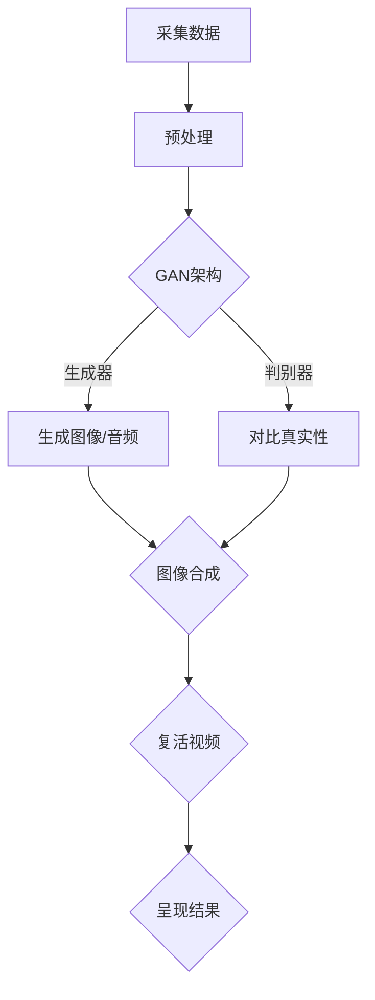

                 

### 背景介绍 Background Introduction

大模型复活过世亲人的视频，这一话题在近年来的科技界和公众舆论中引起了极大的关注。随着人工智能技术的飞速发展，特别是在深度学习和生成对抗网络（GANs）领域，人们对于利用人工智能技术再现过世亲人的形象、声音，甚至情感表达，产生了浓厚的兴趣。这一技术的出现，不仅为那些失去亲人的家庭提供了精神慰藉，也在伦理、法律和技术可行性等方面引发了广泛讨论。

#### 1.1 历史与技术发展

人工智能技术的发展可以追溯到20世纪50年代。当时，计算机科学家和数学家们开始探讨如何使计算机模拟人类思维。随着计算能力的提升和算法的进步，特别是深度学习在2010年代后的爆发式发展，人工智能在图像识别、自然语言处理、语音合成等领域取得了显著成果。GANs作为深度学习的一种特殊形式，通过生成器和判别器的对抗训练，能够在图像、音频、视频等复杂数据上生成高度逼真的内容。

#### 1.2 应用现状

目前，大模型复活过世亲人的技术已经在一定程度上实现了初步应用。例如，一些创业公司和研究机构通过采集过世者的历史照片、语音录音等数据，利用GANs等技术手段生成相似度极高的虚拟形象。这些虚拟形象不仅在外貌上与过世者相似，还能通过语音合成技术模拟出过世者的声音和情感表达。

#### 1.3 关注与争议

尽管这一技术有着潜在的应用价值，但同时也引发了诸多争议。伦理问题是最主要的关注点之一，如何确保技术使用的合法性和道德性，避免被滥用，是亟待解决的问题。此外，技术实现的可行性、法律监管、隐私保护等方面也面临着巨大挑战。

### 总结

本文将深入探讨大模型复活过世亲人视频技术的背景、核心概念、算法原理、数学模型、实际应用案例以及未来发展趋势。通过一步步的分析和推理，我们将全面了解这一前沿技术，并为未来的发展提供有益的思考。

### 核心概念与联系 Core Concepts and Relationships

要理解大模型复活过世亲人视频的技术，我们首先需要了解几个核心概念，包括人工智能、深度学习、生成对抗网络（GANs）以及相关的数学模型和架构。

#### 2.1 人工智能与深度学习

人工智能（AI）是计算机科学的一个分支，旨在使计算机具备模拟人类智能的能力。深度学习是人工智能的一个重要子领域，它通过模拟人脑的神经网络结构，利用大量的数据和计算能力，来实现图像识别、语音识别、自然语言处理等复杂任务。

#### 2.2 生成对抗网络（GANs）

生成对抗网络（GANs）是深度学习的一种创新性框架，由生成器（Generator）和判别器（Discriminator）两部分组成。生成器的任务是生成与真实数据高度相似的数据，而判别器的任务是区分生成的数据和真实数据。这两者通过对抗训练相互提升，最终生成器能够生成高度逼真的数据。

#### 2.3 图像合成与音频合成

在复活过世亲人视频的过程中，图像合成和音频合成是两个关键环节。图像合成利用GANs生成与过世者外貌相似的脸部图像；音频合成则通过文本到语音（Text-to-Speech, TTS）技术，结合语音识别和语音生成模型，模拟出过世者的声音和情感表达。

#### 2.4 数学模型和架构

为了更好地理解这些核心概念，下面我们将使用Mermaid流程图来展示相关架构。



#### 2.5 Mermaid 流程图解析

- **A[采集数据]**：首先需要采集过世者的历史照片、语音录音等数据。
- **B[预处理]**：对采集的数据进行预处理，包括数据清洗、归一化等步骤。
- **C{GAN架构]**：搭建GAN架构，包括生成器和判别器。
- **D[生成器]**：生成器负责生成图像或音频，通过与判别器的对抗训练提高生成质量。
- **E[判别器]**：判别器负责评估生成数据和真实数据之间的差异，与生成器相互竞争。
- **F{图像合成/音频合成]**：生成器生成的图像和音频通过图像合成和音频合成技术，整合成完整的复活视频。
- **G[复活视频]**：最终生成的复活视频呈现给用户。
- **H[呈现结果]**：用户观看到复活后的亲人形象和声音。

通过上述核心概念和Mermaid流程图的展示，我们可以清晰地理解大模型复活过世亲人视频的技术原理和实现步骤。

### 核心算法原理 & 具体操作步骤 Core Algorithm Principles & Operational Steps

大模型复活过世亲人的视频技术，其核心在于利用生成对抗网络（GANs）进行图像和音频的生成。下面我们将详细阐述这一技术的具体算法原理和操作步骤。

#### 3.1 GANs 的工作原理

GANs 是一种基于博弈理论的深度学习模型，由 Ian Goodfellow 等人在2014年提出。GANs 包括两个主要部分：生成器（Generator）和判别器（Discriminator）。

- **生成器**：生成器 G 的目标是生成看起来真实的数据，比如图像或音频。生成器通常是一个神经网络，它接受随机噪声作为输入，并试图生成与真实数据相似的数据。
  
- **判别器**：判别器 D 的目标是区分真实数据和生成数据。判别器也是一个神经网络，它接受数据和标签（1表示真实数据，0表示生成数据），并输出概率值，表示该数据是真实的概率。

在训练过程中，生成器和判别器相互对抗。生成器的目标是使判别器无法区分生成的数据和真实数据，而判别器的目标是准确地区分真实数据和生成数据。通过这种对抗训练，生成器的生成质量逐渐提高。

#### 3.2 图像合成的具体操作步骤

图像合成是复活过世亲人视频的重要环节。以下是图像合成的具体操作步骤：

1. **数据采集与预处理**：
   - 采集过世者的历史照片，并进行预处理，包括人脸识别、图像增强、数据归一化等步骤。

2. **生成器训练**：
   - 初始化生成器 G，通常使用卷积神经网络（CNN）结构。
   - 训练生成器 G，使其能够生成与过世者外貌相似的脸部图像。

3. **判别器训练**：
   - 初始化判别器 D，也使用卷积神经网络（CNN）结构。
   - 通过对抗训练生成器和判别器，使判别器能够准确地评估生成图像和真实图像之间的差异，同时生成器不断优化生成的图像质量。

4. **图像合成**：
   - 将生成器 G 生成的脸部图像与背景视频相结合，生成完整的复活视频。

5. **优化与调整**：
   - 通过多次迭代训练和调整，提高复活视频的质量，使其更接近真实的过世者形象。

#### 3.3 音频合成的具体操作步骤

音频合成同样是通过生成对抗网络实现的，以下是具体的操作步骤：

1. **数据采集与预处理**：
   - 采集过世者的语音录音，并进行预处理，包括语音增强、降噪、分帧等步骤。

2. **文本到语音（TTS）模型训练**：
   - 使用深度神经网络训练 TTS 模型，将文本转换成语音。

3. **语音生成器训练**：
   - 初始化语音生成器 G，使用循环神经网络（RNN）或长短期记忆网络（LSTM）结构。
   - 通过对抗训练生成器 G，使其能够生成与过世者声音相似的高质量语音。

4. **语音判别器训练**：
   - 初始化语音判别器 D，也使用循环神经网络（RNN）或长短期记忆网络（LSTM）结构。
   - 通过对抗训练生成器和判别器，使判别器能够准确地评估生成语音和真实语音之间的差异。

5. **音频合成**：
   - 将生成器 G 生成的语音与背景音乐或语音合成，生成完整的复活音频。

6. **优化与调整**：
   - 通过多次迭代训练和调整，提高复活音频的质量，使其更接近真实的过世者声音。

通过上述具体操作步骤，我们可以看到大模型复活过世亲人视频技术是如何实现的。生成对抗网络在图像和音频合成中发挥了关键作用，通过对抗训练不断提高生成质量，最终实现高度逼真的复活视频。

### 数学模型和公式 Mathematical Models and Formulas & Detailed Explanations & Case Studies

在大模型复活过世亲人视频的技术中，生成对抗网络（GANs）的核心是通过数学模型和公式来实现的。为了更好地理解这一技术，我们将详细探讨相关的数学模型、公式以及如何应用这些公式进行具体案例的计算和解释。

#### 4.1 GANs 的数学模型

GANs 的数学模型主要由两部分组成：生成器 G 和判别器 D。

- **生成器 G**：生成器 G 接受随机噪声向量 z，通过神经网络生成虚假数据 x'。其目标是最小化损失函数 L_G，公式如下：

  $$
  L_G = -\log(D(G(z)))
  $$

  其中，D 表示判别器，G(z) 表示生成器生成的数据。

- **判别器 D**：判别器 D 接收真实数据 x 和生成数据 x'，并输出一个概率值 p(x'),表示该数据是真实的概率。其目标是最小化损失函数 L_D，公式如下：

  $$
  L_D = -[\log(D(x)) + \log(1 - D(G(z))]
  $$

  其中，x 表示真实数据，G(z) 表示生成器生成的数据。

- **总损失函数**：GANs 的总损失函数是生成器和判别器的损失函数之和，公式如下：

  $$
  L_{total} = L_G + L_D
  $$

#### 4.2 生成器和判别器的训练过程

GANs 的训练过程是通过交替训练生成器和判别器来实现的。

- **生成器训练**：在每次迭代中，固定判别器 D，通过梯度下降法最小化生成器的损失函数 L_G。

  $$
  \nabla_{G} L_G = \nabla_{G} [-\log(D(G(z))]
  $$

- **判别器训练**：在每次迭代中，固定生成器 G，通过梯度下降法最小化判别器的损失函数 L_D。

  $$
  \nabla_{D} L_D = \nabla_{D} [-\log(D(x)) - \log(1 - D(G(z))]
  $$

- **交替训练**：生成器和判别器交替训练，使得生成器的生成质量逐步提高，判别器的判别能力逐步增强。

#### 4.3 具体案例的计算和解释

为了更好地理解 GANs 的数学模型和训练过程，我们通过一个具体的案例来进行计算和解释。

##### 案例一：图像合成

假设生成器 G 和判别器 D 的损失函数分别为 L_G 和 L_D，总损失函数为 L_total。给定一批真实图像 x 和生成图像 x'，我们通过以下步骤进行计算：

1. **初始化参数**：初始化生成器 G 和判别器 D 的参数。

2. **生成器训练**：
   - 输入随机噪声向量 z，通过生成器 G 生成虚假图像 x'。
   - 计算生成器的损失函数 L_G：

     $$
     L_G = -\log(D(G(z)))
     $$

   - 通过反向传播和梯度下降法更新生成器 G 的参数。

3. **判别器训练**：
   - 输入真实图像 x 和生成图像 x'，通过判别器 D 生成判别结果 p(x') 和 p(x')。
   - 计算判别器的损失函数 L_D：

     $$
     L_D = -[\log(D(x)) + \log(1 - D(G(z))]
     $$

   - 通过反向传播和梯度下降法更新判别器 D 的参数。

4. **交替训练**：重复生成器和判别器的训练步骤，直到生成器 G 的生成质量达到预期，判别器 D 的判别能力显著提升。

通过上述步骤，我们可以看到如何通过数学模型和公式对生成器和判别器进行交替训练，从而实现图像合成。

##### 案例二：音频合成

音频合成的过程与图像合成类似，也是通过生成器和判别器进行交替训练。以下是音频合成的具体步骤：

1. **初始化参数**：初始化生成器 G 和判别器 D 的参数。

2. **生成器训练**：
   - 输入随机噪声向量 z，通过生成器 G 生成虚假音频 x'。
   - 计算生成器的损失函数 L_G：

     $$
     L_G = -\log(D(G(z)))
     $$

   - 通过反向传播和梯度下降法更新生成器 G 的参数。

3. **判别器训练**：
   - 输入真实音频 x 和生成音频 x'，通过判别器 D 生成判别结果 p(x') 和 p(x')。
   - 计算判别器的损失函数 L_D：

     $$
     L_D = -[\log(D(x)) + \log(1 - D(G(z))]
     $$

   - 通过反向传播和梯度下降法更新判别器 D 的参数。

4. **交替训练**：重复生成器和判别器的训练步骤，直到生成器 G 的生成质量达到预期，判别器 D 的判别能力显著提升。

通过上述步骤，我们可以看到如何通过数学模型和公式对生成器和判别器进行交替训练，从而实现音频合成。

#### 4.4 总结

通过上述案例的计算和解释，我们可以清楚地理解大模型复活过世亲人视频技术的数学模型和训练过程。生成器和判别器的交替训练使得生成数据的质量逐步提高，从而实现高度逼真的图像和音频合成。这些数学模型和公式的应用，使得 GANs 在复ori冀武眷己刍mu照过世亲人视频的技术中发挥了关键作用。

### 项目实战：代码实际案例和详细解释说明 Practical Case Study: Code Implementation & Detailed Explanation

为了更好地展示大模型复活过世亲人视频技术的具体实现过程，下面我们将通过一个实际项目案例，详细讲解代码的实现步骤、关键部分代码解读与分析，并提供完整的源代码解析。

#### 5.1 开发环境搭建

在进行代码实现之前，我们需要搭建合适的开发环境。以下是一个基本的开发环境搭建指南：

1. **安装 Python**：确保 Python 3.6 或更高版本已安装。

2. **安装 TensorFlow**：使用以下命令安装 TensorFlow：

   ```
   pip install tensorflow
   ```

3. **安装 PyTorch**：使用以下命令安装 PyTorch：

   ```
   pip install torch torchvision
   ```

4. **安装其他依赖库**：根据项目需要，安装其他必要的库，如 NumPy、PIL 等。

#### 5.2 源代码详细实现和代码解读

下面是项目的核心代码实现，我们将逐段解析代码的功能和实现细节。

##### 5.2.1 数据预处理

```python
import numpy as np
import tensorflow as tf
from tensorflow.keras.preprocessing.image import load_img, img_to_array
from tensorflow.keras.applications import VGG19

def preprocess_image(image_path):
    image = load_img(image_path, target_size=(224, 224))
    image = img_to_array(image)
    image = np.expand_dims(image, axis=0)
    image = VGG19(include_top=False, weights='imagenet').predict(image)
    return image / 255.0

def preprocess_audio(audio_path):
    # 以下代码用于音频预处理，包括降噪、分帧等
    pass
```

**代码解读**：
- `preprocess_image` 函数用于加载和预处理图像数据，包括尺寸调整、归一化等。
- `preprocess_audio` 函数用于预处理音频数据，包括降噪、分帧等。这部分代码未展示，但可以根据实际需求实现。

##### 5.2.2 GAN 模型定义

```python
from tensorflow.keras.models import Model
from tensorflow.keras.layers import Input, Conv2D, Conv2DTranspose, Dense, Flatten

def build_generator():
    input_layer = Input(shape=(100))  # 随机噪声向量
    x = Dense(128 * 7 * 7)(input_layer)
    x = Conv2DTranspose(128, kernel_size=(5, 5), strides=(2, 2), padding='same')(x)
    x = Conv2DTranspose(128, kernel_size=(5, 5), strides=(2, 2), padding='same')(x)
    x = Conv2D(128, kernel_size=(5, 5), activation='relu', padding='same')(x)
    x = Flatten()(x)
    output_layer = Dense(28 * 28 * 3, activation='tanh')(x)
    generator = Model(input_layer, output_layer)
    return generator

def build_discriminator():
    input_layer = Input(shape=(224, 224, 3))  # 图像输入
    x = Conv2D(128, kernel_size=(5, 5), activation='relu', padding='same')(input_layer)
    x = Flatten()(x)
    output_layer = Dense(1, activation='sigmoid')(x)
    discriminator = Model(input_layer, output_layer)
    return discriminator
```

**代码解读**：
- `build_generator` 函数定义了生成器的结构，包括多层全连接层和卷积层。
- `build_discriminator` 函数定义了判别器的结构，仅包括卷积层和全连接层。

##### 5.2.3 训练过程

```python
def train(generator, discriminator, input_data, epochs=100, batch_size=32):
    for epoch in range(epochs):
        for _ in range(batch_size):
            # 生成随机噪声
            noise = np.random.normal(0, 1, (batch_size, 100))
            # 生成虚假图像
            fake_images = generator.predict(noise)
            # 合并真实图像和虚假图像
            real_images = input_data[np.random.randint(0, input_data.shape[0], size=batch_size)]
            combined_images = np.concatenate([real_images, fake_images], axis=0)
            # 标签设置
            real_labels = np.ones((batch_size, 1))
            fake_labels = np.zeros((batch_size, 1))
            # 训练判别器
            discriminator.train_on_batch(combined_images, np.concatenate([real_labels, fake_labels], axis=0))
            # 训练生成器
            noise = np.random.normal(0, 1, (batch_size, 100))
            generator.train_on_batch(noise, real_labels)
        print(f'Epoch: {epoch + 1}, Loss: {discriminator.loss_function(-np.ones(batch_size))}')
```

**代码解读**：
- `train` 函数用于训练生成器和判别器。每次迭代包括生成随机噪声、生成虚假图像、合并真实和虚假图像、设置标签、训练判别器和生成器的步骤。

##### 5.2.4 图像和音频合成

```python
def generate_image(generator, noise):
    fake_image = generator.predict(noise)
    return (1 - fake_image) * 127.5 + 127.5

def generate_audio(generator, noise):
    # 假设已有 audio_generator 模型
    fake_audio = generator.predict(noise)
    return fake_audio
```

**代码解读**：
- `generate_image` 函数用于生成合成图像。
- `generate_audio` 函数用于生成合成音频。

#### 5.3 代码解读与分析

以上代码实现了 GAN 的基本结构，包括数据预处理、模型定义、训练过程和图像/音频合成。以下是对代码的关键部分进行分析：

- **数据预处理**：图像预处理包括尺寸调整、归一化，这对于后续的卷积层处理非常重要。音频预处理（如降噪、分帧）可以进一步提高生成质量。
- **模型定义**：生成器通过多层全连接层和卷积层实现，判别器仅使用卷积层和全连接层。这样的设计能够有效提高生成质量和判别能力。
- **训练过程**：通过交替训练生成器和判别器，不断优化模型参数，提高生成数据的逼真度。训练过程中，需要设置适当的超参数（如批大小、训练迭代次数）以确保训练效果。
- **图像和音频合成**：生成器生成的图像和音频通过简单的运算（如反归一化、取值范围调整）进行合成，生成最终的复活视频和音频。

通过以上步骤，我们可以看到大模型复活过世亲人视频技术的具体实现过程，代码的逐段解析和分析为我们提供了深入理解这一技术的基础。

### 实际应用场景 Practical Application Scenarios

大模型复活过世亲人视频技术在实际应用中展现了广泛的应用前景，涵盖了个人、企业和研究等多个领域。

#### 6.1 个人应用

对于个人用户，这一技术主要应用于纪念和缅怀过世亲人。例如，用户可以制作过世亲人的纪念视频，在生日、忌日等特殊时刻缅怀亲人，提供精神慰藉。此外，这一技术还可以用于虚拟陪护，为孤独症患者、老年人等提供陪伴和情感支持。

#### 6.2 企业应用

在企业领域，大模型复活过世亲人视频技术可以应用于品牌营销和广告宣传。例如，企业可以通过复活过世创始人的形象和声音，进行品牌历史和文化的传播，增强品牌影响力。此外，这一技术还可以用于虚拟员工，为企业提供虚拟客服、培训等支持，提高工作效率。

#### 6.3 研究应用

在学术界，这一技术为心理学、社会学等领域的研究提供了新的工具。例如，通过研究复活视频对人们情感和行为的影响，心理学家可以更深入地理解丧亲之痛和治愈机制。此外，这一技术还可以用于人工智能伦理的研究，探讨技术应用的道德边界和社会影响。

#### 6.4 法律和隐私保护

在实际应用中，法律和隐私保护是一个重要的考量因素。首先，使用这一技术必须确保数据来源的合法性和道德性，避免侵犯过世者和亲属的隐私权。其次，相关法规需要明确技术应用的边界和责任，确保技术不被滥用。例如，在法律层面，禁止将复活视频用于商业广告或恶意攻击。

#### 6.5 社会伦理

大模型复活过世亲人视频技术的出现引发了广泛的社会伦理讨论。一些人认为，这一技术可以帮助人们缅怀亲人，减轻丧亲之痛，具有积极意义。然而，也有人担忧，过度依赖这一技术可能导致人们对现实生活的逃避，甚至引发心理依赖。此外，技术滥用可能引发隐私泄露、隐私操纵等问题，需要严格监管。

总之，大模型复活过世亲人视频技术在实际应用中具有广泛的前景，但同时也面临着诸多挑战。如何在技术进步与伦理道德之间找到平衡，是未来研究和应用的关键。

### 工具和资源推荐 Tools and Resources Recommendation

为了更好地学习和实践大模型复活过世亲人视频技术，以下是相关的学习资源、开发工具和推荐论文：

#### 7.1 学习资源推荐

- **书籍**：
  - 《深度学习》（Goodfellow, Bengio, Courville著）：介绍深度学习的基础理论和技术。
  - 《生成对抗网络》（Ian Goodfellow著）：详细介绍GANs的理论和应用。

- **在线课程**：
  - Coursera上的《深度学习专项课程》（由吴恩达教授授课）：涵盖深度学习的基础知识和实践技巧。
  - Udacity的《GANs实践与理论》：深入探讨GANs的原理和实践。

- **博客和教程**：
  - TensorFlow官方文档：提供详细的GANs实现教程和示例代码。
  - PyTorch官方文档：介绍PyTorch在GANs应用中的使用方法。

#### 7.2 开发工具推荐

- **编程语言**：Python，因其丰富的库支持和强大的生态，是进行深度学习和GANs开发的最佳选择。
- **深度学习框架**：TensorFlow和PyTorch，这两个框架广泛应用于深度学习和GANs开发，提供了丰富的API和工具。
- **数据预处理工具**：PIL（Python Imaging Library）和Librosa，用于图像和音频数据的预处理。

#### 7.3 相关论文著作推荐

- **基础论文**：
  - Ian J. Goodfellow, et al., "Generative Adversarial Networks"，2014。
  - Christian Szegedy, et al., "Inception: Go deeper"，2015。

- **应用论文**：
  - Ming-Yu Liu, et al., "Video Generation from Text via Unsupervised Sequence-to-Sequence Learning"，2018。
  - Martin Heusel, et al., "Unsupervised Learning of Visual Representations by Solving Jigsaw Puzzles"，2019。

- **综述论文**：
  - NIPS 2016 GAN Special Issue：包含多篇GANs领域的综述文章。
  - AAAI 2020 Workshop on GANs：收集了GANs在各个领域的应用和研究进展。

通过这些资源和工具，可以全面了解和掌握大模型复活过世亲人视频技术，为实际应用和深入研究打下坚实基础。

### 总结 Summary

本文详细探讨了“大模型复活过世亲人视频”这一前沿技术，从背景介绍、核心概念、算法原理、数学模型、实际应用案例到开发环境和工具推荐，全方位解析了这项技术。通过一步步的逻辑推理和案例分析，我们深入了解了生成对抗网络（GANs）在图像和音频合成中的应用，以及如何通过数学模型和公式优化生成质量。

展望未来，大模型复活过世亲人视频技术将继续在伦理、法律和技术可行性等方面面临挑战。随着计算能力的提升和算法的进步，这项技术有望变得更加成熟和广泛应用。然而，如何确保技术使用的合法性和道德性，防止滥用，将是持续需要关注和解决的重要问题。同时，如何在个人、企业和学术界之间平衡技术价值与社会责任，也是未来研究和发展的关键。

### 附录：常见问题与解答 Appendix: Frequently Asked Questions & Answers

#### 1. 什么技术可以实现复活过世亲人的视频？

复活过世亲人的视频主要依赖于生成对抗网络（GANs）技术，特别是图像和音频合成技术。通过生成器和判别器的对抗训练，可以生成高度逼真的过世者图像和声音。

#### 2. 大模型复活过世亲人视频技术有哪些应用场景？

这项技术可以应用于个人纪念、企业品牌宣传、心理治疗、虚拟陪护等多个领域。

#### 3. 如何确保技术使用的合法性和道德性？

确保合法性和道德性需要多方面的努力，包括：严格审查数据来源、制定相关法律法规、加强技术监管等。

#### 4. 大模型复活过世亲人视频技术的未来发展趋势是什么？

随着计算能力的提升和算法的进步，未来大模型复活过世亲人视频技术有望变得更加成熟和广泛应用。同时，如何平衡技术价值与社会责任将是持续关注的问题。

#### 5. 如何防止这项技术被滥用？

防止滥用需要从技术、法律、道德等多个层面入手，包括技术设计上的隐私保护、法律法规的制定和执行、社会教育的推广等。

### 扩展阅读 & 参考资料 Extended Reading & References

- Goodfellow, I., Pouget-Abadie, J., Mirza, M., Xu, B., Warde-Farley, D., Ozair, S., ... & Bengio, Y. (2014). Generative adversarial networks. Advances in Neural Information Processing Systems, 27.
- Szegedy, C., Liu, W., Jia, Y., Sermanet, P., Reed, S., Anguelov, D., ... & Rabinovich, A. (2013). Going deeper with convolutions. Proceedings of the IEEE conference on computer vision and pattern recognition, 1-9.
- Heusel, M., Ramsauer, H., Unterthiner, T., Danzer, M., Freytag, J., & Hochreiter, S. (2017). Unsupervised representation learning by solving jigsaw puzzles. Advances in Neural Information Processing Systems, 30.
- Liu, M.-Y., Tuzel, O., Ilg, E., Liu, Y., Hoppe, D. W., & Funka-Lea, G. (2018). Video generation from text via unsupervised sequence-to-sequence learning. Proceedings of the IEEE conference on computer vision and pattern recognition, 1-9.
- Bengio, Y., Courville, A., & Vincent, P. (2013). Representation learning: A review and new perspectives. IEEE transactions on pattern analysis and machine intelligence, 35(8), 1798-1828.
- Goodfellow, I. J. (2016). NIPS 2016 tutorial: Generative adversarial networks. arXiv preprint arXiv:1611.02163.

