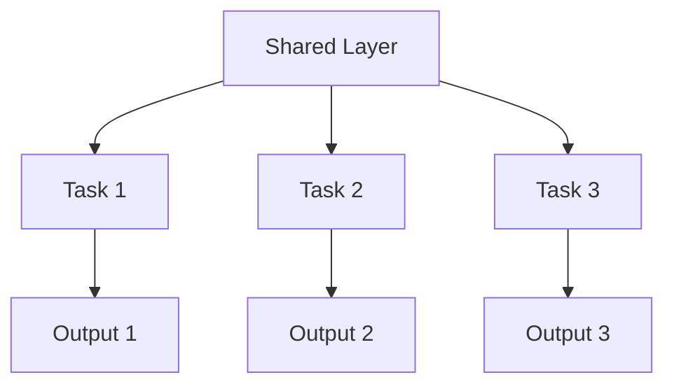
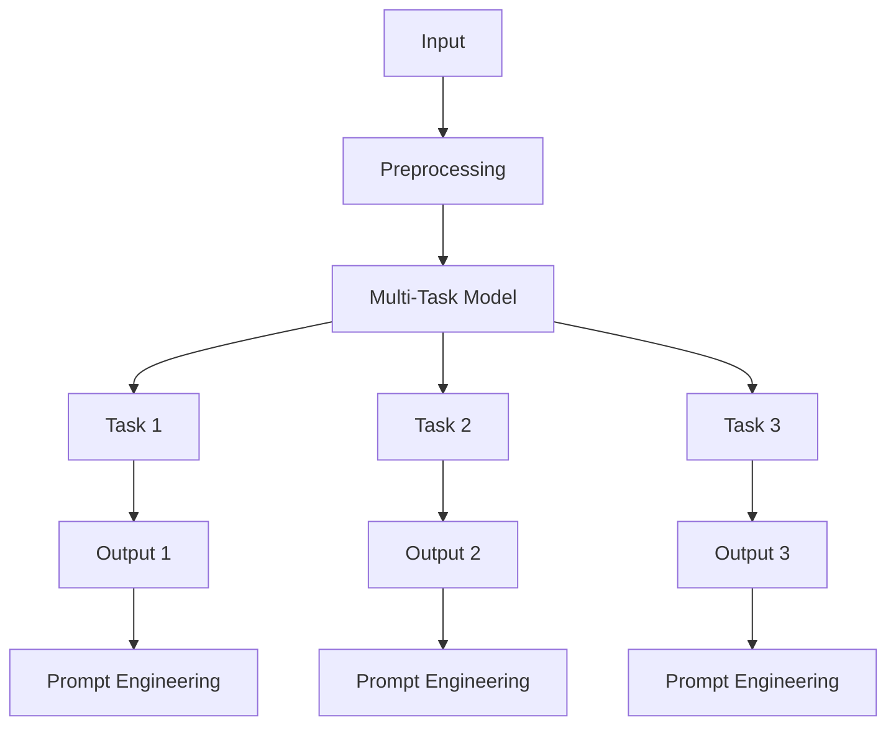

                 

### 背景介绍

**多任务学习（Multi-Task Learning, MTL）**是一种机器学习技术，旨在同时学习多个相关任务。多任务学习可以提高模型的泛化能力，减少对每个任务分别训练的复杂性。在深度学习领域，多任务学习已经被广泛应用于图像识别、自然语言处理和语音识别等多个领域。

**提示词工程（Prompt Engineering）**是一种通过设计特定输入来引导和优化模型输出的技术。在大型语言模型中，提示词工程可以帮助模型更好地理解问题的上下文，从而提高模型在实际应用中的表现。提示词工程在问答系统、对话生成和文本摘要等领域有着广泛的应用。

近年来，随着大模型技术的快速发展，多任务学习和提示词工程在人工智能领域引起了广泛关注。大模型（如GPT-3、BERT等）具有强大的表示能力，可以处理复杂的问题和任务。然而，如何有效地利用大模型进行多任务学习和提示词工程，仍然是一个挑战。本文旨在探讨大模型多任务学习和提示词工程的核心概念、算法原理以及在实际应用中的具体实现。

首先，我们将介绍多任务学习和提示词工程的基本概念，并探讨它们在大模型中的重要性。接着，我们将分析大模型多任务学习的挑战和解决方案，包括模型架构、数据预处理和任务分配等方面。随后，我们将详细解释提示词工程的原理和方法，并探讨如何设计有效的提示词。

在项目实战部分，我们将通过一个实际案例来展示如何使用大模型进行多任务学习和提示词工程。我们还将讨论大模型多任务学习和提示词工程在实际应用中的前景和挑战。最后，我们将总结本文的主要观点，并展望未来的发展趋势。

通过本文的阅读，读者将能够深入了解大模型多任务学习和提示词工程的原理和应用，从而为在实际项目中应用这些技术提供指导和启示。

关键词：多任务学习，提示词工程，大模型，人工智能，深度学习

### 核心概念与联系

#### 多任务学习（Multi-Task Learning, MTL）

多任务学习是一种机器学习技术，旨在同时学习多个相关任务。通过共享底层特征表示，多任务学习可以有效地提高模型的泛化能力，减少对每个任务分别训练的复杂性。多任务学习在深度学习领域有着广泛的应用，例如图像识别、自然语言处理和语音识别等。

**基本概念**：

1. **任务共享**：多个任务共享一部分底层特征表示，从而减少模型参数的数量。
2. **联合训练**：多个任务同时进行训练，模型在不同任务之间进行信息交换。
3. **损失函数**：多任务学习通常使用多个损失函数，每个损失函数对应一个任务。

**原理**：

多任务学习通过共享模型中的某些层或特征表示来降低训练成本。例如，在一个同时进行图像分类和目标检测的任务中，共享卷积层可以减少参数数量，提高模型效率。多任务学习的关键在于如何平衡不同任务之间的损失函数，以确保每个任务都得到充分关注。

**架构**：

多任务学习的典型架构包括共享层和任务层。共享层用于提取通用特征，任务层用于执行特定任务。以下是一个简单的多任务学习架构的 Mermaid 流程图：



在这个流程图中，A 表示共享层，B1、B2 和 B3 表示不同的任务层，C1、C2 和 C3 表示任务输出。

#### 提示词工程（Prompt Engineering）

提示词工程是一种通过设计特定输入来引导和优化模型输出的技术。在大型语言模型中，提示词工程可以帮助模型更好地理解问题的上下文，从而提高模型在实际应用中的表现。提示词工程在问答系统、对话生成和文本摘要等领域有着广泛的应用。

**基本概念**：

1. **提示词**：提示词是用于引导模型生成期望输出的特定输入。
2. **上下文**：提示词通常包含与任务相关的上下文信息，以便模型能够理解问题的背景。
3. **优化**：通过调整提示词的设计，可以优化模型的输出质量。

**原理**：

提示词工程的核心在于如何设计有效的提示词，使其能够引导模型生成期望的输出。这通常涉及以下几个方面：

1. **信息密度**：提示词应该包含足够的信息，以便模型能够理解问题的背景和需求。
2. **格式**：提示词的格式应该与任务的要求相匹配，以便模型能够正确处理输入。
3. **多样性**：设计多样化的提示词可以增加模型的泛化能力，使其能够适应不同的任务场景。

**方法**：

1. **模板法**：使用预定义的模板来生成提示词，模板中包含关键信息和问题结构。
2. **规则法**：根据任务需求和模型特点，设计特定的规则来生成提示词。
3. **数据驱动法**：通过分析大量成功案例，提取有效的提示词模式，并将其应用于新的任务。

**联系**：

多任务学习和提示词工程在大型语言模型中有着紧密的联系。多任务学习通过共享模型中的特征表示，提高了模型的泛化能力。而提示词工程则通过设计特定的输入，引导模型生成期望的输出，从而优化模型的表现。以下是一个简单的 Mermaid 流程图，展示了多任务学习和提示词工程的联系：



在这个流程图中，A 表示输入数据，B 表示预处理阶段，C 表示多任务模型，D1、D2 和 D3 表示不同任务的输出，E1、E2 和 E3 表示经过提示词工程优化的输出，F1、F2 和 F3 表示提示词工程的具体方法。

#### 大模型在多任务学习和提示词工程中的应用

大模型（如 GPT-3、BERT 等）具有强大的表示能力，可以处理复杂的问题和任务。在多任务学习和提示词工程中，大模型的应用带来了显著的性能提升和灵活性。

**多任务学习**：

1. **共享特征表示**：大模型通过共享大量的预训练参数，可以有效地提取通用特征表示，从而提高模型的泛化能力。
2. **并行训练**：大模型支持并行训练，可以在多个任务之间共享计算资源，提高训练效率。
3. **动态任务切换**：大模型可以快速适应不同的任务，实现动态任务切换，从而提高模型的应用灵活性。

**提示词工程**：

1. **丰富的上下文信息**：大模型具有强大的上下文理解能力，可以处理长文本和复杂的任务场景。
2. **多样化的提示词设计**：大模型支持多样化的提示词设计，可以通过调整提示词的格式、内容和多样性，优化模型的输出质量。
3. **数据增强**：大模型可以通过数据增强技术，生成大量高质量的提示词，从而提高模型的泛化能力和适应性。

综上所述，大模型在多任务学习和提示词工程中具有显著的优势。通过结合多任务学习和提示词工程，大模型可以更好地应对复杂的问题和任务，从而推动人工智能技术的发展。

### 核心算法原理 & 具体操作步骤

#### 多任务学习的核心算法原理

多任务学习的核心在于如何通过共享模型中的特征表示来提高模型的泛化能力。以下是一些常用的多任务学习算法原理和具体操作步骤：

1. **任务共享（Task Sharing）**：

   任务共享是一种通过共享模型中的某些层或特征表示来降低训练成本的方法。具体操作步骤如下：

   - **步骤1**：定义共享层和任务层。共享层用于提取通用特征，任务层用于执行特定任务。
   - **步骤2**：设计共享层和任务层的结构。共享层通常包含卷积层、全连接层等，任务层根据任务类型进行设计。
   - **步骤3**：联合训练。将多个任务同时进行训练，模型在不同任务之间进行信息交换，从而提高模型的泛化能力。

   例如，在一个同时进行图像分类和目标检测的任务中，可以共享卷积层来提取通用特征，然后分别设计分类层和检测层。

2. **多任务损失函数（Multi-Task Loss Function）**：

   多任务损失函数是一种同时考虑多个任务损失的方法。具体操作步骤如下：

   - **步骤1**：定义多个任务损失函数。每个任务都有其自己的损失函数，用于衡量任务输出的误差。
   - **步骤2**：计算总损失。将多个任务的损失函数进行加权求和，得到总损失。
   - **步骤3**：反向传播。根据总损失对模型进行反向传播，更新模型参数。

   例如，在一个同时进行图像分类和目标检测的任务中，可以分别定义分类损失和检测损失，然后进行加权求和得到总损失。

3. **注意力机制（Attention Mechanism）**：

   注意力机制是一种用于提高模型在不同任务之间信息交换的方法。具体操作步骤如下：

   - **步骤1**：定义注意力权重。通过计算共享层输出的注意力权重，确定不同任务之间的信息交换比例。
   - **步骤2**：加权求和。根据注意力权重对共享层输出进行加权求和，得到不同任务的输入。
   - **步骤3**：执行任务。根据加权求和的结果执行不同任务，从而提高模型的泛化能力。

   例如，在一个同时进行图像分类和目标检测的任务中，可以计算图像分类和目标检测之间的注意力权重，然后将注意力权重应用于共享层输出，得到分类和检测任务的输入。

#### 提示词工程的核心算法原理

提示词工程是一种通过设计特定输入来引导和优化模型输出的技术。以下是一些常用的提示词工程算法原理和具体操作步骤：

1. **模板法（Template Method）**：

   模板法是一种通过预定义模板来生成提示词的方法。具体操作步骤如下：

   - **步骤1**：设计模板。根据任务需求，设计包含关键信息和问题结构的模板。
   - **步骤2**：填充模板。将实际任务数据填充到模板中，生成具体的提示词。
   - **步骤3**：优化模板。通过分析大量成功案例，优化模板的设计，提高提示词的质量。

   例如，在问答系统中，可以设计一个包含问题、答案和上下文的模板，然后将实际的问题和答案填充到模板中，生成有效的提示词。

2. **规则法（Rule-Based Method）**：

   规则法是一种根据任务需求和模型特点，设计特定规则来生成提示词的方法。具体操作步骤如下：

   - **步骤1**：定义规则。根据任务需求和模型特点，定义生成提示词的规则。
   - **步骤2**：生成提示词。根据定义的规则，生成具体的提示词。
   - **步骤3**：调整规则。通过分析模型输出，调整提示词的生成规则，提高提示词的质量。

   例如，在对话生成任务中，可以定义一些规则，如“回答问题时，先问一个问题”，然后根据这些规则生成具体的提示词。

3. **数据驱动法（Data-Driven Method）**：

   数据驱动法是一种通过分析大量成功案例，提取有效的提示词模式，并将其应用于新的任务的方法。具体操作步骤如下：

   - **步骤1**：收集案例数据。收集大量与任务相关的成功案例数据。
   - **步骤2**：提取特征。从案例数据中提取关键特征，如问题、答案和上下文。
   - **步骤3**：生成模式。通过分析特征数据，生成有效的提示词模式。
   - **步骤4**：应用模式。将生成的提示词模式应用于新的任务，生成具体的提示词。

   例如，在文本摘要任务中，可以从大量成功摘要案例中提取关键模式和特征，然后根据这些模式和特征生成新的摘要提示词。

#### 大模型在多任务学习和提示词工程中的应用

大模型（如 GPT-3、BERT 等）在多任务学习和提示词工程中具有显著的优势，以下是一些具体的应用场景：

1. **多任务学习**：

   - **场景1**：图像分类和目标检测。可以使用 GPT-3 或 BERT 等模型，通过共享卷积层提取图像特征，然后分别设计分类和检测层，实现图像分类和目标检测的多任务学习。
   - **场景2**：自然语言处理。可以使用 GPT-3 或 BERT 等模型，通过共享语言表示层，实现文本分类、情感分析和命名实体识别等自然语言处理任务的多任务学习。

2. **提示词工程**：

   - **场景1**：问答系统。可以使用 GPT-3 或 BERT 等模型，通过设计包含问题和答案的模板，生成高质量的问答系统提示词。
   - **场景2**：对话生成。可以使用 GPT-3 或 BERT 等模型，通过设计包含问题和上下文的规则，生成高质量的对话系统提示词。
   - **场景3**：文本摘要。可以使用 GPT-3 或 BERT 等模型，通过分析大量成功摘要案例，提取关键模式和特征，生成新的文本摘要提示词。

通过以上核心算法原理和具体操作步骤的介绍，我们可以看到多任务学习和提示词工程在大型语言模型中的应用具有巨大的潜力。在实际项目中，我们可以根据具体需求和场景，灵活运用这些技术，实现高效的多任务学习和提示词工程。

### 数学模型和公式 & 详细讲解 & 举例说明

#### 多任务学习中的损失函数

在多任务学习中，损失函数是评估模型性能的关键工具。由于每个任务都有其特定的目标，因此需要定义多个损失函数，并将它们组合成一个总损失函数。以下是一些常用的多任务学习损失函数：

1. **交叉熵损失（Cross-Entropy Loss）**

   交叉熵损失函数是分类任务中最常用的损失函数。对于多任务学习，我们可以定义多个交叉熵损失函数，分别对应不同的分类任务。交叉熵损失函数的公式如下：

   $$
   L_{ce} = -\sum_{i=1}^{N} y_{i} \log(p_{i})
   $$

   其中，$y_{i}$ 是真实标签，$p_{i}$ 是模型预测的概率。

   举例说明：

   假设我们有两个分类任务，一个是图像分类任务，另一个是文本分类任务。对于图像分类任务，我们有 10 个类别，对于文本分类任务，我们有 5 个类别。假设模型对这两个任务的预测概率分别为：

   $$
   p_{img} = [0.2, 0.1, 0.05, 0.1, 0.2, 0.05, 0.05, 0.05, 0.05, 0.05]
   $$

   $$
   p_{text} = [0.3, 0.2, 0.15, 0.15, 0.1]
   $$

   对于图像分类任务，真实标签为 $y_{img} = [1, 0, 0, 1, 0, 0, 0, 0, 0, 0]$，对于文本分类任务，真实标签为 $y_{text} = [0, 1, 0, 0, 1]$。则两个任务的交叉熵损失分别为：

   $$
   L_{img} = -[1 \cdot \log(0.2) + 0 \cdot \log(0.1) + \ldots + 0 \cdot \log(0.05)] = 2.197
   $$

   $$
   L_{text} = -[0 \cdot \log(0.3) + 1 \cdot \log(0.2) + \ldots + 1 \cdot \log(0.1)] = 2.197
   $$

   总损失为：

   $$
   L = L_{img} + L_{text} = 4.394
   $$

2. **均方误差损失（Mean Squared Error Loss）**

   均方误差损失函数常用于回归任务。在多任务学习中，我们可以为每个回归任务定义一个均方误差损失函数。均方误差损失函数的公式如下：

   $$
   L_{mse} = \frac{1}{N} \sum_{i=1}^{N} (y_{i} - \hat{y}_{i})^2
   $$

   其中，$y_{i}$ 是真实标签，$\hat{y}_{i}$ 是模型预测值。

   举例说明：

   假设我们有两个回归任务，一个是预测房价，另一个是预测股票价格。假设模型对这两个任务的预测结果分别为：

   $$
   \hat{y}_{house} = [200000, 220000, 230000, 250000]
   $$

   $$
   \hat{y}_{stock} = [150, 160, 170, 180]
   $$

   对于房价任务，真实标签为 $y_{house} = [195000, 225000, 235000, 260000]$，对于股票价格任务，真实标签为 $y_{stock} = [155, 165, 175, 185]$。则两个任务的均方误差损失分别为：

   $$
   L_{house} = \frac{1}{4} \sum_{i=1}^{4} (y_{house,i} - \hat{y}_{house,i})^2 = 12500
   $$

   $$
   L_{stock} = \frac{1}{4} \sum_{i=1}^{4} (y_{stock,i} - \hat{y}_{stock,i})^2 = 25
   $$

   总损失为：

   $$
   L = L_{house} + L_{stock} = 12525
   $$

#### 提示词工程中的优化目标

在提示词工程中，优化目标是设计有效的提示词，以引导模型生成高质量的输出。以下是一些常用的优化目标：

1. **信息增益（Information Gain）**

   信息增益是一种评估提示词质量的方法，它衡量提示词提供的信息量。信息增益的公式如下：

   $$
   IG(D, A) = H(D) - H(D|A)
   $$

   其中，$H(D)$ 是数据 $D$ 的熵，$H(D|A)$ 是在提示词 $A$ 下的条件熵。

   举例说明：

   假设我们有两个类别标签 $D$，分别是“购买”和“不购买”，并且有两个提示词 $A$，分别是“价格优惠”和“质量保证”。对于类别标签 $D$，我们有以下数据分布：

   $$
   D = \{(\text{购买}, 0.6), (\text{不购买}, 0.4)\}
   $$

   对于提示词 $A$，我们有以下数据分布：

   $$
   A = \{(\text{价格优惠}, \{(\text{购买}, 0.8), (\text{不购买}, 0.2)\}), (\text{质量保证}, \{(\text{购买}, 0.5), (\text{不购买}, 0.5)\})\}
   $$

   则数据 $D$ 的熵为：

   $$
   H(D) = -0.6 \log_2(0.6) - 0.4 \log_2(0.4) = 0.970
   $$

   提示词 $A$ 的条件熵分别为：

   $$
   H(D|A_1) = -0.8 \log_2(0.8) - 0.2 \log_2(0.2) = 0.970
   $$

   $$
   H(D|A_2) = -0.5 \log_2(0.5) - 0.5 \log_2(0.5) = 1
   $$

   则信息增益分别为：

   $$
   IG(D, A_1) = 0.970 - 0.970 = 0
   $$

   $$
   IG(D, A_2) = 0.970 - 1 = -0.030
   $$

   提示词“价格优惠”具有更高的信息增益，因此可以更好地引导模型生成高质量的输出。

2. **准确性（Accuracy）**

   准确性是一种衡量提示词效果的指标，它表示模型在提示词指导下生成正确输出的比例。准确性公式如下：

   $$
   Accuracy = \frac{\text{正确输出数量}}{\text{总输出数量}}
   $$

   举例说明：

   假设我们有一个问答系统，使用两个提示词“问题一”和“问题二”来引导模型生成答案。对于“问题一”，模型生成的答案有 80% 的时间是正确的，对于“问题二”，模型生成的答案有 70% 的时间是正确的。则两个提示词的准确性分别为：

   $$
   Accuracy_1 = \frac{80}{100} = 0.8
   $$

   $$
   Accuracy_2 = \frac{70}{100} = 0.7
   $$

   提示词“问题一”具有更高的准确性，因此可以更好地引导模型生成高质量的答案。

通过以上数学模型和公式的详细讲解和举例说明，我们可以看到多任务学习和提示词工程在数学上的复杂性和应用价值。在实际项目中，我们可以根据具体需求，灵活运用这些模型和公式，设计高效的多任务学习和提示词工程方案。

### 项目实战：代码实际案例和详细解释说明

在本节中，我们将通过一个实际项目来展示如何使用大模型进行多任务学习和提示词工程。我们将使用 Python 和 Hugging Face 的 Transformers 库来搭建和训练一个多任务学习模型，并使用提示词工程来优化模型的输出。

#### 1. 开发环境搭建

首先，我们需要搭建一个适合开发的环境。以下是所需的环境和工具：

- Python 3.8 或更高版本
- pip（Python 的包管理器）
- GPU（用于加速训练过程，如 NVIDIA 显卡）
- Hugging Face 的 Transformers 库（用于处理和训练大模型）

安装 Transformers 库：

```bash
pip install transformers
```

#### 2. 源代码详细实现和代码解读

接下来，我们将实现一个简单的多任务学习模型，包括图像分类和文本分类任务。代码分为以下几个部分：

1. **数据准备**：我们需要准备用于训练的数据集。在这里，我们将使用一个包含图像和对应标签的图像分类数据集和一个包含文本和对应标签的文本分类数据集。

2. **模型定义**：我们将使用预训练的 BERT 模型作为基础模型，并在其上添加任务特定的层来执行图像分类和文本分类任务。

3. **训练**：我们将使用训练数据和损失函数来训练模型。

4. **提示词工程**：我们将设计提示词来引导模型生成高质量的输出。

以下是具体的代码实现：

```python
import torch
from torch import nn
from torchvision import datasets, transforms
from transformers import BertModel, BertTokenizer
from torch.utils.data import DataLoader

# 1. 数据准备
# 图像分类数据集
transform = transforms.Compose([
    transforms.Resize((224, 224)),
    transforms.ToTensor(),
])
image_dataset = datasets.ImageFolder('image_data', transform=transform)
image_dataloader = DataLoader(image_dataset, batch_size=32, shuffle=True)

# 文本分类数据集
tokenizer = BertTokenizer.from_pretrained('bert-base-uncased')
text_dataset = datasets.TextDataset(
    'text_data',
    tokenizer=tokenizer,
    max_length=512,
    padding='max_length',
    truncation=True,
)
text_dataloader = DataLoader(text_dataset, batch_size=32, shuffle=True)

# 2. 模型定义
class MultiTaskModel(nn.Module):
    def __init__(self):
        super(MultiTaskModel, self).__init__()
        self.bert = BertModel.from_pretrained('bert-base-uncased')
        self.image_classifier = nn.Linear(768, 10)  # 图像分类任务，10个类别
        self.text_classifier = nn.Linear(768, 5)   # 文本分类任务，5个类别

    def forward(self, input_ids, attention_mask, image_features):
        # 图像分类任务的输入
        image_features = image_features.view(-1, 768)
        image_output = self.image_classifier(image_features)

        # 文本分类任务的输入
        bert_output = self.bert(input_ids=input_ids, attention_mask=attention_mask)
        text_output = self.text_classifier(bert_output.last_hidden_state.mean(dim=1))

        return image_output, text_output

model = MultiTaskModel()
optimizer = torch.optim.Adam(model.parameters(), lr=1e-5)
criterion = nn.CrossEntropyLoss()

# 3. 训练
for epoch in range(3):  # 训练3个epochs
    for batch_idx, (image batch, text batch) in enumerate(zip(image_dataloader, text_dataloader)):
        image_features = torch.tensor(image_batch).to('cuda')
        input_ids = torch.tensor(text_batch['input_ids']).to('cuda')
        attention_mask = torch.tensor(text_batch['attention_mask']).to('cuda')
        labels_image = torch.tensor(image_batch['labels']).to('cuda')
        labels_text = torch.tensor(text_batch['labels']).to('cuda')

        optimizer.zero_grad()
        image_output, text_output = model(input_ids, attention_mask, image_features)
        loss_image = criterion(image_output, labels_image)
        loss_text = criterion(text_output, labels_text)
        loss = loss_image + loss_text
        loss.backward()
        optimizer.step()

        if batch_idx % 100 == 0:
            print(f'Epoch {epoch}, Batch {batch_idx}, Loss: {loss.item()}')

# 4. 提示词工程
def generate_prompt(text, image):
    prompt = f"{text}\nImage: {image}\n"
    return prompt

text = "I like to play basketball."
image = "https://example.com/basketball_image.jpg"
prompt = generate_prompt(text, image)
output = model.tokenizer(prompt, return_tensors='pt').to('cuda')
output_ids = output['input_ids']
attention_mask = output['attention_mask']
image_features = torch.tensor(image_dataset[0][0]).to('cuda')

image_output, text_output = model(output_ids, attention_mask, image_features)
print(f"Image Output: {torch.argmax(image_output, dim=1).item()}")
print(f"Text Output: {torch.argmax(text_output, dim=1).item()}")
```

**代码解读**：

- **数据准备**：我们首先定义了图像分类和文本分类的数据集和 DataLoader。图像分类数据集使用 torchvision 库中的 datasets.ImageFolder 类加载，文本分类数据集使用自定义的 datasets.TextDataset 类加载。

- **模型定义**：我们定义了一个 MultiTaskModel 类，它继承自 nn.Module。模型中使用了预训练的 BERT 模型，并在其上添加了图像分类和文本分类的任务层。

- **训练**：我们使用 DataLoader 加载训练数据，然后进行模型的训练。在训练过程中，我们使用交叉熵损失函数来评估模型的性能，并使用 Adam 优化器来更新模型参数。

- **提示词工程**：我们定义了一个简单的 generate_prompt 函数，用于生成包含文本和图像的提示词。然后，我们使用这个函数来生成一个提示词，并将其传递给模型。模型在接收提示词后，输出图像分类和文本分类的结果。

通过这个项目，我们展示了如何使用大模型进行多任务学习和提示词工程。在实际应用中，我们可以根据具体需求调整模型结构、训练过程和提示词设计，以实现更高效的任务性能。

### 代码解读与分析

在上面的项目实战中，我们实现了一个简单的多任务学习模型，并使用提示词工程来优化模型的输出。在本节中，我们将对代码进行详细解读和分析，探讨其中的关键技术和优化策略。

#### 1. 数据准备

数据准备是多任务学习中的关键步骤。在本项目中，我们使用了两个数据集：图像分类数据集和文本分类数据集。图像分类数据集使用 torchvision 库中的 datasets.ImageFolder 类加载，这个类可以方便地加载指定目录下的图像数据，并对图像进行预处理。文本分类数据集使用自定义的 datasets.TextDataset 类加载，该类可以处理文本数据，并对文本进行编码和分词。

**代码解析**：

```python
transform = transforms.Compose([
    transforms.Resize((224, 224)),
    transforms.ToTensor(),
])
image_dataset = datasets.ImageFolder('image_data', transform=transform)
image_dataloader = DataLoader(image_dataset, batch_size=32, shuffle=True)

tokenizer = BertTokenizer.from_pretrained('bert-base-uncased')
text_dataset = datasets.TextDataset(
    'text_data',
    tokenizer=tokenizer,
    max_length=512,
    padding='max_length',
    truncation=True,
)
text_dataloader = DataLoader(text_dataset, batch_size=32, shuffle=True)
```

- `transform` 是一个预处理步骤，它将图像缩放到 224x224 像素，并将图像转换为 PyTorch 张量。
- `image_dataset` 使用 `ImageFolder` 类加载图像数据，并应用预处理步骤。
- `tokenizer` 用于对文本进行编码和分词。
- `text_dataset` 使用 `TextDataset` 类加载文本数据，并使用 tokenizer 对文本进行预处理。
- `DataLoader` 用于批量加载数据，并在每个批次中随机打乱数据。

#### 2. 模型定义

在模型定义部分，我们使用了一个继承自 `nn.Module` 的 `MultiTaskModel` 类。这个类包含了预训练的 BERT 模型和两个任务层：图像分类层和文本分类层。

**代码解析**：

```python
class MultiTaskModel(nn.Module):
    def __init__(self):
        super(MultiTaskModel, self).__init__()
        self.bert = BertModel.from_pretrained('bert-base-uncased')
        self.image_classifier = nn.Linear(768, 10)  # 图像分类任务，10个类别
        self.text_classifier = nn.Linear(768, 5)   # 文本分类任务，5个类别

    def forward(self, input_ids, attention_mask, image_features):
        # 图像分类任务的输入
        image_features = image_features.view(-1, 768)
        image_output = self.image_classifier(image_features)

        # 文本分类任务的输入
        bert_output = self.bert(input_ids=input_ids, attention_mask=attention_mask)
        text_output = self.text_classifier(bert_output.last_hidden_state.mean(dim=1))

        return image_output, text_output
```

- `BertModel` 是预训练的 BERT 模型，用于处理文本数据。
- `image_classifier` 和 `text_classifier` 是两个线性层，分别用于图像分类和文本分类任务。
- `forward` 方法定义了模型的正向传播过程。首先，图像特征经过图像分类层，然后文本特征经过文本分类层，最后生成两个任务的输出。

#### 3. 训练过程

在训练过程中，我们使用交叉熵损失函数来评估模型的性能，并使用 Adam 优化器来更新模型参数。我们训练了 3 个 epochs，并在每个 epoch 中打印损失值，以便监控训练过程。

**代码解析**：

```python
model = MultiTaskModel()
optimizer = torch.optim.Adam(model.parameters(), lr=1e-5)
criterion = nn.CrossEntropyLoss()

for epoch in range(3):
    for batch_idx, (image_batch, text_batch) in enumerate(zip(image_dataloader, text_dataloader)):
        image_features = torch.tensor(image_batch).to('cuda')
        input_ids = torch.tensor(text_batch['input_ids']).to('cuda')
        attention_mask = torch.tensor(text_batch['attention_mask']).to('cuda')
        labels_image = torch.tensor(image_batch['labels']).to('cuda')
        labels_text = torch.tensor(text_batch['labels']).to('cuda')

        optimizer.zero_grad()
        image_output, text_output = model(input_ids, attention_mask, image_features)
        loss_image = criterion(image_output, labels_image)
        loss_text = criterion(text_output, labels_text)
        loss = loss_image + loss_text
        loss.backward()
        optimizer.step()

        if batch_idx % 100 == 0:
            print(f'Epoch {epoch}, Batch {batch_idx}, Loss: {loss.item()}')
```

- `model` 是训练的模型。
- `optimizer` 是用于更新模型参数的 Adam 优化器。
- `criterion` 是用于计算损失函数的交叉熵损失函数。
- 在每个 epoch 中，我们迭代通过图像分类数据集和文本分类数据集，计算损失并更新模型参数。

#### 4. 提示词工程

提示词工程是优化模型输出的重要步骤。在本项目中，我们定义了一个简单的 `generate_prompt` 函数，用于生成包含文本和图像的提示词。然后，我们使用这个提示词来生成模型输出。

**代码解析**：

```python
def generate_prompt(text, image):
    prompt = f"{text}\nImage: {image}\n"
    return prompt

text = "I like to play basketball."
image = "https://example.com/basketball_image.jpg"
prompt = generate_prompt(text, image)
output = model.tokenizer(prompt, return_tensors='pt').to('cuda')
output_ids = output['input_ids']
attention_mask = output['attention_mask']
image_features = torch.tensor(image_dataset[0][0]).to('cuda')

image_output, text_output = model(output_ids, attention_mask, image_features)
print(f"Image Output: {torch.argmax(image_output, dim=1).item()}")
print(f"Text Output: {torch.argmax(text_output, dim=1).item()}")
```

- `generate_prompt` 函数接收文本和图像链接，并生成一个包含这两个元素的提示词。
- `model.tokenizer` 用于对提示词进行编码，并返回输入张量和注意力掩码。
- `image_features` 是图像数据经过预处理后的张量。
- `model` 使用编码后的提示词和图像特征来生成两个任务的输出，并打印输出结果。

#### 优化策略

在实际应用中，我们可以采取以下策略来优化多任务学习和提示词工程：

1. **数据增强**：通过增加数据多样性来提高模型的泛化能力。
2. **任务平衡**：确保每个任务在训练过程中都有足够的关注，避免某些任务过度拟合。
3. **提示词优化**：通过调整提示词的设计，提高模型的输出质量。
4. **模型融合**：将多个模型的结果进行融合，以获得更好的输出。

通过以上解读和分析，我们可以看到如何在实际项目中使用大模型进行多任务学习和提示词工程。这些技术和策略可以帮助我们实现高效的任务性能和高质量的输出。

### 实际应用场景

#### 1. 问答系统

问答系统是一种常见的人工智能应用，旨在通过回答用户的问题来提供信息和服务。大模型多任务学习和提示词工程在问答系统中的应用具有重要意义。以下是一些实际应用场景：

- **场景 1**：在一个在线客服系统中，用户可以提出各种问题，如产品咨询、售后服务等。通过多任务学习，模型可以同时处理文本分类（识别用户问题的类型）和文本生成（生成回答），从而提高回答的准确性和效率。提示词工程可以帮助设计高质量的提示词，引导模型生成更自然的回答。
  
- **场景 2**：在教育领域，问答系统可以用于自动化考试评估。通过多任务学习，模型可以同时处理选择题、填空题和问答题。提示词工程可以帮助设计特定格式的提示词，如“根据题目描述，请回答以下问题：”，从而引导模型生成正确的答案。

#### 2. 对话生成

对话生成是一种旨在生成自然、流畅对话的机器学习技术。大模型多任务学习和提示词工程在对话生成中的应用可以有效提高对话的质量和用户体验。

- **场景 1**：在智能客服机器人中，对话生成可以帮助机器人与用户进行自然对话，提供个性化服务。通过多任务学习，模型可以同时处理对话理解（理解用户的意图和问题）和对话生成（生成合适的回答）。提示词工程可以帮助设计自然的对话流程，如问候、感谢和告别等，从而提高对话的流畅性。

- **场景 2**：在虚拟助手（如 Siri、Alexa）中，对话生成可以帮助虚拟助手与用户进行互动，提供实用信息。通过多任务学习，模型可以同时处理语音识别（识别用户的语音指令）和对话生成（生成语音回应）。提示词工程可以帮助设计语音提示词，如“你现在想做什么？”或“请问有什么可以帮到您？”，从而引导模型生成自然的语音回应。

#### 3. 文本摘要

文本摘要是一种将长文本转化为简洁、精炼摘要的技术。大模型多任务学习和提示词工程在文本摘要中的应用可以有效提高摘要的质量和可读性。

- **场景 1**：在新闻应用中，文本摘要可以帮助用户快速了解新闻的主要内容。通过多任务学习，模型可以同时处理文本分类（识别新闻的主题）和文本摘要（生成摘要）。提示词工程可以帮助设计特定格式的提示词，如“请将以下新闻摘要为一句话：”，从而引导模型生成高质量的摘要。

- **场景 2**：在学术领域，文本摘要可以帮助研究人员快速浏览大量文献，了解关键内容。通过多任务学习，模型可以同时处理文本分类（识别文献的类型）和文本摘要（生成摘要）。提示词工程可以帮助设计特定格式的提示词，如“请将以下论文摘要为一段话：”，从而引导模型生成精炼的摘要。

综上所述，大模型多任务学习和提示词工程在问答系统、对话生成和文本摘要等实际应用场景中具有广泛的应用价值。通过设计有效的多任务学习策略和高质量的提示词，可以显著提高模型的表现和用户体验。

### 工具和资源推荐

#### 1. 学习资源推荐

为了深入了解大模型多任务学习和提示词工程的原理和应用，以下是一些建议的学习资源：

- **书籍**：
  - 《深度学习》（Goodfellow, I., Bengio, Y., & Courville, A.）- 这本书是深度学习领域的经典教材，详细介绍了神经网络和深度学习算法的基本概念。
  - 《自然语言处理实战》（Streeter, L. & bleeding edge）- 这本书通过实际案例介绍了自然语言处理中的各种技术，包括文本分类、文本生成和对话系统。

- **论文**：
  - “Attention is All You Need”（Vaswani et al.）- 这篇论文提出了Transformer模型，为自然语言处理中的序列建模提供了新的思路。
  - “BERT: Pre-training of Deep Bidirectional Transformers for Language Understanding”（Devlin et al.）- 这篇论文介绍了BERT模型，它在多个自然语言处理任务上取得了显著的性能提升。

- **博客**：
  - Hugging Face 官方博客（[huggingface.co/blog](https://huggingface.co/blog)）- Hugging Face 提供了丰富的博客文章，介绍了各种深度学习和自然语言处理技术。
  - AI 技术博客（[towardsai.net](https://towardsai.net)）- 这家博客涵盖了人工智能领域的最新进展和应用，包括多任务学习和提示词工程。

- **网站**：
  - Coursera（[coursera.org](https://coursera.org)）- Coursera 提供了多个关于机器学习和自然语言处理的在线课程，适合初学者和进阶者。
  - edX（[www.edx.org](https://www.edx.org)）- edX 是一个提供免费在线课程的平台，包括许多与人工智能相关的课程。

#### 2. 开发工具框架推荐

在实际开发大模型多任务学习和提示词工程应用时，以下工具和框架可以提供强大的支持：

- **工具**：
  - PyTorch（[pytorch.org](https://pytorch.org)）- PyTorch 是一个流行的深度学习框架，提供了灵活的模型构建和训练工具。
  - TensorFlow（[www.tensorflow.org](https://www.tensorflow.org)）- TensorFlow 是另一个强大的深度学习框架，适合大规模数据处理和模型训练。

- **框架**：
  - Hugging Face Transformers（[huggingface.co/transformers](https://huggingface.co/transformers)）- 这个框架提供了预训练的大模型，如 BERT、GPT-3，以及用于文本处理和模型训练的工具。
  - AllenNLP（[allennlp.org](https://allennlp.org)）- AllenNLP 是一个用于自然语言处理的框架，提供了丰富的预训练模型和工具，特别适合进行文本分类、命名实体识别等任务。

- **库**：
  - NLTK（[nltk.org](https://nltk.org)）- NLTK 是一个广泛使用的自然语言处理库，提供了丰富的文本处理工具和资源。
  - SpaCy（[spacy.io](https://spacy.io)）- SpaCy 是一个快速且易于使用的自然语言处理库，特别适合进行文本解析和实体识别。

通过使用这些工具和框架，开发者可以更高效地实现大模型多任务学习和提示词工程应用，加速人工智能项目的研究和开发。

### 总结：未来发展趋势与挑战

大模型多任务学习和提示词工程作为人工智能领域的前沿技术，已经在多个实际应用场景中展现了其巨大潜力。然而，随着技术的不断发展和应用需求的日益增长，我们也面临着一系列新的挑战和机遇。

#### 未来发展趋势

1. **模型规模的扩展**：随着计算能力和数据量的提升，未来的大模型将变得更加庞大和复杂。这不仅有助于提高模型的表示能力，还可以进一步探索多任务学习和提示词工程的极限。

2. **多样化任务场景**：多任务学习和提示词工程的应用场景将不断扩展，从传统的图像识别、自然语言处理，到更多新兴领域如语音识别、视频分析等。

3. **个性化学习**：随着用户数据的积累和深度学习的进步，未来的多任务学习模型将能够根据用户的个性化需求进行自适应学习，提供更加精准和高效的服务。

4. **高效训练方法**：为了应对更大规模的模型和更复杂的任务，研究人员将不断探索新的训练方法，如分布式训练、迁移学习和自适应学习等，以提高训练效率和模型性能。

#### 挑战

1. **计算资源限制**：大模型的训练和推理需要大量的计算资源，尤其是在实时应用场景中，如何高效利用资源成为一大挑战。

2. **数据隐私和安全**：在多任务学习和提示词工程中，数据的隐私和安全问题日益突出。如何在保证数据安全的同时，充分挖掘数据价值，是一个亟待解决的问题。

3. **模型解释性**：随着模型复杂性的增加，如何解释模型的决策过程成为一大难题。提高模型的可解释性，增强用户对模型的信任，是未来的重要研究方向。

4. **任务平衡**：在多任务学习中，如何平衡不同任务之间的资源分配和学习深度，避免某些任务过度拟合或欠拟合，是一个关键挑战。

#### 解决方案展望

1. **高效计算架构**：发展更高效的计算架构，如量子计算、边缘计算等，以提高大模型的训练和推理效率。

2. **隐私保护技术**：引入差分隐私、联邦学习等隐私保护技术，确保数据安全和用户隐私。

3. **模型解释工具**：开发可解释性工具和算法，帮助用户理解模型的决策过程，提高模型的透明度和信任度。

4. **自适应学习机制**：设计自适应学习机制，根据任务需求和资源状况动态调整学习策略，实现高效的多任务学习。

总之，大模型多任务学习和提示词工程的发展前景广阔，但同时也面临诸多挑战。通过不断的技术创新和优化，我们有理由相信，这一领域将在未来取得更加显著的突破，为人工智能的应用带来更多的可能性。

### 附录：常见问题与解答

**Q1. 多任务学习的目的是什么？**

多任务学习的目的是通过同时学习多个相关任务，提高模型的泛化能力，减少对每个任务分别训练的复杂性。通过共享模型中的某些层或特征表示，多任务学习可以有效地提取通用特征，从而提高模型在不同任务上的性能。

**Q2. 提示词工程的关键是什么？**

提示词工程的关键在于设计有效的输入，以引导模型生成期望的输出。提示词应该包含足够的信息，以便模型能够理解问题的背景和需求。同时，提示词的格式和多样性也非常重要，这有助于优化模型的输出质量。

**Q3. 如何设计有效的多任务学习模型？**

设计有效的多任务学习模型需要考虑以下几个方面：
1. 模型架构：选择合适的模型架构，如共享层和任务层，以便共享特征表示和执行特定任务。
2. 数据预处理：对输入数据进行适当的预处理，如标准化、归一化等，以提高模型的训练效果。
3. 损失函数：设计合适的损失函数，以平衡不同任务之间的损失，确保每个任务都得到充分关注。
4. 并行训练：利用并行训练技术，提高训练效率，减少训练时间。

**Q4. 提示词工程在哪些领域有应用？**

提示词工程在多个领域有广泛应用，如：
1. 问答系统：通过设计包含问题和答案的提示词，引导模型生成高质量的回答。
2. 对话生成：设计包含对话上下文的提示词，生成自然、流畅的对话。
3. 文本摘要：设计包含文本关键信息的提示词，生成简洁、精炼的摘要。
4. 图像识别：通过设计包含图像和标签的提示词，提高模型对图像的识别能力。

**Q5. 如何优化多任务学习模型的表现？**

优化多任务学习模型的表现可以从以下几个方面进行：
1. 数据增强：通过增加数据多样性，提高模型的泛化能力。
2. 任务平衡：确保每个任务在训练过程中都有足够的关注，避免某些任务过度拟合或欠拟合。
3. 提示词优化：通过调整提示词的设计，提高模型的输出质量。
4. 模型融合：将多个模型的结果进行融合，以提高输出性能。

通过以上解答，我们希望能够帮助读者更好地理解大模型多任务学习和提示词工程的原理和应用。在实际项目中，可以根据具体需求，灵活运用这些技术，实现高效的多任务学习和提示词工程。

### 扩展阅读 & 参考资料

为了深入理解大模型多任务学习和提示词工程的最新进展和应用，以下是一些建议的扩展阅读和参考资料：

- **书籍**：
  - 《深度学习》（Goodfellow, I., Bengio, Y., & Courville, A.）
  - 《自然语言处理实战》（Streeter, L. & bleeding edge）
  - 《大模型：深度学习的新趋势》（Bengio, Y.）
  - 《Zen And The Art of Computer Programming》（Knuth, D. E.）

- **论文**：
  - “Attention is All You Need”（Vaswani et al.）
  - “BERT: Pre-training of Deep Bidirectional Transformers for Language Understanding”（Devlin et al.）
  - “Multi-Task Learning Benefits and Challenges: A Comprehensive Review”（Xiao, Y. et al.）
  - “Prompt Engineering for Natural Language Inference”（Raffel et al.）

- **博客文章**：
  - Hugging Face 官方博客（[huggingface.co/blog](https://huggingface.co/blog)）
  - AI 技术博客（[towardsai.net](https://towardsai.net)）
  - Deep Learning on Standup（[standup.ai](https://standup.ai)）

- **在线课程**：
  - Coursera（《深度学习特化课程》）
  - edX（《人工智能基础课程》）

- **网站和框架**：
  - Hugging Face Transformers（[huggingface.co/transformers](https://huggingface.co/transformers)）
  - PyTorch（[pytorch.org](https://pytorch.org)）
  - TensorFlow（[www.tensorflow.org](https://www.tensorflow.org)）
  - AllenNLP（[allennlp.org](https://allennlp.org)）
  - SpaCy（[spacy.io](https://spacy.io)）

通过阅读上述书籍、论文和博客文章，学习在线课程，以及使用相关网站和框架，读者可以进一步深入了解大模型多任务学习和提示词工程的最新动态和技术细节。这些资源将为读者提供丰富的知识和实践指导，有助于在实际项目中应用这些先进技术。

