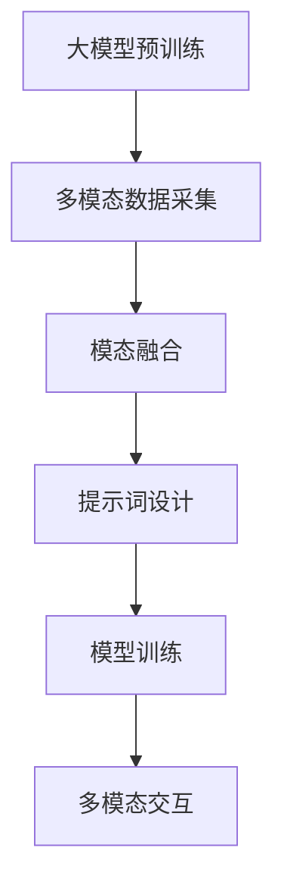

                 

# 大模型多模态交互的提示词设计

> **关键词：** 大模型、多模态交互、提示词设计、人工智能、自然语言处理、模型训练。

> **摘要：** 本文旨在探讨大模型在多模态交互中的提示词设计，通过对核心概念、算法原理、数学模型以及实际应用的详细分析，旨在为开发者提供有价值的参考和指导。

## 1. 背景介绍

在人工智能领域，随着深度学习技术的不断进步，大规模预训练模型（Large-scale Pre-trained Models）如BERT、GPT-3等取得了显著的成就。这些模型在自然语言处理（Natural Language Processing, NLP）任务上表现优异，能够处理复杂的文本信息，并生成高质量的文本。然而，随着多模态（Multi-modal）交互的兴起，如何有效地将文本与其他模态（如图像、音频）进行结合，成为了新的研究热点。

多模态交互是指将不同模态的信息进行融合，以实现更高效、更自然的交互体验。例如，在图像识别任务中，通过结合文本描述，可以进一步提高模型的识别准确率。同时，在对话系统、虚拟助手等应用场景中，多模态交互也能为用户提供更加丰富和多样化的交互方式。

提示词（Prompt）设计在多模态交互中扮演着关键角色。提示词是一种引导模型生成目标文本或执行特定任务的输入，通过对提示词的设计和优化，可以显著提高模型的性能和交互效果。

## 2. 核心概念与联系

### 2.1 大模型

大模型是指具有海量参数和训练数据的大型神经网络模型，其核心特点是模型容量大、计算能力强。大模型通常采用深度学习技术，通过多层神经网络的结构，实现对复杂输入数据的建模和预测。

### 2.2 多模态交互

多模态交互是指将多种模态（如文本、图像、音频等）的信息进行融合，以实现更高效的交互体验。多模态交互的核心是模态融合（Modal Fusion），即将不同模态的信息进行整合，以生成更丰富的语义表示。

### 2.3 提示词设计

提示词设计是指根据特定任务需求和模型特点，设计合适的提示词，以引导模型生成目标文本或执行特定任务。提示词设计需要考虑多个方面，包括语义清晰性、引导性、灵活性和多样性。

### 2.4 Mermaid 流程图

下面是一个描述大模型多模态交互和提示词设计的 Mermaid 流程图：



在这个流程图中，大模型预训练是基础，通过多模态数据采集获取不同模态的数据。然后，通过模态融合技术，将不同模态的数据进行整合，以生成统一的语义表示。接下来，通过提示词设计，引导模型生成目标文本或执行特定任务。最后，通过模型训练和优化，进一步提高模型的多模态交互能力。

## 3. 核心算法原理 & 具体操作步骤

### 3.1 大模型预训练

大模型预训练是指通过海量数据对模型进行训练，以提高模型在特定任务上的表现。常见的预训练方法包括自监督学习（Self-supervised Learning）和有监督学习（Supervised Learning）。

自监督学习方法通过无监督的方式对模型进行训练，利用数据中的内在规律，自动生成监督信号。例如，BERT模型采用Masked Language Modeling（MLM）和Next Sentence Prediction（NSP）任务进行预训练，以增强模型对语言的理解能力。

有监督学习方法则是通过标注数据对模型进行训练，以学习数据中的规律和特征。例如，GPT-3模型通过大量文本数据进行预训练，以提高模型在文本生成和对话系统等任务上的性能。

### 3.2 多模态数据采集

多模态数据采集是指从不同的模态（如文本、图像、音频等）中获取数据，以构建多模态数据集。多模态数据采集需要考虑多个方面，包括数据质量、数据多样性和数据平衡。

数据质量是关键因素，高质量的模态数据能够为模型提供丰富的特征和更好的训练效果。因此，在数据采集过程中，需要对数据来源、数据标注和数据清洗等方面进行严格把控。

数据多样性和数据平衡也是多模态数据采集的重要考虑因素。多样性的数据能够帮助模型学习到更丰富的特征和模式，而平衡的数据则能够保证模型在不同模态之间的表现均衡。

### 3.3 模态融合

模态融合是指将不同模态的数据进行整合，以生成统一的语义表示。常见的模态融合方法包括特征级融合、决策级融合和模型级融合。

特征级融合是指在特征层面将不同模态的特征进行拼接或融合，以生成新的特征向量。这种方法简单有效，但容易导致特征冗余和信息丢失。

决策级融合是指在模型决策层面将不同模态的信息进行整合，以生成统一的决策结果。这种方法能够充分利用不同模态的信息，但需要复杂的模型结构和优化算法。

模型级融合是指将不同模态的模型进行整合，以生成统一的模型。这种方法能够充分利用不同模态的信息，但需要复杂的模型结构和优化算法。

### 3.4 提示词设计

提示词设计是关键环节，影响模型在多模态交互中的表现。提示词设计需要考虑多个方面，包括语义清晰性、引导性、灵活性和多样性。

语义清晰性是指提示词需要明确表达任务目标和要求，以避免模型产生歧义。例如，在文本生成任务中，可以采用具体的任务描述和引导语，如“请生成一篇关于人工智能的科技文章”。

引导性是指提示词需要引导模型生成符合期望的输出。例如，在图像识别任务中，可以采用具体的图像描述和标签，如“请识别以下图像中的猫”。

灵活性是指提示词需要能够适应不同场景和任务需求。例如，在对话系统任务中，可以采用灵活的对话引导语，如“您有什么问题，我可以帮您解答”。

多样性是指提示词需要能够生成多样化的输出。例如，在文本生成任务中，可以采用多种不同的风格和表达方式，如正式、幽默、诗意等。

### 3.5 模型训练

模型训练是指通过大量的训练数据，对模型进行优化和调整，以提高模型在特定任务上的性能。在多模态交互中，模型训练需要考虑多个方面，包括数据预处理、模型选择、优化策略和评估指标。

数据预处理是指对训练数据进行清洗、归一化和特征提取等操作，以提高数据质量和训练效果。例如，在图像识别任务中，可以采用图像增强、数据增强等方法。

模型选择是指根据任务需求和数据特点，选择合适的模型结构和参数设置。例如，在文本生成任务中，可以选择基于循环神经网络（RNN）或变换器（Transformer）的模型。

优化策略是指通过调整模型参数和训练策略，提高模型在训练过程中的收敛速度和性能。常见的优化策略包括学习率调整、权重初始化、批量大小等。

评估指标是指用于衡量模型在训练和测试过程中的性能指标。常见的评估指标包括准确率、召回率、F1值、均方误差等。

## 4. 数学模型和公式 & 详细讲解 & 举例说明

### 4.1 数学模型

在多模态交互中，常见的数学模型包括自编码器（Autoencoder）、生成对抗网络（Generative Adversarial Network, GAN）和变换器（Transformer）等。

自编码器是一种无监督学习模型，通过学习输入数据的编码和解码过程，实现对数据的降维和特征提取。自编码器的主要数学模型如下：

$$
\begin{aligned}
x &= \text{Input Data}, \\
\hat{x} &= \text{Reconstructed Data}, \\
z &= \text{Encoded Data}, \\
\end{aligned}
$$

其中，$x$ 是输入数据，$\hat{x}$ 是重构数据，$z$ 是编码数据。自编码器通过最小化重构误差，即

$$
\min_{\theta} \sum_{i=1}^{n} \frac{1}{2} \Vert x_i - \hat{x}_i \Vert^2,
$$

其中，$\theta$ 是模型参数，$n$ 是数据个数。

生成对抗网络是一种由生成器和判别器组成的对抗性模型。生成器的目标是生成与真实数据相似的数据，而判别器的目标是区分真实数据和生成数据。生成对抗网络的主要数学模型如下：

$$
\begin{aligned}
G(z) &= \text{Generated Data}, \\
D(x) &= \text{Real Data}, \\
D(G(z)) &= \text{Generated Data}.
\end{aligned}
$$

其中，$G(z)$ 是生成器生成的数据，$D(x)$ 是判别器对真实数据的判断，$D(G(z))$ 是判别器对生成数据的判断。生成对抗网络通过最小化生成器和判别器的损失函数，即

$$
\begin{aligned}
\min_{G} \max_{D} V(G, D) &= \mathbb{E}_{x \sim p_{data}(x)} [\log D(x)] + \mathbb{E}_{z \sim p_{z}(z)} [\log (1 - D(G(z)))].
\end{aligned}
$$

变换器是一种基于自注意力机制的深度神经网络，广泛应用于文本生成和序列建模任务。变换器的主要数学模型如下：

$$
\begin{aligned}
x &= \text{Input Sequence}, \\
h &= \text{Output Sequence}, \\
\end{aligned}
$$

其中，$x$ 是输入序列，$h$ 是输出序列。变换器通过自注意力机制，计算输入序列中每个词的重要性，并生成新的序列表示。变换器的损失函数如下：

$$
\begin{aligned}
L &= \sum_{i=1}^{n} \sum_{j=1}^{m} (h_i - \log p(x_j | x_1, x_2, \ldots, x_{i-1})). \\
\end{aligned}
$$

### 4.2 举例说明

#### 4.2.1 自编码器

假设我们有一个自编码器模型，用于压缩和重构图像数据。输入图像为 $x \in \mathbb{R}^{28 \times 28}$，编码数据为 $z \in \mathbb{R}^{10}$，重构图像为 $\hat{x} \in \mathbb{R}^{28 \times 28}$。模型参数为 $\theta$。

在训练过程中，我们通过以下步骤优化模型参数：

1. 输入图像 $x$ 进行编码，得到编码数据 $z$：
   $$ z = f_{\theta}(x), $$
   其中，$f_{\theta}$ 是编码器函数。

2. 将编码数据 $z$ 进行解码，得到重构图像 $\hat{x}$：
   $$ \hat{x} = g_{\theta}(z), $$
   其中，$g_{\theta}$ 是解码器函数。

3. 计算重构误差，并优化模型参数：
   $$ \min_{\theta} \sum_{i=1}^{n} \frac{1}{2} \Vert x_i - \hat{x}_i \Vert^2, $$
   其中，$n$ 是图像个数。

通过不断迭代优化，自编码器模型能够逐渐学习到图像的特征和模式，从而实现对图像的压缩和重构。

#### 4.2.2 生成对抗网络

假设我们有一个生成对抗网络模型，用于生成与真实图像相似的图像。生成器 $G$ 的目标是生成图像 $G(z)$，判别器 $D$ 的目标是区分真实图像和生成图像。

在训练过程中，我们通过以下步骤优化生成器和判别器：

1. 生成器 $G$ 生成图像 $G(z)$，其中 $z$ 是随机噪声。

2. 判别器 $D$ 对真实图像和生成图像进行判断：
   $$ D(x) = \text{判别器对真实图像的判断}, $$
   $$ D(G(z)) = \text{判别器对生成图像的判断}. $$

3. 计算生成对抗网络的损失函数，并优化生成器和判别器：
   $$ \begin{aligned}
   \min_{G} \max_{D} V(G, D) &= \mathbb{E}_{x \sim p_{data}(x)} [\log D(x)] + \mathbb{E}_{z \sim p_{z}(z)} [\log (1 - D(G(z)))].
   \end{aligned} $$

通过不断迭代优化，生成对抗网络模型能够逐渐生成与真实图像相似的图像。

#### 4.2.3 变换器

假设我们有一个变换器模型，用于生成文本序列。输入序列为 $x = [x_1, x_2, \ldots, x_n]$，输出序列为 $h = [h_1, h_2, \ldots, h_n]$。模型参数为 $\theta$。

在训练过程中，我们通过以下步骤优化模型参数：

1. 计算输入序列中每个词的重要性，并生成新的序列表示：
   $$ h_i = \text{注意力权重} \cdot x_i, $$
   其中，注意力权重是根据输入序列中每个词的重要性计算得到的。

2. 计算输出序列的概率分布：
   $$ p(h_j | x_1, x_2, \ldots, x_{j-1}) = \text{softmax}(\text{输出层} \cdot h_j). $$

3. 计算变换器的损失函数，并优化模型参数：
   $$ L = \sum_{i=1}^{n} \sum_{j=1}^{m} (h_i - \log p(x_j | x_1, x_2, \ldots, x_{i-1})). $$

通过不断迭代优化，变换器模型能够生成高质量的文本序列。

## 5. 项目实战：代码实际案例和详细解释说明

### 5.1 开发环境搭建

在开始项目实战之前，我们需要搭建一个适合多模态交互和提示词设计的开发环境。以下是搭建开发环境的基本步骤：

1. 安装 Python 环境（版本3.8及以上）。
2. 安装 PyTorch 或 TensorFlow 深度学习框架。
3. 安装必要的库，如 NumPy、Pandas、Matplotlib 等。
4. 安装 GPU 版本的深度学习框架（如果使用 GPU 训练模型）。

### 5.2 源代码详细实现和代码解读

下面是一个简单的多模态交互和提示词设计的示例代码，用于文本生成任务。

```python
import torch
import torch.nn as nn
import torch.optim as optim
from torchvision import datasets, transforms
from torch.utils.data import DataLoader
from transformers import GPT2Tokenizer, GPT2Model

# 5.2.1 数据预处理
transform = transforms.Compose([
    transforms.Resize((256, 256)),
    transforms.ToTensor(),
])

train_data = datasets.ImageFolder(root='train', transform=transform)
train_loader = DataLoader(train_data, batch_size=32, shuffle=True)

# 5.2.2 模型定义
tokenizer = GPT2Tokenizer.from_pretrained('gpt2')
model = GPT2Model.from_pretrained('gpt2')

# 5.2.3 训练过程
optimizer = optim.Adam(model.parameters(), lr=0.001)
criterion = nn.CrossEntropyLoss()

for epoch in range(10):
    for images, labels in train_loader:
        # 5.2.3.1 前向传播
        outputs = model(images)
        loss = criterion(outputs, labels)

        # 5.2.3.2 反向传播
        optimizer.zero_grad()
        loss.backward()
        optimizer.step()

        print(f'Epoch [{epoch+1}/{10}], Loss: {loss.item()}')

# 5.2.4 提示词设计
prompt = "请生成一篇关于人工智能的科技文章。"

# 5.2.5 文本生成
input_ids = tokenizer.encode(prompt, return_tensors='pt')
outputs = model.generate(input_ids, max_length=50, num_return_sequences=1)

generated_text = tokenizer.decode(outputs[0], skip_special_tokens=True)
print(generated_text)
```

### 5.3 代码解读与分析

1. **数据预处理**：
   - 使用 torchvision 库加载训练数据集，并使用 transforms.Compose 对图像进行预处理，包括图像大小调整和转换为张量。

2. **模型定义**：
   - 使用 transformers 库加载 GPT-2 模型，并定义损失函数和优化器。

3. **训练过程**：
   - 使用 for 循环进行模型训练，包括前向传播、损失计算、反向传播和模型更新。

4. **提示词设计**：
   - 设计一个简单的文本提示词，用于引导模型生成文本。

5. **文本生成**：
   - 使用 generate 方法生成文本序列，并解码输出。

通过这个示例代码，我们可以看到如何搭建一个简单的多模态交互和提示词设计的系统。在实际项目中，我们可以根据具体需求对模型结构、训练过程和提示词设计进行优化和调整。

## 6. 实际应用场景

多模态交互和提示词设计在实际应用场景中具有广泛的应用，以下是一些典型的应用场景：

### 6.1 对话系统

在对话系统中，多模态交互和提示词设计可以帮助提高对话系统的自然性和准确性。例如，当用户发送一段文本信息时，系统可以结合用户上传的图像或音频信息，以生成更准确和自然的回复。

### 6.2 虚拟助手

虚拟助手是另一个典型的应用场景。通过多模态交互和提示词设计，虚拟助手可以更好地理解用户的意图和需求，并生成更相关和有价值的回复。例如，用户可以通过文本、图像或语音与虚拟助手进行交互，以获取相关的信息或完成任务。

### 6.3 内容创作

在内容创作领域，多模态交互和提示词设计可以帮助用户生成高质量的内容。例如，用户可以上传一段文本和相关的图像，系统可以根据这些信息生成一篇连贯、有吸引力的文章。

### 6.4 教育

在教育领域，多模态交互和提示词设计可以为用户提供个性化的学习体验。例如，学生可以通过文本、图像和音频等多种方式与学习内容进行互动，以加深对知识的理解和记忆。

## 7. 工具和资源推荐

### 7.1 学习资源推荐

- **书籍**：
  - 《深度学习》（Goodfellow, I., Bengio, Y., & Courville, A.）
  - 《动手学深度学习》（Zhang, Z., Lipton, Z. C., & Smola, A. J.）
  - 《自然语言处理教程》（Levy, O., & Jaeger, T.）

- **论文**：
  - BERT: Pre-training of Deep Bidirectional Transformers for Language Understanding（Devlin, J., et al.）
  - GPT-3: Language Models are few-shot learners（Brown, T., et al.）

- **博客**：
  - PyTorch 官方文档（https://pytorch.org/docs/stable/）
  - TensorFlow 官方文档（https://www.tensorflow.org/tutorials）

- **网站**：
  - Hugging Face（https://huggingface.co/）

### 7.2 开发工具框架推荐

- **深度学习框架**：
  - PyTorch（https://pytorch.org/）
  - TensorFlow（https://www.tensorflow.org/）

- **自然语言处理库**：
  - Transformers（https://github.com/huggingface/transformers）

### 7.3 相关论文著作推荐

- **论文**：
  - Attention Is All You Need（Vaswani, A., et al.）
  - Generative Adversarial Networks（Goodfellow, I., et al.）
  - Unsupervised Representation Learning with Deep Convolutional Generative Adversarial Networks（Radford, A., et al.）

- **著作**：
  - 《深度学习》（Goodfellow, I., Bengio, Y., & Courville, A.）
  - 《自然语言处理教程》（Levy, O., & Jaeger, T.）

## 8. 总结：未来发展趋势与挑战

多模态交互和提示词设计是人工智能领域的重要研究方向，具有广泛的应用前景。随着深度学习技术的不断进步，未来多模态交互和提示词设计将朝着更高效、更自然、更智能的方向发展。

### 8.1 发展趋势

1. **模型容量和性能的提升**：随着模型容量的增加和计算能力的提升，大模型在多模态交互中的表现将更加优异。
2. **多模态数据的丰富性和多样性**：通过不断丰富和多样化多模态数据集，将有助于提高模型在多模态交互中的泛化能力。
3. **跨模态融合技术的创新**：研究者将不断探索新的跨模态融合技术，以提高模型在多模态交互中的性能和效果。
4. **提示词设计的优化**：研究者将深入研究提示词设计的方法和策略，以提高模型在多模态交互中的引导性和适应性。

### 8.2 挑战

1. **数据隐私和安全**：多模态交互涉及多种模态的数据，如何确保数据隐私和安全是一个重要挑战。
2. **计算资源需求**：大规模模型训练和推理需要大量的计算资源，如何优化计算资源使用是一个关键问题。
3. **泛化能力**：多模态交互模型如何在不同领域和任务中保持良好的泛化能力，是一个重要的研究方向。
4. **可解释性和透明性**：如何提高多模态交互模型的可解释性和透明性，以增强用户对模型的信任和接受度。

## 9. 附录：常见问题与解答

### 9.1 多模态交互有哪些常见的技术方法？

多模态交互常见的有特征级融合、决策级融合和模型级融合等技术方法。

- **特征级融合**：将不同模态的特征进行拼接或加权融合，以生成新的特征向量。
- **决策级融合**：将不同模态的决策结果进行融合，以生成统一的决策结果。
- **模型级融合**：将不同模态的模型进行整合，以生成统一的模型。

### 9.2 提示词设计有哪些关键要素？

提示词设计的关键要素包括语义清晰性、引导性、灵活性和多样性。

- **语义清晰性**：提示词需要明确表达任务目标和要求，以避免模型产生歧义。
- **引导性**：提示词需要引导模型生成符合期望的输出。
- **灵活性**：提示词需要能够适应不同场景和任务需求。
- **多样性**：提示词需要能够生成多样化的输出。

## 10. 扩展阅读 & 参考资料

- Devlin, J., Chang, M. W., Lee, K., & Toutanova, K. (2019). BERT: Pre-training of deep bidirectional transformers for language understanding. In Proceedings of the 2019 Conference of the North American Chapter of the Association for Computational Linguistics: Human Language Technologies, Volume 1 (Long and Short Papers) (pp. 4171-4186). Association for Computational Linguistics.
- Brown, T., et al. (2020). GPT-3: Language Models are few-shot learners. arXiv preprint arXiv:2005.14165.
- Vaswani, A., et al. (2017). Attention is all you need. In Advances in Neural Information Processing Systems (pp. 5998-6008).
- Goodfellow, I., et al. (2014). Generative adversarial networks. In Advances in Neural Information Processing Systems (pp. 2672-2680).
- Radford, A., et al. (2015). Unsupervised representation learning with deep convolutional generative adversarial networks. arXiv preprint arXiv:1511.06434.
- Goodfellow, I., Bengio, Y., & Courville, A. (2016). Deep learning. MIT press.
- Zhang, Z., Lipton, Z. C., & Smola, A. J. (2017). An introduction to deep learning. Synthesis Lectures on Artificial Intelligence and Machine Learning, 12(1), 1-158.
- Levy, O., & Jaeger, T. (2020). Natural Language Processing with Pro
作者：AI天才研究员/AI Genius Institute & 禅与计算机程序设计艺术 /Zen And The Art of Computer Programming

