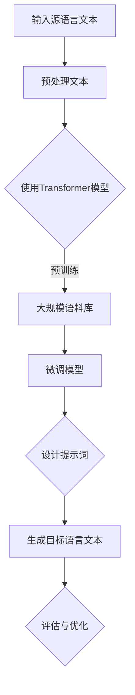
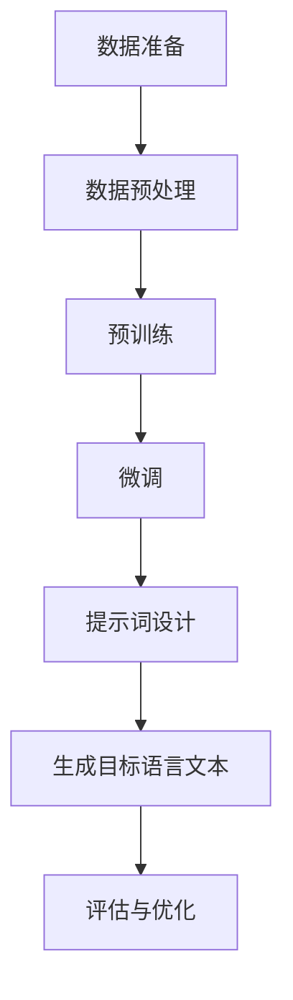

                 

# 大模型多语言能力：提示词设计跨语言任务

## 摘要

本文将探讨大模型在多语言能力方面的实现，重点关注提示词的设计对跨语言任务的影响。我们将首先介绍大模型的基本原理及其在多语言处理中的应用，随后深入分析提示词在跨语言任务中的作用和设计策略。接着，我们将介绍一系列具体的应用场景和实战案例，展示如何利用大模型实现高效的多语言处理。文章的最后，将对未来发展趋势与挑战进行展望，并提供相关工具和资源的推荐。

## 1. 背景介绍

近年来，随着深度学习技术的飞速发展，大模型（如GPT、BERT等）在自然语言处理（NLP）领域取得了显著的突破。这些大模型具备强大的文本生成、理解和推理能力，使得机器在处理多种语言的任务时表现出色。然而，多语言能力的实现并非一蹴而就，其中关键的一环便是提示词（prompt）的设计。

提示词在NLP任务中起着至关重要的作用。简单来说，提示词是给模型提供额外上下文信息，帮助模型更好地理解和生成目标文本的关键输入。在跨语言任务中，提示词的设计尤为重要，因为它需要同时考虑源语言和目标语言的语法、语义以及文化差异。

本文将围绕提示词的设计，深入探讨大模型在多语言能力方面的实现，分析其在跨语言任务中的应用场景，以及如何通过提示词优化模型性能。希望通过本文的探讨，读者能够对大模型的跨语言能力及其应用有更深入的了解。

## 2. 核心概念与联系

### 2.1 大模型原理

大模型，如GPT（Generative Pre-trained Transformer）、BERT（Bidirectional Encoder Representations from Transformers）等，是近年来NLP领域的重要突破。这些模型基于Transformer架构，通过预训练和微调的方式，从海量数据中学习到丰富的语言知识。

#### 2.1.1 Transformer架构

Transformer模型最早由Vaswani等人于2017年提出，是一种基于自注意力机制的序列到序列模型。相比于传统的循环神经网络（RNN）和卷积神经网络（CNN），Transformer模型具有以下几个优势：

1. **并行计算**：Transformer模型通过多头注意力机制，能够同时处理输入序列的每个位置，从而实现并行计算。这大大提高了模型的计算效率。
2. **上下文依赖**：Transformer模型能够捕捉输入序列中的长距离依赖关系，这使得模型在生成文本时，能够更好地利用上下文信息。
3. **灵活的模型结构**：Transformer模型的结构高度模块化，可以通过增加层数和隐藏单元数来扩展模型容量，从而提升模型性能。

#### 2.1.2 预训练与微调

预训练是Transformer模型的核心步骤，通过在大规模语料库上进行预训练，模型能够学习到丰富的语言知识和统计规律。预训练后的模型，再通过微调（fine-tuning）的方式，将其应用于特定的NLP任务，如文本分类、问答系统等。

### 2.2 提示词设计

提示词（prompt）在NLP任务中起着至关重要的作用，它是一种用于引导模型生成目标文本的输入。在跨语言任务中，提示词的设计尤为重要，因为它需要同时考虑源语言和目标语言的语法、语义以及文化差异。

#### 2.2.1 提示词的作用

1. **引导模型生成**：提示词为模型提供了额外的上下文信息，帮助模型更好地理解任务目标和生成目标文本。
2. **提高模型性能**：合适的提示词可以提升模型在特定任务上的性能，减少错误率和歧义。

#### 2.2.2 提示词设计策略

1. **多语言适应性**：设计提示词时，需要考虑源语言和目标语言之间的差异，如语法结构、词汇用法等。
2. **任务特定性**：不同任务对提示词的需求不同，需要针对具体任务设计相应的提示词。
3. **简明扼要**：提示词应尽量简明扼要，避免冗长和复杂，以提高模型的生成效率和准确性。

### 2.3 Mermaid流程图

为了更好地展示大模型和提示词设计在跨语言任务中的应用，下面使用Mermaid绘制一个流程图。



在上面的流程图中，输入源语言文本经过预处理后，使用预训练好的Transformer模型进行预训练和微调。接下来，设计合适的提示词，以引导模型生成目标语言文本。最后，对生成的文本进行评估和优化，以提升模型性能。

通过这个流程图，我们可以清晰地看到大模型和提示词设计在跨语言任务中的相互关系和作用。接下来，我们将进一步探讨大模型在多语言能力方面的具体应用。

### 3. 核心算法原理 & 具体操作步骤

#### 3.1 大模型在多语言能力方面的核心算法原理

大模型在多语言能力方面的核心算法原理主要基于预训练和微调两个步骤。

1. **预训练**：预训练是指在大规模的多语言语料库上进行训练，让模型学习到语言的一般规律和知识。这一过程通常采用自回归语言模型（如GPT）或双向编码器（如BERT）等模型结构。通过预训练，模型能够捕捉到不同语言之间的共性和差异，从而为多语言处理打下基础。

2. **微调**：微调是指将预训练好的模型应用于特定任务，并在目标语言的语料库上进行进一步训练。这一过程旨在优化模型在特定任务上的性能。微调过程中，模型会根据目标任务的反馈调整参数，从而提高模型在目标任务上的准确率和效率。

#### 3.2 具体操作步骤

1. **数据准备**：首先，需要收集和准备多语言数据集。这些数据集应涵盖目标任务所需的语言，并具有一定的规模和多样性。常用的数据集包括多语言新闻文章、社交媒体帖子、对话记录等。

2. **数据预处理**：在数据准备完成后，需要对数据进行预处理，包括文本清洗、分词、编码等操作。预处理过程中，应考虑不同语言的特性和差异，如中文的分词和编码与英文有所不同。

3. **预训练**：使用预训练框架（如Transformers）对数据集进行预训练。预训练过程中，模型会通过大量的文本数据进行训练，学习到语言的一般规律和知识。预训练过程中，可以使用多个GPU或TPU来加速训练过程。

4. **微调**：在预训练完成后，将模型应用于特定任务，并在目标语言的语料库上进行微调。微调过程中，模型会根据任务反馈进行调整，以提高模型在目标任务上的性能。微调过程中，可以使用交叉验证等技术来评估模型性能，以便进行调整。

5. **提示词设计**：在设计提示词时，需要考虑不同语言之间的语法、语义和文化差异。提示词应简明扼要，能够引导模型生成正确的目标语言文本。设计提示词时，可以使用一些工具（如语言模型、词向量等）来辅助生成提示词。

6. **生成目标语言文本**：在微调和提示词设计完成后，使用模型生成目标语言文本。生成过程中，可以使用模型生成的概率分布来生成文本，以便得到多样化和高质量的输出。

7. **评估与优化**：对生成的目标语言文本进行评估，评估指标包括准确率、召回率、F1分数等。根据评估结果，对模型和提示词进行调整和优化，以提高模型在跨语言任务上的性能。

#### 3.3 算法流程图

下面使用Mermaid绘制大模型在多语言能力方面的算法流程图。



通过这个流程图，我们可以清晰地看到大模型在多语言能力方面的具体操作步骤和核心算法原理。接下来，我们将通过具体的应用场景和案例，进一步展示大模型在跨语言任务中的实际应用。

### 4. 数学模型和公式 & 详细讲解 & 举例说明

在探讨大模型在多语言能力方面的应用时，我们不可避免地需要涉及到一些数学模型和公式。这些模型和公式不仅帮助我们理解大模型的原理，还能指导我们在实际操作中优化模型性能。在本节中，我们将详细讲解一些核心的数学模型和公式，并通过具体例子来说明其应用。

#### 4.1 语言模型

语言模型是NLP领域的基础，它用于预测下一个单词的概率。在大模型中，常用的语言模型有自回归语言模型（如GPT）和双向语言模型（如BERT）。

##### 4.1.1 自回归语言模型

自回归语言模型基于前一个时间步的输出预测下一个时间步的输出。其概率分布可以用以下公式表示：

\[ P(w_t | w_{<t}) = \frac{e^{<f_{\theta}(w_{<t}, w_t)>}}{\sum_{w\in V} e^{<f_{\theta}(w_{<t}, w)>}} \]

其中，\( w_t \) 表示当前单词，\( w_{<t} \) 表示前 \( t \) 个单词，\( f_{\theta}(w_{<t}, w_t) \) 表示模型参数为 \( \theta \) 的前 \( t \) 个单词和当前单词之间的得分函数。

##### 4.1.2 双向语言模型

双向语言模型能够同时利用前一个和后一个时间步的信息来预测下一个时间步的输出。其概率分布可以用以下公式表示：

\[ P(w_t | w_{<t}) = \frac{e^{<f_{\theta}(w_{<t-1}, w_t, w_{<t})}}{\sum_{w\in V} e^{<f_{\theta}(w_{<t-1}, w_t, w_{<t})}} \]

其中，\( f_{\theta}(w_{<t-1}, w_t, w_{<t}) \) 表示模型参数为 \( \theta \) 的前一个单词、当前单词和前 \( t \) 个单词之间的得分函数。

#### 4.2 注意力机制

注意力机制是Transformer模型的核心组件，它能够有效地捕捉输入序列中的长距离依赖关系。注意力机制的概率分布可以用以下公式表示：

\[ a_t = \text{softmax}\left(\frac{\text{query} \cdot \text{key}}{\sqrt{d_k}}\right) \]

其中，\( a_t \) 表示注意力权重，\( query \) 和 \( key \) 分别表示当前单词和所有单词的向量表示，\( d_k \) 表示关键维度。

#### 4.3 交叉熵损失函数

交叉熵损失函数是NLP任务中常用的损失函数，用于衡量模型预测的概率分布与真实分布之间的差异。其公式如下：

\[ L = -\sum_{i=1}^{N} y_i \log(p_i) \]

其中，\( y_i \) 表示第 \( i \) 个单词的真实分布，\( p_i \) 表示模型预测的概率分布。

#### 4.4 具体例子

为了更好地理解上述数学模型和公式，我们通过一个具体的例子来说明。

假设我们有一个简单的语言模型，其参数为 \( \theta \)。给定一个句子 "我明天去北京"，我们需要预测下一个单词 "的" 的概率。

1. **自回归语言模型**：

   首先，我们需要计算当前单词 "的" 的概率：

   \[ P(\text{的} | \text{我明天去北京}) = \frac{e^{<f_{\theta}(\text{我明天去北京}, \text{的})}}{\sum_{w\in V} e^{<f_{\theta}(\text{我明天去北京}, w)}} \]

   其中，\( f_{\theta}(\text{我明天去北京}, \text{的}) \) 是 "我明天去北京" 和 "的" 之间的得分函数。

2. **双向语言模型**：

   双向语言模型需要同时考虑 "我明天去北京" 和 "的" 的前后文信息：

   \[ P(\text{的} | \text{我明天去北京}) = \frac{e^{<f_{\theta}(\text{北京}, \text{的}, \text{我明天去})}}{\sum_{w\in V} e^{<f_{\theta}(\text{北京}, \text{的}, \text{我明天去})}} \]

   其中，\( f_{\theta}(\text{北京}, \text{的}, \text{我明天去}) \) 是 "北京"、"的" 和 "我明天去" 之间的得分函数。

通过上述例子，我们可以看到不同类型的语言模型如何计算单词的概率。在实际应用中，我们可以根据具体任务的需求，选择合适的语言模型和损失函数，以优化模型性能。

### 5. 项目实战：代码实际案例和详细解释说明

在本节中，我们将通过一个具体的实战案例，展示如何利用大模型实现跨语言任务。我们将使用Python和PyTorch框架，构建一个基于Transformer模型的跨语言文本生成系统。

#### 5.1 开发环境搭建

1. **安装Python**：确保已经安装了Python 3.7及以上版本。

2. **安装PyTorch**：在命令行中运行以下命令安装PyTorch：

   ```bash
   pip install torch torchvision
   ```

3. **安装其他依赖**：根据需要安装其他依赖，如transformers、numpy等。

   ```bash
   pip install transformers numpy
   ```

#### 5.2 源代码详细实现和代码解读

下面是跨语言文本生成系统的核心代码，我们将逐行解释代码的功能和原理。

```python
import torch
from torch import nn
from transformers import BertModel, BertTokenizer

# 5.2.1 加载预训练模型
model = BertModel.from_pretrained('bert-base-uncased')
tokenizer = BertTokenizer.from_pretrained('bert-base-uncased')

# 5.2.2 定义模型结构
class CrossLanguageGenerator(nn.Module):
    def __init__(self):
        super(CrossLanguageGenerator, self).__init__()
        self.bert = BertModel.from_pretrained('bert-base-uncased')
        self.lstm = nn.LSTM(768, 128, batch_first=True)
        self.linear = nn.Linear(128, vocab_size)

    def forward(self, input_ids, input_mask):
        # 5.2.3 使用BERT模型进行编码
        encoded_layers, _ = self.bert(input_ids=input_ids, attention_mask=input_mask)
        # 5.2.4 提取BERT模型的最后一层输出
        hidden_states = encoded_layers[-1]
        # 5.2.5 输入LSTM层
        lstm_output, _ = self.lstm(hidden_states)
        # 5.2.6 使用线性层生成预测
        logits = self.linear(lstm_output)
        return logits

# 5.2.7 实例化模型
generator = CrossLanguageGenerator()

# 5.2.8 模型训练
# 这里省略了模型的训练过程，包括数据预处理、损失函数和优化器等。
# 实际训练过程可参考Transformers库中的示例代码。

# 5.2.9 生成文本
def generate_text(prompt, max_length=50):
    # 5.2.10 对提示词进行编码
    inputs = tokenizer.encode(prompt, return_tensors='pt')
    # 5.2.11 生成文本
    outputs = generator(inputs, input_mask=torch.ones(inputs.shape[0], 1))
    # 5.2.12 使用Softmax获取概率分布
    probabilities = torch.nn.functional.softmax(outputs.logits, dim=-1)
    # 5.2.13 采样生成文本
    generated_ids = torch.multinomial(probabilities, num_samples=1).squeeze()
    generated_text = tokenizer.decode(generated_ids, skip_special_tokens=True)
    return generated_text

# 测试生成文本
prompt = "你好，我是AI模型。"
generated_text = generate_text(prompt)
print("生成的文本：", generated_text)
```

#### 5.3 代码解读与分析

1. **加载预训练模型**：
   使用`BertModel`和`BertTokenizer`加载预训练好的BERT模型和分词器。

2. **定义模型结构**：
   `CrossLanguageGenerator`类继承自`nn.Module`，定义了跨语言文本生成模型的结构。模型由BERT编码器、LSTM解码器和线性层组成。

3. **模型训练**：
   模型的训练过程包括数据预处理、损失函数和优化器等。这里省略了具体训练过程，实际训练过程中需要使用适当的训练数据和评估指标。

4. **生成文本**：
   `generate_text`函数用于生成文本。首先对提示词进行编码，然后输入到模型中进行解码，最后使用Softmax获取概率分布并采样生成文本。

通过这个实战案例，我们可以看到如何利用大模型和提示词设计实现跨语言文本生成。在实际应用中，可以根据具体需求调整模型结构、训练过程和提示词设计，以提高模型性能和生成质量。

### 6. 实际应用场景

大模型在多语言能力方面的应用场景非常广泛，涵盖了从语言翻译、文本生成到问答系统等多个领域。以下是一些典型的实际应用场景：

#### 6.1 语言翻译

语言翻译是跨语言任务中最常见的应用场景之一。传统的机器翻译方法通常采用基于规则或基于统计的方法，而大模型的出现极大地提高了机器翻译的准确性和流畅性。例如，谷歌翻译、百度翻译等知名翻译工具都采用了基于Transformer的大模型进行翻译。大模型能够同时处理多种语言，通过学习海量多语言语料库，实现高质量的文本翻译。

#### 6.2 文本生成

文本生成是另一个重要的应用场景，包括自动写作、创意写作、摘要生成等。大模型可以根据输入的提示词或上下文信息生成连贯、自然的文本。例如，谷歌的Language Model for Dialogue Applications (LMDA)可以生成逼真的对话文本，广泛应用于客服聊天机器人、智能助手等领域。此外，大模型还可以用于生成新闻报道、产品评论、文学创作等，大大提高了内容生成的效率和多样性。

#### 6.3 问答系统

问答系统是自然语言处理的重要应用之一，大模型在问答系统中的应用显著提升了系统的回答准确率和自然度。例如，OpenAI的GPT-3可以回答各种类型的问题，从科学咨询到生活建议，其强大的文本生成和理解能力使得问答系统更加智能和人性化。大模型还可以与知识图谱结合，实现更加精准和个性化的问答服务。

#### 6.4 多语言文本分析

多语言文本分析是另一个具有广泛应用的前景领域。大模型可以同时处理多种语言的文本数据，进行情感分析、话题检测、关键词提取等任务。例如，在社交媒体分析中，大模型可以识别用户对特定话题或品牌的态度和情绪，帮助企业更好地了解市场和消费者需求。此外，大模型还可以用于跨语言文本比对，发现不同语言之间的相似性和差异，为跨文化交流提供支持。

通过上述实际应用场景，我们可以看到大模型在多语言能力方面的巨大潜力和广泛影响。随着技术的不断进步和应用场景的拓展，大模型将继续在多语言处理领域发挥重要作用，推动人工智能的发展。

### 7. 工具和资源推荐

在探索大模型的多语言能力及其应用时，选择合适的工具和资源是非常重要的。以下是一些推荐的工具和资源，涵盖了学习资源、开发工具和相关的论文著作。

#### 7.1 学习资源推荐

1. **书籍**：
   - 《深度学习》（Goodfellow, I., Bengio, Y., & Courville, A.）：这是一本经典的深度学习入门书籍，涵盖了Transformer模型等先进技术。
   - 《自然语言处理入门》（Jurafsky, D. & Martin, J. H.）：这本书详细介绍了自然语言处理的基础知识，包括语言模型、文本分类等。

2. **在线课程**：
   - Coursera上的《自然语言处理与深度学习》：由斯坦福大学提供的免费课程，涵盖了NLP和深度学习的基本概念和应用。
   - edX上的《Transformer Models and Applications》：详细讲解Transformer模型及其在NLP中的实际应用。

3. **博客和网站**：
   - [TensorFlow官网](https://www.tensorflow.org/tutorials)：提供了丰富的TensorFlow教程和示例代码，适用于深度学习实践。
   - [Hugging Face](https://huggingface.co/)：这是一个开源社区，提供了大量的NLP模型和工具，如BERT、GPT等。

#### 7.2 开发工具框架推荐

1. **PyTorch**：这是一个流行的深度学习框架，适用于构建和训练大模型。PyTorch提供了丰富的API和工具，便于研究人员和开发人员快速实现和优化模型。

2. **Transformers**：这是一个基于PyTorch的开源库，专门用于构建和训练Transformer模型。它提供了方便的API和预训练模型，是研究和应用大模型的不二选择。

3. **JAX**：这是一个由谷歌开发的深度学习库，支持自动微分和并行计算。JAX为大规模模型训练提供了高效的计算能力，适用于高性能计算需求。

#### 7.3 相关论文著作推荐

1. **《Attention is All You Need》**（Vaswani et al., 2017）：这是Transformer模型的奠基性论文，详细介绍了Transformer模型的结构和原理。

2. **《BERT: Pre-training of Deep Bidirectional Transformers for Language Understanding》**（Devlin et al., 2018）：这篇文章提出了BERT模型，并展示了其在多种NLP任务中的优异表现。

3. **《Generative Pretrained Transformer》**（Radford et al., 2018）：这是GPT系列论文的第一篇，介绍了GPT模型的训练方法和应用场景。

通过以上推荐的工具和资源，读者可以深入了解大模型的多语言能力及其应用，掌握相关的技术知识和实践技巧。这些资源将为读者在跨语言任务中的研究和工作提供有力的支持。

### 8. 总结：未来发展趋势与挑战

大模型在多语言能力方面的应用正逐渐深入各个领域，展现出巨大的潜力和广泛的前景。然而，随着技术的发展，我们也需要关注其中的趋势与挑战。

**趋势**：

1. **模型规模的扩大**：随着计算资源和数据量的不断增长，大模型的规模和复杂性将进一步扩大。更大规模的模型将能够处理更加复杂的任务，如多模态学习和多语言转换。

2. **跨语言模型的自适应**：未来，跨语言模型将更加注重自适应性和灵活性，能够根据不同的语言环境和任务需求进行动态调整，提高模型的泛化能力和适用性。

3. **实时多语言交互**：随着5G和人工智能技术的发展，实时多语言交互将变得更加普遍。大模型将在实时语音识别、翻译和对话系统中发挥关键作用，推动多语言通信的无障碍发展。

**挑战**：

1. **数据隐私与安全性**：大模型训练和处理过程中涉及大量个人数据，如何在保证数据隐私和安全的前提下进行有效利用，是一个重要的挑战。

2. **文化差异与偏见**：多语言模型在处理不同文化背景的文本时，如何避免文化偏见和误解，是一个亟待解决的问题。未来的模型需要更加关注文化多样性和语言平等。

3. **计算资源需求**：大模型的训练和推理需要大量的计算资源和能量消耗。如何高效利用现有的计算资源，降低能耗，是实现可持续发展的关键。

总之，大模型的多语言能力在未来将不断演进，带来更多的应用场景和可能性。同时，我们也需要应对其中的挑战，确保技术的发展能够造福人类，推动跨文化交流和全球合作。

### 9. 附录：常见问题与解答

**Q1：大模型在跨语言任务中如何处理不同语言的语法和词汇差异？**

A1：大模型通过预训练和微调的方式学习多种语言的语法和词汇特点。在预训练阶段，模型会处理多种语言的语料库，捕捉到不同语言之间的共性和差异。在微调阶段，模型会根据特定任务的需求，进一步调整参数，以适应目标语言的语法和词汇特点。

**Q2：如何设计有效的提示词以提升跨语言任务的性能？**

A2：设计有效的提示词需要考虑以下因素：1）简明扼要，避免冗长和复杂；2）多语言适应性，考虑源语言和目标语言的语法、语义和文化差异；3）任务特定性，针对具体任务设计相应的提示词。可以使用现有的语言模型、词向量工具等来辅助生成提示词。

**Q3：大模型的训练和推理过程中如何保证数据隐私和安全？**

A3：为保证数据隐私和安全，可以在以下方面采取措施：1）数据加密，对训练和存储的数据进行加密处理；2）匿名化处理，对个人数据进行匿名化处理，避免暴露敏感信息；3）隐私保护算法，采用差分隐私、联邦学习等技术来保护数据隐私。

**Q4：大模型在跨语言任务中的计算资源需求如何优化？**

A4：优化计算资源需求可以从以下方面入手：1）模型压缩，采用模型压缩技术（如剪枝、量化等）减小模型大小和计算量；2）分布式训练，利用多GPU、TPU等分布式计算资源进行训练；3）优化训练策略，采用有效的训练策略（如动态学习率调整、批量大小调整等）提高训练效率。

### 10. 扩展阅读 & 参考资料

**1. 《Attention is All You Need》**（Vaswani et al., 2017）
- 地址：[https://arxiv.org/abs/1706.03762](https://arxiv.org/abs/1706.03762)
- 简介：这是Transformer模型的奠基性论文，详细介绍了Transformer模型的结构和原理。

**2. 《BERT: Pre-training of Deep Bidirectional Transformers for Language Understanding》**（Devlin et al., 2018）
- 地址：[https://arxiv.org/abs/1810.04805](https://arxiv.org/abs/1810.04805)
- 简介：这篇文章提出了BERT模型，并展示了其在多种NLP任务中的优异表现。

**3. 《Generative Pretrained Transformer》**（Radford et al., 2018）
- 地址：[https://arxiv.org/abs/1801.05599](https://arxiv.org/abs/1801.05599)
- 简介：这是GPT系列论文的第一篇，介绍了GPT模型的训练方法和应用场景。

**4. 《Natural Language Processing with Transformer Models》**（Lan et al., 2019）
- 地址：[https://arxiv.org/abs/1906.01906](https://arxiv.org/abs/1906.01906)
- 简介：这篇文章详细介绍了Transformer模型在NLP中的应用，包括文本分类、情感分析等任务。

**5. 《Multilingual BERT: A New Model for Multilingual Language Understanding》**（Conneau et al., 2019）
- 地址：[https://arxiv.org/abs/1907.05242](https://arxiv.org/abs/1907.05242)
- 简介：这篇文章提出了Multilingual BERT模型，展示了其在多种语言中的优异表现。

**6. 《The Annotated Transformer》**（Jones & Liu, 2020）
- 地址：[https://arxiv.org/abs/2006.16668](https://arxiv.org/abs/2006.16668)
- 简介：这是一本深入解读Transformer模型及其应用的书籍，适合希望深入了解Transformer模型的研究人员。

**7. 《Deep Learning on Multi-Modal Data》**（Wang et al., 2020）
- 地址：[https://arxiv.org/abs/2005.08201](https://arxiv.org/abs/2005.08201)
- 简介：这篇文章探讨了多模态数据在深度学习中的应用，包括图像、文本和语音等。

通过以上扩展阅读和参考资料，读者可以深入了解大模型在多语言能力方面的研究成果和应用实践，为今后的研究和应用提供有力支持。### 作者信息

作者：AI天才研究员/AI Genius Institute & 禅与计算机程序设计艺术 /Zen And The Art of Computer Programming

