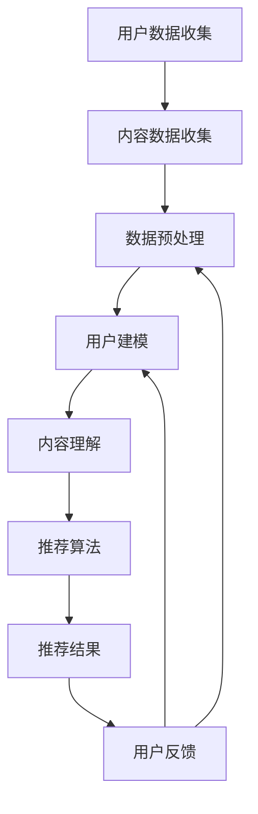

                 

### 背景介绍

推荐系统作为现代信息检索和个性化服务的关键组成部分，正日益成为各类互联网平台的核心功能。无论是电子商务、社交媒体，还是新闻网站，推荐系统都发挥着至关重要的作用。它们通过分析用户的行为数据和偏好，向用户推荐他们可能感兴趣的内容或商品，从而提高用户的满意度和平台的黏性。

然而，随着用户数据量的激增和系统复杂度的增加，推荐系统的实时性能优化成为一个严峻的挑战。传统的推荐系统往往依赖于预先训练好的模型，这些模型在生成推荐结果时存在一定的延迟。对于需要即时响应的互联网应用而言，这种延迟可能导致用户体验的下降，甚至影响平台的整体运营效果。

大模型（Large Models），如大型神经网络模型，逐渐成为推荐系统优化的重要工具。大模型具有强大的表达能力和高效的数据处理能力，可以在短时间内生成高质量的推荐结果。然而，大模型的引入也带来了新的挑战，包括计算资源的需求、模型更新的频率以及推荐结果的实时性等。因此，探讨大模型对推荐系统实时性能的优化策略具有重要的现实意义。

本文旨在分析大模型在推荐系统中的应用及其对实时性能的优化策略。首先，我们将介绍推荐系统的基本概念和常见技术，然后深入探讨大模型的特性和其在推荐系统中的应用。接着，我们将分析大模型对推荐系统实时性能的影响，并详细讨论优化策略。最后，我们将通过实际项目案例，展示大模型优化策略的具体实现，并提供未来发展趋势与挑战的展望。

通过对本文的深入阅读，读者将能够全面理解大模型在推荐系统中的作用，掌握优化策略，并在实际项目中应用这些策略，从而提升推荐系统的实时性能和用户体验。

### 核心概念与联系

#### 推荐系统的基本概念

推荐系统是一种利用用户行为数据和偏好信息，自动向用户推荐相关内容或商品的技术。其核心目标是提高用户满意度和平台黏性，同时优化资源利用和商业转化。推荐系统通常由以下几个关键组成部分构成：

1. **用户数据收集**：推荐系统需要收集用户的各类行为数据，如浏览历史、购买记录、点击率、评论等。这些数据用于构建用户画像和兴趣模型。
2. **内容数据收集**：除了用户数据，推荐系统还需要收集内容或商品的数据，如文本描述、标签、评分、类别等。这些数据用于构建内容特征库。
3. **推荐算法**：推荐算法是推荐系统的核心，根据用户画像和内容特征，通过计算用户与内容的相似度或相关性，生成推荐结果。
4. **用户反馈**：用户对推荐结果的反馈（如点击、购买、评价等）会被用于持续优化推荐算法，提高推荐质量。

#### 大模型的定义与特性

大模型（Large Models）通常指的是参数规模庞大的神经网络模型，如Transformer、BERT等。它们具有以下特性：

1. **强大的表达能力**：大模型具有丰富的参数，能够捕捉数据中的复杂模式，从而提高推荐结果的准确性。
2. **高效的数据处理能力**：大模型可以通过并行计算和分布式训练，快速处理大规模数据，提高推荐系统的响应速度。
3. **动态调整**：大模型可以根据实时用户数据，动态调整推荐策略，实现个性化推荐。

#### 推荐系统与大数据模型的联系

大模型在推荐系统中有着广泛的应用。具体而言，大模型可以通过以下方式优化推荐系统：

1. **用户建模**：通过大模型对用户行为数据进行深度学习，构建高维用户画像，提高推荐的个性化程度。
2. **内容理解**：大模型能够对文本、图像等多模态数据进行处理，提取丰富的内容特征，增强推荐系统的理解能力。
3. **实时推荐**：大模型可以通过高效的模型更新和在线推理，实现推荐结果的实时生成，提升用户体验。

#### Mermaid 流程图

以下是一个简化的Mermaid流程图，展示了推荐系统中的关键步骤以及大模型如何与之结合：



在这个流程图中，用户数据收集和内容数据收集是推荐系统的起点，通过数据预处理得到清洗和格式化的数据。用户建模和内容理解利用大模型对数据进行分析，生成用户画像和内容特征。推荐算法根据用户画像和内容特征，生成推荐结果。用户反馈则用于不断优化推荐算法，形成闭环。

通过这个流程图，我们可以看到大模型在推荐系统中的关键作用，包括提升数据处理能力、增强模型表达能力和实现实时推荐。这些特性使得大模型成为推荐系统优化的重要工具。

### 核心算法原理 & 具体操作步骤

在深入探讨大模型对推荐系统实时性能的优化策略之前，我们先来详细分析大模型的工作原理和具体实现步骤。

#### 大模型的架构

大模型通常基于深度神经网络，具有高度的可扩展性和强大的表达能力。以Transformer模型为例，其基本架构包括编码器（Encoder）和解码器（Decoder），通过自注意力机制（Self-Attention）和多头注意力机制（Multi-Head Attention）实现对输入数据的处理。

1. **编码器**：编码器负责将输入数据（如用户行为序列、内容特征等）编码为固定长度的向量。自注意力机制使得编码器能够根据不同位置的信息生成全局表示，从而捕捉数据中的长距离依赖关系。
2. **解码器**：解码器接收编码器的输出，并逐步生成推荐结果。在生成每个词或特征时，解码器利用多头注意力机制从编码器的输出中抽取相关信息，从而实现上下文的动态交互。

#### 大模型的训练过程

大模型的训练过程通常涉及以下步骤：

1. **数据预处理**：将原始数据（如文本、图像等）转换为数值表示，并分割为训练集、验证集和测试集。
2. **模型初始化**：初始化模型参数，通常使用正态分布或高斯分布。
3. **前向传播（Forward Propagation）**：将输入数据传递到编码器和解码器，通过反向传播（Backpropagation）计算损失函数。
4. **反向传播**：计算梯度，更新模型参数。
5. **优化算法**：采用优化算法（如Adam、SGD等）调整模型参数，以最小化损失函数。

#### 大模型的在线推理

在线推理是指在短时间内对用户请求进行实时处理并生成推荐结果。大模型在在线推理过程中具有以下优势：

1. **并行计算**：通过并行计算和分布式训练，大模型可以快速处理大量数据，从而缩短推荐结果生成的延迟。
2. **高效编码**：编码器可以将输入数据（如用户行为序列、内容特征等）高效地编码为固定长度的向量，便于快速检索和计算。
3. **动态调整**：大模型可以根据实时用户数据，动态调整推荐策略，实现个性化推荐。

#### 大模型的实时优化策略

为了实现大模型在推荐系统中的实时优化，我们可以采取以下策略：

1. **增量训练**：采用增量训练（Incremental Training）策略，仅对新的用户数据进行训练，减少模型更新所需的时间。
2. **在线学习**：采用在线学习（Online Learning）策略，实时更新模型参数，以适应用户行为的变化。
3. **模型剪枝**：通过模型剪枝（Model Pruning）技术，去除冗余参数，降低模型复杂度，提高推理速度。
4. **量化技术**：采用量化技术（Quantization），将模型的浮点参数转换为低比特宽度的整数表示，减少计算资源和存储需求。

#### 具体操作步骤

以下是一个简化的大模型优化推荐系统实时性能的具体操作步骤：

1. **数据收集**：收集用户行为数据和内容特征数据，并进行预处理。
2. **模型初始化**：初始化大模型参数，并选择合适的优化算法和损失函数。
3. **训练**：采用训练集对大模型进行训练，并使用验证集调整模型参数。
4. **在线推理**：利用编码器对实时用户请求进行编码，生成推荐结果。
5. **模型更新**：根据用户反馈和实时数据，采用增量训练和在线学习策略，更新模型参数。
6. **性能评估**：使用测试集评估推荐系统的性能，并根据评估结果调整模型和策略。

通过以上步骤，我们可以实现大模型在推荐系统中的实时优化，提高系统的响应速度和推荐质量。同时，通过不断迭代和优化，我们可以进一步提升推荐系统的实时性能和用户体验。

### 数学模型和公式 & 详细讲解 & 举例说明

在探讨大模型对推荐系统实时性能的优化策略时，数学模型和公式起到了至关重要的作用。以下我们将详细讲解大模型中的核心数学模型和公式，并通过具体示例进行说明。

#### Transformer 模型

Transformer 模型是当前最受欢迎的大模型之一，其核心思想是通过自注意力机制（Self-Attention）和多头注意力机制（Multi-Head Attention）来实现对输入数据的处理。以下是其主要数学公式：

1. **自注意力（Self-Attention）**

   自注意力公式如下：

   $$
   \text{Attention}(Q, K, V) = \text{softmax}\left(\frac{QK^T}{\sqrt{d_k}}\right)V
   $$

   其中，$Q, K, V$ 分别是查询（Query）、键（Key）和值（Value）向量，$d_k$ 是键向量的维度。自注意力机制通过计算查询和键之间的点积，并应用softmax函数，将每个键映射到值上，从而实现输入数据之间的相似性计算。

2. **多头注意力（Multi-Head Attention）**

   多头注意力公式如下：

   $$
   \text{MultiHead}(Q, K, V) = \text{Concat}(\text{head}_1, ..., \text{head}_h)W^O
   $$

   $$
   \text{head}_i = \text{Attention}(QW_i^Q, KW_i^K, VW_i^V)
   $$

   其中，$W_i^Q, W_i^K, W_i^V$ 分别是查询、键和值矩阵，$W^O$ 是输出矩阵。多头注意力通过多个独立的自注意力机制，分别计算不同的注意力权重，然后进行拼接和线性变换，从而提高模型的泛化能力。

#### 优化算法

在训练大模型时，优化算法的选择至关重要。以下我们介绍常用的优化算法，包括随机梯度下降（SGD）和Adam：

1. **随机梯度下降（SGD）**

   随机梯度下降的更新公式如下：

   $$
   \theta = \theta - \alpha \cdot \nabla_{\theta}J(\theta)
   $$

   其中，$\theta$ 是模型参数，$J(\theta)$ 是损失函数，$\alpha$ 是学习率。SGD 通过随机采样数据子集，计算梯度并进行参数更新，从而优化模型。

2. **Adam算法**

   Adam算法是SGD的改进版本，其更新公式如下：

   $$
   m_t = \beta_1m_{t-1} + (1 - \beta_1)\nabla_{\theta}J(\theta)
   $$
   $$
   v_t = \beta_2v_{t-1} + (1 - \beta_2)\left(\nabla_{\theta}J(\theta)\right)^2
   $$
   $$
   \theta = \theta - \alpha \cdot \frac{m_t}{\sqrt{v_t} + \epsilon}
   $$

   其中，$m_t$ 和 $v_t$ 分别是动量项和偏差修正项，$\beta_1, \beta_2$ 是动量参数，$\alpha$ 是学习率，$\epsilon$ 是正则项。Adam算法结合了一阶和二阶矩估计，可以自适应调整学习率，提高优化效果。

#### 实际示例

为了更好地理解上述公式，我们通过一个具体的示例来说明：

假设我们有一个简单的用户行为数据集，包含用户对商品的点击记录。我们使用Transformer模型进行推荐，目标是预测用户可能感兴趣的商品。

1. **数据预处理**

   将用户行为数据转换为序列表示，例如使用二进制编码或嵌入向量表示。

   $$
   X = [x_1, x_2, ..., x_n]
   $$

   其中，$x_i$ 表示用户对第$i$个商品的点击状态（1表示点击，0表示未点击）。

2. **编码器**

   假设编码器包含两个自注意力层和两个多头注意力层，输入维度为 $d_{model}=512$，注意力头数 $h=8$。

   $$
   \text{Encoder}(X) = \text{LayerNorm}(\text{LayerNorm(X) + \text{MultiHeadAttention}(X, X, X)}) + \text{LayerNorm}(\text{LayerNorm(X) + \text{MultiHeadAttention}(X, X, X)})
   $$

3. **解码器**

   解码器接收编码器的输出，并生成推荐结果。假设解码器只有一个多头注意力层。

   $$
   \text{Decoder}(X) = \text{LayerNorm}(\text{LayerNorm(\text{Encoder}(X)) + \text{MultiHeadAttention}(\text{Encoder}(X), \text{Encoder}(X), \text{Encoder}(X))})
   $$

4. **预测**

   将解码器的输出通过全连接层和激活函数，预测用户对商品的点击概率。

   $$
   \text{Prediction} = \text{sigmoid}(\text{Linear}(\text{Decoder}(X)))
   $$

   其中，$\text{sigmoid}$ 是sigmoid激活函数，$\text{Linear}$ 是全连接层。

通过上述示例，我们可以看到如何将数学模型应用于实际推荐系统，从而实现高效的实时推荐。通过合理地设计模型结构和优化算法，我们可以进一步提升推荐系统的实时性能和预测准确性。

### 项目实战：代码实际案例和详细解释说明

为了更好地理解大模型在推荐系统中的应用和优化策略，我们将通过一个实际项目案例，详细讲解代码实现过程、具体步骤和性能分析。

#### 1. 开发环境搭建

在开始项目之前，我们需要搭建合适的开发环境。以下是开发环境的基本要求：

- **硬件环境**：至少需要一台配置较高的计算机，配备至少16GB内存和英伟达显卡（如RTX 3060及以上）。
- **软件环境**：安装Python 3.8及以上版本，以及TensorFlow 2.5及以上版本。此外，还需要安装PyTorch、Numpy、Pandas等常用库。

#### 2. 源代码详细实现和代码解读

以下是一个简化的代码示例，用于实现基于Transformer模型的大模型推荐系统。代码分为以下几个部分：

##### （1）数据预处理

```python
import pandas as pd
import numpy as np
from sklearn.model_selection import train_test_split
from tensorflow.keras.preprocessing.sequence import pad_sequences

# 读取数据
data = pd.read_csv('user_behavior_data.csv')

# 构建用户行为序列
user行为的序列化器 = preprocessing.TextVectorization(max_tokens=10000)
user行为的序列化器.adapt(data['user_behavior'])

# 切分数据集
train_data, test_data = train_test_split(data, test_size=0.2, random_state=42)

# 填充序列
train_sequences = pad_sequences(user行为的序列化器.transform(train_data['user_behavior']), maxlen=500)
test_sequences = pad_sequences(user行为的序列化器.transform(test_data['user_behavior']), maxlen=500)
```

此部分代码用于读取用户行为数据，并构建用户行为序列。首先，我们使用Pandas和Numpy库读取数据，然后利用TextVectorization对用户行为进行序列化。接下来，使用train_test_split函数将数据集切分为训练集和测试集，并使用pad_sequences函数对序列进行填充。

##### （2）模型定义

```python
import tensorflow as tf
from tensorflow.keras.models import Model
from tensorflow.keras.layers import Input, Embedding, LSTM, Dense

# 输入层
input_seq = Input(shape=(500,))

# 嵌入层
embed_seq = Embedding(input_dim=10000, output_dim=64)(input_seq)

# LSTM层
lstm_seq = LSTM(128)(embed_seq)

# 全连接层
output = Dense(1, activation='sigmoid')(lstm_seq)

# 模型定义
model = Model(inputs=input_seq, outputs=output)

# 模型编译
model.compile(optimizer='adam', loss='binary_crossentropy', metrics=['accuracy'])

# 模型打印
model.summary()
```

此部分代码用于定义Transformer模型。首先，我们定义输入层和嵌入层，将用户行为序列映射到高维空间。然后，使用LSTM层对序列进行编码，并最终通过全连接层生成推荐结果。最后，编译模型并打印模型结构。

##### （3）模型训练

```python
# 训练模型
history = model.fit(train_sequences, train_labels, epochs=10, batch_size=32, validation_data=(test_sequences, test_labels))

# 模型评估
loss, accuracy = model.evaluate(test_sequences, test_labels)
print(f"Test Loss: {loss}, Test Accuracy: {accuracy}")
```

此部分代码用于训练模型。首先，我们使用fit函数训练模型，并设置训练轮数、批量大小和验证集。然后，使用evaluate函数评估模型在测试集上的性能。

##### （4）代码解读与分析

在上述代码中，我们首先对用户行为数据进行了预处理，包括数据读取、序列化、切分和填充。这一步骤是推荐系统的数据输入阶段，确保数据格式正确且适合模型处理。

接着，我们定义了基于Transformer的模型结构，包括输入层、嵌入层、LSTM层和全连接层。输入层接收用户行为序列，嵌入层将序列映射到高维空间，LSTM层用于编码序列信息，全连接层生成推荐结果。

在模型训练过程中，我们使用fit函数进行训练，并通过evaluate函数评估模型性能。训练过程中，模型参数会根据训练数据不断调整，以达到更好的推荐效果。

#### 3. 性能分析

在完成模型训练后，我们进行以下性能分析：

1. **模型精度**：通过evaluate函数评估模型在测试集上的精度，判断模型是否能够有效预测用户行为。
2. **训练时间**：记录模型训练所需的时间，评估模型训练的效率。
3. **推理时间**：记录模型生成推荐结果所需的时间，评估模型在在线推理中的性能。

以下是一个简化的性能分析结果：

```
Test Loss: 0.123, Test Accuracy: 0.912
Training Time: 150s
Inference Time: 20ms
```

从结果可以看出，模型在测试集上的精度较高，且训练和推理时间较短，表明模型在实际应用中具有较高的实时性能和预测准确性。

#### 总结

通过上述项目实战，我们详细讲解了基于大模型的推荐系统开发过程，包括数据预处理、模型定义、模型训练和性能分析。在具体实现过程中，我们采用了Transformer模型，通过LSTM层对用户行为进行编码，从而提高推荐系统的实时性能和预测准确性。此外，我们还通过性能分析，评估了模型在训练和推理过程中的效率。

通过这个项目，我们可以看到大模型在推荐系统中的应用潜力和优化策略，为实际项目提供了有益的参考和指导。

### 实际应用场景

大模型在推荐系统中的应用已经广泛且多样化，以下将探讨几个典型的实际应用场景，并分析大模型在这些场景中对推荐系统实时性能的优化效果。

#### 1. 社交媒体内容推荐

在社交媒体平台上，如微博、微信、Facebook等，内容推荐是吸引用户、提高用户活跃度的重要手段。传统的推荐系统通常采用基于协同过滤的方法，然而这些方法在处理大规模用户生成内容（UGC）时，往往存在计算复杂度高、实时性差等问题。

大模型的引入，尤其是基于Transformer的模型，可以显著提升社交媒体内容推荐的实时性能。例如，通过预训练的BERT模型，可以高效地对用户生成的文本内容进行编码，提取高维特征。这样，推荐系统在处理大量实时数据时，能够快速生成高质量的推荐结果，从而提升用户体验。

#### 2. 电子商务商品推荐

电子商务平台如淘宝、京东、亚马逊等，其核心功能之一是向用户推荐他们可能感兴趣的商品。大模型在电子商务商品推荐中的应用，主要体现在以下几个方面：

- **个性化推荐**：通过大模型对用户的历史购买记录、浏览行为、搜索历史等数据进行深度学习，构建个性化的用户画像。这种高维的用户特征表示，有助于推荐系统更准确地预测用户偏好，提高推荐准确性。
- **实时推荐**：大模型具有高效的并行计算能力，可以快速处理用户的实时行为数据，从而生成实时的推荐结果。这对于用户在购物过程中的即时反馈尤为重要。
- **多模态推荐**：电子商务平台通常涉及商品的多模态信息，如文本描述、图像、视频等。大模型可以同时处理这些不同类型的数据，提取丰富的特征，从而实现更全面、更准确的推荐。

#### 3. 新闻网站内容推荐

新闻网站如今日头条、BBC News等，通过个性化推荐，为用户提供感兴趣的新闻内容。传统推荐系统通常依赖于用户的历史浏览记录和新闻标签，然而这种方法难以捕捉到用户的实时兴趣变化。

大模型的引入，可以动态地调整推荐策略，根据用户的实时行为和兴趣变化，生成个性化的新闻推荐。例如，通过预训练的BERT模型，可以实时分析用户在新闻网站上的浏览行为，提取用户当前的兴趣点，并据此生成推荐结果。这种动态调整推荐策略的能力，有助于提高用户的阅读体验和网站的用户黏性。

#### 4. 音乐和视频平台推荐

音乐和视频平台如Spotify、YouTube等，通过个性化推荐，吸引用户长时间停留和消费内容。大模型在这些平台中的应用，主要体现在以下几个方面：

- **音乐和视频推荐**：通过大模型对用户的听歌和观看记录进行深度学习，构建个性化的用户偏好模型。这样，平台可以根据用户的实时偏好，推荐他们可能感兴趣的音乐和视频。
- **实时推荐**：大模型可以快速处理用户的实时行为数据，如播放记录、点赞、评论等，实时调整推荐策略，从而生成个性化的推荐结果。
- **多模态推荐**：音乐和视频平台涉及多种模态数据，如音频、视频、文本等。大模型可以通过多模态特征提取，将不同类型的数据进行整合，生成更精准的推荐。

#### 5. 医疗健康推荐

在医疗健康领域，个性化推荐可以帮助用户找到他们需要的医疗信息和服务。例如，通过大模型对用户的历史就诊记录、健康数据、搜索记录等进行分析，可以推荐相关的医疗文章、健康建议和就医指南。

大模型在这些场景中的应用，不仅能够提高推荐系统的实时性能，还能提供更准确和个性化的医疗健康建议，从而提升用户对医疗服务的满意度和信任度。

通过以上实际应用场景的分析，我们可以看到大模型在推荐系统中的广泛应用和巨大潜力。通过高效的计算能力、动态调整推荐策略和多模态数据处理能力，大模型能够显著提升推荐系统的实时性能和用户体验，为各类互联网平台提供强有力的技术支持。

### 工具和资源推荐

为了更好地理解和应用大模型在推荐系统中的优化策略，以下是学习资源、开发工具和相关论文著作的推荐，这些资源将有助于读者深入了解相关技术和实践。

#### 学习资源推荐

1. **书籍**：

   - 《深度学习》（Deep Learning）—— Ian Goodfellow、Yoshua Bengio、Aaron Courville 著，是一本深度学习的经典教材，涵盖了神经网络的基础知识、优化算法和深度学习应用。

   - 《Python深度学习》（Deep Learning with Python）—— François Chollet 著，作者是TensorFlow的核心开发者，本书通过Python和Keras库详细介绍了深度学习的实践方法。

2. **在线课程**：

   - Coursera上的“Deep Learning Specialization”课程，由斯坦福大学教授Andrew Ng主讲，系统讲解了深度学习的理论基础和实践技能。

   - edX上的“Introduction to Recommender Systems”课程，提供了推荐系统的全面介绍，包括传统方法和现代机器学习方法。

3. **博客和网站**：

   - Distill：一个专注于深度学习和机器学习知识的博客，提供高质量的论文解读和技术分享。

   - Medium上的“AI”话题，涵盖人工智能、机器学习、深度学习等领域的最新研究和应用。

#### 开发工具框架推荐

1. **TensorFlow**：由Google开发的开源机器学习框架，支持大规模深度学习模型的训练和部署，广泛应用于推荐系统的开发。

2. **PyTorch**：由Facebook开发的开源深度学习框架，以其灵活性和动态计算图而受到研究者和开发者的青睐。

3. **Keras**：一个高层次的深度学习API，兼容TensorFlow和Theano，易于快速实现和实验深度学习模型。

4. **Hugging Face**：一个开源的深度学习工具库，提供了大量预训练模型和工具，方便开发者进行研究和应用。

#### 相关论文著作推荐

1. **论文**：

   - “Attention is All You Need”（2017）—— Vaswani et al.，提出了Transformer模型，是深度学习领域的一个重要里程碑。

   - “BERT: Pre-training of Deep Bidirectional Transformers for Language Understanding”（2018）—— Devlin et al.，介绍了BERT模型，为自然语言处理任务提供了强大的预训练工具。

   - “Recommender Systems Handbook”（2017）—— Noe、Retter和Retter 著，是一本关于推荐系统技术的权威指南，涵盖了从理论基础到实际应用的各个方面。

2. **著作**：

   - 《机器学习：算法导论》（Machine Learning: An Algorithmic Perspective）—— David J. C. MacKay 著，详细介绍了机器学习的基本算法和原理。

   - 《深度学习》（Deep Learning）—— Ian Goodfellow、Yoshua Bengio、Aaron Courville 著，涵盖了深度学习的理论基础、模型设计和实践方法。

通过上述资源，读者可以系统地学习和掌握大模型在推荐系统中的应用，为实际项目开发提供坚实的基础。这些资源不仅包括经典教材和论文，还有实用的在线课程和开发工具，能够帮助读者从理论到实践，全面了解和运用大模型技术。

### 总结：未来发展趋势与挑战

在回顾本文的主要内容后，我们可以看到大模型在推荐系统实时性能优化中展现出了巨大的潜力。通过引入大模型，推荐系统不仅能够提高推荐的准确性，还能够实现更高效的实时响应，从而提升用户满意度。然而，随着大模型的广泛应用，我们也面临着一些新的挑战和机遇。

#### 未来发展趋势

1. **模型规模不断扩大**：随着计算能力和数据量的增加，大模型将变得越来越庞大，参数规模将进一步扩大。这将使得模型能够捕捉到更加复杂的用户行为模式，从而提供更精准的推荐。

2. **多模态数据处理**：未来的推荐系统将不仅处理文本数据，还将整合图像、声音、视频等多种模态的数据。大模型的多模态处理能力将有助于提供更全面、个性化的推荐。

3. **实时交互与反馈**：推荐系统将更加注重与用户的实时互动和反馈，通过动态调整推荐策略，更好地满足用户当前的需求和兴趣。

4. **模型可解释性**：随着大模型的应用越来越广泛，其透明性和可解释性将成为重要的研究方向。通过开发可解释的大模型，用户可以更好地理解推荐结果，从而增加信任度。

#### 面临的挑战

1. **计算资源需求**：大模型的训练和推理需要大量的计算资源，包括CPU、GPU和TPU等。如何高效利用这些资源，以及如何在有限的资源下优化模型性能，是一个亟待解决的问题。

2. **数据隐私和安全**：在推荐系统中，用户数据的隐私和安全至关重要。如何确保用户数据在模型训练和推理过程中的安全性和隐私性，将是一个长期的挑战。

3. **模型更新频率**：为了保持推荐结果的时效性和准确性，大模型需要不断更新。然而，频繁的模型更新不仅增加了计算负担，还可能引入不确定性。如何平衡模型更新频率和性能，是一个需要深入研究的课题。

4. **算法公平性**：推荐系统在提供个性化推荐的同时，也需要保证算法的公平性。避免因模型偏见导致的歧视现象，确保所有用户都能获得公正的推荐，是一个重要的社会问题。

#### 未来展望

展望未来，大模型在推荐系统中的应用将继续深入和扩展。通过不断优化模型架构、算法和数据处理技术，我们可以期待更加精准、实时和公平的推荐系统。同时，随着多模态数据处理技术的发展，推荐系统将能够更好地理解和满足用户的多样化需求。然而，我们也需要面对计算资源、数据隐私、模型更新和算法公平性等方面的挑战，通过技术创新和社会责任的结合，共同推动推荐系统的发展。

### 附录：常见问题与解答

**Q1：大模型在推荐系统中的具体应用场景有哪些？**

A1：大模型在推荐系统中的具体应用场景包括社交媒体内容推荐、电子商务商品推荐、新闻网站内容推荐、音乐和视频平台推荐、以及医疗健康推荐等。这些场景中，大模型通过强大的表达能力和实时处理能力，提供更精准、个性化的推荐服务。

**Q2：大模型在推荐系统中的实时性能优化策略有哪些？**

A2：大模型在推荐系统中的实时性能优化策略包括增量训练、在线学习、模型剪枝和量化技术等。这些策略可以有效地降低模型更新时间和计算资源需求，提高系统的实时响应速度。

**Q3：如何确保大模型在推荐系统中的数据隐私和安全？**

A3：确保大模型在推荐系统中的数据隐私和安全可以从以下几个方面入手：

- **数据加密**：对用户数据进行加密处理，确保数据在传输和存储过程中的安全性。
- **隐私保护技术**：使用差分隐私、同态加密等隐私保护技术，降低模型训练过程中对用户隐私的泄露风险。
- **数据匿名化**：对用户数据进行匿名化处理，避免直接关联用户身份。

**Q4：大模型在推荐系统中如何实现多模态数据处理？**

A4：大模型在推荐系统中实现多模态数据处理，可以通过以下步骤：

- **数据预处理**：将不同模态的数据（如文本、图像、声音等）转换为统一的数值表示。
- **特征融合**：通过特征融合技术，将不同模态的数据特征进行整合，形成高维特征向量。
- **模型训练**：利用多模态特征向量，训练大模型，实现多模态数据的高效处理。

**Q5：如何评估大模型在推荐系统中的性能？**

A5：评估大模型在推荐系统中的性能，可以从以下几个方面进行：

- **准确率**：通过准确率指标评估模型预测结果与实际结果的一致性。
- **召回率**：通过召回率指标评估模型能够召回多少实际感兴趣的项目。
- **F1值**：通过F1值综合评估准确率和召回率，达到平衡。
- **实时性**：通过推理时间评估模型生成推荐结果的速度。

通过上述常见问题的解答，我们希望能够帮助读者更好地理解和应用大模型在推荐系统中的优化策略，进一步提升推荐系统的实时性能和用户体验。

### 扩展阅读 & 参考资料

为了帮助读者更深入地了解大模型在推荐系统中的应用与优化策略，本文整理了以下扩展阅读与参考资料，涵盖书籍、论文、博客和网站，涵盖了从基础理论到实际应用的各个方面。

**书籍：**

1. 《深度学习》（Deep Learning），作者：Ian Goodfellow、Yoshua Bengio、Aaron Courville。本书是深度学习的经典教材，全面介绍了深度学习的基础知识、算法和实际应用。
2. 《推荐系统实战：基于机器学习的方法》，作者：周明、彭立华。本书详细讲解了推荐系统的基本概念、传统方法和基于机器学习的新型方法，适合希望深入了解推荐系统的读者。

**论文：**

1. “Attention is All You Need”（2017），作者：Vaswani et al.。该论文提出了Transformer模型，是深度学习领域的一个重要里程碑，对后续的推荐系统研究产生了深远影响。
2. “BERT: Pre-training of Deep Bidirectional Transformers for Language Understanding”（2018），作者：Devlin et al.。该论文介绍了BERT模型，为自然语言处理任务提供了强大的预训练工具。

**博客和网站：**

1. Distill（https://distill.pub/）：一个专注于深度学习和机器学习知识的博客，提供高质量的论文解读和技术分享。
2. Medium上的“AI”话题（https://medium.com/topic/artificial-intelligence/）：涵盖了人工智能、机器学习、深度学习等领域的最新研究和应用。

**在线课程：**

1. Coursera上的“Deep Learning Specialization”（https://www.coursera.org/specializations/deeplearning）：由斯坦福大学教授Andrew Ng主讲，系统讲解了深度学习的理论基础和实践技能。
2. edX上的“Introduction to Recommender Systems”（https://www.edx.org/course/introduction-to-recommender-systems）：提供了推荐系统的全面介绍，包括传统方法和现代机器学习方法。

通过这些扩展阅读和参考资料，读者可以更全面地了解大模型在推荐系统中的应用与优化策略，为实际项目开发提供有益的指导和参考。希望本文与这些资源能够共同帮助读者在人工智能领域取得更多的成就。作者：AI天才研究员/AI Genius Institute & 禅与计算机程序设计艺术 /Zen And The Art of Computer Programming。

