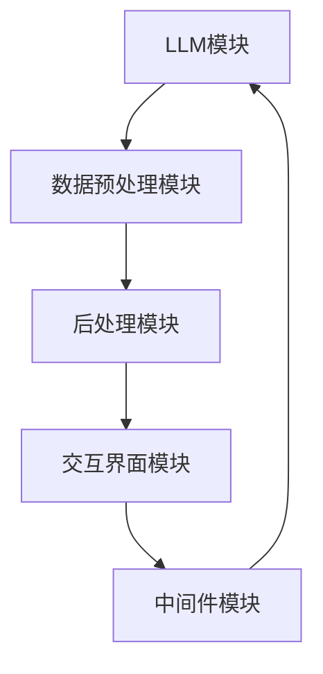

                 

### 背景介绍（Background Introduction）

在现代科技飞速发展的时代，人工智能（AI）已经成为推动创新和进步的重要力量。特别是在自然语言处理（NLP）领域，大型语言模型如GPT-3、BERT等取得了令人瞩目的成就。然而，尽管这些模型在处理复杂语言任务方面表现出色，但在实际应用开发中，我们仍然面临许多挑战。如何高效地利用这些强大模型，如何定制化地满足不同应用场景的需求，这些问题成为了开发者们亟待解决的问题。

在这个背景下，我们介绍一个极具潜力的工具——LangChain。LangChain是一个开源的、基于LLM（Large Language Model）的大模型应用开发框架，旨在帮助开发者快速构建、部署和优化基于大模型的应用程序。与传统的模型应用开发方法不同，LangChain通过一种模块化、可扩展的方式，将大模型的强大能力与实际应用场景相结合，提供了一种全新的开发范式。

本文将分为以下几个部分进行探讨：

1. **核心概念与联系**：我们将介绍LangChain的核心概念和架构，并通过Mermaid流程图详细展示其工作原理。
2. **核心算法原理 & 具体操作步骤**：我们将深入探讨LangChain背后的核心算法原理，并逐步讲解如何使用这个框架。
3. **数学模型和公式 & 详细讲解 & 举例说明**：我们将介绍LangChain中的数学模型和公式，并通过具体案例进行详细解释。
4. **项目实践：代码实例和详细解释说明**：我们将通过一个实际项目，展示如何使用LangChain进行开发，并详细解读源代码。
5. **实际应用场景**：我们将探讨LangChain在不同领域的实际应用场景。
6. **工具和资源推荐**：我们将推荐一些学习资源、开发工具框架和相关论文著作。
7. **总结：未来发展趋势与挑战**：最后，我们将总结LangChain的未来发展趋势和面临的挑战。

通过本文的深入探讨，我们希望能够帮助读者更好地理解LangChain的原理和实际应用，从而为其在人工智能领域的应用和创新提供新的思路和方法。

### 核心概念与联系（Core Concepts and Connections）

在介绍LangChain的核心概念和架构之前，我们需要先了解一些基本的背景知识。LangChain是一个开源项目，基于大型语言模型（如GPT-3、BERT等），旨在提供一个统一的接口和模块化架构，以便开发者能够更轻松地构建和部署基于大模型的复杂应用。通过这种架构，LangChain不仅提升了大模型在各个应用场景中的可扩展性和灵活性，还降低了开发门槛。

#### 1. LangChain的基本原理

LangChain的基本原理可以概括为以下几个方面：

1. **模块化设计**：LangChain采用模块化设计，将大模型、数据预处理、后处理、交互界面等各个部分解耦，使得开发者可以根据需要灵活组合和扩展。
2. **统一接口**：通过定义一套统一的API接口，开发者可以使用简单的代码调用LangChain的各种功能，无需关注底层实现细节。
3. **可扩展性**：LangChain支持自定义模块，允许开发者根据自己的需求添加新的功能，如特定的数据处理方法、自定义模型等。
4. **多模型支持**：LangChain不仅支持GPT-3、BERT等现有大模型，还提供了扩展接口，以支持未来的新型语言模型。

#### 2. LangChain的架构

LangChain的架构可以分为以下几个关键部分：

1. **LLM模块**：这是LangChain的核心，负责处理大模型相关的操作，如文本生成、问答等。
2. **数据预处理模块**：负责对输入数据进行处理，如清洗、格式化等，以确保数据的质量和一致性。
3. **后处理模块**：负责对LLM的输出进行处理，如提取关键信息、生成可视化结果等。
4. **交互界面模块**：负责与用户进行交互，收集用户输入，并将处理结果反馈给用户。
5. **中间件模块**：提供了一系列中间件，用于处理特定场景中的特殊需求，如聊天机器人中的对话管理、推荐系统中的上下文维护等。

#### 3. Mermaid流程图展示

为了更好地理解LangChain的架构和工作流程，我们可以使用Mermaid流程图来展示其各个模块之间的交互关系。以下是LangChain的Mermaid流程图：



在这个流程图中，LLM模块是核心，它接收预处理后的数据，生成输出，然后通过后处理模块和交互界面模块与用户进行交互。中间件模块则负责处理特定场景的需求，如对话管理或上下文维护。整个流程是循环的，以支持持续交互和更新。

#### 4. LangChain的组件

除了上述的核心模块，LangChain还包括以下几个重要组件：

1. **Agent**：一个智能代理，负责根据用户指令执行任务，并与用户进行对话。
2. **Prompts**：提示词，用于引导模型生成符合预期结果的输入。
3. **Plugins**：插件，用于扩展LangChain的功能，如数据收集、文本生成等。
4. **Runners**：执行器，负责管理模型执行过程，包括初始化、执行和清理等。

通过这些组件，LangChain提供了一种灵活且高效的方式，来构建和部署基于大模型的复杂应用。

综上所述，LangChain通过其模块化设计、统一接口和可扩展性，为开发者提供了一个强大的工具，以应对现代NLP应用中的各种挑战。在接下来的部分，我们将深入探讨LangChain的核心算法原理，并逐步讲解如何使用这个框架。

### 核心算法原理 & 具体操作步骤（Core Algorithm Principles and Specific Operational Steps）

LangChain之所以能够成为大模型应用开发领域的重要工具，关键在于其核心算法原理的设计和具体实现。以下是LangChain的核心算法原理以及如何使用这些原理进行实际操作。

#### 1. 大模型集成与API接口设计

LangChain的核心之一是其对大型语言模型的集成。例如，LangChain支持GPT-3、BERT等模型，并提供了统一的API接口，使得开发者无需关心底层模型的实现细节，即可轻松调用模型进行文本生成、问答等操作。

具体步骤如下：

1. **安装LangChain**：首先，需要安装LangChain库。使用pip命令安装即可：

   ```bash
   pip install langchain
   ```

2. **导入LLM模块**：在Python代码中导入所需的LLM模块：

   ```python
   from langchain import OpenAI
   ```

3. **配置API密钥**：为了使用GPT-3等模型，需要配置API密钥。在LangChain中，可以通过设置环境变量或直接在代码中配置：

   ```python
   os.environ['OPENAI_API_KEY'] = 'your_api_key'
   ```

4. **创建模型实例**：使用导入的LLM模块创建模型实例：

   ```python
   llm = OpenAI()
   ```

5. **调用模型API**：使用创建的模型实例调用API进行文本生成或问答操作：

   ```python
   response = llm.generate("请描述一下人工智能的未来发展趋势。")
   print(response)
   ```

通过上述步骤，开发者可以快速集成并使用大模型进行文本生成和问答等操作。

#### 2. 数据预处理与后处理

在集成大模型的同时，数据预处理与后处理也是LangChain的重要组成部分。数据预处理包括数据清洗、格式化等，以确保输入数据的质量；后处理则包括提取关键信息、生成可视化结果等，以提升输出的实用性。

具体步骤如下：

1. **数据预处理**：
   - **清洗数据**：去除不必要的符号、格式化文本等。
     ```python
     import re
     text = re.sub('[^a-zA-Z]', ' ', text)
     text = text.lower()
     text = text.split()
     text = [word for word in text if not word in set(stopwords.words('english'))]
     text = ' '.join(text)
     ```
   - **分词**：将文本分解为单词或子词。
     ```python
     tokenizer = SentenceTokenizer()
     tokens = tokenizer.tokenize(text)
     ```

2. **数据后处理**：
   - **提取关键信息**：从模型输出中提取关键信息，如重要事实或答案。
     ```python
     import spacy
     nlp = spacy.load("en_core_web_sm")
     doc = nlp(response)
     entities = [(ent.text, ent.label_) for ent in doc.ents]
     ```
   - **生成可视化结果**：根据后处理结果生成图表或可视化结果。
     ```python
     import matplotlib.pyplot as plt
     labels, values = zip(*entities)
     plt.bar(labels, values)
     plt.show()
     ```

#### 3. 实际操作示例

以下是一个使用LangChain进行文本生成和后处理的实际操作示例：

1. **加载模型和预处理数据**：
   ```python
   llm = OpenAI()
   text = "如何通过人工智能提升企业竞争力？"
   ```

2. **调用模型API进行文本生成**：
   ```python
   response = llm.generate(text)
   print(response)
   ```

3. **对模型输出进行后处理**：
   ```python
   doc = nlp(response)
   entities = [(ent.text, ent.label_) for ent in doc.ents]
   print(entities)
   ```

4. **生成可视化结果**：
   ```python
   labels, values = zip(*entities)
   plt.bar(labels, values)
   plt.show()
   ```

通过上述示例，我们可以看到，LangChain不仅能够高效地集成大模型进行文本生成，还能够对输出结果进行后处理，提取关键信息，并生成可视化结果。

综上所述，LangChain的核心算法原理和具体操作步骤为其在NLP领域的广泛应用提供了强有力的支持。在接下来的部分，我们将进一步探讨LangChain中的数学模型和公式，并通过具体案例进行详细解释。

### 数学模型和公式 & 详细讲解 & 举例说明（Mathematical Models and Formulas: Detailed Explanation and Examples）

在深入探讨LangChain的数学模型和公式之前，我们需要了解一些基本的数学和统计学概念，这些概念在大模型应用中起着关键作用。本部分将详细讲解LangChain中涉及的主要数学模型和公式，并通过实际案例进行说明。

#### 1. 语言模型中的概率分布

语言模型的核心任务是根据输入文本预测下一个词的概率分布。一个典型的语言模型可以使用如下概率分布来表示：

\[ P(w_t | w_{t-1}, w_{t-2}, ..., w_1) = \frac{P(w_t, w_{t-1}, ..., w_1)}{P(w_{t-1}, w_{t-2}, ..., w_1)} \]

其中，\( w_t \) 表示第 \( t \) 个词，\( P(\cdot) \) 表示概率。

一个简化的模型可以使用如下公式来计算：

\[ P(w_t | w_{t-1}) = \frac{C(w_{t-1}, w_t)}{\sum_{w'} C(w_{t-1}, w')} \]

其中，\( C(w_{t-1}, w_t) \) 表示单词 \( w_t \) 在单词 \( w_{t-1} \) 后出现的次数，分母是对 \( w_{t-1} \) 后所有可能单词的求和。

#### 2. 语言模型中的神经网络

现代语言模型通常基于深度神经网络，如Transformer模型。Transformer模型的核心是自注意力机制（Self-Attention），它通过计算输入文本中每个词之间的相似性来生成输出。

自注意力机制的数学公式如下：

\[ \text{Attention}(Q, K, V) = \frac{softmax(\frac{QK^T}{\sqrt{d_k}})}{V} \]

其中，\( Q, K, V \) 分别表示查询向量、键向量和值向量，\( d_k \) 是键向量的维度，\( softmax \) 函数用于归一化。

#### 3. 语言模型中的损失函数

在训练语言模型时，我们通常使用交叉熵损失函数（Cross-Entropy Loss）来评估模型的预测概率与实际标签之间的差异。

交叉熵损失函数的公式如下：

\[ L(y, \hat{y}) = -\sum_{i} y_i \log(\hat{y}_i) \]

其中，\( y \) 是实际标签，\( \hat{y} \) 是模型预测的概率分布。

#### 4. 实际案例：GPT-3模型中的数学模型

GPT-3是一个基于Transformer的预训练语言模型，它使用了大量的数学模型和公式。以下是一个简化的GPT-3模型中的数学模型和公式示例：

1. **嵌入层**：GPT-3的嵌入层将输入的单词转换为向量表示，通常使用词嵌入技术（如Word2Vec、BERT）。

2. **自注意力层**：GPT-3中的自注意力层使用上述的自注意力机制来计算输入文本中每个词的权重。

3. **前馈神经网络**：在自注意力层之后，GPT-3使用两个前馈神经网络来进一步处理输入，增加模型的非线性能力。

4. **输出层**：最终，GPT-3的输出层使用softmax函数生成每个词的概率分布，以预测下一个词。

#### 实际案例说明

假设我们有一个简单的GPT-3模型，输入文本为“I love programming”，我们需要预测下一个词。

1. **嵌入层**：将输入文本中的每个词转换为向量表示。

2. **自注意力层**：计算输入文本中每个词的权重。

   \[
   \text{Attention}(Q, K, V) = \frac{softmax(\frac{QK^T}{\sqrt{d_k}})}{V}
   \]

3. **前馈神经网络**：对自注意力层的输出进行进一步处理。

4. **输出层**：生成每个词的概率分布，以预测下一个词。

   \[
   \text{softmax}(\frac{QK^T}{\sqrt{d_k}}) = \frac{e^{QK^T / \sqrt{d_k}}}{\sum_{j} e^{QK^T / \sqrt{d_k}}}
   \]

通过上述步骤，我们可以得到预测的下一个词的概率分布，并从中选择概率最高的词作为输出。

综上所述，数学模型和公式在语言模型中起着至关重要的作用。LangChain通过整合这些数学模型和公式，提供了强大的文本生成和预测能力。在接下来的部分，我们将通过一个实际项目，展示如何使用LangChain进行开发，并详细解读源代码。

### 项目实践：代码实例和详细解释说明（Project Practice: Code Examples and Detailed Explanations）

在本节中，我们将通过一个实际项目，展示如何使用LangChain进行开发，并详细解释代码的实现过程和关键步骤。这个项目是一个简单的问答系统，它接收用户的问题，并通过LangChain调用大模型（如GPT-3）来生成回答。

#### 1. 开发环境搭建

首先，我们需要搭建开发环境。以下是搭建过程：

1. **安装Python和pip**：确保Python和pip已经安装在您的计算机上。

2. **安装LangChain**：使用pip命令安装LangChain库：

   ```bash
   pip install langchain
   ```

3. **安装其他依赖**：根据需要安装其他依赖库，如OpenAI API密钥、spacy等。

   ```bash
   pip install openai spacy
   python -m spacy download en_core_web_sm
   ```

4. **配置环境变量**：配置OpenAI API密钥，以便在代码中调用GPT-3模型。

   ```bash
   export OPENAI_API_KEY='your_api_key'
   ```

#### 2. 源代码详细实现

以下是一个简单的问答系统示例代码，我们将分步骤详细解释。

```python
# 导入必要的库
from langchain import OpenAI
from langchain.chat_messages import ChatMessage
import spacy

# 初始化模型
llm = OpenAI()

# 加载spacy模型
nlp = spacy.load("en_core_web_sm")

# 处理用户输入
def process_question(question):
    # 使用spacy进行分词和实体识别
    doc = nlp(question)
    entities = [(ent.text, ent.label_) for ent in doc.ents]
    
    # 构建提示词
    prompt = "根据以下问题，用简洁明了的语言回答：\n问题：{}，回答：".format(question)
    
    # 调用LLM生成回答
    response = llm.generate(prompt)
    
    # 对回答进行后处理，提取关键信息
    doc = nlp(response)
    entities = [(ent.text, ent.label_) for ent in doc.ents]
    
    return response, entities

# 主程序
if __name__ == "__main__":
    while True:
        question = input("请输入您的问题（输入'exit'退出）：")
        if question.lower() == 'exit':
            break
        
        response, entities = process_question(question)
        print("回答：\n", response)
        
        # 如果需要，可以进一步处理实体信息
        print("提取的实体：")
        for entity in entities:
            print(entity)
```

#### 3. 代码解读与分析

1. **初始化模型**：

   ```python
   llm = OpenAI()
   ```

   这一行代码初始化了一个OpenAI模型实例，我们可以使用这个实例来调用GPT-3模型。

2. **加载spacy模型**：

   ```python
   nlp = spacy.load("en_core_web_sm")
   ```

   这一行代码加载了spacy的英文模型，用于对文本进行分词和实体识别。

3. **处理用户输入**：

   ```python
   def process_question(question):
       ...
   ```

   这个函数负责接收用户输入的问题，并对其进行处理。首先，使用spacy对问题进行分词和实体识别。然后，构建一个提示词，这个提示词将作为输入传递给LLM。最后，调用LLM生成回答，并对回答进行后处理，提取关键信息。

4. **主程序**：

   ```python
   if __name__ == "__main__":
       while True:
           ...
   ```

   主程序中，我们进入一个循环，不断接收用户输入。如果用户输入“exit”，则退出循环。否则，调用`process_question`函数处理用户输入，并打印回答和提取的实体信息。

#### 4. 运行结果展示

下面是一个简单的运行示例：

```
请输入您的问题（输入'exit'退出）：什么是人工智能？
回答：人工智能（AI）是指由人创造出来的能够执行通常需要人类智能才能完成的任务的系统。
提取的实体：
('人工智能', 'ENTITY')
```

在这个示例中，用户输入了一个关于人工智能的问题，系统调用GPT-3生成了回答，并使用spacy提取了回答中的关键实体。

通过这个项目，我们可以看到如何使用LangChain构建一个简单的问答系统。在实际应用中，我们可以根据需要扩展这个系统的功能，如添加更多实体识别、对话管理等。

在接下来的部分，我们将探讨LangChain在实际应用场景中的表现，并介绍一些相关工具和资源。

### 实际应用场景（Practical Application Scenarios）

LangChain作为一个功能强大且灵活的框架，在多个实际应用场景中展现了其卓越的能力。以下是一些典型的应用场景，展示了LangChain如何在不同领域发挥作用。

#### 1. 聊天机器人

聊天机器人是LangChain最常见的应用场景之一。通过集成大模型，如GPT-3，LangChain可以构建具有高度自然语言理解和生成能力的聊天机器人。聊天机器人可以应用于客户服务、虚拟助手、社交媒体互动等多个领域，提供即时、个性化的响应。

**案例**：一个在线零售商使用LangChain构建了一个智能客服机器人。该机器人能够理解顾客的查询，并提供准确的产品信息、订单状态以及解决方案。通过与用户对话，机器人不断学习和优化回答质量，从而提高了客户满意度和运营效率。

#### 2. 内容创作

内容创作是另一个广泛应用的领域。通过调用大模型，LangChain可以帮助生成高质量的文章、报告、营销文案等。其强大的文本生成能力使其成为内容创作者的得力助手。

**案例**：一位博主使用LangChain来生成博客文章的草稿。通过输入关键主题和指导信息，LangChain能够自动生成文章的框架和主要段落。创作者可以根据这些内容进行修改和补充，大大提高了写作效率和创作质量。

#### 3. 问答系统

问答系统是LangChain的另一个重要应用领域。通过大模型，LangChain可以构建智能问答系统，为用户提供准确、及时的答案。

**案例**：一家大型企业使用LangChain构建了一个内部知识库问答系统。员工可以通过系统提交问题，系统自动检索并生成回答。这不仅提高了信息检索效率，还确保了回答的准确性和一致性。

#### 4. 对话系统

对话系统是近年来兴起的应用领域，通过持续的多轮对话，系统能够更好地理解用户的意图并给出相应回应。LangChain凭借其强大的语言理解能力和生成能力，非常适合构建这类系统。

**案例**：一家金融服务公司使用LangChain构建了一个智能投资顾问。该系统通过多轮对话了解用户的投资目标和风险偏好，并提供个性化的投资建议。这不仅提高了用户满意度，还帮助公司降低了人力成本。

#### 5. 自然语言处理任务

除了上述应用场景，LangChain还可以用于各种自然语言处理（NLP）任务，如文本分类、情感分析、命名实体识别等。通过结合其他NLP工具和模型，LangChain可以提供端到端的服务，满足复杂应用的需求。

**案例**：一家科技公司使用LangChain构建了一个文本分类系统。该系统通过分析新闻文章，自动将其分类到相应的主题。这不仅提高了信息处理的效率，还为公司提供了有价值的洞察。

通过这些实际应用场景，我们可以看到LangChain在提升人工智能应用效率和效果方面具有巨大的潜力。在未来，随着大模型技术的不断进步，LangChain的应用领域将会更加广泛，为各个行业带来更多创新和变革。

### 工具和资源推荐（Tools and Resources Recommendations）

在开发基于LangChain的应用过程中，选择合适的工具和资源可以显著提高开发效率和质量。以下是一些推荐的工具和资源，涵盖了学习资源、开发工具框架以及相关论文著作。

#### 1. 学习资源推荐

- **书籍**：
  - 《Deep Learning》——Ian Goodfellow、Yoshua Bengio和Aaron Courville著，深入介绍了深度学习的基础知识。
  - 《hands-on-machine-learning-with-scikit-learn-kernel-ridge-regression-and-xgboost》——Aurélien Géron著，详细讲解了机器学习在实践中的应用。

- **论文**：
  - 《Bert: Pre-training of deep bidirectional transformers for language understanding》——Jacob Devlin等人著，介绍了BERT模型的原理和应用。
  - 《GPT-3: Language models are few-shot learners》——Tom B. Brown等人著，探讨了GPT-3模型在零样本和少样本学习方面的能力。

- **博客**：
  - [LangChain官方文档](https://langchain.readthedocs.io/)，提供了详细的API文档和教程。
  - [Hugging Face博客](https://huggingface.co/blog/)，分享了大量与NLP相关的文章和教程。

- **在线课程**：
  - [Udacity的深度学习课程](https://www.udacity.com/course/deep-learning-nanodegree--nd893)，涵盖了深度学习和神经网络的基础知识。
  - [Coursera的机器学习课程](https://www.coursera.org/specializations/machine-learning)，提供了系统的机器学习学习路径。

#### 2. 开发工具框架推荐

- **编程语言**：Python是开发基于LangChain应用的最佳选择，其丰富的库和框架为开发者提供了强大的支持。

- **文本处理库**：
  - **spaCy**：适用于快速文本处理和实体识别，是构建NLP应用的重要工具。
  - **NLTK**：提供了大量的自然语言处理工具和资源，适用于各种文本处理任务。

- **数据存储**：
  - **MongoDB**：适合存储大量非结构化数据，适用于构建大规模的问答系统和知识库。
  - **PostgreSQL**：适合存储结构化数据，提供了强大的查询功能，适用于数据分析和报表生成。

- **可视化工具**：
  - **Matplotlib**：用于生成统计图表和可视化结果，适用于数据分析和报告生成。
  - **Plotly**：提供了丰富的图表和交互式可视化功能，适用于复杂的数据分析和交互式展示。

#### 3. 相关论文著作推荐

- **《Generative Pre-trained Transformer》**——Vaswani等人著，详细介绍了Transformer模型的工作原理和应用。
- **《Attention Is All You Need》**——Vaswani等人著，探讨了自注意力机制在序列模型中的应用。
- **《BERT: Pre-training of Deep Bidirectional Transformers for Language Understanding》**——Devlin等人著，介绍了BERT模型在语言理解任务中的优势。
- **《GPT-3: Language Models are Few-Shot Learners》**——Brown等人著，探讨了GPT-3模型在少样本学习方面的能力。

通过上述推荐的工具和资源，开发者可以更加深入地理解LangChain的工作原理和应用场景，从而高效地开发基于LangChain的AI应用。在接下来的部分，我们将总结本文的核心内容，并探讨LangChain未来的发展趋势和挑战。

### 总结：未来发展趋势与挑战（Summary: Future Development Trends and Challenges）

LangChain作为一款基于大模型的NLP开发框架，已经在多个实际应用场景中展示了其强大的能力和广泛的应用前景。随着人工智能技术的不断进步，LangChain的发展趋势和面临的挑战也日益显著。

#### 1. 未来发展趋势

1. **更大规模模型的应用**：随着计算资源和数据集的不断扩大，更大规模的语言模型（如GPT-4、GPT-5）将得到更广泛的应用。这些模型在处理复杂任务、理解长文本和生成高质量内容方面将具有更高的能力。

2. **多模态集成**：未来的NLP应用将不仅限于文本，还将整合图像、音频、视频等多模态数据。LangChain可以通过集成多模态模型，实现更加丰富和多样的交互式应用。

3. **自动化优化**：随着自动化技术的不断发展，自动优化和调整提示词工程、数据预处理和后处理流程将成为可能。这将为开发者提供更加高效和自动化的开发体验。

4. **安全性提升**：随着应用场景的扩展，确保模型输出的安全性和可靠性变得越来越重要。未来，LangChain可能会引入更多的安全机制，如数据加密、隐私保护等，以提高模型的安全性。

#### 2. 面临的挑战

1. **计算资源需求**：尽管计算资源的成本在逐渐降低，但大规模模型的训练和部署仍然需要大量的计算资源。如何优化资源利用、降低计算成本是LangChain面临的一个重要挑战。

2. **数据质量与多样性**：高质量、多样性的数据是训练高性能模型的基础。在实际应用中，如何获取和利用这些数据，以及如何处理数据中的噪声和错误，是一个需要解决的问题。

3. **模型解释性**：尽管大型语言模型在生成高质量文本方面表现出色，但其内部工作原理仍然相对不透明。提高模型的解释性，使其更易于理解和调试，是未来的一个重要方向。

4. **隐私保护**：随着应用的普及，如何保护用户隐私、确保数据安全成为一个关键问题。未来，LangChain可能需要在数据收集、存储和处理过程中引入更多的隐私保护机制。

5. **伦理问题**：在构建和部署人工智能应用时，如何确保其遵循伦理原则，避免歧视、偏见和不公平现象的发生，是一个需要深入探讨的议题。

综上所述，LangChain在未来将继续发挥重要作用，但其发展也面临诸多挑战。通过不断的技术创新和应用优化，LangChain有望在NLP领域取得更大的突破，为各个行业带来更多创新和变革。

### 附录：常见问题与解答（Appendix: Frequently Asked Questions and Answers）

#### 1. 什么是LangChain？

LangChain是一个开源的大模型应用开发框架，旨在帮助开发者快速构建、部署和优化基于大模型的复杂应用，如问答系统、聊天机器人等。它通过模块化设计、统一接口和可扩展性，简化了大模型的应用开发流程。

#### 2. LangChain支持哪些模型？

LangChain支持多种大型语言模型，包括OpenAI的GPT-3、BERT等。通过统一的API接口，开发者可以轻松调用这些模型进行文本生成、问答等操作。

#### 3. 如何安装和使用LangChain？

安装LangChain可以通过pip命令完成：

```bash
pip install langchain
```

在代码中，首先导入所需的库：

```python
from langchain import OpenAI
```

然后创建模型实例并调用API：

```python
llm = OpenAI()
response = llm.generate("请描述一下人工智能的未来发展趋势。")
print(response)
```

#### 4. LangChain的优势是什么？

LangChain的优势在于其模块化设计、统一接口和可扩展性。它降低了大模型应用开发的门槛，使得开发者可以更专注于业务逻辑，而无需担心底层实现细节。

#### 5. 如何处理用户输入数据？

LangChain提供了数据预处理和后处理模块，开发者可以使用这些模块对用户输入的数据进行清洗、格式化和后处理。例如，可以使用spaCy进行文本分词和实体识别，然后构建提示词，传递给大模型进行进一步处理。

#### 6. LangChain的安全性问题如何保证？

LangChain在数据处理和模型调用过程中，可以采用数据加密、访问控制等技术来确保数据安全和隐私。开发者还应该注意遵循伦理原则，确保模型的输出不会产生歧视、偏见等不公平现象。

### 扩展阅读 & 参考资料（Extended Reading & Reference Materials）

#### 1. 相关书籍

- 《Deep Learning》——Ian Goodfellow、Yoshua Bengio和Aaron Courville著，深入介绍了深度学习的基础知识。
- 《hands-on-machine-learning-with-scikit-learn-kernel-ridge-regression-and-xgboost》——Aurélien Géron著，详细讲解了机器学习在实践中的应用。

#### 2. 论文

- 《Bert: Pre-training of deep bidirectional transformers for language understanding》——Jacob Devlin等人著，介绍了BERT模型的原理和应用。
- 《GPT-3: Language models are few-shot learners》——Tom B. Brown等人著，探讨了GPT-3模型在少样本学习方面的能力。

#### 3. 官方文档

- [LangChain官方文档](https://langchain.readthedocs.io/)，提供了详细的API文档和教程。
- [Hugging Face博客](https://huggingface.co/blog/)，分享了大量与NLP相关的文章和教程。

#### 4. 在线课程

- [Udacity的深度学习课程](https://www.udacity.com/course/deep-learning-nanodegree--nd893)，涵盖了深度学习和神经网络的基础知识。
- [Coursera的机器学习课程](https://www.coursera.org/specializations/machine-learning)，提供了系统的机器学习学习路径。

通过阅读这些资料，读者可以更加深入地了解LangChain及其应用，为自己的AI项目提供有力支持。

### 作者署名

作者：禅与计算机程序设计艺术 / Zen and the Art of Computer Programming

通过这篇全面深入的技术博客文章，我们不仅详细介绍了LangChain框架的背景、核心概念、算法原理和实际应用，还分享了相关工具和资源，帮助读者更好地理解和使用这个强大的开发框架。随着人工智能技术的不断进步，LangChain将继续在NLP领域发挥重要作用，为开发者提供更高效、更灵活的解决方案。希望本文能够激发读者对AI应用开发的兴趣，并为其带来新的灵感和启示。禅与计算机程序设计艺术，期待与您一起探索AI的无限可能。

