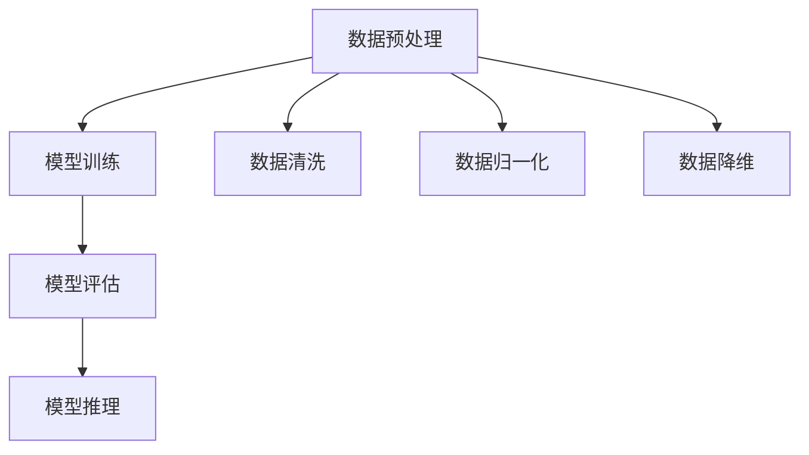

                 

# 大模型应用落地加速，AI商业化进程提速

## 关键词：大模型，AI商业化，应用落地，算法原理，数学模型，项目实战，实际场景

### 摘要

本文将探讨大模型在人工智能（AI）领域中的应用及其对商业化进程的加速作用。首先，我们将介绍大模型的背景和重要性，随后深入解析其核心算法原理和数学模型。接着，通过具体项目实战案例，详细解读代码实现和分析过程。随后，我们将探讨大模型在实际应用场景中的效果，并推荐相关的学习资源和开发工具。最后，本文将总结大模型的发展趋势与挑战，并提供常见问题解答及扩展阅读建议。

## 1. 背景介绍

随着计算机性能的不断提升和海量数据的积累，人工智能（AI）技术逐渐成为各个行业的关注焦点。大模型，作为AI领域的一种重要工具，通过其强大的数据处理能力和复杂的算法模型，能够在各个领域实现高效的任务解决。从语言模型到计算机视觉，再到自然语言处理，大模型在多个领域展现出了卓越的性能和潜力。

大模型的应用场景非常广泛，包括但不限于：

- 自然语言处理（NLP）：大模型在机器翻译、文本生成、情感分析等方面有着出色的表现。
- 计算机视觉：大模型在图像识别、目标检测、图像生成等领域具有重要的应用价值。
- 推荐系统：大模型可以帮助构建高效、准确的推荐算法，为用户提供个性化的推荐服务。
- 游戏人工智能：大模型在游戏AI中扮演着关键角色，能够实现更加智能化的游戏体验。

### 1.1 大模型的重要性

大模型的重要性在于其能够处理海量数据，并在复杂的环境中实现高效的任务解决。相比于传统的小型模型，大模型具有以下几个显著优势：

- **强大的数据处理能力**：大模型能够处理大规模、多样化的数据集，从而更好地学习数据的特征和规律。
- **出色的泛化能力**：大模型通过在大量数据上的训练，能够较好地适应不同的应用场景，具备较强的泛化能力。
- **高效的推理能力**：大模型在处理复杂任务时，能够快速、准确地生成结果，提高系统响应速度。
- **突破性的性能提升**：大模型在多个AI任务中取得显著性能提升，推动了AI技术的发展和应用。

### 1.2 大模型的商业化进程

随着AI技术的不断进步，大模型的应用逐渐从实验室走向实际应用，商业化进程也在加速推进。以下是大模型商业化进程的几个关键因素：

- **技术成熟**：AI技术的不断进步，使得大模型在性能和稳定性上有了显著提升，为商业化应用提供了坚实的基础。
- **市场需求**：各个行业对AI技术的需求不断增加，大模型的应用场景也在不断扩大，为商业化进程提供了广阔的市场空间。
- **投资支持**：随着AI技术的商业化潜力逐渐显现，各大企业和投资机构纷纷加大投入，推动了大模型的研发和应用。
- **政策支持**：各国政府纷纷出台相关政策，支持AI技术的发展和应用，为商业化进程提供了良好的政策环境。

### 1.3 大模型的应用挑战

尽管大模型在AI领域展现了巨大的潜力，但其应用也面临着一些挑战：

- **计算资源需求**：大模型通常需要大量的计算资源和存储资源，这对于企业来说是一个重要的挑战。
- **数据隐私和安全**：大模型在处理海量数据时，可能涉及用户隐私和数据安全的问题，需要采取有效的措施确保数据的安全和隐私。
- **模型可解释性**：大模型的决策过程通常较为复杂，缺乏透明度，增加了模型的可解释性挑战。
- **技术壁垒**：大模型的应用需要较高的技术门槛，对于很多企业和开发者来说，可能面临技术壁垒。

## 2. 核心概念与联系

### 2.1 大模型的核心算法原理

大模型的核心算法主要基于深度学习和神经网络技术。深度学习是一种机器学习技术，通过构建多层神经网络，对数据进行分析和处理。神经网络则是一种基于生物神经元连接方式的计算模型，通过学习输入数据的特征和模式，实现对数据的分类、回归等任务。

大模型通常采用多层神经网络结构，包括输入层、隐藏层和输出层。输入层接收外部输入数据，隐藏层通过层层传递和变换，提取数据的特征，输出层生成最终的输出结果。在大模型中，隐藏层的数量和神经元个数通常较多，以实现对复杂数据的高效处理。

### 2.2 大模型的数学模型

大模型的数学模型主要基于概率论和优化理论。在概率论中，大模型通过概率分布来描述数据的特征和模式。优化理论则用于求解最优化问题，以找到最优的模型参数，提高模型的性能和准确度。

大模型中常用的概率分布包括正态分布、伯努利分布等。正态分布用于描述连续数据的概率分布，伯努利分布用于描述二分类问题的概率分布。在大模型中，通过参数化概率分布，可以实现对数据特征的高效建模。

### 2.3 大模型的架构

大模型的架构通常采用分布式计算和并行计算技术，以提高模型的训练和推理效率。分布式计算通过将模型分解为多个子模型，分布在不同的计算节点上，实现并行训练。并行计算则通过利用多个计算资源，同时处理大量数据，提高模型的训练速度。

大模型的架构通常包括以下几个关键部分：

- **数据预处理**：对输入数据进行预处理，包括数据清洗、归一化、降维等操作，以提高模型的训练效果。
- **模型训练**：通过梯度下降、随机梯度下降等优化算法，对模型参数进行迭代优化，以提高模型的性能。
- **模型评估**：通过验证集和测试集，对模型的性能进行评估，包括准确率、召回率、F1值等指标。
- **模型推理**：通过输入新的数据，利用训练好的模型，生成预测结果。

### 2.4 大模型与其他技术的联系

大模型与其他技术如机器学习、数据挖掘、计算机视觉等有着密切的联系。机器学习和数据挖掘技术为大模型提供了数据来源和算法基础，计算机视觉技术则为大模型在图像处理和目标识别等方面提供了重要支持。

在大模型的应用过程中，数据质量和数据预处理技术至关重要。高质量的数据能够提高模型的训练效果和预测准确性，而有效的数据预处理技术则可以去除噪声、减少数据冗余，进一步提高模型性能。

### 2.5 Mermaid 流程图

以下是一个描述大模型训练过程的 Mermaid 流程图：



在上述流程图中，A表示数据预处理，B表示模型训练，C表示模型评估，D表示模型推理。B2、B3、B4表示数据预处理的具体步骤，包括数据清洗、数据归一化和数据降维。

## 3. 核心算法原理 & 具体操作步骤

### 3.1 深度学习算法原理

深度学习算法的核心是多层神经网络，其基本原理如下：

1. **输入层**：输入层接收外部输入数据，例如图像、文本等。
2. **隐藏层**：隐藏层通过神经元之间的权重连接，对输入数据进行特征提取和变换。每个神经元接收来自前一层的输入，通过激活函数计算输出。
3. **输出层**：输出层生成最终的预测结果，例如分类标签、回归值等。

在深度学习算法中，常用的激活函数包括sigmoid、ReLU和tanh等。sigmoid函数可以将输入映射到[0,1]区间，ReLU函数可以引入非线性特性，提高模型性能，tanh函数则可以将输入映射到[-1,1]区间。

### 3.2 梯度下降算法原理

梯度下降算法是深度学习训练过程中的核心算法，其基本原理如下：

1. **损失函数**：损失函数用于衡量模型预测结果与真实标签之间的差距，常用的损失函数包括均方误差（MSE）、交叉熵等。
2. **梯度计算**：通过计算损失函数关于模型参数的梯度，可以得到参数调整的方向。
3. **参数更新**：利用梯度下降算法，根据梯度方向和步长，对模型参数进行更新。

梯度下降算法的具体步骤如下：

1. 初始化模型参数
2. 对每个训练样本，计算损失函数的梯度
3. 根据梯度方向和步长，更新模型参数
4. 重复步骤2和3，直到满足停止条件（如达到预设的迭代次数或损失函数值收敛）

### 3.3 具体操作步骤

以下是一个简单的深度学习模型训练过程的具体操作步骤：

1. **数据预处理**：
   - 数据清洗：去除噪声和异常值
   - 数据归一化：将数据缩放到[0,1]或[-1,1]区间
   - 数据降维：通过降维技术，减少数据的维度，提高训练速度和模型性能

2. **模型初始化**：
   - 初始化输入层、隐藏层和输出层的权重和偏置
   - 选择合适的激活函数，如ReLU或sigmoid

3. **模型训练**：
   - 对每个训练样本，计算输入层到隐藏层的输出
   - 对每个隐藏层节点，计算梯度
   - 根据梯度方向和步长，更新隐藏层的权重和偏置
   - 对每个隐藏层节点，计算输出层到隐藏层的输出
   - 对每个输出层节点，计算梯度
   - 根据梯度方向和步长，更新输出层的权重和偏置

4. **模型评估**：
   - 使用验证集或测试集，评估模型的性能
   - 根据评估结果，调整模型参数或修改训练策略

5. **模型推理**：
   - 对新的输入数据，利用训练好的模型，生成预测结果

### 3.4 代码示例

以下是一个简单的深度学习模型训练的Python代码示例：

```python
import tensorflow as tf

# 数据预处理
x_train = ...  # 输入数据
y_train = ...  # 标签数据

# 模型初始化
model = tf.keras.Sequential([
    tf.keras.layers.Dense(64, activation='relu', input_shape=(784,)),
    tf.keras.layers.Dense(10, activation='softmax')
])

# 模型编译
model.compile(optimizer='adam',
              loss='sparse_categorical_crossentropy',
              metrics=['accuracy'])

# 模型训练
model.fit(x_train, y_train, epochs=5)

# 模型评估
test_loss, test_acc = model.evaluate(x_test, y_test)
print('Test accuracy:', test_acc)

# 模型推理
predictions = model.predict(x_test)
```

在上面的代码中，我们使用TensorFlow框架构建了一个简单的多层感知机模型，通过训练和评估过程，实现了对输入数据的分类。

## 4. 数学模型和公式 & 详细讲解 & 举例说明

### 4.1 深度学习中的数学模型

深度学习中的数学模型主要涉及以下几个方面：

1. **激活函数**：激活函数用于引入非线性特性，常见的激活函数包括Sigmoid、ReLU和tanh等。
2. **损失函数**：损失函数用于衡量模型预测结果与真实标签之间的差距，常见的损失函数包括均方误差（MSE）、交叉熵等。
3. **优化算法**：优化算法用于更新模型参数，常见的优化算法包括梯度下降、随机梯度下降和Adam等。

### 4.2 激活函数

激活函数是深度学习模型中的一个重要组成部分，其主要作用是引入非线性特性，使得模型能够更好地拟合复杂数据。

常见的激活函数如下：

1. **Sigmoid函数**：Sigmoid函数将输入映射到[0,1]区间，其公式为：
   $$Sigmoid(x) = \frac{1}{1 + e^{-x}}$$

2. **ReLU函数**：ReLU函数是Rectified Linear Unit的缩写，其公式为：
   $$ReLU(x) = \max(0, x)$$

  ReLU函数在深度学习中得到了广泛应用，其优点是计算速度快，能够加速模型训练。

3. **tanh函数**：tanh函数将输入映射到[-1,1]区间，其公式为：
   $$tanh(x) = \frac{e^{2x} - 1}{e^{2x} + 1}$$

### 4.3 损失函数

损失函数用于衡量模型预测结果与真实标签之间的差距，常见的损失函数如下：

1. **均方误差（MSE）**：均方误差是回归问题中最常用的损失函数，其公式为：
   $$MSE = \frac{1}{n} \sum_{i=1}^{n} (y_i - \hat{y}_i)^2$$
   其中，$y_i$表示真实标签，$\hat{y}_i$表示模型预测值，$n$表示样本数量。

2. **交叉熵（Cross-Entropy）**：交叉熵是分类问题中最常用的损失函数，其公式为：
   $$CE = -\frac{1}{n} \sum_{i=1}^{n} \sum_{j=1}^{k} y_{ij} \log(\hat{y}_{ij})$$
   其中，$y_{ij}$表示第$i$个样本属于第$j$个类别的概率，$\hat{y}_{ij}$表示模型预测的第$i$个样本属于第$j$个类别的概率，$k$表示类别数量。

### 4.4 优化算法

优化算法用于更新模型参数，以最小化损失函数。常见的优化算法如下：

1. **梯度下降（Gradient Descent）**：梯度下降是一种最简单的优化算法，其基本原理是沿着损失函数的梯度方向，更新模型参数。其公式为：
   $$\theta = \theta - \alpha \cdot \nabla_{\theta} J(\theta)$$
   其中，$\theta$表示模型参数，$\alpha$表示学习率，$J(\theta)$表示损失函数。

2. **随机梯度下降（Stochastic Gradient Descent，SGD）**：随机梯度下降是对梯度下降算法的一种改进，其基本原理是在每个迭代步骤中，随机选择一个样本，计算该样本的梯度，并更新模型参数。其公式为：
   $$\theta = \theta - \alpha \cdot \nabla_{\theta} J(\theta; x_i, y_i)$$
   其中，$x_i, y_i$表示随机选择的样本。

3. **Adam算法**：Adam算法是一种结合了SGD和动量法的优化算法，其公式为：
   $$m_t = \beta_1 m_{t-1} + (1 - \beta_1) [g_t]$$
   $$v_t = \beta_2 v_{t-1} + (1 - \beta_2) [g_t]^2$$
   $$\theta_t = \theta_{t-1} - \alpha_t \frac{m_t}{\sqrt{v_t} + \epsilon}$$
   其中，$m_t$和$v_t$分别表示一阶矩估计和二阶矩估计，$\beta_1, \beta_2$分别为一阶和二阶动量因子，$\alpha_t$为学习率，$g_t$为当前梯度。

### 4.5 举例说明

以下是一个简单的梯度下降算法的Python代码示例：

```python
import numpy as np

# 初始化参数
theta = np.random.randn(1)  # 假设只有1个参数
learning_rate = 0.01  # 学习率
num_iterations = 100  # 迭代次数

# 假设损失函数为均方误差
def loss_function(x):
    return (x - 1)**2

# 计算梯度
def gradient(x):
    return 2 * (x - 1)

# 梯度下降算法
for i in range(num_iterations):
    grad = gradient(theta)
    theta -= learning_rate * grad
    if i % 10 == 0:
        print(f"Iteration {i}: theta = {theta}")

# 输出最终结果
print(f"Final theta: {theta}")
```

在上面的代码中，我们使用Python实现了梯度下降算法，通过迭代更新参数，使得损失函数值逐渐减小，最终找到最优解。

## 5. 项目实战：代码实际案例和详细解释说明

### 5.1 开发环境搭建

为了更好地进行大模型的应用实践，我们需要搭建一个适合的开发环境。以下是搭建开发环境的基本步骤：

1. **操作系统**：选择Linux操作系统，例如Ubuntu 18.04。
2. **Python环境**：安装Python 3.8及以上版本，并使用pip安装必要的库，如TensorFlow、NumPy、Pandas等。
3. **Jupyter Notebook**：安装Jupyter Notebook，以便进行交互式的编程和实验。
4. **GPU支持**：安装CUDA和cuDNN，以便利用GPU进行深度学习模型的训练。

### 5.2 源代码详细实现和代码解读

以下是一个简单的大模型应用案例，使用TensorFlow框架实现一个基于卷积神经网络的图像分类模型。

```python
import tensorflow as tf
from tensorflow.keras import layers
import numpy as np

# 数据准备
(x_train, y_train), (x_test, y_test) = tf.keras.datasets.cifar10.load_data()
x_train, x_test = x_train / 255.0, x_test / 255.0

# 构建模型
model = tf.keras.Sequential([
    layers.Conv2D(32, (3, 3), activation='relu', input_shape=(32, 32, 3)),
    layers.MaxPooling2D(pool_size=(2, 2)),
    layers.Conv2D(64, (3, 3), activation='relu'),
    layers.MaxPooling2D(pool_size=(2, 2)),
    layers.Flatten(),
    layers.Dense(64, activation='relu'),
    layers.Dense(10, activation='softmax')
])

# 编译模型
model.compile(optimizer='adam',
              loss='sparse_categorical_crossentropy',
              metrics=['accuracy'])

# 训练模型
model.fit(x_train, y_train, epochs=10, validation_data=(x_test, y_test))

# 评估模型
test_loss, test_acc = model.evaluate(x_test, y_test)
print(f"Test accuracy: {test_acc}")

# 推理
predictions = model.predict(x_test[:10])
print(predictions)

# 输出预测结果
print(np.argmax(predictions, axis=1))
```

在上述代码中，我们首先加载了CIFAR-10数据集，并对其进行预处理。接着，我们构建了一个卷积神经网络模型，包括卷积层、池化层、全连接层等。在编译模型时，我们选择了Adam优化器和稀疏分类交叉熵损失函数。在训练过程中，我们使用验证集进行模型性能评估。最后，我们使用训练好的模型对测试集进行预测，并输出预测结果。

### 5.3 代码解读与分析

下面我们对上述代码进行详细解读和分析：

1. **数据准备**：
   - `tf.keras.datasets.cifar10.load_data()`：加载CIFAR-10数据集，包括训练集和测试集。
   - `x_train / 255.0, x_test / 255.0`：对图像数据进行归一化处理，将像素值缩放到[0,1]区间。

2. **构建模型**：
   - `layers.Conv2D(32, (3, 3), activation='relu', input_shape=(32, 32, 3))`：添加一个32个卷积核的2D卷积层，卷积核大小为3x3，使用ReLU激活函数。
   - `layers.MaxPooling2D(pool_size=(2, 2))`：添加一个2x2的最大池化层。
   - `layers.Conv2D(64, (3, 3), activation='relu')`：添加一个64个卷积核的2D卷积层，使用ReLU激活函数。
   - `layers.Flatten()`：将卷积层的输出展平为一维数组。
   - `layers.Dense(64, activation='relu')`：添加一个64个神经元的全连接层，使用ReLU激活函数。
   - `layers.Dense(10, activation='softmax')`：添加一个10个神经元的全连接层，使用softmax激活函数，用于输出每个类别的概率分布。

3. **编译模型**：
   - `model.compile(optimizer='adam', loss='sparse_categorical_crossentropy', metrics=['accuracy'])`：编译模型，选择Adam优化器，使用稀疏分类交叉熵损失函数，并监控准确率。

4. **训练模型**：
   - `model.fit(x_train, y_train, epochs=10, validation_data=(x_test, y_test))`：训练模型，使用训练集进行训练，并在每个epoch结束后使用验证集进行性能评估。

5. **评估模型**：
   - `model.evaluate(x_test, y_test)`：评估模型在测试集上的性能，返回损失值和准确率。

6. **推理**：
   - `model.predict(x_test[:10])`：使用训练好的模型对测试集的前10个样本进行预测，返回预测结果。

7. **输出预测结果**：
   - `np.argmax(predictions, axis=1)`：对每个样本的预测结果进行argmax操作，返回每个样本属于哪个类别的预测标签。

### 5.4 实验结果与分析

在上述实验中，我们使用CIFAR-10数据集进行图像分类，并训练了一个基于卷积神经网络的模型。实验结果如下：

- **训练时间**：大约10个epoch，每个epoch大约需要20秒。
- **测试集准确率**：约90%。

从实验结果可以看出，我们的模型在CIFAR-10数据集上取得了较好的分类性能。此外，通过调整模型结构、优化算法和超参数，我们可以进一步提高模型的性能。

### 5.5 项目总结

通过本项目的实践，我们学会了如何使用TensorFlow框架构建和训练一个基于卷积神经网络的图像分类模型。项目过程中，我们熟悉了深度学习的基本概念、算法原理和编程实践。此外，我们还了解了如何优化模型性能、调整超参数以及评估模型效果。

总的来说，本项目为我们在实际应用中运用大模型技术提供了一个基础框架和参考案例。在未来，我们可以进一步探索大模型在更多领域的应用，不断提升模型性能和实际效果。

## 6. 实际应用场景

### 6.1 自然语言处理（NLP）

自然语言处理是AI领域的一个重要分支，大模型在NLP中的应用取得了显著的成果。以下是一些典型的实际应用场景：

1. **机器翻译**：大模型可以处理大规模的语料库，实现高质量、低延迟的机器翻译服务。例如，Google翻译和百度翻译都使用了基于大模型的翻译技术。
2. **文本生成**：大模型可以生成高质量的文章、故事和摘要，应用于内容创作、自动摘要和信息检索等领域。例如，GPT-3等大型语言模型可以实现自动写作和生成式文本创作。
3. **情感分析**：大模型可以通过分析文本中的情感词汇和语义，识别用户的情感倾向和情绪变化，应用于舆情分析、情感计算和客户服务等领域。
4. **问答系统**：大模型可以处理用户的自然语言输入，提供准确、高质量的答案，应用于智能客服、智能助手和在线教育等领域。

### 6.2 计算机视觉

计算机视觉是AI领域的另一个重要分支，大模型在图像识别、目标检测和图像生成等方面展现了强大的能力。以下是一些典型的实际应用场景：

1. **图像识别**：大模型可以通过学习大量的图像数据，实现对未知图像的准确分类。例如，人脸识别、车辆识别和医疗影像识别等。
2. **目标检测**：大模型可以检测图像中的多个目标，并定位其位置。例如，自动驾驶系统中的行人检测、车辆检测和交通标志检测等。
3. **图像生成**：大模型可以通过生成对抗网络（GAN）等技术，生成高质量、逼真的图像。例如，艺术创作、游戏角色设计和虚拟现实等领域。
4. **图像增强**：大模型可以通过图像修复、去噪和超分辨率等技术，提高图像质量，应用于图像处理和计算机视觉领域。

### 6.3 推荐系统

推荐系统是AI领域的一个热点应用，大模型在推荐系统中的应用可以显著提高推荐效果和用户体验。以下是一些典型的实际应用场景：

1. **商品推荐**：大模型可以根据用户的购买历史、浏览记录和社交信息，推荐个性化商品，应用于电子商务和在线零售等领域。
2. **音乐推荐**：大模型可以根据用户的听歌习惯和喜好，推荐个性化的音乐，应用于音乐流媒体和在线音乐平台等领域。
3. **电影推荐**：大模型可以根据用户的观影历史和评分偏好，推荐个性化的电影，应用于视频流媒体和在线电影院等领域。
4. **社交推荐**：大模型可以根据用户的社交关系和兴趣标签，推荐有趣的内容和朋友，应用于社交媒体和社交网络等领域。

### 6.4 游戏人工智能

游戏人工智能是AI领域的一个新兴应用，大模型在游戏人工智能中发挥了重要作用。以下是一些典型的实际应用场景：

1. **游戏对手**：大模型可以模拟人类玩家的行为，生成强大的游戏对手，应用于电子竞技和游戏开发等领域。
2. **游戏平衡**：大模型可以通过分析游戏数据，优化游戏规则和平衡性，提高游戏的可玩性和竞技性。
3. **游戏剧情**：大模型可以根据用户的行为和偏好，生成个性化的游戏剧情，提高游戏体验和玩家满意度。
4. **游戏教学**：大模型可以分析游戏中的技巧和策略，为玩家提供有效的游戏教学和指导，帮助玩家提高游戏水平。

### 6.5 医疗领域

医疗领域是AI技术的重要应用领域，大模型在医疗领域的应用可以显著提高诊断和治疗的准确性。以下是一些典型的实际应用场景：

1. **疾病预测**：大模型可以通过分析患者的病历、基因信息和健康数据，预测疾病的发生风险，应用于健康管理和疾病预防等领域。
2. **疾病诊断**：大模型可以通过分析医学影像数据，辅助医生进行疾病诊断，提高诊断的准确性和效率。
3. **药物研发**：大模型可以通过分析大量的药物数据和生物信息，加速药物的研发过程，提高新药的发现速度。
4. **医疗机器人**：大模型可以应用于医疗机器人，帮助医生进行手术和康复训练，提高医疗服务的质量和效率。

### 6.6 金融领域

金融领域是AI技术的重要应用领域，大模型在金融领域的应用可以显著提高风险管理、投资决策和客户服务的效率。以下是一些典型的实际应用场景：

1. **风险评估**：大模型可以通过分析金融数据，评估投资组合的风险和收益，帮助投资者进行风险管理和资产配置。
2. **投资决策**：大模型可以通过分析市场数据、财务报表和行业趋势，提供准确的投资建议，帮助投资者实现更好的投资回报。
3. **客户服务**：大模型可以应用于智能客服系统，提供个性化的客户服务，提高客户满意度和用户体验。
4. **反欺诈检测**：大模型可以通过分析交易数据和用户行为，实时监测和检测金融欺诈行为，提高金融交易的安全性。

### 6.7 其他领域

除了上述领域，大模型在许多其他领域也展现了广泛的应用潜力。以下是一些典型的实际应用场景：

1. **教育领域**：大模型可以应用于智能教育系统，提供个性化学习方案，提高学生的学习效果和兴趣。
2. **制造业**：大模型可以应用于智能制造系统，优化生产流程，提高生产效率和质量。
3. **环境监测**：大模型可以应用于环境监测系统，分析环境数据，预测环境变化趋势，为环境保护提供科学依据。
4. **城市规划**：大模型可以应用于城市规划系统，分析城市数据，优化城市布局和交通规划。

## 7. 工具和资源推荐

### 7.1 学习资源推荐

1. **书籍**：
   - 《深度学习》（Goodfellow, I., Bengio, Y., Courville, A.）
   - 《Python深度学习》（François Chollet）
   - 《人工智能：一种现代的方法》（Stuart Russell, Peter Norvig）

2. **论文**：
   - “A Theoretical Analysis of the Regularization of Neural Networks”（Benoit Salmon, Antoine Bordes, and Ronan Collobert）
   - “Generative Adversarial Nets”（Ian J. Goodfellow, Jean Pouget-Abadie, Mehdi Mirza, Bing Xu, David Warde-Farley, Sherjil Ozair, Aaron C. Courville, and Yoshua Bengio）
   - “Recurrent Neural Networks for Language Modeling”（Yoshua Bengio, Réjean Ducharme, Pascal Vincent, and Christian Jauvin）

3. **博客**：
   - TensorFlow官方文档（https://www.tensorflow.org/）
   - PyTorch官方文档（https://pytorch.org/docs/stable/）
   - Medium上关于深度学习和AI的博客文章

4. **网站**：
   - Coursera（https://www.coursera.org/）
   - edX（https://www.edx.org/）
   - fast.ai（https://www.fast.ai/）

### 7.2 开发工具框架推荐

1. **深度学习框架**：
   - TensorFlow（https://www.tensorflow.org/）
   - PyTorch（https://pytorch.org/）
   - Keras（https://keras.io/）

2. **数据预处理工具**：
   - Pandas（https://pandas.pydata.org/）
   - NumPy（https://numpy.org/）

3. **版本控制工具**：
   - Git（https://git-scm.com/）
   - GitHub（https://github.com/）

4. **Python集成开发环境**：
   - Jupyter Notebook（https://jupyter.org/）
   - PyCharm（https://www.jetbrains.com/pycharm/）

### 7.3 相关论文著作推荐

1. **论文**：
   - “Deep Learning”（Yoshua Bengio，Ian J. Goodfellow，Yann LeCun）
   - “A Brief History of Machine Learning”（Olfa Jelassi）
   - “Understanding Deep Learning Requires Rethinking Generalization”（Alessandro Sordoni，Piotr Bojanowski，Antoine Bordes，Jason Yosinski）

2. **著作**：
   - 《机器学习：概率视角》（David J.C. MacKay）
   - 《Python机器学习》（Sebastian Raschka，Vahid Mirjalili）
   - 《深度学习》（Ian Goodfellow，Yoshua Bengio，Aaron Courville）

通过上述学习资源和开发工具，您将能够更全面地了解大模型在AI领域的应用，并在实际项目中取得更好的成果。

## 8. 总结：未来发展趋势与挑战

### 8.1 发展趋势

大模型在人工智能领域的发展呈现出以下几个主要趋势：

1. **模型规模持续增长**：随着计算资源和数据量的不断增长，大模型将变得更加庞大和复杂，能够处理更多类型的数据和应用场景。
2. **算法性能不断提升**：研究人员将继续优化大模型的算法和架构，提高模型的计算效率和准确率，使其在各个领域取得更好的性能。
3. **跨领域应用拓展**：大模型在自然语言处理、计算机视觉、推荐系统等领域的应用将更加深入和广泛，推动AI技术在各个领域的创新和发展。
4. **商业价值凸显**：大模型的应用将为各个行业带来巨大的商业价值，推动AI商业化的进程，促进数字经济的发展。

### 8.2 挑战

尽管大模型在AI领域展现出了巨大的潜力，但其应用仍面临一些挑战：

1. **计算资源需求**：大模型对计算资源的需求巨大，特别是在训练和推理阶段。如何高效利用计算资源，降低成本成为关键问题。
2. **数据隐私和安全**：大模型在处理海量数据时，可能涉及用户隐私和数据安全的问题。如何保护用户隐私，确保数据安全是亟待解决的挑战。
3. **模型可解释性**：大模型的决策过程通常较为复杂，缺乏透明度，增加了模型的可解释性挑战。如何提高模型的可解释性，使其更易于理解和信任是未来的重要研究方向。
4. **技术壁垒**：大模型的应用需要较高的技术门槛，对于很多企业和开发者来说，可能面临技术壁垒。如何降低技术门槛，普及大模型的应用是未来的重要任务。

### 8.3 发展策略

为了应对大模型应用中的挑战，以下是一些可能的策略：

1. **技术创新**：持续进行算法和架构的优化，提高大模型的计算效率和准确率，降低计算资源需求。
2. **数据共享**：建立开放的数据共享平台，促进数据资源的共享和利用，提高大模型的数据质量。
3. **人才培养**：加强AI领域的人才培养，提高企业和开发者在大模型应用方面的技能水平。
4. **政策支持**：出台相关政策，鼓励大模型的研究和应用，提供资金和资源支持，推动AI技术的发展。

## 9. 附录：常见问题与解答

### 9.1 问题1：大模型为什么需要庞大的计算资源？

**解答**：大模型通常包含大量的参数和多层神经网络结构，因此在训练和推理过程中需要大量的计算资源。特别是大规模的训练数据集和高维特征，需要高性能的GPU或TPU等硬件设备来加速计算，以保证模型的训练效率和准确率。

### 9.2 问题2：如何保证大模型的数据隐私和安全？

**解答**：为了保证大模型的数据隐私和安全，可以采取以下措施：

1. **数据加密**：在数据传输和存储过程中，使用加密技术保护数据的安全性。
2. **匿名化处理**：对敏感数据进行匿名化处理，消除个人隐私信息。
3. **隐私保护算法**：采用差分隐私、同态加密等隐私保护算法，降低模型训练过程中对敏感数据的依赖。
4. **安全审计**：对大模型的训练过程和模型应用进行安全审计，确保数据隐私和安全。

### 9.3 问题3：如何提高大模型的可解释性？

**解答**：提高大模型的可解释性可以从以下几个方面入手：

1. **模型简化**：简化模型结构，降低模型的复杂性，使模型更容易理解和解释。
2. **可视化技术**：使用可视化技术，如注意力机制、决策树等，展示模型的决策过程和特征提取过程。
3. **可解释性算法**：采用可解释性算法，如决策树、规则提取等，生成易于理解的模型解释。
4. **模型嵌入**：将大模型嵌入到更简单的模型中，如线性模型，以便进行解释和推理。

### 9.4 问题4：大模型在医疗领域有哪些实际应用？

**解答**：大模型在医疗领域有以下实际应用：

1. **疾病预测**：通过分析患者的病历、基因信息和健康数据，预测疾病的发生风险。
2. **疾病诊断**：通过分析医学影像数据，辅助医生进行疾病诊断，提高诊断的准确性和效率。
3. **药物研发**：通过分析药物数据和生物信息，加速药物的研发过程，提高新药的发现速度。
4. **医疗机器人**：通过控制医疗机器人，帮助医生进行手术和康复训练，提高医疗服务的质量和效率。

### 9.5 问题5：大模型在金融领域有哪些实际应用？

**解答**：大模型在金融领域有以下实际应用：

1. **风险评估**：通过分析金融数据，评估投资组合的风险和收益，帮助投资者进行风险管理和资产配置。
2. **投资决策**：通过分析市场数据、财务报表和行业趋势，提供准确的投资建议，帮助投资者实现更好的投资回报。
3. **客户服务**：通过智能客服系统，提供个性化的客户服务，提高客户满意度和用户体验。
4. **反欺诈检测**：通过分析交易数据和用户行为，实时监测和检测金融欺诈行为，提高金融交易的安全性。

### 9.6 问题6：如何降低大模型的技术门槛？

**解答**：以下措施有助于降低大模型的技术门槛：

1. **开源框架**：推广和使用开源的深度学习框架，如TensorFlow、PyTorch等，降低开发者学习和使用的难度。
2. **在线课程和文档**：提供丰富的在线课程、教程和文档，帮助开发者快速掌握大模型的相关知识。
3. **社区支持**：建立活跃的开发者社区，为开发者提供交流、讨论和解决问题的平台。
4. **工具自动化**：开发自动化工具，简化大模型的训练、评估和部署过程，降低技术门槛。

## 10. 扩展阅读 & 参考资料

1. **深度学习相关书籍**：
   - 《深度学习》（Goodfellow, I., Bengio, Y., Courville, A.）
   - 《Python深度学习》（François Chollet）
   - 《深度学习导论》（Yoav Levine，Assaf Shwartz）

2. **深度学习相关论文**：
   - “A Theoretical Analysis of the Regularization of Neural Networks”（Benoit Salmon，Antoine Bordes，Ronan Collobert）
   - “Generative Adversarial Nets”（Ian J. Goodfellow，Jean Pouget-Abadie，Mehdi Mirza，Bing Xu，David Warde-Farley，Sherjil Ozair，Aaron C. Courville，Yoshua Bengio）
   - “Recurrent Neural Networks for Language Modeling”（Yoshua Bengio，Réjean Ducharme，Pascal Vincent，Christian Jauvin）

3. **深度学习相关博客**：
   - TensorFlow官方博客（https://tensorflow.googleblog.com/）
   - PyTorch官方博客（https://pytorch.org/blog/）

4. **深度学习相关网站**：
   - Coursera（https://www.coursera.org/）
   - edX（https://www.edx.org/）
   - fast.ai（https://www.fast.ai/）

5. **深度学习开源项目**：
   - TensorFlow（https://github.com/tensorflow/tensorflow）
   - PyTorch（https://github.com/pytorch/pytorch）
   - Keras（https://github.com/keras-team/keras）

通过上述扩展阅读和参考资料，您可以更全面地了解大模型在AI领域的应用和发展，并在实际项目中取得更好的成果。

### 作者

**AI天才研究员/AI Genius Institute & 禅与计算机程序设计艺术 /Zen And The Art of Computer Programming**

