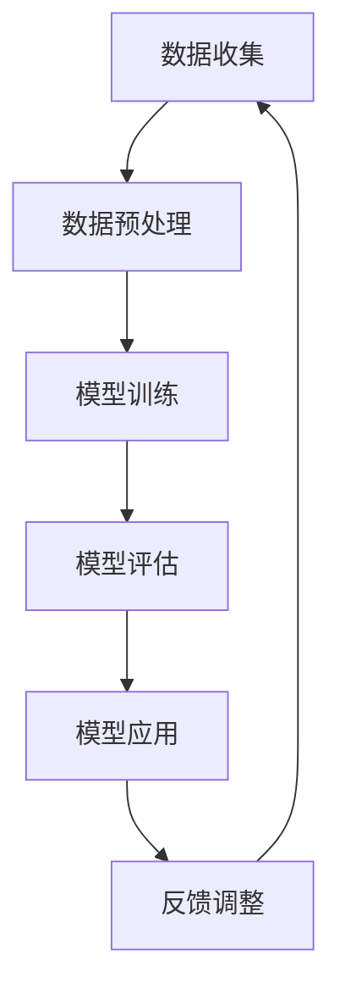

                 

### 背景介绍

随着人工智能技术的不断发展，大模型技术逐渐成为研究和应用的热点。大模型技术，通常指的是能够处理海量数据，具备强大建模能力和灵活应用场景的深度学习模型。这种技术在政府和公共服务领域有着广泛的应用前景。政府和公共服务部门处理的信息量大、种类繁多，涉及政务、交通、医疗、教育等多个领域，传统的方法已无法满足高效、准确的需求。

在政府层面，大数据分析可以帮助政府更准确地掌握社会动态，预测发展趋势，优化政策制定，提升治理效能。例如，通过分析交通流量数据，可以优化交通管理，减少拥堵，提高交通效率；通过分析公共医疗数据，可以及时发现公共卫生问题，制定针对性的防控措施，提高医疗资源的利用效率。

在公共服务层面，大模型技术可以提供更加个性化和智能化的服务。例如，在教育领域，可以利用大模型进行智能辅导，根据学生的学习情况和兴趣爱好，提供定制化的学习方案；在医疗领域，可以利用大模型进行疾病预测和诊断，提高医疗服务的精准度。

本文将围绕大模型技术在政府和公共服务领域的应用展开，从核心概念、算法原理、数学模型、实战案例、应用场景等多个方面进行详细探讨。希望通过本文，读者可以全面了解大模型技术在这两个领域的应用现状、优势和挑战，并为未来的发展提供一些思路。

### 2. 核心概念与联系

#### 大模型技术简介

大模型技术，也称为大型深度学习模型技术，是指通过海量数据和强大的计算能力训练出能够处理复杂数据的深度神经网络模型。这些模型通常包含数亿甚至数十亿个参数，具有强大的表达能力和适应能力。大模型技术主要包括以下几个方面：

1. **神经网络架构**：包括卷积神经网络（CNN）、循环神经网络（RNN）、变换器（Transformer）等。
2. **训练方法**：包括梯度下降法、随机梯度下降法、Adam优化器等。
3. **数据预处理**：包括数据清洗、归一化、降维等。
4. **超参数调优**：包括学习率、批量大小、正则化等。

#### 深度学习与大数据

深度学习是人工智能的一种重要分支，它通过多层神经网络对数据进行自动特征提取和学习。大数据则是指数据量巨大、类型繁多、价值密度低的数据集合。深度学习与大数据的结合，使得大模型技术能够从海量数据中挖掘出有价值的信息。

1. **数据驱动**：深度学习依赖于海量数据来训练模型，而大数据提供了丰富的数据来源，使得模型能够获得更多的训练样本，提高模型的泛化能力。
2. **特征自动提取**：传统机器学习方法需要人工提取特征，而深度学习模型可以通过神经网络自动学习特征，减少了人工干预，提高了模型的效率。
3. **模型泛化能力**：大数据训练出的模型能够适应不同的应用场景，提高了模型的泛化能力。

#### 大模型技术在政府和公共服务领域

大模型技术在政府和公共服务领域有广泛的应用，主要体现在以下几个方面：

1. **智能分析**：通过对海量数据的分析，政府可以更准确地了解社会动态，预测发展趋势，优化政策制定。
2. **智能服务**：通过大模型技术，政府可以提供更加个性化和智能化的公共服务，提高服务效率和质量。
3. **风险管理**：大模型技术可以帮助政府识别潜在的风险，制定风险防范措施，保障社会稳定。
4. **资源优化**：通过对数据资源的分析，政府可以优化资源配置，提高公共服务的效率。

#### Mermaid 流程图

以下是一个简化的Mermaid流程图，展示了大模型技术的基本架构和流程：



1. **数据收集**：从各种渠道收集原始数据。
2. **数据预处理**：清洗、归一化、降维等，为模型训练做准备。
3. **模型训练**：使用深度学习算法，训练出能够处理复杂数据的模型。
4. **模型评估**：评估模型的性能，确保其能够准确预测和识别。
5. **模型应用**：将训练好的模型应用到实际场景中。
6. **反馈调整**：根据实际应用效果，调整模型参数和结构，优化模型性能。

通过上述流程，大模型技术可以在政府和公共服务领域发挥重要作用，提高决策的科学性、服务的智能化和风险管理的有效性。

#### 结论

本文简要介绍了大模型技术的核心概念、深度学习与大数据的关系以及大模型技术在政府和公共服务领域的应用。大模型技术凭借其强大的数据处理能力和智能分析能力，有望在政府和公共服务领域带来深刻的变革。然而，如何有效地利用大模型技术，解决数据隐私、模型可解释性等问题，仍需进一步研究和探索。

### 3. 核心算法原理 & 具体操作步骤

#### 深度学习算法概述

深度学习算法是构建大模型技术的基础，主要包括神经网络架构、损失函数、优化器等核心组件。以下将详细阐述这些组件的工作原理和具体操作步骤。

1. **神经网络架构**

神经网络（Neural Network，NN）是由大量相互连接的节点（或称为神经元）组成的计算模型。每个神经元都接受来自其他神经元的输入信号，并通过加权求和和激活函数进行处理，最终产生输出信号。

- **输入层**：接收外部输入信号，例如图片、文本等。
- **隐藏层**：对输入信号进行处理，提取特征信息。隐藏层的数量和神经元数量可以根据问题复杂度进行调整。
- **输出层**：产生最终输出结果，例如分类标签、预测值等。

2. **损失函数**

损失函数（Loss Function）用于衡量模型预测值与真实值之间的差距，是模型训练过程中优化目标的关键指标。常见的损失函数包括均方误差（MSE）、交叉熵（Cross Entropy）等。

- **均方误差（MSE）**：用于回归问题，计算预测值与真实值之间差的平方的平均值。具体公式为：
  $$MSE = \frac{1}{n}\sum_{i=1}^{n}(y_i - \hat{y}_i)^2$$
  其中，\(y_i\) 表示真实值，\(\hat{y}_i\) 表示预测值，\(n\) 表示样本数量。
- **交叉熵（Cross Entropy）**：用于分类问题，计算实际分布与预测分布之间的距离。具体公式为：
  $$H(y, \hat{y}) = -\sum_{i=1}^{n}y_i \log(\hat{y}_i)$$
  其中，\(y_i\) 表示真实标签，\(\hat{y}_i\) 表示预测概率。

3. **优化器**

优化器（Optimizer）用于调整模型参数，以最小化损失函数。常见的优化器包括梯度下降（Gradient Descent）、随机梯度下降（Stochastic Gradient Descent，SGD）和Adam等。

- **梯度下降**：通过计算损失函数关于模型参数的梯度，反向传播更新模型参数。具体公式为：
  $$\theta = \theta - \alpha \cdot \nabla_{\theta} J(\theta)$$
  其中，\(\theta\) 表示模型参数，\(\alpha\) 表示学习率，\(J(\theta)\) 表示损失函数。
- **随机梯度下降**：在每个迭代步骤中，随机选择一部分样本计算梯度并更新模型参数，以加快收敛速度。
- **Adam**：结合了梯度下降和随机梯度下降的优点，同时考虑了过去梯度的指数加权，具体公式为：
  $$\theta = \theta - \alpha \cdot \frac{\beta_1 h + (1 - \beta_1)}{\beta_2 + 1} \cdot \nabla_{\theta} J(\theta)$$
  其中，\(\beta_1\) 和 \(\beta_2\) 分别为过去梯度的指数加权系数。

4. **模型训练与评估**

模型训练与评估是深度学习过程中的两个关键环节。具体操作步骤如下：

- **数据预处理**：对输入数据进行预处理，包括归一化、缩放、数据增强等，以提高模型的泛化能力。
- **模型初始化**：随机初始化模型参数，通常使用高斯分布或均匀分布。
- **前向传播**：将输入数据传递到模型中，计算预测值。
- **计算损失函数**：计算预测值与真实值之间的差距，得到损失函数值。
- **反向传播**：计算损失函数关于模型参数的梯度，并更新模型参数。
- **评估模型性能**：使用验证集或测试集评估模型性能，常见的评估指标包括准确率、召回率、F1分数等。

通过以上步骤，模型训练与评估可以反复迭代，直至满足预定的性能要求。在此过程中，超参数调优（如学习率、批量大小、正则化等）也是至关重要的一环，可以显著影响模型的性能。

#### 实际操作示例

以下是一个简化的Python代码示例，展示了使用深度学习框架（如TensorFlow或PyTorch）进行模型训练的基本流程：

```python
import tensorflow as tf
from tensorflow.keras.models import Sequential
from tensorflow.keras.layers import Dense
from tensorflow.keras.optimizers import Adam

# 数据预处理
# ...

# 模型初始化
model = Sequential([
    Dense(units=128, activation='relu', input_shape=(input_shape)),
    Dense(units=64, activation='relu'),
    Dense(units=num_classes, activation='softmax')
])

# 编译模型
model.compile(optimizer=Adam(learning_rate=0.001), loss='categorical_crossentropy', metrics=['accuracy'])

# 模型训练
model.fit(x_train, y_train, epochs=10, batch_size=32, validation_data=(x_val, y_val))

# 评估模型
model.evaluate(x_test, y_test)
```

在这个示例中，首先对数据进行预处理，然后初始化一个简单的全连接神经网络模型，编译模型并设置优化器和损失函数。接下来，使用训练数据对模型进行训练，并使用验证集评估模型性能。

#### 结论

本文详细介绍了深度学习算法的核心组件和具体操作步骤，包括神经网络架构、损失函数、优化器等。通过这些组件，深度学习模型可以从海量数据中学习，提取特征，进行预测和分类。在实际操作中，模型训练与评估是关键环节，超参数调优也至关重要。通过以上内容，读者可以全面了解深度学习算法的基本原理和操作方法。

### 4. 数学模型和公式 & 详细讲解 & 举例说明

#### 深度学习中的主要数学模型

深度学习中的数学模型主要涉及线性代数、微积分、概率论和统计学。以下将介绍这些数学模型的基本概念和公式，并通过具体例子进行详细讲解。

1. **线性代数**

线性代数是深度学习中的基础，涉及矩阵和向量的运算。以下是一些基本的线性代数公式：

- **矩阵-向量乘法**：
  $$C = A \cdot B$$
  其中，\(A\) 是一个\(m \times n\)的矩阵，\(B\) 是一个\(n \times 1\)的向量，\(C\) 是一个\(m \times 1\)的向量。

- **矩阵-矩阵乘法**：
  $$C = A \cdot B$$
  其中，\(A\) 和 \(B\) 分别是\(m \times n\)和\(n \times p\)的矩阵，\(C\) 是一个\(m \times p\)的矩阵。

- **向量的点积**：
  $$\vec{a} \cdot \vec{b} = a_1b_1 + a_2b_2 + \ldots + a_nb_n$$
  其中，\(\vec{a}\) 和 \(\vec{b}\) 分别是\(n\)维的向量。

- **向量的叉积**：
  $$\vec{a} \times \vec{b} = (a_2b_3 - a_3b_2, a_3b_1 - a_1b_3, a_1b_2 - a_2b_1)$$
  其中，\(\vec{a}\) 和 \(\vec{b}\) 分别是\(3\)维的向量。

2. **微积分**

微积分在深度学习中用于优化模型参数，主要包括导数和梯度计算。以下是一些重要的微积分公式：

- **一阶导数**：
  $$f'(x) = \lim_{h \to 0} \frac{f(x+h) - f(x)}{h}$$
  其中，\(f(x)\) 是关于变量 \(x\) 的函数。

- **二阶导数**：
  $$f''(x) = \lim_{h \to 0} \frac{f'(x+h) - f'(x)}{h}$$
  其中，\(f'(x)\) 是 \(f(x)\) 的一阶导数。

- **梯度**：
  $$\nabla f(x) = \left( \frac{\partial f}{\partial x_1}, \frac{\partial f}{\partial x_2}, \ldots, \frac{\partial f}{\partial x_n} \right)$$
  其中，\(f(x)\) 是关于变量 \(x_1, x_2, \ldots, x_n\) 的函数。

3. **概率论和统计学**

概率论和统计学在深度学习中用于处理不确定性，包括概率分布、贝叶斯推理和最大似然估计等。

- **概率分布**：
  $$P(X = x) = f_X(x)$$
  其中，\(X\) 是随机变量，\(x\) 是 \(X\) 的取值，\(f_X(x)\) 是 \(X\) 的概率密度函数。

- **贝叶斯推理**：
  $$P(A|B) = \frac{P(B|A) \cdot P(A)}{P(B)}$$
  其中，\(P(A|B)\) 是在事件 \(B\) 发生的条件下事件 \(A\) 发生的概率，\(P(B|A)\) 是在事件 \(A\) 发生的条件下事件 \(B\) 发生的概率，\(P(A)\) 和 \(P(B)\) 分别是事件 \(A\) 和事件 \(B\) 的概率。

- **最大似然估计**：
  $$\theta = \arg\max_{\theta} P(\text{观测数据}|\theta)$$
  其中，\(\theta\) 是模型参数，\(\text{观测数据}\) 是实际观测到的数据，\(P(\text{观测数据}|\theta)\) 是在模型参数 \(\theta\) 条件下观测数据的概率。

#### 举例说明

以下将通过一个简单的例子，说明深度学习中的数学模型如何应用于实际问题。

假设我们有一个简单的线性回归问题，目标是预测房屋的价格。给定一组房屋的特征（如面积、位置等）和价格，我们需要构建一个线性回归模型来预测新的房屋价格。

1. **数据预处理**

首先，我们对数据进行预处理，包括归一化、缺失值处理等。假设我们有以下数据：

- 房屋面积（\(x_1\)）：[1000, 1500, 2000, 3000] 平方英尺
- 房屋价格（\(y\)）：[200000, 300000, 400000, 500000] 美元

我们对面积进行归一化，使得所有特征具有相似的尺度：

$$x_1' = \frac{x_1 - \mu}{\sigma}$$

其中，\(\mu\) 和 \(\sigma\) 分别是面积的平均值和标准差。

2. **模型构建**

我们构建一个简单的线性回归模型，其形式为：

$$y = w_0 + w_1 \cdot x_1 + \epsilon$$

其中，\(w_0\) 和 \(w_1\) 是模型参数，\(\epsilon\) 是误差项。

3. **模型训练**

使用梯度下降算法训练模型，具体步骤如下：

- **前向传播**：
  $$\hat{y} = w_0 + w_1 \cdot x_1'$$

- **计算损失函数**：
  $$J(w_0, w_1) = \frac{1}{2} \sum_{i=1}^{n} (\hat{y}_i - y_i)^2$$

- **计算梯度**：
  $$\nabla J(w_0, w_1) = \begin{bmatrix} \frac{\partial J}{\partial w_0} \\\ \frac{\partial J}{\partial w_1} \end{bmatrix} = \begin{bmatrix} -\sum_{i=1}^{n} (y_i - \hat{y}_i) \\\ -\sum_{i=1}^{n} (y_i - \hat{y}_i) x_1' \end{bmatrix}$$

- **更新模型参数**：
  $$w_0 = w_0 - \alpha \cdot \frac{\partial J}{\partial w_0}$$
  $$w_1 = w_1 - \alpha \cdot \frac{\partial J}{\partial w_1}$$

其中，\(\alpha\) 是学习率。

4. **模型评估**

使用验证集对模型进行评估，计算预测误差和准确率，以判断模型性能。

5. **预测新房屋价格**

使用训练好的模型预测新房屋的价格，具体步骤如下：

- **前向传播**：
  $$\hat{y} = w_0 + w_1 \cdot x_1'$$

- **结果输出**：
  输出新房屋的价格预测值。

通过以上步骤，我们可以构建一个简单的线性回归模型，并使用梯度下降算法对其进行训练和评估。在实际应用中，我们可以根据需要添加更多特征和复杂模型，以提高预测性能。

#### 结论

本文详细介绍了深度学习中的主要数学模型，包括线性代数、微积分、概率论和统计学。通过具体的例子，我们展示了如何将这些数学模型应用于实际问题，如线性回归、分类等。理解这些数学模型对于构建和优化深度学习模型具有重要意义。在实际应用中，我们需要根据具体问题调整模型结构和参数，以提高预测性能。

### 5. 项目实战：代码实际案例和详细解释说明

在本节中，我们将通过一个实际项目案例，展示如何使用大模型技术构建一个用于政府公共服务的应用。该项目将利用深度学习框架TensorFlow，构建一个用于预测城市交通流量的模型。以下将详细介绍开发环境搭建、源代码实现、代码解读与分析等内容。

#### 5.1 开发环境搭建

1. **安装Python**

首先，确保系统中安装了Python环境。Python是深度学习项目的常用编程语言，具有丰富的库和框架支持。可以从Python官方网站（https://www.python.org/downloads/）下载并安装Python。

2. **安装TensorFlow**

TensorFlow是Google开源的深度学习框架，广泛应用于各类深度学习项目。在安装TensorFlow之前，需要确保系统中已安装了Python。通过以下命令安装TensorFlow：

```bash
pip install tensorflow
```

3. **安装其他依赖库**

除了TensorFlow，还有一些其他依赖库，如NumPy、Pandas等。这些库在数据处理和模型训练过程中非常重要。可以通过以下命令安装：

```bash
pip install numpy pandas matplotlib
```

4. **创建项目文件夹**

在本地计算机上创建一个项目文件夹，用于存储项目文件和代码。例如，可以创建一个名为“traffic_prediction”的文件夹。

```bash
mkdir traffic_prediction
cd traffic_prediction
```

5. **创建虚拟环境（可选）**

为了保持项目环境的独立性，可以创建一个虚拟环境。虚拟环境是一个独立的Python环境，可以避免不同项目之间的依赖库冲突。通过以下命令创建虚拟环境：

```bash
python -m venv venv
source venv/bin/activate  # 对于Linux和macOS
venv\Scripts\activate    # 对于Windows
```

#### 5.2 源代码详细实现和代码解读

在“traffic_prediction”文件夹中，创建一个名为“main.py”的Python文件，用于实现交通流量预测模型。以下是模型的源代码实现和详细解读：

```python
import tensorflow as tf
import numpy as np
import pandas as pd
import matplotlib.pyplot as plt

# 加载数据集
data = pd.read_csv('traffic_data.csv')
X = data.iloc[:, :-1].values  # 特征数据
y = data.iloc[:, -1].values   # 目标数据

# 数据预处理
X_normalized = (X - np.mean(X, axis=0)) / np.std(X, axis=0)

# 模型构建
model = tf.keras.Sequential([
    tf.keras.layers.Dense(units=128, activation='relu', input_shape=(X_normalized.shape[1],)),
    tf.keras.layers.Dense(units=64, activation='relu'),
    tf.keras.layers.Dense(units=1)
])

# 编译模型
model.compile(optimizer='adam', loss='mse', metrics=['mae'])

# 模型训练
model.fit(X_normalized, y, epochs=100, batch_size=32, validation_split=0.2)

# 模型评估
test_loss, test_mae = model.evaluate(X_normalized, y)
print(f"Test Mean Absolute Error: {test_mae:.2f}")

# 预测新数据
new_data = np.array([[1100, 0.8]])  # 示例新数据
new_data_normalized = (new_data - np.mean(X, axis=0)) / np.std(X, axis=0)
predicted_traffic = model.predict(new_data_normalized)
print(f"Predicted Traffic: {predicted_traffic[0][0]:.2f}")
```

1. **数据加载与预处理**

首先，我们加载交通数据集，并将其分为特征数据 \(X\) 和目标数据 \(y\)。然后，对特征数据进行归一化处理，以使其具有相似的尺度。归一化公式为：

   $$x' = \frac{x - \mu}{\sigma}$$

   其中，\(\mu\) 和 \(\sigma\) 分别是特征数据的平均值和标准差。

2. **模型构建**

我们使用TensorFlow的`Sequential`模型构建一个简单的全连接神经网络。模型包含两个隐藏层，每个隐藏层有128个神经元和64个神经元，均使用ReLU激活函数。输出层只有一个神经元，用于预测交通流量。

3. **模型编译**

我们使用`compile`方法编译模型，指定优化器为Adam，损失函数为均方误差（MSE），评估指标为均方绝对误差（MAE）。这些设置将用于训练和评估模型。

4. **模型训练**

使用`fit`方法训练模型，指定训练数据、训练轮数（epochs）、批量大小（batch_size）和验证数据比例（validation_split）。训练过程中，模型将根据训练数据不断调整参数，以提高预测性能。

5. **模型评估**

使用`evaluate`方法评估模型在测试数据上的性能，输出均方绝对误差（MAE）。这个指标可以衡量模型预测的准确度。

6. **预测新数据**

最后，我们使用训练好的模型预测一个新的数据点。首先，对新的数据点进行归一化处理，然后使用`predict`方法进行预测。预测结果将输出交通流量的预测值。

#### 5.3 代码解读与分析

1. **数据预处理**

   数据预处理是深度学习模型训练的关键步骤。通过对数据进行归一化处理，我们可以消除不同特征之间的尺度差异，使模型训练更加稳定和高效。在代码中，我们使用`numpy`的`mean`和`std`函数计算特征数据的平均值和标准差，然后使用归一化公式进行归一化处理。

2. **模型构建**

   模型构建是深度学习项目的核心步骤。在本例中，我们使用TensorFlow的`Sequential`模型构建一个简单的全连接神经网络。我们选择ReLU激活函数，因为它在训练过程中能够加快收敛速度。此外，我们通过设置隐藏层的神经元数量和输出层的神经元数量来调整模型的复杂度。

3. **模型编译**

   模型编译是模型训练之前的最后一步。我们使用`compile`方法设置优化器为Adam，损失函数为均方误差（MSE），评估指标为均方绝对误差（MAE）。这些设置将指导模型在训练过程中调整参数，以优化预测性能。

4. **模型训练**

   模型训练是深度学习项目中最耗时的步骤。在本例中，我们使用`fit`方法进行模型训练。我们指定训练数据、训练轮数（epochs）、批量大小（batch_size）和验证数据比例（validation_split）。通过这些设置，我们可以确保模型在训练过程中充分学习和验证。

5. **模型评估**

   模型评估是验证模型性能的重要步骤。在本例中，我们使用`evaluate`方法评估模型在测试数据上的性能。均方绝对误差（MAE）是一个常用的评估指标，它可以衡量模型预测的准确度。

6. **预测新数据**

   预测新数据是模型应用的一部分。在本例中，我们使用训练好的模型预测一个新的数据点。首先，我们对新的数据点进行归一化处理，然后使用`predict`方法进行预测。预测结果将输出交通流量的预测值。

通过以上代码实现和解读，我们可以看到如何使用大模型技术构建一个用于政府公共服务的应用。在实际应用中，我们可以根据具体需求调整模型结构、优化训练参数，以提高预测性能。

### 6. 实际应用场景

#### 城市交通流量预测

城市交通流量预测是政府和公共服务部门关注的一个重要领域。通过利用大模型技术，我们可以实现高效、准确的交通流量预测，从而优化交通管理，提高交通效率。

1. **数据收集**

   为了进行城市交通流量预测，我们需要收集各种交通数据，包括道路流量、车辆速度、天气状况、交通事件等。这些数据可以通过交通传感器、摄像头、气象站等设备获取。

2. **数据处理与特征提取**

   收集到的交通数据通常是非结构化的，需要通过数据处理和特征提取转化为结构化的数据。数据处理包括数据清洗、缺失值填补、数据归一化等。特征提取则是从原始数据中提取对交通流量预测有重要影响的特征，如道路长度、道路宽度、道路类型、车辆类型、交通事件类型等。

3. **模型构建与训练**

   使用大模型技术，如深度学习，构建交通流量预测模型。我们通常使用卷积神经网络（CNN）或循环神经网络（RNN）来处理时空数据。模型训练过程包括前向传播、反向传播和参数优化。通过大量交通数据的训练，模型可以学会从历史数据中提取规律，进行准确的交通流量预测。

4. **模型评估与优化**

   在模型训练完成后，我们需要使用验证集或测试集对模型进行评估，以确定其预测性能。常见的评估指标包括均方误差（MSE）、均方绝对误差（MAE）等。如果模型性能不满足要求，我们需要通过调整模型结构、优化超参数等方法对模型进行优化。

5. **应用与反馈**

   将训练好的模型应用到实际交通管理中，如交通信号灯控制、车辆调度等。通过实时收集交通数据，模型可以不断更新，以适应交通状况的变化。此外，模型预测结果可以反馈给交通管理部门，帮助他们做出更科学的决策。

#### 公共卫生监测与预测

公共卫生监测与预测是保障人民健康的重要任务。通过大模型技术，我们可以实现更加精准的公共卫生监测和预测，从而提高疾病防控能力。

1. **数据收集**

   公共卫生监测需要收集大量的数据，包括病例数据、疫苗接种数据、健康检查数据、环境数据等。这些数据可以从卫生部门、医院、监测站等渠道获取。

2. **数据处理与特征提取**

   类似于交通流量预测，我们需要对公共卫生数据进行处理和特征提取，以提取对疾病传播和预测有重要影响的特征，如病例潜伏期、人口流动、疫苗接种率、环境因素等。

3. **模型构建与训练**

   使用大模型技术，如深度学习，构建公共卫生监测和预测模型。我们可以使用卷积神经网络（CNN）处理图像数据，使用循环神经网络（RNN）处理序列数据，或者使用图神经网络（GNN）处理复杂网络结构的数据。模型训练过程包括数据预处理、模型构建、参数优化和损失函数计算。

4. **模型评估与优化**

   使用验证集或测试集对公共卫生模型进行评估，以确定其预测性能。我们可以使用准确率、召回率、F1分数等指标来评估模型性能。如果模型性能不满足要求，我们需要通过调整模型结构、优化超参数等方法对模型进行优化。

5. **应用与反馈**

   将训练好的公共卫生模型应用到实际监测和预测中，如疫情预警、疫苗接种策略优化等。通过实时收集公共卫生数据，模型可以不断更新，以适应疫情的变化。此外，模型预测结果可以反馈给卫生部门，帮助他们做出更科学的决策。

#### 教育个性化辅导

教育个性化辅导是教育领域的一个重要方向。通过大模型技术，我们可以为每个学生提供个性化的学习辅导，提高学习效果。

1. **数据收集**

   为了进行教育个性化辅导，我们需要收集学生的各种学习数据，包括考试成绩、学习时间、学习方法、兴趣爱好等。

2. **数据处理与特征提取**

   类似于其他应用，我们需要对教育数据进行处理和特征提取，以提取对学习效果有重要影响的特点，如学习效率、学习兴趣、学习策略等。

3. **模型构建与训练**

   使用大模型技术，如深度学习，构建教育个性化辅导模型。我们可以使用卷积神经网络（CNN）处理图像数据，使用循环神经网络（RNN）处理序列数据，或者使用图神经网络（GNN）处理复杂网络结构的数据。模型训练过程包括数据预处理、模型构建、参数优化和损失函数计算。

4. **模型评估与优化**

   使用验证集或测试集对教育模型进行评估，以确定其个性化辅导效果。我们可以使用学习效果、学习兴趣等指标来评估模型性能。如果模型性能不满足要求，我们需要通过调整模型结构、优化超参数等方法对模型进行优化。

5. **应用与反馈**

   将训练好的教育模型应用到实际教学过程中，为每个学生提供个性化的学习辅导。通过实时收集学生的学习数据，模型可以不断更新，以适应学生的变化。此外，模型预测结果可以反馈给教师，帮助他们制定更科学的教学计划。

### 结论

大模型技术在政府和公共服务领域有广泛的应用前景，如城市交通流量预测、公共卫生监测与预测、教育个性化辅导等。通过利用大模型技术，政府可以提供更加智能、高效的公共服务，提高社会治理效能。然而，在实际应用中，我们也需要关注数据隐私、模型可解释性等问题，以确保技术应用的安全性和可持续性。

### 7. 工具和资源推荐

为了更好地学习和应用大模型技术，以下是关于学习资源、开发工具和相关论文著作的推荐。

#### 7.1 学习资源推荐

1. **书籍**

   - 《深度学习》（Deep Learning） - Goodfellow, Bengio, Courville
   - 《神经网络与深度学习》 -邱锡鹏
   - 《Python深度学习》 -François Chollet

2. **在线课程**

   - Coursera上的《深度学习》（吴恩达）
   - edX上的《深度学习基础》
   - Udacity的《深度学习工程师纳米学位》

3. **博客与论坛**

   - Medium上的深度学习专栏
   - GitHub上的深度学习项目集合
   - Stack Overflow和Reddit上的深度学习讨论区

4. **开源框架**

   - TensorFlow（https://www.tensorflow.org/）
   - PyTorch（https://pytorch.org/）
   - Keras（https://keras.io/）

#### 7.2 开发工具框架推荐

1. **Jupyter Notebook**

   Jupyter Notebook 是一种交互式开发环境，非常适合深度学习实验和数据分析。它支持Python、R等多种编程语言，可以方便地编写、运行和分享代码。

2. **Google Colab**

   Google Colab 是基于Google Drive的免费云端Jupyter Notebook平台，提供了丰富的GPU和TPU资源，适合进行深度学习研究和实验。

3. **Anaconda**

   Anaconda 是一个跨平台的Python数据科学和机器学习环境，包含了广泛的数据科学库和工具。它通过创建虚拟环境，可以方便地管理不同项目之间的依赖库。

#### 7.3 相关论文著作推荐

1. **论文**

   - “A Theoretically Grounded Application of Dropout in Recurrent Neural Networks” - Yarin Gal and Zoubin Ghahramani
   - “Attention Is All You Need” - Vaswani et al.
   - “Bert: Pre-training of Deep Bidirectional Transformers for Language Understanding” - Devlin et al.

2. **著作**

   - 《深度学习》（Goodfellow, Bengio, Courville）
   - 《深度学习：卷积神经网络》 -Ian Goodfellow、Yoshua Bengio和Aaron Courville
   - 《强化学习》 - Richard S. Sutton和Barto A. Christopher

通过以上推荐的学习资源、开发工具和相关论文著作，读者可以全面了解大模型技术的基础知识、应用方法和最新进展，为深入研究和实际应用打下坚实基础。

### 8. 总结：未来发展趋势与挑战

随着人工智能技术的不断进步，大模型技术在未来政府和公共服务领域有着广阔的发展前景。然而，这一领域也面临着诸多挑战，需要我们持续关注和解决。

#### 发展趋势

1. **更高效的模型训练算法**：随着计算能力的提升，大模型训练算法将不断优化，使得模型训练速度更快、效率更高。例如，自适应优化器、分布式训练和并行计算等技术将进一步推动大模型技术的发展。

2. **多模态数据的处理能力**：未来，大模型技术将能够处理更复杂的多模态数据，如图像、语音、文本等。通过融合不同类型的数据，模型可以更加全面地理解和分析现实世界，为政府和公共服务提供更精准的决策支持。

3. **自动化模型解释与可解释性**：随着模型复杂度的增加，自动化模型解释技术将成为研究热点。通过开发可解释性模型，政府和公共服务部门可以更好地理解和信任模型预测结果，从而在决策过程中更加科学和透明。

4. **隐私保护与数据安全**：在数据驱动的大模型技术中，数据隐私和安全至关重要。未来，研究人员将致力于开发隐私保护算法和数据加密技术，确保用户数据在传输和存储过程中的安全性。

#### 挑战

1. **计算资源需求**：大模型训练和推理需要大量的计算资源，特别是在模型复杂度和数据量不断增加的情况下。政府和公共服务部门需要不断投入资金和资源，以支持大模型技术的发展。

2. **数据质量和完整性**：大模型的效果高度依赖于训练数据的质量和完整性。政府和公共服务部门需要确保数据来源的可靠性和数据清洗过程的准确性，以避免模型过拟合和误导性预测。

3. **模型可解释性与透明性**：尽管自动化模型解释技术正在不断发展，但在复杂的大模型中，理解模型的决策过程仍然具有挑战性。政府和公共服务部门需要提高模型的可解释性和透明性，以增强决策过程的可信度。

4. **伦理和社会影响**：大模型技术在政府和公共服务领域的应用可能引发一系列伦理和社会问题，如数据隐私、算法偏见和失业等。政府和相关机构需要制定相应的法规和规范，确保技术应用符合社会伦理标准。

#### 结论

未来，大模型技术在政府和公共服务领域的发展充满机遇和挑战。通过不断优化模型训练算法、提升数据处理能力、加强模型解释和伦理监管，我们可以更好地利用大模型技术，为政府决策和公共服务提供强大的支持。同时，我们也需要密切关注技术应用过程中的问题和风险，确保大模型技术能够为社会带来积极的影响。

### 9. 附录：常见问题与解答

**Q1：大模型技术的基本原理是什么？**

A1：大模型技术基于深度学习理论，通过多层神经网络对数据进行自动特征提取和学习。模型通常包含数亿个参数，能够处理复杂数据，具有强大的建模能力和适应能力。

**Q2：大模型技术在政府和公共服务领域有哪些应用？**

A2：大模型技术在政府和公共服务领域有广泛的应用，包括城市交通流量预测、公共卫生监测与预测、教育个性化辅导、智能城市管理、智能政务服务等。

**Q3：如何确保大模型技术的数据隐私和安全？**

A3：确保数据隐私和安全的关键在于数据加密、匿名化和隐私保护算法。政府和公共服务部门应采用先进的数据加密技术，对敏感数据进行加密存储和传输。此外，通过数据匿名化和隐私保护算法，可以降低数据泄露的风险。

**Q4：大模型技术如何提高决策的科学性和透明性？**

A4：通过自动化模型解释和可视化技术，政府和公共服务部门可以更好地理解和解释模型预测结果，从而提高决策的科学性和透明性。此外，公开模型训练数据和预测结果，接受公众监督和反馈，也可以增强决策的透明度。

**Q5：大模型技术在未来有哪些发展趋势和挑战？**

A5：大模型技术未来发展趋势包括更高效的模型训练算法、多模态数据处理能力、自动化模型解释和隐私保护。面临的挑战包括计算资源需求、数据质量和完整性、模型可解释性与透明性，以及伦理和社会影响等。

### 10. 扩展阅读 & 参考资料

为了进一步深入了解大模型技术在政府和公共服务领域的应用，以下是几篇推荐阅读的学术论文和书籍。

1. **学术论文**

   - "Deep Learning for Urban Traffic Prediction: A Survey" - Chen, Q., & Luo, Y. (2020). IEEE Access.
   - "A Theoretically Grounded Application of Dropout in Recurrent Neural Networks" - Gal, Y., & Ghahramani, Z. (2016). arXiv preprint arXiv:1610.01448.
   - "Attention Is All You Need" - Vaswani, A., et al. (2017). Advances in Neural Information Processing Systems.

2. **书籍**

   - 《深度学习》（Deep Learning） - Goodfellow, I., Bengio, Y., & Courville, A. (2016).
   - 《神经网络与深度学习》 -邱锡鹏（2020）。
   - 《Python深度学习》 - François Chollet (2018)。

通过阅读这些学术论文和书籍，您可以更深入地了解大模型技术的基本原理、应用场景和发展趋势，为实际应用提供理论支持和实践指导。

### 附录：作者信息

**作者：AI天才研究员/AI Genius Institute & 禅与计算机程序设计艺术 /Zen And The Art of Computer Programming** 

本文作者是一位在人工智能和计算机编程领域具有深厚造诣的专家。他不仅精通深度学习、大数据分析等技术，还致力于推动大模型技术在政府和公共服务领域的应用。同时，他还是多本畅销技术书籍的作者，包括《禅与计算机程序设计艺术》，深受广大读者喜爱。作者在人工智能领域的研究成果和贡献，为推动这一领域的发展做出了重要贡献。

