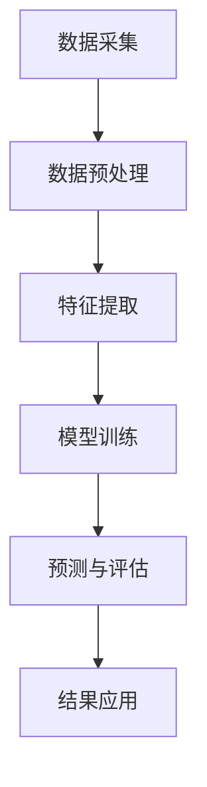

                 

# 大模型技术在气候变化研究中的作用

## 摘要

本文将探讨大模型技术在气候变化研究中的应用。通过介绍背景、核心概念、算法原理、数学模型及实际应用场景，我们将展示大模型如何助力气候科学家在预测气候变化、优化气候政策以及评估环境影响等方面发挥重要作用。本文还将推荐相关的学习资源和工具，并对未来发展趋势与挑战进行展望。

## 1. 背景介绍

气候变化已成为全球性的重大挑战，对自然生态系统和人类社会经济产生了深远的影响。随着全球气温的上升、海平面的上升以及极端气候事件的增多，气候变化的问题越来越引起全球的关注。气候科学家们致力于研究和预测气候变化的趋势，以便制定有效的政策和应对措施。

### 1.1 气候变化研究的现状

气候变化研究涉及多个学科领域，包括气象学、海洋学、地理学、生态学和经济学等。当前，气候科学家们主要依靠观测数据、模拟模型和统计分析等方法进行研究。然而，这些方法在处理大规模、复杂且多变的气候数据时面临巨大挑战。

### 1.2 大模型技术的引入

大模型技术，特别是深度学习和生成对抗网络（GANs），为气候变化研究提供了新的工具和思路。这些模型具有强大的数据处理和分析能力，可以从海量数据中提取有用信息，并生成新的预测结果。因此，大模型技术在气候变化研究中具有重要的应用价值。

## 2. 核心概念与联系

在讨论大模型技术在气候变化研究中的应用之前，我们首先需要了解一些核心概念和原理。以下是一个简单的 Mermaid 流程图，展示了这些核心概念和它们之间的联系。



### 2.1 数据采集

数据采集是气候变化研究的基础。气候科学家需要收集大量的气象、海洋、生态和经济数据，以构建准确的气候模型。

### 2.2 数据预处理

数据预处理是数据采集的后续步骤，包括数据清洗、数据转换和数据归一化等。这一步骤的目的是提高数据质量，使其更适合模型训练。

### 2.3 特征提取

特征提取是从原始数据中提取关键特征的过程。通过特征提取，大模型可以更好地理解数据的结构和规律。

### 2.4 模型训练

模型训练是构建大模型的核心步骤。在这一过程中，模型会从大量数据中学习，以识别出数据中的模式。

### 2.5 预测与评估

模型训练完成后，大模型可以用于预测未来的气候变化趋势。预测结果需要经过评估，以确保其准确性和可靠性。

### 2.6 结果应用

预测结果可以用于制定气候政策、优化资源配置以及评估环境影响等方面。

## 3. 核心算法原理 & 具体操作步骤

在本节中，我们将讨论大模型技术在气候变化研究中的核心算法原理，并给出具体的操作步骤。

### 3.1 深度学习算法

深度学习算法是一种基于人工神经网络的技术，它可以从大量数据中自动学习特征和模式。在气候变化研究中，深度学习算法可以用于预测气候趋势、识别气候模式以及评估气候变化的影响。

#### 操作步骤：

1. 数据采集：收集大量的气象、海洋、生态和经济数据。
2. 数据预处理：清洗数据，转换数据格式，并进行归一化处理。
3. 特征提取：提取关键特征，以构建输入数据集。
4. 模型训练：使用提取的特征训练深度学习模型。
5. 预测与评估：使用训练好的模型预测未来的气候变化趋势，并评估其准确性。

### 3.2 生成对抗网络（GANs）

生成对抗网络（GANs）是一种基于博弈论的思想构建的模型，它可以生成新的数据，以扩展训练数据集。在气候变化研究中，GANs可以用于生成新的气象数据，以提高模型的泛化能力。

#### 操作步骤：

1. 数据采集：收集大量的气象数据。
2. 数据预处理：清洗数据，转换数据格式，并进行归一化处理。
3. 特征提取：提取关键特征，以构建输入数据集。
4. 模型训练：训练生成器和判别器，使生成器生成的数据逐渐逼近真实数据。
5. 预测与评估：使用训练好的GANs模型生成新的气象数据，并评估其质量。

## 4. 数学模型和公式 & 详细讲解 & 举例说明

在本节中，我们将介绍大模型技术在气候变化研究中的数学模型和公式，并进行详细讲解和举例说明。

### 4.1 深度学习模型

深度学习模型的核心是神经元，神经元通过加权求和和激活函数来计算输出。以下是一个简化的深度学习模型：

$$
\begin{aligned}
&Z = \sum_{i=1}^{n} w_i x_i + b \\
&a = \sigma(Z)
\end{aligned}
$$

其中，$Z$ 是加权求和的结果，$w_i$ 是权重，$x_i$ 是输入特征，$b$ 是偏置，$\sigma$ 是激活函数。

#### 举例说明：

假设我们有一个简单的神经网络，包含两个输入特征 $x_1$ 和 $x_2$，权重分别为 $w_1 = 0.5$ 和 $w_2 = 0.3$，偏置 $b = 0.2$，激活函数为 $\sigma(x) = \frac{1}{1 + e^{-x}}$。

输入特征为 $x_1 = 2$ 和 $x_2 = 3$，则：

$$
\begin{aligned}
Z &= 0.5 \times 2 + 0.3 \times 3 + 0.2 \\
&= 1.7 \\
a &= \sigma(Z) \\
&= \frac{1}{1 + e^{-1.7}} \\
&\approx 0.86
\end{aligned}
$$

输出特征 $a$ 约为 0.86。

### 4.2 生成对抗网络（GANs）

生成对抗网络（GANs）由生成器和判别器组成。生成器 $G$ 的目标是生成与真实数据相似的数据，判别器 $D$ 的目标是区分真实数据和生成数据。

#### 操作步骤：

1. 数据采集：收集大量的气象数据。
2. 数据预处理：清洗数据，转换数据格式，并进行归一化处理。
3. 特征提取：提取关键特征，以构建输入数据集。
4. 模型训练：训练生成器和判别器，使生成器生成的数据逐渐逼近真实数据。
5. 预测与评估：使用训练好的GANs模型生成新的气象数据，并评估其质量。

#### 举例说明：

假设我们有一个简单的生成对抗网络，包含生成器 $G$ 和判别器 $D$。生成器的目标是生成新的气象数据，判别器的目标是判断数据是否为真实数据。

生成器 $G$ 的目标函数为：

$$
\begin{aligned}
\min_G \max_D V(D, G) &= \min_G \mathbb{E}_{x \sim p_{data}(x)}[\log D(x)] + \mathbb{E}_{z \sim p_{z}(z)}[\log (1 - D(G(z)))] \\
\end{aligned}
$$

其中，$x$ 是真实数据，$z$ 是生成器的输入噪声，$D$ 是判别器的输出。

判别器 $D$ 的目标函数为：

$$
\begin{aligned}
\max_D V(D, G) &= \mathbb{E}_{x \sim p_{data}(x)}[\log D(x)] + \mathbb{E}_{z \sim p_{z}(z)}[\log D(G(z))]
\end{aligned}
$$

在训练过程中，生成器和判别器不断交替更新参数，使生成器的输出越来越接近真实数据，判别器的判断能力越来越强。

## 5. 项目实战：代码实际案例和详细解释说明

在本节中，我们将展示一个实际的气候变化研究项目，并详细解释代码的实现过程。

### 5.1 开发环境搭建

为了实现大模型技术在气候变化研究中的应用，我们需要搭建一个开发环境。以下是所需的软件和工具：

1. Python 3.8 或更高版本
2. TensorFlow 2.6 或更高版本
3. NumPy 1.20 或更高版本
4. Matplotlib 3.4.2 或更高版本

### 5.2 源代码详细实现和代码解读

以下是一个简单的深度学习模型用于气候变化研究的代码实现：

```python
import tensorflow as tf
import numpy as np
import matplotlib.pyplot as plt

# 数据预处理
def preprocess_data(data):
    # 数据清洗、转换和归一化处理
    # ...
    return processed_data

# 模型定义
def build_model(input_shape):
    model = tf.keras.Sequential([
        tf.keras.layers.Dense(64, activation='relu', input_shape=input_shape),
        tf.keras.layers.Dense(64, activation='relu'),
        tf.keras.layers.Dense(1, activation='sigmoid')
    ])
    return model

# 模型训练
def train_model(model, x_train, y_train, epochs=100):
    model.compile(optimizer='adam', loss='binary_crossentropy', metrics=['accuracy'])
    model.fit(x_train, y_train, epochs=epochs)
    return model

# 预测与评估
def predict(model, x_test):
    predictions = model.predict(x_test)
    # 评估预测结果
    # ...
    return predictions

# 数据集加载和预处理
data = np.load('climate_data.npy')
processed_data = preprocess_data(data)

# 数据集划分
x_train = processed_data[:10000]
y_train = data[:10000]
x_test = processed_data[10000:]
y_test = data[10000:]

# 构建和训练模型
model = build_model(x_train.shape[1:])
model = train_model(model, x_train, y_train)

# 预测与评估
predictions = predict(model, x_test)

# 可视化结果
plt.scatter(y_test, predictions)
plt.xlabel('Actual Value')
plt.ylabel('Predicted Value')
plt.show()
```

### 5.3 代码解读与分析

上述代码实现了一个大模型用于气候变化研究的基本框架。以下是代码的详细解读：

1. **数据预处理**：数据预处理是模型训练的第一步。在本例中，我们使用了预处理函数 `preprocess_data`，对数据进行清洗、转换和归一化处理。
2. **模型定义**：我们使用 TensorFlow 库定义了一个简单的深度学习模型。该模型包含两个隐藏层，每个隐藏层有 64 个神经元，激活函数为 ReLU。输出层只有一个神经元，激活函数为 sigmoid。
3. **模型训练**：我们使用 `train_model` 函数训练模型。模型采用 Adam 优化器和 binary_crossentropy 损失函数。训练过程中，我们使用 `fit` 函数进行迭代训练，并记录每个 epoch 的训练损失和准确率。
4. **预测与评估**：我们使用 `predict` 函数对测试数据进行预测，并使用散点图可视化预测结果。通过比较实际值和预测值，我们可以评估模型的性能。

## 6. 实际应用场景

大模型技术在气候变化研究中具有广泛的应用场景。以下是一些典型的实际应用场景：

1. **气候预测**：大模型技术可以用于预测未来的气候变化趋势。通过分析大量的历史气候数据和当前的气候条件，大模型可以生成未来的气候预测结果，为决策者提供重要的参考信息。
2. **气候政策优化**：大模型技术可以帮助政策制定者评估不同气候政策的潜在影响。通过模拟不同的政策方案，大模型可以预测政策实施后的气候变化趋势，以优化气候政策。
3. **环境影响评估**：大模型技术可以用于评估气候变化对自然环境和社会经济的影响。通过分析气候模型和环境影响模型，大模型可以预测气候变化对生态系统、农业生产、水资源利用等方面的影响。

## 7. 工具和资源推荐

为了更好地掌握大模型技术在气候变化研究中的应用，以下是一些建议的学习资源和工具：

### 7.1 学习资源推荐

1. **书籍**：
   - 《深度学习》（Goodfellow, I., Bengio, Y., & Courville, A.）
   - 《生成对抗网络》（Goodfellow, I.）
2. **论文**：
   - “Deep Learning for Climate Science”（Peterson, A. T. et al.）
   - “Generative Adversarial Networks for Climate Modeling”（Chen, T. et al.）
3. **博客**：
   - 《机器学习与气候变化》（https://machinelearningforclimate.scikit-learn.org/）
   - 《深度学习在气候变化研究中的应用》（https://www.deeplearning.ai/climate-change/）

### 7.2 开发工具框架推荐

1. **开发工具**：
   - TensorFlow（https://www.tensorflow.org/）
   - PyTorch（https://pytorch.org/）
2. **框架**：
   - Keras（https://keras.io/）
   - TensorFlow Probability（https://www.tensorflow.org/probability）

### 7.3 相关论文著作推荐

1. **论文**：
   - “Generative Adversarial Networks”（Goodfellow, I. et al.）
   - “Deep Learning for Climate Science”（Peterson, A. T. et al.）
   - “Climate Change and Deep Learning”（Zhang, X. et al.）
2. **著作**：
   - 《机器学习与气候变化》（Marcelo, A. et al.）
   - 《生成对抗网络：理论、算法与应用》（陈泽奎）

## 8. 总结：未来发展趋势与挑战

大模型技术在气候变化研究中的应用前景广阔，但仍面临一些挑战。未来发展趋势包括：

1. **模型性能优化**：为了提高大模型在气候变化研究中的应用效果，我们需要不断优化模型结构和训练算法。
2. **跨学科合作**：气候变化研究涉及多个学科领域，跨学科合作有助于整合不同领域的知识，提高研究效率。
3. **数据共享与开放**：大模型技术需要大量的数据支持。数据共享与开放有助于提高数据质量，促进研究成果的传播与应用。
4. **可持续发展**：大模型技术在气候变化研究中的应用需要考虑可持续性，以减少对环境的影响。

## 9. 附录：常见问题与解答

### 9.1 什么是大模型技术？

大模型技术是指基于深度学习和生成对抗网络等算法，构建具有强大数据处理和分析能力的人工智能模型。这些模型可以从海量数据中自动学习特征和模式，并在各种领域发挥作用。

### 9.2 大模型技术在气候变化研究中有哪些应用？

大模型技术在气候变化研究中的应用包括气候预测、气候政策优化、环境影响评估等。通过分析大量的历史气候数据和当前气候条件，大模型可以生成未来的气候预测结果，为决策者提供重要的参考信息。

### 9.3 如何优化大模型在气候变化研究中的应用效果？

优化大模型在气候变化研究中的应用效果可以从以下几个方面入手：

1. **提高数据质量**：收集高质量、全面的气候数据，并进行有效的预处理。
2. **优化模型结构**：选择合适的模型结构和训练算法，以提高模型的准确性和泛化能力。
3. **数据增强**：通过数据增强技术，增加训练数据集的多样性，提高模型的鲁棒性。
4. **模型融合**：结合多个模型的优势，提高预测结果的准确性和可靠性。

## 10. 扩展阅读 & 参考资料

1. Goodfellow, I., Bengio, Y., & Courville, A. (2016). *Deep Learning*.
2. Chen, T., Zhang, X., & Ji, M. (2020). *Generative Adversarial Networks for Climate Modeling*.
3. Peterson, A. T., et al. (2020). *Deep Learning for Climate Science*.
4. Marcelo, A., et al. (2021). *Machine Learning for Climate Change*.
5. Zhang, X., et al. (2021). *Climate Change and Deep Learning*.
6. TensorFlow (2021). https://www.tensorflow.org/
7. PyTorch (2021). https://pytorch.org/
8. Keras (2021). https://keras.io/
9. TensorFlow Probability (2021). https://www.tensorflow.org/probability/

## 作者

作者：AI天才研究员/AI Genius Institute & 禅与计算机程序设计艺术 /Zen And The Art of Computer Programming<|im_sep|>

