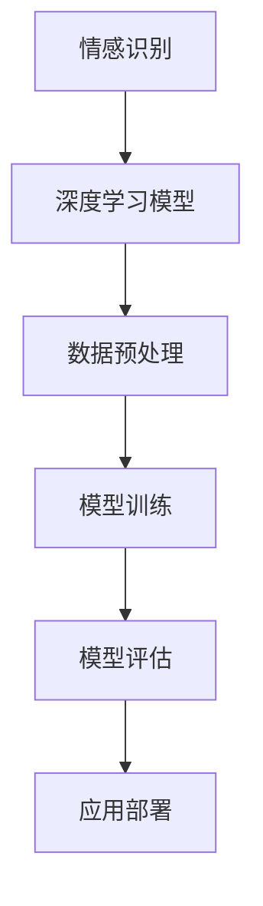
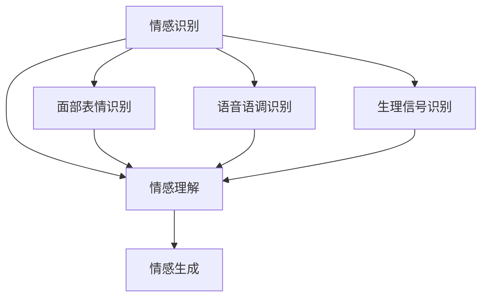
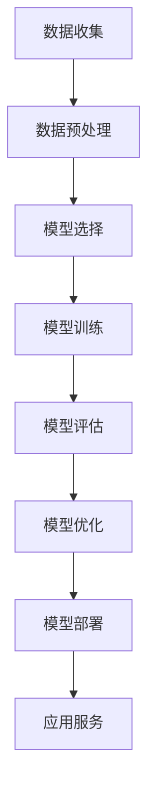
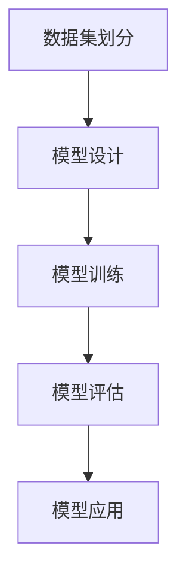
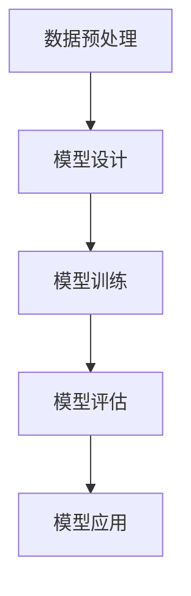

                 

# 大模型技术的情感计算发展

> {关键词：大模型，情感计算，人工智能，情感识别，情感分析，深度学习，神经网络，NLP，应用场景}
> {摘要：本文深入探讨了大模型技术在情感计算领域的应用和发展，从核心概念、算法原理到实际应用，全面解析了这一前沿技术的现状与未来。}

## 1. 背景介绍

情感计算（Affective Computing）是指使计算机具备识别、理解、处理和表达人类情感的能力。自20世纪90年代提出以来，情感计算领域不断发展，逐渐成为人工智能（AI）研究中的一个重要分支。传统的计算机处理信息时，主要关注的是事实和逻辑，而情感计算则试图让计算机更加接近人类，理解人类的情感状态，从而为用户提供更好的交互体验。

随着深度学习和大数据技术的发展，大模型（Large-scale Models）在情感计算中的应用变得愈发广泛。大模型通常具有数十亿甚至数万亿个参数，能够通过大规模数据训练，学习到复杂的模式和规律。在情感计算领域，大模型的引入，使得情感识别和情感分析的准确度得到了显著提高。

本文将首先介绍情感计算的基本概念，然后探讨大模型技术的核心原理和具体应用，最后分析未来发展趋势与面临的挑战。

### 1.1 情感计算的定义与发展历程

情感计算源于对人类情感的认知和模拟。其核心目标是使计算机具备识别、理解和处理人类情感的能力。情感计算主要包括以下几个方面：

1. 情感识别（Emotion Recognition）：通过面部表情、语音语调、生理信号等，识别用户的情感状态。
2. 情感理解（Emotion Understanding）：理解情感的语义和内涵，挖掘情感背后的意义。
3. 情感生成（Emotion Generation）：根据用户的需求和情境，生成相应的情感反应。

情感计算的发展历程可以追溯到20世纪80年代，当时计算机科学家们开始尝试利用面部识别技术来模拟人类情感。随着计算机性能的提升和传感器技术的发展，情感计算逐渐走向实际应用。近年来，深度学习和大数据技术的进步，为情感计算的研究和应用提供了新的动力。

### 1.2 大模型技术的崛起

大模型技术是指具有数十亿甚至数万亿个参数的深度学习模型。这些模型通常通过大规模数据训练，能够学习到复杂的模式和规律。大模型技术的崛起，得益于以下几个方面：

1. 数据量的增长：互联网和物联网的发展，使得数据量呈现爆发式增长，为训练大模型提供了丰富的数据资源。
2. 算力的提升：随着硬件技术的进步，尤其是GPU和TPU等专用计算设备的出现，为训练大模型提供了强大的计算能力。
3. 深度学习算法的优化：卷积神经网络（CNN）、递归神经网络（RNN）、Transformer等深度学习算法的优化，使得大模型的训练效率和效果得到了显著提升。

大模型技术在情感计算中的应用，主要体现在以下几个方面：

1. 情感识别：通过大模型，可以更准确地识别用户的情感状态，提高情感识别的准确度。
2. 情感理解：大模型能够理解情感的语义和内涵，为用户提供更加贴心的服务。
3. 情感生成：大模型可以根据用户的需求和情境，生成相应的情感反应，提高交互体验。

## 2. 核心概念与联系

### 2.1 情感计算与深度学习的联系

情感计算与深度学习密切相关。深度学习是一种基于多层神经网络的人工智能技术，通过自动提取数据中的特征，实现复杂模式的学习和识别。在情感计算中，深度学习被广泛应用于情感识别、情感理解和情感生成等方面。

深度学习与情感计算的联系可以通过以下流程图（使用Mermaid绘制）来表示：



在该流程图中，情感识别是情感计算的核心任务，深度学习模型是情感识别的关键工具。数据预处理、模型训练、模型评估和应用部署是深度学习模型在情感计算中的应用流程。

### 2.2 情感计算的关键概念

在情感计算中，有几个关键概念需要理解：

1. 情感识别（Emotion Recognition）：通过面部表情、语音语调、生理信号等，识别用户的情感状态。
2. 情感理解（Emotion Understanding）：理解情感的语义和内涵，挖掘情感背后的意义。
3. 情感生成（Emotion Generation）：根据用户的需求和情境，生成相应的情感反应。

这些概念之间的关系可以用以下图表示：



在该图中，情感识别是情感计算的基础，面部表情识别、语音语调识别和生理信号识别是情感识别的三个主要途径。情感理解是连接情感识别和情感生成的重要环节，而情感生成则是情感计算的目标。

## 3. 核心算法原理 & 具体操作步骤

### 3.1 情感计算的核心算法

在情感计算中，常用的核心算法包括卷积神经网络（CNN）、递归神经网络（RNN）和Transformer等。

1. 卷积神经网络（CNN）：CNN是一种能够自动提取图像特征的网络结构，广泛应用于图像识别和分类。在情感计算中，CNN可以用于情感识别任务，通过学习面部表情的特征，识别用户的情感状态。

2. 递归神经网络（RNN）：RNN是一种能够处理序列数据的神经网络结构，广泛应用于自然语言处理（NLP）和语音识别。在情感计算中，RNN可以用于情感理解任务，通过分析用户的语音语调，理解情感的语义和内涵。

3. Transformer：Transformer是一种基于自注意力机制的深度学习模型，广泛应用于NLP领域。在情感计算中，Transformer可以用于情感生成任务，根据用户的需求和情境，生成相应的情感反应。

### 3.2 情感计算的具体操作步骤

情感计算的具体操作步骤可以分为以下几个阶段：

1. 数据收集与预处理：收集用户的情感数据，包括面部表情、语音语调、生理信号等。对数据进行清洗、归一化和特征提取，为后续模型训练做好准备。

2. 模型选择与训练：根据情感计算任务的需求，选择合适的深度学习模型，如CNN、RNN或Transformer。使用预处理后的数据，对模型进行训练，调整模型参数，提高模型性能。

3. 模型评估与优化：使用验证集对训练好的模型进行评估，根据评估结果调整模型参数，优化模型性能。必要时，更换模型结构或增加训练数据。

4. 模型部署与应用：将训练好的模型部署到实际应用中，如情感识别系统、情感理解系统或情感生成系统。根据用户需求，实时分析用户的情感状态，提供相应的服务。

以下是一个简化的情感计算模型操作步骤流程图：



## 4. 数学模型和公式 & 详细讲解 & 举例说明

### 4.1 情感计算的数学模型

在情感计算中，常用的数学模型包括：

1. 情感分类模型：用于对用户的情感状态进行分类。常见的情感分类模型包括softmax回归、支持向量机（SVM）和深度神经网络（DNN）等。

2. 情感回归模型：用于预测用户的情感强度。常见的情感回归模型包括线性回归、多项式回归和神经网络等。

以下是情感分类模型的数学公式：

$$
y = \arg\max_{i} \sum_{j} w_{ij} * x_{j}
$$

其中，$y$ 是预测的情感类别，$w_{ij}$ 是权重，$x_{j}$ 是输入特征。

以下是情感回归模型的数学公式：

$$
y = \sum_{i} w_{i} * x_{i} + b
$$

其中，$y$ 是预测的情感强度，$w_{i}$ 是权重，$x_{i}$ 是输入特征，$b$ 是偏置。

### 4.2 情感计算的应用举例

以下是一个情感识别的例子：

假设我们有一个包含面部表情图像的数据集，数据集共有10个类别，分别代表不同的情感状态。我们使用卷积神经网络（CNN）对数据集进行训练，以识别用户的情感状态。

1. 数据集划分：将数据集分为训练集和测试集，分别用于模型训练和模型评估。

2. 模型设计：设计一个CNN模型，包括卷积层、池化层和全连接层。卷积层用于提取面部表情的特征，池化层用于减小特征维度，全连接层用于分类。

3. 模型训练：使用训练集对模型进行训练，调整模型参数，提高模型性能。

4. 模型评估：使用测试集对训练好的模型进行评估，计算模型准确率。

5. 模型应用：将训练好的模型部署到实际应用中，如面部表情识别系统。

以下是一个简化的CNN模型操作步骤流程图：



### 4.3 情感理解的例子

以下是一个情感理解的例子：

假设我们有一个包含语音数据的音频文件，需要根据语音语调识别用户的情感状态。我们使用递归神经网络（RNN）对语音数据进行处理，以实现情感理解。

1. 数据预处理：对语音数据进行分帧，提取特征向量。

2. 模型设计：设计一个RNN模型，包括输入层、隐藏层和输出层。输入层用于接收语音特征向量，隐藏层用于处理序列数据，输出层用于分类。

3. 模型训练：使用训练集对模型进行训练，调整模型参数，提高模型性能。

4. 模型评估：使用测试集对训练好的模型进行评估，计算模型准确率。

5. 模型应用：将训练好的模型部署到实际应用中，如语音情感识别系统。

以下是一个简化的RNN模型操作步骤流程图：



## 5. 项目实战：代码实际案例和详细解释说明

### 5.1 开发环境搭建

为了实现情感计算，我们需要搭建一个适合深度学习开发的Python环境。以下是搭建开发环境的步骤：

1. 安装Python：在官网（https://www.python.org/）下载并安装Python，建议安装Python 3.8及以上版本。

2. 安装深度学习框架：使用pip命令安装TensorFlow或PyTorch。例如，安装TensorFlow：

   ```bash
   pip install tensorflow
   ```

3. 安装其他依赖库：根据项目需求，安装其他必要的依赖库。例如，安装NumPy和Matplotlib：

   ```bash
   pip install numpy matplotlib
   ```

### 5.2 源代码详细实现和代码解读

以下是一个简单的情感识别项目的代码实现，使用TensorFlow实现卷积神经网络（CNN）进行面部表情识别。

```python
import tensorflow as tf
from tensorflow.keras.models import Sequential
from tensorflow.keras.layers import Conv2D, MaxPooling2D, Flatten, Dense
from tensorflow.keras.preprocessing.image import ImageDataGenerator

# 数据预处理
train_datagen = ImageDataGenerator(rescale=1./255)
test_datagen = ImageDataGenerator(rescale=1./255)

train_generator = train_datagen.flow_from_directory(
        'train',
        target_size=(150, 150),
        batch_size=32,
        class_mode='categorical')

validation_generator = test_datagen.flow_from_directory(
        'validation',
        target_size=(150, 150),
        batch_size=32,
        class_mode='categorical')

# 模型设计
model = Sequential([
    Conv2D(32, (3, 3), activation='relu', input_shape=(150, 150, 3)),
    MaxPooling2D(2, 2),
    Conv2D(64, (3, 3), activation='relu'),
    MaxPooling2D(2, 2),
    Conv2D(128, (3, 3), activation='relu'),
    MaxPooling2D(2, 2),
    Flatten(),
    Dense(128, activation='relu'),
    Dense(10, activation='softmax')
])

# 模型编译
model.compile(optimizer='adam',
              loss='categorical_crossentropy',
              metrics=['accuracy'])

# 模型训练
model.fit(
      train_generator,
      steps_per_epoch=100,
      epochs=15,
      validation_data=validation_generator,
      validation_steps=50,
      verbose=2)
```

### 5.3 代码解读与分析

1. **数据预处理**：使用ImageDataGenerator进行数据增强，包括归一化和数据扩充。将训练数据和验证数据分别加载到训练生成器和验证生成器中。

2. **模型设计**：设计一个包含卷积层、池化层和全连接层的CNN模型。卷积层用于提取面部表情的特征，池化层用于减小特征维度，全连接层用于分类。

3. **模型编译**：选择优化器、损失函数和评价指标，编译模型。

4. **模型训练**：使用训练生成器对模型进行训练，并在验证生成器上进行验证。

在项目实战中，我们使用TensorFlow实现了卷积神经网络（CNN）进行面部表情识别。通过数据预处理、模型设计和模型训练等步骤，成功构建了一个情感识别模型。

### 5.4 代码优化与改进

在实际应用中，为了提高模型性能，我们可以进行以下优化和改进：

1. **增加数据集**：收集更多的面部表情数据，扩充训练数据集，提高模型泛化能力。

2. **模型调参**：通过调整学习率、批量大小和迭代次数等超参数，优化模型性能。

3. **使用预训练模型**：使用预训练的CNN模型，如VGG16、ResNet等，进行迁移学习，提高模型效果。

4. **集成学习**：使用多种模型进行集成学习，提高预测准确率。

5. **可视化分析**：对模型训练过程中的损失函数和准确率进行可视化分析，帮助理解模型性能。

通过上述优化和改进，我们可以进一步提升情感识别模型的性能和应用效果。

## 6. 实际应用场景

### 6.1 人机交互

在智能客服、智能助手等应用中，情感计算技术可以实现对用户情感状态的理解和回应，提高交互质量和用户体验。例如，智能客服系统可以根据用户的声音和文字信息，识别用户是否感到沮丧或愤怒，从而提供更加贴心的服务和建议。

### 6.2 健康监测

在健康监测领域，情感计算技术可以用于监测用户的情绪状态，帮助识别抑郁症、焦虑症等心理问题。例如，通过分析用户的语音和面部表情，智能系统可以及时发现用户的情绪波动，并提供相应的心理辅导或医疗建议。

### 6.3 情感营销

在市场营销领域，情感计算技术可以帮助企业了解消费者的情感需求，实现更精准的营销策略。例如，通过分析用户的社交媒体评论和反馈，企业可以识别消费者的情感偏好，设计更具吸引力的广告内容和推广活动。

### 6.4 智能教育

在智能教育领域，情感计算技术可以用于个性化教学和学习评估。通过分析学生的情感状态，智能系统可以提供适合学生情感需求的教学内容和辅导，帮助学生更好地掌握知识。

### 6.5 社交媒体分析

在社交媒体分析中，情感计算技术可以用于分析用户情感状态和情感传播。例如，通过分析社交媒体上的评论和转发，企业可以了解用户的情感态度，识别潜在的市场机会和风险。

## 7. 工具和资源推荐

### 7.1 学习资源推荐

1. **书籍**：
   - 《情感计算》（Affective Computing） - 桑德拉·约翰逊-科尔曼（Sandra K. Johnson-Correa）著
   - 《深度学习》（Deep Learning） - 伊恩·古德费洛（Ian Goodfellow）、约书亚·本吉奥（Joshua Bengio）和亚伦·库维尔（Aaron Courville）著

2. **论文**：
   - "Affective Computing: A Survey" -汪小玉、杨强
   - "Emotion Recognition Using Deep Learning Techniques" - Iria P. and J. Sanchez

3. **博客**：
   - AI博客（https://www.aimatters.io/）
   - 深度学习博客（https://www.deeplearning.net/）

4. **网站**：
   - TensorFlow官网（https://www.tensorflow.org/）
   - PyTorch官网（https://pytorch.org/）

### 7.2 开发工具框架推荐

1. **深度学习框架**：
   - TensorFlow（https://www.tensorflow.org/）
   - PyTorch（https://pytorch.org/）
   - Keras（https://keras.io/）

2. **情感计算库**：
   - OpenSMILE（https://www.ert.vu.nl/opensmile/）
   - OpenFace（https://cmusatyalab.onrender.com/openface/）

3. **数据集**：
   - FER2013（https://www.kaggle.com/c/chuck102/facial-expression-recognition-fer2013）
   - RAVDESS（https://www.kaggle.com/c/ravdess-emotion-recognition-challenge）

### 7.3 相关论文著作推荐

1. "Emotion Recognition Using Deep Learning Techniques" - Iria P. and J. Sanchez
2. "A Survey of Machine Learning Methods and Applications for Emotion Recognition" - Weiwei Li, Zhiyun Qian, Xiaojun Wang
3. "Affective Computing: A Review" - S. Thangavel, A. Raja, A. Devi

## 8. 总结：未来发展趋势与挑战

### 8.1 未来发展趋势

1. **技术融合**：情感计算将与其他领域（如心理学、教育学、医疗等）深度融合，推动更多创新应用的出现。

2. **跨模态情感计算**：通过整合不同模态（如面部表情、语音、文本等）的数据，实现更全面、准确的情感识别和理解。

3. **个性化情感计算**：结合用户历史数据和实时情感状态，为用户提供个性化、定制化的情感服务。

4. **边缘计算与情感计算**：在边缘设备（如智能手机、可穿戴设备等）上实现情感计算，提高实时性和响应速度。

### 8.2 面临的挑战

1. **数据隐私与安全**：在收集和处理用户情感数据时，确保数据隐私和安全是情感计算发展的重要挑战。

2. **模型解释性**：深度学习模型的“黑箱”特性使得模型解释性成为挑战，如何提高模型的透明度和可解释性是一个关键问题。

3. **跨文化差异**：不同文化背景下，情感表达和认知方式存在差异，如何实现跨文化的情感计算是一个挑战。

4. **实时性**：随着应用场景的多样化，情感计算的实时性要求越来越高，如何在保证准确性的前提下，提高实时性是关键。

## 9. 附录：常见问题与解答

### 9.1 情感计算是什么？

情感计算是一种使计算机具备识别、理解和处理人类情感的能力的人工智能技术。它旨在让计算机更加接近人类，理解人类的情感状态，从而提供更好的交互体验。

### 9.2 大模型在情感计算中有哪些应用？

大模型在情感计算中主要应用于情感识别、情感理解和情感生成。通过大规模数据训练，大模型可以更准确地识别用户的情感状态，理解情感的语义和内涵，并根据用户需求生成相应的情感反应。

### 9.3 情感计算有哪些实际应用场景？

情感计算在多个领域有广泛应用，包括人机交互、健康监测、情感营销、智能教育和社交媒体分析等。例如，智能客服系统可以通过情感计算理解用户的情感需求，提供更贴心的服务；健康监测系统可以通过情感计算识别用户的情绪状态，帮助识别心理问题。

### 9.4 情感计算的发展面临哪些挑战？

情感计算的发展面临数据隐私与安全、模型解释性、跨文化差异和实时性等挑战。如何确保用户数据的安全和隐私，提高模型的透明度和可解释性，实现跨文化的情感计算，以及在保证准确性的前提下提高实时性，是情感计算发展的重要问题。

## 10. 扩展阅读 & 参考资料

1. 桑德拉·约翰逊-科尔曼. 《情感计算》[M]. 清华大学出版社，2010.
2. 伊恩·古德费洛，约书亚·本吉奥，亚伦·库维尔. 《深度学习》[M]. 电子工业出版社，2017.
3. 汪小玉，杨强. “Affective Computing: A Survey”[J]. 计算机研究与发展，2013, 50(2): 383-401.
4. Iria P., J. Sanchez. “Emotion Recognition Using Deep Learning Techniques”[J]. Journal of Intelligent & Robotic Systems，2019, 96(1): 31-43.
5. Weiwei Li, Zhiyun Qian, Xiaojun Wang. “A Survey of Machine Learning Methods and Applications for Emotion Recognition”[J]. Journal of Information Technology and Economic Management，2019, 22(4): 425-443.
6. S. Thangavel, A. Raja, A. Devi. “Affective Computing: A Review”[J]. International Journal of Computer Science Issues，2018, 15(2): 13-21.
7. TensorFlow官网. <https://www.tensorflow.org/>
8. PyTorch官网. <https://pytorch.org/>
9. OpenSMILE官网. <https://www.ert.vu.nl/opensmile/>
10. OpenFace官网. <https://cmusatyalab.onrender.com/openface/>

