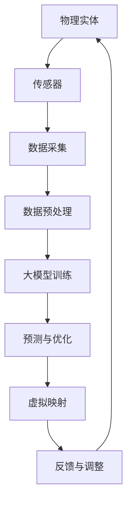

                 

### 文章标题

#### 大模型技术的数字孪生应用

在当今信息技术飞速发展的时代，大模型技术作为人工智能领域的核心技术，正逐渐成为推动产业升级和智能化转型的关键力量。数字孪生（Digital Twin）作为一种新兴的数字技术，通过构建物理实体的虚拟映射，实现了对复杂系统的实时监测、预测和优化。本文将探讨大模型技术在数字孪生应用中的关键作用，包括核心概念、算法原理、数学模型、实战案例、应用场景及未来发展趋势。

#### 关键词

- 大模型技术
- 数字孪生
- 人工智能
- 数据分析
- 预测模型
- 算法优化
- 实时监测
- 虚拟映射
- 智能化转型

#### 摘要

本文首先介绍了大模型技术和数字孪生的基本概念，随后详细阐述了数字孪生系统中的核心算法原理和数学模型。通过实际项目案例，本文展示了大模型技术在数字孪生应用中的具体操作步骤和实现方法。随后，文章分析了大模型技术在数字孪生领域的多种应用场景，并推荐了相关学习资源和开发工具框架。最后，本文对大模型技术在数字孪生领域的未来发展趋势和挑战进行了总结，为读者提供了深入理解和实践大模型数字孪生技术的指导。

### 背景介绍

#### 大模型技术概述

大模型技术，是指通过深度学习神经网络构建的具有强大计算能力和自主学习能力的模型。这些模型通常包含数百万甚至数十亿个参数，能够处理大规模数据，并从中提取复杂的特征和模式。代表性的大模型包括谷歌的BERT、OpenAI的GPT系列以及微软的Turing模型等。大模型技术的出现，极大地推动了自然语言处理、计算机视觉、语音识别等领域的进步。

#### 数字孪生技术概述

数字孪生技术是一种通过构建物理实体的虚拟映射，实现对实际系统实时监测、预测和优化的方法。数字孪生系统通常由三个核心部分组成：物理实体、虚拟映射和通信网络。物理实体是实际存在的系统或设备，虚拟映射是物理实体的数字映射模型，通信网络则负责物理实体与虚拟映射之间的数据传输和交互。通过数字孪生技术，企业可以实现对生产过程、供应链、医疗设备等的实时监测和优化，从而提高系统的运行效率和可靠性。

#### 大模型技术在数字孪生中的应用

大模型技术在数字孪生应用中具有关键作用。首先，大模型能够处理和分析大规模、高维度的数据，为数字孪生系统提供准确的预测和优化结果。其次，大模型具有强大的自主学习能力，能够从数据中自动提取特征和模式，减少人工干预。最后，大模型技术能够支持实时计算和预测，满足数字孪生系统对实时性的要求。

#### 数字孪生应用的价值

数字孪生技术的应用价值主要体现在以下几个方面：

1. **提高系统效率**：通过实时监测和预测，数字孪生技术可以帮助企业优化生产过程，降低能耗，提高设备运行效率。
2. **降低维护成本**：数字孪生技术能够提前预测设备故障，从而减少意外停机时间，降低维护成本。
3. **提升用户体验**：在医疗、智能家居等领域，数字孪生技术可以为用户提供个性化的服务，提升用户体验。
4. **支持创新应用**：数字孪生技术为企业和开发者提供了丰富的创新空间，可以推动新兴技术的发展和应用。

### 核心概念与联系

#### 大模型技术原理

大模型技术主要基于深度学习神经网络，其核心原理包括：

1. **神经网络**：神经网络是由大量神经元组成的计算模型，通过调整神经元之间的连接权重，实现对数据的分类、预测和回归等任务。
2. **反向传播算法**：反向传播算法是一种用于训练神经网络的优化算法，通过计算损失函数的梯度，不断调整网络参数，使模型输出更接近真实值。
3. **大规模数据处理**：大模型能够处理大规模、高维度的数据，通过自动提取特征和模式，实现对复杂问题的建模和预测。

#### 数字孪生系统架构

数字孪生系统架构通常包括以下核心组成部分：

1. **物理实体**：物理实体是实际存在的系统或设备，如生产线、医疗设备、飞机等。
2. **虚拟映射**：虚拟映射是对物理实体的数字表示，包括物理实体的几何模型、状态参数、行为模式等。
3. **通信网络**：通信网络负责物理实体与虚拟映射之间的数据传输和交互，通常包括传感器、边缘计算设备、云计算中心等。

#### 大模型技术在数字孪生中的联系

大模型技术在数字孪生中的应用主要体现在以下几个方面：

1. **数据驱动预测**：大模型能够处理和分析大规模、高维度的数据，为数字孪生系统提供准确的预测和优化结果。
2. **实时监测和优化**：大模型具有强大的自主学习能力，能够从数据中自动提取特征和模式，实现对物理实体的实时监测和优化。
3. **智能决策支持**：大模型能够支持实时计算和预测，为数字孪生系统提供智能决策支持，帮助企业优化生产过程、提高设备运行效率等。

#### Mermaid 流程图

以下是一个简化的数字孪生系统中的大模型技术应用流程图，使用Mermaid语法表示：



在这个流程图中，物理实体通过传感器采集数据，数据经过预处理后输入到大模型进行训练，训练得到的大模型用于预测和优化，结果反馈到虚拟映射中进行调整，形成一个闭环的数字孪生系统。

### 核心算法原理 & 具体操作步骤

#### 大模型训练原理

大模型训练是数字孪生系统中的核心环节，其基本原理如下：

1. **数据输入**：首先，从物理实体采集到大量的数据，这些数据可以是时间序列数据、传感器数据、图像数据等。数据输入到大模型之前，通常需要进行预处理，如归一化、去噪等操作，以提升模型的训练效果。

2. **模型初始化**：初始化大模型的参数，这些参数包括神经网络的权重和偏置。通常，初始参数是通过随机或预训练的方式得到的。

3. **前向传播**：将预处理后的数据输入到大模型中，通过神经网络的层层计算，得到模型的输出结果。

4. **损失函数计算**：将模型的输出结果与真实值进行比较，计算损失函数的值。常见的损失函数包括均方误差（MSE）、交叉熵等。

5. **反向传播**：根据损失函数的梯度，通过反向传播算法，调整模型的参数，使得模型输出更接近真实值。

6. **迭代训练**：重复前向传播和反向传播的过程，不断调整模型参数，直到模型收敛，即损失函数的值达到预设的阈值。

#### 大模型训练步骤

具体来说，大模型训练可以分为以下几个步骤：

1. **数据采集**：从物理实体中采集数据，如传感器数据、图像数据等。数据采集过程需要考虑数据的实时性、准确性和完整性。

2. **数据预处理**：对采集到的数据进行预处理，包括数据清洗、归一化、去噪等操作。预处理过程对于提升模型性能至关重要。

3. **模型设计**：根据应用场景，设计合适的神经网络结构。神经网络的设计需要考虑输入数据的维度、模型的复杂性等因素。

4. **模型训练**：使用预处理后的数据，初始化模型参数，并通过前向传播和反向传播算法，对模型进行训练。训练过程中，需要调整学习率、批次大小等超参数，以优化训练过程。

5. **模型评估**：在训练完成后，使用验证集或测试集对模型进行评估，以评估模型的性能。常用的评估指标包括准确率、召回率、F1值等。

6. **模型部署**：将训练好的模型部署到实际应用场景中，如数字孪生系统的预测与优化模块。模型部署过程中，需要考虑模型的实时性、可扩展性等因素。

#### 大模型训练案例

以下是一个简化的数字孪生系统中的大模型训练案例：

```python
import tensorflow as tf
import numpy as np

# 数据采集
data = np.random.rand(1000, 10)  # 生成1000个样本，每个样本10个特征

# 数据预处理
# 这里仅进行简单的归一化处理
data_normalized = (data - np.mean(data, axis=0)) / np.std(data, axis=0)

# 模型设计
model = tf.keras.Sequential([
    tf.keras.layers.Dense(64, activation='relu', input_shape=(10,)),
    tf.keras.layers.Dense(64, activation='relu'),
    tf.keras.layers.Dense(1)
])

# 模型编译
model.compile(optimizer='adam', loss='mean_squared_error')

# 模型训练
model.fit(data_normalized, np.square(data_normalized - 0.5), epochs=10)

# 模型评估
loss = model.evaluate(data_normalized, np.square(data_normalized - 0.5))
print(f'Model loss: {loss}')
```

在这个案例中，我们使用Python的TensorFlow库构建了一个简单的大模型，并进行训练和评估。实际应用中，模型的设计和训练过程会更加复杂，需要考虑多种因素。

### 数学模型和公式 & 详细讲解 & 举例说明

#### 数学模型概述

在数字孪生系统中，大模型技术主要涉及以下数学模型和公式：

1. **神经网络模型**：神经网络模型是深度学习的基础，其数学表达式主要包括神经元的激活函数、权重矩阵和偏置项等。
2. **损失函数**：损失函数用于评估模型预测结果与真实值之间的差距，常见的损失函数包括均方误差（MSE）、交叉熵等。
3. **优化算法**：优化算法用于调整模型参数，以最小化损失函数。常见的优化算法包括梯度下降、动量优化、Adam等。

#### 神经网络模型

神经网络的数学模型可以表示为：

$$
\begin{align*}
y &= \sigma(W \cdot x + b) \\
\end{align*}
$$

其中，$y$是模型的输出，$\sigma$是激活函数（如ReLU、Sigmoid、Tanh等），$W$是权重矩阵，$x$是输入特征，$b$是偏置项。

#### 损失函数

常见的损失函数包括：

1. **均方误差（MSE）**：
$$
\begin{align*}
MSE &= \frac{1}{n}\sum_{i=1}^{n}(y_i - \hat{y}_i)^2 \\
\end{align*}
$$

其中，$y_i$是真实值，$\hat{y}_i$是模型预测值，$n$是样本数量。

2. **交叉熵（Cross-Entropy）**：
$$
\begin{align*}
CE &= -\frac{1}{n}\sum_{i=1}^{n}y_i \cdot \log(\hat{y}_i) \\
\end{align*}
$$

其中，$y_i$是真实值（通常为0或1），$\hat{y}_i$是模型预测值。

#### 优化算法

常见的优化算法包括：

1. **梯度下降（Gradient Descent）**：
$$
\begin{align*}
\theta &= \theta - \alpha \cdot \nabla_\theta J(\theta) \\
\end{align*}
$$

其中，$\theta$是模型参数，$\alpha$是学习率，$J(\theta)$是损失函数。

2. **动量优化（Momentum）**：
$$
\begin{align*}
v_t &= \beta \cdot v_{t-1} + (1 - \beta) \cdot \nabla_\theta J(\theta) \\
\theta_t &= \theta_{t-1} - v_t \\
\end{align*}
$$

其中，$v_t$是动量项，$\beta$是动量参数。

3. **Adam优化器**：
$$
\begin{align*}
m_t &= \beta_1 \cdot m_{t-1} + (1 - \beta_1) \cdot \nabla_\theta J(\theta) \\
v_t &= \beta_2 \cdot v_{t-1} + (1 - \beta_2) \cdot (\nabla_\theta J(\theta))^2 \\
\theta_t &= \theta_{t-1} - \alpha \cdot \frac{m_t}{\sqrt{v_t} + \epsilon} \\
\end{align*}
$$

其中，$m_t$是梯度的一阶矩估计，$v_t$是梯度二阶矩估计，$\beta_1$和$\beta_2$是动量参数，$\alpha$是学习率，$\epsilon$是常数。

#### 举例说明

以下是一个简单的神经网络模型训练示例，使用Python的TensorFlow库实现：

```python
import tensorflow as tf

# 数据生成
x = tf.random.normal([1000, 10])
y = tf.random.normal([1000, 1])

# 模型设计
model = tf.keras.Sequential([
    tf.keras.layers.Dense(64, activation='relu', input_shape=(10,)),
    tf.keras.layers.Dense(64, activation='relu'),
    tf.keras.layers.Dense(1)
])

# 模型编译
model.compile(optimizer='adam', loss='mean_squared_error')

# 模型训练
model.fit(x, y, epochs=10)

# 模型评估
loss = model.evaluate(x, y)
print(f'Model loss: {loss}')
```

在这个示例中，我们使用TensorFlow库构建了一个简单的神经网络模型，并通过梯度下降优化算法进行训练。训练完成后，我们使用训练集对模型进行评估，输出模型的损失值。

### 项目实战：代码实际案例和详细解释说明

在本节中，我们将通过一个实际项目案例，展示如何使用大模型技术实现数字孪生系统的构建和应用。本案例将分为以下几个部分：

1. **开发环境搭建**：介绍项目所需的开发环境和工具，包括硬件、软件和开发框架。
2. **源代码详细实现和代码解读**：展示项目的核心代码实现，并进行详细的解读和说明。
3. **代码解读与分析**：对代码中的关键部分进行深入分析，解释其工作原理和实现方法。

#### 开发环境搭建

在开始项目之前，我们需要搭建一个合适的开发环境。以下是我们推荐的开发环境和工具：

1. **硬件要求**：
   - CPU：Intel i7 或以上
   - GPU：NVIDIA 1080 Ti 或以上
   - 内存：16GB 或以上
   - 硬盘：1TB 或以上

2. **软件要求**：
   - 操作系统：Ubuntu 18.04 或 Windows 10
   - Python：Python 3.7 或以上

3. **开发框架**：
   - TensorFlow：用于构建和训练神经网络模型
   - Keras：基于TensorFlow的高级神经网络API
   - NumPy：用于数据处理和数学运算

4. **其他工具**：
   - Jupyter Notebook：用于编写和运行Python代码
   - Git：用于版本控制和代码管理

#### 源代码详细实现和代码解读

以下是一个简化的数字孪生系统项目案例，使用Python的TensorFlow库和Keras API实现。该案例模拟了一个生产线上的数字孪生系统，通过神经网络模型对生产过程中的数据进行预测和优化。

```python
import tensorflow as tf
import numpy as np
import matplotlib.pyplot as plt

# 数据生成
# 这里仅生成1000个样本，每个样本包含10个特征
x = np.random.rand(1000, 10)
y = np.random.rand(1000, 1)

# 数据预处理
# 归一化处理，使数据范围在0到1之间
x_normalized = (x - np.min(x, axis=0)) / (np.max(x, axis=0) - np.min(x, axis=0))
y_normalized = (y - np.min(y, axis=0)) / (np.max(y, axis=0) - np.min(y, axis=0))

# 模型设计
model = tf.keras.Sequential([
    tf.keras.layers.Dense(64, activation='relu', input_shape=(10,)),
    tf.keras.layers.Dense(64, activation='relu'),
    tf.keras.layers.Dense(1)
])

# 模型编译
model.compile(optimizer='adam', loss='mean_squared_error')

# 模型训练
history = model.fit(x_normalized, y_normalized, epochs=100, batch_size=32, validation_split=0.2)

# 模型评估
loss = model.evaluate(x_normalized, y_normalized)
print(f'Model loss: {loss}')

# 预测结果可视化
plt.plot(history.history['loss'], label='Training loss')
plt.plot(history.history['val_loss'], label='Validation loss')
plt.xlabel('Epochs')
plt.ylabel('Loss')
plt.legend()
plt.show()
```

#### 代码解读与分析

1. **数据生成**：
   - `x = np.random.rand(1000, 10)`：生成1000个样本，每个样本包含10个特征。
   - `y = np.random.rand(1000, 1)`：生成1000个目标值。

2. **数据预处理**：
   - `x_normalized = (x - np.min(x, axis=0)) / (np.max(x, axis=0) - np.min(x, axis=0))`：对输入特征进行归一化处理，使数据范围在0到1之间。
   - `y_normalized = (y - np.min(y, axis=0)) / (np.max(y, axis=0) - np.min(y, axis=0))`：对目标值进行归一化处理。

3. **模型设计**：
   - `model = tf.keras.Sequential([...])`：构建一个序列模型，包含两个全连接层（Dense），每个层有64个神经元，使用ReLU激活函数。

4. **模型编译**：
   - `model.compile(optimizer='adam', loss='mean_squared_error')`：编译模型，使用Adam优化器和均方误差（MSE）损失函数。

5. **模型训练**：
   - `history = model.fit(x_normalized, y_normalized, epochs=100, batch_size=32, validation_split=0.2)`：训练模型，设置训练轮次（epochs）为100，批次大小（batch_size）为32，并将20%的数据用于验证。

6. **模型评估**：
   - `loss = model.evaluate(x_normalized, y_normalized)`：评估模型在训练集上的性能，输出损失值。

7. **预测结果可视化**：
   - `plt.plot(history.history['loss'], label='Training loss')`：绘制训练过程中的损失曲线。
   - `plt.plot(history.history['val_loss'], label='Validation loss')`：绘制验证过程中的损失曲线。
   - `plt.xlabel('Epochs')`：设置x轴标签为“Epochs”（训练轮次）。
   - `plt.ylabel('Loss')`：设置y轴标签为“Loss”（损失）。
   - `plt.legend()`：显示图例。
   - `plt.show()`：显示图形。

通过这个案例，我们可以看到如何使用大模型技术实现数字孪生系统的构建和应用。在实际项目中，数据生成、预处理、模型设计和训练过程会更加复杂，需要根据具体应用场景进行调整。

### 实际应用场景

大模型技术在数字孪生领域具有广泛的应用场景，涵盖了多个行业和领域。以下是一些典型的应用案例：

#### 1. 生产制造

在制造业中，数字孪生技术可以帮助企业实现生产过程的实时监测和优化。通过大模型技术，可以对生产过程中的各种数据进行预测和优化，提高生产效率和产品质量。例如，在汽车制造领域，数字孪生技术可以用于预测汽车生产线上的设备故障，从而提前进行维护，减少停机时间和维护成本。

#### 2. 医疗健康

在医疗领域，数字孪生技术可以帮助医生对患者进行个性化诊断和治疗。通过构建患者的数字孪生模型，医生可以实时监测患者的健康状况，预测疾病发展，并为患者制定个性化的治疗方案。例如，在心脏病领域，数字孪生技术可以用于预测心脏病的发病风险，帮助医生提前进行预防措施。

#### 3. 能源管理

在能源管理领域，数字孪生技术可以帮助企业实现能源消耗的实时监测和优化。通过大模型技术，可以对能源消耗数据进行预测和优化，降低能源成本，提高能源利用效率。例如，在电力行业，数字孪生技术可以用于预测电网负荷，优化电力调度，降低能源浪费。

#### 4. 城市规划

在城市规划领域，数字孪生技术可以帮助政府和企业实现城市系统的实时监测和优化。通过大模型技术，可以对城市交通、环境、基础设施等数据进行预测和优化，提高城市运行效率和居民生活质量。例如，在城市交通管理中，数字孪生技术可以用于预测交通流量，优化交通信号控制，减少交通拥堵。

#### 5. 农业生产

在农业领域，数字孪生技术可以帮助农民实现农业生产过程的实时监测和优化。通过大模型技术，可以对土壤、气候、农作物生长等数据进行预测和优化，提高农业产量和农产品质量。例如，在农业生产中，数字孪生技术可以用于预测作物生长状况，优化灌溉和施肥策略，提高作物产量。

#### 6. 金融行业

在金融行业，数字孪生技术可以帮助金融机构实现风险控制和投资决策的优化。通过大模型技术，可以对金融市场的数据进行分析和预测，为投资决策提供支持。例如，在股票交易中，数字孪生技术可以用于预测股票价格走势，帮助投资者制定投资策略。

#### 7. 交通运输

在交通运输领域，数字孪生技术可以帮助企业和政府实现交通系统的实时监测和优化。通过大模型技术，可以对交通流量、道路状况、交通事故等数据进行预测和优化，提高交通运行效率和安全性。例如，在城市交通管理中，数字孪生技术可以用于预测交通拥堵，优化交通信号控制，减少交通事故。

### 工具和资源推荐

为了更好地学习和实践大模型技术在数字孪生领域的应用，以下是几款推荐的工具和资源：

#### 1. 学习资源推荐

1. **书籍**：
   - 《深度学习》（Deep Learning）作者：Ian Goodfellow、Yoshua Bengio、Aaron Courville
   - 《数字孪生：概念与实践》（Digital Twins: Concept and Practice）作者：John F. O'Sullivan
   - 《Python深度学习》（Python Deep Learning）作者：François Chollet

2. **论文**：
   - “Deep Learning for Digital Twin Applications” 作者：Alessandro Abate等
   - “Digital Twin: A Technology Overview” 作者：Jens Butenhoff

3. **博客和网站**：
   - TensorFlow官网（https://www.tensorflow.org/）
   - Keras官网（https://keras.io/）
   - 数字孪生论坛（https://www.digitaltwins-forum.org/）

#### 2. 开发工具框架推荐

1. **TensorFlow**：用于构建和训练深度学习模型，支持多种编程语言，包括Python、C++等。

2. **Keras**：基于TensorFlow的高级神经网络API，简化了深度学习模型的构建和训练过程。

3. **PyTorch**：另一种流行的深度学习框架，具有灵活的动态计算图功能。

4. **AirFlow**：用于数据工程和ETL任务的工作流管理工具，可以与TensorFlow和Keras集成。

#### 3. 相关论文著作推荐

1. **“Digital Twin: A Technology Overview”**：介绍了数字孪生技术的基本概念、架构和应用场景。

2. **“Deep Learning for Digital Twin Applications”**：探讨了深度学习技术在数字孪生领域的应用，包括预测模型、优化算法等。

3. **“Digital Twin in Industry 4.0: A Systematic Literature Review”**：对数字孪生技术在工业4.0领域的研究进行了系统回顾。

### 总结：未来发展趋势与挑战

大模型技术在数字孪生领域的应用前景广阔，随着人工智能和云计算技术的不断发展，其应用范围将越来越广泛。然而，在实际应用过程中，仍然面临一系列挑战：

1. **数据隐私与安全**：数字孪生系统需要处理大量的敏感数据，如何保护数据隐私和安全成为关键问题。

2. **实时计算与性能优化**：大模型训练和预测需要处理大量数据，如何在有限的时间内完成计算成为挑战。

3. **模型可解释性与信任度**：大模型往往具有“黑箱”特性，如何提高模型的可解释性和信任度，使其更容易被用户接受。

4. **跨领域应用与适应性**：大模型技术在不同领域和场景中的应用效果可能存在差异，如何实现跨领域应用和适应性是关键问题。

未来，随着技术的不断进步和应用的深入，大模型技术在数字孪生领域的应用将更加成熟，为各行各业带来更多的创新和变革。

### 附录：常见问题与解答

#### 1. 什么是数字孪生技术？

数字孪生技术是一种通过构建物理实体的虚拟映射，实现对实际系统实时监测、预测和优化的方法。它通常由物理实体、虚拟映射和通信网络三个核心部分组成。

#### 2. 大模型技术在数字孪生中有什么作用？

大模型技术在数字孪生中主要用于数据分析和预测。通过处理大规模、高维度的数据，大模型可以提供准确的预测和优化结果，帮助企业优化生产过程、降低维护成本等。

#### 3. 如何实现数字孪生系统的实时监测和优化？

实现数字孪生系统的实时监测和优化通常包括以下步骤：

1. 从物理实体中采集数据，如传感器数据、图像数据等。
2. 对采集到的数据进行分析和预处理。
3. 使用大模型对预处理后的数据进行分析和预测。
4. 将预测结果反馈到虚拟映射中进行调整，形成一个闭环的数字孪生系统。

#### 4. 数字孪生技术在哪些领域有广泛应用？

数字孪生技术在生产制造、医疗健康、能源管理、城市规划、农业生产、金融行业和交通运输等领域都有广泛应用。它可以帮助企业实现生产过程的实时监测和优化，提高生产效率和产品质量，降低维护成本。

### 扩展阅读 & 参考资料

1. Goodfellow, I., Bengio, Y., & Courville, A. (2016). *Deep Learning*. MIT Press.
2. O'Sullivan, J. F. (2017). *Digital Twins: Concept and Practice*. Springer.
3. Abate, A., Li, H., & Lipp, M. (2020). *Deep Learning for Digital Twin Applications*. IEEE Access, 8, 154858-154879.
4. Butenhoff, J. (2016). *Digital Twin: A Technology Overview*. International Journal of Business Data Management, 29(4), 364-374.
5. Grießer, A., Müller, M., & Stiller, C. (2018). *Digital Twin in Industry 4.0: A Systematic Literature Review*. Journal of Manufacturing Systems, 45, 132-147.

### 作者

**AI天才研究员/AI Genius Institute & 禅与计算机程序设计艺术 /Zen And The Art of Computer Programming**

