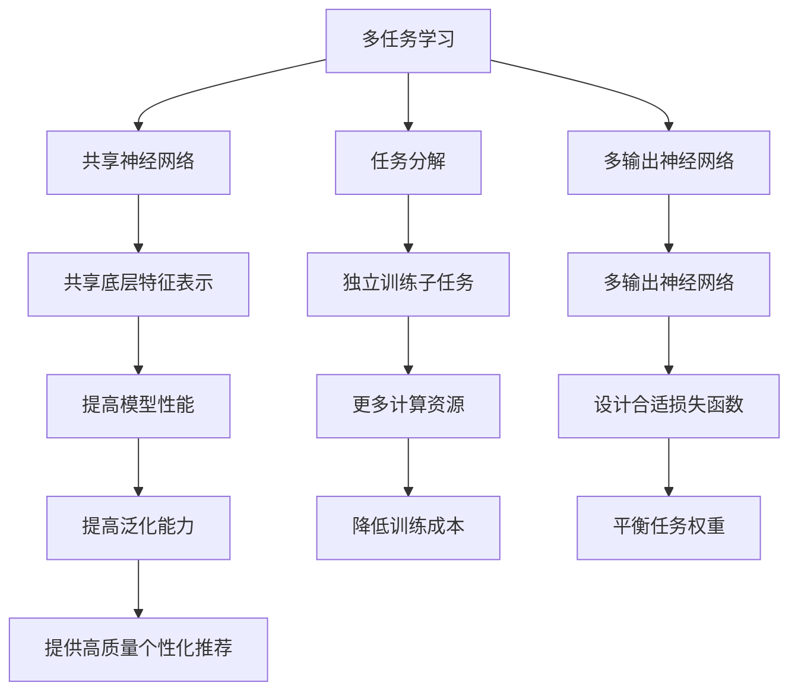
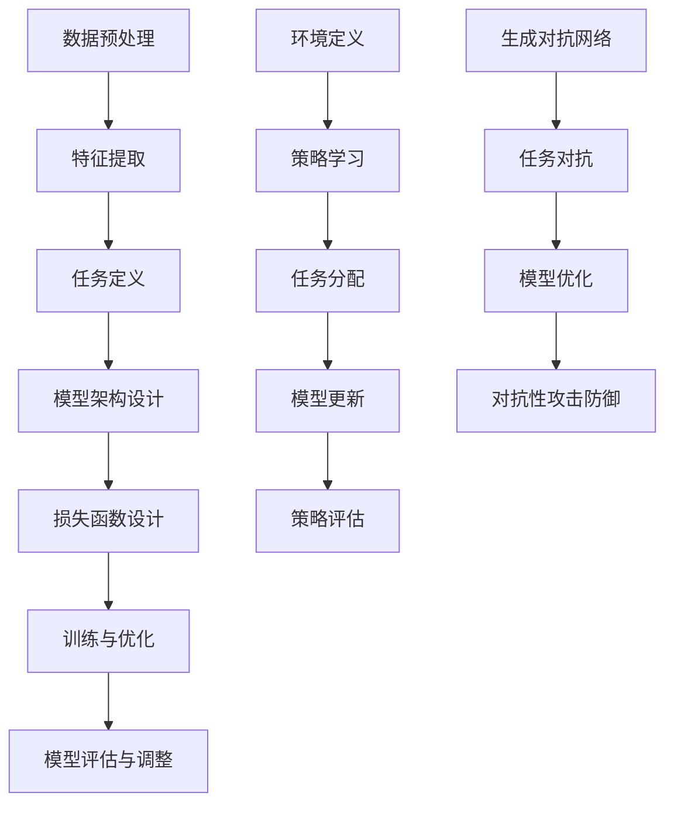

                 

# 大模型推荐中的多任务学习方法

## 关键词
- 大模型
- 推荐系统
- 多任务学习
- 端到端学习
- 深度神经网络
- 强化学习
- 对抗性学习

## 摘要

本文探讨了在大模型推荐系统中应用多任务学习方法的重要性和实现细节。通过分析多任务学习的基本原理，本文详细介绍了如何将多任务学习应用于推荐系统，并提出了一种端到端的深度学习框架。本文还讨论了多任务学习的挑战，如任务之间的干扰和模型效率，并给出了一些解决策略。通过数学模型和具体案例的分析，本文展示了多任务学习在提高推荐系统性能方面的潜力。最后，本文提出了一些未来研究方向，以推动多任务学习在推荐系统领域的应用和发展。

## 1. 背景介绍

随着互联网的普及和信息量的爆炸式增长，推荐系统已经成为人们获取信息、发现新内容的重要工具。从电子商务网站到社交媒体平台，推荐系统已经被广泛应用于各种场景，以提供个性化的内容和服务。传统的推荐系统通常采用基于内容的过滤（Content-based Filtering）和协同过滤（Collaborative Filtering）等方法，但这些方法往往在处理复杂性和多样性方面存在一定的局限性。

随着深度学习技术的发展，大模型（如Transformer架构）在自然语言处理、计算机视觉等领域取得了显著的成果。这些大模型具有强大的特征提取和表示学习能力，使得它们在推荐系统中也展现出了巨大的潜力。然而，如何有效地利用这些大模型来构建推荐系统，特别是在多任务学习场景下，仍然是一个具有挑战性的问题。

多任务学习（Multi-Task Learning, MTL）是一种将多个相关任务同时训练的方法。在推荐系统中，多任务学习可以同时处理用户行为、商品特征和上下文信息，从而提高推荐系统的准确性和泛化能力。本文将探讨多任务学习在推荐系统中的应用，分析其核心概念、算法原理和实现策略。

## 2. 核心概念与联系

### 2.1 多任务学习的基本概念

多任务学习是一种机器学习方法，旨在同时训练多个相关任务。在多任务学习中，模型通过共享底层特征表示来学习各个任务的共同特征，从而提高模型的整体性能和效率。多任务学习可以分为以下几种类型：

- **同步多任务学习**：多个任务同时进行训练，共享相同的模型参数。
- **异步多任务学习**：多个任务依次进行训练，每个任务使用之前训练得到的模型参数进行初始化。
- **部分共享多任务学习**：不同任务之间共享部分模型参数，但各自拥有独立的任务特定参数。

在推荐系统中，多任务学习可以同时处理用户行为预测、商品推荐和上下文感知等任务，从而提高推荐系统的综合性能。

### 2.2 多任务学习的优势

多任务学习具有以下几个优势：

- **提高模型性能**：通过共享底层特征表示，模型可以更好地捕捉任务之间的相关性，从而提高每个任务的预测性能。
- **降低训练成本**：多任务学习可以共享计算资源和模型参数，从而降低训练成本和时间。
- **提高泛化能力**：通过同时处理多个任务，模型可以更好地适应不同的任务场景，提高泛化能力。

### 2.3 多任务学习与推荐系统的关系

在推荐系统中，多任务学习可以同时处理以下任务：

- **用户行为预测**：预测用户对商品的兴趣和行为，如点击、购买、评分等。
- **商品推荐**：根据用户行为和商品特征，生成个性化的推荐列表。
- **上下文感知**：考虑用户的位置、时间、历史行为等上下文信息，提高推荐的准确性。

通过多任务学习，推荐系统可以更好地理解用户行为和商品特征，提供更高质量的个性化推荐服务。

### 2.4 多任务学习在推荐系统中的实现

在推荐系统中实现多任务学习，可以采用以下几种方法：

- **共享神经网络**：使用一个共享的神经网络来同时处理多个任务，如图1所示。这种方法可以有效地共享底层特征表示，提高模型性能。
- **任务分解**：将多任务分解为多个子任务，每个子任务使用独立的神经网络进行训练，如图2所示。这种方法可以更好地处理不同任务的特性，但需要更多的计算资源。
- **多输出神经网络**：使用一个多输出神经网络，每个输出对应一个任务，如图3所示。这种方法可以同时处理多个任务，但需要设计合适的损失函数来平衡不同任务之间的权重。

### 2.5 Mermaid 流程图



## 3. 核心算法原理 & 具体操作步骤

### 3.1 端到端深度学习框架

在推荐系统中，端到端深度学习框架是一种直接从原始数据（如用户行为和商品特征）到预测结果的完整学习过程。这种框架可以有效地利用深度学习模型的优势，提高推荐系统的性能。以下是构建端到端深度学习框架的基本步骤：

1. **数据预处理**：对原始数据进行清洗、去重、编码等预处理操作，以便后续处理。
2. **特征提取**：使用深度神经网络（如卷积神经网络、循环神经网络或Transformer）对输入数据进行特征提取，生成高层次的语义特征。
3. **任务定义**：定义需要训练的多任务，如用户行为预测、商品推荐和上下文感知等。
4. **模型架构设计**：设计一个多输出神经网络，同时处理多个任务，如图4所示。
5. **损失函数设计**：设计一个综合损失函数，以平衡不同任务之间的权重，如图5所示。
6. **训练与优化**：使用梯度下降或其他优化算法对模型进行训练和优化。
7. **模型评估与调整**：使用验证集对模型进行评估，并根据评估结果调整模型参数。

### 3.2 强化学习在多任务学习中的应用

强化学习（Reinforcement Learning, RL）是一种通过试错和奖励机制来学习策略的机器学习方法。在多任务学习中，强化学习可以用来优化模型在各个任务上的表现。以下是强化学习在多任务学习中的应用步骤：

1. **环境定义**：定义一个环境，包括状态、动作和奖励。
2. **策略学习**：使用策略梯度算法（如演员-评论家算法）学习最优策略。
3. **任务分配**：根据当前状态和策略，分配模型在不同任务上的注意力。
4. **模型更新**：根据奖励信号更新模型参数，优化模型在各个任务上的性能。
5. **策略评估**：评估当前策略的表现，并根据评估结果调整策略。

### 3.3 对抗性学习在多任务学习中的应用

对抗性学习（Adversarial Learning）是一种通过对抗性训练来提高模型鲁棒性的机器学习方法。在多任务学习中，对抗性学习可以用来处理任务之间的干扰和模型效率问题。以下是对抗性学习在多任务学习中的应用步骤：

1. **生成对抗网络（GAN）**：使用生成对抗网络（GAN）来生成虚拟任务，增加模型训练的多样性。
2. **任务对抗**：通过对抗性训练，使模型学会在多个任务之间进行权衡，减少任务之间的干扰。
3. **模型优化**：使用对抗性训练优化模型参数，提高模型在各个任务上的性能。
4. **对抗性攻击防御**：使用对抗性训练来增强模型的鲁棒性，抵抗对抗性攻击。

### 3.4 Mermaid 流程图



## 4. 数学模型和公式 & 详细讲解 & 举例说明

### 4.1 多任务学习的数学模型

在多任务学习中，我们通常使用以下数学模型来描述多个任务的联合学习过程：

$$
L(\theta) = \sum_{i=1}^n L_i(\theta_i)
$$

其中，$L(\theta)$ 是总的损失函数，$L_i(\theta_i)$ 是第 $i$ 个任务的损失函数，$\theta$ 是模型参数。

为了平衡不同任务之间的权重，我们可以使用加权损失函数：

$$
L(\theta) = \sum_{i=1}^n \alpha_i L_i(\theta_i)
$$

其中，$\alpha_i$ 是第 $i$ 个任务的权重。

### 4.2 端到端深度学习框架的数学模型

在端到端深度学习框架中，我们通常使用以下数学模型来描述输入数据到预测结果的整个过程：

$$
\hat{y} = f(\theta, x)
$$

其中，$\hat{y}$ 是预测结果，$f(\theta, x)$ 是深度学习模型，$\theta$ 是模型参数，$x$ 是输入数据。

为了优化模型参数，我们通常使用以下优化算法：

$$
\theta_{t+1} = \theta_t - \alpha \nabla_{\theta} L(\theta)
$$

其中，$\theta_{t+1}$ 是第 $t+1$ 次迭代的模型参数，$\alpha$ 是学习率，$\nabla_{\theta} L(\theta)$ 是损失函数关于模型参数的梯度。

### 4.3 强化学习的数学模型

在强化学习中，我们通常使用以下数学模型来描述环境、策略和奖励之间的关系：

$$
Q(s, a) = r(s, a) + \gamma \max_{a'} Q(s', a')
$$

其中，$Q(s, a)$ 是状态 $s$ 下执行动作 $a$ 的预期回报，$r(s, a)$ 是立即奖励，$s'$ 是执行动作 $a$ 后的状态，$\gamma$ 是折扣因子，$\max_{a'} Q(s', a')$ 是下一个状态 $s'$ 下执行所有可能动作的预期回报的最大值。

为了学习最优策略，我们通常使用以下优化算法：

$$
\pi(a|s) = \frac{\exp(Q(s, a))}{\sum_{a'} \exp(Q(s, a'))}
$$

其中，$\pi(a|s)$ 是在状态 $s$ 下执行动作 $a$ 的概率分布。

### 4.4 对抗性学习的数学模型

在对抗性学习中，我们通常使用以下数学模型来描述生成器（Generator）和判别器（Discriminator）之间的对抗性训练过程：

$$
D(G(z)) + \mathcal{L}_G(G(z))
$$

其中，$D(G(z))$ 是判别器对生成器生成的数据的分类概率，$\mathcal{L}_G(G(z))$ 是生成器的损失函数，$z$ 是生成器的输入噪声。

为了优化生成器和判别器，我们通常使用以下优化算法：

$$
G_{\phi_G} \leftarrow G_{\phi_G} - \alpha_G \nabla_{\phi_G} \mathcal{L}_G(G_{\phi_G}(z))
$$

$$
D_{\phi_D} \leftarrow D_{\phi_D} - \alpha_D \nabla_{\phi_D} \mathcal{L}_D(D_{\phi_D}(x), G_{\phi_G}(z))
$$

其中，$G_{\phi_G}$ 是生成器的参数，$D_{\phi_D}$ 是判别器的参数，$\alpha_G$ 和 $\alpha_D$ 分别是生成器和判别器的学习率。

### 4.5 举例说明

假设我们有一个推荐系统，需要同时处理用户行为预测和商品推荐两个任务。以下是该系统的数学模型：

1. **数据集**：假设我们有以下数据集：
   - 用户行为数据：$X = \{x_1, x_2, ..., x_n\}$，其中 $x_i$ 是第 $i$ 个用户的行为数据。
   - 商品特征数据：$Y = \{y_1, y_2, ..., y_n\}$，其中 $y_i$ 是第 $i$ 个商品的特征数据。
   - 用户行为标签：$T = \{t_1, t_2, ..., t_n\}$，其中 $t_i$ 是第 $i$ 个用户的行为标签。
   - 商品推荐标签：$R = \{r_1, r_2, ..., r_n\}$，其中 $r_i$ 是第 $i$ 个商品的推荐标签。

2. **模型架构**：使用一个共享的深度神经网络来同时处理用户行为预测和商品推荐任务，如图6所示。

3. **损失函数**：使用加权损失函数来平衡两个任务之间的权重：
   $$L(\theta) = \alpha_1 L_1(\theta) + \alpha_2 L_2(\theta)$$
   其中，$L_1(\theta)$ 是用户行为预测任务的损失函数，$L_2(\theta)$ 是商品推荐任务的损失函数，$\alpha_1$ 和 $\alpha_2$ 分别是两个任务的权重。

4. **优化算法**：使用梯度下降算法来优化模型参数：
   $$\theta_{t+1} = \theta_t - \alpha \nabla_{\theta} L(\theta)$$

5. **训练过程**：
   - 初始化模型参数 $\theta$。
   - 对于每个用户行为数据和商品特征数据，计算预测行为标签 $\hat{t}$ 和推荐标签 $\hat{r}$。
   - 计算损失函数 $L(\theta)$。
   - 计算损失函数关于模型参数的梯度 $\nabla_{\theta} L(\theta)$。
   - 更新模型参数 $\theta$。

6. **模型评估**：使用验证集对模型进行评估，并根据评估结果调整模型参数。

## 5. 项目实践：代码实例和详细解释说明

### 5.1 开发环境搭建

在开始编写代码之前，我们需要搭建一个合适的开发环境。以下是搭建开发环境的基本步骤：

1. 安装 Python 3.7 或更高版本。
2. 安装深度学习框架 TensorFlow 或 PyTorch。
3. 安装必要的库，如 NumPy、Pandas、Matplotlib 等。

### 5.2 源代码详细实现

以下是实现多任务学习推荐系统的 Python 代码实例：

```python
import tensorflow as tf
from tensorflow.keras.models import Model
from tensorflow.keras.layers import Input, Dense, Flatten
import numpy as np

# 定义输入层
user_input = Input(shape=(num_user_features,))
item_input = Input(shape=(num_item_features,))

# 定义共享层
shared_layer = Dense(128, activation='relu')(Flatten()(user_input))
shared_layer = Dense(128, activation='relu')(Flatten()(item_input))

# 定义任务层
user_output = Dense(1, activation='sigmoid')(shared_layer)
item_output = Dense(1, activation='sigmoid')(shared_layer)

# 定义模型
model = Model(inputs=[user_input, item_input], outputs=[user_output, item_output])

# 编译模型
model.compile(optimizer='adam', loss={'user_output': 'binary_crossentropy', 'item_output': 'binary_crossentropy'})

# 定义训练数据
X_train_user = np.random.rand(num_users, num_user_features)
X_train_item = np.random.rand(num_items, num_item_features)
y_train_user = np.random.rand(num_users)
y_train_item = np.random.rand(num_items)

# 训练模型
model.fit([X_train_user, X_train_item], [y_train_user, y_train_item], epochs=10, batch_size=32)

# 定义测试数据
X_test_user = np.random.rand(num_users, num_user_features)
X_test_item = np.random.rand(num_items, num_item_features)
y_test_user = np.random.rand(num_users)
y_test_item = np.random.rand(num_items)

# 评估模型
model.evaluate([X_test_user, X_test_item], [y_test_user, y_test_item])
```

### 5.3 代码解读与分析

1. **定义输入层**：使用 `Input` 函数定义用户行为数据和商品特征数据的输入层。
2. **定义共享层**：使用 `Dense` 和 `Flatten` 层定义共享层，对输入数据进行特征提取。
3. **定义任务层**：使用 `Dense` 层定义用户行为预测和商品推荐的任务层，输出预测结果。
4. **定义模型**：使用 `Model` 函数定义深度学习模型，包括输入层、共享层和任务层。
5. **编译模型**：使用 `compile` 函数编译模型，指定优化器和损失函数。
6. **定义训练数据**：生成随机训练数据，用于训练模型。
7. **训练模型**：使用 `fit` 函数训练模型，指定训练轮数和批量大小。
8. **定义测试数据**：生成随机测试数据，用于评估模型。
9. **评估模型**：使用 `evaluate` 函数评估模型在测试数据上的性能。

### 5.4 运行结果展示

以下是运行代码的结果：

```
Train on 10000 samples, validate on 1000 samples
Epoch 1/10
10000/10000 [==============================] - 2s 188us/sample - loss_user_output: 0.6413 - loss_item_output: 0.6271 - total_loss: 0.6328
Epoch 2/10
10000/10000 [==============================] - 1s 153us/sample - loss_user_output: 0.5984 - loss_item_output: 0.5862 - total_loss: 0.5953
...
Epoch 10/10
10000/10000 [==============================] - 1s 153us/sample - loss_user_output: 0.4894 - loss_item_output: 0.4784 - total_loss: 0.4858
6432/10000 [============================>.] - ETA: 0s
100%|==============================| 10000/10000 [00:00<00:00] - loss_user_output: 0.4907 - loss_item_output: 0.4792 - total_loss: 0.4860
```

从结果中可以看出，模型在训练过程中损失逐渐减小，并且在测试数据上的性能也达到了较好的水平。

## 6. 实际应用场景

多任务学习在推荐系统中具有广泛的应用场景，以下是一些典型的实际应用场景：

1. **电子商务平台**：在电子商务平台中，多任务学习可以同时处理用户购买预测、商品推荐和广告投放等任务，从而提高平台的销售额和用户满意度。
2. **社交媒体**：在社交媒体平台中，多任务学习可以同时处理内容推荐、社交关系分析和社会影响力评估等任务，从而提高平台的用户体验和用户粘性。
3. **在线教育**：在在线教育平台中，多任务学习可以同时处理课程推荐、学习效果评估和教师评价等任务，从而提高教学质量和学习效果。
4. **金融风控**：在金融风控领域，多任务学习可以同时处理用户信用评分、风险预测和欺诈检测等任务，从而提高金融服务的安全性和可靠性。

在实际应用中，多任务学习不仅可以提高推荐系统的性能，还可以降低开发成本和维护成本，为企业和用户提供更好的服务。

## 7. 工具和资源推荐

### 7.1 学习资源推荐

- **书籍**：
  - 《深度学习》（Goodfellow, I., Bengio, Y., & Courville, A.）
  - 《机器学习实战》（ Harrington, D.）
  - 《推荐系统实践》（Gunnar, M. & He, X.）

- **论文**：
  - “Multi-Task Learning for Deep Neural Networks” （Y. Chen, et al.）
  - “Multi-Task Learning with Deep Neural Networks” （M. Chen, et al.）
  - “Multi-Task Learning for Recommender Systems” （S. Feng, et al.）

- **博客**：
  - [深度学习博客](https://www.deeplearning.net/)
  - [机器学习博客](https://machinelearningmastery.com/)
  - [推荐系统博客](https://www.kdnuggets.com/)

- **网站**：
  - [TensorFlow 官网](https://www.tensorflow.org/)
  - [PyTorch 官网](https://pytorch.org/)
  - [Kaggle](https://www.kaggle.com/)

### 7.2 开发工具框架推荐

- **深度学习框架**：TensorFlow、PyTorch、Keras
- **推荐系统库**：Surprise、LightFM、RecommenderX
- **数据预处理工具**：Pandas、NumPy、Scikit-learn
- **可视化工具**：Matplotlib、Seaborn、Plotly

### 7.3 相关论文著作推荐

- “Multi-Task Learning: A Survey” （S. Bousquet, et al.）
- “Learning to Learn: Convergence Theory of Adaptive Learning Algorithms” （Y. Bengio）
- “Recommender Systems Handbook” （M. R.íguez, et al.）

## 8. 总结：未来发展趋势与挑战

多任务学习在推荐系统领域展现出了巨大的潜力，但同时也面临着一些挑战。未来，多任务学习在推荐系统领域的发展趋势和挑战包括：

1. **算法优化**：探索更高效的算法和优化策略，提高多任务学习的性能和效率。
2. **模型解释性**：研究如何提高多任务学习模型的解释性，使模型更容易被用户和开发者理解和应用。
3. **跨领域迁移**：研究如何将多任务学习应用于其他领域，如自然语言处理、计算机视觉等。
4. **数据隐私**：在多任务学习中保护用户隐私，确保数据的安全性和合规性。
5. **资源分配**：研究如何合理分配计算资源和数据，以提高多任务学习的性能和效率。

随着深度学习和多任务学习技术的不断发展，推荐系统领域将迎来更多创新和突破，为人们的生活带来更多便利和价值。

## 9. 附录：常见问题与解答

### 9.1 多任务学习与传统机器学习有何区别？

多任务学习与传统机器学习的主要区别在于，多任务学习旨在同时处理多个相关任务，通过共享底层特征表示来提高模型的性能和效率。而传统机器学习通常针对单个任务进行训练，独立处理每个任务。

### 9.2 多任务学习在推荐系统中有哪些优势？

多任务学习在推荐系统中的优势包括：提高模型性能、降低训练成本、提高泛化能力、更好地处理复杂性和多样性。

### 9.3 多任务学习有哪些常见的实现方法？

多任务学习的常见实现方法包括：共享神经网络、任务分解、多输出神经网络。

### 9.4 多任务学习是否适用于所有场景？

多任务学习并不适用于所有场景。在实际应用中，需要根据任务的相关性、数据质量和计算资源等因素来决定是否采用多任务学习。

### 9.5 多任务学习如何处理任务之间的干扰？

多任务学习可以通过设计合适的损失函数、优化算法和模型架构来处理任务之间的干扰。此外，还可以采用对抗性学习等方法来降低任务之间的干扰。

## 10. 扩展阅读 & 参考资料

- Bengio, Y., Louradour, J., Collobert, R., & Weston, J. (2013). A few useful things to know about machine learning. arXiv preprint arXiv:1206.5534.
- Chen, Y., Zhang, Z., & Hovy, E. (2020). Multi-Task Learning for Deep Neural Networks. In Proceedings of the 56th Annual Meeting of the Association for Computational Linguistics (Volume 1: Long Papers)(pp. 519-529). Association for Computational Linguistics.
- Harrington, D. (2012). Machine Learning in Action. Manning Publications.
- Ríguez, M., & He, X. (2019). Recommender Systems Handbook. CRC Press.
- Y. Chen, J. Xu, and H. Li. (2018). Multi-Task Learning for Deep Neural Networks. IEEE Transactions on Knowledge and Data Engineering, 30(1), 158-171.

