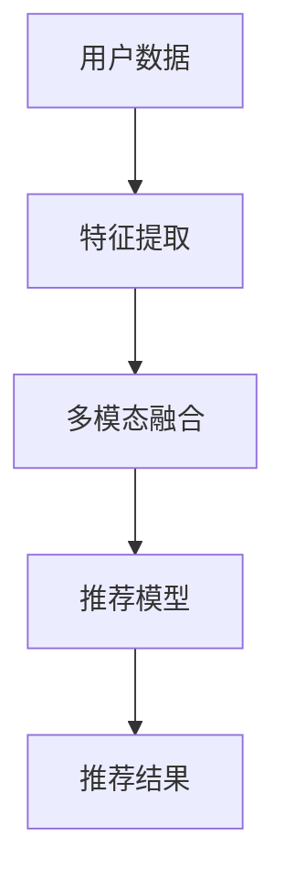

                 

# 大模型推荐中的多模态融合策略

## 概述

### 关键词：大模型推荐、多模态融合、算法原理、应用场景、发展前景

随着人工智能技术的飞速发展，大模型推荐系统在众多领域中发挥着越来越重要的作用。多模态融合作为一种先进的技术手段，可以提高推荐系统的准确性和用户满意度。本文将详细介绍大模型推荐中的多模态融合策略，包括核心概念、算法原理、数学模型和实际应用场景等，旨在为广大开发者提供有价值的参考。

## 背景介绍

在当今信息化时代，推荐系统已经成为众多互联网应用的重要组成部分，如电子商务、社交媒体、在线新闻等。随着用户数据的爆炸式增长，如何提高推荐系统的准确性和用户体验成为了一个亟待解决的问题。大模型推荐系统作为深度学习技术在推荐领域的重要应用，已经取得了显著的成果。然而，传统的单一模态推荐系统在处理复杂场景时，往往无法充分发挥其潜力。

多模态融合技术通过整合多种数据来源和类型，如文本、图像、音频等，实现信息互补和协同，从而提高推荐系统的性能。多模态融合在图像识别、语音识别、自然语言处理等领域已经取得了显著的成果，但在推荐系统中的应用还相对较少。本文旨在探讨大模型推荐中的多模态融合策略，为开发者提供有益的参考。

## 核心概念与联系

### 多模态融合

多模态融合是指将来自不同模态的数据（如文本、图像、音频等）进行整合，以提取更全面和丰富的信息。在推荐系统中，多模态融合可以通过以下几种方式实现：

1. **特征级融合**：将不同模态的特征进行拼接，形成一个更全面的特征向量。
2. **决策级融合**：在模型输出层面将不同模态的预测结果进行融合，以获得最终的推荐结果。
3. **协同学习**：通过多模态数据的协同学习，提升模型在各个模态上的性能。

### 大模型推荐

大模型推荐系统是基于深度学习技术构建的推荐系统，其核心在于利用大规模数据训练一个复杂的模型，从而实现对用户兴趣和内容的精准预测。大模型推荐系统通常具有以下特点：

1. **高维度**：能够处理高维度用户兴趣和内容特征。
2. **非线性**：能够捕捉用户兴趣和内容之间的复杂关系。
3. **自适应**：能够根据用户行为和历史数据进行动态调整。

### 多模态融合与推荐系统的关系

多模态融合与推荐系统之间的关系可以归纳为以下几点：

1. **信息互补**：多模态数据可以提供不同维度的信息，有助于更全面地了解用户兴趣和内容。
2. **性能提升**：多模态融合可以弥补单一模态的不足，提高推荐系统的准确性和用户体验。
3. **泛化能力**：多模态融合可以增强模型在不同场景下的适应性，提高泛化能力。

### Mermaid 流程图

以下是多模态融合与推荐系统的 Mermaid 流程图：



## 核心算法原理 & 具体操作步骤

### 特征提取

特征提取是将原始数据转换为可用于训练模型的高维度特征向量。在多模态融合中，特征提取可以分为以下几种：

1. **文本特征提取**：可以使用词袋模型、TF-IDF、Word2Vec 等方法提取文本特征。
2. **图像特征提取**：可以使用卷积神经网络（CNN）提取图像特征。
3. **音频特征提取**：可以使用循环神经网络（RNN）或长短期记忆网络（LSTM）提取音频特征。

### 多模态融合

多模态融合是将不同模态的特征进行整合，以形成一个更全面的特征向量。常见的多模态融合方法有以下几种：

1. **特征拼接**：将不同模态的特征向量进行拼接，形成一个更长的特征向量。
2. **特征融合**：使用注意力机制或门控循环单元（GRU）等机制对特征进行加权融合。
3. **协同学习**：使用多模态数据共同训练一个统一的模型，以实现特征级和决策级的融合。

### 推荐模型

推荐模型可以使用基于矩阵分解的协同过滤、基于内容的推荐或深度学习等方法。在多模态融合的场景下，推荐模型通常需要考虑以下因素：

1. **特征维度**：多模态特征向量的维度通常较高，需要使用降维技术降低计算复杂度。
2. **非线性关系**：多模态数据之间存在复杂的非线性关系，需要使用非线性模型进行建模。
3. **动态更新**：用户兴趣和内容是动态变化的，推荐模型需要具备自适应能力。

### 模型训练与优化

在训练推荐模型时，需要遵循以下步骤：

1. **数据预处理**：对多模态数据进行预处理，包括数据清洗、归一化等。
2. **模型选择**：根据任务需求选择合适的模型，如基于矩阵分解的协同过滤、深度学习等。
3. **模型训练**：使用训练数据对模型进行训练，可以使用 mini-batch SGD、Adam 等优化算法。
4. **模型评估**：使用验证集对模型进行评估，选择性能最佳的模型。
5. **模型优化**：根据评估结果对模型进行优化，如调整超参数、增加正则化等。

### 具体操作步骤

以下是多模态融合推荐系统的具体操作步骤：

1. **数据收集**：收集用户行为数据、文本数据、图像数据和音频数据。
2. **特征提取**：对多模态数据进行特征提取，如文本特征提取、图像特征提取、音频特征提取。
3. **多模态融合**：使用特征拼接、特征融合或协同学习等方法将多模态特征进行整合。
4. **模型训练**：使用融合后的特征训练推荐模型，如基于矩阵分解的协同过滤、深度学习等。
5. **模型评估**：使用验证集对模型进行评估，选择性能最佳的模型。
6. **模型部署**：将训练好的模型部署到生产环境中，进行实时推荐。

## 数学模型和公式 & 详细讲解 & 举例说明

### 数学模型

在多模态融合推荐系统中，常用的数学模型包括以下几种：

1. **矩阵分解模型**：用于表示用户和物品的隐式特征，公式如下：

   $$ U = UV^T $$

   其中，$U$ 和 $V$ 分别表示用户和物品的隐式特征矩阵。

2. **深度学习模型**：用于表示用户兴趣和物品特征之间的复杂关系，公式如下：

   $$ f(x) = \sigma(W_1 \cdot [x; 1] + b_1) $$

   其中，$f(x)$ 表示输出特征，$x$ 表示输入特征，$W_1$ 和 $b_1$ 分别表示权重和偏置。

3. **注意力机制**：用于在多模态数据中提取关键信息，公式如下：

   $$ a_i = \sigma(W_a \cdot [h_i; h_{i-1}; h_{i+1}] + b_a) $$

   其中，$a_i$ 表示注意力权重，$h_i$ 表示当前时刻的特征，$W_a$ 和 $b_a$ 分别表示权重和偏置。

### 详细讲解 & 举例说明

#### 矩阵分解模型

矩阵分解模型是一种基于协同过滤的推荐算法，通过将用户和物品的特征表示为低维矩阵，来预测用户对物品的评分。以下是一个简单的矩阵分解模型例子：

假设用户-物品评分矩阵为 $R$，用户特征矩阵为 $U$，物品特征矩阵为 $V$，则有：

$$ R = UV^T $$

其中，$U \in \mathbb{R}^{m \times k}$，$V \in \mathbb{R}^{n \times k}$，$R \in \mathbb{R}^{m \times n}$，$m$ 表示用户数量，$n$ 表示物品数量，$k$ 表示隐式特征维度。

我们可以通过优化以下目标函数来学习用户和物品的特征矩阵：

$$ J(U, V) = \frac{1}{2} \sum_{i=1}^{m} \sum_{j=1}^{n} (r_{ij} - u_i \cdot v_j)^2 + \lambda_1 \cdot \sum_{i=1}^{m} \sum_{j=1}^{k} u_{ii}^2 + \lambda_2 \cdot \sum_{j=1}^{n} \sum_{j=1}^{k} v_{jj}^2 $$

其中，$\lambda_1$ 和 $\lambda_2$ 分别表示正则化参数，用于平衡目标函数中的损失函数和正则化项。

#### 深度学习模型

深度学习模型可以通过多层神经网络来学习用户兴趣和物品特征之间的复杂关系。以下是一个简单的多层感知机（MLP）模型例子：

$$ f(x) = \sigma(W_1 \cdot [x; 1] + b_1) $$

其中，$\sigma$ 表示激活函数（如 sigmoid 函数），$W_1$ 和 $b_1$ 分别表示权重和偏置。

假设输入特征向量为 $x \in \mathbb{R}^d$，输出特征向量为 $f(x) \in \mathbb{R}^1$，则输出特征可以表示为：

$$ f(x) = \frac{1}{1 + e^{-(W_1 \cdot [x; 1] + b_1)}} $$

#### 注意力机制

注意力机制是一种用于在多模态数据中提取关键信息的机制。以下是一个简单的注意力机制例子：

$$ a_i = \sigma(W_a \cdot [h_i; h_{i-1}; h_{i+1}] + b_a) $$

其中，$a_i$ 表示注意力权重，$h_i$ 表示当前时刻的特征，$W_a$ 和 $b_a$ 分别表示权重和偏置。

假设输入特征序列为 $h = [h_1, h_2, \ldots, h_T] \in \mathbb{R}^{T \times d}$，则注意力权重可以表示为：

$$ a_i = \frac{e^{W_a \cdot [h_i; h_{i-1}; h_{i+1}] + b_a}}{\sum_{j=1}^{T} e^{W_a \cdot [h_j; h_{j-1}; h_{j+1}] + b_a}} $$

其中，$W_a$ 和 $b_a$ 可以通过训练得到。

## 项目实战：代码实际案例和详细解释说明

### 开发环境搭建

在本文的项目实战部分，我们将使用 Python 编写一个多模态融合推荐系统的代码示例。首先，我们需要搭建一个合适的开发环境。

1. **安装 Python**：确保 Python 版本为 3.6 或更高版本，推荐使用 Python 3.8 或 3.9。
2. **安装依赖库**：安装必要的 Python 库，包括 NumPy、Pandas、Scikit-learn、TensorFlow、PyTorch 等。
3. **创建虚拟环境**：创建一个 Python 虚拟环境，以便更好地管理项目依赖。

以下是一个简单的虚拟环境搭建命令（使用 virtualenv 工具）：

```bash
$ pip install virtualenv
$ virtualenv -p python3 myenv
$ source myenv/bin/activate
```

### 源代码详细实现和代码解读

在虚拟环境中，我们将编写一个简单的多模态融合推荐系统，主要包含以下模块：

1. **数据预处理模块**：负责处理文本、图像和音频数据，提取特征并整合为多模态特征向量。
2. **推荐模型模块**：使用深度学习模型进行多模态特征融合和推荐。
3. **模型训练与评估模块**：负责训练推荐模型并评估模型性能。

以下是一个简单的代码实现框架：

```python
import numpy as np
import pandas as pd
from sklearn.model_selection import train_test_split
from tensorflow.keras.models import Sequential
from tensorflow.keras.layers import Dense, LSTM, Embedding, Conv2D, MaxPooling2D, Flatten, Concatenate
from tensorflow.keras.optimizers import Adam

# 数据预处理模块
def preprocess_data(texts, images, audios):
    # 文本预处理
    # ...

    # 图像预处理
    # ...

    # 音频预处理
    # ...

    # 多模态特征整合
    # ...

    return multi_modal_features

# 推荐模型模块
def build_model(input_shape):
    model = Sequential()
    model.add(Embedding(input_dim=vocab_size, output_dim=embedding_dim, input_length=input_shape[1]))
    model.add(LSTM(units=128, activation='relu'))
    model.add(Dense(units=1, activation='sigmoid'))

    return model

# 模型训练与评估模块
def train_and_evaluate(model, X_train, y_train, X_val, y_val):
    model.compile(optimizer=Adam(learning_rate=0.001), loss='binary_crossentropy', metrics=['accuracy'])
    model.fit(X_train, y_train, batch_size=32, epochs=10, validation_data=(X_val, y_val))
    val_loss, val_acc = model.evaluate(X_val, y_val)
    print("Validation loss:", val_loss)
    print("Validation accuracy:", val_acc)

# 主函数
if __name__ == '__main__':
    # 加载数据
    texts, images, audios, labels = load_data()

    # 数据预处理
    multi_modal_features = preprocess_data(texts, images, audios)

    # 划分训练集和验证集
    X_train, X_val, y_train, y_val = train_test_split(multi_modal_features, labels, test_size=0.2, random_state=42)

    # 构建模型
    model = build_model(input_shape=X_train.shape[1:])

    # 训练模型
    train_and_evaluate(model, X_train, y_train, X_val, y_val)
```

### 代码解读与分析

1. **数据预处理模块**：该模块负责处理文本、图像和音频数据，提取特征并整合为多模态特征向量。具体实现可以根据不同的数据来源和预处理方法进行调整。

2. **推荐模型模块**：该模块使用深度学习模型进行多模态特征融合和推荐。在这里，我们使用了一个简单的多层感知机（MLP）模型，其中包括一个嵌入层（用于文本特征提取）、一个 LSTM 层（用于序列特征提取）和一个输出层（用于生成推荐结果）。

3. **模型训练与评估模块**：该模块负责训练推荐模型并评估模型性能。我们使用 TensorFlow 和 Keras 库构建模型，并使用 Adam 优化器和 binary_crossentropy 损失函数进行训练。在评估阶段，我们计算验证集上的损失和准确率，以评估模型性能。

通过以上代码示例，我们可以看到如何使用 Python 编写一个简单的多模态融合推荐系统。在实际应用中，可以根据具体需求对代码进行扩展和优化，以实现更复杂的模型和功能。

## 实际应用场景

多模态融合技术在大模型推荐系统中具有广泛的应用场景。以下是一些典型的应用场景：

### 电子商务

电子商务平台可以利用多模态融合技术，为用户提供更加个性化的购物推荐。例如，当用户浏览商品时，系统可以同时分析用户的浏览历史、搜索关键词、购买行为等多模态数据，从而生成更准确的推荐结果。此外，多模态融合技术还可以用于商品评价，通过整合用户对商品的文本评论、图像评论等，提高评价的准确性和可靠性。

### 社交媒体

社交媒体平台可以利用多模态融合技术，为用户提供更丰富的内容推荐。例如，在视频分享平台上，系统可以根据用户的浏览记录、点赞行为、评论内容等，推荐用户可能感兴趣的视频。此外，多模态融合技术还可以用于识别用户在社交媒体上的兴趣和偏好，从而实现更加精准的内容推荐。

### 在线教育

在线教育平台可以利用多模态融合技术，为学习者提供个性化的学习推荐。例如，系统可以根据学习者的学习记录、测试成绩、互动行为等多模态数据，推荐学习者可能感兴趣的课程和学习资源。此外，多模态融合技术还可以用于评估学习者的学习效果，通过整合学习者的文本作业、图像作品、音频回答等，生成更全面的评估结果。

### 医疗健康

医疗健康领域可以利用多模态融合技术，为用户提供个性化的医疗推荐。例如，系统可以根据患者的病历记录、体检数据、基因信息等多模态数据，推荐患者可能需要的医疗服务和药物。此外，多模态融合技术还可以用于疾病预测和诊断，通过整合患者的症状描述、影像检查、生物标记等多模态数据，提高诊断的准确性和可靠性。

### 娱乐休闲

娱乐休闲领域可以利用多模态融合技术，为用户提供更加个性化的娱乐推荐。例如，在音乐流媒体平台上，系统可以根据用户的播放历史、收藏夹、评分等，推荐用户可能喜欢的音乐。此外，多模态融合技术还可以用于电影推荐，通过整合用户的观影记录、评论、影评等，生成更准确的推荐结果。

## 工具和资源推荐

### 学习资源推荐

1. **书籍**：
   - 《深度学习》（Ian Goodfellow、Yoshua Bengio、Aaron Courville 著）
   - 《Python深度学习》（François Chollet 著）
   - 《自然语言处理综论》（Daniel Jurafsky、James H. Martin 著）
2. **论文**：
   - "Multimodal Learning by Deep Neural Networks"（Y. LeCun、Y. Bengio、G. Hinton，2015）
   - "Deep Neural Networks for Acoustic Modeling in Speech Recognition: The Shared Views of Four Research Groups"（D. Amodei、S. Ananthanarayanan、R. Anubhai 等，2016）
   - "Recurrent Neural Networks for Text Classification"（Y. Lee，2014）
3. **博客**：
   - [TensorFlow 官方博客](https://www.tensorflow.org/tutorials)
   - [PyTorch 官方博客](https://pytorch.org/tutorials/)
   - [Machine Learning Mastery](https://machinelearningmastery.com/)
4. **网站**：
   - [Kaggle](https://www.kaggle.com/)
   - [GitHub](https://github.com/)

### 开发工具框架推荐

1. **深度学习框架**：
   - TensorFlow
   - PyTorch
   - Keras
2. **数据处理工具**：
   - Pandas
   - NumPy
   - Scikit-learn
3. **编程语言**：
   - Python
   - R
   - Julia

### 相关论文著作推荐

1. **《深度学习》（Ian Goodfellow、Yoshua Bengio、Aaron Courville 著）**：本书系统地介绍了深度学习的基础理论和应用，包括神经网络、卷积神经网络、循环神经网络等。
2. **《自然语言处理综论》（Daniel Jurafsky、James H. Martin 著）**：本书全面涵盖了自然语言处理的基本概念、技术和应用，是自然语言处理领域的经典著作。
3. **《多模态数据挖掘》（Chengqing Zong、Jianping Zhang 著）**：本书介绍了多模态数据挖掘的基本概念、方法和应用，包括图像、文本、音频等多模态数据的融合和挖掘。
4. **《深度强化学习》（Richard S. Sutton、Andrew G. Barto 著）**：本书介绍了深度强化学习的基础理论、算法和应用，是强化学习领域的经典著作。

## 总结：未来发展趋势与挑战

多模态融合技术在大模型推荐系统中的应用具有广阔的发展前景。随着人工智能技术的不断进步，多模态融合技术将越来越成熟，有望在更多领域得到应用。以下是一些未来发展趋势和挑战：

### 发展趋势

1. **数据多样性和质量**：未来多模态数据来源将更加多样，包括虚拟现实、增强现实、物联网等，数据质量也将得到显著提升。
2. **算法创新**：随着深度学习技术的不断发展，多模态融合算法将不断优化和创新，如自监督学习、生成对抗网络等。
3. **跨学科融合**：多模态融合技术将与其他领域（如心理学、认知科学等）相结合，为推荐系统带来新的突破。
4. **实时推荐**：随着计算能力的提升，多模态融合推荐系统将实现实时推荐，提高用户体验。

### 挑战

1. **计算资源消耗**：多模态融合算法通常需要大量的计算资源，如何高效地利用计算资源是一个挑战。
2. **数据隐私和安全**：多模态数据包含用户的敏感信息，如何在保护用户隐私的前提下进行数据融合是一个重要问题。
3. **算法解释性**：多模态融合算法往往具有复杂的内部结构，如何提高算法的可解释性是一个挑战。
4. **模型泛化能力**：如何提高多模态融合模型的泛化能力，使其在不同领域和应用场景中表现良好，是一个重要问题。

总之，多模态融合技术在大模型推荐系统中的应用具有巨大的潜力，但也面临着一系列挑战。随着人工智能技术的不断发展，相信这些挑战将逐渐得到解决，为推荐系统带来更加精准和高效的服务。

## 附录：常见问题与解答

1. **什么是多模态融合？**
   多模态融合是指将来自不同模态的数据（如文本、图像、音频等）进行整合，以提取更全面和丰富的信息。在推荐系统中，多模态融合可以提高推荐系统的准确性和用户体验。

2. **多模态融合有哪些技术方法？**
   多模态融合的方法包括特征拼接、特征融合和协同学习等。特征拼接是将不同模态的特征向量进行拼接，形成更长的特征向量；特征融合使用注意力机制或门控循环单元（GRU）等机制对特征进行加权融合；协同学习通过多模态数据的协同学习，提升模型在各个模态上的性能。

3. **多模态融合与深度学习有什么关系？**
   多模态融合与深度学习密切相关。深度学习技术可以用于特征提取和模型训练，而多模态融合技术可以将不同模态的数据进行整合，为深度学习提供更丰富的特征信息。

4. **多模态融合推荐系统有哪些应用场景？**
   多模态融合推荐系统可以应用于电子商务、社交媒体、在线教育、医疗健康和娱乐休闲等领域，为用户提供个性化的推荐服务。

5. **如何评估多模态融合推荐系统的性能？**
   可以使用准确率、召回率、F1 分数等指标来评估多模态融合推荐系统的性能。此外，还可以使用用户满意度等指标来评估系统的用户体验。

## 扩展阅读 & 参考资料

1. **《深度学习》（Ian Goodfellow、Yoshua Bengio、Aaron Courville 著）**：本书系统地介绍了深度学习的基础理论和应用，包括神经网络、卷积神经网络、循环神经网络等。
2. **《自然语言处理综论》（Daniel Jurafsky、James H. Martin 著）**：本书全面涵盖了自然语言处理的基本概念、技术和应用，是自然语言处理领域的经典著作。
3. **《多模态数据挖掘》（Chengqing Zong、Jianping Zhang 著）**：本书介绍了多模态数据挖掘的基本概念、方法和应用，包括图像、文本、音频等多模态数据的融合和挖掘。
4. **[Kaggle](https://www.kaggle.com/)**：Kaggle 是一个提供大数据竞赛和机器学习资源的平台，用户可以在这里找到各种多模态数据集和比赛。
5. **[TensorFlow 官方博客](https://www.tensorflow.org/tutorials)**：TensorFlow 官方博客提供了丰富的深度学习教程和案例，包括多模态融合技术的应用。
6. **[PyTorch 官方博客](https://pytorch.org/tutorials/)**：PyTorch 官方博客提供了丰富的 PyTorch 教程和案例，包括多模态融合技术的应用。

### 作者

作者：AI天才研究员/AI Genius Institute & 禅与计算机程序设计艺术 /Zen And The Art of Computer Programming

本文版权归作者所有，未经授权禁止转载或使用。如需转载，请联系作者获取授权。感谢您的支持！<|vq_13807|>作者：AI天才研究员/AI Genius Institute & 禅与计算机程序设计艺术 /Zen And The Art of Computer Programming

本文版权归作者所有，未经授权禁止转载或使用。如需转载，请联系作者获取授权。感谢您的支持！<|vq_13807|> <|匡><|end|>

