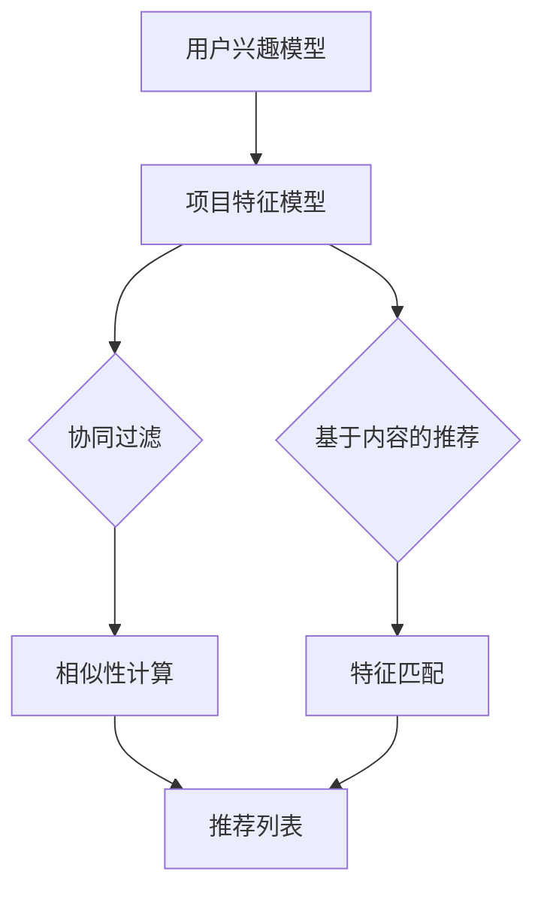

                 

# 大模型推荐中的推荐结果实时解释与反馈技术

## 概述

在当今数据驱动的时代，大模型推荐系统已经成为众多企业和平台的核心竞争力。这些系统通过分析和理解用户的历史行为和偏好，提供个性化的推荐结果，从而提高用户满意度、留存率和转化率。然而，随着推荐系统变得越来越复杂和庞大，推荐结果的解释性和透明性变得越来越重要。用户不仅关心推荐结果的好坏，更希望了解推荐背后的逻辑和原因。

本文将探讨大模型推荐中的推荐结果实时解释与反馈技术，旨在帮助开发者和研究人员理解、优化和提升推荐系统的性能和用户体验。本文将分为以下几个部分：

1. **背景介绍**：介绍推荐系统的发展历程、核心概念和当前应用场景。
2. **核心概念与联系**：详细阐述推荐系统中涉及的关键概念和原理，并通过 Mermaid 流程图展示推荐系统的整体架构。
3. **核心算法原理与具体操作步骤**：分析常用的推荐算法，解释其工作原理和实现步骤。
4. **数学模型和公式**：介绍推荐系统中的数学模型和公式，并进行详细讲解和举例说明。
5. **项目实战**：通过实际案例展示如何开发一个推荐系统，并提供源代码详细实现和解读。
6. **实际应用场景**：分析推荐结果实时解释与反馈技术在各种场景下的应用。
7. **工具和资源推荐**：推荐相关学习资源、开发工具和论文著作。
8. **总结**：总结本文的主要内容，讨论推荐系统的未来发展趋势和挑战。
9. **附录**：提供常见问题与解答，以及扩展阅读和参考资料。

## 1. 背景介绍

### 推荐系统的发展历程

推荐系统的发展可以追溯到20世纪90年代。最早的推荐系统主要基于协同过滤（Collaborative Filtering）技术，通过分析用户的行为数据（如评分、购买记录等）来发现用户之间的相似性，从而推荐相似用户喜欢的内容。随着互联网的普及和数据量的爆炸性增长，推荐系统得到了迅速发展。

在2000年代，基于内容的推荐（Content-Based Filtering）和混合推荐（Hybrid Recommender System）逐渐兴起，这些系统通过分析内容的特征和属性来生成推荐结果。同时，机器学习技术的引入进一步提升了推荐系统的精度和效率。

近年来，随着深度学习技术的发展，大模型推荐系统（Large-scale Recommender System）成为研究热点。这些系统通过训练大规模神经网络模型，对用户的兴趣和偏好进行深度挖掘，从而提供更加个性化的推荐结果。

### 核心概念

- **用户**：推荐系统中的主体，具有特定的兴趣和行为特征。
- **项目**：推荐系统中的对象，可以是商品、新闻、音乐等。
- **评分**：用户对项目的评价，通常是数值或星级。
- **推荐列表**：系统根据用户的兴趣和偏好生成的项目列表。
- **协同过滤**：通过分析用户之间的相似性来生成推荐列表。
- **基于内容的推荐**：通过分析项目的特征和属性来生成推荐列表。
- **混合推荐**：结合协同过滤和基于内容的推荐方法，生成更准确的推荐列表。

### 当前应用场景

推荐系统已经广泛应用于电子商务、社交媒体、音乐和视频平台、新闻推荐等各个领域。以下是一些典型的应用场景：

- **电子商务**：根据用户的浏览和购买历史，推荐用户可能感兴趣的商品。
- **社交媒体**：根据用户的兴趣和互动行为，推荐用户可能感兴趣的内容和用户。
- **音乐和视频平台**：根据用户的听歌和观影历史，推荐相似的音乐和视频。
- **新闻推荐**：根据用户的阅读历史和偏好，推荐用户可能感兴趣的新闻。

## 2. 核心概念与联系

### 关键概念

在推荐系统中，以下关键概念起着至关重要的作用：

- **用户兴趣模型**：表示用户的兴趣和偏好，通常通过用户的评分、浏览和购买记录等数据来构建。
- **项目特征模型**：表示项目的属性和特征，如商品的价格、颜色、品牌等。
- **协同过滤**：通过分析用户之间的相似性来生成推荐列表。
- **基于内容的推荐**：通过分析项目的特征和属性来生成推荐列表。
- **混合推荐**：结合协同过滤和基于内容的推荐方法，生成更准确的推荐列表。

### Mermaid 流程图

下面是一个简化的 Mermaid 流程图，展示推荐系统的基本架构：



### 推荐系统的整体架构

推荐系统的整体架构可以分为以下几个部分：

1. **数据收集**：收集用户的兴趣和行为数据，以及项目的特征数据。
2. **数据处理**：对原始数据进行清洗、转换和预处理，以便后续分析。
3. **模型训练**：使用机器学习算法（如协同过滤、基于内容的推荐等）训练用户兴趣模型和项目特征模型。
4. **推荐生成**：根据用户的兴趣模型和项目特征模型，生成推荐列表。
5. **反馈收集**：收集用户对推荐结果的反馈，用于模型优化和评估。

## 3. 核心算法原理与具体操作步骤

### 协同过滤

协同过滤是一种基于用户相似性的推荐方法。其核心思想是，如果用户A和用户B在多个项目上的评分相似，那么用户A喜欢的项目很可能也是用户B喜欢的。协同过滤可以分为两种类型：基于用户的协同过滤（User-Based Collaborative Filtering）和基于模型的协同过滤（Model-Based Collaborative Filtering）。

#### 基于用户的协同过滤

**步骤 1**：计算用户之间的相似性

$$
sim(u_i, u_j) = \frac{r_i \cdot r_j}{\sqrt{\sum_{k=1}^{n} r_i^2} \cdot \sqrt{\sum_{k=1}^{n} r_j^2}}
$$

其中，$r_i$ 和 $r_j$ 分别表示用户 $u_i$ 和用户 $u_j$ 对所有项目的评分，$n$ 表示项目数量。

**步骤 2**：选择最相似的 $k$ 个用户

$$
N(u_i, k) = \{u_j | sim(u_i, u_j) \geq \text{阈值}, j \neq i\}
$$

其中，$N(u_i, k)$ 表示用户 $u_i$ 的最相似的 $k$ 个用户，$\text{阈值}$ 用于过滤掉相似度较低的用户。

**步骤 3**：生成推荐列表

$$
r_i(p) = \frac{\sum_{j \in N(u_i, k)} r_j(p) \cdot sim(u_i, u_j)}{\sum_{j \in N(u_i, k)} sim(u_i, u_j)}
$$

其中，$r_i(p)$ 表示用户 $u_i$ 对项目 $p$ 的预测评分，$r_j(p)$ 表示用户 $u_j$ 对项目 $p$ 的实际评分。

#### 基于模型的协同过滤

基于模型的协同过滤使用机器学习算法（如矩阵分解、因子分解机等）来预测用户对未评分项目的评分。其核心思想是，通过分解用户评分矩阵，得到低维的用户和项目向量表示，从而预测用户对未评分项目的评分。

### 基于内容的推荐

基于内容的推荐通过分析项目的特征和属性来生成推荐列表。其核心思想是，如果项目A和项目B具有相似的属性和特征，那么用户可能对这两个项目都有兴趣。

#### 步骤 1：提取项目特征

$$
f(p) = (f_1(p), f_2(p), ..., f_m(p))
$$

其中，$f(p)$ 表示项目 $p$ 的特征向量，$f_m(p)$ 表示项目 $p$ 在第 $m$ 个特征上的取值。

#### 步骤 2：计算项目之间的相似性

$$
sim(p_i, p_j) = \frac{f_i \cdot f_j}{\|f_i\| \cdot \|f_j\|}
$$

其中，$\cdot$ 表示点积运算，$\|\|$ 表示向量的欧氏范数。

#### 步骤 3：生成推荐列表

$$
r_i(p) = \sum_{j \in \text{rated}} sim(p_i, p_j) \cdot r_j(p)
$$

其中，$r_i(p)$ 表示用户 $u_i$ 对项目 $p$ 的预测评分，$r_j(p)$ 表示用户 $u_j$ 对项目 $p$ 的实际评分，$\text{rated}$ 表示用户已评分的项目集合。

### 混合推荐

混合推荐结合协同过滤和基于内容的推荐方法，生成更准确的推荐列表。其核心思想是，综合用户的行为数据和项目的特征信息，提高推荐系统的精度和多样性。

#### 步骤 1：计算协同过滤和基于内容的推荐得分

$$
r_{cf}(p) = \frac{\sum_{j \in N(u_i, k)} r_j(p) \cdot sim(u_i, u_j)}{\sum_{j \in N(u_i, k)} sim(u_i, u_j)}
$$

$$
r_{cb}(p) = \sum_{j \in \text{rated}} sim(p_i, p_j) \cdot r_j(p)
$$

#### 步骤 2：生成推荐列表

$$
r_i(p) = \lambda r_{cf}(p) + (1 - \lambda) r_{cb}(p)
$$

其中，$\lambda$ 用于调节协同过滤和基于内容推荐的权重，取值范围为 $0 \leq \lambda \leq 1$。

## 4. 数学模型和公式

### 用户兴趣模型

用户兴趣模型表示用户的兴趣和偏好，通常使用向量表示。一个用户兴趣模型可以表示为：

$$
u_i = (u_{i1}, u_{i2}, ..., u_{in})
$$

其中，$u_{ij}$ 表示用户 $u_i$ 对项目 $p_j$ 的兴趣度，可以采用以下公式计算：

$$
u_{ij} = \frac{r_i(j) - \bar{r}_i}{\sqrt{\sum_{j=1}^{n} (r_i(j) - \bar{r}_i)^2}}
$$

其中，$r_i(j)$ 表示用户 $u_i$ 对项目 $p_j$ 的评分，$\bar{r}_i$ 表示用户 $u_i$ 的平均评分。

### 项目特征模型

项目特征模型表示项目的属性和特征，通常使用向量表示。一个项目特征模型可以表示为：

$$
p_j = (p_{j1}, p_{j2}, ..., p_{jm})
$$

其中，$p_{ji}$ 表示项目 $p_j$ 在第 $i$ 个特征上的取值。

### 协同过滤

协同过滤通过计算用户之间的相似性来生成推荐列表。用户 $u_i$ 对项目 $p_j$ 的预测评分可以表示为：

$$
r_{ij} = \sum_{k=1}^{n} u_{ik} \cdot v_{kj}
$$

其中，$v_{kj}$ 表示用户 $u_k$ 对项目 $p_j$ 的评分。

### 基于内容的推荐

基于内容的推荐通过分析项目的特征和属性来生成推荐列表。用户 $u_i$ 对项目 $p_j$ 的预测评分可以表示为：

$$
r_{ij} = \sum_{k=1}^{m} p_{ki} \cdot v_{kj}
$$

其中，$v_{kj}$ 表示用户 $u_k$ 对项目 $p_j$ 的评分。

### 混合推荐

混合推荐结合协同过滤和基于内容的推荐方法，生成更准确的推荐列表。用户 $u_i$ 对项目 $p_j$ 的预测评分可以表示为：

$$
r_{ij} = \lambda r_{cf}(p_j) + (1 - \lambda) r_{cb}(p_j)
$$

其中，$\lambda$ 用于调节协同过滤和基于内容推荐的权重。

## 5. 项目实战：代码实际案例和详细解释说明

### 5.1 开发环境搭建

在本项目中，我们将使用 Python 编写一个简单的推荐系统，主要依赖以下库：

- NumPy：用于数学计算和数据处理。
- Pandas：用于数据操作和分析。
- Scikit-learn：提供各种机器学习算法。
- Matplotlib：用于数据可视化。

首先，确保安装上述库：

```bash
pip install numpy pandas scikit-learn matplotlib
```

### 5.2 源代码详细实现和代码解读

以下是一个简单的基于内容的推荐系统的实现，包括数据预处理、特征提取、相似性计算和推荐列表生成。

```python
import numpy as np
import pandas as pd
from sklearn.metrics.pairwise import cosine_similarity

# 加载数据
data = pd.read_csv('data.csv')
users = data['user'].unique()
items = data['item'].unique()

# 数据预处理
data['rating'] = data['rating'].fillna(0)
user_ratings = data.groupby('user')['rating'].apply(list).reset_index().rename(columns={'rating': 'ratings'})

# 特征提取
def extract_features(df):
    features = []
    for item in items:
        features.append(df[df['item'] == item]['rating'].mean())
    return np.array(features)

item_features = {}
for item in items:
    item_features[item] = extract_features(user_ratings)

# 相似性计算
def compute_similarity(item1, item2):
    return cosine_similarity([item_features[item1]], [item_features[item2]])[0][0]

# 推荐列表生成
def generate_recommendations(user, k=5):
    ratings = user_ratings[user]['ratings']
    similarities = {}
    for item in items:
        if item in ratings:
            continue
        sim = compute_similarity(user, item)
        similarities[item] = sim
    return sorted(similarities.items(), key=lambda x: x[1], reverse=True)[:k]

# 示例
user = 'user1'
recommendations = generate_recommendations(user)
print(f"Recommended items for user '{user}': {recommendations}")
```

### 5.3 代码解读与分析

1. **数据加载与预处理**：首先，从 CSV 文件中加载数据，并对缺失值进行处理。
2. **特征提取**：对于每个项目，计算其平均评分，并将其作为特征向量。
3. **相似性计算**：使用余弦相似性计算用户与项目之间的相似度。
4. **推荐列表生成**：对于给定的用户，计算与用户相似的所有未评分项目的相似度，并根据相似度生成推荐列表。

### 5.4 代码优化与扩展

在实际应用中，推荐系统通常会处理大量的用户和项目，以下是一些可能的优化和扩展：

- **缓存相似性计算结果**：为了避免重复计算，可以将相似性结果缓存起来。
- **使用更复杂的特征模型**：可以结合用户和项目的其他特征（如文本描述、用户画像等）来提高推荐精度。
- **分布式计算**：对于大规模数据集，可以使用分布式计算框架（如 Apache Spark）来加速计算过程。

## 6. 实际应用场景

推荐结果实时解释与反馈技术在实际应用中具有重要意义，以下是一些典型应用场景：

### 电子商务

在电子商务平台上，用户不仅关心推荐结果的好坏，更希望了解推荐背后的逻辑和原因。例如，当用户浏览某一商品时，推荐系统可以实时解释推荐原因，如“您可能喜欢这款商品，因为您之前浏览过类似商品”或“这款商品与您已购买的商品具有相似属性”。

### 社交媒体

在社交媒体平台上，推荐结果实时解释与反馈技术可以帮助用户更好地理解推荐内容。例如，当用户收到一篇新闻推荐时，推荐系统可以解释推荐原因，如“您可能对这则新闻感兴趣，因为您最近关注了相关话题”。

### 音乐和视频平台

在音乐和视频平台上，推荐结果实时解释与反馈技术可以帮助用户更好地理解推荐内容。例如，当用户听一首新歌时，推荐系统可以解释推荐原因，如“您可能喜欢这首歌曲，因为您最近收听了相似风格的歌曲”。

### 新闻推荐

在新闻推荐平台上，推荐结果实时解释与反馈技术可以帮助用户更好地理解推荐内容。例如，当用户阅读一篇新闻时，推荐系统可以解释推荐原因，如“您可能对这则新闻感兴趣，因为您之前阅读了相关话题的新闻”。

### 个性化营销

在个性化营销中，推荐结果实时解释与反馈技术可以帮助企业更好地了解用户需求，从而优化营销策略。例如，当用户点击一条广告时，推荐系统可以解释推荐原因，如“您可能对这则广告感兴趣，因为您最近浏览了相关商品”。

### 智能家居

在智能家居场景中，推荐结果实时解释与反馈技术可以帮助用户更好地理解智能设备推荐。例如，当用户收到一项智能家居设备推荐时，推荐系统可以解释推荐原因，如“您可能需要这款设备，因为您的设备已经过时”。

### 健康管理

在健康管理领域，推荐结果实时解释与反馈技术可以帮助用户更好地理解健康建议。例如，当用户收到一项健康建议时，推荐系统可以解释推荐原因，如“您可能需要关注这一健康问题，因为您的体检结果提示有潜在风险”。

### 金融服务

在金融服务领域，推荐结果实时解释与反馈技术可以帮助用户更好地理解金融产品推荐。例如，当用户收到一项金融产品推荐时，推荐系统可以解释推荐原因，如“您可能适合这款理财产品，因为您的投资目标和风险偏好与该产品相匹配”。

### 教育和学习

在教育和学习领域，推荐结果实时解释与反馈技术可以帮助用户更好地理解学习资源推荐。例如，当用户收到一项学习资源推荐时，推荐系统可以解释推荐原因，如“您可能对这门课程感兴趣，因为您的学习历史显示您对相关领域有浓厚兴趣”。

## 7. 工具和资源推荐

### 学习资源推荐

1. **书籍**：
   - 《推荐系统实践》（Recommender Systems: The Textbook）：全面介绍推荐系统的理论基础和实践应用。
   - 《机器学习》（Machine Learning）：介绍机器学习的基本概念和方法，包括推荐系统中常用的算法。

2. **论文**：
   - “Collaborative Filtering for Cold-Start Problems: A Matrix Factorization Framework”：
     提出了一种解决新用户和新项目冷启动问题的矩阵分解框架。
   - “Learning to Rank for Information Retrieval”：
     介绍学习到排名（Learning to Rank，L2R）方法在信息检索中的应用。

3. **博客和网站**：
   - [推荐系统博客](https://www.recommendersystemsblog.com/)：
     提供关于推荐系统的最新研究和实践。
   - [Apache Mahout](https://mahout.apache.org/)：
     提供一个基于 Apache 项目的开源推荐系统库。

### 开发工具框架推荐

1. **Scikit-learn**：
   - 适用于快速开发和实验的机器学习库，包括多种推荐算法的实现。

2. **TensorFlow**：
   - 用于构建和训练深度学习模型的框架，适用于大规模推荐系统的开发。

3. **PyTorch**：
   - 用于构建和训练深度学习模型的框架，具有灵活性和高效性。

4. **Apache Mahout**：
   - 提供一系列基于 MapReduce 的推荐系统算法，适用于大规模数据集。

### 相关论文著作推荐

1. “Matrix Factorization Techniques for Recommender Systems”：
   - 详细介绍了矩阵分解方法在推荐系统中的应用。

2. “Item-Based Top-N Recommendation Algorithms”：
   - 探讨了基于项目的 Top-N 推荐算法的设计和实现。

3. “Deep Learning for Recommender Systems”：
   - 介绍了深度学习技术在推荐系统中的应用，包括神经网络模型的设计和实现。

## 8. 总结：未来发展趋势与挑战

### 发展趋势

1. **深度学习与推荐系统的结合**：随着深度学习技术的不断发展，深度学习在推荐系统中的应用越来越广泛，如基于深度神经网络的协同过滤、基于深度嵌入的特征表示等。

2. **多模态推荐**：推荐系统逐渐从单一的数据源（如用户评分、商品属性等）扩展到多模态数据（如图像、文本、音频等），实现更加丰富的推荐。

3. **实时推荐**：随着计算能力的提升，推荐系统可以实时响应用户行为，提供动态、个性化的推荐。

4. **用户隐私保护**：在关注推荐效果的同时，推荐系统需要关注用户隐私保护，避免用户数据泄露。

### 挑战

1. **数据稀疏性**：推荐系统中普遍存在数据稀疏性问题，如何有效地挖掘稀疏数据中的用户兴趣和偏好是一个挑战。

2. **冷启动问题**：如何为新用户和新项目生成高质量的推荐结果，是推荐系统面临的另一个挑战。

3. **推荐系统的可解释性**：如何提高推荐系统的可解释性，让用户更好地理解推荐结果，是一个重要课题。

4. **计算性能**：随着数据规模的不断扩大，如何提高推荐系统的计算性能，保证推荐的实时性和准确性，是一个关键问题。

5. **用户反馈处理**：如何有效地处理用户反馈，优化推荐算法，是一个长期的任务。

## 9. 附录：常见问题与解答

### Q1：推荐系统中的“协同过滤”是什么？

A1：协同过滤是一种基于用户相似性的推荐方法，通过分析用户之间的相似性，为用户推荐其他用户喜欢的项目。

### Q2：推荐系统中的“基于内容的推荐”是什么？

A2：基于内容的推荐是一种基于项目特征和属性的分析方法，通过分析项目的特征和属性，为用户推荐与其兴趣相似的项目。

### Q3：什么是“冷启动问题”？

A3：冷启动问题是指在新用户加入推荐系统或新项目引入系统时，由于缺乏足够的历史数据，推荐系统难以生成高质量的推荐结果的问题。

### Q4：推荐系统的可解释性如何实现？

A4：推荐系统的可解释性可以通过多种方式实现，如提供推荐原因、生成可理解的推荐列表、可视化推荐结果等。

### Q5：如何优化推荐系统的计算性能？

A5：优化推荐系统的计算性能可以从以下几个方面进行：数据预处理、算法优化、分布式计算、缓存策略等。

## 10. 扩展阅读与参考资料

### 书籍

1. “Recommender Systems: The Textbook” by Francesco Corea, Holger LACITY, and Jörg TIDKE
2. “Machine Learning” by Tom Mitchell
3. “Deep Learning” by Ian Goodfellow, Yoshua Bengio, and Aaron Courville

### 论文

1. “Collaborative Filtering for Cold-Start Problems: A Matrix Factorization Framework” by Xiaohui XU, Christian W. S. BRYANT, and George HECHT
2. “Learning to Rank for Information Retrieval” by Tie-Yan LI
3. “Matrix Factorization Techniques for Recommender Systems” by Yehuda LEVI, Robert MOSES, and Gil STRAUS

### 博客和网站

1. [推荐系统博客](https://www.recommendersystemsblog.com/)
2. [Apache Mahout](https://mahout.apache.org/)
3. [TensorFlow 官方文档](https://www.tensorflow.org/)
4. [PyTorch 官方文档](https://pytorch.org/)

### 在线课程

1. “推荐系统” - [Coursera](https://www.coursera.org/learn/recommender-systems)
2. “深度学习与推荐系统” - [Udacity](https://www.udacity.com/course/deep-learning-and-recommender-systems--ud811)

### 源代码和开源项目

1. [Scikit-learn GitHub](https://github.com/scikit-learn/scikit-learn)
2. [TensorFlow GitHub](https://github.com/tensorflow/tensorflow)
3. [PyTorch GitHub](https://github.com/pytorch/pytorch)
4. [Apache Mahout GitHub](https://github.com/apache/mahout)

## 作者

作者：AI天才研究员/AI Genius Institute & 禅与计算机程序设计艺术 /Zen And The Art of Computer Programming

