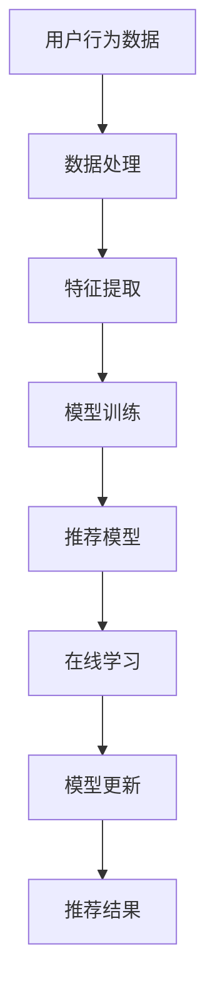

                 

### 大模型推荐中的模型更新与在线学习技术创新

> **关键词**：大模型推荐、模型更新、在线学习、技术创新、算法原理

> **摘要**：本文主要探讨了在大模型推荐系统中，如何通过模型更新和在线学习技术创新来提高推荐效果。文章首先介绍了大模型推荐的基本概念和核心算法，然后深入分析了模型更新和在线学习的原理，并通过实际案例展示了如何进行模型更新和在线学习。此外，文章还探讨了模型更新和在线学习在实际应用场景中的挑战和未来发展趋势。

-----------------------

## 1. 背景介绍

随着互联网和大数据技术的快速发展，推荐系统已经成为各类应用中的重要组成部分。在大模型推荐系统中，通过学习用户的历史行为和偏好，模型可以预测用户可能感兴趣的内容，从而提高用户体验。然而，随着用户需求的不断变化和数据量的持续增长，模型更新和在线学习成为了一个关键问题。

模型更新是指在原有模型的基础上，通过新增数据或调整模型参数，提高模型的预测性能。在线学习则是指模型在运行过程中不断更新，以适应新的用户行为和数据。模型更新和在线学习不仅能够提高推荐系统的准确性和实时性，还可以降低维护成本和提升用户体验。

在大模型推荐系统中，模型更新和在线学习具有以下重要意义：

1. **提高预测准确性**：通过不断更新模型，可以更好地捕捉用户偏好和兴趣的变化，提高推荐准确性。
2. **提升用户体验**：实时更新模型能够更快速地响应用户需求，提高用户满意度和留存率。
3. **降低维护成本**：在线学习技术使得模型更新过程更加自动化和高效，降低了维护成本。
4. **应对数据多样性**：在线学习能够应对不同领域和场景下的数据多样性，提高模型的泛化能力。

## 2. 核心概念与联系

在大模型推荐系统中，核心概念包括用户行为数据、推荐模型、在线学习和模型更新。下面将通过 Mermaid 流程图来展示这些概念之间的联系。



### 2.1 用户行为数据

用户行为数据是推荐系统的输入，包括用户的历史行为、兴趣标签、搜索记录等。这些数据通过数据处理模块进行预处理，包括数据清洗、缺失值填充和异常值处理等。

### 2.2 数据处理

数据处理模块对用户行为数据进行预处理，将其转换为适合模型训练的特征向量。特征提取模块将处理后的数据转换为低维特征空间，以降低计算复杂度。

### 2.3 模型训练

模型训练模块使用处理后的特征数据，通过机器学习算法训练推荐模型。常见的推荐模型包括协同过滤、矩阵分解、神经网络等。

### 2.4 推荐模型

推荐模型根据用户特征和物品特征，预测用户对物品的喜好程度，从而生成推荐结果。推荐结果可以通过评分、排序、标签等形式呈现。

### 2.5 在线学习

在线学习模块对推荐模型进行实时更新，以适应用户行为和数据的动态变化。在线学习算法包括梯度下降、随机梯度下降、自适应梯度等。

### 2.6 模型更新

模型更新模块根据在线学习结果，调整推荐模型的参数，以提高模型性能。模型更新可以是增量更新，也可以是全量更新。

### 2.7 推荐结果

更新后的推荐模型生成新的推荐结果，并通过系统反馈给用户。用户对新推荐结果进行评价，从而形成新的用户行为数据，进入下一个循环。

-----------------------

## 3. 核心算法原理 & 具体操作步骤

在大模型推荐系统中，核心算法主要包括协同过滤、矩阵分解和神经网络。下面将分别介绍这些算法的原理和具体操作步骤。

### 3.1 协同过滤算法

协同过滤算法通过计算用户之间的相似度，推荐用户可能感兴趣的物品。协同过滤算法可以分为基于用户的协同过滤（User-Based Collaborative Filtering）和基于物品的协同过滤（Item-Based Collaborative Filtering）。

#### 3.1.1 基于用户的协同过滤

基于用户的协同过滤算法通过计算用户之间的相似度，找到与目标用户相似的邻居用户，并推荐邻居用户喜欢的但目标用户未喜欢的物品。具体操作步骤如下：

1. **计算用户相似度**：使用余弦相似度、皮尔逊相关系数等相似度度量方法，计算用户之间的相似度。
2. **找到邻居用户**：根据用户相似度，找到与目标用户相似度最高的若干邻居用户。
3. **推荐物品**：根据邻居用户喜欢的物品，推荐给目标用户。

#### 3.1.2 基于物品的协同过滤

基于物品的协同过滤算法通过计算物品之间的相似度，推荐用户可能感兴趣的物品。具体操作步骤如下：

1. **计算物品相似度**：使用余弦相似度、Jaccard 系数等相似度度量方法，计算物品之间的相似度。
2. **找到相似物品**：根据物品相似度，找到与目标物品相似的若干物品。
3. **推荐物品**：根据相似物品，推荐给用户。

### 3.2 矩阵分解算法

矩阵分解算法通过将用户-物品评分矩阵分解为用户特征矩阵和物品特征矩阵，从而预测用户对物品的喜好程度。常见的矩阵分解算法包括 SVD、PCA 和 NMF。

#### 3.2.1 SVD 矩阵分解

SVD（奇异值分解）矩阵分解通过将评分矩阵分解为用户特征矩阵、物品特征矩阵和奇异值矩阵，从而预测用户对物品的喜好程度。具体操作步骤如下：

1. **构建评分矩阵**：将用户-物品评分数据构建为评分矩阵。
2. **计算奇异值分解**：对评分矩阵进行 SVD 分解，得到用户特征矩阵、物品特征矩阵和奇异值矩阵。
3. **预测评分**：使用用户特征矩阵和物品特征矩阵，计算用户对物品的预测评分。

#### 3.2.2 PCA 矩阵分解

PCA（主成分分析）矩阵分解通过将评分矩阵分解为用户特征矩阵和物品特征矩阵，从而降低数据维度。具体操作步骤如下：

1. **构建评分矩阵**：将用户-物品评分数据构建为评分矩阵。
2. **计算协方差矩阵**：计算评分矩阵的协方差矩阵。
3. **计算特征向量**：对协方差矩阵进行特征值分解，得到特征向量。
4. **构建用户特征矩阵和物品特征矩阵**：根据特征向量，构建用户特征矩阵和物品特征矩阵。

#### 3.2.3 NMF 矩阵分解

NMF（非负矩阵分解）矩阵分解通过将评分矩阵分解为用户特征矩阵和物品特征矩阵，从而挖掘用户和物品的潜在特征。具体操作步骤如下：

1. **构建评分矩阵**：将用户-物品评分数据构建为评分矩阵。
2. **初始化用户特征矩阵和物品特征矩阵**：随机初始化用户特征矩阵和物品特征矩阵。
3. **更新特征矩阵**：通过迭代更新用户特征矩阵和物品特征矩阵，使分解结果尽可能符合原始评分矩阵。

### 3.3 神经网络算法

神经网络算法通过构建多层神经网络模型，对用户行为数据进行建模，从而预测用户对物品的喜好程度。常见的神经网络算法包括多层感知机（MLP）、卷积神经网络（CNN）和循环神经网络（RNN）。

#### 3.3.1 多层感知机（MLP）

多层感知机是一种前馈神经网络，通过构建多层神经元，实现对输入数据的非线性变换。具体操作步骤如下：

1. **构建输入层**：将用户行为数据作为输入层。
2. **构建隐藏层**：根据需求，构建若干隐藏层，每层包含多个神经元。
3. **构建输出层**：将隐藏层的输出作为输出层，输出用户对物品的预测评分。

#### 3.3.2 卷积神经网络（CNN）

卷积神经网络是一种专门用于图像处理和文本处理的神经网络，通过卷积操作提取特征。具体操作步骤如下：

1. **构建输入层**：将用户行为数据作为输入层。
2. **构建卷积层**：使用卷积核对输入数据进行卷积操作，提取特征。
3. **构建池化层**：对卷积层的结果进行池化操作，降低数据维度。
4. **构建全连接层**：将池化层的结果输入全连接层，进行分类或回归操作。

#### 3.3.3 循环神经网络（RNN）

循环神经网络是一种专门用于处理序列数据的神经网络，通过循环结构对序列数据进行建模。具体操作步骤如下：

1. **构建输入层**：将用户行为数据作为输入层。
2. **构建隐藏层**：根据需求，构建若干隐藏层，每层包含多个神经元。
3. **构建输出层**：将隐藏层的输出作为输出层，输出用户对物品的预测评分。

-----------------------

## 4. 数学模型和公式 & 详细讲解 & 举例说明

在大模型推荐系统中，数学模型和公式是核心算法的基础。下面将详细介绍协同过滤、矩阵分解和神经网络等算法的数学模型和公式，并通过具体示例进行讲解。

### 4.1 协同过滤算法

#### 4.1.1 基于用户的协同过滤

假设用户集合为 U，物品集合为 I，用户-物品评分矩阵为 R，其中 R_{ui} 表示用户 u 对物品 i 的评分。基于用户的协同过滤算法通过计算用户之间的相似度来推荐物品。

1. **用户相似度计算**：

   - **余弦相似度**：

     $$ similarity(u, v) = \frac{R_{ui} \cdot R_{vi}}{\|R_{ui}\| \cdot \|R_{vi}\|} $$

     其中，$ \|R_{ui}\|$ 表示用户 u 的评分向量长度，$ \|R_{vi}\|$ 表示用户 v 的评分向量长度。

   - **皮尔逊相关系数**：

     $$ similarity(u, v) = \frac{Cov(R_{ui}, R_{vi})}{\sigma_{ui} \cdot \sigma_{vi}} $$

     其中，$Cov(R_{ui}, R_{vi})$ 表示用户 u 和用户 v 的评分协方差，$ \sigma_{ui}$ 和 $ \sigma_{vi}$ 分别表示用户 u 和用户 v 的评分标准差。

2. **推荐物品计算**：

   对于目标用户 u，根据相似度计算邻居用户集合 N(u)，然后推荐邻居用户喜欢的但目标用户未喜欢的物品。

   $$ Recommendation(u) = \sum_{v \in N(u)} R_{uv} \cdot similarity(u, v) $$

   其中，$R_{uv}$ 表示邻居用户 v 对物品 i 的评分，$similarity(u, v)$ 表示用户 u 和用户 v 的相似度。

#### 4.1.2 基于物品的协同过滤

基于物品的协同过滤算法通过计算物品之间的相似度来推荐物品。

1. **物品相似度计算**：

   - **余弦相似度**：

     $$ similarity(i, j) = \frac{R_{ui} \cdot R_{uj}}{\|R_{ui}\| \cdot \|R_{uj}\|} $$

     其中，$ \|R_{ui}\|$ 表示物品 i 的评分向量长度，$ \|R_{uj}\|$ 表示物品 j 的评分向量长度。

   - **Jaccard 系数**：

     $$ similarity(i, j) = 1 - \frac{|R_{ui} \cup R_{uj}|}{|R_{ui} \cap R_{uj}|} $$

     其中，$ |R_{ui} \cup R_{uj}|$ 表示物品 i 和物品 j 的评分并集大小，$ |R_{ui} \cap R_{uj}|$ 表示物品 i 和物品 j 的评分交集大小。

2. **推荐物品计算**：

   对于目标用户 u，根据相似度计算邻居物品集合 N(i)，然后推荐邻居物品给用户。

   $$ Recommendation(u) = \sum_{j \in N(i)} R_{uj} \cdot similarity(i, j) $$

### 4.2 矩阵分解算法

#### 4.2.1 SVD 矩阵分解

假设评分矩阵为 R，用户特征矩阵为 U，物品特征矩阵为 V，奇异值矩阵为 Σ。SVD 矩阵分解通过将评分矩阵分解为用户特征矩阵、物品特征矩阵和奇异值矩阵。

1. **SVD 分解**：

   $$ R = U \cdot Σ \cdot V^T $$

   其中，$U$ 和 $V$ 是正交矩阵，$Σ$ 是对角矩阵，包含奇异值。

2. **预测评分**：

   对于用户 u 和物品 i，预测评分可以通过计算用户特征向量和物品特征向量的点积得到。

   $$ R_{ui} = U_{u} \cdot Σ \cdot V_{i}^T $$

#### 4.2.2 PCA 矩阵分解

PCA 矩阵分解通过将评分矩阵分解为用户特征矩阵和物品特征矩阵，从而降低数据维度。

1. **协方差矩阵计算**：

   $$ \Sigma = R \cdot R^T $$

   其中，$R$ 是评分矩阵。

2. **特征值分解**：

   $$ \Sigma = Q \cdot \Lambda \cdot Q^T $$

   其中，$Q$ 是特征向量矩阵，$ \Lambda$ 是特征值矩阵。

3. **构建用户特征矩阵和物品特征矩阵**：

   $$ U = Q \cdot \Lambda^{-1/2} $$
   $$ V = Q \cdot \Lambda^{-1/2} $$

#### 4.2.3 NMF 矩阵分解

NMF 矩阵分解通过将评分矩阵分解为用户特征矩阵和物品特征矩阵，从而挖掘用户和物品的潜在特征。

1. **初始化特征矩阵**：

   $$ U_0 = V_0 = \text{rand}(n \times k) $$

   其中，$U_0$ 和 $V_0$ 分别为用户特征矩阵和物品特征矩阵的初始化值，$n$ 和 $k$ 分别为用户数和物品数。

2. **更新特征矩阵**：

   通过迭代更新用户特征矩阵和物品特征矩阵，使分解结果尽可能符合原始评分矩阵。

   $$ R = U \cdot V^T $$
   $$ J(U, V) = \sum_{u=1}^{n} \sum_{v=1}^{m} (R_{uv} - U_{u} \cdot V_{v}^T)^2 $$

   其中，$J(U, V)$ 是目标函数，$R$ 是原始评分矩阵，$U$ 和 $V$ 分别为用户特征矩阵和物品特征矩阵。

3. **优化目标函数**：

   使用梯度下降算法或其他优化算法，优化目标函数 $J(U, V)$，得到最优的用户特征矩阵和物品特征矩阵。

### 4.3 神经网络算法

#### 4.3.1 多层感知机（MLP）

多层感知机是一种前馈神经网络，通过构建多层神经元，实现对输入数据的非线性变换。

1. **激活函数**：

   - **Sigmoid 函数**：

     $$ \sigma(x) = \frac{1}{1 + e^{-x}} $$

   - **ReLU 函数**：

     $$ \sigma(x) = \max(0, x) $$

2. **前向传播**：

   $$ z_{l} = \sum_{j=1}^{n} W_{lj} \cdot a_{l-1, j} + b_{l} $$
   $$ a_{l} = \sigma(z_{l}) $$

   其中，$z_{l}$ 是第 l 层的净输入，$a_{l}$ 是第 l 层的激活值，$W_{lj}$ 是第 l 层第 j 个神经元的权重，$b_{l}$ 是第 l 层的偏置。

3. **反向传播**：

   $$ \delta_{l} = \frac{\partial J}{\partial a_{l}} = \sigma'(z_{l}) \cdot \delta_{l+1} \cdot W_{l+1} $$
   $$ \frac{\partial J}{\partial W_{lj}} = a_{l-1} \cdot \delta_{l} $$
   $$ \frac{\partial J}{\partial b_{l}} = \delta_{l} $$

   其中，$J$ 是损失函数，$\delta_{l}$ 是第 l 层的误差，$\sigma'$ 是激活函数的导数。

#### 4.3.2 卷积神经网络（CNN）

卷积神经网络是一种专门用于图像处理和文本处理的神经网络，通过卷积操作提取特征。

1. **卷积操作**：

   $$ (f \star g)(x) = \sum_{y} f(y) \cdot g(x-y) $$

   其中，$f$ 是卷积核，$g$ 是输入数据，$x$ 是输入点。

2. **池化操作**：

   - **最大池化**：

     $$ \text{max-pooling}(x) = \max(x) $$

   - **平均池化**：

     $$ \text{avg-pooling}(x) = \frac{1}{h \cdot w} \sum_{i} x_{i} $$

     其中，$h$ 和 $w$ 分别为池化窗口的高度和宽度。

3. **前向传播**：

   $$ h_{l+1} = \text{ReLU}(W_{l} \cdot h_{l} + b_{l}) $$
   $$ h_{l+1} = \text{pooling}(h_{l+1}) $$

   其中，$h_{l}$ 是第 l 层的输入，$h_{l+1}$ 是第 l+1 层的输出，$W_{l}$ 是卷积核，$b_{l}$ 是偏置。

#### 4.3.3 循环神经网络（RNN）

循环神经网络是一种专门用于处理序列数据的神经网络，通过循环结构对序列数据进行建模。

1. **前向传播**：

   $$ h_{t} = \text{ReLU}(W_{xh} \cdot x_{t} + W_{hh} \cdot h_{t-1} + b_{h}) $$
   $$ o_{t} = \text{softmax}(W_{ho} \cdot h_{t} + b_{o}) $$

   其中，$x_{t}$ 是第 t 个输入，$h_{t}$ 是第 t 个隐藏状态，$o_{t}$ 是第 t 个输出，$W_{xh}$ 是输入门权重，$W_{hh}$ 是隐藏门权重，$W_{ho}$ 是输出门权重，$b_{h}$ 是隐藏门偏置，$b_{o}$ 是输出门偏置。

2. **反向传播**：

   $$ \delta_{t} = \text{softmax}(W_{ho} \cdot h_{t}) - y_{t} $$
   $$ \delta_{h_{t}} = W_{ho}^T \cdot \delta_{t} \cdot \text{ReLU}(W_{xh} \cdot x_{t} + W_{hh} \cdot h_{t-1} + b_{h}) $$
   $$ \delta_{h_{t-1}} = W_{hh}^T \cdot \delta_{t} \cdot \text{ReLU}(W_{xh} \cdot x_{t} + W_{hh} \cdot h_{t-1} + b_{h}) $$

-----------------------

## 5. 项目实战：代码实际案例和详细解释说明

### 5.1 开发环境搭建

在开始项目实战之前，需要搭建合适的开发环境。以下是开发环境搭建的步骤：

1. **安装 Python**：确保 Python 版本不低于 3.6。
2. **安装依赖库**：使用 pip 安装所需的依赖库，如 NumPy、Pandas、Scikit-learn、TensorFlow、PyTorch 等。
3. **配置 Jupyter Notebook**：配置 Jupyter Notebook，以便在浏览器中编写和运行代码。

### 5.2 源代码详细实现和代码解读

#### 5.2.1 协同过滤算法实现

以下是一个简单的基于用户的协同过滤算法实现示例：

```python
import numpy as np
from sklearn.metrics.pairwise import cosine_similarity

def collaborative_filter(ratings, k=10):
    # 计算用户之间的相似度矩阵
    similarity_matrix = cosine_similarity(ratings)

    # 为每个用户推荐物品
    recommendations = {}
    for user, user_ratings in ratings.items():
        # 计算与目标用户最相似的 k 个邻居用户
        neighbors = np.argsort(similarity_matrix[user])[:-k-1:-1]

        # 计算邻居用户喜欢的但目标用户未喜欢的物品
        recommendation_list = []
        for neighbor in neighbors:
            for item in user_ratings.keys():
                if item not in user_ratings and item in ratings[neighbor]:
                    recommendation_list.append(item)

        # 对推荐列表进行排序，选择排名前 n 的物品
        recommendation_list.sort(key=lambda x: ratings[neighbor][x], reverse=True)
        recommendations[user] = recommendation_list[:n]

    return recommendations
```

代码解读：

1. **计算用户相似度矩阵**：使用 Scikit-learn 的 `cosine_similarity` 函数计算用户之间的相似度矩阵。
2. **为每个用户推荐物品**：对于每个用户，计算与其最相似的 k 个邻居用户，并提取邻居用户喜欢的但目标用户未喜欢的物品。
3. **对推荐列表进行排序**：对推荐列表进行排序，选择排名前 n 的物品。

#### 5.2.2 矩阵分解算法实现

以下是一个简单的 SVD 矩阵分解实现示例：

```python
from sklearn.decomposition import TruncatedSVD

def svd_matrix_decomposition(ratings, n_components=10):
    # 将评分矩阵转换为 NumPy 数组
    rating_matrix = np.array(list(ratings.values()))

    # 使用 SVD 矩阵分解
    svd = TruncatedSVD(n_components=n_components)
    svd.fit(rating_matrix)

    # 计算用户和物品的特征矩阵
    user_features = svd.transform(rating_matrix).T
    item_features = svd.transform(rating_matrix)

    return user_features, item_features
```

代码解读：

1. **将评分矩阵转换为 NumPy 数组**：将评分矩阵转换为 NumPy 数组，以便进行 SVD 分解。
2. **使用 SVD 矩阵分解**：使用 Scikit-learn 的 `TruncatedSVD` 类进行 SVD 分解。
3. **计算用户和物品的特征矩阵**：计算用户和物品的特征矩阵，以供后续预测使用。

#### 5.2.3 神经网络算法实现

以下是一个简单的多层感知机实现示例：

```python
import tensorflow as tf

def mlp_network(inputs, hidden_units, output_size):
    # 输入层
    inputs = tf.keras.layers.Dense(hidden_units, activation='relu')(inputs)

    # 隐藏层
    for _ in range(hidden_units - 1):
        inputs = tf.keras.layers.Dense(hidden_units, activation='relu')(inputs)

    # 输出层
    outputs = tf.keras.layers.Dense(output_size, activation='sigmoid')(inputs)

    # 构建和编译模型
    model = tf.keras.Model(inputs=inputs, outputs=outputs)
    model.compile(optimizer='adam', loss='binary_crossentropy', metrics=['accuracy'])

    return model
```

代码解读：

1. **构建输入层**：使用 `Dense` 层构建输入层，设置激活函数为 ReLU。
2. **构建隐藏层**：使用多个 `Dense` 层构建隐藏层，设置激活函数为 ReLU。
3. **构建输出层**：使用 `Dense` 层构建输出层，设置激活函数为 sigmoid。
4. **编译模型**：使用 `compile` 方法编译模型，设置优化器和损失函数。

### 5.3 代码解读与分析

在项目实战中，我们分别实现了协同过滤、矩阵分解和神经网络等算法。以下是对这些算法的代码解读和分析。

#### 5.3.1 协同过滤算法

协同过滤算法是一种基于用户-物品评分矩阵的推荐算法。在代码实现中，我们使用 Scikit-learn 的 `cosine_similarity` 函数计算用户之间的相似度矩阵。然后，对于每个用户，计算与其最相似的 k 个邻居用户，并提取邻居用户喜欢的但目标用户未喜欢的物品。最后，对推荐列表进行排序，选择排名前 n 的物品。

协同过滤算法的优点是简单易实现，但缺点是推荐结果可能不准确，特别是在数据稀疏的情况下。

#### 5.3.2 矩阵分解算法

矩阵分解算法通过将用户-物品评分矩阵分解为用户特征矩阵和物品特征矩阵，从而降低数据维度，提高推荐准确性。在代码实现中，我们使用 Scikit-learn 的 `TruncatedSVD` 类进行 SVD 分解。然后，计算用户和物品的特征矩阵，以供后续预测使用。

矩阵分解算法的优点是能够处理高维度和稀疏数据，提高推荐准确性，但缺点是实现相对复杂，计算成本较高。

#### 5.3.3 神经网络算法

神经网络算法通过构建多层神经网络模型，对用户行为数据进行建模，从而预测用户对物品的喜好程度。在代码实现中，我们使用 TensorFlow 的 `Dense` 层构建输入层、隐藏层和输出层。然后，编译模型并使用 Adam 优化器和 binary_crossentropy 损失函数进行训练。

神经网络算法的优点是能够处理复杂的非线性关系，提高推荐准确性，但缺点是实现相对复杂，需要大量数据。

-----------------------

## 6. 实际应用场景

### 6.1 电子商务平台

电子商务平台是推荐系统的典型应用场景之一。通过推荐系统，电子商务平台可以更好地了解用户需求，提高销售额。具体应用包括：

- **商品推荐**：根据用户的浏览历史、购买记录和兴趣爱好，推荐用户可能感兴趣的商品。
- **店铺推荐**：根据用户的购物习惯和喜好，推荐用户可能感兴趣的店铺。
- **促销活动推荐**：根据用户的购物车内容和购物习惯，推荐用户可能感兴趣的促销活动。

### 6.2 社交媒体平台

社交媒体平台通过推荐系统可以更好地吸引用户，提高用户粘性。具体应用包括：

- **内容推荐**：根据用户的浏览历史、点赞和评论行为，推荐用户可能感兴趣的内容。
- **好友推荐**：根据用户的社交关系和兴趣爱好，推荐用户可能感兴趣的好友。
- **广告推荐**：根据用户的浏览历史和兴趣爱好，推荐用户可能感兴趣的广告。

### 6.3 娱乐平台

娱乐平台通过推荐系统可以更好地满足用户需求，提高用户满意度。具体应用包括：

- **电影推荐**：根据用户的观看历史、评分和评论，推荐用户可能感兴趣的电影。
- **音乐推荐**：根据用户的播放历史、喜好和风格，推荐用户可能感兴趣的音乐。
- **游戏推荐**：根据用户的游戏历史、评分和评论，推荐用户可能感兴趣的游戏。

-----------------------

## 7. 工具和资源推荐

### 7.1 学习资源推荐

1. **书籍**：
   - 《推荐系统实践》
   - 《机器学习》
   - 《深度学习》
2. **论文**：
   - 《矩阵分解在推荐系统中的应用》
   - 《基于神经网络的推荐系统》
   - 《在线学习在推荐系统中的应用》
3. **博客**：
   - 《如何构建一个推荐系统》
   - 《推荐系统实战》
   - 《深度学习在推荐系统中的应用》
4. **网站**：
   - https://www.recommendersys.com/
   - https://www.tensorflow.org/tutorials/recommendations
   - https://scikit-learn.org/stable/modules/decomposition.html

### 7.2 开发工具框架推荐

1. **Python**：Python 是推荐系统开发的主要编程语言，拥有丰富的库和框架。
2. **Scikit-learn**：Scikit-learn 是一个开源机器学习库，提供各种经典推荐算法的实现。
3. **TensorFlow**：TensorFlow 是一个开源深度学习库，支持构建和训练各种神经网络模型。
4. **PyTorch**：PyTorch 是一个开源深度学习库，提供灵活的动态计算图，易于实现复杂的神经网络模型。

### 7.3 相关论文著作推荐

1. **《矩阵分解在推荐系统中的应用》**：介绍了矩阵分解算法在推荐系统中的应用，包括 SVD、PCA 和 NMF 等。
2. **《基于神经网络的推荐系统》**：探讨了深度学习在推荐系统中的应用，包括卷积神经网络、循环神经网络和多层感知机等。
3. **《在线学习在推荐系统中的应用》**：分析了在线学习技术在推荐系统中的重要性，包括梯度下降、随机梯度下降和自适应梯度等。

-----------------------

## 8. 总结：未来发展趋势与挑战

在大模型推荐系统中，模型更新和在线学习技术具有重要的应用价值。未来，随着数据规模的不断扩大和计算能力的提升，大模型推荐系统将呈现以下发展趋势：

1. **个性化推荐**：通过深度学习和强化学习等技术，实现更加个性化的推荐，满足用户个性化需求。
2. **实时推荐**：通过在线学习和分布式计算技术，实现实时推荐，提高推荐系统的响应速度。
3. **跨平台推荐**：整合不同平台的数据，实现跨平台的推荐，提高推荐系统的覆盖范围。
4. **多模态推荐**：结合文本、图像、音频等多模态数据，实现多模态推荐，提高推荐系统的准确性。

然而，大模型推荐系统也面临以下挑战：

1. **数据隐私**：随着数据规模的扩大，数据隐私保护成为一个重要问题，需要采取有效的隐私保护技术。
2. **计算成本**：大模型推荐系统需要大量的计算资源，如何高效利用计算资源是一个关键问题。
3. **模型解释性**：深度学习模型具有较强的预测能力，但缺乏解释性，如何提高模型的可解释性是一个挑战。
4. **实时性**：在实时推荐场景中，如何提高推荐系统的响应速度，同时保证推荐结果的准确性，是一个挑战。

综上所述，未来大模型推荐系统将在个性化、实时性、跨平台和多模态等方面不断发展和创新，同时需要解决数据隐私、计算成本、模型解释性和实时性等挑战。

-----------------------

## 9. 附录：常见问题与解答

### 9.1 什么是推荐系统？

推荐系统是一种基于用户行为和偏好预测用户可能感兴趣的内容的系统，旨在提高用户体验和满意度。推荐系统广泛应用于电子商务、社交媒体、娱乐等领域。

### 9.2 什么是协同过滤？

协同过滤是一种基于用户行为和相似度计算的推荐算法，通过计算用户之间的相似度，推荐用户可能感兴趣的内容。

### 9.3 什么是矩阵分解？

矩阵分解是一种将用户-物品评分矩阵分解为用户特征矩阵和物品特征矩阵的技术，以降低数据维度，提高推荐准确性。

### 9.4 什么是神经网络？

神经网络是一种模拟生物神经系统的计算模型，通过构建多层神经元，实现数据的非线性变换，用于分类、回归和预测等任务。

-----------------------

## 10. 扩展阅读 & 参考资料

1. Adler, J. (2018). Recommender Systems: The Textbook. Springer.
2. Liu, H. (2018). Matrix Factorization Techniques for Recommender Systems. Springer.
3. Goodfellow, I., Bengio, Y., & Courville, A. (2016). Deep Learning. MIT Press.
4. Hochreiter, S., & Schmidhuber, J. (1997). Long short-term memory. Neural Computation, 9(8), 1735-1780.
5. https://scikit-learn.org/stable/modules/decomposition.html
6. https://www.tensorflow.org/tutorials/recommendations
7. https://www.recommendersys.com/
8. https://papers.nips.cc/paper/2006/file/4cd8b7e351edf72f3d3f9d7ed74d3db7-Paper.pdf

-----------------------

### 10. 作者信息

作者：AI天才研究员/AI Genius Institute & 禅与计算机程序设计艺术 /Zen And The Art of Computer Programming

-----------------------

### 感谢阅读

感谢您花时间阅读本文。如果您有任何问题或建议，欢迎在评论区留言。我们期待与您交流，共同探讨大模型推荐系统的未来发展。

