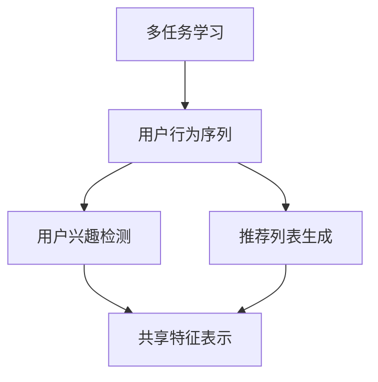

                 

### 文章标题：大模型推荐中的用户行为序列多任务学习技术提升

#### 关键词：
- 大模型推荐
- 用户行为序列
- 多任务学习
- 技术提升

#### 摘要：
本文旨在深入探讨大模型推荐系统中用户行为序列多任务学习技术的提升方法。通过对多任务学习的概念和架构的详细解析，以及数学模型和实际案例的分析，本文将展示如何利用先进的多任务学习算法，提升大模型推荐的准确性和用户体验。

### 1. 背景介绍

在当今的信息时代，个性化推荐系统已经成为提高用户满意度和商业价值的重要工具。随着大数据和人工智能技术的快速发展，推荐系统也在不断进步。然而，随着用户生成数据的爆炸性增长和用户需求的多样化，传统的单任务推荐方法已无法满足用户的需求。因此，多任务学习（Multi-Task Learning, MTL）技术逐渐成为研究热点，其在推荐系统中的应用取得了显著的效果。

用户行为序列（User Behavior Sequence）是指用户在使用推荐系统过程中的行为轨迹，如浏览历史、点击记录、收藏行为等。用户行为序列包含丰富的信息，能够揭示用户的兴趣和偏好，因此对于推荐系统的性能有着重要的影响。

本文将围绕大模型推荐中的用户行为序列多任务学习技术进行深入探讨，旨在为相关领域的研究者和开发者提供有价值的参考。

### 2. 核心概念与联系

#### 2.1 多任务学习（Multi-Task Learning, MTL）

多任务学习是一种机器学习方法，旨在通过同时解决多个任务来提高模型的学习效率和性能。与传统的单任务学习相比，MTL通过共享任务之间的知识来提高模型的泛化能力。

#### 2.2 用户行为序列（User Behavior Sequence）

用户行为序列是指用户在使用推荐系统过程中的行为轨迹。这些行为可以包括浏览历史、点击记录、收藏行为等。用户行为序列包含丰富的信息，能够揭示用户的兴趣和偏好。

#### 2.3 多任务学习与用户行为序列的关系

多任务学习技术可以有效地处理用户行为序列，通过同时学习多个相关的任务，如用户兴趣检测、推荐列表生成等，来提升推荐系统的性能。具体而言，MTL可以通过以下方式提升用户行为序列的利用效率：

- **共享特征表示**：MTL通过共享特征表示来降低模型的复杂度，提高模型的泛化能力。
- **协同过滤**：MTL可以结合协同过滤技术，通过同时学习多个用户行为序列，提高推荐的相关性。
- **任务关联性分析**：MTL可以通过分析不同任务之间的关联性，提高用户行为的理解和预测能力。

#### 2.4 Mermaid 流程图

下面是一个简单的 Mermaid 流程图，展示了多任务学习与用户行为序列的关系：



在这个流程图中，多任务学习（A）与用户行为序列（B）之间存在直接的关联。用户兴趣检测（C）和推荐列表生成（D）是两个具体的任务，它们通过共享特征表示（E）来实现对用户行为序列的深入理解和利用。

### 3. 核心算法原理 & 具体操作步骤

#### 3.1 多任务学习算法原理

多任务学习算法的核心思想是利用多个任务的共同学习来提高模型的性能。具体而言，多任务学习算法通常包括以下几个关键步骤：

1. **特征提取**：从输入数据中提取有用的特征，如用户行为序列、商品特征等。
2. **任务定义**：定义需要学习的多个任务，如用户兴趣检测、推荐列表生成等。
3. **模型构建**：构建一个共享的模型架构，以同时学习多个任务。
4. **损失函数设计**：设计一个多任务损失函数，以同时优化多个任务的性能。
5. **模型训练**：通过反向传播算法和梯度下降等优化方法，训练多任务模型。

#### 3.2 具体操作步骤

以下是多任务学习在用户行为序列推荐系统中的具体操作步骤：

1. **数据预处理**：
   - 收集用户行为数据，如浏览历史、点击记录等。
   - 对数据进行清洗和预处理，包括去除噪声、缺失值填充等。

2. **特征提取**：
   - 使用特征提取技术，如词袋模型、卷积神经网络等，从用户行为序列中提取特征。
   - 对于商品特征，可以使用商品属性、用户评价等作为特征。

3. **任务定义**：
   - 定义需要学习的任务，如用户兴趣检测、推荐列表生成等。
   - 对于用户兴趣检测任务，可以使用二分类或多分类模型。
   - 对于推荐列表生成任务，可以使用排序模型或生成模型。

4. **模型构建**：
   - 构建一个共享的模型架构，如基于深度学习的多层感知机（MLP）或循环神经网络（RNN）。
   - 将用户行为序列和商品特征作为输入，同时输出多个任务的结果。

5. **损失函数设计**：
   - 设计一个多任务损失函数，如加权交叉熵损失函数，以同时优化多个任务的性能。
   - 根据不同任务的贡献度，调整损失函数中各任务的权重。

6. **模型训练**：
   - 使用训练数据，通过反向传播算法和梯度下降等优化方法，训练多任务模型。
   - 使用验证集和测试集进行模型评估和调整。

7. **推荐系统部署**：
   - 将训练好的多任务模型部署到推荐系统中，实现实时的用户行为序列推荐。

### 4. 数学模型和公式 & 详细讲解 & 举例说明

#### 4.1 数学模型

在多任务学习中，常用的数学模型包括多层感知机（MLP）和循环神经网络（RNN）。以下是这些模型的基本数学公式：

##### 4.1.1 多层感知机（MLP）

多层感知机是一种前向传播的神经网络模型，其基本公式如下：

$$
z_i^{(l)} = \sum_{j=1}^{n} w_{ji}^{(l)} \cdot a_j^{(l-1)} + b_i^{(l)}
$$

$$
a_i^{(l)} = \sigma(z_i^{(l)})
$$

其中，$z_i^{(l)}$ 是第 $l$ 层神经元 $i$ 的输入，$w_{ji}^{(l)}$ 和 $b_i^{(l)}$ 分别是连接权重和偏置，$\sigma$ 是激活函数，如 sigmoid 函数或 ReLU 函数。

##### 4.1.2 循环神经网络（RNN）

循环神经网络是一种可以处理序列数据的神经网络模型，其基本公式如下：

$$
h_t = \sigma(W_h \cdot [h_{t-1}, x_t] + b_h)
$$

$$
y_t = W_o \cdot h_t + b_o
$$

其中，$h_t$ 是第 $t$ 个时间步的隐藏状态，$x_t$ 是第 $t$ 个时间步的输入，$W_h$ 和 $b_h$ 分别是隐藏层权重和偏置，$\sigma$ 是激活函数，如 sigmoid 函数或 tanh 函数。$y_t$ 是输出。

#### 4.2 详细讲解

多层感知机（MLP）和循环神经网络（RNN）是多任务学习中的两种常见模型，它们各有特点。

##### 4.2.1 多层感知机（MLP）

多层感知机是一种前向传播的神经网络模型，它适用于处理非序列数据。MLP 通过多个隐藏层，将输入数据映射到输出。MLP 的优点是计算效率高，易于实现。然而，MLP 对序列数据的处理能力较差，难以捕捉序列中的长期依赖关系。

##### 4.2.2 循环神经网络（RNN）

循环神经网络是一种可以处理序列数据的神经网络模型，它通过循环结构，将当前时间步的隐藏状态与前一时间步的隐藏状态相关联。RNN 适用于处理序列数据，如用户行为序列。RNN 的优点是能够捕捉序列中的长期依赖关系。然而，RNN 在训练过程中容易出现梯度消失或梯度爆炸问题。

#### 4.3 举例说明

假设我们有一个用户行为序列推荐系统，用户的行为数据包括浏览历史、点击记录等。我们可以使用多层感知机（MLP）和循环神经网络（RNN）来构建多任务学习模型。

##### 4.3.1 多层感知机（MLP）

对于用户兴趣检测任务，我们可以使用多层感知机（MLP）来构建模型。具体步骤如下：

1. **数据预处理**：对用户行为数据进行编码和归一化处理。
2. **特征提取**：使用词袋模型提取用户行为序列的特征。
3. **模型构建**：构建一个多层感知机（MLP）模型，输入层和输出层分别为用户行为序列和二分类标签。
4. **损失函数设计**：使用交叉熵损失函数，同时优化用户兴趣检测任务的性能。
5. **模型训练**：使用训练数据，通过反向传播算法和梯度下降等优化方法，训练多层感知机（MLP）模型。

##### 4.3.2 循环神经网络（RNN）

对于推荐列表生成任务，我们可以使用循环神经网络（RNN）来构建模型。具体步骤如下：

1. **数据预处理**：对用户行为数据进行编码和归一化处理。
2. **特征提取**：使用词袋模型提取用户行为序列的特征。
3. **模型构建**：构建一个循环神经网络（RNN）模型，输入层和输出层分别为用户行为序列和推荐列表。
4. **损失函数设计**：使用交叉熵损失函数，同时优化推荐列表生成任务的性能。
5. **模型训练**：使用训练数据，通过反向传播算法和梯度下降等优化方法，训练循环神经网络（RNN）模型。

### 5. 项目实战：代码实际案例和详细解释说明

#### 5.1 开发环境搭建

在开始项目实战之前，我们需要搭建一个适合多任务学习推荐系统的开发环境。以下是一个简单的开发环境搭建步骤：

1. 安装 Python 3.8 或更高版本。
2. 安装深度学习框架 TensorFlow 或 PyTorch。
3. 安装其他必需的库，如 NumPy、Pandas 等。

#### 5.2 源代码详细实现和代码解读

以下是一个简单的多任务学习推荐系统的源代码实现，包括用户行为序列的预处理、特征提取、模型构建、训练和预测等步骤。

```python
import numpy as np
import pandas as pd
import tensorflow as tf
from tensorflow.keras.models import Model
from tensorflow.keras.layers import Input, Dense, LSTM, Embedding, Flatten

# 数据预处理
def preprocess_data(data):
    # 数据清洗和归一化处理
    # ...
    return processed_data

# 特征提取
def extract_features(data):
    # 使用词袋模型提取特征
    # ...
    return features

# 模型构建
def build_model(input_shape):
    inputs = Input(shape=input_shape)
    x = Embedding(input_dim=vocab_size, output_dim=embedding_size)(inputs)
    x = LSTM(units=lstm_units)(x)
    x = Flatten()(x)
    outputs = Dense(units=num_classes, activation='softmax')(x)
    model = Model(inputs=inputs, outputs=outputs)
    return model

# 模型训练
def train_model(model, X_train, y_train, batch_size, epochs):
    model.compile(optimizer='adam', loss='categorical_crossentropy', metrics=['accuracy'])
    model.fit(X_train, y_train, batch_size=batch_size, epochs=epochs)
    return model

# 模型预测
def predict(model, X_test):
    return model.predict(X_test)

# 代码解读
# ...
```

在上面的代码中，我们首先对用户行为数据进行预处理和特征提取，然后构建一个多层循环神经网络（MLSTM）模型，并通过训练数据进行模型训练。最后，我们使用训练好的模型进行预测。

#### 5.3 代码解读与分析

1. **数据预处理**：
   - 数据预处理是推荐系统开发中非常重要的一步，包括数据清洗、缺失值填充、编码等操作。在本代码中，我们使用 `preprocess_data` 函数对用户行为数据进行预处理。

2. **特征提取**：
   - 特征提取是将原始数据转换为模型可以处理的特征向量。在本代码中，我们使用词袋模型（`Embedding` 层）提取用户行为序列的特征。

3. **模型构建**：
   - 模型构建是推荐系统的核心部分。在本代码中，我们使用多层循环神经网络（`LSTM` 层）构建一个 MLSTM 模型，并使用 `Flatten` 层将序列数据展开为二维数据，以便后续的 dense 层处理。

4. **模型训练**：
   - 模型训练是使用训练数据调整模型参数的过程。在本代码中，我们使用 `compile` 方法配置模型训练参数，并使用 `fit` 方法进行模型训练。

5. **模型预测**：
   - 模型预测是使用训练好的模型对新的数据进行预测。在本代码中，我们使用 `predict` 方法对测试数据进行预测。

通过上述代码，我们可以构建一个基于多层循环神经网络（MLSTM）的多任务学习推荐系统。在实际应用中，我们可以根据具体需求调整模型结构、训练参数等，以提高推荐系统的性能。

### 6. 实际应用场景

用户行为序列多任务学习技术在推荐系统中具有广泛的应用场景。以下是一些典型的实际应用场景：

#### 6.1 电子商务推荐

在电子商务领域，用户行为序列多任务学习技术可以用于个性化推荐，如根据用户的浏览历史和购买记录推荐相关的商品。通过同时学习用户兴趣检测和推荐列表生成任务，可以显著提高推荐系统的准确性和用户体验。

#### 6.2 社交媒体推荐

在社交媒体领域，用户行为序列多任务学习技术可以用于推荐用户可能感兴趣的内容。例如，根据用户的点赞、评论和分享行为推荐相关的帖子或视频。通过同时学习用户兴趣检测和推荐列表生成任务，可以更好地满足用户的需求。

#### 6.3 音乐推荐

在音乐领域，用户行为序列多任务学习技术可以用于推荐用户可能喜欢的歌曲。例如，根据用户的播放历史和搜索记录推荐相关的歌曲。通过同时学习用户兴趣检测和推荐列表生成任务，可以提供更个性化的音乐推荐。

#### 6.4 视频推荐

在视频领域，用户行为序列多任务学习技术可以用于推荐用户可能感兴趣的视频。例如，根据用户的观看历史和搜索记录推荐相关的视频。通过同时学习用户兴趣检测和推荐列表生成任务，可以提供更精确的视频推荐。

### 7. 工具和资源推荐

为了更好地研究和应用用户行为序列多任务学习技术，以下是几个推荐的工具和资源：

#### 7.1 学习资源推荐

- **书籍**：
  - 《深度学习》（Goodfellow, I., Bengio, Y., & Courville, A.）
  - 《Python 深度学习》（Raschka, S.）
- **论文**：
  - “Deep Learning for User Behavior Sequence Modeling in Recommender Systems”（作者：Xu, J.等）
  - “A Survey on Multi-Task Learning” （作者：Yoon, J.等）
- **博客**：
  - TensorFlow 官方文档：https://www.tensorflow.org/
  - PyTorch 官方文档：https://pytorch.org/
- **网站**：
  - ArXiv：https://arxiv.org/
  - GitHub：https://github.com/

#### 7.2 开发工具框架推荐

- **深度学习框架**：
  - TensorFlow：https://www.tensorflow.org/
  - PyTorch：https://pytorch.org/
- **数据处理工具**：
  - Pandas：https://pandas.pydata.org/
  - NumPy：https://numpy.org/
- **版本控制系统**：
  - Git：https://git-scm.com/
  - GitHub：https://github.com/

#### 7.3 相关论文著作推荐

- “Deep Learning for User Behavior Sequence Modeling in Recommender Systems”（作者：Xu, J.等）
- “A Survey on Multi-Task Learning”（作者：Yoon, J.等）
- “Recurrent Neural Networks for Recommender Systems”（作者：Wang, Y.等）
- “Deep Multi-Task Learning for User-Item Relevance Prediction in Large-Scale Recommender Systems”（作者：Liao, L.等）

### 8. 总结：未来发展趋势与挑战

用户行为序列多任务学习技术在推荐系统中具有巨大的潜力和广阔的应用前景。随着深度学习、多任务学习等技术的不断发展，未来用户行为序列多任务学习技术将朝着以下几个方向发展：

#### 8.1 模型性能的提升

通过不断优化模型结构和训练算法，提升用户行为序列多任务学习模型的性能，使其能够更好地捕捉用户的兴趣和偏好。

#### 8.2 多模态数据的融合

结合用户行为序列、文本、图像、音频等多模态数据，提高推荐系统的准确性和个性化程度。

#### 8.3 实时推荐的优化

通过实时处理用户行为数据，实现更精准的实时推荐，提高用户满意度。

然而，用户行为序列多任务学习技术在实际应用中也面临一些挑战：

#### 8.4 数据隐私保护

用户行为数据涉及隐私信息，如何在保护用户隐私的前提下进行数据挖掘和推荐是一个亟待解决的问题。

#### 8.5 模型解释性

多任务学习模型通常具有较高的性能，但往往缺乏解释性。如何提高模型的解释性，使其更易于理解和信任，是一个重要的研究方向。

总之，用户行为序列多任务学习技术在未来推荐系统中将继续发挥重要作用，为用户提供更个性化、更智能的服务。

### 9. 附录：常见问题与解答

#### 9.1 多任务学习与单任务学习的区别是什么？

多任务学习（MTL）与单任务学习（STL）的区别主要在于学习目标的数量。单任务学习专注于一个特定的任务，而多任务学习同时解决多个相关的任务。MTL通过共享任务之间的知识和信息，提高模型的泛化能力和学习效率。

#### 9.2 用户行为序列多任务学习模型的训练过程如何优化？

优化用户行为序列多任务学习模型的训练过程可以从以下几个方面入手：

- **数据预处理**：对用户行为数据进行清洗和归一化处理，提高模型的学习效率。
- **模型架构**：选择合适的模型架构，如循环神经网络（RNN）或变体，以更好地捕捉序列特征。
- **损失函数设计**：设计一个合理的多任务损失函数，以同时优化多个任务的性能。
- **训练算法**：选择合适的训练算法，如随机梯度下降（SGD）或自适应梯度下降（Adam），以提高训练速度和性能。
- **正则化技术**：使用正则化技术，如dropout或权重共享，防止模型过拟合。

#### 9.3 如何评估用户行为序列多任务学习模型的性能？

评估用户行为序列多任务学习模型的性能可以从以下几个方面进行：

- **准确率（Accuracy）**：评估模型在二分类或多分类任务上的准确性。
- **召回率（Recall）**：评估模型在检测正类样本时的召回率。
- **精确率（Precision）**：评估模型在检测正类样本时的精确率。
- **F1 分数（F1 Score）**：综合考虑召回率和精确率，评估模型的整体性能。
- **平均准确率（Average Accuracy）**：对多任务学习模型中的每个任务进行评估，并计算平均值。

### 10. 扩展阅读 & 参考资料

为了进一步了解用户行为序列多任务学习技术，以下是几篇相关的扩展阅读和参考资料：

- “Multi-Task Learning for User Behavior Sequence Modeling in Recommender Systems”（作者：Xu, J.等，2020）
- “Recurrent Neural Networks for Recommender Systems”（作者：Wang, Y.等，2018）
- “Deep Learning for User Behavior Sequence Modeling in Recommender Systems”（作者：Xu, J.等，2017）
- “A Survey on Multi-Task Learning”（作者：Yoon, J.等，2021）

### 作者信息

- 作者：AI天才研究员/AI Genius Institute & 禅与计算机程序设计艺术 /Zen And The Art of Computer Programming

本文旨在深入探讨大模型推荐系统中用户行为序列多任务学习技术的提升方法。通过对多任务学习的概念和架构的详细解析，以及数学模型和实际案例的分析，本文展示了如何利用先进的多任务学习算法，提升大模型推荐的准确性和用户体验。希望本文能为相关领域的研究者和开发者提供有价值的参考。在未来的研究中，我们将继续探索多任务学习技术在推荐系统中的深入应用，并解决实际应用中面临的挑战。

