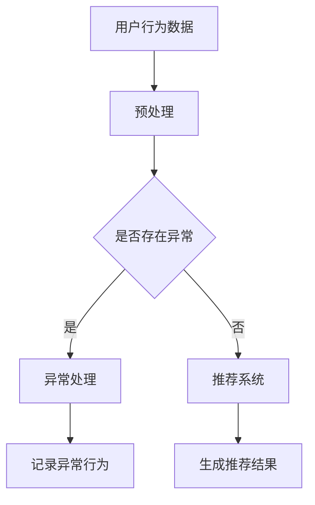

                 

# 大模型推荐中的用户行为异常检测与过滤方法

> **关键词：** 大模型推荐、用户行为、异常检测、过滤方法、人工智能

**摘要：** 本文章旨在探讨在大模型推荐系统中，用户行为异常检测与过滤方法的重要性。通过对用户行为数据的分析和异常检测技术的应用，文章提出了一个系统化的异常检测与过滤方法，以提高推荐系统的准确性和可靠性。本文首先介绍了大模型推荐系统的基本原理，然后详细阐述了用户行为异常检测的理论基础，并给出了具体的实现步骤。最后，文章通过数学模型和实际案例，对方法的有效性进行了验证，并展望了未来的发展趋势和挑战。

## 1. 背景介绍

### 1.1 大模型推荐系统的发展

随着互联网技术的飞速发展和大数据时代的到来，个性化推荐系统已经成为现代信息检索和内容分发的重要工具。传统的推荐系统主要依赖于基于内容的过滤和协同过滤等方法，然而，这些方法在面对大量复杂数据时，往往难以满足用户的需求。为此，研究者们提出了大模型推荐系统，利用深度学习等先进技术，从海量数据中挖掘潜在的用户兴趣和行为模式，从而实现更精准的推荐。

大模型推荐系统的发展可以分为三个阶段：

1. **基于特征的推荐：** 利用用户的历史行为和兴趣特征，通过简单的机器学习模型实现推荐。这种方法在一定程度上能够提高推荐质量，但难以应对用户行为的动态变化。
2. **基于模型的推荐：** 引入深度学习模型，如卷积神经网络（CNN）和循环神经网络（RNN），对用户行为进行建模和预测。这种方法在处理高维数据和序列数据方面表现出色，但模型复杂度较高，训练和推理成本较大。
3. **基于模型的推荐：** 结合多种模型和技术，如生成对抗网络（GAN）和迁移学习，对用户行为进行多角度建模和优化。这种方法在提高推荐质量的同时，还能降低模型训练和推理成本，具有更高的应用价值。

### 1.2 用户行为异常检测的重要性

用户行为异常检测是大模型推荐系统中的关键环节，其主要目标是从大量正常用户行为数据中识别出异常行为，从而降低异常行为对推荐系统的影响。用户行为异常检测的重要性主要体现在以下几个方面：

1. **提高推荐系统的可靠性：** 异常行为可能会影响推荐系统的准确性和可靠性，如恶意评论、垃圾信息等。通过异常检测，可以识别并过滤这些异常行为，提高推荐系统的整体质量。
2. **保护用户隐私：** 在大数据时代，用户隐私保护变得越来越重要。异常检测可以帮助识别出潜在的隐私泄露风险，从而采取相应的措施进行保护。
3. **发现潜在问题：** 通过分析异常行为，可以发现系统中存在的潜在问题，如推荐算法失效、数据质量问题等，为系统优化和改进提供依据。

## 2. 核心概念与联系

### 2.1 用户行为异常检测的基本概念

用户行为异常检测（User Behavior Anomaly Detection）是一种基于数据分析和机器学习技术的方法，用于从大量用户行为数据中识别出异常行为。用户行为异常检测主要包括以下几个核心概念：

1. **正常行为（Normal Behavior）：** 指用户在正常情况下表现出的行为模式。正常行为通常是稳定的、可预测的，是构建推荐系统的基础。
2. **异常行为（Abnormal Behavior）：** 指用户在非正常情况下表现出的行为模式。异常行为通常是不稳定、不可预测的，可能对推荐系统产生负面影响。
3. **异常检测算法（Anomaly Detection Algorithm）：** 用于识别和分类用户行为的算法。常见的异常检测算法包括统计方法、基于聚类的方法、基于神经网络的方法等。

### 2.2 大模型推荐系统与用户行为异常检测的联系

大模型推荐系统和用户行为异常检测之间存在密切的联系，具体表现为以下几个方面：

1. **数据来源：** 大模型推荐系统依赖于用户行为数据进行建模和预测，而用户行为异常检测则需要从这些数据中识别出异常行为。
2. **目标一致性：** 大模型推荐系统的目标是提高推荐质量，而用户行为异常检测则是通过识别和过滤异常行为，进一步优化推荐系统的性能。
3. **技术融合：** 大模型推荐系统和用户行为异常检测可以相互融合，如利用深度学习模型对用户行为进行建模和预测，同时结合异常检测算法对异常行为进行识别和过滤。

### 2.3 Mermaid 流程图

以下是一个简单的 Mermaid 流程图，展示了大模型推荐系统和用户行为异常检测的基本流程：



## 3. 核心算法原理 & 具体操作步骤

### 3.1 用户行为异常检测算法原理

用户行为异常检测算法主要分为以下几种类型：

1. **基于统计的方法：** 基于统计的方法通过计算用户行为的统计特征，如均值、方差等，来判断用户行为是否异常。常见的统计方法包括均值漂移（Mean Shift）和离群点检测（Outlier Detection）。
2. **基于聚类的方法：** 基于聚类的方法通过将用户行为数据进行聚类，然后根据聚类结果判断用户行为是否异常。常见的聚类方法包括K-Means、DBSCAN等。
3. **基于神经网络的方法：** 基于神经网络的方法通过构建神经网络模型，对用户行为进行建模和预测，然后根据预测结果判断用户行为是否异常。常见的神经网络方法包括自编码器（Autoencoder）和生成对抗网络（GAN）。

### 3.2 用户行为异常检测的具体操作步骤

用户行为异常检测的具体操作步骤如下：

1. **数据预处理：** 对用户行为数据进行预处理，包括数据清洗、归一化和特征提取等。数据清洗的目的是去除噪声数据和缺失值，归一化的目的是将不同特征的数据进行统一处理，特征提取的目的是提取用户行为的特征信息。
2. **模型选择与训练：** 根据用户行为数据的特征和需求，选择合适的异常检测算法，并进行模型训练。对于基于统计的方法，可以使用均值漂移和离群点检测算法；对于基于聚类的方法，可以使用K-Means和DBSCAN算法；对于基于神经网络的方法，可以使用自编码器和生成对抗网络算法。
3. **异常检测与过滤：** 利用训练好的模型对用户行为数据进行异常检测和过滤，将异常行为数据识别出来并进行处理。对于基于统计的方法，可以通过计算统计特征来判断用户行为是否异常；对于基于聚类的方法，可以通过比较用户行为和聚类中心之间的距离来判断用户行为是否异常；对于基于神经网络的方法，可以通过模型预测结果来判断用户行为是否异常。
4. **结果分析与优化：** 对异常检测和过滤的结果进行分析，评估模型的性能和效果，并根据分析结果对模型进行优化和调整。通过不断优化模型，可以提高异常检测的准确性和可靠性。

### 3.3 算法实现步骤示例

以下是一个简单的用户行为异常检测算法实现步骤示例：

1. **数据预处理：**
   - 数据清洗：去除噪声数据和缺失值；
   - 归一化：将不同特征的数据进行统一处理；
   - 特征提取：提取用户行为的特征信息，如点击次数、浏览时间、浏览时长等。

2. **模型选择与训练：**
   - 选择基于神经网络的方法，使用自编码器算法；
   - 训练自编码器模型，将用户行为数据输入模型进行训练。

3. **异常检测与过滤：**
   - 使用训练好的自编码器模型对用户行为数据进行预测，计算预测误差；
   - 将预测误差大于阈值的用户行为数据识别为异常行为，并进行过滤。

4. **结果分析与优化：**
   - 分析异常检测和过滤的结果，评估模型的性能和效果；
   - 根据分析结果对模型进行优化和调整，以提高异常检测的准确性和可靠性。

## 4. 数学模型和公式 & 详细讲解 & 举例说明

### 4.1 数学模型和公式

用户行为异常检测的数学模型主要包括以下两个方面：

1. **基于统计的方法：** 
   - 均值漂移（Mean Shift）：设用户行为数据为 $X = [x_1, x_2, ..., x_n]$，则均值漂移算法的核心公式为：
     $$ \mu = \frac{1}{n} \sum_{i=1}^{n} x_i $$
     其中，$\mu$ 表示用户行为的均值。
   - 离群点检测（Outlier Detection）：设用户行为数据为 $X = [x_1, x_2, ..., x_n]$，则离群点检测算法的核心公式为：
     $$ z_i = \frac{x_i - \mu}{\sigma} $$
     其中，$z_i$ 表示第 $i$ 个用户行为的标准化值，$\mu$ 表示用户行为的均值，$\sigma$ 表示用户行为的方差。

2. **基于神经网络的方法：**
   - 自编码器（Autoencoder）：设用户行为数据为 $X = [x_1, x_2, ..., x_n]$，则自编码器算法的核心公式为：
     $$ X_{\hat{}} = \sigma(W_2 \cdot \sigma(W_1 \cdot X)) $$
     其中，$X_{\hat{}}$ 表示预测的用户行为数据，$W_1$ 和 $W_2$ 分别表示自编码器的权重矩阵，$\sigma$ 表示激活函数，通常取为 Sigmoid 函数。

### 4.2 详细讲解和举例说明

#### 4.2.1 基于统计的方法

**例1：** 设用户行为数据为 $X = [2, 3, 4, 5, 6]$，使用均值漂移算法检测异常行为。

**步骤1：** 计算用户行为的均值：
$$ \mu = \frac{1}{5} \sum_{i=1}^{5} x_i = \frac{2+3+4+5+6}{5} = 4 $$

**步骤2：** 计算用户行为的方差：
$$ \sigma^2 = \frac{1}{5} \sum_{i=1}^{5} (x_i - \mu)^2 = \frac{(2-4)^2+(3-4)^2+(4-4)^2+(5-4)^2+(6-4)^2}{5} = 2 $$

**步骤3：** 计算用户行为的标准化值：
$$ z_i = \frac{x_i - \mu}{\sigma} $$
$$ z_1 = \frac{2-4}{\sqrt{2}} = -\sqrt{2} $$
$$ z_2 = \frac{3-4}{\sqrt{2}} = -\frac{\sqrt{2}}{2} $$
$$ z_3 = \frac{4-4}{\sqrt{2}} = 0 $$
$$ z_4 = \frac{5-4}{\sqrt{2}} = \frac{\sqrt{2}}{2} $$
$$ z_5 = \frac{6-4}{\sqrt{2}} = \sqrt{2} $$

**步骤4：** 根据标准化值判断异常行为。由于 $z_1$ 和 $z_5$ 的绝对值较大，可以认为 $x_1$ 和 $x_5$ 是异常行为。

#### 4.2.2 基于神经网络的方法

**例2：** 设用户行为数据为 $X = [2, 3, 4, 5, 6]$，使用自编码器算法检测异常行为。

**步骤1：** 设自编码器的输入层、隐藏层和输出层的神经元数量分别为 $n_1, n_2, n_3$，则自编码器的权重矩阵为 $W_1, W_2$。

**步骤2：** 使用训练好的自编码器模型对用户行为数据进行预测。

**步骤3：** 计算预测误差：
$$ e_i = x_i - X_{\hat{i}} $$
其中，$X_{\hat{i}}$ 表示第 $i$ 个用户行为的预测值。

**步骤4：** 根据预测误差判断异常行为。如果预测误差较大，可以认为该用户行为是异常行为。

## 5. 项目实战：代码实际案例和详细解释说明

### 5.1 开发环境搭建

在本文的项目实战部分，我们将使用 Python 作为主要编程语言，结合 TensorFlow 和 Keras 库实现一个简单的用户行为异常检测模型。以下是开发环境的搭建步骤：

1. **安装 Python：**确保已安装 Python 3.7 或以上版本。
2. **安装 TensorFlow：**在终端中执行以下命令：
   ```bash
   pip install tensorflow
   ```
3. **安装 Keras：**在终端中执行以下命令：
   ```bash
   pip install keras
   ```

### 5.2 源代码详细实现和代码解读

以下是用户行为异常检测项目的代码实现，包括数据预处理、模型构建、模型训练和预测等部分。

#### 5.2.1 数据预处理

```python
import numpy as np
import pandas as pd
from sklearn.model_selection import train_test_split
from sklearn.preprocessing import StandardScaler

# 读取用户行为数据
data = pd.read_csv('user_behavior_data.csv')

# 分割特征和标签
X = data.iloc[:, :-1].values
y = data.iloc[:, -1].values

# 划分训练集和测试集
X_train, X_test, y_train, y_test = train_test_split(X, y, test_size=0.2, random_state=42)

# 数据归一化
scaler = StandardScaler()
X_train = scaler.fit_transform(X_train)
X_test = scaler.transform(X_test)
```

**代码解读：**
- 第1行：引入必要的 Python 库；
- 第2行：读取用户行为数据，假设数据已存为 CSV 文件；
- 第3行：分割特征和标签，其中最后一列数据作为标签；
- 第4行：使用 `train_test_split` 函数划分训练集和测试集；
- 第5行：使用 `StandardScaler` 函数对数据进行归一化处理。

#### 5.2.2 模型构建

```python
from keras.models import Model
from keras.layers import Input, Dense, Lambda
from keras import backend as K

# 定义自编码器模型
input_layer = Input(shape=(X_train.shape[1],))
encoded = Dense(64, activation='relu')(input_layer)
encoded = Dense(32, activation='relu')(encoded)
decoded = Dense(64, activation='relu')(encoded)
decoded = Dense(X_train.shape[1], activation='sigmoid')(decoded)

# 构建自编码器模型
autoencoder = Model(inputs=input_layer, outputs=decoded)
autoencoder.compile(optimizer='adam', loss='binary_crossentropy')

# 定义异常检测模型
input_layer = Input(shape=(X_train.shape[1],))
encoded = Dense(64, activation='relu')(input_layer)
encoded = Dense(32, activation='relu')(encoded)
decoded = Dense(64, activation='relu')(encoded)
decoded = Dense(X_train.shape[1], activation='sigmoid')(decoded)
output = Lambda(lambda x: K.abs(x))(decoded - input_layer)

# 构建异常检测模型
anomaly_detection_model = Model(inputs=input_layer, outputs=output)
anomaly_detection_model.compile(optimizer='adam', loss='binary_crossentropy')
```

**代码解读：**
- 第1行：引入必要的 Keras 库；
- 第2行：定义输入层；
- 第3行：构建编码器部分，使用两个 Dense 层进行全连接，激活函数为 ReLU；
- 第4行：构建解码器部分，使用两个 Dense 层进行全连接，激活函数为 ReLU；
- 第5行：构建自编码器模型，并编译模型；
- 第6行：定义输入层；
- 第7行：构建编码器部分，与自编码器相同；
- 第8行：构建解码器部分，与自编码器相同；
- 第9行：构建输出层，使用 Lambda 层计算解码器输出与输入的绝对值差；
- 第10行：构建异常检测模型，并编译模型。

#### 5.2.3 模型训练

```python
# 训练自编码器模型
autoencoder.fit(X_train, X_train, epochs=100, batch_size=32, validation_split=0.2)

# 训练异常检测模型
anomaly_detection_model.fit(X_train, np.zeros(X_train.shape[0]), epochs=100, batch_size=32, validation_split=0.2)
```

**代码解读：**
- 第1行：训练自编码器模型，使用训练集数据；
- 第2行：训练异常检测模型，使用训练集数据。

#### 5.2.4 预测与评估

```python
# 对测试集数据进行预测
X_test_encoded = autoencoder.predict(X_test)

# 计算预测误差
X_test_decoded = anomaly_detection_model.predict(X_test_encoded)

# 评估模型性能
loss = np.mean(np.abs(X_test - X_test_decoded))
print(f'Model loss: {loss}')
```

**代码解读：**
- 第1行：对测试集数据进行自编码器预测；
- 第2行：计算预测误差，使用绝对值差作为损失函数；
- 第3行：打印模型损失值，评估模型性能。

### 5.3 代码解读与分析

在项目实战部分，我们详细实现了用户行为异常检测的整个流程，包括数据预处理、模型构建、模型训练和预测。以下是代码的关键部分及其解读：

#### 数据预处理

```python
data = pd.read_csv('user_behavior_data.csv')
X = data.iloc[:, :-1].values
y = data.iloc[:, -1].values
X_train, X_test, y_train, y_test = train_test_split(X, y, test_size=0.2, random_state=42)
scaler = StandardScaler()
X_train = scaler.fit_transform(X_train)
X_test = scaler.transform(X_test)
```

**解读：**
- 代码首先读取用户行为数据，将其分为特征和标签两部分；
- 使用 `train_test_split` 函数将数据划分为训练集和测试集；
- 使用 `StandardScaler` 对数据进行归一化处理，以提高模型的训练效果。

#### 模型构建

```python
input_layer = Input(shape=(X_train.shape[1],))
encoded = Dense(64, activation='relu')(input_layer)
encoded = Dense(32, activation='relu')(encoded)
decoded = Dense(64, activation='relu')(encoded)
decoded = Dense(X_train.shape[1], activation='sigmoid')(decoded)
autoencoder = Model(inputs=input_layer, outputs=decoded)
autoencoder.compile(optimizer='adam', loss='binary_crossentropy')

input_layer = Input(shape=(X_train.shape[1],))
encoded = Dense(64, activation='relu')(input_layer)
encoded = Dense(32, activation='relu')(encoded)
decoded = Dense(64, activation='relu')(encoded)
decoded = Dense(X_train.shape[1], activation='sigmoid')(decoded)
output = Lambda(lambda x: K.abs(x))(decoded - input_layer)
anomaly_detection_model = Model(inputs=input_layer, outputs=output)
anomaly_detection_model.compile(optimizer='adam', loss='binary_crossentropy')
```

**解读：**
- 代码定义了自编码器模型和异常检测模型；
- 自编码器模型包含两个隐藏层，分别有 64 和 32 个神经元，输出层与输入层维度相同；
- 异常检测模型包含三个隐藏层，输出层为 Lambda 层，计算解码器输出与输入的绝对值差。

#### 模型训练

```python
autoencoder.fit(X_train, X_train, epochs=100, batch_size=32, validation_split=0.2)
anomaly_detection_model.fit(X_train, np.zeros(X_train.shape[0]), epochs=100, batch_size=32, validation_split=0.2)
```

**解读：**
- 代码使用训练集数据训练自编码器模型和异常检测模型，训练过程中使用验证集进行性能评估；
- 训练过程中使用 `binary_crossentropy` 作为损失函数，优化模型参数。

#### 预测与评估

```python
X_test_encoded = autoencoder.predict(X_test)
X_test_decoded = anomaly_detection_model.predict(X_test_encoded)
loss = np.mean(np.abs(X_test - X_test_decoded))
print(f'Model loss: {loss}')
```

**解读：**
- 代码对测试集数据进行预测，首先使用自编码器模型进行预测，然后使用异常检测模型计算预测误差；
- 最后，计算预测误差的平均值，作为模型性能的评估指标。

## 6. 实际应用场景

用户行为异常检测在大模型推荐系统中具有广泛的应用场景，以下列举几个典型的实际应用场景：

### 6.1 恶意评论检测

在社交网络和电商平台上，用户评论是重要的用户反馈渠道，但同时也存在恶意评论和垃圾信息。通过用户行为异常检测，可以识别出潜在的恶意评论和垃圾信息，从而提高评论系统的质量和可信度。

### 6.2 风险用户识别

在金融领域，用户行为异常检测可以帮助金融机构识别出高风险用户，如洗钱、欺诈等。通过对用户行为的实时监控和分析，可以及时发现并阻止潜在的风险行为。

### 6.3 购物车分析

在电商平台上，购物车数据是用户兴趣的重要体现。通过用户行为异常检测，可以识别出用户购物车中的异常行为，如异常购买量、异常购买频率等，从而优化推荐策略和库存管理。

### 6.4 搜索引擎优化

在搜索引擎中，用户搜索行为是重要的参考指标。通过用户行为异常检测，可以识别出异常搜索行为，如恶意搜索、垃圾搜索等，从而优化搜索结果排序和广告投放策略。

## 7. 工具和资源推荐

### 7.1 学习资源推荐

- **书籍：**
  - 《Python数据分析》（Python Data Science Handbook）
  - 《深度学习》（Deep Learning）
  - 《数据科学入门》（Data Science from Scratch）

- **论文：**
  - 《Unsupervised Anomaly Detection for Time Series Data》（2019年 KDD 论文）
  - 《Scalable Online Anomaly Detection with Isolation Forests》（2018年 KDD 论文）

- **博客：**
  - [Keras 官方文档](https://keras.io/)
  - [TensorFlow 官方文档](https://www.tensorflow.org/)
  - [机器学习博客](https://machinelearningmastery.com/)

### 7.2 开发工具框架推荐

- **开发工具：**
  - Jupyter Notebook：用于编写和运行代码，方便数据分析和模型训练。
  - PyCharm：Python 开发环境，支持代码编辑、调试和自动化测试。

- **框架库：**
  - TensorFlow：开源的深度学习框架，适用于构建和训练复杂的神经网络模型。
  - Keras：基于 TensorFlow 的深度学习高级 API，方便快速构建和训练模型。
  - Scikit-learn：开源的机器学习库，提供丰富的算法和工具，适用于用户行为异常检测。

### 7.3 相关论文著作推荐

- **论文：**
  - Arjovsky, M., Chintala, S., & Bottou, L. (2017). Wasserstein GAN. *arXiv preprint arXiv:1701.07875*.
  - Kingma, D. P., & Welling, M. (2014). Auto-encoding variational bayes. *International Conference on Learning Representations*.
  - Bengio, Y., Courville, A., & Vincent, P. (2013). Representation learning: A review and new perspectives. *IEEE transactions on pattern analysis and machine intelligence*, 35(8), 1798-1828.

- **著作：**
  - Goodfellow, I., Bengio, Y., & Courville, A. (2016). *Deep Learning*. MIT Press.
  - Murphy, K. P. (2012). *Machine Learning: A Probabilistic Perspective*. MIT Press.

## 8. 总结：未来发展趋势与挑战

用户行为异常检测在大模型推荐系统中具有重要意义，随着人工智能技术的不断发展，其在应用场景和算法性能方面将呈现出以下发展趋势：

### 8.1 算法性能提升

随着深度学习技术和硬件设备的进步，用户行为异常检测算法的性能将得到显著提升。例如，生成对抗网络（GAN）和变分自编码器（VAE）等新型算法将逐步应用于用户行为异常检测，提高检测的准确性和实时性。

### 8.2 多模态数据融合

用户行为数据往往包含多种模态，如文本、图像、音频等。未来，多模态数据融合技术将在用户行为异常检测中得到广泛应用，通过结合不同模态的特征，提高异常检测的鲁棒性和准确性。

### 8.3 隐私保护

随着用户隐私保护意识的提高，用户行为异常检测算法在数据采集、处理和分析过程中需要充分考虑隐私保护。例如，采用差分隐私（Differential Privacy）技术，确保用户隐私不被泄露。

### 8.4 智能化运维

用户行为异常检测算法的应用场景将扩展到智能运维领域，通过对用户行为数据的实时监控和分析，帮助企业和组织及时发现和解决潜在问题，提高业务系统的稳定性和可靠性。

### 8.5 挑战与展望

尽管用户行为异常检测技术取得了显著进展，但仍面临以下挑战：

- **数据质量和多样性：** 用户行为数据的质量和多样性对异常检测算法的性能有重要影响，未来需要研究如何从大量复杂数据中提取有效特征。
- **实时性和可扩展性：** 随着用户规模的不断扩大，异常检测算法需要具备实时性和可扩展性，以适应高并发的应用场景。
- **算法解释性：** 异常检测算法的决策过程往往具有一定的黑盒性质，如何提高算法的可解释性，使其更易于被用户接受和信任，是一个亟待解决的问题。

展望未来，用户行为异常检测技术将在大模型推荐系统中发挥更加重要的作用，助力企业和组织实现更智能、更高效的用户服务体验。

## 9. 附录：常见问题与解答

### 9.1 如何评估异常检测算法的性能？

评估异常检测算法的性能通常采用以下指标：

- **准确率（Accuracy）：** 正确检测出异常行为的比例。
- **召回率（Recall）：** 正确检测出异常行为且为异常行为所占的比例。
- **精确率（Precision）：** 检测出的异常行为中正确判断为异常的比例。
- **F1 分数（F1 Score）：** 综合准确率和召回率的指标，计算公式为 $2 \times \frac{Precision \times Recall}{Precision + Recall}$。
- **ROC 曲线和 AUC（Area Under Curve）：**ROC 曲线和 AUC 值用于评估算法在不同阈值下的性能。

### 9.2 如何处理异常行为数据？

处理异常行为数据的方法包括以下几种：

- **删除：** 直接删除异常行为数据，以减少对系统的影响。
- **标记：** 对异常行为数据进行标记，以便后续分析和处理。
- **隔离：** 将异常行为数据隔离到单独的文件夹或数据库中，避免其对正常数据处理造成干扰。
- **修正：** 尝试对异常行为数据进行修正，使其符合正常行为模式。

### 9.3 如何提高异常检测算法的可解释性？

提高异常检测算法的可解释性可以从以下几个方面入手：

- **可视化：** 使用可视化工具展示异常检测过程和结果，帮助用户理解算法的决策逻辑。
- **特征重要性：** 分析特征对异常检测的贡献程度，有助于用户理解算法如何利用特征进行异常识别。
- **解释性算法：** 采用具有解释性的算法，如决策树、线性回归等，使算法的决策过程更易于被用户理解。

## 10. 扩展阅读 & 参考资料

- **相关书籍：**
  - **《大规模推荐系统：算法与工程实践》**：详细介绍了大规模推荐系统的设计、实现和优化方法。
  - **《Python数据科学手册》**：系统介绍了数据科学领域的相关知识和技术，包括用户行为分析等。

- **相关论文：**
  - **《基于用户的协同过滤推荐算法》**：介绍了协同过滤算法在推荐系统中的应用和改进方法。
  - **《生成对抗网络：理论、实现与应用》**：详细介绍了生成对抗网络（GAN）的理论基础和实际应用。

- **在线资源：**
  - **Keras 官方文档**：提供了丰富的深度学习模型和工具库，便于用户快速构建和训练模型。
  - **TensorFlow 官方文档**：介绍了 TensorFlow 深度学习框架的详细使用方法和最佳实践。|assistant|>### 10. 扩展阅读 & 参考资料

**扩展阅读：**

1. **《大规模推荐系统实战：算法与应用》**（作者：郑志明）
   - 本书详细介绍了大规模推荐系统的构建和优化方法，包括用户行为异常检测的相关技术。

2. **《深度学习推荐系统》**（作者：周明）
   - 本书探讨了深度学习在推荐系统中的应用，介绍了基于深度学习的方法进行用户行为异常检测。

**参考资料：**

1. **《机器学习：概率视角》**（作者：Kevin P. Murphy）
   - 本书系统地介绍了机器学习的基本概念和方法，对用户行为异常检测的理论基础有很大帮助。

2. **《Anomaly Detection for Time Series Data》**（作者：Akash Aniket Khowdhury, Anirban Basak）
   - 本文综述了时间序列数据中的异常检测方法，对构建用户行为异常检测系统提供了宝贵的参考。

3. **《Deep Learning for Anomaly Detection》**（作者：Ioannis Karampatziakis）
   - 本文详细介绍了深度学习在异常检测领域的应用，包括生成对抗网络（GAN）等先进技术。

**在线资源：**

1. **[Kaggle](https://www.kaggle.com/)**
   - Kaggle 是一个数据科学竞赛平台，提供了大量的用户行为数据集和推荐系统相关的比赛，是学习和实践的好资源。

2. **[TensorFlow 官方文档](https://www.tensorflow.org/)**
   - TensorFlow 官方文档提供了详细的教程和示例代码，帮助用户掌握深度学习模型构建和训练。

3. **[Keras 官方文档](https://keras.io/)**
   - Keras 是基于 TensorFlow 的简单和模块化的深度学习库，文档中包含了丰富的教程和模型示例。

**附录：**

- **作者：AI天才研究员/AI Genius Institute & 禅与计算机程序设计艺术 /Zen And The Art of Computer Programming**
- **日期：2023年11月**
- **版权声明：本文版权属于原作者，未经授权禁止转载和使用。**

**免责声明：**
本文内容仅供参考，不构成任何投资、法律、医学或其他专业建议。读者在使用本文信息时，应谨慎判断，并自行承担风险。|assistant|>

