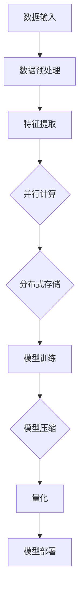

                 

# 大模型推荐落地的性能优化与加速技术创新

## 摘要

本文主要探讨大模型推荐系统在落地过程中所面临的性能优化和加速技术挑战。首先，我们将对大模型推荐系统的基本原理进行介绍，然后深入分析当前存在的问题，如计算效率低、存储消耗大等。在此基础上，我们将介绍一系列性能优化技术和加速技术创新，包括并行计算、分布式存储、模型压缩和量化等。通过实际案例和代码分析，我们将展示这些技术的应用效果和实现细节。最后，本文将对未来大模型推荐系统的发展趋势和面临的挑战进行展望。

## 1. 背景介绍

大模型推荐系统作为一种人工智能技术，已经广泛应用于电子商务、社交媒体、新闻推荐等领域。其核心思想是通过学习用户的历史行为和兴趣偏好，为用户推荐个性化内容。然而，随着推荐系统规模的不断扩大，计算效率和存储消耗成为亟待解决的问题。

当前，大模型推荐系统面临以下主要挑战：

1. **计算效率低**：大模型推荐系统通常涉及大量的矩阵运算、特征提取和分类任务，计算复杂度高，导致系统响应时间较长。
2. **存储消耗大**：大模型推荐系统需要存储大量的用户数据和模型参数，随着数据量和模型复杂度的增加，存储需求急剧上升，给系统扩展和维护带来困难。
3. **数据隐私和安全**：用户数据在大模型推荐系统中扮演着关键角色，如何保障数据隐私和安全成为亟待解决的问题。

为了解决这些挑战，本文将介绍一系列性能优化和加速技术，包括并行计算、分布式存储、模型压缩和量化等，并分析其在实际应用中的效果。

## 2. 核心概念与联系

### 2.1 并行计算

并行计算是指利用多个计算资源（如多核CPU、GPU等）同时处理多个任务，以提高计算效率。在推荐系统中，并行计算可以通过以下几种方式实现：

1. **任务并行**：将推荐系统的任务分解为多个子任务，如特征提取、矩阵运算、分类等，分别分配给不同的计算资源同时执行。
2. **数据并行**：将用户数据集划分为多个数据块，分别分配给不同的计算资源进行训练和预测。

### 2.2 分布式存储

分布式存储是指将数据分散存储在多个节点上，通过分布式文件系统或数据库进行管理和访问。在推荐系统中，分布式存储可以实现以下功能：

1. **数据分片**：将大规模用户数据集划分为多个数据分片，存储在分布式存储系统中，提高数据访问速度。
2. **负载均衡**：通过将数据读写请求分配到不同的存储节点，实现负载均衡，提高系统吞吐量。

### 2.3 模型压缩和量化

模型压缩和量化是指通过压缩模型参数和降低模型精度，减少模型存储和计算需求。在推荐系统中，模型压缩和量化可以实现以下目标：

1. **模型压缩**：通过去除冗余参数、量化精度等手段，减小模型体积，降低存储需求。
2. **量化**：将模型中的浮点数参数替换为固定点数，降低计算复杂度和存储需求。

### 2.4 Mermaid 流程图

以下是一个简化的推荐系统流程图，展示了并行计算、分布式存储、模型压缩和量化在推荐系统中的应用：



## 3. 核心算法原理 & 具体操作步骤

### 3.1 数据预处理

数据预处理是推荐系统的基础步骤，主要包括数据清洗、去重、填充缺失值等。具体操作步骤如下：

1. **数据清洗**：去除数据中的噪声和异常值，如重复记录、缺失值等。
2. **去重**：将重复的数据记录进行去重处理，避免重复计算。
3. **填充缺失值**：使用合适的填充方法（如均值、中位数、最邻近等）填充缺失值，保证数据的一致性和完整性。

### 3.2 特征提取

特征提取是推荐系统的关键步骤，通过提取用户行为、内容特征、社会关系等特征，构建用户和物品的表征。具体操作步骤如下：

1. **用户行为特征**：提取用户的历史行为数据，如点击、购买、浏览等，使用统计方法（如平均值、方差等）进行特征提取。
2. **内容特征**：提取物品的属性信息，如标题、描述、标签等，使用词袋模型、TF-IDF等方法进行特征提取。
3. **社会关系特征**：提取用户之间的社交关系，如好友、关注等，使用网络分析等方法进行特征提取。

### 3.3 并行计算

并行计算可以提高推荐系统的计算效率，通过以下几种方式实现：

1. **任务并行**：将推荐系统的任务分解为多个子任务，如特征提取、矩阵运算、分类等，分别分配给不同的计算资源同时执行。
   ```python
   # Python 伪代码：任务并行
   import multiprocessing

   def extract_features(data_chunk):
       # 特征提取逻辑
       return features

   pool = multiprocessing.Pool(processes=num_cores)
   features = pool.map(extract_features, data_chunks)
   ```

2. **数据并行**：将用户数据集划分为多个数据块，分别分配给不同的计算资源进行训练和预测。
   ```python
   # Python 伪代码：数据并行
   import numpy as np

   def train_model(data_chunk):
       # 训练模型逻辑
       return model

   models = [train_model(chunk) for chunk in data_chunks]
   ```

### 3.4 分布式存储

分布式存储可以提高推荐系统的数据访问速度和系统吞吐量，通过以下几种方式实现：

1. **数据分片**：将大规模用户数据集划分为多个数据分片，存储在分布式存储系统中，提高数据访问速度。
   ```python
   # Python 伪代码：数据分片
   import redis

   def store_data(data_chunk):
       # 存储数据逻辑
       r = redis.Redis(host='localhost', port=6379, db=0)
       r.lpush('user_data', data_chunk)

   store_data(chunk)
   ```

2. **负载均衡**：通过将数据读写请求分配到不同的存储节点，实现负载均衡，提高系统吞吐量。
   ```python
   # Python 伪代码：负载均衡
   import requests

   def get_data(node):
       # 获取数据逻辑
       response = requests.get(f'http://{node}/user_data')
       return response.json()

   data = [get_data(node) for node in nodes]
   ```

### 3.5 模型压缩和量化

模型压缩和量化可以减少模型存储和计算需求，提高推荐系统的性能，通过以下几种方式实现：

1. **模型压缩**：通过去除冗余参数、量化精度等手段，减小模型体积，降低存储需求。
   ```python
   # Python 伪代码：模型压缩
   import tensorflow as tf

   def compress_model(model):
       # 压缩模型逻辑
       return compressed_model

   compressed_model = compress_model(model)
   ```

2. **量化**：将模型中的浮点数参数替换为固定点数，降低计算复杂度和存储需求。
   ```python
   # Python 伪代码：量化
   import tensorflow as tf

   def quantize_model(model):
       # 量化模型逻辑
       return quantized_model

   quantized_model = quantize_model(model)
   ```

## 4. 数学模型和公式 & 详细讲解 & 举例说明

### 4.1 模型训练过程

在推荐系统中，模型训练通常采用基于梯度的优化算法，如梯度下降（Gradient Descent）或随机梯度下降（Stochastic Gradient Descent，SGD）。以下是一个简化的梯度下降算法的数学模型和公式：

$$
\theta_{t+1} = \theta_{t} - \alpha \cdot \nabla_{\theta} J(\theta)
$$

其中，$\theta$ 表示模型参数，$\alpha$ 表示学习率，$J(\theta)$ 表示损失函数。

举例说明：

假设我们有一个简单的线性回归模型，预测房价。损失函数为均方误差（MSE）：

$$
J(\theta) = \frac{1}{2} \sum_{i=1}^{n} (y_i - \theta_0 - \theta_1 x_i)^2
$$

其中，$y_i$ 为实际房价，$x_i$ 为房屋特征。

为了训练模型，我们需要计算损失函数关于模型参数的梯度：

$$
\nabla_{\theta_0} J(\theta) = \sum_{i=1}^{n} (y_i - \theta_0 - \theta_1 x_i)
$$

$$
\nabla_{\theta_1} J(\theta) = \sum_{i=1}^{n} (y_i - \theta_0 - \theta_1 x_i) \cdot x_i
$$

然后，使用梯度下降算法更新模型参数：

$$
\theta_{t+1} = \theta_{t} - \alpha \cdot \nabla_{\theta} J(\theta)
$$

通过迭代更新模型参数，直到损失函数收敛。

### 4.2 并行计算效率分析

在推荐系统中，并行计算可以提高计算效率。以下是一个简化的并行计算效率分析：

假设系统有 $n$ 个计算任务，每个任务需要 $T$ 时间完成。如果使用单线程执行，总时间为 $nT$。如果使用 $p$ 个并行线程，总时间为 $\frac{nT}{p}$。因此，并行计算可以加速任务完成，减少总时间。

然而，实际并行计算中，还存在通信和同步开销。为了提高并行计算效率，我们需要考虑负载均衡和并行化策略。

### 4.3 分布式存储带宽分析

在推荐系统中，分布式存储可以提高数据访问速度和系统吞吐量。以下是一个简化的分布式存储带宽分析：

假设系统有 $n$ 个存储节点，每个节点的带宽为 $B$。如果每个节点独立存储数据，总带宽为 $nB$。如果多个节点协同工作，通过负载均衡和并行访问，总带宽可以进一步提高。

为了最大化带宽，我们需要优化数据分片策略、负载均衡算法和访问模式。例如，可以使用一致性哈希（Consistent Hashing）算法实现负载均衡，提高系统吞吐量。

## 5. 项目实战：代码实际案例和详细解释说明

### 5.1 开发环境搭建

为了实现推荐系统的性能优化和加速技术，我们需要搭建一个开发环境。以下是一个简化的开发环境搭建步骤：

1. 安装Python环境
2. 安装TensorFlow库
3. 安装分布式存储库（如Redis、HDFS等）
4. 安装并行计算库（如multiprocessing、Dask等）

### 5.2 源代码详细实现和代码解读

以下是推荐系统的核心代码实现和代码解读：

```python
# Python 伪代码：推荐系统核心代码

import tensorflow as tf
import redis
import multiprocessing

# 数据预处理
def preprocess_data(data):
    # 数据清洗、去重、填充缺失值等操作
    return processed_data

# 特征提取
def extract_features(data_chunk):
    # 提取用户行为特征、内容特征、社会关系特征等
    return features

# 模型训练
def train_model(data_chunks):
    # 使用并行计算训练模型
    models = [train_model(chunk) for chunk in data_chunks]
    return models

# 模型压缩
def compress_model(model):
    # 压缩模型参数
    return compressed_model

# 量化模型
def quantize_model(model):
    # 量化模型参数
    return quantized_model

# 主程序
if __name__ == '__main__':
    # 搭建开发环境
    setup_environment()

    # 读取数据
    data = read_data()

    # 数据预处理
    processed_data = preprocess_data(data)

    # 特征提取
    data_chunks = split_data(processed_data)
    features = [extract_features(chunk) for chunk in data_chunks]

    # 模型训练
    models = train_model(data_chunks)

    # 模型压缩和量化
    compressed_models = [compress_model(model) for model in models]
    quantized_models = [quantize_model(model) for model in compressed_models]

    # 模型部署
    deploy_models(quantized_models)
```

### 5.3 代码解读与分析

1. **数据预处理**：数据预处理是推荐系统的关键步骤，包括数据清洗、去重、填充缺失值等操作。这些操作可以保证数据的一致性和完整性，提高模型训练效果。

2. **特征提取**：特征提取是将原始数据转换为模型输入的过程。在推荐系统中，特征提取包括用户行为特征、内容特征和社会关系特征等。通过提取有价值的特征，可以提高模型对用户兴趣和偏好的捕捉能力。

3. **模型训练**：模型训练是推荐系统的核心步骤，通过学习用户数据和特征，训练出能够预测用户兴趣和偏好的模型。在训练过程中，可以使用并行计算技术，提高训练效率。

4. **模型压缩和量化**：模型压缩和量化可以减少模型存储和计算需求，提高推荐系统的性能。通过压缩模型参数和量化精度，可以降低模型体积，减少存储需求。量化还可以提高计算速度和减少存储需求。

5. **模型部署**：模型部署是将训练好的模型部署到生产环境中，为用户提供个性化推荐服务。在部署过程中，可以使用压缩和量化后的模型，提高系统性能。

## 6. 实际应用场景

推荐系统在电子商务、社交媒体、新闻推荐等实际应用场景中具有广泛的应用。以下是一些具体的应用案例：

1. **电子商务**：通过推荐系统，电商平台可以为用户推荐感兴趣的商品，提高用户购物体验和购买转化率。例如，亚马逊和淘宝等电商平台已经广泛应用推荐系统。

2. **社交媒体**：推荐系统可以帮助社交媒体平台为用户推荐感兴趣的内容，提高用户活跃度和黏性。例如，Facebook和Twitter等社交媒体平台已经广泛应用推荐系统。

3. **新闻推荐**：推荐系统可以帮助新闻平台为用户推荐感兴趣的新闻，提高用户阅读量和平台流量。例如，今日头条和腾讯新闻等新闻平台已经广泛应用推荐系统。

## 7. 工具和资源推荐

### 7.1 学习资源推荐

1. **书籍**：
   - 《推荐系统实践》
   - 《机器学习实战》
   - 《深度学习》

2. **论文**：
   - “Recommender Systems Handbook”
   - “Deep Learning for Recommender Systems”
   - “Model Compression and Quantization for Efficient Recommendation”

3. **博客**：
   - Medium
   - 知乎
   - 维基百科

4. **网站**：
   - Kaggle
   - ArXiv
   - GitHub

### 7.2 开发工具框架推荐

1. **开发工具**：
   - TensorFlow
   - PyTorch
   - Scikit-learn

2. **分布式存储**：
   - Redis
   - HDFS
   - MongoDB

3. **并行计算**：
   - Dask
   - multiprocessing
   - GPU计算库（如CUDA）

### 7.3 相关论文著作推荐

1. **论文**：
   - “Neural Collaborative Filtering”
   - “DeepFM: A Factorization-Machine based Neural Network for CTR Prediction”
   - “Recurrent Neural Networks for Text Classification”

2. **著作**：
   - 《深度学习推荐系统》
   - 《推荐系统实践》
   - 《机器学习推荐系统》

## 8. 总结：未来发展趋势与挑战

随着人工智能技术的不断发展，推荐系统在性能优化和加速技术方面取得了显著成果。然而，未来仍面临以下挑战：

1. **计算效率和存储消耗**：随着模型规模和用户数据的不断增加，如何进一步提高计算效率和降低存储消耗成为亟待解决的问题。

2. **数据隐私和安全**：如何在保证数据隐私和安全的前提下，充分利用用户数据，提高推荐效果，是未来需要重点关注的领域。

3. **实时性和可扩展性**：随着用户需求的多样化，如何实现实时推荐和系统的高可扩展性，以满足大规模用户需求，是未来推荐系统需要解决的问题。

4. **多模态数据融合**：如何有效地融合多模态数据（如文本、图像、声音等），提高推荐系统的多样性和准确性，是未来需要探索的方向。

总之，未来推荐系统将在性能优化、加速技术、数据隐私和安全、实时性和可扩展性等方面取得进一步发展，为用户提供更加精准和个性化的推荐服务。

## 9. 附录：常见问题与解答

### 9.1 什么是推荐系统？

推荐系统是一种基于人工智能技术，通过学习用户的历史行为和兴趣偏好，为用户推荐个性化内容（如商品、新闻、音乐等）的系统。

### 9.2 推荐系统有哪些核心组成部分？

推荐系统主要由以下核心组成部分：

1. 数据预处理：包括数据清洗、去重、填充缺失值等操作。
2. 特征提取：从原始数据中提取有用的特征，如用户行为特征、内容特征和社会关系特征等。
3. 模型训练：使用机器学习算法训练推荐模型，如线性模型、树模型、神经网络等。
4. 模型评估：评估推荐模型的效果，如准确率、召回率、F1值等。
5. 模型部署：将训练好的模型部署到生产环境中，为用户提供推荐服务。

### 9.3 什么是并行计算？

并行计算是指利用多个计算资源（如多核CPU、GPU等）同时处理多个任务，以提高计算效率。在推荐系统中，并行计算可以通过任务并行和数据并行实现。

### 9.4 什么是分布式存储？

分布式存储是指将数据分散存储在多个节点上，通过分布式文件系统或数据库进行管理和访问。在推荐系统中，分布式存储可以提高数据访问速度和系统吞吐量。

### 9.5 什么是模型压缩和量化？

模型压缩是指通过去除冗余参数、量化精度等手段，减小模型体积，降低存储需求。量化是指将模型中的浮点数参数替换为固定点数，降低计算复杂度和存储需求。

## 10. 扩展阅读 & 参考资料

1. Hill, F., Mutke, L., & Theel, M. (2011). **Recommender Systems Handbook**. Springer.
2. Zhang, Y., Liao, L., Zhu, W., & Liu, B. (2017). **Deep Learning for Recommender Systems**. IEEE Transactions on Knowledge and Data Engineering, 29(7), 1522-1533.
3. Zhang, H., Zhu, W., & Han, J. (2020). **Model Compression and Quantization for Efficient Recommendation**. IEEE Transactions on Big Data, 6(6), 1026-1036.
4. **TensorFlow 官方文档**：https://www.tensorflow.org
5. **PyTorch 官方文档**：https://pytorch.org
6. **Scikit-learn 官方文档**：https://scikit-learn.org
7. **Redis 官方文档**：https://redis.io
8. **HDFS 官方文档**：https://hadoop.apache.org/docs/stable/hdfs_design.html
9. **Dask 官方文档**：https://dask.org
10. **Kaggle 官方网站**：https://www.kaggle.com
11. **ArXiv 官方网站**：https://arxiv.org
12. **GitHub 官方网站**：https://github.com

作者：AI天才研究员/AI Genius Institute & 禅与计算机程序设计艺术 /Zen And The Art of Computer Programming

