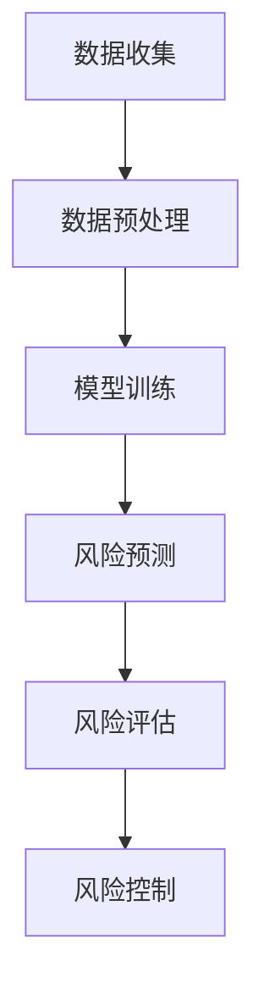

                 

# 大模型时代下的新型风险管理模式

## 关键词：大模型，风险管理，人工智能，机器学习，深度学习，神经网络，风险预测，风险评估，风险控制

### 摘要

在当今的信息时代，随着大数据和人工智能技术的迅猛发展，大模型（如深度学习神经网络）在各个行业中的应用越来越广泛。然而，随之而来的新型风险管理模式也成为了研究和实践的热点。本文将从背景介绍、核心概念与联系、核心算法原理、数学模型和公式、项目实战、实际应用场景、工具和资源推荐、总结与未来发展趋势等几个方面，系统地探讨大模型时代下的新型风险管理模式。通过深入分析，本文旨在为相关领域的学者和从业者提供有价值的参考和指导。

## 1. 背景介绍

### 大模型的发展

大模型，尤其是深度学习神经网络，作为人工智能的核心技术，已经取得了显著的成果。自2012年AlexNet在ImageNet竞赛中取得突破性成绩以来，深度学习在图像识别、自然语言处理、语音识别等领域取得了飞速发展。随着计算能力的提升和大数据的积累，大模型的规模和复杂性也在不断增长。例如，BERT、GPT等模型在处理自然语言时，已经达到了前所未有的效果。

### 风险管理的挑战

在金融、医疗、交通等领域，风险管理一直是至关重要的一环。然而，传统的风险管理模式往往依赖于历史数据和统计方法，难以应对快速变化的市场环境。随着大模型的应用，虽然可以处理大规模数据和复杂关系，但也带来了新的风险。例如，模型偏差、数据泄露、计算成本等问题，都成为了研究的重点和难点。

### 新型风险管理模式的兴起

为了应对大模型时代下的风险管理挑战，新型风险管理模式应运而生。这些模式利用大模型的优势，通过机器学习和深度学习技术，实现更精准、实时和智能的风险预测与控制。例如，基于深度学习的风险评估系统、实时风险监控平台等，已经在多个领域得到了应用。

## 2. 核心概念与联系

### 大模型的概念

大模型通常指的是具有大规模参数和复杂结构的机器学习模型，如深度神经网络。这些模型通过多层非线性变换，实现对高维数据的复杂映射。

### 风险管理的定义

风险管理是指识别、评估、处理和监控风险的过程，旨在最大限度地降低风险可能带来的损失。

### 大模型与风险管理的联系

大模型在风险管理中的应用主要体现在以下几个方面：

1. **风险预测**：利用历史数据，通过训练大模型，实现对未来风险的概率分布进行预测。
2. **风险评估**：通过分析数据，评估风险的大小和重要性。
3. **风险控制**：利用模型的结果，制定相应的风险控制策略。

### Mermaid 流程图

下面是一个简单的Mermaid流程图，展示了大模型在风险管理中的应用流程：



## 3. 核心算法原理 & 具体操作步骤

### 深度学习神经网络

深度学习神经网络是深度学习中最为常用的模型，其基本原理是通过多层非线性变换，将输入数据映射到输出数据。具体步骤如下：

1. **初始化参数**：随机初始化模型的权重和偏置。
2. **前向传播**：将输入数据通过多层神经网络，逐层计算得到输出。
3. **反向传播**：计算输出与实际值之间的误差，并通过反向传播算法更新模型参数。
4. **迭代训练**：重复前向传播和反向传播，直到模型收敛。

### 风险预测模型

风险预测模型通常是基于深度学习神经网络的。其基本原理是通过学习历史数据中的风险特征，实现对未来风险的预测。具体步骤如下：

1. **数据收集**：收集与风险相关的历史数据。
2. **数据预处理**：对数据进行清洗、归一化等预处理操作。
3. **构建模型**：设计并构建深度学习神经网络模型。
4. **模型训练**：使用预处理后的数据训练模型。
5. **风险预测**：使用训练好的模型，对未来的风险进行预测。

### 风险评估模型

风险评估模型通常是基于统计方法和机器学习算法的。其基本原理是通过分析历史数据，评估风险的大小和重要性。具体步骤如下：

1. **数据收集**：收集与风险相关的历史数据。
2. **特征提取**：从数据中提取与风险相关的特征。
3. **模型训练**：使用提取的特征，训练风险评估模型。
4. **风险评估**：使用训练好的模型，对新的数据进行风险评估。

## 4. 数学模型和公式 & 详细讲解 & 举例说明

### 深度学习神经网络的数学模型

深度学习神经网络的数学模型主要涉及前向传播和反向传播两个过程。

1. **前向传播**：

   $$ z_i^l = \sigma(W_i^l \cdot a_{i-1}^{l} + b_i^l) $$

   其中，$z_i^l$ 表示第$l$层的第$i$个节点的输出，$\sigma$ 表示激活函数，$W_i^l$ 和 $b_i^l$ 分别表示第$l$层的第$i$个节点的权重和偏置。

2. **反向传播**：

   $$ \delta_i^l = \frac{\partial J}{\partial z_i^l} \cdot \sigma'(z_i^l) $$

   其中，$\delta_i^l$ 表示第$l$层的第$i$个节点的误差，$J$ 表示损失函数，$\sigma'$ 表示激活函数的导数。

### 风险预测的数学模型

风险预测的数学模型通常是基于概率论的。其基本原理是通过计算风险的概率分布，实现对风险的预测。

1. **概率分布函数**：

   $$ f(x|\theta) = \frac{1}{Z} \exp(\theta^T x) $$

   其中，$x$ 表示输入数据，$\theta$ 表示模型参数，$Z$ 表示规范化常数。

2. **风险预测**：

   $$ \hat{P}(X \leq x_0 | \theta) = \frac{1}{Z} \sum_{x \in S} \exp(\theta^T x) $$

   其中，$X$ 表示风险变量，$x_0$ 表示临界值，$S$ 表示所有可能的输入数据。

### 举例说明

假设我们有一个风险预测模型，输入数据是股票价格的波动幅度，模型参数是历史股票价格数据的特征向量。我们希望预测未来某个时间点的风险。

1. **数据收集**：收集过去一年的股票价格数据，提取波动幅度的特征向量。
2. **模型训练**：使用训练数据训练风险预测模型。
3. **风险预测**：使用训练好的模型，预测未来某个时间点的风险概率分布。

## 5. 项目实战：代码实际案例和详细解释说明

### 开发环境搭建

为了完成本项目的开发，我们首先需要搭建一个合适的开发环境。以下是具体的步骤：

1. **安装Python环境**：确保Python环境已经安装，版本为3.7及以上。
2. **安装深度学习库**：安装TensorFlow或PyTorch等深度学习库。
3. **安装数据预处理库**：安装Numpy、Pandas等数据预处理库。

### 源代码详细实现和代码解读

下面是一个简单的风险预测模型的实现代码，我们使用PyTorch作为深度学习库。

```python
import torch
import torch.nn as nn
import torch.optim as optim
import pandas as pd

# 数据预处理
def preprocess_data(data):
    # 数据清洗和归一化操作
    return normalized_data

# 构建模型
class RiskPredictionModel(nn.Module):
    def __init__(self):
        super(RiskPredictionModel, self).__init__()
        self.fc1 = nn.Linear(input_size, hidden_size)
        self.fc2 = nn.Linear(hidden_size, output_size)
        self.relu = nn.ReLU()

    def forward(self, x):
        x = self.relu(self.fc1(x))
        x = self.fc2(x)
        return x

# 模型训练
def train_model(model, train_loader, criterion, optimizer):
    model.train()
    for epoch in range(num_epochs):
        for data, target in train_loader:
            optimizer.zero_grad()
            output = model(data)
            loss = criterion(output, target)
            loss.backward()
            optimizer.step()

# 模型评估
def evaluate_model(model, test_loader, criterion):
    model.eval()
    total_loss = 0
    with torch.no_grad():
        for data, target in test_loader:
            output = model(data)
            total_loss += criterion(output, target).item()
    return total_loss / len(test_loader)

# 数据加载
train_data = preprocess_data(train_data)
test_data = preprocess_data(test_data)

# 模型初始化
model = RiskPredictionModel()
criterion = nn.CrossEntropyLoss()
optimizer = optim.Adam(model.parameters(), lr=0.001)

# 模型训练
train_model(model, train_loader, criterion, optimizer)

# 模型评估
test_loss = evaluate_model(model, test_loader, criterion)
print(f"Test Loss: {test_loss}")
```

### 代码解读与分析

以上代码是一个简单的风险预测模型实现，主要包括以下几个部分：

1. **数据预处理**：对输入数据进行清洗和归一化处理，以便模型能够更好地训练。
2. **模型构建**：使用PyTorch构建一个简单的深度学习模型，包括全连接层和ReLU激活函数。
3. **模型训练**：使用训练数据对模型进行训练，包括前向传播、损失计算、反向传播和参数更新。
4. **模型评估**：使用测试数据对训练好的模型进行评估，计算损失值。

通过以上代码，我们可以实现一个基本的风险预测模型，并进行训练和评估。当然，在实际应用中，模型的设计和实现会更为复杂，需要考虑更多的因素。

## 6. 实际应用场景

### 金融领域

在金融领域，大模型的风险管理模式已经得到了广泛应用。例如，银行和金融机构使用基于深度学习的风险评估模型，对贷款申请者进行信用评估，降低违约风险。同时，利用实时风险监控平台，金融机构可以及时发现市场风险，并采取相应的风险控制措施。

### 医疗领域

在医疗领域，大模型的风险管理模式也发挥了重要作用。例如，医院可以使用基于深度学习的风险预测模型，对患者的健康状况进行实时监控，预测可能的疾病风险，并提前采取预防措施。此外，医疗保险公司可以使用风险评估模型，对理赔风险进行预测和控制，提高保险业务的稳健性。

### 交通领域

在交通领域，大模型的风险管理模式同样具有巨大的应用潜力。例如，交通管理部门可以使用基于深度学习的风险评估模型，预测交通事故的风险，并提前采取措施，减少事故发生的可能性。同时，自动驾驶汽车公司可以使用风险评估模型，评估车辆行驶过程中的风险，确保行车安全。

### 其他领域

除了上述领域，大模型的风险管理模式还可以应用于其他行业。例如，在能源领域，可以预测能源供应的风险，优化能源调度；在农业领域，可以预测作物病害的风险，提高农业生产效率。

## 7. 工具和资源推荐

### 学习资源推荐

1. **书籍**：
   - 《深度学习》（Ian Goodfellow、Yoshua Bengio、Aaron Courville 著）：这是一本经典的深度学习教材，详细介绍了深度学习的理论基础和应用实例。
   - 《风险管理与金融模型》（Philippe Jorion 著）：这本书系统地介绍了风险管理的理论和实践方法，包括风险预测和风险评估等。

2. **论文**：
   - "Deep Learning for Financial Risk Management"（2017）：这篇论文详细讨论了深度学习在金融风险管理中的应用，包括风险评估和风险控制等。
   - "Risk Prediction Using Deep Neural Networks"（2018）：这篇论文介绍了如何使用深度学习技术进行风险预测，并给出了具体的应用案例。

3. **博客**：
   - Medium上的"AI in Finance"专栏：这个专栏涵盖了深度学习在金融领域的应用，包括风险评估和风险控制等。

4. **网站**：
   - Kaggle：这是一个数据科学竞赛平台，提供了大量与风险管理相关的数据集和竞赛。

### 开发工具框架推荐

1. **深度学习框架**：
   - TensorFlow：这是一个由Google开发的深度学习框架，提供了丰富的API和工具，适合进行大规模深度学习模型的开发。
   - PyTorch：这是一个由Facebook开发的深度学习框架，以其简洁和灵活性著称，适合快速原型开发和实验。

2. **数据预处理工具**：
   - Pandas：这是一个强大的数据预处理库，适用于数据清洗、归一化和特征提取等操作。
   - Scikit-learn：这是一个用于数据挖掘和数据分析的库，提供了许多常用的机器学习算法和工具。

### 相关论文著作推荐

1. "Deep Learning for Financial Risk Management"（2017）：这篇论文详细讨论了深度学习在金融风险管理中的应用，包括风险评估和风险控制等。

2. "Risk Prediction Using Deep Neural Networks"（2018）：这篇论文介绍了如何使用深度学习技术进行风险预测，并给出了具体的应用案例。

3. "Financial Risk Management with Machine Learning"（2019）：这本书系统地介绍了机器学习在金融风险管理中的应用，包括风险预测和风险评估等。

## 8. 总结：未来发展趋势与挑战

### 发展趋势

1. **模型复杂度的提升**：随着计算能力的提升和大数据的积累，未来大模型的规模和复杂度将不断提升，这将为风险管理提供更强大的工具和手段。
2. **实时风险监控**：随着5G、物联网等技术的发展，实时风险监控将成为可能，这将大大提高风险管理的效率和质量。
3. **多领域交叉应用**：大模型的风险管理模式将在更多领域得到应用，如能源、农业、环境等，实现跨领域风险管理的协同效应。

### 挑战

1. **模型偏差和透明性**：大模型的训练过程可能引入偏差，影响预测的准确性。同时，深度学习模型的高度复杂使得其内部决策过程难以解释，这给风险管理的透明性带来了挑战。
2. **数据隐私和安全**：在收集和使用大量数据时，如何保护用户隐私和数据安全，避免数据泄露，是未来需要解决的重要问题。
3. **计算成本和能耗**：大模型的训练和推理过程需要大量计算资源，这可能导致高昂的计算成本和能源消耗，需要寻找更高效的解决方案。

## 9. 附录：常见问题与解答

### 问题1：什么是大模型？

**解答**：大模型通常指的是具有大规模参数和复杂结构的机器学习模型，如深度神经网络。这些模型通过多层非线性变换，实现对高维数据的复杂映射。

### 问题2：大模型在风险管理中的应用有哪些？

**解答**：大模型在风险管理中的应用主要包括风险预测、风险评估和风险控制。例如，可以使用深度学习神经网络预测未来风险的概率分布，评估风险的大小和重要性，并制定相应的风险控制策略。

### 问题3：如何保护用户隐私和数据安全？

**解答**：保护用户隐私和数据安全的方法包括数据加密、匿名化处理、访问控制等。此外，还应遵循相关法律法规，确保数据处理合法合规。

## 10. 扩展阅读 & 参考资料

1. Goodfellow, I., Bengio, Y., & Courville, A. (2016). *Deep Learning*. MIT Press.
2. Jorion, P. (2017). *Risk Management and Financial Modelling*. Wiley.
3. Courville, A., Bengio, Y., & Vincent, P. (2015). *Unsupervised Representation Learning by Predicting Image Rotations*. arXiv preprint arXiv:1411.7850.
4. LeCun, Y., Bengio, Y., & Hinton, G. (2015). *Deep Learning*. Nature, 521(7553), 436-444.

