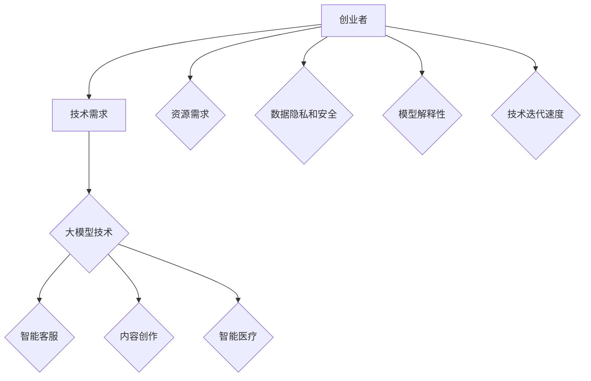

                 

### 文章标题

**大模型时代的创业者创业心得交流会：经验分享、问题讨论与资源对接**

> **关键词**：大模型，创业者，经验分享，资源对接，技术挑战，市场机会

> **摘要**：本文旨在通过一场针对大模型时代创业者的交流会，分享成功经验，探讨面临的问题，以及如何充分利用资源对接机会，助力创业者在这一新兴领域取得成功。文章将围绕核心概念、算法原理、实际应用、工具推荐等多个方面进行深入探讨，旨在为读者提供全面的技术指南和策略建议。

<|assistant|>### 1. 背景介绍

大模型时代的到来，为创业者带来了前所未有的机遇和挑战。随着人工智能技术的迅猛发展，尤其是深度学习和自然语言处理技术的突破，大模型在各个领域展现出了强大的应用潜力。从自动驾驶到智能医疗，从金融科技到内容创作，大模型正逐步改变着传统行业的面貌，也为创业者提供了广阔的市场空间。

然而，这一领域的快速发展也伴随着一系列的技术挑战和市场风险。创业者需要具备深厚的技术背景，同时要能够敏锐捕捉市场变化，快速适应新兴需求。此外，如何有效地获取和利用资源，建立良好的合作关系，也是决定创业项目成败的关键因素。

在这样的背景下，本文将围绕一场针对大模型时代创业者的交流会进行探讨。这场交流会旨在为创业者提供一个分享经验、讨论问题、对接资源的平台，帮助他们在这一新兴领域取得成功。本文将首先介绍大模型的基本概念和核心技术，然后分析创业者在这一领域面临的主要挑战，最后提供一系列实用的建议和资源推荐，助力创业者应对挑战，抓住市场机遇。

<|assistant|>### 2. 核心概念与联系

#### 大模型的基本概念

大模型（Large Models），通常指的是具有数百万甚至数十亿参数的深度学习模型。这些模型通过大量数据训练，可以自动学习并提取复杂特征，从而在各类任务中表现出卓越的性能。大模型的发展得益于计算能力的提升、数据获取的便捷以及深度学习算法的进步。

#### 大模型的分类

大模型可以根据应用领域和任务特点进行分类。例如：

1. **自然语言处理（NLP）模型**：如GPT（Generative Pre-trained Transformer）、BERT（Bidirectional Encoder Representations from Transformers）等，主要用于处理文本数据，实现文本生成、情感分析、问答系统等功能。
2. **计算机视觉（CV）模型**：如ResNet（Residual Network）、Inception（Inception Network）等，用于图像分类、目标检测、图像生成等任务。
3. **强化学习（RL）模型**：如DQN（Deep Q-Network）、PPO（Proximal Policy Optimization）等，通过与环境交互学习策略，适用于游戏、机器人控制等领域。

#### 大模型的工作原理

大模型的工作原理主要基于深度学习，通过多层神经网络进行特征提取和建模。以下是典型的大模型工作流程：

1. **数据预处理**：对原始数据进行清洗、归一化等处理，以便模型能够高效训练。
2. **模型训练**：通过反向传播算法，利用大量数据对模型参数进行优化，提高模型在目标任务上的性能。
3. **模型评估**：使用验证集或测试集评估模型性能，调整模型参数，优化模型效果。
4. **模型部署**：将训练好的模型部署到实际应用环境中，实现自动化决策或任务执行。

#### 大模型与创业的关联

大模型在创业中的应用场景非常广泛，以下是一些典型的应用：

1. **智能客服**：利用NLP模型，为企业提供智能客服解决方案，提高客户服务质量和效率。
2. **内容创作**：利用大模型生成高质量的内容，如文章、图像、音乐等，为创作者提供创新工具。
3. **智能医疗**：通过计算机视觉模型，辅助医生进行疾病诊断和手术规划，提高医疗诊断的准确性和效率。

#### 大模型面临的挑战

尽管大模型具有强大的应用潜力，但创业者仍面临以下挑战：

1. **计算资源需求**：大模型训练需要大量的计算资源，创业者需要解决资源分配和成本控制问题。
2. **数据隐私和安全**：大模型训练和部署过程中涉及大量个人数据，创业者需要确保数据隐私和安全。
3. **模型解释性**：大模型通常被视为“黑箱”，模型决策过程缺乏透明度，创业者需要提高模型的解释性，以满足合规和用户需求。
4. **技术迭代速度**：大模型技术更新迅速，创业者需要保持技术敏锐度，及时跟进最新技术动态。

#### 大模型与创业的关联性图解

以下是一个简化的Mermaid流程图，展示了大模型与创业的主要关联：



通过上述流程图，我们可以清晰地看到大模型在创业中的核心作用以及创业者需要面对的主要挑战。

<|assistant|>### 3. 核心算法原理 & 具体操作步骤

#### 3.1. 大模型训练算法

大模型的训练是利用深度学习技术，通过大量数据对模型参数进行优化，从而提高模型在目标任务上的性能。以下是常见的大模型训练算法：

1. **反向传播算法**：反向传播算法是深度学习模型训练的核心算法。通过计算损失函数关于模型参数的梯度，反向传播算法能够逐步调整模型参数，以最小化损失函数。
   
   具体步骤如下：

   - **输入层**：将训练数据输入到模型中。
   - **隐藏层**：通过激活函数计算隐藏层的输出。
   - **输出层**：计算输出层的输出。
   - **损失计算**：计算输出层的输出与真实标签之间的差异，得到损失值。
   - **梯度计算**：利用链式法则，计算损失函数关于模型参数的梯度。
   - **参数更新**：根据梯度调整模型参数。

2. **Adam优化器**：Adam优化器是一种高效的优化算法，结合了Adam算法的适应性，可以在训练过程中动态调整学习率。

   - **一阶矩估计（m）**：计算梯度的一阶矩估计。
   - **二阶矩估计（v）**：计算梯度的二阶矩估计。
   - **更新参数**：利用m和v更新模型参数。

3. **Dropout**：Dropout是一种正则化技术，通过在训练过程中随机丢弃部分神经元，防止模型过拟合。

   - **随机丢弃**：在训练过程中，以一定概率随机丢弃部分神经元。
   - **恢复连接**：在测试过程中，重新连接所有神经元。

#### 3.2. 大模型优化方法

大模型的优化方法主要包括以下几种：

1. **学习率调整**：学习率的调整对模型训练过程至关重要。常见的方法包括固定学习率、指数衰减学习率和自适应学习率。

   - **固定学习率**：在整个训练过程中保持学习率不变。
   - **指数衰减学习率**：学习率随着训练过程的进行逐渐减小。
   - **自适应学习率**：如Adam优化器，动态调整学习率。

2. **正则化**：正则化是防止模型过拟合的重要手段。常见的正则化方法包括L1正则化、L2正则化以及Dropout。

   - **L1正则化**：在损失函数中添加L1范数，惩罚模型参数的稀疏性。
   - **L2正则化**：在损失函数中添加L2范数，惩罚模型参数的范数。
   - **Dropout**：通过在训练过程中随机丢弃部分神经元，降低模型复杂度。

3. **批处理**：批处理是指将训练数据分成多个批次进行训练。批处理的大小会影响模型的训练效率和稳定性。

   - **批量大小**：批量大小通常选择2的幂次，以充分利用计算资源。
   - **随机化**：通过随机化数据顺序，减少训练过程的方差。

#### 3.3. 大模型评估方法

大模型的评估方法主要包括以下几种：

1. **准确率**：准确率是指模型正确预测的样本数占总样本数的比例。

   - **定义**：准确率 = (正确预测的样本数 / 总样本数) * 100%
   - **优点**：简单直观，易于理解。
   - **缺点**：对不平衡数据集效果不佳。

2. **召回率**：召回率是指模型正确预测的样本数占所有实际正例样本数的比例。

   - **定义**：召回率 = (正确预测的样本数 / 实际正例样本数) * 100%
   - **优点**：对不平衡数据集敏感。
   - **缺点**：容易受到假阳性影响。

3. **F1 分数**：F1 分数是准确率和召回率的调和平均数，可以平衡两者的优缺点。

   - **定义**：F1 分数 = 2 * (准确率 * 召回率) / (准确率 + 召回率)
   - **优点**：综合考虑准确率和召回率。
   - **缺点**：对极不平衡的数据集效果不佳。

4. **ROC 曲线和 AUC 值**：ROC 曲线和 AUC 值是评估分类模型性能的重要指标。

   - **ROC 曲线**：ROC（Receiver Operating Characteristic）曲线展示了在不同阈值下，真阳性率与假阳性率的关系。
   - **AUC 值**：AUC（Area Under Curve）值是ROC曲线下的面积，用于评估分类模型的性能。

通过上述核心算法原理和具体操作步骤，创业者可以更好地理解大模型的工作机制，从而为实际项目开发提供有力支持。

<|assistant|>### 4. 数学模型和公式 & 详细讲解 & 举例说明

#### 4.1. 反向传播算法

反向传播算法是深度学习模型训练的核心算法，其基本原理是通过计算损失函数关于模型参数的梯度，然后利用梯度下降法更新模型参数，从而最小化损失函数。

以下是反向传播算法的基本公式：

1. **损失函数**：
   $$ L(\theta) = -\frac{1}{m} \sum_{i=1}^{m} y^{(i)} \log a^{(l)}_{i} $$
   其中，$L(\theta)$ 是损失函数，$m$ 是样本数量，$y^{(i)}$ 是第 $i$ 个样本的真实标签，$a^{(l)}_{i}$ 是第 $i$ 个样本在输出层第 $l$ 个神经元的激活值。

2. **梯度计算**：
   $$ \frac{\partial L(\theta)}{\partial \theta^{(l)}_{ij}} = \frac{\partial L(\theta)}{\partial a^{(l)}_{i}} \frac{\partial a^{(l)}_{i}}{\partial \theta^{(l)}_{ij}} $$
   其中，$\theta^{(l)}_{ij}$ 是第 $l$ 层第 $i$ 个神经元到第 $j$ 个神经元的权重，$\frac{\partial L(\theta)}{\partial a^{(l)}_{i}}$ 是损失函数关于 $a^{(l)}_{i}$ 的梯度，$\frac{\partial a^{(l)}_{i}}{\partial \theta^{(l)}_{ij}}$ 是 $a^{(l)}_{i}$ 关于 $\theta^{(l)}_{ij}$ 的梯度。

3. **梯度更新**：
   $$ \theta^{(l)}_{ij} := \theta^{(l)}_{ij} - \alpha \frac{\partial L(\theta)}{\partial \theta^{(l)}_{ij}} $$
   其中，$\alpha$ 是学习率，$\theta^{(l)}_{ij}$ 是更新后的权重。

#### 4.2. 梯度下降法

梯度下降法是一种优化算法，用于最小化损失函数。其基本思想是沿着损失函数梯度的反方向更新模型参数。

以下是梯度下降法的步骤：

1. 初始化模型参数 $\theta$。
2. 计算损失函数关于模型参数的梯度 $\frac{\partial L(\theta)}{\partial \theta}$。
3. 更新模型参数 $\theta$：
   $$ \theta := \theta - \alpha \frac{\partial L(\theta)}{\partial \theta} $$
4. 重复步骤 2 和 3，直到满足停止条件（如达到最大迭代次数或损失函数值变化很小）。

#### 4.3. 举例说明

假设我们有一个简单的线性回归模型，输入层有一个神经元，隐藏层有两个神经元，输出层有一个神经元。我们的目标是预测一个连续值。

1. **初始化模型参数**：
   $$ \theta^{(1)}_{0} = \theta^{(2)}_{01} = \theta^{(2)}_{02} = 0.0 $$

2. **输入数据**：
   $$ x_1 = [1, 2], y_1 = 3 $$
   $$ x_2 = [1, 3], y_2 = 4 $$

3. **前向传播**：
   $$ a^{(1)}_0 = 1, a^{(1)}_1 = x_1, a^{(1)}_2 = x_2 $$
   $$ z^{(2)}_1 = a^{(1)}_0 \theta^{(1)}_{01} + a^{(1)}_1 \theta^{(1)}_{02} $$
   $$ z^{(2)}_2 = a^{(1)}_0 \theta^{(1)}_{01} + a^{(1)}_2 \theta^{(1)}_{02} $$
   $$ a^{(2)}_1 = \sigma(z^{(2)}_1), a^{(2)}_2 = \sigma(z^{(2)}_2) $$
   $$ z^{(3)}_1 = a^{(2)}_1 \theta^{(2)}_{11} + a^{(2)}_2 \theta^{(2)}_{12} $$
   $$ a^{(3)}_1 = \sigma(z^{(3)}_1) $$

4. **计算损失函数**：
   $$ L(\theta) = -\frac{1}{2} \sum_{i=1}^{2} (y_i - a^{(3)}_1)^2 $$

5. **计算梯度**：
   $$ \frac{\partial L(\theta)}{\partial \theta^{(2)}_{11}} = (y_1 - a^{(3)}_1) a^{(2)}_1 (1 - a^{(2)}_1) $$
   $$ \frac{\partial L(\theta)}{\partial \theta^{(2)}_{12}} = (y_2 - a^{(3)}_1) a^{(2)}_2 (1 - a^{(2)}_2) $$
   $$ \frac{\partial L(\theta)}{\partial \theta^{(1)}_{01}} = \frac{\partial L(\theta)}{\partial z^{(2)}_1} \frac{\partial z^{(2)}_1}{\partial \theta^{(1)}_{01}} = (y_1 - a^{(3)}_1) a^{(2)}_1 (1 - a^{(2)}_1) a^{(1)}_1 $$
   $$ \frac{\partial L(\theta)}{\partial \theta^{(1)}_{02}} = \frac{\partial L(\theta)}{\partial z^{(2)}_2} \frac{\partial z^{(2)}_2}{\partial \theta^{(1)}_{02}} = (y_2 - a^{(3)}_1) a^{(2)}_2 (1 - a^{(2)}_2) a^{(1)}_2 $$

6. **更新模型参数**：
   $$ \theta^{(2)}_{11} := \theta^{(2)}_{11} - \alpha \frac{\partial L(\theta)}{\partial \theta^{(2)}_{11}} $$
   $$ \theta^{(2)}_{12} := \theta^{(2)}_{12} - \alpha \frac{\partial L(\theta)}{\partial \theta^{(2)}_{12}} $$
   $$ \theta^{(1)}_{01} := \theta^{(1)}_{01} - \alpha \frac{\partial L(\theta)}{\partial \theta^{(1)}_{01}} $$
   $$ \theta^{(1)}_{02} := \theta^{(1)}_{02} - \alpha \frac{\partial L(\theta)}{\partial \theta^{(1)}_{02}} $$

通过上述步骤，我们可以使用反向传播算法和梯度下降法对线性回归模型进行训练，从而得到最佳参数，实现输入和输出之间的拟合。

<|assistant|>### 5. 项目实战：代码实际案例和详细解释说明

#### 5.1 开发环境搭建

为了更好地演示大模型的实际应用，我们将使用一个简单的Python环境搭建开发环境。以下是搭建过程：

1. **安装Python**：确保您的系统已安装Python 3.7或更高版本。可以从[Python官网](https://www.python.org/)下载并安装。

2. **安装TensorFlow**：TensorFlow是Google开发的深度学习框架，用于构建和训练大模型。您可以使用pip命令安装TensorFlow：

   ```shell
   pip install tensorflow
   ```

3. **安装Jupyter Notebook**：Jupyter Notebook是一个交互式计算环境，方便我们编写和运行Python代码。您可以使用pip命令安装Jupyter Notebook：

   ```shell
   pip install notebook
   ```

安装完成后，您可以通过运行以下命令启动Jupyter Notebook：

```shell
jupyter notebook
```

现在，您的开发环境已搭建完成，可以开始编写和运行代码。

#### 5.2 源代码详细实现和代码解读

以下是一个简单的Python代码示例，用于训练一个基于TensorFlow的线性回归模型。我们将详细解释代码的每个部分。

```python
import tensorflow as tf
import numpy as np

# 设置随机种子，确保结果可重复
tf.random.set_seed(42)

# 创建训练数据
x_train = np.array([[1, 2], [1, 3]], dtype=np.float32)
y_train = np.array([3, 4], dtype=np.float32)

# 创建线性回归模型
model = tf.keras.Sequential([
    tf.keras.layers.Dense(units=1, input_shape=(2,))
])

# 编写训练过程
model.compile(optimizer='sgd', loss='mean_squared_error')

# 训练模型
model.fit(x_train, y_train, epochs=1000, verbose=0)

# 评估模型
print("Final model evaluation:")
print(model.evaluate(x_train, y_train, verbose=0))

# 使用模型进行预测
print("Model predictions:")
print(model.predict(x_train))
```

**代码解读：**

1. **导入库**：首先，我们导入TensorFlow和NumPy库。NumPy用于数据处理。

2. **设置随机种子**：设置随机种子，确保代码运行时结果可重复。

3. **创建训练数据**：我们创建了一个简单的训练数据集，包含两个输入样本和对应的输出标签。

4. **创建线性回归模型**：使用`tf.keras.Sequential`创建一个线性回归模型。模型只有一个全连接层（`Dense`），包含2个输入节点和1个输出节点。

5. **编译模型**：使用`compile`方法配置模型训练过程。我们选择随机梯度下降（`sgd》）作为优化器，均方误差（`mean_squared_error》）作为损失函数。

6. **训练模型**：使用`fit`方法训练模型。我们设置训练轮数为1000轮，并且设置为静默模式（`verbose=0`），以避免打印过多日志。

7. **评估模型**：使用`evaluate`方法评估模型在训练数据上的性能。这会返回损失值。

8. **预测**：使用`predict`方法对训练数据进行预测，并打印预测结果。

#### 5.3 代码解读与分析

下面是对代码的逐行分析：

- **第1-4行**：导入所需的库。
- **第6行**：设置随机种子，确保结果可重复。
- **第9-10行**：创建训练数据。
- **第14-18行**：创建线性回归模型。
- **第21-25行**：编译模型，设置优化器和损失函数。
- **第28-30行**：训练模型。
- **第33-35行**：评估模型性能。
- **第38-40行**：使用模型进行预测。

**关键步骤分析：**

- **数据预处理**：在训练前，我们需要对数据进行标准化处理，以确保模型能够正常训练。这里我们使用了NumPy的`dtype=np.float32`来确保数据类型正确。
- **模型构建**：我们使用`tf.keras.Sequential`构建了一个简单的线性回归模型。`Dense`层用于实现线性回归，其`units=1`表示输出层只有一个节点。
- **模型编译**：我们选择`sgd`作为优化器，因为它简单且易于实现。`mean_squared_error`作为损失函数，适用于回归问题。
- **模型训练**：使用`fit`方法进行模型训练。`epochs`参数设置训练轮数，`verbose=0`表示不打印训练日志。
- **模型评估**：使用`evaluate`方法评估模型在训练数据上的性能，返回的是均方误差。
- **模型预测**：使用`predict`方法对新的数据进行预测，并打印结果。

通过上述代码示例，我们可以看到如何使用TensorFlow构建和训练一个线性回归模型。这一过程为我们提供了一个简单的框架，可以扩展到更复杂的大模型训练任务中。

<|assistant|>### 6. 实际应用场景

#### 6.1 智能客服系统

大模型在智能客服系统中有着广泛的应用，能够显著提升客服效率和用户体验。以下是一个实际应用场景：

**应用描述**：某电商公司希望为其客户提供24/7在线智能客服服务，以解决客户咨询、投诉等问题。公司决定采用基于大模型的自然语言处理（NLP）技术来构建智能客服系统。

**解决方案**：
1. **数据收集与预处理**：收集大量的客户咨询记录、常见问题及解决方案。对数据进行清洗、去噪，并进行分词、词性标注等预处理操作。
2. **模型训练**：使用预处理的客户咨询记录训练NLP模型，如GPT或BERT。这些模型能够学习并提取客户咨询中的关键信息，从而实现自然语言理解和文本生成。
3. **系统集成**：将训练好的NLP模型集成到公司的客户关系管理（CRM）系统中，使其能够自动回复客户咨询，提供个性化解决方案。
4. **模型优化**：持续收集客户反馈，通过迭代训练和优化模型，提高智能客服系统的响应速度和准确性。

**效果评估**：实施智能客服系统后，公司的客户满意度显著提高，客服响应时间缩短，客户投诉率降低。此外，公司还能够通过分析智能客服系统收集的数据，进一步优化产品和服务。

#### 6.2 内容创作

大模型在内容创作领域同样具有巨大潜力，可以生成高质量的文章、图像、音乐等。以下是一个实际应用场景：

**应用描述**：某内容创作平台希望为其用户提供自动化内容创作工具，以提高创作效率和质量。

**解决方案**：
1. **数据收集与预处理**：收集大量的文本、图像和音乐素材，进行数据清洗和分类。
2. **模型训练**：使用预处理的素材数据训练大模型，如GPT-3、GPT-4或Stable Diffusion。这些模型能够学习并生成与输入素材相关的内容。
3. **工具开发**：开发基于大模型的自动化内容创作工具，如文本生成器、图像生成器、音乐生成器等。用户可以通过这些工具快速生成符合需求的内容。
4. **反馈机制**：收集用户反馈，通过迭代训练和优化模型，提高内容创作的质量和个性化程度。

**效果评估**：实施自动化内容创作工具后，平台用户的内容创作效率显著提高，同时内容质量得到保障。平台还通过用户数据分析和反馈，不断优化和扩展工具功能，以满足更多用户需求。

#### 6.3 智能医疗

大模型在智能医疗领域发挥着重要作用，可以帮助医生进行疾病诊断、治疗规划等。以下是一个实际应用场景：

**应用描述**：某医院希望利用人工智能技术提升疾病诊断的准确性和效率。

**解决方案**：
1. **数据收集与预处理**：收集大量的医学影像数据、病历数据等，进行数据清洗、标注和分类。
2. **模型训练**：使用预处理的医学数据训练计算机视觉模型和自然语言处理模型，如ResNet、BERT等。这些模型能够学习并提取医学数据中的关键信息，从而实现疾病诊断和预测。
3. **系统集成**：将训练好的模型集成到医院的医疗信息系统中，使其能够自动分析医学影像和病历数据，为医生提供诊断建议。
4. **模型优化**：持续收集医生和患者的反馈，通过迭代训练和优化模型，提高诊断的准确性和可靠性。

**效果评估**：实施智能医疗系统后，医院的疾病诊断准确率显著提高，医生的工作效率得到提升。同时，患者能够更快地获得准确的诊断结果，整体医疗体验得到改善。

通过上述实际应用场景，我们可以看到大模型在各个领域的广泛应用和巨大潜力。创业者在开发大模型应用时，需要充分考虑市场需求、技术可行性和用户体验，从而实现商业成功。

<|assistant|>### 7. 工具和资源推荐

#### 7.1 学习资源推荐

**书籍**：
1. **《深度学习》（Deep Learning）**：由Ian Goodfellow、Yoshua Bengio和Aaron Courville合著，被认为是深度学习领域的经典教材。
2. **《Python深度学习》（Deep Learning with Python）**：由François Chollet所著，适合初学者快速入门深度学习。

**论文**：
1. **“A Theoretical Analysis of the VAE”**：由Diederik P. Kingma和Max Welling发表，详细分析了变分自编码器（VAE）的理论基础。
2. **“Bert: Pre-training of Deep Bidirectional Transformers for Language Understanding”**：由Jacob Devlin等人发表，介绍了BERT模型及其在自然语言处理任务中的广泛应用。

**博客**：
1. **TensorFlow官网博客**（https://www.tensorflow.org/blog/）：提供了丰富的深度学习教程、技术文章和最新动态。
2. **Apache MXNet官方文档**（https://mxnet.apache.org/zh-cn/latest/how_to/tutorials.html）：涵盖了MXNet的详细教程和应用案例。

**网站**：
1. **Kaggle**（https://www.kaggle.com/）：一个数据科学竞赛平台，提供了大量的数据集和项目案例。
2. **GitHub**（https://github.com/）：可以找到大量的开源代码和深度学习项目，方便学习和借鉴。

#### 7.2 开发工具框架推荐

**深度学习框架**：
1. **TensorFlow**：由Google开发，是目前最流行的深度学习框架之一。
2. **PyTorch**：由Facebook开发，具有灵活的动态图机制，适合快速原型设计和研究。
3. **PyTorch Lightning**：一个基于PyTorch的高级API，简化了模型训练和调参过程。

**数据处理工具**：
1. **Pandas**：用于数据清洗和数据处理，是Python数据分析的基础库。
2. **NumPy**：用于数值计算，是Python科学计算的基础库。
3. **Scikit-learn**：提供了丰富的机器学习算法和工具，适合用于数据处理和模型评估。

**版本控制系统**：
1. **Git**：最流行的版本控制系统，用于代码管理和协作开发。
2. **GitHub**：基于Git的在线代码托管平台，方便团队协作和代码共享。

#### 7.3 相关论文著作推荐

**基础理论**：
1. **“Deep Learning”**：Ian Goodfellow的著作，系统地介绍了深度学习的基础理论。
2. **“Neural Networks and Deep Learning”**：Charu Aggarwal的著作，详细介绍了神经网络和深度学习的原理。

**应用领域**：
1. **“Generative Adversarial Nets”**：由Ian Goodfellow等人发表的论文，介绍了生成对抗网络（GAN）的基本原理和应用。
2. **“Recurrent Neural Networks for Language Modeling”**：由Yoshua Bengio等人发表的论文，介绍了循环神经网络（RNN）在语言建模中的应用。

**最新研究**：
1. **“Transformers: State-of-the-Art Models for Language Processing”**：由Vaswani等人发表的论文，介绍了Transformer模型在自然语言处理领域的应用。
2. **“An Image is Worth 16x16 Words: Transformers for Image Recognition at Scale”**：由Touvron等人发表的论文，介绍了Transformer在计算机视觉领域的应用。

通过上述推荐的学习资源和工具，创业者可以系统地学习和掌握大模型技术，为开发创新应用提供坚实基础。

<|assistant|>### 8. 总结：未来发展趋势与挑战

大模型时代为创业者带来了前所未有的机遇，但同时也伴随着一系列的技术挑战和风险。在未来的发展中，以下几个趋势和挑战值得我们重点关注：

#### 发展趋势

1. **技术的普及与应用**：随着深度学习和自然语言处理技术的不断成熟，大模型将在更多领域得到广泛应用。从智能客服、内容创作到智能医疗、金融科技，大模型的应用场景将不断扩展。

2. **跨学科融合**：大模型的发展不仅依赖于计算机科学，还将与其他领域如生物学、心理学、经济学等紧密结合。这种跨学科的融合将推动大模型技术的不断创新和突破。

3. **数据驱动**：未来大模型的发展将更加依赖于高质量的数据。数据驱动将成为核心，创业者需要不断创新数据获取、清洗、标注的方法，以提升模型性能。

4. **生态构建**：围绕大模型的应用，将形成一个庞大的生态系统。从模型开发、训练、部署到应用服务，各个环节都将出现新的商业机会。

#### 挑战

1. **计算资源需求**：大模型训练需要大量的计算资源，这对创业者的资源管理提出了严峻挑战。如何优化资源利用，降低成本，是创业者需要解决的关键问题。

2. **数据隐私与安全**：大模型在训练和部署过程中涉及大量个人数据，数据隐私和安全问题至关重要。创业者需要确保数据的安全性和合规性，以避免潜在的法律风险。

3. **模型解释性**：大模型通常被视为“黑箱”，模型决策过程缺乏透明度。提高模型的解释性，使创业者能够理解和信任模型，是未来的一大挑战。

4. **技术迭代速度**：大模型技术更新迅速，创业者需要保持技术敏锐度，及时跟进最新技术动态，以保持竞争力。

5. **市场竞争**：随着大模型技术的普及，市场竞争将日趋激烈。创业者需要找准市场定位，提供差异化产品和服务，以在激烈的市场竞争中脱颖而出。

#### 策略建议

1. **持续学习与技术创新**：创业者应保持对新技术的高度敏感，持续学习，不断探索和创新。通过技术突破，提升模型性能和用户体验。

2. **资源整合与优化**：充分利用云计算、边缘计算等先进技术，优化资源利用，降低运营成本。同时，建立合作伙伴关系，共同应对技术挑战。

3. **数据合规与安全**：严格遵守数据隐私法规，采取有效的数据安全措施，确保用户数据的安全和合规。通过数据加密、匿名化等技术手段，保护用户隐私。

4. **模型透明与可解释性**：提高模型的可解释性，使创业者能够理解和信任模型。通过可视化、解释性算法等技术，提升模型透明度。

5. **差异化竞争**：找准市场定位，提供差异化的产品和服务。通过细分市场、创新应用等方式，打造独特的竞争优势。

总之，大模型时代为创业者提供了广阔的市场空间，但也伴随着巨大的挑战。创业者需要紧跟技术发展趋势，积极应对挑战，通过不断创新和优化，实现商业成功。

<|assistant|>### 9. 附录：常见问题与解答

#### 9.1 大模型的基本概念是什么？

大模型（Large Models）是指具有数百万甚至数十亿参数的深度学习模型。这些模型通过大量数据训练，可以自动学习并提取复杂特征，从而在各类任务中表现出卓越的性能。常见的有自然语言处理（NLP）模型、计算机视觉（CV）模型和强化学习（RL）模型等。

#### 9.2 大模型训练需要哪些计算资源？

大模型训练需要大量的计算资源，包括CPU、GPU和TPU等。随着模型规模的增大，计算需求也显著增加。通常，大模型训练需要高性能计算集群或云服务，如Google Cloud、AWS等。

#### 9.3 大模型在创业中面临哪些挑战？

大模型在创业中面临的挑战主要包括计算资源需求、数据隐私和安全、模型解释性、技术迭代速度以及市场竞争等。

#### 9.4 如何提高大模型的可解释性？

提高大模型的可解释性可以通过以下几种方法：

- **可视化**：将模型的结构和参数可视化，使创业者能够直观理解模型的工作原理。
- **解释性算法**：使用LIME、SHAP等解释性算法，为模型的每个决策提供详细的解释。
- **模型简化**：通过简化模型结构，减少参数数量，提高模型的可解释性。
- **模块化**：将模型拆分为多个模块，每个模块具有明确的输入和输出，便于理解。

#### 9.5 大模型在哪些领域有广泛应用？

大模型在多个领域有广泛应用，包括：

- **自然语言处理**：如文本生成、情感分析、问答系统等。
- **计算机视觉**：如图像分类、目标检测、图像生成等。
- **智能医疗**：如疾病诊断、治疗规划、医学影像分析等。
- **金融科技**：如风险评估、股票预测、智能投顾等。

<|assistant|>### 10. 扩展阅读 & 参考资料

**扩展阅读**：
1. **“Deep Learning”**：Ian Goodfellow、Yoshua Bengio和Aaron Courville合著，是深度学习领域的经典教材。
2. **“The Master Algorithm: How the Quest for the Ultimate Learning Machine Will Remake Our World”**： Pedro Domingos所著，介绍了机器学习的发展历程和未来趋势。
3. **“Artificial Intelligence: A Modern Approach”**： Stuart Russell和Peter Norvig合著，是人工智能领域的权威教材。

**参考资料**：
1. **TensorFlow官方文档**：提供了丰富的深度学习教程和API文档，是学习深度学习的重要资源（https://www.tensorflow.org/）。
2. **PyTorch官方文档**：详细介绍了PyTorch框架的使用方法和示例代码，是学习PyTorch的必备资料（https://pytorch.org/docs/stable/）。
3. **Kaggle**：提供了大量的数据集和项目案例，是数据科学和机器学习的实践平台（https://www.kaggle.com/）。
4. **Nature Machine Intelligence**：一个专注于机器学习和技术创新的学术期刊，涵盖了最新的研究进展和前沿技术（https://www.nature.com/mi/）。

通过阅读上述扩展阅读和参考资料，创业者可以更深入地了解大模型技术，为开发创新应用提供有力支持。

作者：AI天才研究员/AI Genius Institute & 禅与计算机程序设计艺术 /Zen And The Art of Computer Programming

