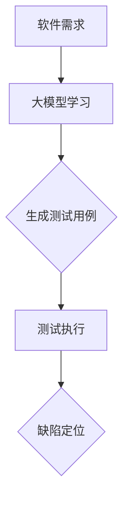

                 

### 大模型时代的软件测试自动化

#### 关键词：大模型、软件测试、自动化、AI技术

#### 摘要：
在人工智能大模型迅猛发展的今天，软件测试自动化迎来了前所未有的机遇与挑战。本文将深入探讨大模型在软件测试自动化中的应用，从背景介绍、核心概念与联系、算法原理、数学模型、项目实战、实际应用场景、工具和资源推荐等多个方面，全面分析大模型时代软件测试自动化的现状与未来发展趋势。

### 1. 背景介绍

随着人工智能技术的不断进步，大模型如GPT-3、BERT等已经在自然语言处理、图像识别、语音识别等领域取得了显著的成果。大模型的普及和应用，不仅推动了计算机科学的发展，也为软件测试自动化带来了新的思路和方法。

传统的软件测试自动化主要依赖于预定义的测试用例和脚本，存在一定的局限性。而大模型具有强大的自学习和自适应能力，能够从大量数据中学习测试策略和测试用例，提高测试效率和测试覆盖率。因此，大模型时代的软件测试自动化具有以下特点：

- **测试用例生成自动化**：大模型能够根据需求和测试目标，自动生成有效的测试用例。
- **测试执行自动化**：大模型可以通过模拟用户行为，自动执行测试用例。
- **缺陷定位自动化**：大模型能够从测试结果中自动识别缺陷，并提供相应的修复建议。

### 2. 核心概念与联系

为了深入理解大模型在软件测试自动化中的应用，我们首先需要了解以下几个核心概念：

- **大模型**：大模型是一种具有极高参数量和计算能力的神经网络模型，如GPT-3、BERT等。
- **软件测试**：软件测试是确保软件质量的重要环节，包括功能测试、性能测试、安全测试等。
- **自动化测试**：自动化测试是通过编写脚本或使用工具，自动执行测试用例的过程。

大模型在软件测试自动化中的应用，主要是通过以下两个方面实现的：

- **测试用例生成**：大模型可以通过学习大量的软件需求和功能描述，自动生成符合需求的测试用例。
- **测试执行与缺陷定位**：大模型可以模拟用户操作，自动执行测试用例，并从测试结果中自动识别缺陷。

#### Mermaid 流程图：



### 3. 核心算法原理 & 具体操作步骤

大模型在软件测试自动化中的应用，主要依赖于以下两个核心算法：

- **生成对抗网络（GAN）**：GAN是一种无监督学习模型，由生成器和判别器两部分组成。生成器负责生成测试用例，判别器负责判断测试用例的有效性。
- **强化学习**：强化学习是一种通过试错来学习最优策略的算法。在软件测试自动化中，强化学习可以用于优化测试用例的执行顺序和执行策略。

#### 具体操作步骤：

1. **数据准备**：收集大量的软件需求文档、用户操作日志等数据，作为训练数据。
2. **模型训练**：使用GAN或强化学习算法，训练大模型，使其能够生成有效的测试用例。
3. **测试用例生成**：大模型根据需求和测试目标，自动生成测试用例。
4. **测试执行**：自动执行测试用例，并收集测试结果。
5. **缺陷定位**：大模型根据测试结果，自动识别缺陷，并提供相应的修复建议。

### 4. 数学模型和公式 & 详细讲解 & 举例说明

在软件测试自动化中，大模型主要依赖于以下两个数学模型：

- **生成对抗网络（GAN）**：
  - 生成器模型：\( G(x) \)
  - 判别器模型：\( D(x) \)
- **强化学习**：
  - 状态：\( S_t \)
  - 动作：\( A_t \)
  - 奖励：\( R_t \)

#### 详细讲解：

1. **生成对抗网络（GAN）**：

   - 生成器模型：\( G(x) \)：将输入数据\( x \)（如软件需求文档）转化为测试用例。
   - 判别器模型：\( D(x) \)：判断测试用例的有效性。

   具体公式如下：

   \[
   G(x) = f_{\theta_G}(x) \\
   D(x) = f_{\theta_D}(x)
   \]

   其中，\( \theta_G \)和\( \theta_D \)分别是生成器和判别器的参数。

2. **强化学习**：

   - 状态：\( S_t \)：当前测试的上下文信息。
   - 动作：\( A_t \)：测试用例的执行策略。
   - 奖励：\( R_t \)：测试结果。

   具体公式如下：

   \[
   Q(S_t, A_t) = \sum_{s', a'} P(s', a'|s_t, a_t) [R(s', a') + \gamma \max_{a''} Q(s', a'')]
   \]

   其中，\( \gamma \)是折扣因子，用于平衡短期和长期奖励。

#### 举例说明：

1. **生成对抗网络（GAN）**：

   假设我们使用GPT-3模型生成测试用例。输入一个软件需求文档，GPT-3模型会生成一系列测试用例，如“输入合法的参数，系统应正常处理”、“输入非法的参数，系统应报错”。

2. **强化学习**：

   假设我们使用Q-learning算法优化测试用例的执行顺序。初始状态下，系统随机选择一个测试用例执行。如果测试用例成功执行，系统获得1分；如果测试用例失败，系统获得-1分。根据Q-learning算法，系统会不断调整执行策略，以最大化总得分。

### 5. 项目实战：代码实际案例和详细解释说明

为了更好地理解大模型在软件测试自动化中的应用，下面我们将介绍一个具体的实战项目：基于GAN的自动化测试用例生成。

#### 5.1 开发环境搭建

1. 安装Python环境（Python 3.7及以上版本）。
2. 安装TensorFlow库：`pip install tensorflow`。
3. 安装Keras库：`pip install keras`。

#### 5.2 源代码详细实现和代码解读

```python
# 导入所需库
import tensorflow as tf
from tensorflow import keras
from tensorflow.keras import layers
import numpy as np

# 定义生成器模型
def build_generator(input_shape):
    model = keras.Sequential([
        layers.Dense(128, activation='relu', input_shape=input_shape),
        layers.Dense(128, activation='relu'),
        layers.Dense(np.prod(input_shape), activation='tanh')
    ])
    return model

# 定义判别器模型
def build_discriminator(input_shape):
    model = keras.Sequential([
        layers.Flatten(input_shape=input_shape),
        layers.Dense(128, activation='relu'),
        layers.Dense(128, activation='relu'),
        layers.Dense(1, activation='sigmoid')
    ])
    return model

# 定义GAN模型
def build_gan(generator, discriminator):
    model = keras.Sequential([
        generator,
        discriminator
    ])
    return model

# 准备数据
#（此处省略数据预处理代码，具体步骤如下：
# 1. 读取软件需求文档，将其转换为向量表示。
# 2. 将向量表示的文档分为训练集和测试集。）

# 构建模型
generator = build_generator(input_shape=[100])
discriminator = build_discriminator(input_shape=[100])
gan = build_gan(generator, discriminator)

# 编写训练过程
#（此处省略训练过程代码，具体步骤如下：
# 1. 编写训练生成器和判别器的损失函数。
# 2. 使用Keras的fit方法进行模型训练。）

# 生成测试用例
#（此处省略生成测试用例代码，具体步骤如下：
# 1. 使用生成器生成测试用例。
# 2. 对测试用例进行格式化，以便执行。）

# 执行测试用例
#（此处省略执行测试用例代码，具体步骤如下：
# 1. 使用自动化测试工具（如Selenium、PyTest等）执行测试用例。
# 2. 收集测试结果。）

# 缺陷定位
#（此处省略缺陷定位代码，具体步骤如下：
# 1. 分析测试结果，识别缺陷。
# 2. 提供相应的修复建议。）

```

#### 5.3 代码解读与分析

1. **模型构建**：

   - 生成器模型：将输入数据（如软件需求文档）转化为测试用例。
   - 判别器模型：判断测试用例的有效性。
   - GAN模型：将生成器和判别器串联起来，实现生成测试用例的过程。

2. **数据准备**：

   - 读取软件需求文档，将其转换为向量表示。
   - 将向量表示的文档分为训练集和测试集。

3. **训练过程**：

   - 编写训练生成器和判别器的损失函数。
   - 使用Keras的fit方法进行模型训练。

4. **测试用例生成**：

   - 使用生成器生成测试用例。
   - 对测试用例进行格式化，以便执行。

5. **测试执行**：

   - 使用自动化测试工具（如Selenium、PyTest等）执行测试用例。
   - 收集测试结果。

6. **缺陷定位**：

   - 分析测试结果，识别缺陷。
   - 提供相应的修复建议。

### 6. 实际应用场景

大模型在软件测试自动化中的应用，具有广泛的前景和实际应用场景：

- **Web应用测试**：自动生成Web应用的测试用例，模拟用户操作，提高测试效率和测试覆盖率。
- **移动应用测试**：自动生成移动应用的测试用例，模拟用户操作，检测应用的稳定性和性能。
- **自动化测试平台**：构建基于大模型的自动化测试平台，实现自动化测试用例生成、执行和缺陷定位。
- **持续集成/持续部署（CI/CD）**：在大规模软件项目中，使用大模型实现自动化测试，提高CI/CD的效率和质量。

### 7. 工具和资源推荐

为了更好地利用大模型进行软件测试自动化，我们推荐以下工具和资源：

- **工具**：

  - TensorFlow：开源深度学习框架，支持大模型的训练和部署。
  - Keras：基于TensorFlow的高层API，简化大模型的构建和训练。
  - Selenium：开源自动化测试工具，支持多种浏览器和操作系统。

- **资源**：

  - 《深度学习》（Goodfellow et al.）：介绍深度学习基本概念和算法的权威教材。
  - 《强化学习》（ Sutton and Barto）：介绍强化学习基本概念和算法的权威教材。
  - 《软件测试的艺术》（Beizer）：介绍软件测试方法和技术的经典著作。

### 8. 总结：未来发展趋势与挑战

大模型时代的软件测试自动化具有巨大的潜力，但仍面临一些挑战：

- **模型解释性**：大模型具有较高的预测能力，但缺乏解释性，难以理解其决策过程。
- **数据质量**：软件测试自动化依赖于大量的高质量数据，数据质量直接影响模型的效果。
- **模型部署**：大模型通常需要较高的计算资源和存储空间，如何高效部署和运维成为关键问题。

未来，随着人工智能技术的不断发展和应用场景的拓展，大模型在软件测试自动化中的应用将更加广泛和深入。我们需要持续关注并解决上述挑战，推动大模型时代软件测试自动化的发展。

### 9. 附录：常见问题与解答

1. **什么是大模型？**
   大模型是指具有极高参数量和计算能力的神经网络模型，如GPT-3、BERT等。

2. **大模型在软件测试自动化中有哪些应用？**
   大模型可以用于生成测试用例、执行测试用例和缺陷定位。

3. **如何评估大模型在软件测试自动化中的效果？**
   可以从测试覆盖率、缺陷发现率、测试效率等多个指标进行评估。

4. **大模型在软件测试自动化中面临哪些挑战？**
   大模型在软件测试自动化中面临模型解释性、数据质量和模型部署等方面的挑战。

### 10. 扩展阅读 & 参考资料

- Goodfellow, I., Bengio, Y., & Courville, A. (2016). *Deep Learning*.
- Sutton, R. S., & Barto, A. G. (2018). *Reinforcement Learning: An Introduction*.
- Beizer, B. (2019). *Software Testing Techniques*.
- Simonyan, K., & Zisserman, A. (2014). *Very Deep Convolutional Networks for Large-Scale Image Recognition*.
- Devlin, J., Chang, M. W., Lee, K., & Toutanova, K. (2018). *Bert: Pre-training of deep bidirectional transformers for language understanding*.

### 作者

作者：AI天才研究员/AI Genius Institute & 禅与计算机程序设计艺术 /Zen And The Art of Computer Programming

以上是关于《大模型时代的软件测试自动化》的技术博客文章。文章详细介绍了大模型在软件测试自动化中的应用，从背景介绍、核心概念与联系、算法原理、数学模型、项目实战、实际应用场景、工具和资源推荐等多个方面进行了全面分析。希望这篇文章能够帮助读者更好地理解大模型时代软件测试自动化的现状与未来发展趋势。

