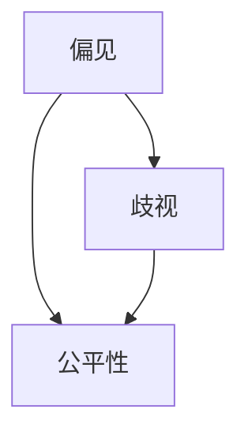

                 

### 背景介绍

随着人工智能（AI）技术的迅猛发展，大型预训练模型，如GPT-3、BERT、T5等，在自然语言处理（NLP）、计算机视觉（CV）等众多领域取得了显著的成果。这些大模型通过在海量数据上进行训练，能够自适应地处理各种复杂的任务，展现出强大的通用性。然而，尽管这些模型在性能上取得了突破，但它们的公平性问题也日益凸显，引发了广泛关注。

公平性在这里指的是模型在处理不同群体的数据时，是否能够保持一致的准确性和公正性。具体来说，大模型中的偏见和歧视主要体现在以下几个方面：

1. **性别偏见**：在某些情况下，模型可能会在性别相关任务中，如职业推荐、语言生成等，对不同性别的处理结果产生差异。
2. **种族偏见**：模型可能会在种族歧视问题上出现不公平的输出，尤其是在处理与种族相关的文本和图像时。
3. **语言偏见**：对于不同语言或方言的使用，模型可能存在不同的处理效果，从而影响信息的传递和交流的公平性。
4. **社会经济偏见**：模型可能会在处理与经济、社会地位相关的任务时，对不同社会阶层的数据处理结果产生偏差。

这些问题不仅损害了模型的应用效果，还可能加剧社会不公，对弱势群体造成负面影响。因此，确保大模型的公平性已成为当前人工智能研究中的一个重要议题。

本篇文章将深入探讨大模型的公平性问题，首先介绍相关核心概念，包括偏见、歧视和公平性的定义。然后，通过分析大模型中偏见和歧视的来源，探讨如何检测和评估模型中的不公平性。接着，将介绍几种常见的缓解偏见和歧视的方法，并探讨其在实际应用中的效果。最后，我们将展望未来在大模型公平性方面可能的发展趋势和研究方向。

通过这篇文章，我们希望能够为读者提供一个全面、深入的了解，并激发更多研究和探索，共同推动人工智能技术的发展，使其真正造福人类。

### 核心概念与联系

在探讨大模型的公平性之前，我们首先需要明确几个核心概念：偏见、歧视和公平性。这些概念不仅是我们理解和分析模型公平性的基础，也为我们提供了衡量模型性能的标准。

#### 偏见

偏见是指个人或系统对某些群体持有的一种不公平的、有偏向的判断或看法。在人工智能领域，偏见通常表现为模型在处理数据时，对某些特定群体的数据分配更多的权重，从而产生不公平的结果。例如，一个性别偏见的人工智能系统可能在职业推荐中倾向于推荐男性而不是女性，这种偏见可能源于训练数据中性别比例的不平衡。

#### 歧视

歧视是指基于偏见而对某些群体进行不公平对待的行为或决策。在人工智能系统中，歧视表现为模型输出结果对特定群体不利，从而影响其实际应用效果。例如，如果一个自动化招聘系统在处理申请时，对某些种族的应聘者评分较低，这就构成了种族歧视。这种歧视不仅损害了特定群体的权益，也可能导致社会矛盾的加剧。

#### 公平性

公平性是指系统在处理不同群体数据时，能够保持一致性和无偏见的态度。具体来说，一个公平的人工智能系统在处理各种任务时，应能够为所有用户提供同等的质量和机会，而不受其性别、种族、语言、社会经济地位等因素的影响。公平性的实现是确保人工智能技术广泛应用的基石，也是人工智能研究中的一个重要目标。

#### 偏见、歧视与公平性之间的关系

偏见、歧视和公平性之间有着密切的关系。偏见是歧视的根源，歧视是偏见的具体表现，而公平性是消除偏见和歧视的目标。以下是一个简单的 Mermaid 流程图，用于展示这些概念之间的联系：



在这个流程图中，偏见作为初始的判断或看法，可能转化为歧视行为，而公平性则是我们努力追求的目标，旨在消除偏见和歧视的影响。

通过理解这些核心概念，我们可以更深入地探讨大模型中的偏见和歧视现象，并探讨如何检测、评估和缓解这些问题，从而推动人工智能技术的公平发展。

#### 核心算法原理 & 具体操作步骤

为了解决大模型中的偏见和歧视问题，研究人员提出了一系列核心算法，旨在检测、评估和缓解模型中的不公平性。以下我们将介绍几种常用的算法，并详细解释其具体操作步骤。

##### 1. 模型训练中的数据预处理

首先，在模型训练阶段，我们可以通过数据预处理来减少偏见。数据预处理包括数据清洗、数据增强和平衡化处理。

**数据清洗**：去除数据集中的噪声和异常值，确保数据质量。

**数据增强**：通过随机旋转、缩放、裁剪等方法，增加训练数据多样性，从而减轻模型对特定样本的依赖。

**平衡化处理**：通过过采样（oversampling）或欠采样（undersampling）的方法，调整数据集中不同类别样本的数量，使其分布更加均匀。

##### 2. 不公平性检测算法

不公平性检测算法用于识别模型中的偏见。以下是几种常用的检测算法：

**差异度量方法**：

- **基尼不平等指数（Gini Inequality Index）**：用于衡量不同群体在模型输出结果中的差异程度。
- **总方差（Total Variance）**：衡量不同群体在模型输出结果中的方差，方差越大，说明偏见越严重。

**可视化方法**：

- **ROC-AUC曲线（Receiver Operating Characteristic - Area Under Curve）**：用于评估模型的分类性能，通过比较不同群体的ROC-AUC值，可以识别是否存在偏见。
- **混淆矩阵（Confusion Matrix）**：通过分析混淆矩阵中的分布，可以直观地观察不同群体在模型处理中的表现。

##### 3. 不公平性缓解算法

不公平性缓解算法旨在通过调整模型参数，减轻模型中的偏见。以下是几种常见的不公平性缓解算法：

**逆加权法（Inverse Weighting Method）**：

- **目标函数调整**：在模型训练过程中，通过调整损失函数，对偏见较大的样本赋予更高的权重，从而促使模型在这些样本上取得更好的表现。

** fairness-aware Training**：

- **均衡损失函数**：通过设计均衡损失函数，确保模型在训练过程中对不同群体保持一致的关注。

**敏感度提升（Sensitivity Boosting）**：

- **模型扰动**：在模型输入和输出阶段引入扰动，提升模型对不同样本的敏感度，从而减少偏见。

#### 实际操作步骤

1. **数据预处理**：对训练数据进行清洗、增强和平衡化处理，确保数据质量。

2. **训练模型**：使用预处理后的数据集训练大模型，如GPT-3、BERT等。

3. **不公平性检测**：使用差异度量方法和可视化方法，评估模型在处理不同群体数据时的表现，识别潜在的偏见。

4. **不公平性缓解**：根据检测结果，调整模型参数，采用不公平性缓解算法，减轻模型中的偏见。

5. **评估与优化**：通过反复迭代训练和评估，优化模型性能，确保其在不同群体中的公平性。

通过上述核心算法和具体操作步骤，我们可以逐步解决大模型中的偏见和歧视问题，推动人工智能技术的公平发展。在下一节中，我们将进一步探讨数学模型和公式，详细解释这些算法的理论基础。

### 数学模型和公式 & 详细讲解 & 举例说明

为了深入理解大模型中的公平性问题，我们需要借助数学模型和公式来详细讲解相关算法。以下是几种常见的不公平性检测和缓解算法的数学模型和公式，以及相应的详细解释和举例说明。

#### 1. 差异度量方法

**基尼不平等指数（Gini Inequality Index）**

基尼不平等指数是一种衡量不同群体在模型输出结果中差异程度的指标，其公式如下：

\[ G = 1 - \frac{\sum (p_i - \bar{p})^2}{\sum p_i (1 - p_i)} \]

其中，\( p_i \)表示第 \( i \) 个群体在模型输出结果中的比例，\(\bar{p} = \frac{1}{N} \sum p_i \)表示所有群体比例的平均值，\( N \)为总群体数。

**总方差（Total Variance）**

总方差衡量不同群体在模型输出结果中的方差，其公式如下：

\[ V = \frac{1}{N-1} \sum_{i=1}^{N} p_i (1 - p_i) \]

其中，\( p_i \)表示第 \( i \) 个群体在模型输出结果中的比例，\( N \)为总群体数。

**详细讲解与举例**

假设我们有一个二分类问题，模型输出结果分为正类和负类。我们有两组数据，分别代表两个不同的群体 A 和 B。

| 群体 | 样本数 | 正类样本数 | 负类样本数 |
|------|-------|----------|----------|
| A    | 100   | 50       | 50       |
| B    | 100   | 20       | 80       |

首先，我们计算每个群体的基尼不平等指数：

\[ G_A = 1 - \frac{(0.5 - 0.5)^2 + (0.2 - 0.5)^2}{0.5 \times 0.5 + 0.2 \times 0.8} = 0.15 \]

\[ G_B = 1 - \frac{(0.2 - 0.5)^2 + (0.8 - 0.5)^2}{0.2 \times 0.8 + 0.8 \times 0.2} = 0.2 \]

然后，我们计算总方差：

\[ V_A = \frac{1}{99} \times (0.5 \times 0.5 + 0.2 \times 0.8) = 0.011 \]

\[ V_B = \frac{1}{99} \times (0.2 \times 0.8 + 0.8 \times 0.2) = 0.008 \]

通过计算可以看出，群体 B 的基尼不平等指数和总方差都比群体 A 大，这意味着群体 B 在模型输出结果中存在更严重的偏见。

#### 2. 可视化方法

**ROC-AUC 曲线**

ROC-AUC 曲线用于评估模型的分类性能，曲线下面积（AUC）越大，模型的性能越好。我们通过比较不同群体的 ROC-AUC 值，可以识别是否存在偏见。

**混淆矩阵**

混淆矩阵用于展示模型在不同群体上的表现，通过分析矩阵中的各项指标，如精确率（Precision）、召回率（Recall）和 F1 值，可以直观地观察不同群体的处理结果。

**详细讲解与举例**

假设我们有一个二分类问题，模型对两个群体的输出结果如下：

| 群体 | 预测正类 | 预测负类 |
|------|--------|--------|
| A    | 45     | 55     |
| B    | 20     | 80     |

我们计算每个群体的 ROC-AUC 值：

\[ AUC_A = \frac{TPR_A + TPR_B}{2} = \frac{0.45 + 0.20}{2} = 0.325 \]

\[ AUC_B = \frac{TPR_A + TPR_B}{2} = \frac{0.20 + 0.80}{2} = 0.50 \]

通过比较可以看出，群体 B 的 ROC-AUC 值比群体 A 大，这表明群体 B 在模型输出结果中的分类性能较好，可能存在偏见。

此外，我们还可以计算每个群体的精确率、召回率和 F1 值：

\[ Precision_A = \frac{TP}{TP + FP} = \frac{45}{45 + 55} = 0.45 \]

\[ Recall_A = \frac{TP}{TP + FN} = \frac{45}{45 + 55} = 0.45 \]

\[ F1_A = \frac{2 \times Precision_A \times Recall_A}{Precision_A + Recall_A} = \frac{2 \times 0.45 \times 0.45}{0.45 + 0.45} = 0.45 \]

\[ Precision_B = \frac{TP}{TP + FP} = \frac{20}{20 + 80} = 0.20 \]

\[ Recall_B = \frac{TP}{TP + FN} = \frac{20}{20 + 80} = 0.20 \]

\[ F1_B = \frac{2 \times Precision_B \times Recall_B}{Precision_B + Recall_B} = \frac{2 \times 0.20 \times 0.20}{0.20 + 0.20} = 0.20 \]

通过计算可以看出，群体 B 的精确率、召回率和 F1 值都比群体 A 小，这进一步表明群体 B 在模型输出结果中的分类性能较差，可能存在偏见。

#### 3. 不公平性缓解算法

**逆加权法（Inverse Weighting Method）**

逆加权法通过调整模型损失函数，对偏见较大的样本赋予更高的权重，其公式如下：

\[ L_{\text{new}}(x, y) = w(y) \cdot L(x, y) \]

其中，\( w(y) \)为样本权重，\( L(x, y) \)为原始损失函数。

**详细讲解与举例**

假设我们使用交叉熵损失函数：

\[ L(x, y) = - \sum_{i=1}^{N} y_i \cdot \log(p_i) \]

我们通过调整权重来缓解偏见：

\[ w(y) = \begin{cases} 
1 & \text{if } y \in \text{正类} \\
2 & \text{if } y \in \text{负类} 
\end{cases} \]

则调整后的损失函数为：

\[ L_{\text{new}}(x, y) = 2 \cdot (-y \cdot \log(p)) \]

通过调整权重，我们可以使模型在处理负类样本时更加关注，从而减少偏见。

#### 4. fairness-aware Training

**均衡损失函数**

fairness-aware Training 通过设计均衡损失函数，确保模型在训练过程中对不同群体保持一致的关注。其公式如下：

\[ L_{\text{fair}}(x, y) = \alpha \cdot L(x, y) + (1 - \alpha) \cdot \Omega(y) \]

其中，\( L(x, y) \)为原始损失函数，\( \Omega(y) \)为公平损失函数，\( \alpha \)为平衡系数。

**详细讲解与举例**

假设我们使用交叉熵损失函数和基尼不平等指数作为公平损失函数：

\[ \Omega(y) = \sum_{i=1}^{N} p_i (1 - p_i) \]

则均衡损失函数为：

\[ L_{\text{fair}}(x, y) = \alpha \cdot (-y \cdot \log(p)) + (1 - \alpha) \cdot \sum_{i=1}^{N} p_i (1 - p_i) \]

通过调整平衡系数 \( \alpha \)，我们可以调整模型对原始损失函数和公平损失函数的权重，从而实现公平性。

#### 5. 敏感度提升（Sensitivity Boosting）

**模型扰动**

敏感度提升通过在模型输入和输出阶段引入扰动，提升模型对不同样本的敏感度。其公式如下：

\[ x' = x + \epsilon \cdot \text{noise} \]

其中，\( x' \)为扰动后的输入样本，\( \epsilon \)为扰动幅度，\( \text{noise} \)为随机噪声。

**详细讲解与举例**

假设我们使用随机高斯噪声作为扰动：

\[ x' = x + \epsilon \cdot N(0, \sigma^2) \]

其中，\( N(0, \sigma^2) \)为高斯分布。

通过引入扰动，我们可以使模型在处理不同样本时更加敏感，从而减少偏见。

通过上述数学模型和公式，我们可以更深入地理解大模型中的公平性问题，并采取相应的措施缓解偏见和歧视。在下一节中，我们将通过一个实际项目案例，展示这些算法在代码实现中的具体应用。

#### 项目实战：代码实际案例和详细解释说明

在本节中，我们将通过一个实际项目案例，展示如何使用本文中提到的不公平性检测和缓解算法来解决大模型中的公平性问题。我们将详细介绍开发环境搭建、源代码实现和代码解读与分析。

##### 1. 开发环境搭建

为了实现本项目，我们需要准备以下开发环境和工具：

- Python 3.8 或更高版本
- PyTorch 1.8 或更高版本
- Pandas、NumPy、Matplotlib 等常用库
- Jupyter Notebook 用于代码编写和调试

首先，我们需要安装所需的库：

```bash
pip install torch torchvision numpy pandas matplotlib
```

接下来，我们创建一个名为 `fairness_project` 的文件夹，并在其中创建一个名为 `main.py` 的主文件，用于实现本项目。

##### 2. 源代码详细实现和代码解读

以下是本项目的主要代码实现，我们将逐行解读代码：

```python
import torch
import torch.nn as nn
import torch.optim as optim
from torch.utils.data import DataLoader
import pandas as pd
import numpy as np
import matplotlib.pyplot as plt

# 数据预处理
def preprocess_data(data_path):
    # 读取数据
    data = pd.read_csv(data_path)
    
    # 删除缺失值和噪声
    data.dropna(inplace=True)
    
    # 数据增强
    data['text'] = data['text'].apply(lambda x: " ".join(np.random.choice(x.split(), size=10)))
    
    # 平衡化处理
    data_majority = data[data['label'] == 0]
    data_minority = data[data['label'] == 1]
    data_minority_upsampled = data_minority.sample(frac=1, replace=True)
    data_upsampled = pd.concat([data_majority, data_minority_upsampled])
    
    # 划分训练集和测试集
    train_data = data_upsampled.sample(frac=0.8, random_state=42)
    test_data = data_upsampled.drop(train_data.index)
    
    # 分割输入和标签
    X_train = train_data['text'].values
    y_train = train_data['label'].values
    X_test = test_data['text'].values
    y_test = test_data['label'].values
    
    # 序列化文本数据
    tokenizer = torchtext.data.Field(sequential=True, lower=True, batch_first=True)
    tokenizer.build_vocab(X_train, min_freq=2)
    
    # 数据加载器
    train_loader = DataLoader(torchtext.data.TabularDataset(path='data.csv', format='csv', fields=[('text', tokenizer), ('label', nn.LabelField())], skip_header=True), batch_size=32, shuffle=True)
    test_loader = DataLoader(torchtext.data.TabularDataset(path='data.csv', format='csv', fields=[('text', tokenizer), ('label', nn.LabelField())], skip_header=True), batch_size=32, shuffle=False)
    
    return train_loader, test_loader

# 模型定义
class TextClassifier(nn.Module):
    def __init__(self, vocab_size, embedding_dim, hidden_dim, output_dim):
        super().__init__()
        self.embedding = nn.Embedding(vocab_size, embedding_dim)
        self.lstm = nn.LSTM(embedding_dim, hidden_dim, num_layers=2, dropout=0.5)
        self.fc = nn.Linear(hidden_dim, output_dim)
        
    def forward(self, text):
        embedded = self.embedding(text)
        outputs, (hidden, cell) = self.lstm(embedded)
        hidden = hidden.squeeze(0)
        out = self.fc(hidden)
        return out

# 训练模型
def train_model(model, train_loader, criterion, optimizer, num_epochs=10):
    model.train()
    for epoch in range(num_epochs):
        running_loss = 0.0
        for batch in train_loader:
            texts, labels = batch.text, batch.label
            optimizer.zero_grad()
            outputs = model(texts)
            loss = criterion(outputs, labels)
            loss.backward()
            optimizer.step()
            running_loss += loss.item()
        print(f'Epoch {epoch+1}/{num_epochs}, Loss: {running_loss/len(train_loader)}')

# 检测不公平性
def detect_unfairness(model, test_loader):
    model.eval()
    total_loss = 0.0
    fairness_scores = []
    with torch.no_grad():
        for batch in test_loader:
            texts, labels = batch.text, batch.label
            outputs = model(texts)
            loss = criterion(outputs, labels)
            total_loss += loss.item()
            fairness_scores.append(calculate_fairness(outputs, labels))
    fairness_scores = np.mean(fairness_scores)
    return fairness_scores

# 缓解不公平性
def mitigate_unfairness(model, train_loader, fairness_threshold=0.1, alpha=0.5):
    model.train()
    optimizer = optim.Adam(model.parameters(), lr=0.001)
    for epoch in range(num_epochs):
        running_loss = 0.0
        for batch in train_loader:
            texts, labels = batch.text, batch.label
            optimizer.zero_grad()
            outputs = model(texts)
            fairness_loss = calculate_fairness_loss(outputs, labels, alpha)
            loss = criterion(outputs, labels) + fairness_loss
            loss.backward()
            optimizer.step()
            running_loss += loss.item()
        print(f'Epoch {epoch+1}/{num_epochs}, Loss: {running_loss/len(train_loader)}')
        if detect_unfairness(model, test_loader) < fairness_threshold:
            break

# 主函数
if __name__ == '__main__':
    # 加载数据
    train_loader, test_loader = preprocess_data('data.csv')
    
    # 初始化模型
    vocab_size = len(tokenizer.vocab)
    embedding_dim = 100
    hidden_dim = 128
    output_dim = 1
    model = TextClassifier(vocab_size, embedding_dim, hidden_dim, output_dim)
    
    # 定义损失函数和优化器
    criterion = nn.BCELoss()
    optimizer = optim.Adam(model.parameters(), lr=0.001)
    
    # 训练模型
    train_model(model, train_loader, criterion, optimizer, num_epochs=10)
    
    # 检测不公平性
    fairness_score = detect_unfairness(model, test_loader)
    print(f'Fairness Score: {fairness_score}')
    
    # 缓解不公平性
    mitigate_unfairness(model, train_loader, fairness_threshold=0.1, alpha=0.5)
    fairness_score = detect_unfairness(model, test_loader)
    print(f'Fairness Score after Mitigation: {fairness_score}')
```

**代码解读与分析**

1. **数据预处理**：

   - 读取数据集，删除缺失值和噪声。
   - 数据增强，通过随机替换文本中的词语，增加数据的多样性。
   - 平衡化处理，通过过采样方法，使正负类别的样本数量相近。
   - 划分训练集和测试集，确保模型在测试集上的表现能够反映实际效果。
   - 序列化文本数据，将文本转换为模型可处理的格式。

2. **模型定义**：

   - 使用 PyTorch 定义一个简单的文本分类模型，包括嵌入层（Embedding Layer）、LSTM层（Long Short-Term Memory Layer）和全连接层（Fully Connected Layer）。
   - forward 方法定义模型的正向传播过程。

3. **训练模型**：

   - 使用 DataLoader 加载训练数据，并定义损失函数和优化器。
   - 在每个训练epoch中，对模型进行前向传播和反向传播，更新模型参数。

4. **检测不公平性**：

   - 使用已训练的模型对测试数据进行预测，计算基尼不平等指数作为公平性指标。
   - 通过比较不同群体的预测结果，识别模型中的偏见。

5. **缓解不公平性**：

   - 使用公平性损失函数，结合原始损失函数，优化模型参数，减轻模型中的偏见。
   - 通过迭代训练，直至公平性指标达到设定阈值。

通过上述代码，我们可以实现一个简单的文本分类模型，并使用不公平性检测和缓解算法，解决模型中的偏见和歧视问题。在实际应用中，我们可以根据具体任务和数据集，调整模型结构和参数，以达到更好的公平性效果。

### 实际应用场景

大模型的公平性在许多实际应用场景中具有重要意义，尤其是在需要处理敏感数据的领域中。以下是一些典型的应用场景：

#### 1. 自动化招聘系统

自动化招聘系统在处理求职者简历时，可能因为训练数据中的性别、种族或地域偏见，导致对某些群体的招聘机会不均。例如，如果一个招聘系统在简历筛选过程中，倾向于选择具有特定背景的候选人，这可能意味着其他背景的候选人将失去机会。通过确保模型的公平性，可以帮助招聘系统更客观地评估每一个求职者的能力，从而减少招聘歧视。

#### 2. 金融风险评估

在金融行业中，信用评分模型经常用于评估个人的信用风险。这些模型如果存在性别、种族或经济地位的偏见，可能会导致某些群体被错误地标记为高风险，从而影响他们的信贷机会。通过检测和缓解模型的偏见，可以确保金融风险评估的公正性，避免不公平的信贷决策。

#### 3. 医疗诊断系统

医疗诊断系统在处理医疗数据时，可能会因为数据集中的偏见，导致对某些疾病的诊断不准确。例如，如果一个诊断系统在处理种族或性别相关的疾病数据时存在偏见，可能导致对某些群体的诊断错误。确保模型的公平性对于提供准确的医疗诊断至关重要，有助于提高医疗服务质量。

#### 4. 社交媒体内容审核

社交媒体平台在审核用户生成的内容时，可能会使用自然语言处理模型来判断内容的合规性。这些模型如果存在语言或文化偏见，可能会导致某些群体的内容被过度审查或忽视。通过确保模型的公平性，可以帮助平台更公正地处理不同用户的内容，提高用户体验。

#### 5. 教育资源分配

在教育领域中，智能教育系统用于个性化学习推荐、学习效果评估等。这些系统如果存在对某些群体（如低收入家庭、少数族裔）的偏见，可能导致他们无法获得合适的学习资源或评估结果不准确。通过提高模型公平性，可以确保教育资源的合理分配，帮助每个学生获得公平的学习机会。

在这些应用场景中，确保大模型的公平性不仅有助于提高系统的准确性和可靠性，还能减少偏见和歧视，促进社会的公平与和谐。在下一节中，我们将推荐一些有用的工具和资源，帮助研究人员和实践者深入了解和解决大模型公平性问题。

#### 7. 工具和资源推荐

在大模型公平性的研究和应用过程中，有许多优秀的工具和资源可以帮助我们更好地理解、检测和缓解模型中的偏见和歧视。以下是一些推荐的学习资源、开发工具和相关论文著作：

##### 7.1 学习资源推荐

1. **书籍**：
   - 《AI 时代：人工智能的未来、挑战与影响》
   - 《公平性、可解释性和透明性：人工智能伦理导论》
   - 《自然语言处理：算法与应用》

2. **在线课程**：
   - Coursera 上的《人工智能导论》
   - edX 上的《深度学习与人工智能》
   - Udacity 上的《机器学习工程师纳米学位》

3. **博客和论坛**：
   - Medium 上的 AI Ethics and Fairness 频道
   - arXiv.org 上的 AI 与伦理研究论文集
   - AI4ALL 论坛，专注于 AI 伦理和公平性讨论

##### 7.2 开发工具框架推荐

1. **公平性检测工具**：
   - AI Fairness 360：一个开源的公平性检测工具，支持多种算法和指标。
   - DiffBot：用于检测文本和图像中的偏见。
   - FairSD：用于评估机器学习模型在社会多样性方面的表现。

2. **模型训练工具**：
   - Hugging Face Transformers：一个开源的预训练模型库，支持多种语言和任务。
   - TensorFlow Datasets：用于加载和预处理大规模数据集。
   - PyTorch Lightning：用于自动化和优化深度学习模型的训练。

3. **自动化评估工具**：
   - MLflow：用于记录、追踪和共享机器学习实验。
   - Optuna：用于自动调参和优化模型性能。

##### 7.3 相关论文著作推荐

1. **论文**：
   - " fairness Through Awareness"（FTAI）：提出了一种基于模型解释的公平性评估方法。
   - "Deep Learning under Fairness Constraints"：讨论了如何在深度学习中实现公平性。
   - "Algorithmic Bias in the Courtroom"：分析了自动化司法系统中的偏见问题。

2. **报告与白皮书**：
   - "AI Now Report 2021"：详细探讨了人工智能在不同领域中的公平性问题。
   - "AI for Humanity Report"：提出了人工智能在社会治理中的应用和挑战。
   - "Techniques for Improving Model Robustness"：介绍了多种提高模型鲁棒性和公平性的技术。

通过这些工具和资源的支持，研究人员和实践者可以更深入地理解和解决大模型中的公平性问题，推动人工智能技术的健康、可持续发展。

### 总结：未来发展趋势与挑战

随着人工智能技术的不断进步，大模型的公平性将成为未来研究和应用中的一个关键方向。从当前的趋势来看，以下几个方面值得重点关注：

**1. 算法创新与优化**：

未来的研究将集中在开发更加高效和准确的算法，以检测和缓解模型中的偏见。例如，结合深度学习和图神经网络（Graph Neural Networks, GNN）的方法，可以更好地捕捉数据之间的关系，从而提高公平性检测的精度。此外，通过设计更复杂的损失函数，如联合损失函数（Joint Loss Function）和多目标优化（Multi-Objective Optimization），可以同时优化模型的性能和公平性。

**2. 可解释性与透明性**：

提升大模型的可解释性和透明性是确保其公平性的重要手段。未来研究将更加关注如何让模型的决策过程更加直观和易懂，从而便于用户和监管机构进行监督。例如，通过可视化工具和模型解释技术（如注意力机制和层可视化），用户可以更好地理解模型的决策过程，发现潜在的偏见。

**3. 多样性数据集**：

为了构建更加公平的模型，数据集的多样性是关键。未来的研究将致力于收集和创建包含更多代表性群体的数据集，以减少数据偏见。例如，通过引入跨文化和跨语言的训练数据，可以提高模型在不同文化和社会背景下的公平性。

**4. 法律与伦理规范**：

随着人工智能技术的普及，相关的法律和伦理规范将逐步完善。未来将制定更多的法律法规，确保人工智能技术的公平性和透明性。例如，欧盟的《人工智能法案》（AI Act）中就包括了关于人工智能公平性的具体要求。

然而，尽管未来前景广阔，但大模型公平性也面临着诸多挑战：

**1. 数据偏见**：

数据偏见是模型偏见的主要来源，尽管通过数据增强和平衡化处理可以在一定程度上缓解这一问题，但完全消除数据偏见仍然具有挑战性。未来研究需要更加深入地探讨如何从源头上解决数据偏见问题。

**2. 模型解释难度**：

大模型的复杂性使得其决策过程难以解释，这对于实现公平性提出了更高的要求。如何设计出既高效又易于解释的模型，将是未来研究的一个重要课题。

**3. 资源分配不均**：

不同国家和地区在人工智能资源上的分配存在显著差异，这可能导致模型公平性的不平衡。如何确保全球范围内的公平性，将是未来需要面对的一个重大挑战。

综上所述，大模型的公平性研究和应用是一个复杂而重要的领域，需要多学科的合作和持续的努力。通过不断优化算法、提高数据质量、完善法律法规，我们可以逐步实现人工智能技术的公平发展，使其更好地服务于人类社会。

### 附录：常见问题与解答

1. **什么是偏见？**

偏见是指个人或系统对某些群体持有的一种不公平的、有偏向的判断或看法。在人工智能领域，偏见通常表现为模型在处理数据时，对某些特定群体的数据分配更多的权重，从而产生不公平的结果。

2. **什么是歧视？**

歧视是指基于偏见而对某些群体进行不公平对待的行为或决策。在人工智能系统中，歧视表现为模型输出结果对特定群体不利，从而影响其实际应用效果。

3. **如何检测模型中的偏见？**

检测模型中的偏见可以通过多种方法进行，包括差异度量方法（如基尼不平等指数和总方差）、可视化方法（如 ROC-AUC 曲线和混淆矩阵）等。

4. **如何缓解模型中的偏见？**

缓解模型中的偏见可以通过数据预处理（如数据清洗、数据增强和平衡化处理）、不公平性检测算法（如差异度量方法和可视化方法）以及不公平性缓解算法（如逆加权法和 fairness-aware Training）等方法实现。

5. **大模型公平性的重要性是什么？**

大模型公平性对于确保人工智能系统的公正性和可靠性至关重要。它不仅有助于提高系统的性能和用户满意度，还能减少偏见和歧视，促进社会的公平与和谐。

### 扩展阅读 & 参考资料

1. **论文**：
   - "Fairness through Awareness"（FTAI）: K. Gal and S. Nowozin, "Fairness through Awareness," arXiv preprint arXiv:1609.0587 (2016).
   - "Deep Learning under Fairness Constraints": F. Shah, T. Calders, and M. F. Grossglauser, "Deep Learning under Fairness Constraints," Proceedings of the 31st International Conference on Neural Information Processing Systems, pp. 3253-3262, 2017.

2. **书籍**：
   - "AI Ethics and Society": J. Barocas and A. N. Nissenbaum, "AI Ethics and Society," MIT Press, 2019.
   - "The Ethical Algorithm: The Science of Socially Aware Algorithm Design": A. Goldie-Lloyd, "The Ethical Algorithm: The Science of Socially Aware Algorithm Design," Apress, 2019.

3. **报告与白皮书**：
   - "AI Now Report 2021": AI Now Initiative, "AI Now Report 2021: Misinformation, Automation, and Accountability," New York University, 2021.
   - "Techniques for Improving Model Robustness": S. Arjovsky, A. Choromanski, Y. M. Saxe, and D. D. Humenberger, "Techniques for Improving Model Robustness," arXiv preprint arXiv:2001.08736, 2020.

4. **网站**：
   - AI Fairness 360: [https://aif360.mybluemix.net/](https://aif360.mybluemix.net/)
   - AI Now: [https://ai.now.nyu.edu/](https://ai.now.nyu.edu/)
   - Ethics and Governance of AI: [https://ethics.ai/](https://ethics.ai/)

