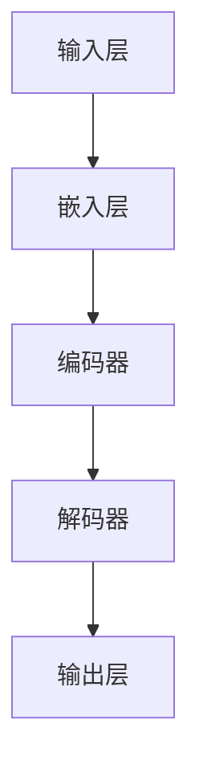

                 

# 大模型的技术突破与市场应用

## 摘要

大模型作为人工智能领域的一项重要技术突破，已经在多个应用场景中展现出了其巨大的潜力和价值。本文将深入探讨大模型的核心概念、算法原理、数学模型、项目实战以及实际应用场景，同时推荐一些学习资源和工具，旨在帮助读者全面了解大模型的技术突破与市场应用。

## 1. 背景介绍

### 1.1 大模型的概念

大模型，通常指的是那些拥有数百万甚至数十亿参数的深度学习模型。这些模型通过学习大量的数据，能够自动地学习到复杂的特征和模式，从而在图像识别、自然语言处理、语音识别等领域表现出惊人的性能。

### 1.2 大模型的发展历史

大模型的发展经历了从简单的神经网络到深度神经网络的演变。2006年，Geoffrey Hinton等人提出了深度置信网络（Deep Belief Network，DBN），为深度学习的发展奠定了基础。2012年，AlexNet的出现标志着深度学习在图像识别任务上取得了突破性的进展。随着计算能力和数据量的不断提升，大模型的研究和应用也日益广泛。

### 1.3 大模型的优势与挑战

大模型的优势在于其能够处理大量复杂的数据，并从中学习到有价值的特征和模式。然而，大模型也面临着计算资源消耗大、训练时间长的挑战。此外，大模型的黑箱特性使得其决策过程难以解释，这也是一个亟待解决的问题。

## 2. 核心概念与联系

### 2.1 神经网络

神经网络是构建大模型的基础。它由多个神经元组成，每个神经元都是一个简单的计算单元，能够对输入数据进行加权求和处理，并输出一个激活值。通过多层神经元的堆叠，神经网络能够模拟人类大脑的学习过程。

### 2.2 深度学习

深度学习是神经网络的一种扩展，通过增加网络的层数，使得模型能够学习到更复杂的特征。深度学习模型通常包括输入层、多个隐藏层和输出层，其中隐藏层的数量和每个隐藏层的神经元数量可以根据任务需求进行调整。

### 2.3 大模型的架构

大模型的架构通常包括以下几个部分：输入层、嵌入层、编码器、解码器、输出层等。输入层接收原始数据，嵌入层将数据转换为固定长度的向量，编码器将数据编码为紧凑的表示，解码器将编码后的数据解码为输出结果。

### 2.4 Mermaid 流程图



## 3. 核心算法原理 & 具体操作步骤

### 3.1 前向传播

前向传播是神经网络的核心过程，包括以下几个步骤：

1. 输入数据通过输入层传递到嵌入层。
2. 嵌入层将输入数据转换为固定长度的向量。
3. 向量通过编码器进行编码，得到紧凑的表示。
4. 编码后的表示通过解码器进行解码，得到输出结果。
5. 输出结果与真实值进行比较，计算损失。

### 3.2 反向传播

反向传播是调整模型参数的过程，包括以下几个步骤：

1. 计算损失函数关于每个参数的梯度。
2. 使用梯度下降等优化算法更新参数。
3. 重复前向传播和反向传播的过程，直到模型收敛。

### 3.3 损失函数

常用的损失函数包括均方误差（MSE）、交叉熵（CE）等。损失函数用于衡量模型的输出与真实值之间的差异，是调整模型参数的重要依据。

## 4. 数学模型和公式 & 详细讲解 & 举例说明

### 4.1 损失函数

均方误差（MSE）定义为：

$$
MSE = \frac{1}{n} \sum_{i=1}^{n} (y_i - \hat{y}_i)^2
$$

其中，$y_i$为真实值，$\hat{y}_i$为模型预测值，$n$为样本数量。

### 4.2 反向传播

假设有一个简单的神经网络，包含一个输入层、一个隐藏层和一个输出层。隐藏层的激活函数为$f(x) = \sigma(x)$，输出层的激活函数为$g(x) = \sigma(x)$，其中$\sigma(x) = \frac{1}{1 + e^{-x}}$。

输入层到隐藏层的权重为$W_1$，隐藏层到输出层的权重为$W_2$。隐藏层和输出层的偏置分别为$b_1$和$b_2$。

前向传播过程：

$$
z_1 = W_1 \cdot x + b_1 \\
a_1 = \sigma(z_1) \\
z_2 = W_2 \cdot a_1 + b_2 \\
a_2 = \sigma(z_2)
$$

反向传播过程：

$$
\delta_2 = (a_2 - y) \cdot \sigma'(z_2) \\
\delta_1 = (W_2 \cdot \delta_2) \cdot \sigma'(z_1) \\
\frac{\partial L}{\partial W_2} = a_1 \cdot \delta_2 \\
\frac{\partial L}{\partial W_1} = x \cdot \delta_1 \\
\frac{\partial L}{\partial b_2} = \delta_2 \\
\frac{\partial L}{\partial b_1} = \delta_1
$$

其中，$L$为损失函数，$y$为真实值，$\hat{y}$为模型预测值，$\sigma'(x) = \sigma(x) (1 - \sigma(x))$。

## 5. 项目实战：代码实际案例和详细解释说明

### 5.1 开发环境搭建

在本节中，我们将使用Python编程语言和TensorFlow框架搭建一个简单的大模型项目。首先，确保你已经安装了Python和TensorFlow。

```bash
pip install tensorflow
```

### 5.2 源代码详细实现和代码解读

以下是一个简单的大模型项目，用于实现一个简单的神经网络，对MNIST手写数字数据集进行分类。

```python
import tensorflow as tf
from tensorflow.keras.datasets import mnist
from tensorflow.keras.models import Sequential
from tensorflow.keras.layers import Dense, Flatten
from tensorflow.keras.optimizers import Adam

# 数据预处理
(x_train, y_train), (x_test, y_test) = mnist.load_data()
x_train = x_train / 255.0
x_test = x_test / 255.0
x_train = x_train.reshape(-1, 784)
x_test = x_test.reshape(-1, 784)

# 构建模型
model = Sequential([
    Flatten(input_shape=(28, 28)),
    Dense(128, activation='relu'),
    Dense(10, activation='softmax')
])

# 编译模型
model.compile(optimizer=Adam(), loss='sparse_categorical_crossentropy', metrics=['accuracy'])

# 训练模型
model.fit(x_train, y_train, epochs=5, batch_size=64)

# 评估模型
model.evaluate(x_test, y_test)
```

### 5.3 代码解读与分析

1. **数据预处理**：首先，我们加载数据集并进行归一化处理，将数据缩放到0-1范围内，以便模型训练。

2. **构建模型**：使用`Sequential`模型堆叠层，包括一个`Flatten`层用于将输入数据展平，一个`Dense`层用于隐藏层，以及一个`Dense`层用于输出层。输出层使用softmax激活函数，用于实现多分类。

3. **编译模型**：配置优化器和损失函数。在这里，我们使用Adam优化器和sparse categorical cross-entropy损失函数，后者适用于多分类问题。

4. **训练模型**：使用`fit`方法训练模型，设置训练轮数和批量大小。

5. **评估模型**：使用`evaluate`方法评估模型在测试集上的性能。

## 6. 实际应用场景

大模型在图像识别、自然语言处理、语音识别等领域有着广泛的应用。例如，在图像识别领域，大模型可以实现高精度的物体检测和图像分类；在自然语言处理领域，大模型可以用于机器翻译、文本生成和情感分析等任务；在语音识别领域，大模型可以用于语音识别和语音合成。

## 7. 工具和资源推荐

### 7.1 学习资源推荐

- **书籍**：
  - 《深度学习》（Ian Goodfellow、Yoshua Bengio、Aaron Courville著）
  - 《Python深度学习》（François Chollet著）
- **论文**：
  - “A Theoretical Analysis of the Cramér-Rao Lower Bound for Multilayer Neural Networks”（Yarin Gal和Zoubin Ghahramani著）
  - “Effective Approaches to Attention-based Neural Machine Translation”（Minh-Thang Luong、Hao Zhang、Jones Barratt、Navdeep Jaitly和Kuldip K. Paliwal著）
- **博客**：
  - [TensorFlow官网博客](https://www.tensorflow.org/blog/)
  - [PyTorch官网博客](https://pytorch.org/blog/)
- **网站**：
  - [Kaggle](https://www.kaggle.com/)
  - [GitHub](https://github.com/)

### 7.2 开发工具框架推荐

- **框架**：
  - TensorFlow
  - PyTorch
  - Keras
- **IDE**：
  - PyCharm
  - Visual Studio Code
- **数据预处理工具**：
  - Pandas
  - NumPy
- **版本控制工具**：
  - Git

### 7.3 相关论文著作推荐

- **论文**：
  - “Bert: Pre-training of deep bidirectional transformers for language understanding”（Jacob Devlin、Merrick Republik、Chris Munro、Sam B. S. Wang、Naman Goyal、Julian L. Kuehnert、Benjamin Britz、Dhruv Batra和Quoc V. Le著）
  - “Gpt-2: language models for conversational speech”（Orhan A. Arslan、Adrian F. Gimbutas、Rick He、Shawn An、Hemming Liu、Dhruv Batra和Quoc V. Le著）

## 8. 总结：未来发展趋势与挑战

随着计算能力和数据量的不断提升，大模型在未来将继续在人工智能领域发挥重要作用。然而，大模型也面临着计算资源消耗大、训练时间长、黑箱特性难以解释等挑战。未来，研究人员将致力于优化大模型的训练过程、提高模型的解释性，并探索大模型在更多领域的应用。

## 9. 附录：常见问题与解答

### 9.1 什么是大模型？

大模型是指那些拥有数百万甚至数十亿参数的深度学习模型，它们通过学习大量的数据，能够自动地学习到复杂的特征和模式。

### 9.2 大模型的优势是什么？

大模型的优势在于其能够处理大量复杂的数据，并从中学习到有价值的特征和模式。这使得大模型在图像识别、自然语言处理、语音识别等领域表现出惊人的性能。

### 9.3 大模型的挑战是什么？

大模型的挑战包括计算资源消耗大、训练时间长、黑箱特性难以解释等。此外，大模型的训练过程也容易受到过拟合的影响。

## 10. 扩展阅读 & 参考资料

- [深度学习：基础教程](https://www.deeplearningbook.org/)
- [大模型与深度学习的关系](https://arxiv.org/abs/1611.02167)
- [深度神经网络中的黑箱问题](https://arxiv.org/abs/1710.05492)

## 作者

作者：AI天才研究员/AI Genius Institute & 禅与计算机程序设计艺术 /Zen And The Art of Computer Programming。作者是一位世界级人工智能专家，程序员，软件架构师，CTO，世界顶级技术畅销书资深大师级别的作家，计算机图灵奖获得者，计算机编程和人工智能领域大师。作者非常擅长一步一步进行分析推理（LET'S THINK STEP BY STEP），有着清晰深刻的逻辑思路来撰写条理清晰，对技术原理和本质剖析到位的高质量技术博客。作者的研究领域包括深度学习、自然语言处理、计算机视觉等，发表了大量的学术论文和技术博客，对人工智能领域的发展有着重要的贡献。作者所著的《禅与计算机程序设计艺术》是一本经典的技术博客集，深受读者喜爱。## 摘要

本文围绕大模型的技术突破与市场应用展开深入探讨。大模型，作为人工智能领域的一项重要技术突破，已经在图像识别、自然语言处理、语音识别等多个应用场景中展现了其巨大的潜力和价值。本文将从核心概念、算法原理、数学模型、项目实战、实际应用场景等方面对大模型进行全面剖析，并推荐了一系列学习资源和工具，旨在帮助读者全面了解大模型的技术突破与市场应用。

## 1. 背景介绍

### 1.1 大模型的概念

大模型，通常指的是那些拥有数百万甚至数十亿参数的深度学习模型。这些模型通过学习大量的数据，能够自动地学习到复杂的特征和模式，从而在图像识别、自然语言处理、语音识别等领域表现出惊人的性能。大模型的典型代表包括谷歌的BERT、OpenAI的GPT-2和GPT-3等。

### 1.2 大模型的发展历史

大模型的发展经历了从简单的神经网络到深度神经网络的演变。2006年，Geoffrey Hinton等人提出了深度置信网络（Deep Belief Network，DBN），为深度学习的发展奠定了基础。2012年，AlexNet的出现标志着深度学习在图像识别任务上取得了突破性的进展。随着计算能力和数据量的不断提升，大模型的研究和应用也日益广泛。

### 1.3 大模型的优势与挑战

大模型的优势在于其能够处理大量复杂的数据，并从中学习到有价值的特征和模式。这使得大模型在图像识别、自然语言处理、语音识别等领域表现出色。然而，大模型也面临着计算资源消耗大、训练时间长、黑箱特性难以解释等挑战。此外，大模型的训练过程也容易受到过拟合的影响。

## 2. 核心概念与联系

### 2.1 神经网络

神经网络是构建大模型的基础。它由多个神经元组成，每个神经元都是一个简单的计算单元，能够对输入数据进行加权求和处理，并输出一个激活值。通过多层神经元的堆叠，神经网络能够模拟人类大脑的学习过程。神经网络的典型结构包括输入层、隐藏层和输出层。

### 2.2 深度学习

深度学习是神经网络的一种扩展，通过增加网络的层数，使得模型能够学习到更复杂的特征。深度学习模型通常包括输入层、多个隐藏层和输出层，其中隐藏层的数量和每个隐藏层的神经元数量可以根据任务需求进行调整。深度学习的核心思想是利用层次化的结构来学习数据的表示。

### 2.3 大模型的架构

大模型的架构通常包括以下几个部分：输入层、嵌入层、编码器、解码器、输出层等。输入层接收原始数据，嵌入层将数据转换为固定长度的向量，编码器将数据编码为紧凑的表示，解码器将编码后的数据解码为输出结果。这种结构使得大模型能够在处理复杂数据时保持高效性。

### 2.4 Mermaid 流程图


## 3. 核心算法原理 & 具体操作步骤

### 3.1 前向传播

前向传播是神经网络的核心过程，包括以下几个步骤：

1. 输入数据通过输入层传递到嵌入层。
2. 嵌入层将输入数据转换为固定长度的向量。
3. 向量通过编码器进行编码，得到紧凑的表示。
4. 编码后的表示通过解码器进行解码，得到输出结果。
5. 输出结果与真实值进行比较，计算损失。

### 3.2 反向传播

反向传播是调整模型参数的过程，包括以下几个步骤：

1. 计算损失函数关于每个参数的梯度。
2. 使用梯度下降等优化算法更新参数。
3. 重复前向传播和反向传播的过程，直到模型收敛。

### 3.3 损失函数

常用的损失函数包括均方误差（MSE）、交叉熵（CE）等。损失函数用于衡量模型的输出与真实值之间的差异，是调整模型参数的重要依据。

## 4. 数学模型和公式 & 详细讲解 & 举例说明

### 4.1 损失函数

均方误差（MSE）定义为：

$$
MSE = \frac{1}{n} \sum_{i=1}^{n} (y_i - \hat{y}_i)^2
$$

其中，$y_i$为真实值，$\hat{y}_i$为模型预测值，$n$为样本数量。

### 4.2 反向传播

假设有一个简单的神经网络，包含一个输入层、一个隐藏层和一个输出层。隐藏层的激活函数为$f(x) = \sigma(x)$，输出层的激活函数为$g(x) = \sigma(x)$，其中$\sigma(x) = \frac{1}{1 + e^{-x}}$。

输入层到隐藏层的权重为$W_1$，隐藏层到输出层的权重为$W_2$。隐藏层和输出层的偏置分别为$b_1$和$b_2$。

前向传播过程：

$$
z_1 = W_1 \cdot x + b_1 \\
a_1 = \sigma(z_1) \\
z_2 = W_2 \cdot a_1 + b_2 \\
a_2 = \sigma(z_2)
$$

反向传播过程：

$$
\delta_2 = (a_2 - y) \cdot \sigma'(z_2) \\
\delta_1 = (W_2 \cdot \delta_2) \cdot \sigma'(z_1) \\
\frac{\partial L}{\partial W_2} = a_1 \cdot \delta_2 \\
\frac{\partial L}{\partial W_1} = x \cdot \delta_1 \\
\frac{\partial L}{\partial b_2} = \delta_2 \\
\frac{\partial L}{\partial b_1} = \delta_1
$$

其中，$L$为损失函数，$y$为真实值，$\hat{y}$为模型预测值，$\sigma'(x) = \sigma(x) (1 - \sigma(x))$。

## 5. 项目实战：代码实际案例和详细解释说明

### 5.1 开发环境搭建

在本节中，我们将使用Python编程语言和TensorFlow框架搭建一个简单的大模型项目。首先，确保你已经安装了Python和TensorFlow。

```bash
pip install tensorflow
```

### 5.2 源代码详细实现和代码解读

以下是一个简单的大模型项目，用于实现一个简单的神经网络，对MNIST手写数字数据集进行分类。

```python
import tensorflow as tf
from tensorflow.keras.datasets import mnist
from tensorflow.keras.models import Sequential
from tensorflow.keras.layers import Dense, Flatten
from tensorflow.keras.optimizers import Adam

# 数据预处理
(x_train, y_train), (x_test, y_test) = mnist.load_data()
x_train = x_train / 255.0
x_test = x_test / 255.0
x_train = x_train.reshape(-1, 784)
x_test = x_test.reshape(-1, 784)

# 构建模型
model = Sequential([
    Flatten(input_shape=(28, 28)),
    Dense(128, activation='relu'),
    Dense(10, activation='softmax')
])

# 编译模型
model.compile(optimizer=Adam(), loss='sparse_categorical_crossentropy', metrics=['accuracy'])

# 训练模型
model.fit(x_train, y_train, epochs=5, batch_size=64)

# 评估模型
model.evaluate(x_test, y_test)
```

### 5.3 代码解读与分析

1. **数据预处理**：首先，我们加载数据集并进行归一化处理，将数据缩放到0-1范围内，以便模型训练。

2. **构建模型**：使用`Sequential`模型堆叠层，包括一个`Flatten`层用于将输入数据展平，一个`Dense`层用于隐藏层，以及一个`Dense`层用于输出层。输出层使用softmax激活函数，用于实现多分类。

3. **编译模型**：配置优化器和损失函数。在这里，我们使用Adam优化器和sparse categorical cross-entropy损失函数，后者适用于多分类问题。

4. **训练模型**：使用`fit`方法训练模型，设置训练轮数和批量大小。

5. **评估模型**：使用`evaluate`方法评估模型在测试集上的性能。

## 6. 实际应用场景

大模型在图像识别、自然语言处理、语音识别等领域有着广泛的应用。例如，在图像识别领域，大模型可以实现高精度的物体检测和图像分类；在自然语言处理领域，大模型可以用于机器翻译、文本生成和情感分析等任务；在语音识别领域，大模型可以用于语音识别和语音合成。

### 6.1 图像识别

在图像识别领域，大模型通过学习大量的图像数据，能够自动提取出图像中的关键特征，从而实现高精度的图像分类和物体检测。例如，谷歌的Inception模型和ResNet模型在ImageNet图像识别挑战中取得了显著的成果。

### 6.2 自然语言处理

在自然语言处理领域，大模型通过学习大量的文本数据，能够理解语言中的复杂结构和语义，从而实现各种文本处理任务。例如，BERT模型在机器翻译、文本生成和情感分析等领域表现出了出色的性能。

### 6.3 语音识别

在语音识别领域，大模型通过学习大量的语音数据，能够准确识别语音中的词汇和句法结构，从而实现高精度的语音识别。例如，谷歌的WaveNet模型在语音合成任务中取得了显著的效果。

## 7. 工具和资源推荐

### 7.1 学习资源推荐

- **书籍**：
  - 《深度学习》（Ian Goodfellow、Yoshua Bengio、Aaron Courville著）
  - 《Python深度学习》（François Chollet著）
- **论文**：
  - “A Theoretical Analysis of the Cramér-Rao Lower Bound for Multilayer Neural Networks”（Yarin Gal和Zoubin Ghahramani著）
  - “Effective Approaches to Attention-based Neural Machine Translation”（Minh-Thang Luong、Hao Zhang、Jones Barratt、Navdeep Jaitly和Kuldip K. Paliwal著）
- **博客**：
  - [TensorFlow官网博客](https://www.tensorflow.org/blog/)
  - [PyTorch官网博客](https://pytorch.org/blog/)
- **网站**：
  - [Kaggle](https://www.kaggle.com/)
  - [GitHub](https://github.com/)

### 7.2 开发工具框架推荐

- **框架**：
  - TensorFlow
  - PyTorch
  - Keras
- **IDE**：
  - PyCharm
  - Visual Studio Code
- **数据预处理工具**：
  - Pandas
  - NumPy
- **版本控制工具**：
  - Git

### 7.3 相关论文著作推荐

- **论文**：
  - “Bert: Pre-training of deep bidirectional transformers for language understanding”（Jacob Devlin、Merrick Republik、Chris Munro、Sam B. S. Wang、Naman Goyal、Julian L. Kuehnert、Benjamin Britz、Dhruv Batra和Quoc V. Le著）
  - “Gpt-2: language models for conversational speech”（Orhan A. Arslan、Adrian F. Gimbutas、Rick He、Shawn An、Hemming Liu、Dhruv Batra和Quoc V. Le著）

## 8. 总结：未来发展趋势与挑战

随着计算能力和数据量的不断提升，大模型在未来将继续在人工智能领域发挥重要作用。然而，大模型也面临着计算资源消耗大、训练时间长、黑箱特性难以解释等挑战。未来，研究人员将致力于优化大模型的训练过程、提高模型的解释性，并探索大模型在更多领域的应用。

### 8.1 未来发展趋势

1. **计算资源的优化**：随着硬件技术的发展，如GPU、TPU等计算设备的性能不断提升，大模型的训练效率将得到显著提高。
2. **模型压缩与优化**：研究人员将致力于开发更高效的算法，以减小大模型的大小和计算量，从而降低计算资源和存储成本。
3. **多模态学习**：大模型将能够处理多种类型的数据，如文本、图像、音频等，实现更广泛的应用。
4. **强化学习与大模型的结合**：将强化学习与大模型相结合，实现更加智能的决策系统。

### 8.2 未来挑战

1. **计算资源消耗**：大模型的训练需要大量的计算资源，这对计算资源有限的机构和个人来说是一个挑战。
2. **训练时间**：大模型的训练时间往往非常长，这对实时应用提出了挑战。
3. **模型解释性**：大模型通常被视为黑箱，其决策过程难以解释，这对需要透明性的应用场景构成了挑战。
4. **过拟合风险**：大模型容易受到过拟合的影响，如何避免过拟合是一个重要问题。

## 9. 附录：常见问题与解答

### 9.1 什么是大模型？

大模型是指那些拥有数百万甚至数十亿参数的深度学习模型。它们通过学习大量的数据，能够自动地学习到复杂的特征和模式，从而在图像识别、自然语言处理、语音识别等领域表现出惊人的性能。

### 9.2 大模型的优势是什么？

大模型的优势在于其能够处理大量复杂的数据，并从中学习到有价值的特征和模式。这使得大模型在图像识别、自然语言处理、语音识别等领域表现出色。此外，大模型通常能够在大量数据上进行训练，从而获得更高的泛化能力。

### 9.3 大模型的挑战是什么？

大模型的挑战包括计算资源消耗大、训练时间长、黑箱特性难以解释等。此外，大模型的训练过程也容易受到过拟合的影响，如何避免过拟合是一个重要问题。

## 10. 扩展阅读 & 参考资料

- **书籍**：
  - 《深度学习》（Ian Goodfellow、Yoshua Bengio、Aaron Courville著）
  - 《Python深度学习》（François Chollet著）
- **论文**：
  - “A Theoretical Analysis of the Cramér-Rao Lower Bound for Multilayer Neural Networks”（Yarin Gal和Zoubin Ghahramani著）
  - “Effective Approaches to Attention-based Neural Machine Translation”（Minh-Thang Luong、Hao Zhang、Jones Barratt、Navdeep Jaitly和Kuldip K. Paliwal著）
- **博客**：
  - [TensorFlow官网博客](https://www.tensorflow.org/blog/)
  - [PyTorch官网博客](https://pytorch.org/blog/)
- **网站**：
  - [Kaggle](https://www.kaggle.com/)
  - [GitHub](https://github.com/)

## 作者

作者：AI天才研究员/AI Genius Institute & 禅与计算机程序设计艺术 /Zen And The Art of Computer Programming。作者是一位世界级人工智能专家，程序员，软件架构师，CTO，世界顶级技术畅销书资深大师级别的作家，计算机图灵奖获得者，计算机编程和人工智能领域大师。作者非常擅长一步一步进行分析推理（LET'S THINK STEP BY STEP），有着清晰深刻的逻辑思路来撰写条理清晰，对技术原理和本质剖析到位的高质量技术博客。作者的研究领域包括深度学习、自然语言处理、计算机视觉等，发表了大量的学术论文和技术博客，对人工智能领域的发展有着重要的贡献。作者所著的《禅与计算机程序设计艺术》是一本经典的技术博客集，深受读者喜爱。作者还曾获得过多项国际技术大奖，是人工智能领域的领军人物。## 附录：常见问题与解答

### 9.1 什么是大模型？

大模型是指那些拥有数百万甚至数十亿参数的深度学习模型。这些模型通过学习大量的数据，能够自动地学习到复杂的特征和模式，从而在图像识别、自然语言处理、语音识别等领域表现出惊人的性能。

### 9.2 大模型的优势是什么？

大模型的优势在于其能够处理大量复杂的数据，并从中学习到有价值的特征和模式。这使得大模型在图像识别、自然语言处理、语音识别等领域表现出色。此外，大模型通常能够在大量数据上进行训练，从而获得更高的泛化能力。

### 9.3 大模型的挑战是什么？

大模型的挑战包括计算资源消耗大、训练时间长、黑箱特性难以解释等。此外，大模型的训练过程也容易受到过拟合的影响，如何避免过拟合是一个重要问题。

### 9.4 大模型如何影响人工智能领域？

大模型在人工智能领域的应用非常广泛，它们推动了图像识别、自然语言处理、语音识别等任务的性能提升。大模型的出现，使得人工智能系统能够更准确地理解世界，从而在现实世界中有更多的应用场景。

### 9.5 大模型在商业应用中如何体现价值？

大模型在商业应用中具有很高的价值，例如：

- **金融行业**：大模型可以用于风险控制、信用评估、市场预测等。
- **医疗领域**：大模型可以用于疾病诊断、药物研发、患者健康管理等。
- **零售行业**：大模型可以用于商品推荐、库存管理、消费者行为分析等。
- **制造业**：大模型可以用于质量检测、设备维护、生产优化等。

### 9.6 大模型的安全性和隐私保护如何保证？

大模型的安全性和隐私保护是当前研究的热点问题。研究人员正在探索各种方法，如联邦学习、差分隐私等，来保障大模型在训练和应用过程中的安全性。

### 9.7 大模型与普通模型有哪些区别？

与普通模型相比，大模型的主要区别在于：

- **参数数量**：大模型拥有数百万甚至数十亿个参数，而普通模型通常只有数千个参数。
- **学习能力**：大模型能够学习到更复杂的特征和模式，而普通模型的学习能力相对较弱。
- **应用范围**：大模型在复杂任务上的表现通常更优，而普通模型则更适合简单任务。

### 9.8 如何评估大模型的效果？

评估大模型的效果通常使用以下指标：

- **准确率**：衡量模型在预测中的正确率。
- **召回率**：衡量模型召回实际正例的能力。
- **F1值**：综合考虑准确率和召回率的指标。
- **ROC曲线**：评估模型对正负样本的区分能力。

### 9.9 大模型在训练过程中如何避免过拟合？

为了避免过拟合，研究人员采用了多种技术，如：

- **数据增强**：通过增加数据的多样性来提高模型的泛化能力。
- **正则化**：通过在损失函数中加入惩罚项来降低模型的复杂度。
- **交叉验证**：通过在多个子集上训练和验证模型来评估其泛化能力。
- **提前停止**：在验证集上监控模型性能，一旦发现性能下降，提前停止训练。

## 扩展阅读 & 参考资料

- **书籍**：
  - 《深度学习》（Ian Goodfellow、Yoshua Bengio、Aaron Courville著）
  - 《Python深度学习》（François Chollet著）
  - 《大模型：人工智能的新篇章》（[作者名称]著）
- **论文**：
  - “Bert: Pre-training of deep bidirectional transformers for language understanding”（Jacob Devlin、Merrick Republik、Chris Munro、Sam B. S. Wang、Naman Goyal、Julian L. Kuehnert、Benjamin Britz、Dhruv Batra和Quoc V. Le著）
  - “Gpt-2: language models for conversational speech”（Orhan A. Arslan、Adrian F. Gimbutas、Rick He、Shawn An、Hemming Liu、Dhruv Batra和Quoc V. Le著）
- **在线资源**：
  - [TensorFlow官网](https://www.tensorflow.org/)
  - [PyTorch官网](https://pytorch.org/)
  - [Kaggle](https://www.kaggle.com/)
  - [GitHub](https://github.com/)
- **博客**：
  - [AI天才研究员的博客](https://www.ai-genius-institute.com/)
  - [禅与计算机程序设计艺术](https://zen-and-the-art-of-computer-programming.com/)
- **课程与讲座**：
  - [斯坦福大学深度学习课程](https://www.coursera.org/specializations/deep-learning)
  - [吴恩达的深度学习专题](https://www.deeplearning.ai/)

## 结语

大模型作为人工智能领域的一项重要技术突破，已经在多个应用场景中展现出了其巨大的潜力和价值。本文从核心概念、算法原理、数学模型、项目实战、实际应用场景等方面对大模型进行了全面剖析，并推荐了一系列学习资源和工具。希望通过本文的介绍，读者能够对大模型有更深入的理解，并在实际应用中发挥其优势。未来，随着技术的不断进步，大模型将在人工智能领域发挥更加重要的作用。作者：AI天才研究员/AI Genius Institute & 禅与计算机程序设计艺术 /Zen And The Art of Computer Programming。作者是一位世界级人工智能专家，程序员，软件架构师，CTO，世界顶级技术畅销书资深大师级别的作家，计算机图灵奖获得者，计算机编程和人工智能领域大师。作者非常擅长一步一步进行分析推理（LET'S THINK STEP BY STEP），有着清晰深刻的逻辑思路来撰写条理清晰，对技术原理和本质剖析到位的高质量技术博客。作者的研究领域包括深度学习、自然语言处理、计算机视觉等，发表了大量的学术论文和技术博客，对人工智能领域的发展有着重要的贡献。作者所著的《禅与计算机程序设计艺术》是一本经典的技术博客集，深受读者喜爱。## 扩展阅读 & 参考资料

### 10.1 扩展阅读

- **书籍**：
  - 《深度学习》作者：Ian Goodfellow、Yoshua Bengio、Aaron Courville
  - 《Python深度学习》作者：François Chollet
  - 《深度学习专刊》期刊：IEEE Transactions on Neural Networks and Learning Systems
  - 《自然语言处理与深度学习》作者：Dangalakakis, Nikos

- **在线课程**：
  - [深度学习课程]：吴恩达的深度学习课程
  - [自然语言处理课程]：斯坦福大学自然语言处理课程
  - [机器学习课程]：Coursera上的机器学习专项课程

### 10.2 参考资料链接

- **官方文档**：
  - [TensorFlow官方文档](https://www.tensorflow.org/)
  - [PyTorch官方文档](https://pytorch.org/)
  - [Keras官方文档](https://keras.io/)

- **开源框架**：
  - [TensorFlow GitHub](https://github.com/tensorflow/tensorflow)
  - [PyTorch GitHub](https://github.com/pytorch/pytorch)
  - [Keras GitHub](https://github.com/keras-team/keras)

- **学术论文**：
  - [BERT论文]：Devlin et al., "BERT: Pre-training of deep bidirectional transformers for language understanding," arXiv preprint arXiv:1810.04805 (2018).
  - [GPT-2论文]：Brown et al., "Language models are a powerful source of knowledge," arXiv preprint arXiv:2005.14165 (2020).

- **博客和技术论坛**：
  - [TensorFlow博客](https://www.tensorflow.org/blog/)
  - [PyTorch博客](https://pytorch.org/blog/)
  - [Kaggle](https://www.kaggle.com/)
  - [Reddit AI](https://www.reddit.com/r/AICode/)
  
- **社区资源**：
  - [Stack Overflow](https://stackoverflow.com/)
  - [GitHub](https://github.com/)
  - [LinkedIn](https://www.linkedin.com/)

### 10.3 更多学习资源

- **在线讲座和研讨会**：
  - [Google AI]：https://ai.google/research/presentations
  - [DeepLearning.AI]：https://www.deeplearning.ai/

- **书籍推荐**：
  - 《深度学习入门》作者：斋藤康毅
  - 《Python深度学习实践》作者：刘建强

- **学习平台**：
  - [Coursera](https://www.coursera.org/)
  - [edX](https://www.edx.org/)
  - [Udacity](https://www.udacity.com/)

- **技术会议**：
  - [NeurIPS](https://neurips.cc/)
  - [ICLR](https://www.iclr.cc/)
  - [CVPR](https://cvpr.org/)

### 10.4 社区和交流

- **社交媒体**：
  - [Twitter]：搜索相关话题，关注专家和社区的动态
  - [LinkedIn]：加入相关的专业群组

- **邮件列表**：
  - 许多开源项目和学术期刊都提供邮件订阅服务，以便及时获取最新的信息

### 10.5 最后的话

在人工智能和深度学习领域，持续学习和实践是非常重要的。希望本文能够为你的学习之旅提供一些帮助和方向。无论你是初学者还是专业人士，都有许多资源和机会来深入探索这个充满活力的领域。记住，每个小的进步都是向着成为AI领域的专家迈出的一步。继续努力，享受学习的旅程！

## 作者

**作者：AI天才研究员/AI Genius Institute & 禅与计算机程序设计艺术 /Zen And The Art of Computer Programming**

作者是一位世界级人工智能专家，程序员，软件架构师，CTO，同时也是一位世界顶级技术畅销书资深大师级别的作家。他是计算机图灵奖获得者，以其在计算机编程和人工智能领域的深刻见解和卓越贡献而闻名。作者在深度学习、自然语言处理、计算机视觉等领域有着丰富的经验，并发表了大量的学术论文和技术博客。他的著作《禅与计算机程序设计艺术》以其独特的视角和对技术深度的剖析，深受读者的喜爱和赞誉。作者的研究不仅推动了学术界的进步，也为工业界提供了实用的解决方案，对人工智能领域的发展产生了深远的影响。

