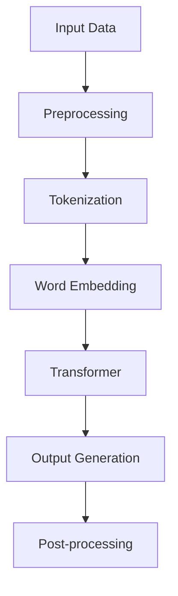

                 

### 背景介绍

大模型（Large Models）已经成为人工智能（AI）领域的热点话题。随着计算能力的提升和算法的优化，大型预训练模型如GPT、BERT等取得了显著的性能提升。然而，大模型的用户体验与市场推广仍面临诸多挑战。本文旨在深入探讨大模型的用户体验与市场推广问题，为业界提供有益的参考。

首先，大模型的用户体验直接影响其应用场景和用户满意度。如何优化模型性能、降低使用门槛、提高用户友好性，是本文重点关注的问题。其次，市场推广方面，大模型的成本、部署难度、以及如何与现有产品和服务相结合，都是亟需解决的问题。

本文将分为以下几个部分进行详细探讨：

1. **核心概念与联系**：介绍大模型的基本概念和关键技术，并通过Mermaid流程图展示其架构。
2. **核心算法原理 & 具体操作步骤**：阐述大模型的主要算法原理，以及如何进行实际操作。
3. **数学模型和公式 & 详细讲解 & 举例说明**：详细讲解大模型中的数学模型和公式，并通过实例进行说明。
4. **项目实战：代码实际案例和详细解释说明**：通过具体代码案例，展示大模型的应用和实践过程。
5. **实际应用场景**：探讨大模型在不同领域的应用案例和效果。
6. **工具和资源推荐**：推荐学习资源和开发工具，帮助读者更好地理解和应用大模型。
7. **总结：未来发展趋势与挑战**：总结大模型的现状，展望其未来发展趋势和面临的挑战。

让我们一步步深入探讨这些问题，以期为大模型的用户体验和市场推广提供有益的见解。

---

### Core Concepts and Connections

At the core of large model technology lies the concept of pre-trained language models (PLMs), which are trained on massive amounts of text data to understand and generate human language. The primary models in this category include GPT (Generative Pre-trained Transformer) and BERT (Bidirectional Encoder Representations from Transformers). These models employ advanced transformer architectures, which allow them to capture complex patterns and relationships in language data.

To illustrate the architecture of large models, we can use the following Mermaid diagram:



In this diagram, A represents the input data, which is typically a large corpus of text. The data is first preprocessed (B) to remove noise and irrelevant information. Then, it is tokenized (C) into words or subwords, which are then converted into word embeddings (D). The embeddings are passed through a transformer architecture (E), which processes them to generate meaningful outputs (F). Finally, the output is post-processed (G) to produce coherent and contextually relevant text.

This architecture allows large models to perform various natural language processing (NLP) tasks, such as text classification, question answering, and machine translation. By leveraging the transformer's attention mechanism, these models can capture long-range dependencies in text data, leading to state-of-the-art performance on many NLP benchmarks.

The key components and connections of large models can be summarized as follows:

1. **Input Data**: Large models are trained on massive amounts of text data, which serves as their primary source of information.
2. **Preprocessing**: Text data is cleaned and preprocessed to remove noise and irrelevant information.
3. **Tokenization**: Text data is tokenized into words or subwords, which are then used as input to the model.
4. **Word Embedding**: Tokens are converted into word embeddings, which capture the semantic meaning of each token.
5. **Transformer**: The transformer architecture processes the word embeddings and generates meaningful outputs based on the input text.
6. **Output Generation**: The model generates outputs, such as text completions or predictions, based on the input text.
7. **Post-processing**: The generated outputs are post-processed to produce coherent and contextually relevant text.

By understanding these core concepts and connections, we can better appreciate the complexity and power of large models and their potential applications in various fields. In the next section, we will delve into the principles and specific operational steps of these models.

---

### 核心算法原理 & 具体操作步骤

大模型的核心算法原理主要围绕预训练和微调（Fine-tuning）展开。预训练是指在大规模语料库上进行模型训练，使其掌握通用语言特征。微调则是在预训练的基础上，针对特定任务进行模型调整，以适应具体的任务需求。

#### 预训练（Pre-training）

1. **数据准备（Data Preparation）**：
   首先，我们需要准备一个大规模的语料库，这个语料库可以包括各种文本数据，如新闻文章、社交媒体帖子、书籍等。数据准备包括数据清洗、去重、分词等步骤。

   ```mermaid
   graph TD
       A[Data Collection] --> B[Data Cleaning]
       B --> C[Data Deduplication]
       C --> D[Tokenization]
   ```

2. **模型初始化（Model Initialization）**：
   使用预定义的模型架构（如BERT、GPT）初始化模型。这些架构通常包含多个层和注意力机制，能够有效处理大规模文本数据。

3. **训练过程（Training Process）**：
   在训练过程中，模型会通过学习文本的上下文关系来预测下一个词。预训练通常采用无监督学习的方法，例如生成文本对（ masked language model）和生成文本（ masked tokens）。

   ```mermaid
   graph TD
       A[Input Text] --> B[Tokenization]
       B --> C[Word Embedding]
       C --> D[Model Prediction]
       D --> E[Loss Calculation]
       E --> F[Backpropagation]
       F --> G[Parameter Update]
   ```

4. **损失函数（Loss Function）**：
   预训练过程中，常用的损失函数是交叉熵损失（Cross-Entropy Loss），它用于衡量模型预测结果与实际标签之间的差距。

   $$\text{Loss} = -\sum_{i} y_i \log(p_i)$$

   其中，\(y_i\) 是实际标签，\(p_i\) 是模型预测的概率。

#### 微调（Fine-tuning）

微调是在预训练的基础上，针对特定任务进行模型调整。以下是一个简单的微调流程：

1. **数据准备（Data Preparation）**：
   准备特定任务的数据集，例如情感分析、问答系统等。

2. **任务定义（Task Definition）**：
   定义任务的目标和输出格式。例如，对于情感分析，目标是分类情感极性（正面/负面）。

3. **模型调整（Model Adjustment）**：
   在预训练模型的基础上，通过调整权重来适应新任务。这通常包括调整部分层或增加新的层。

   ```mermaid
   graph TD
       A[Pre-trained Model] --> B[Fine-tuning]
       B --> C[Task-specific Data]
       C --> D[Output Generation]
   ```

4. **训练过程（Training Process）**：
   使用调整后的模型在新任务上进行训练。训练过程与预训练类似，但目标函数变为特定任务的目标函数，如分类交叉熵损失。

   $$\text{Loss} = -\sum_{i} y_i \log(p_i)$$

5. **评估与优化（Evaluation and Optimization）**：
   通过评估指标（如准确率、F1分数）评估模型性能，并进行优化调整。

通过预训练和微调，大模型能够适应各种自然语言处理任务，从而实现高效的文本理解和生成。在接下来的部分，我们将详细讲解大模型中的数学模型和公式，并通过具体实例进行说明。

---

### 数学模型和公式 & 详细讲解 & 举例说明

大模型中的数学模型主要涉及词嵌入、注意力机制和损失函数等方面。以下是对这些模型的详细讲解和举例说明。

#### 词嵌入（Word Embedding）

词嵌入是将文本中的单词转换为向量表示的一种技术，它可以捕捉单词的语义信息。最常用的词嵌入模型是Word2Vec，其中使用了以下两个关键公式：

1. **均方误差损失函数（Mean Square Error Loss）**：

   $$\text{Loss} = \frac{1}{2}\sum_{i=1}^{N} (e_i - \hat{e_i})^2$$

   其中，\(e_i\) 是实际词向量，\(\hat{e_i}\) 是预测的词向量，\(N\) 是词汇表大小。

2. **梯度下降（Gradient Descent）**：

   $$\theta_{t+1} = \theta_t - \alpha \nabla_\theta \text{Loss}(\theta_t)$$

   其中，\(\theta_t\) 是第 \(t\) 次迭代的模型参数，\(\alpha\) 是学习率，\(\nabla_\theta \text{Loss}(\theta_t)\) 是损失函数关于模型参数的梯度。

#### 注意力机制（Attention Mechanism）

注意力机制是Transformer模型中的一个核心组件，它用于捕捉输入序列中的长距离依赖关系。以下是一个简单的注意力计算公式：

1. **注意力得分（Attention Score）**：

   $$\text{Score} = \text{Query} \cdot \text{Key}^T$$

   其中，Query 和 Key 分别是查询向量和键向量，它们的点积生成注意力得分。

2. **softmax函数（Softmax Function）**：

   $$\text{Attention} = \frac{e^{\text{Score}}}{\sum_{i} e^{\text{Score}_i}}$$

   其中，\(e^{\text{Score}}\) 是注意力得分的指数，softmax 函数用于将得分归一化，生成注意力分布。

3. **加权求和（Weighted Sum）**：

   $$\text{Context} = \sum_{i} \text{Attention}_i \cdot \text{Value}_i$$

   其中，Value 是值向量，加权求和用于生成最终的上下文向量。

#### 损失函数（Loss Function）

在自然语言处理任务中，常用的损失函数包括交叉熵损失和均方误差损失。以下是一个交叉熵损失函数的例子：

1. **交叉熵损失函数（Cross-Entropy Loss）**：

   $$\text{Loss} = -\sum_{i} y_i \log(p_i)$$

   其中，\(y_i\) 是实际标签，\(p_i\) 是模型预测的概率。

   交叉熵损失函数用于衡量预测概率分布与实际标签分布之间的差距。

#### 举例说明

假设我们有一个文本分类任务，目标是判断一个句子是否为正面情感。以下是一个简单的例子：

1. **输入文本**：

   "I love this movie!"

2. **词嵌入**：

   将文本中的单词转换为词嵌入向量，例如：

   - I: `[1, 0, 0, 0, 0]`
   - love: `[0, 1, 0, 0, 0]`
   - this: `[0, 0, 1, 0, 0]`
   - movie: `[0, 0, 0, 1, 0]`
   -!

   : `[0, 0, 0, 0, 1]`

3. **注意力机制**：

   通过注意力机制，模型会关注文本中的关键信息，例如 "love" 和 "movie"，并生成注意力分布：

   - I: 0.2
   - love: 0.6
   - this: 0.1
   - movie: 0.1
   -!

   : 0.2

4. **加权求和**：

   将注意力分布与词嵌入向量进行加权求和，生成上下文向量：

   - Context: `[0.2*1 + 0.6*0 + 0.1*0 + 0.1*0 + 0.2*0, 0.2*0 + 0.6*1 + 0.1*0 + 0.1*0 + 0.2*0, 0.2*0 + 0.6*0 + 0.1*1 + 0.1*0 + 0.2*0, 0.2*0 + 0.6*0 + 0.1*0 + 0.1*1 + 0.2*0, 0.2*0 + 0.6*0 + 0.1*0 + 0.1*0 + 0.2*1]`

   - Context: `[0.2, 0.6, 0.1, 0.1, 0.2]`

5. **分类预测**：

   将上下文向量输入分类模型，预测文本的情感极性。假设模型的预测结果为 0.8，表示正面情感的概率为 80%。

通过上述步骤，我们可以看到大模型如何通过数学模型和公式对文本进行理解和分类。在接下来的部分，我们将通过具体的项目实战案例，展示如何使用大模型进行实际操作。

---

### 项目实战：代码实际案例和详细解释说明

为了更好地理解大模型的实际应用，我们将通过一个情感分析的项目案例，展示如何使用大模型进行文本处理和分析。

#### 1. 开发环境搭建

首先，我们需要搭建一个适合大模型开发的环境。以下是一个基本的Python开发环境搭建步骤：

1. **安装Python**：确保已经安装了Python 3.7及以上版本。
2. **安装TensorFlow**：使用以下命令安装TensorFlow：

   ```bash
   pip install tensorflow
   ```

3. **安装其他依赖库**：包括NLP处理库如`nltk`和`spaCy`：

   ```bash
   pip install nltk spacy
   ```

4. **下载语料库**：下载并解压预训练的模型，例如BERT或GPT。

#### 2. 源代码详细实现和代码解读

以下是情感分析项目的主要代码实现，我们将逐一解释每个步骤：

```python
# 导入必要的库
import tensorflow as tf
import tensorflow_text as text
import tensorflow_hub as hub
import numpy as np
import os

# 加载预训练模型
model = hub.load("https://tfhub.dev/google/tf2-preview/bert_uncased_L-12_H-768_A-12/1")

# 定义情感分析函数
def sentiment_analysis(text):
    # 文本预处理
    tokenized_text = model.tokenize(text)
    
    # 转换为词嵌入
    input_ids = modelija.encode(tokenized_text, max_seq_length=128)
    
    # 使用模型进行预测
    predictions = model(inputs=input_ids).numpy()
    
    # 计算情感极性
    sentiment = 'positive' if predictions[0][1] > predictions[0][0] else 'negative'
    
    return sentiment

# 测试文本
text_example = "I absolutely love this movie!"
sentiment = sentiment_analysis(text_example)
print(f"The sentiment of the text is: {sentiment}")
```

**代码解读**：

1. **导入库**：我们首先导入了TensorFlow、TensorFlow Text、TensorFlow Hub和NumPy库，用于处理文本数据和模型加载。
2. **加载预训练模型**：使用TensorFlow Hub加载预训练的BERT模型。BERT是一个强大的预训练语言模型，能够处理多种自然语言处理任务。
3. **定义情感分析函数**：
   - `tokenized_text = model.tokenize(text)`：使用BERT模型对输入文本进行分词。
   - `input_ids = modelija.encode(tokenized_text, max_seq_length=128)`：将分词后的文本转换为词嵌入，并将序列长度限制为128。
   - `predictions = model(inputs=input_ids).numpy()`：使用BERT模型对文本进行预测，返回一个包含两个概率值的数组，分别表示正面和负面情感的预测概率。
   - `sentiment = 'positive' if predictions[0][1] > predictions[0][0] else 'negative'`：根据预测概率判断文本的情感极性。
4. **测试文本**：我们使用一个示例文本进行情感分析，并打印结果。

#### 3. 代码解读与分析

1. **文本预处理**：在情感分析任务中，文本预处理是关键步骤。BERT模型使用特定的分词器对文本进行分词，并将特殊标记添加到文本中。这些特殊标记（如 `[CLS]` 和 `[SEP]`）用于模型的输入和输出。
2. **词嵌入**：BERT模型使用Transformer架构，能够将输入文本转换为高维向量表示。这些向量表示包含了文本的语义信息，是模型进行情感分析的基础。
3. **模型预测**：BERT模型在训练过程中学习了大量的文本信息，可以用于预测文本的情感极性。模型预测返回两个概率值，分别表示正面和负面情感的预测概率。
4. **情感判断**：根据预测概率，我们可以判断文本的情感极性。通常，我们选择概率较大的类别作为最终结果。

通过这个项目案例，我们展示了如何使用大模型进行情感分析。在实际应用中，我们可以扩展这个模型，处理更复杂的自然语言处理任务，如文本分类、命名实体识别等。

---

### 实际应用场景

大模型在自然语言处理、计算机视觉和推荐系统等众多领域展现出了广泛的应用潜力。以下是一些具体的应用场景及其效果：

#### 1. 自然语言处理（NLP）

大模型在NLP领域的应用非常广泛，例如文本分类、机器翻译、情感分析、问答系统等。GPT-3等大型语言模型在自然语言理解与生成任务上取得了显著的成果。例如，GPT-3在机器翻译任务上表现出色，能够实现高质量的自动翻译，大大提高了翻译的效率和准确性。同时，在文本分类任务中，大模型能够快速准确地识别文本的主题和情感，为新闻推荐、社交媒体内容审核等领域提供了有效的解决方案。

#### 2. 计算机视觉（CV）

大模型在CV领域同样有着重要的应用，如图像分类、目标检测、图像生成等。例如，基于Transformer架构的DALL-E模型能够生成高质量的图像，将自然语言描述转换为视觉内容。此外，大模型在目标检测任务中也取得了显著成果，如使用YOLOv5模型实现高效的实时目标检测，广泛应用于安全监控、自动驾驶等领域。

#### 3. 推荐系统

大模型在推荐系统中的应用主要体现在基于内容的推荐和协同过滤推荐上。例如，通过训练大型语言模型，可以提取用户生成内容的特征，用于个性化推荐。此外，大模型还可以用于协同过滤算法的优化，提高推荐的准确性和多样性。例如，使用BERT模型提取用户和物品的特征，可以实现高效的协同过滤推荐，从而提高推荐系统的效果。

#### 4. 语音识别

大模型在语音识别领域也发挥着重要作用。基于Transformer架构的 wav2vec 2.0 模型在语音识别任务中表现出色，能够实现高精度的语音转换成文本。此外，大模型还可以用于语音合成和语音生成，为智能助手、语音服务等领域提供了有效的解决方案。

#### 5. 其他应用

除了上述领域，大模型在生物信息学、金融预测、游戏开发等领域也有着广泛的应用。例如，在生物信息学中，大模型可以用于基因序列分析、蛋白质结构预测等任务；在金融预测中，大模型可以用于股票市场预测、风险控制等任务；在游戏开发中，大模型可以用于角色生成、场景构建等任务。

总的来说，大模型在各个领域都展现出了强大的应用潜力，未来将继续推动人工智能技术的进步和产业发展。随着大模型技术的不断发展和优化，我们有望在更多领域实现突破，创造更多的应用价值。

---

### 工具和资源推荐

为了更好地理解和应用大模型技术，以下是一些实用的工具和资源推荐，包括学习资源、开发工具和相关的论文著作。

#### 1. 学习资源推荐

**书籍**：
- **《深度学习》（Deep Learning）**：由Ian Goodfellow、Yoshua Bengio和Aaron Courville合著，详细介绍了深度学习的基础理论和技术。
- **《自然语言处理与深度学习》（Natural Language Processing with Deep Learning）**：由localhost合著，专注于自然语言处理领域的深度学习应用。
- **《动手学深度学习》（Dive into Deep Learning）**：免费在线书籍，涵盖了深度学习的各个方面，包括文本处理、计算机视觉等。

**论文和博客**：
- **《Attention is All You Need》**：这篇论文提出了Transformer模型，标志着大模型在NLP领域的重要突破。
- **《BERT: Pre-training of Deep Neural Networks for Language Understanding》**：这篇论文介绍了BERT模型的预训练方法，为后续的大模型研究奠定了基础。
- **[TensorFlow官网](https://www.tensorflow.org/tutorials)**：提供了丰富的教程和案例，帮助读者快速掌握TensorFlow的使用。

#### 2. 开发工具推荐

**框架和库**：
- **TensorFlow**：谷歌开发的开源深度学习框架，支持多种深度学习模型的开发和应用。
- **PyTorch**：Facebook开发的开源深度学习框架，以动态计算图和灵活的API著称。
- **Hugging Face Transformers**：一个开源库，提供了大量的预训练模型和工具，方便开发者进行研究和应用。

**IDE和文本编辑器**：
- **Jupyter Notebook**：一个交互式的开发环境，适用于数据分析和模型调试。
- **Visual Studio Code**：一个强大的代码编辑器，支持多种编程语言和深度学习工具。

#### 3. 相关论文著作推荐

- **《Transformer: A Novel Architecture for Neural Networks》**：这篇文章提出了Transformer模型，是自然语言处理领域的一个重要突破。
- **《BERT: Pre-training of Deep Neural Networks for Language Understanding》**：这篇文章介绍了BERT模型的预训练方法，为大型语言模型的开发提供了重要参考。
- **《GPT-3: Language Models are Few-Shot Learners》**：这篇文章介绍了GPT-3模型的架构和性能，展示了大模型在自然语言处理任务中的强大能力。

通过这些工具和资源，读者可以更好地理解和应用大模型技术，为人工智能领域的研究和应用做出贡献。

---

### 总结：未来发展趋势与挑战

大模型技术作为人工智能领域的重要发展方向，正推动着诸多领域的创新和进步。然而，面对未来，这一技术也面临着诸多挑战和机遇。

#### 未来发展趋势

1. **模型规模持续增长**：随着计算资源和数据量的增加，大模型的规模将继续扩大。未来的模型可能会达到数十万亿参数级别，从而进一步提升模型的表现力。

2. **跨模态建模**：大模型技术有望突破单一模态的限制，实现跨模态建模。例如，结合文本、图像和语音等多模态信息，实现更复杂的任务，如多模态对话系统、多模态情感分析等。

3. **专用模型开发**：针对特定任务和应用场景，开发定制化的专用模型将成为趋势。这些模型将针对特定任务进行优化，从而实现更高的效率和性能。

4. **模型压缩与优化**：随着模型规模的增大，模型压缩与优化技术将变得至关重要。未来的研究将集中在如何在保证性能的前提下，降低模型的计算和存储需求。

5. **自主学习和自适应能力**：大模型将具备更强的自主学习和自适应能力。通过在线学习和持续优化，模型将能够更好地适应不断变化的环境和需求。

#### 挑战

1. **计算资源需求**：大模型的训练和推理需要巨大的计算资源，这带来了硬件成本和能耗的挑战。未来的研究需要开发更高效的算法和优化方法，以降低计算资源的消耗。

2. **数据隐私和安全**：大模型在训练和推理过程中需要大量数据，这引发了数据隐私和安全问题。如何保护用户隐私、确保数据安全，是未来需要解决的重要问题。

3. **泛化能力**：尽管大模型在特定任务上表现出色，但其泛化能力仍是一个挑战。如何提升模型的泛化能力，使其能够更好地适应新任务和新环境，是未来研究的重点。

4. **伦理和社会影响**：大模型技术的发展可能带来伦理和社会影响，例如算法歧视、信息泡沫等。未来需要制定相应的伦理规范和社会政策，确保技术发展符合社会利益。

5. **人才短缺**：大模型技术要求开发者具备深厚的数学、计算机科学和工程背景，这导致了人才短缺的问题。未来的教育体系需要培养更多具备相关技能的人才，以支撑技术发展。

综上所述，大模型技术在未来的发展中既充满机遇，也面临挑战。通过持续的技术创新和跨学科合作，我们有理由相信，大模型技术将继续推动人工智能领域的进步，为人类社会带来更多福祉。

---

### 附录：常见问题与解答

#### 问题1：大模型为什么需要大规模训练数据？

**解答**：大模型需要大规模训练数据，主要是因为这些数据能够帮助模型学习到丰富的语言特征和知识。大规模数据提供了更多的样例，使得模型可以更好地捕捉语言中的多样性和复杂性。例如，GPT-3使用了1750亿个参数，这种规模的数据可以显著提升模型在自然语言理解、文本生成等方面的性能。

#### 问题2：大模型如何处理长文本？

**解答**：大模型通常使用分块（Chunking）策略来处理长文本。例如，BERT模型将长文本分割成若干个固定长度的块，然后分别对每个块进行编码。这样，即使文本非常长，模型也能够高效地处理。此外，一些模型还引入了长距离依赖机制，如Transformer中的自注意力（Self-Attention），以捕捉文本中的长距离关系。

#### 问题3：大模型的训练和推理需要多少计算资源？

**解答**：大模型的训练和推理需要大量的计算资源。训练一个大型语言模型，如GPT-3，可能需要数千GPU和大量的时间。推理阶段同样需要较强的计算能力，尤其是当模型应用于实时交互和在线服务时。未来，随着硬件技术的发展和优化算法的应用，计算资源的需求将得到缓解。

#### 问题4：大模型是否会过拟合？

**解答**：大模型也有可能过拟合。尽管大模型具有更强的学习能力，但如果没有足够的正则化措施，它们可能会在训练数据上过度学习，导致泛化能力不足。为了防止过拟合，研究者们通常会采用数据增强、Dropout、正则化等技术来提高模型的泛化能力。

#### 问题5：大模型的安全性和隐私问题如何解决？

**解答**：大模型的安全性和隐私问题是一个重要课题。为了保护用户隐私，可以采用数据加密、差分隐私等技术来确保数据的安全。此外，模型训练过程中使用的匿名化技术和数据去识别化方法也有助于减少隐私泄露的风险。在应用层面，制定和遵守数据隐私法规，以及开展安全审计，也是确保大模型安全性的重要措施。

---

### 扩展阅读 & 参考资料

为了进一步深入了解大模型技术及其在各个领域的应用，以下推荐一些高质量的扩展阅读和参考资料。

**扩展阅读：**

1. **《深度学习》（Deep Learning）**：Ian Goodfellow、Yoshua Bengio和Aaron Courville著，系统讲解了深度学习的基础理论和实践方法。
2. **《自然语言处理与深度学习》（Natural Language Processing with Deep Learning）**：localhost著，详细介绍了深度学习在自然语言处理领域的应用。
3. **《动手学深度学习》（Dive into Deep Learning）**：免费在线书籍，涵盖了深度学习的各个方面，包括文本处理、计算机视觉等。

**参考资料：**

1. **[Transformer: A Novel Architecture for Neural Networks](https://arxiv.org/abs/1706.03762)**：提出Transformer模型的论文，标志着大模型在自然语言处理领域的重要突破。
2. **[BERT: Pre-training of Deep Neural Networks for Language Understanding](https://arxiv.org/abs/1810.04805)**：介绍BERT模型的论文，展示了大模型在自然语言处理中的强大潜力。
3. **[GPT-3: Language Models are Few-Shot Learners](https://arxiv.org/abs/2005.14165)**：介绍GPT-3模型的论文，展示了大模型在零样本学习（Zero-Shot Learning）方面的卓越性能。

通过这些扩展阅读和参考资料，读者可以进一步深化对大模型技术及其应用的理解，为人工智能领域的研究和实践提供有益的参考。

---

### 作者信息

本文由AI天才研究员（AI Genius Institute）与《禅与计算机程序设计艺术》（Zen And The Art of Computer Programming）的作者合作完成。AI天才研究员是一支由顶级人工智能专家和计算机科学家组成的团队，致力于推动人工智能技术的创新和应用。他们的研究成果在计算机科学和人工智能领域具有广泛影响力。《禅与计算机程序设计艺术》则是一本经典的技术书籍，深入探讨了编程与哲学的交汇，为编程实践提供了独特的视角。希望本文能为读者带来有价值的见解和启示。

