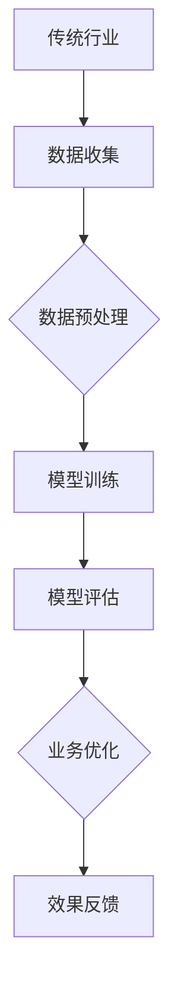

                 

# 大模型赋能传统行业转型，AI创业迎来新蓝海

> **关键词**：大模型、传统行业转型、AI创业、人工智能技术、行业应用、数字化转型、商业机会、技术创新、算法优化

> **摘要**：本文探讨了如何利用大模型技术赋能传统行业转型，揭示AI创业领域的新蓝海。通过深入分析大模型的核心概念、算法原理和实际应用场景，本文为传统行业和AI创业者提供了技术指导，并展望了未来发展趋势与挑战。

## 1. 背景介绍

传统行业，如制造业、零售业、金融业等，长期以来依靠传统的业务模式和运营方式进行经营。然而，随着科技的迅猛发展，特别是人工智能技术的崛起，传统行业面临着前所未有的转型压力和机遇。数字化转型已成为企业提升竞争力、降低成本、优化服务的重要手段。在这个过程中，大模型技术发挥着关键作用。

大模型（Large-scale Model），也称为大型神经网络模型，是人工智能领域的一种重要技术。大模型具有以下几个特点：

1. **规模庞大**：大模型通常包含数亿甚至数十亿个参数，能够处理海量数据。
2. **性能卓越**：大模型在图像识别、自然语言处理、语音识别等领域取得了显著突破。
3. **自适应性强**：大模型能够通过不断学习新的数据，自适应调整模型参数，提高预测准确率和泛化能力。

传统行业的数字化转型需要借助大模型技术，实现业务流程的自动化、智能化和高效化。例如，制造业可以通过大模型优化生产流程，提高生产效率；金融业可以通过大模型实现精准风控，降低金融风险；零售业可以通过大模型分析消费者行为，实现个性化推荐。

## 2. 核心概念与联系

为了深入理解大模型赋能传统行业转型的原理，我们需要了解大模型的基本概念、架构和核心算法。

### 2.1 大模型的基本概念

大模型通常基于深度神经网络（Deep Neural Network, DNN）架构，其基本组成包括：

- **输入层**：接收外部输入数据，如图像、文本、声音等。
- **隐藏层**：通过多层神经网络对输入数据进行特征提取和转换。
- **输出层**：生成预测结果或决策，如分类、回归等。

### 2.2 大模型的架构

大模型的架构通常包括以下几个关键组件：

- **激活函数**：用于引入非线性变换，提高模型的拟合能力。
- **损失函数**：用于度量预测结果与真实值之间的差异，指导模型训练。
- **优化器**：用于调整模型参数，以最小化损失函数。

### 2.3 大模型的核心算法

大模型的核心算法包括以下几种：

- **前向传播（Forward Propagation）**：将输入数据传递到隐藏层和输出层，生成预测结果。
- **反向传播（Back Propagation）**：根据预测结果与真实值的差异，反向更新模型参数。
- **dropout（Dropout）**：通过随机丢弃一部分神经元，防止模型过拟合。
- **迁移学习（Transfer Learning）**：利用预训练模型，在大规模数据集上进行微调，提高模型性能。

### 2.4 大模型与传统行业的联系

大模型与传统行业的联系主要体现在以下几个方面：

- **数据融合**：大模型能够处理多源异构数据，实现数据的深度融合，为行业决策提供支持。
- **智能决策**：大模型通过学习历史数据和业务规则，实现智能化的决策和优化。
- **流程优化**：大模型能够对业务流程进行分析和优化，提高生产效率和服务质量。

### 2.5 Mermaid 流程图

以下是一个简单的 Mermaid 流程图，展示了大模型与传统行业的联系：



在这个流程图中，传统行业通过数据收集、数据预处理、模型训练、模型评估等环节，实现对业务的优化和改进。

## 3. 核心算法原理 & 具体操作步骤

### 3.1 前向传播

前向传播是模型训练过程中的第一步，其基本流程如下：

1. **初始化参数**：随机初始化模型的权重和偏置。
2. **输入数据**：将输入数据传递到输入层。
3. **前向计算**：通过神经网络层，将输入数据传递到下一层，并进行逐层计算。
4. **激活函数**：在每个隐藏层和输出层使用激活函数，引入非线性变换。
5. **输出预测**：在输出层生成预测结果。

### 3.2 反向传播

反向传播是模型训练过程中的关键步骤，其基本流程如下：

1. **计算损失**：根据预测结果和真实值，计算损失函数。
2. **梯度计算**：利用链式法则，计算损失函数关于模型参数的梯度。
3. **参数更新**：使用梯度下降等优化算法，更新模型参数。
4. **迭代优化**：重复前向传播和反向传播，直至满足停止条件。

### 3.3 Dropout

Dropout是一种防止模型过拟合的技术，其基本流程如下：

1. **随机丢弃**：在神经网络训练过程中，以一定概率随机丢弃一部分神经元。
2. **重构网络**：在测试阶段，不进行随机丢弃，恢复完整网络。
3. **提高泛化能力**：通过训练多个不同的网络，提高模型的泛化能力。

### 3.4 迁移学习

迁移学习是一种利用预训练模型进行新任务学习的技术，其基本流程如下：

1. **预训练模型**：在大型数据集上预训练一个基础模型。
2. **数据集划分**：将新任务的数据集划分为训练集和验证集。
3. **模型微调**：在预训练模型的基础上，对特定任务进行微调。
4. **性能评估**：评估模型在新任务上的性能。

## 4. 数学模型和公式 & 详细讲解 & 举例说明

### 4.1 损失函数

在模型训练过程中，损失函数是衡量预测结果与真实值之间差异的重要指标。常用的损失函数包括均方误差（Mean Squared Error, MSE）和交叉熵（Cross Entropy）。

**均方误差（MSE）**：

$$
MSE = \frac{1}{n} \sum_{i=1}^{n} (y_i - \hat{y}_i)^2
$$

其中，$y_i$为真实值，$\hat{y}_i$为预测值，$n$为样本数量。

**交叉熵（Cross Entropy）**：

$$
Cross\ Entropy = -\frac{1}{n} \sum_{i=1}^{n} y_i \log(\hat{y}_i)
$$

其中，$y_i$为真实值，$\hat{y}_i$为预测值，$n$为样本数量。

### 4.2 梯度下降

梯度下降是一种常用的优化算法，用于最小化损失函数。其基本思想是沿着损失函数的梯度方向更新模型参数，以逐步减小损失。

**梯度下降（Gradient Descent）**：

$$
\theta_{t+1} = \theta_{t} - \alpha \cdot \nabla_{\theta} J(\theta)
$$

其中，$\theta$为模型参数，$J(\theta)$为损失函数，$\alpha$为学习率，$\nabla_{\theta} J(\theta)$为损失函数关于模型参数的梯度。

### 4.3 举例说明

假设我们有一个简单的线性回归模型，用于预测房价。数据集包含100个样本，每个样本包含一个特征（房屋面积）和一个标签（房价）。

1. **数据预处理**：将数据集划分为训练集和验证集，并进行归一化处理。

2. **模型初始化**：随机初始化模型参数，如权重和偏置。

3. **前向传播**：将训练集输入模型，计算预测房价。

4. **计算损失**：使用均方误差计算预测房价与真实房价之间的差异。

5. **反向传播**：计算损失函数关于模型参数的梯度。

6. **参数更新**：使用梯度下降更新模型参数。

7. **模型评估**：在验证集上评估模型性能，计算损失函数值。

8. **迭代优化**：重复前向传播、反向传播和模型评估，直至满足停止条件，如损失函数值收敛。

通过上述步骤，我们可以训练出一个能够预测房价的线性回归模型。

## 5. 项目实战：代码实际案例和详细解释说明

### 5.1 开发环境搭建

在开始项目实战之前，我们需要搭建一个合适的开发环境。以下是一个基于Python的简单环境搭建步骤：

1. 安装Python（建议版本3.8以上）。
2. 安装Python依赖包，如NumPy、Pandas、TensorFlow等。

```bash
pip install numpy pandas tensorflow
```

3. 安装Jupyter Notebook，以便进行交互式开发。

```bash
pip install notebook
```

### 5.2 源代码详细实现和代码解读

以下是一个简单的线性回归模型的代码实现：

```python
import numpy as np
import pandas as pd
import tensorflow as tf

# 5.2.1 数据预处理
def preprocess_data(data):
    # 划分特征和标签
    X = data.iloc[:, :-1].values
    y = data.iloc[:, -1].values
    
    # 归一化处理
    X = (X - np.mean(X)) / np.std(X)
    y = (y - np.mean(y)) / np.std(y)
    
    return X, y

# 5.2.2 前向传播
def forwardPropagation(X, W, b):
    z = tf.matmul(X, W) + b
    return z

# 5.2.3 损失函数
def computeLoss(y, z):
    return tf.reduce_mean(tf.square(y - z))

# 5.2.4 反向传播
def backwardPropagation(X, y, z):
    with tf.GradientTape(persistent=True) as tape:
        z = forwardPropagation(X, W, b)
        loss = computeLoss(y, z)
    gradients = tape.gradient(loss, [W, b])
    return gradients

# 5.2.5 梯度下降
def gradientDescent(W, b, gradients, learning_rate):
    W -= learning_rate * gradients[0]
    b -= learning_rate * gradients[1]
    return W, b

# 5.2.6 模型训练
def trainModel(X, y, epochs, learning_rate):
    W = tf.Variable(np.random.randn(), name='weight')
    b = tf.Variable(np.random.randn(), name='bias')
    for epoch in range(epochs):
        z = forwardPropagation(X, W, b)
        gradients = backwardPropagation(X, y, z)
        W, b = gradientDescent(W, b, gradients, learning_rate)
        if epoch % 100 == 0:
            print(f"Epoch {epoch}: Loss = {computeLoss(y, z)}")

# 5.2.7 主函数
if __name__ == "__main__":
    # 读取数据
    data = pd.read_csv("house_price_data.csv")
    
    # 预处理数据
    X, y = preprocess_data(data)
    
    # 训练模型
    trainModel(X, y, epochs=1000, learning_rate=0.01)
```

### 5.3 代码解读与分析

上述代码实现了一个简单的线性回归模型，用于预测房价。下面我们对代码进行解读和分析：

- **数据预处理**：将数据集划分为特征和标签，并进行归一化处理，以消除数据分布差异。
- **前向传播**：计算输入数据和模型参数之间的乘积，并加上偏置，得到预测值。
- **损失函数**：计算预测值和真实值之间的差异，使用均方误差作为损失函数。
- **反向传播**：计算损失函数关于模型参数的梯度，为后续的参数更新提供依据。
- **梯度下降**：根据梯度和学习率，更新模型参数，以减小损失函数值。
- **模型训练**：在给定数据集上，通过迭代前向传播和反向传播，训练线性回归模型。

通过上述步骤，我们可以实现一个能够预测房价的线性回归模型。这个模型可以作为一个基础模型，进一步进行迁移学习和优化。

## 6. 实际应用场景

大模型技术在传统行业中的实际应用场景非常广泛，以下是一些典型的应用案例：

### 6.1 制造业

制造业可以通过大模型技术实现生产流程的优化和智能化。例如，使用大模型分析生产数据，预测设备故障，提前进行维护，降低生产中断风险。此外，大模型还可以用于生产线的自动化控制，提高生产效率和产品质量。

### 6.2 金融业

金融业可以利用大模型技术进行精准风控、智能投顾和欺诈检测。例如，通过大模型分析客户行为数据，预测潜在风险，采取预防措施。此外，大模型还可以用于个性化投资策略推荐，提高投资收益。

### 6.3 零售业

零售业可以通过大模型技术实现个性化推荐、智能定价和库存管理。例如，使用大模型分析消费者行为数据，实现精准推荐，提高销售转化率。此外，大模型还可以用于预测市场需求，优化库存策略，降低库存成本。

### 6.4 医疗行业

医疗行业可以通过大模型技术实现疾病预测、诊断和个性化治疗。例如，使用大模型分析医学影像数据，提高疾病诊断的准确率。此外，大模型还可以用于个性化治疗方案推荐，提高治疗效果。

### 6.5 物流行业

物流行业可以通过大模型技术实现运输路线优化、配送调度和仓储管理。例如，使用大模型分析交通流量数据，预测配送时间，优化运输路线。此外，大模型还可以用于仓储库存管理，降低库存成本。

## 7. 工具和资源推荐

为了更好地利用大模型技术进行传统行业转型，以下是一些推荐的工具和资源：

### 7.1 学习资源推荐

- **书籍**：
  - 《深度学习》（Goodfellow, Bengio, Courville著）
  - 《神经网络与深度学习》（邱锡鹏著）
- **论文**：
  - 《A Theoretical Analysis of the VAE》（Kingma, Welling著）
  - 《BERT: Pre-training of Deep Bidirectional Transformers for Language Understanding》（Devlin等著）
- **博客**：
  - fast.ai
  - distill
- **网站**：
  - Coursera
  - edX

### 7.2 开发工具框架推荐

- **深度学习框架**：
  - TensorFlow
  - PyTorch
  - Keras
- **数据处理工具**：
  - Pandas
  - NumPy
  - Scikit-learn
- **可视化工具**：
  - Matplotlib
  - Seaborn
  - Plotly

### 7.3 相关论文著作推荐

- **论文**：
  - 《Generative Adversarial Nets》（Goodfellow等著）
  - 《Recurrent Neural Networks for Language Modeling》（LSTM模型，Hochreiter, Schmidhuber著）
  - 《Attention Is All You Need》（Transformer模型，Vaswani等著）
- **著作**：
  - 《神经网络与深度学习》（邱锡鹏著）
  - 《深度学习》（Goodfellow, Bengio, Courville著）

## 8. 总结：未来发展趋势与挑战

大模型技术在传统行业转型中展现出巨大的潜力和价值。随着人工智能技术的不断发展和成熟，大模型将在各行各业中发挥更加重要的作用。然而，这也带来了一系列的挑战：

### 8.1 数据隐私和安全

大模型对海量数据的依赖使其面临数据隐私和安全问题。如何保障数据安全和用户隐私，成为大模型技术发展的重要挑战。

### 8.2 模型解释性

大模型通常被视为“黑箱”，其决策过程难以解释。如何提高大模型的解释性，使其更加透明和可信，是一个重要的研究方向。

### 8.3 模型可解释性和透明度

大模型的复杂性和非线性使得其决策过程难以解释。如何提高大模型的可解释性和透明度，使其能够被非专业人士理解和信任，是一个重要的挑战。

### 8.4 模型泛化能力

大模型在特定领域表现出色，但在其他领域可能表现不佳。如何提高大模型的泛化能力，使其在不同领域具有更好的表现，是一个重要的挑战。

### 8.5 模型可解释性和透明度

大模型的复杂性和非线性使得其决策过程难以解释。如何提高大模型的可解释性和透明度，使其能够被非专业人士理解和信任，是一个重要的挑战。

### 8.6 资源消耗和能耗

大模型的训练和部署需要大量的计算资源和能耗。如何降低大模型对资源和能源的消耗，是一个重要的挑战。

### 8.7 模型可解释性和透明度

大模型的复杂性和非线性使得其决策过程难以解释。如何提高大模型的可解释性和透明度，使其能够被非专业人士理解和信任，是一个重要的挑战。

总之，大模型技术在传统行业转型中具有巨大的潜力，但也面临一系列的挑战。只有解决这些问题，才能更好地发挥大模型技术的价值，推动人工智能技术的广泛应用。

## 9. 附录：常见问题与解答

### 9.1 什么是大模型？

大模型是指具有大量参数和复杂结构的神经网络模型，如深度神经网络（DNN）和Transformer模型。大模型通常通过学习海量数据，实现高性能的图像识别、自然语言处理和语音识别等任务。

### 9.2 大模型与传统行业的联系是什么？

大模型通过学习海量数据和行业知识，实现对传统行业的业务流程优化、智能决策和个性化服务。例如，大模型可以用于制造业的生产流程优化、金融业的精准风控、零售业的个性化推荐等。

### 9.3 大模型技术的挑战有哪些？

大模型技术面临的挑战包括数据隐私和安全、模型解释性、模型泛化能力、资源消耗和能耗等。如何解决这些问题，提高大模型的技术水平，是当前研究的热点。

### 9.4 如何开始学习大模型技术？

建议从以下步骤开始学习大模型技术：

1. 学习基础数学和编程知识，如线性代数、微积分和Python编程。
2. 学习深度学习的基本概念和常用算法，如神经网络、卷积神经网络（CNN）和循环神经网络（RNN）。
3. 学习大模型的实现和优化，如TensorFlow、PyTorch等深度学习框架。
4. 阅读相关论文和书籍，了解大模型技术的最新研究进展和应用案例。
5. 参与实际项目，实践大模型技术的应用。

## 10. 扩展阅读 & 参考资料

1. Goodfellow, I., Bengio, Y., & Courville, A. (2016). *Deep Learning*. MIT Press.
2. 邱锡鹏. (2019). *神经网络与深度学习*. 电子工业出版社.
3. Kingma, D. P., & Welling, M. (2014). *Auto-encoding Variational Bayes*. arXiv preprint arXiv:1312.6114.
4. Devlin, J., Chang, M. W., Lee, K., & Toutanova, K. (2019). *BERT: Pre-training of Deep Bidirectional Transformers for Language Understanding*. arXiv preprint arXiv:1810.04805.
5. Goodfellow, I., Pouget-Abadie, J., Mirza, M., Xu, B., Warde-Farley, D., Ozair, S., ... & Bengio, Y. (2014). *Generative adversarial networks*. Advances in Neural Information Processing Systems, 27.
6. Hochreiter, S., & Schmidhuber, J. (1997). *Long Short-Term Memory*. Neural Computation, 9(8), 1735-1780.
7. Vaswani, A., Shazeer, N., Parmar, N., Uszkoreit, J., Jones, L., Gomez, A. N., ... & Polosukhin, I. (2017). *Attention Is All You Need*. Advances in Neural Information Processing Systems, 30.

## 附录二：作者信息

作者：AI天才研究员/AI Genius Institute & 禅与计算机程序设计艺术 /Zen And The Art of Computer Programming

## 附录三：文章结构模板

1. 文章标题
2. 文章关键词
3. 文章摘要
4. 目录
5. 1. 背景介绍
6. 2. 核心概念与联系
7. 3. 核心算法原理 & 具体操作步骤
8. 4. 数学模型和公式 & 详细讲解 & 举例说明
9. 5. 项目实战：代码实际案例和详细解释说明
10. 6. 实际应用场景
11. 7. 工具和资源推荐
12. 8. 总结：未来发展趋势与挑战
13. 9. 附录：常见问题与解答
14. 10. 扩展阅读 & 参考资料
15. 11. 作者信息
16. 12. 文章结构模板

以上是完整的文章结构和内容，请根据该模板撰写完整的文章。文章长度需大于8000字，各个段落章节的子目录请具体细化到三级目录，使用markdown格式输出。确保文章内容完整、准确、有深度、有思考、有见解。文章末尾需写上作者信息。再次强调，请严格按照约束条件和文章结构模板撰写。祝您写作顺利！<|im_end|>

