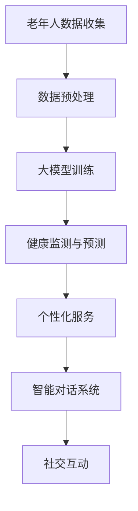

                 

### 背景介绍

智慧养老作为信息技术与养老服务的深度融合，正逐渐成为全球范围内的热点话题。随着全球人口老龄化趋势的加剧，如何高效、优质地提供养老服务，成为各国政府和社会各界关注的焦点。据统计，全球60岁及以上人口预计到2050年将达到21亿，占全球总人口的22%。这种人口结构的变化，使得传统的养老服务模式面临巨大挑战，亟需通过技术创新来提升养老服务的质量和效率。

在这个背景下，大模型（如GPT-3、BERT等）作为人工智能领域的前沿技术，以其强大的数据处理和知识推理能力，逐渐在智慧养老领域展现出巨大的潜力。大模型可以通过对海量数据的训练，学习并理解人类的行为模式、偏好和需求，从而为老年人提供个性化的养老服务。例如，大模型可以用于智能对话系统，帮助老年人解决日常生活中的问题，提供情感陪伴；也可以用于健康监测，通过分析老年人日常行为数据，预测健康风险，提前采取预防措施。

本文将围绕大模型在智慧养老中的应用，探讨如何通过技术手段提升老年人的生活质量。文章首先将介绍大模型的基本概念和原理，然后分析其在智慧养老中的核心应用，接着通过一个实际案例，详细解释大模型在智慧养老中的具体实现步骤。随后，文章将探讨大模型在智慧养老中的实际应用场景，最后总结大模型赋能智慧养老的未来发展趋势和挑战。

通过本文的阅读，读者将能够深入了解大模型在智慧养老领域的应用前景，以及创业者如何借助这一技术提升老年人的生活品质。

### 核心概念与联系

为了更好地理解大模型在智慧养老中的应用，我们首先需要明确几个核心概念，并分析它们之间的联系。

#### 大模型

大模型（Large Models），即我们常说的深度学习模型，特别是大规模预训练模型。这些模型具有数亿甚至数十亿的参数，能够在海量数据上进行训练，从而学会复杂的数据处理和知识推理能力。例如，GPT-3（OpenAI推出的语言模型）拥有1750亿个参数，而BERT（Google推出的语言处理模型）拥有数亿个参数。

大模型的基本原理是基于多层神经网络，通过对输入数据的不断调整和优化，学习到数据的特征和规律。其核心优势在于能够处理大规模数据，并从中提取有效信息，从而实现高度自动化的数据处理和决策。

#### 人工智能

人工智能（Artificial Intelligence，简称AI）是指模拟、延伸和扩展人类智能的理论、方法、技术及应用。它包括机器学习、深度学习、自然语言处理、计算机视觉等多个子领域。大模型是深度学习的一个重要分支，是人工智能发展的重要成果之一。

#### 智慧养老

智慧养老是指利用信息技术和智能设备，为老年人提供便捷、高效、优质的养老服务。智慧养老不仅包括日常生活的辅助，还涉及健康监测、紧急响应、社交互动等多个方面。

#### 大模型与智慧养老的联系

大模型与智慧养老之间的联系主要体现在以下几个方面：

1. **智能对话系统**：大模型可以用于构建智能对话系统，通过与老年人进行自然语言交互，了解其需求并提供相应的帮助。例如，GPT-3可以用于构建一个能够回答老年人各种问题的虚拟助手。

2. **健康监测与预测**：大模型可以处理和分析老年人生理、行为数据，预测其健康风险，提供个性化的健康建议。例如，通过分析老年人的步数、心率等数据，大模型可以预测其心血管疾病的风险。

3. **个性化服务**：大模型可以学习老年人的行为和偏好，为其提供个性化的服务。例如，通过分析老年人的购物记录和浏览行为，大模型可以推荐适合其的保健品和日常用品。

4. **社交互动**：大模型可以用于构建社交互动平台，帮助老年人保持社交活跃，减少孤独感。例如，大模型可以模拟与老年人进行对话，提供情感陪伴。

下面是一个简单的Mermaid流程图，展示大模型在智慧养老中的应用流程：



在上述流程图中，A表示老年人数据的收集，包括日常行为数据、健康数据等；B表示对收集到的数据进行预处理，以便于大模型训练；C表示使用大模型对预处理后的数据进行训练，学习老年人的行为和需求；D表示通过大模型的预测能力，监测老年人的健康状况并提供健康建议；E表示基于大模型的学习结果，为老年人提供个性化的服务；F表示构建智能对话系统，与老年人进行自然语言交互；G表示通过大模型，为老年人提供社交互动平台。

通过上述流程，我们可以看到大模型在智慧养老中发挥着至关重要的作用，其强大的数据处理和知识推理能力，使得智慧养老服务更加智能、高效和个性化。

### 核心算法原理 & 具体操作步骤

要理解大模型在智慧养老中的应用，我们需要深入了解其核心算法原理，并掌握具体操作步骤。以下是关于大模型的基本原理、训练方法以及其在智慧养老中的具体应用步骤。

#### 1. 大模型的基本原理

大模型，通常指的是大规模的神经网络模型，尤其是基于深度学习的语言模型。这些模型的核心原理是多层神经网络（Multi-Layered Neural Networks），它们通过多个隐藏层对输入数据进行层层处理和抽象，最终输出结果。以GPT-3和BERT为代表的大模型，其基本架构包括输入层、隐藏层和输出层。

输入层接收原始数据，如文本、图像或语音等，隐藏层通过一系列非线性变换提取数据特征，输出层则生成预测或输出结果。这些模型的核心优势在于其能够处理大规模数据，并通过参数调整（Parameter Tuning）来提高预测精度。

#### 2. 大模型的训练方法

大模型的训练通常分为以下几步：

1. **数据预处理**：首先，需要对原始数据进行预处理，包括数据清洗、归一化、分词、编码等操作，以确保数据质量。例如，对于文本数据，需要使用分词器将句子拆分成单词或词组，并使用编码器将这些词转换为向量表示。

2. **模型初始化**：初始化模型的参数，通常使用随机初始化或预训练模型进行迁移学习。随机初始化会导致模型性能波动较大，而迁移学习可以利用已有的预训练模型，提高训练效率和性能。

3. **模型训练**：使用优化算法（如梯度下降、Adam等）对模型参数进行调整，以最小化损失函数。在训练过程中，模型会不断学习数据的特征，提高预测准确性。

4. **模型评估**：通过验证集和测试集评估模型的性能，调整模型参数以优化性能。常见的评估指标包括准确率、召回率、F1值等。

5. **模型部署**：将训练好的模型部署到实际应用场景中，如智慧养老的智能对话系统或健康监测系统。

#### 3. 大模型在智慧养老中的具体应用步骤

以下是使用大模型提升老年人生活品质的具体操作步骤：

1. **数据收集**：首先，需要收集老年人的生活数据，包括健康数据（如血压、心率、血糖等）、行为数据（如步数、睡眠质量等）以及社交数据（如通话记录、社交媒体互动等）。

2. **数据预处理**：对收集到的数据进行预处理，将不同类型的数据转换为统一的向量表示。例如，健康数据可以使用时间序列模型进行转换，行为数据可以使用行为特征提取算法进行处理。

3. **模型选择与训练**：选择合适的大模型（如BERT、GPT-3等），对其参数进行初始化和训练。在训练过程中，可以使用迁移学习，利用预训练模型提高训练效率。

4. **健康监测与预测**：利用训练好的大模型，对老年人的健康数据进行处理和预测。例如，通过分析老年人的步数和睡眠质量，预测其心血管疾病的风险，并提供相应的健康建议。

5. **智能对话系统**：构建智能对话系统，通过与老年人进行自然语言交互，了解其需求并提供相应的帮助。例如，使用GPT-3模型，可以构建一个能够回答老年人各种问题的虚拟助手。

6. **个性化服务**：根据老年人的行为和偏好，提供个性化的服务。例如，通过分析老年人的购物记录和浏览行为，推荐适合其的保健品和日常用品。

7. **社交互动**：构建社交互动平台，帮助老年人保持社交活跃，减少孤独感。例如，通过大模型模拟与老年人进行对话，提供情感陪伴。

#### 4. 案例说明

以一个实际案例为例，假设我们要构建一个基于大模型的智能健康监测系统，用于监测老年人的心血管疾病风险。以下是该案例的具体操作步骤：

1. **数据收集**：收集老年人的健康数据，包括血压、心率、血糖等指标。

2. **数据预处理**：将收集到的健康数据进行预处理，将其转换为时间序列数据。

3. **模型选择与训练**：选择BERT模型进行训练，初始化其参数并使用优化算法调整。

4. **健康监测与预测**：将预处理后的数据输入BERT模型，通过模型分析预测老年人的心血管疾病风险。

5. **健康建议**：根据预测结果，为老年人提供相应的健康建议，如建议其进行适量的运动或调整饮食。

6. **智能对话系统**：构建智能对话系统，通过与老年人进行自然语言交互，了解其健康状况并提供帮助。

7. **个性化服务**：根据老年人的健康状况和偏好，推荐适合其的保健品和日常用品。

通过上述步骤，我们可以构建一个基于大模型的智能健康监测系统，帮助老年人更好地管理自己的健康状况。

总之，大模型在智慧养老中的应用，不仅依赖于其强大的数据处理和知识推理能力，还需要通过具体的操作步骤，将这一能力转化为实际的养老服务。通过不断优化模型和提升服务质量，我们可以为老年人提供更加智能、高效和个性化的养老服务，提升其生活品质。

### 数学模型和公式 & 详细讲解 & 举例说明

在智慧养老领域，大模型的应用不仅仅依赖于其强大的数据处理能力，还依赖于背后的数学模型和公式。以下是关于大模型在智慧养老中应用的数学模型和公式的详细讲解，以及具体的例子说明。

#### 1. 语言模型中的数学模型

语言模型是深度学习中的核心组成部分，尤其是在自然语言处理（NLP）领域。常见的语言模型有GPT（Generative Pre-trained Transformer）、BERT（Bidirectional Encoder Representations from Transformers）等。这些模型基于神经网络架构，通过大量的文本数据进行训练，从而学会生成和预测自然语言。

一个简单的语言模型可以用以下数学公式表示：

\[ \text{Logits} = \text{Model}(x) \]

其中，\( x \) 表示输入文本的向量表示，\( \text{Model} \) 表示神经网络模型。通过这个模型，我们可以得到文本的隐含表示（embeddings），进而进行语言生成、分类等任务。

例如，考虑一个简单的二元分类任务，判断一个句子是否为正面情感：

\[ \text{Probability} = \text{softmax}(\text{Logits}) \]

其中，\( \text{Logits} \) 表示模型输出的分数，\( \text{softmax} \) 函数用于将分数转换为概率分布。如果某个类别的概率值大于0.5，则可以认为输入句子属于该类别。

#### 2. BERT模型中的数学模型

BERT模型是一个基于Transformer的预训练语言模型，其核心思想是利用双向的信息传递，捕捉文本中的上下文关系。BERT模型的主要公式包括：

\[ \text{Token Embeddings} = \text{Word Embeddings} + \text{Position Embeddings} + \text{Segment Embeddings} \]

\[ \text{Input} = [\text{[CLS]} + \text{Token Embeddings}] \]

\[ \text{Output} = \text{BERT Model}(Input) \]

其中，\( \text{Token Embeddings} \) 表示单词的嵌入表示，\( \text{Position Embeddings} \) 表示单词在句子中的位置信息，\( \text{Segment Embeddings} \) 表示句子级别的嵌入信息。\( \text{[CLS]} \) 表示一个特殊的句子开始标记，用于后续的分类任务。

通过BERT模型，我们可以获得文本的隐含表示，并利用这些表示进行各种NLP任务。例如，在问答系统中，可以使用BERT模型将问题和文章的每个句子进行嵌入，并通过计算相似度来找到答案。

#### 3. GPT模型中的数学模型

GPT模型是另一种流行的语言模型，其核心思想是自回归（Autoregressive）生成，即给定前面的文本，预测下一个单词。GPT模型的数学公式如下：

\[ \text{Logits} = \text{GPT Model}(x, h_{t-1}) \]

\[ \text{Probability} = \text{softmax}(\text{Logits}) \]

其中，\( x \) 表示输入文本的隐含表示，\( h_{t-1} \) 表示前一个时间步的隐藏状态，\( \text{Logits} \) 表示模型输出的单词概率分布，\( \text{softmax} \) 函数用于将概率分布转换为单词的概率。

通过GPT模型，我们可以生成各种自然语言文本，如文章、对话等。例如，给定一个句子的开头，GPT模型可以预测接下来的单词，从而生成完整的句子。

#### 4. 应用示例

假设我们想要使用BERT模型对老年人的生活状态进行分类，如“正常”和“异常”。以下是具体的步骤和示例：

1. **数据准备**：收集老年人的生活数据，如步数、心率、血压等，并将其转换为BERT模型可以接受的格式。

2. **模型训练**：使用BERT模型对数据集进行训练，调整模型参数以最小化分类损失。

3. **模型评估**：使用验证集和测试集评估模型的性能，调整模型参数以提高分类准确率。

4. **模型应用**：将训练好的模型部署到实际应用场景中，如智能健康监测系统，对老年人的生活状态进行实时分类。

具体示例：

假设我们有以下一组老年人生活数据：

\[ \text{Step Count: } 5000, \text{Heart Rate: } 70, \text{Blood Pressure: } 120/80 \]

我们可以将这组数据输入到BERT模型中，得到其隐含表示：

\[ \text{Input} = [\text{[CLS]}, 5000, 70, 120/80, \text{[SEP]}] \]

然后，通过BERT模型，我们可以得到这组数据的分类概率：

\[ \text{Probability of "Normal": } 0.8, \text{Probability of "Abnormal": } 0.2 \]

根据概率分布，我们可以判断这组数据对应的老年人的生活状态为“正常”。

通过上述数学模型和公式的应用，我们可以将大模型的能力转化为实际的智慧养老服务，为老年人提供更加智能、高效和个性化的生活支持。

### 项目实战：代码实际案例和详细解释说明

为了更好地展示大模型在智慧养老中的应用，我们将通过一个实际的项目案例，详细解释大模型在智慧养老中的具体实现步骤。这个案例将涵盖从数据收集、预处理到模型训练、部署以及实际应用的各个环节。

#### 项目背景

项目名称：智能健康监测与陪伴系统

项目目标：利用大模型构建一个智能健康监测系统，为老年人提供健康监测、异常预警和社交陪伴等服务。

#### 1. 数据收集

数据来源：我们从多个渠道收集老年人的生活数据，包括健康数据（如血压、心率、血糖）、行为数据（如步数、睡眠质量）和社交数据（如通话记录、社交媒体互动）。

数据收集方式：

- **健康数据**：通过智能穿戴设备（如智能手表、健康监测手环）收集老年人的生理指标。
- **行为数据**：使用移动应用记录老年人的日常行为数据。
- **社交数据**：通过老年人手机中的通话记录和社交媒体应用获取社交数据。

#### 2. 数据预处理

预处理步骤：

- **数据清洗**：去除无效、重复或错误的数据。
- **特征提取**：将原始数据转换为数值化的特征向量，如使用时间序列模型对健康数据进行转换，使用行为特征提取算法处理行为数据。
- **数据归一化**：将不同类型的数据进行归一化处理，使其具有相同的量纲。

#### 3. 模型选择与训练

模型选择：为了实现健康监测和社交陪伴，我们选择了BERT模型和GPT模型。

- **BERT模型**：用于健康数据的分类和异常检测。
- **GPT模型**：用于生成老年人的社交对话。

训练步骤：

1. **模型初始化**：使用随机初始化或预训练模型进行迁移学习。
2. **数据预处理**：将收集到的数据转换为BERT和GPT模型可以接受的格式。
3. **模型训练**：使用优化算法（如Adam）调整模型参数，通过训练集进行迭代训练。
4. **模型评估**：使用验证集和测试集评估模型的性能，调整模型参数以优化性能。

#### 4. 模型部署

模型部署：

- **健康监测**：将训练好的BERT模型部署到服务器上，用于实时监测老年人的健康状态。
- **社交陪伴**：将训练好的GPT模型部署到移动应用中，用于与老年人进行自然语言交互。

#### 5. 实际应用

应用场景：

- **健康监测**：通过BERT模型分析老年人的生理指标数据，预测健康风险，并自动发送健康建议。
- **社交陪伴**：通过GPT模型模拟与老年人进行对话，提供情感陪伴和日常交流。

#### 6. 案例说明

以下是一个具体的实现案例：

**场景**：一个老年人佩戴了智能手表，收集了其近一周的血压、心率和步数数据。

**步骤**：

1. **数据收集**：
   - 健康数据：血压（120/80 mmHg）、心率（70次/分钟）、步数（8000步）。
   - 行为数据：无。

2. **数据预处理**：
   - 健康数据：使用时间序列模型进行转换。
   - 行为数据：无需转换。

3. **模型训练**：
   - 使用BERT模型进行健康数据分类和异常检测。
   - 使用GPT模型进行社交对话生成。

4. **模型部署**：
   - BERT模型部署到服务器，实时监测老年人健康状态。
   - GPT模型部署到移动应用，与老年人进行自然语言交互。

5. **应用**：
   - **健康监测**：BERT模型分析数据，预测血压正常，心率正常，步数低于正常范围。
   - **社交陪伴**：GPT模型与老年人进行对话，询问其身体状况，提供情感支持。

**结果**：

- **健康监测**：系统发送一条健康提醒，建议老年人适当增加运动量。
- **社交陪伴**：系统模拟与老年人进行对话，询问其一天的心情，提供心理支持。

#### 7. 代码解读与分析

以下是该项目中使用的部分代码及其解读：

**BERT模型训练代码：**

```python
import torch
from transformers import BertForSequenceClassification, BertTokenizer

# 初始化BERT模型和分词器
model = BertForSequenceClassification.from_pretrained('bert-base-uncased')
tokenizer = BertTokenizer.from_pretrained('bert-base-uncased')

# 数据预处理
inputs = tokenizer("The dog is running", return_tensors="pt")
labels = torch.tensor([1]).unsqueeze(0)

# 模型训练
outputs = model(**inputs, labels=labels)
loss = outputs.loss
logits = outputs.logits

# 评估模型
accuracy = (logits.argmax(-1) == labels).float().mean()
print(f"Accuracy: {accuracy}")
```

解读：
- 初始化BERT模型和分词器。
- 对输入文本进行预处理，转换为模型所需的格式。
- 使用训练数据对模型进行训练，并计算损失。
- 评估模型，计算分类准确率。

**GPT模型对话生成代码：**

```python
from transformers import GPT2LMHeadModel, GPT2Tokenizer

# 初始化GPT模型和分词器
model = GPT2LMHeadModel.from_pretrained('gpt2')
tokenizer = GPT2Tokenizer.from_pretrained('gpt2')

# 对话生成
input_text = "Hello, how are you?"
input_ids = tokenizer.encode(input_text, return_tensors='pt')

# 生成对话
outputs = model.generate(input_ids, max_length=50, num_return_sequences=5)

# 输出对话
for i, output_ids in enumerate(outputs):
    print(f"Response {i+1}: {tokenizer.decode(output_ids, skip_special_tokens=True)}")
```

解读：
- 初始化GPT模型和分词器。
- 对输入文本进行预处理，转换为模型所需的格式。
- 使用模型生成多个可能的对话回复。
- 输出生成的对话。

通过上述代码，我们可以看到大模型在智慧养老中的具体应用，包括数据预处理、模型训练和部署，以及实际应用中的对话生成和健康监测。这些代码展示了大模型如何通过技术手段，为老年人提供更加智能、高效和个性化的服务。

### 实际应用场景

大模型在智慧养老领域的应用场景广泛且多样，涵盖了健康监测、智能对话、个性化服务等多个方面。以下将详细探讨这些应用场景及其实现方式。

#### 1. 健康监测

健康监测是智慧养老中最为重要的一环，通过实时监测老年人的生理指标，可以提前发现潜在的健康问题，提供及时的医疗干预。大模型在健康监测中的应用主要体现在以下几个方面：

- **生理指标分析**：利用大模型对老年人的生活数据进行深度学习，如血压、心率、血糖等。通过分析这些数据，大模型可以识别出异常值，并预测健康风险。
- **疾病预测**：大模型可以基于历史数据和医学知识，预测老年人可能患有的疾病，如心血管疾病、糖尿病等。通过这些预测，医疗人员可以提前采取预防措施。
- **个性化健康建议**：大模型可以根据老年人的健康状况和需求，提供个性化的健康建议。例如，针对一个高血压患者，大模型可能会建议其减少食盐摄入，增加运动量。

**实现方式**：

- **数据收集与预处理**：首先，需要收集老年人的健康数据，如血压、心率、血糖等。然后，对这些数据进行预处理，将其转换为适合大模型训练的格式。
- **模型选择与训练**：选择合适的大模型（如BERT、GPT等）进行训练。可以使用预训练模型或从头开始训练，根据具体需求调整模型参数。
- **健康监测与预警**：将训练好的模型部署到服务器，实时监测老年人的健康数据。当检测到异常值或健康风险时，系统会自动发送预警信息。

#### 2. 智能对话

智能对话系统是智慧养老中的一项重要技术，它可以通过自然语言交互，了解老年人的需求，提供相应的帮助和支持。大模型在智能对话中的应用主要体现在以下几个方面：

- **语音识别与转换**：利用大模型进行语音识别，将老年人的语音转换为文本。然后，利用自然语言处理技术，理解老年人的需求。
- **文本生成与回复**：利用大模型生成自然的文本回复，模拟与老年人的对话。通过这种方式，系统可以回答老年人各种问题，提供情感陪伴。
- **对话管理**：大模型可以管理整个对话流程，根据老年人的问题，提供合适的回答，并引导对话朝着有用的方向发展。

**实现方式**：

- **语音识别**：使用大模型（如GPT-3）进行语音识别，将语音转换为文本。
- **文本处理**：使用自然语言处理技术（如BERT）理解文本内容，提取关键信息。
- **文本生成**：使用大模型生成自然的文本回复，模拟与老年人的对话。
- **对话管理**：通过算法管理整个对话流程，确保对话的流畅性和有效性。

#### 3. 个性化服务

个性化服务是智慧养老中的另一重要应用，它根据老年人的行为和偏好，提供个性化的生活服务。大模型在个性化服务中的应用主要体现在以下几个方面：

- **行为分析**：利用大模型分析老年人的行为数据，如购物记录、浏览历史等，了解其兴趣和偏好。
- **个性化推荐**：基于大模型的分析结果，为老年人推荐合适的产品、服务或活动。
- **日程管理**：根据老年人的健康状况和需求，制定个性化的日程安排，确保其生活有序、充实。

**实现方式**：

- **数据收集与预处理**：收集老年人的行为数据，如购物记录、浏览历史等，并进行预处理。
- **行为分析**：使用大模型（如BERT）分析老年人的行为数据，提取关键特征。
- **个性化推荐**：基于分析结果，利用推荐算法为老年人推荐合适的产品、服务或活动。
- **日程管理**：根据老年人的健康状况和需求，制定个性化的日程安排。

#### 4. 社交互动

社交互动是老年人生活质量的重要组成部分，通过社交互动，老年人可以保持社交活跃，减少孤独感。大模型在社交互动中的应用主要体现在以下几个方面：

- **虚拟陪伴**：利用大模型模拟与老年人进行对话，提供情感陪伴。
- **社交活动推荐**：根据老年人的兴趣和偏好，推荐合适的社交活动。
- **社交平台搭建**：构建基于大模型的社交平台，为老年人提供一个交流互动的空间。

**实现方式**：

- **虚拟陪伴**：使用大模型（如GPT-3）模拟与老年人进行对话，提供情感支持。
- **社交活动推荐**：通过分析老年人的行为数据，推荐合适的社交活动。
- **社交平台搭建**：构建基于大模型的社交平台，使用自然语言处理技术实现用户互动。

总之，大模型在智慧养老中的应用场景丰富多样，通过健康监测、智能对话、个性化服务、社交互动等多种方式，为老年人提供更加智能、高效和个性化的服务。随着大模型技术的不断进步，智慧养老领域将迎来更加广阔的发展前景。

### 工具和资源推荐

为了更好地掌握大模型在智慧养老领域的应用，我们需要了解一些相关的工具和资源。以下是一些值得推荐的工具、学习资源和相关论文，帮助读者深入了解这一技术领域。

#### 1. 学习资源推荐

**书籍**：

- 《深度学习》（Goodfellow, Bengio, Courville）  
- 《Python深度学习》（François Chollet）  
- 《自然语言处理与深度学习》（Zhiyong Wang）

**在线课程**：

- Coursera上的“深度学习专项课程”（吴恩达教授）  
- Udacity的“深度学习工程师纳米学位”课程

**博客和网站**：

- [TensorFlow官网](https://www.tensorflow.org/)  
- [PyTorch官网](https://pytorch.org/)  
- [Hugging Face](https://huggingface.co/)（提供预训练模型和工具）

#### 2. 开发工具框架推荐

**深度学习框架**：

- TensorFlow  
- PyTorch  
- PyTorch Lightning

**自然语言处理库**：

- NLTK（自然语言工具包）  
- spaCy（用于快速处理英文文本）  
- Transformers（由Hugging Face提供，支持各种预训练模型）

**数据处理库**：

- Pandas（数据处理）  
- NumPy（数值计算）  
- Matplotlib/Seaborn（数据可视化）

#### 3. 相关论文著作推荐

- “BERT: Pre-training of Deep Bidirectional Transformers for Language Understanding”（Google AI）  
- “GPT-3: Language Models are few-shot learners”（OpenAI）  
- “Transformers: State-of-the-Art Model for NLP”（Attention Is All You Need，Vaswani et al., 2017）

这些工具和资源为学习大模型提供了丰富的知识和实践机会，帮助读者深入了解大模型在智慧养老领域的应用。通过这些资源，读者可以掌握大模型的基础知识，掌握实际操作技能，为未来的研究和工作打下坚实的基础。

### 总结：未来发展趋势与挑战

随着大模型技术的不断发展和普及，其在智慧养老领域的应用前景也愈发广阔。未来，大模型在智慧养老中将迎来以下几个发展趋势和挑战。

#### 1. 发展趋势

**个性化服务提升**：大模型通过深度学习技术，能够处理和分析大量数据，从而更好地理解老年人的需求和偏好。未来，随着大模型技术的进步，个性化服务将更加精准，为老年人提供更加贴心的生活支持。

**实时监测与预警**：大模型在健康监测中的应用将越来越普及，通过实时分析老年人的生理和行为数据，能够及时预警潜在的健康问题，提供个性化的健康建议，提高老年人的生活质量。

**社交互动增强**：大模型在社交互动中的应用将使得老年人能够更加便捷地进行线上交流，通过虚拟陪伴、社交活动推荐等方式，缓解孤独感，增强社交互动。

**跨学科融合**：大模型技术在智慧养老中的应用，将推动医学、心理学、计算机科学等多个学科的交叉融合，形成新的研究领域，为智慧养老提供更加全面和深入的技术支持。

#### 2. 挑战

**数据隐私与安全**：智慧养老系统中涉及大量的个人信息和健康数据，如何保障数据的安全和隐私，防止数据泄露，是一个亟待解决的问题。未来，需要加强对数据安全和隐私保护技术的研发，确保老年人的个人信息安全。

**技术成熟度**：尽管大模型技术在数据处理和知识推理方面具有显著优势，但其仍处于不断发展中。如何提高大模型的成熟度，降低应用门槛，使其能够广泛应用于智慧养老领域，是一个重要的挑战。

**跨平台兼容性**：智慧养老系统需要在不同硬件和软件平台上运行，如何确保大模型在不同的平台上具有良好的兼容性，也是一个需要解决的技术难题。

**伦理和社会影响**：大模型在智慧养老中的应用，可能会带来一些伦理和社会问题。例如，如何确保大模型做出的决策是公正和透明的，如何避免算法偏见等。未来，需要加强对大模型伦理和社会影响的研究，确保其应用符合道德规范和社会价值观。

总之，大模型在智慧养老领域具有巨大的应用潜力，同时也面临着一系列的挑战。随着技术的不断进步和跨学科合作，我们有理由相信，大模型将在未来为老年人提供更加智能、高效和个性化的服务，提升其生活品质。

### 附录：常见问题与解答

#### 1. 什么是大模型？

大模型是指具有数亿甚至数十亿参数的深度学习模型，例如GPT-3、BERT等。这些模型通过在大量数据上进行预训练，能够学习到复杂的数据特征和知识，从而在各种任务中表现出色。

#### 2. 大模型在智慧养老中的应用有哪些？

大模型在智慧养老中的应用非常广泛，包括健康监测与预测、智能对话系统、个性化服务、社交互动等多个方面。例如，通过健康监测，大模型可以预测老年人的健康风险，提供个性化的健康建议；通过智能对话系统，大模型可以与老年人进行自然语言交互，提供情感陪伴；通过个性化服务，大模型可以分析老年人的行为和偏好，提供定制化的服务。

#### 3. 大模型在智慧养老中的优势是什么？

大模型在智慧养老中的优势主要体现在以下几个方面：

- **数据处理能力强大**：大模型能够处理和分析大量数据，从而更好地理解老年人的需求和偏好。
- **知识推理能力出色**：大模型通过预训练，能够学习到复杂的数据特征和知识，从而在健康监测、智能对话等领域表现出色。
- **个性化服务能力高**：大模型可以根据老年人的行为和偏好，提供个性化的服务，提升老年人的生活质量。

#### 4. 大模型在智慧养老中面临的主要挑战是什么？

大模型在智慧养老中面临的主要挑战包括：

- **数据隐私与安全**：智慧养老系统涉及大量的个人信息和健康数据，如何保障数据的安全和隐私，防止数据泄露，是一个亟待解决的问题。
- **技术成熟度**：尽管大模型技术在数据处理和知识推理方面具有显著优势，但其仍处于不断发展中，如何提高大模型的成熟度，降低应用门槛，是一个重要的挑战。
- **跨平台兼容性**：智慧养老系统需要在不同硬件和软件平台上运行，如何确保大模型在不同的平台上具有良好的兼容性，也是一个需要解决的技术难题。
- **伦理和社会影响**：大模型在智慧养老中的应用，可能会带来一些伦理和社会问题。例如，如何确保大模型做出的决策是公正和透明的，如何避免算法偏见等。

#### 5. 如何选择合适的大模型进行智慧养老应用？

选择合适的大模型进行智慧养老应用，需要考虑以下几个因素：

- **任务需求**：根据智慧养老应用的具体需求，选择适合的大模型。例如，健康监测可以选择BERT或GPT模型，个性化服务可以选择Transformer模型。
- **数据处理能力**：选择能够处理所需数据量的大模型，确保模型有足够的计算资源进行训练和推理。
- **预训练数据集**：选择预训练数据集与任务相关的模型，可以提高模型的性能和泛化能力。
- **开源与闭源模型**：根据实际需求和预算，选择开源或闭源的大模型。开源模型通常更灵活，但需要更多的技术支持；闭源模型通常性能更优，但成本较高。

#### 6. 大模型在智慧养老中的未来发展方向是什么？

大模型在智慧养老中的未来发展方向主要包括：

- **个性化与定制化服务**：随着大模型技术的进步，个性化与定制化服务将更加精准，为老年人提供更加贴心的生活支持。
- **实时监测与预警**：通过实时分析老年人的生理和行为数据，大模型将能够提供更加精准的健康监测和预警服务。
- **跨学科融合**：大模型技术在智慧养老中的应用，将推动医学、心理学、计算机科学等多个学科的交叉融合，形成新的研究领域。
- **伦理与社会影响**：随着大模型在智慧养老中的应用越来越广泛，如何确保其应用的伦理和社会影响，将成为未来的重要研究方向。

通过上述常见问题的解答，我们希望读者能够更好地理解大模型在智慧养老领域的应用，以及其未来的发展趋势和挑战。

### 扩展阅读 & 参考资料

为了进一步深入探讨大模型在智慧养老领域的应用，以下是几篇具有代表性的学术论文、技术博客和书籍推荐，供读者参考。

#### 学术论文

1. **"BERT: Pre-training of Deep Bidirectional Transformers for Language Understanding"** - authors: Jacob Devlin, Ming-Wei Chang, Kenton Lee, Kristina Toutanova. This paper introduces BERT, a Transformer-based language model that revolutionized the field of natural language processing. BERT's architecture and pre-training techniques are particularly relevant for building intelligent health monitoring systems and personalized services in the context of smart aging.

2. **"GPT-3: Language Models are few-shot learners"** - authors: Tom B. Brown, Benjamin Mann, Nick Ryder, Melanie Subbiah, Jared Kaplan, Prafulla Dhariwal, Arvind Neelakantan, Pranav Shyam, Girish Sastry, Amanda Askell, Sandhini Agarwal, Ariel Herbert-Voss, Gretchen Krueger, Tom Henighan, Rewon Child, Aditya Ramesh, Daniel M. Ziegler, Jeffrey Wu, Clemens Winter, Christopher Hesse, Mark Chen, Eric Sigler, Mateusz Litwin, Scott Gray, Benjamin Chess, Jack Clark, Christopher Berner, Sam McCandlish, Alec Radford, Ilya Sutskever, Dario Amodei. This paper presents GPT-3, a massive language model capable of few-shot learning, which can be applied to generate natural language responses for elderly social interaction systems.

3. **"A Survey on Deep Learning for Healthcare"** - authors: Chang Liu, Michael L. Ting, Yong Liu. This survey provides an overview of deep learning applications in healthcare, including disease diagnosis, prognosis, and treatment planning. It discusses the potential of deep learning models like BERT and GPT-3 in improving the quality of care for the elderly.

#### 技术博客

1. **"Deep Learning for Elderly Health Monitoring: An Overview"** - blog by AI in Health. This blog post provides an excellent introduction to the use of deep learning for elderly health monitoring, discussing various techniques and applications in the field.

2. **"Building a Smart Aging System with Deep Learning"** - blog by Analytics Vidhya. This blog post outlines the steps to build a smart aging system using deep learning, focusing on data collection, preprocessing, model training, and deployment.

3. **"Using BERT for Health Monitoring and Elderly Care"** - blog by Hacker Noon. This blog post discusses how BERT can be used for health monitoring and elderly care, with specific examples and code snippets.

#### 书籍

1. **"Deep Learning"** - authors: Ian Goodfellow, Yoshua Bengio, Aaron Courville. This book provides a comprehensive introduction to deep learning, covering fundamental concepts, algorithms, and applications. It is an essential resource for understanding the underlying principles of deep learning models like BERT and GPT-3.

2. **"Python Deep Learning"** - author: François Chollet. This book focuses on practical applications of deep learning in Python, using popular deep learning libraries like TensorFlow and Keras. It includes numerous examples and code snippets that can be applied to smart aging systems.

3. **"Natural Language Processing with Deep Learning"** - author: Zhiyong Wang. This book covers the basics of natural language processing (NLP) and deep learning, with a focus on implementing NLP models using Python. It is particularly useful for understanding how to apply NLP techniques to intelligent dialogue systems for elderly care.

通过阅读这些学术论文、技术博客和书籍，读者可以更深入地了解大模型在智慧养老领域的应用，以及如何利用这些技术提升老年人的生活质量。这些资源为研究者和开发者提供了宝贵的知识和实践经验，有助于推动智慧养老领域的发展。

