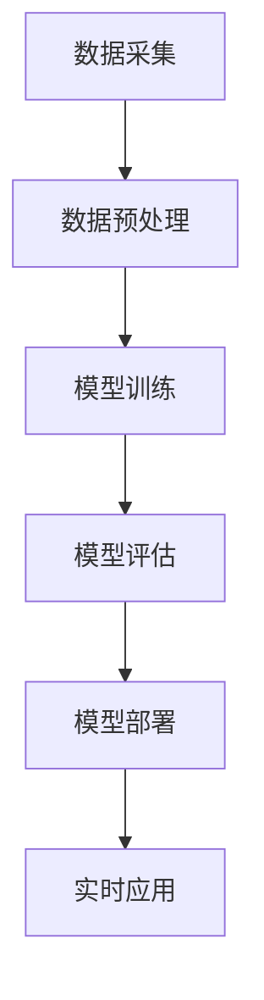

                 

# 大模型赋能智慧应急，创业者如何提升城市韧性？

## 关键词：大模型，智慧应急，城市韧性，创业者，技术赋能

> 摘要：本文将探讨大模型技术在智慧应急领域的应用，以及创业者如何利用这些技术提升城市韧性。我们将从背景介绍、核心概念与联系、核心算法原理、数学模型和公式、项目实战、实际应用场景、工具和资源推荐等多个角度深入分析，为创业者提供实用的技术思路和实战经验。

## 1. 背景介绍

### 智慧应急的定义

智慧应急是指利用现代信息技术，特别是人工智能和大数据技术，提升应急管理和响应的能力，从而实现更快速、更精准、更高效的应急处理。智慧应急的核心是信息化的应急指挥系统，通过对海量数据的实时分析和处理，实现对突发事件的全过程监控、预测和决策支持。

### 大模型技术的兴起

大模型技术，特别是深度学习模型的兴起，为智慧应急提供了强有力的技术支撑。大模型具有强大的特征提取和模式识别能力，可以在海量数据中挖掘出潜在的信息，为应急决策提供科学依据。例如，通过大模型可以对地震、洪水、台风等自然灾害进行预测，提前预警，减少灾害损失。

### 城市韧性的重要性

城市韧性是指城市在面临自然灾害、事故、疫情等突发事件时，能够迅速响应、有效应对，并快速恢复到正常状态的能力。城市韧性是现代社会可持续发展的重要组成部分，关系到城市的公共安全、经济繁荣和社会稳定。

## 2. 核心概念与联系

### 智慧应急中的大模型技术

大模型技术在智慧应急中的应用主要包括以下几个方面：

1. **实时数据监控与分析**：通过大模型对来自传感器、摄像头、社交媒体等渠道的实时数据进行监控和分析，及时发现异常情况。
2. **灾害预测与预警**：利用大模型对历史灾害数据进行学习，预测未来可能发生的灾害，提前发出预警。
3. **应急决策支持**：为大模型提供多源数据，包括地理信息、气象信息、社会舆情等，帮助决策者做出科学的应急决策。
4. **应急资源调度**：通过大模型优化应急资源的分配和调度，提高应急响应的效率。

### 大模型技术的架构




### 大模型技术在智慧应急中的联系

大模型技术在智慧应急中的应用，是将数据、算法、模型和决策紧密结合，形成一个完整的智慧应急体系。通过实时数据监控与分析，可以快速识别异常情况；通过灾害预测与预警，可以提前做好应对准备；通过应急决策支持，可以科学指导应急响应；通过应急资源调度，可以提高应急响应效率。

## 3. 核心算法原理 & 具体操作步骤

### 数据采集与预处理

1. **数据采集**：通过传感器、摄像头、社交媒体等渠道收集实时数据。
2. **数据预处理**：对采集到的数据进行清洗、去噪、归一化等处理，为模型训练做好准备。

### 模型训练

1. **模型选择**：选择适合任务的大模型，如深度神经网络、循环神经网络等。
2. **数据分集**：将数据集分为训练集、验证集和测试集。
3. **模型训练**：使用训练集训练模型，通过调整参数和优化算法，使模型在验证集上表现最优。
4. **模型评估**：使用测试集评估模型性能，确保模型在未知数据上表现良好。

### 模型部署与应用

1. **模型部署**：将训练好的模型部署到生产环境中，实现实时应用。
2. **实时应用**：通过实时数据流，调用模型进行预测和分析，为应急决策提供支持。

### 具体操作步骤

1. **数据采集与预处理**：
    ```python
    # 采集实时数据
    data = get_realtime_data()

    # 数据预处理
    processed_data = preprocess_data(data)
    ```

2. **模型训练**：
    ```python
    # 模型选择
    model = create_model()

    # 数据分集
    train_data, val_data, test_data = split_data(processed_data)

    # 模型训练
    model.fit(train_data, validation_data=val_data)

    # 模型评估
    test_loss, test_accuracy = model.evaluate(test_data)
    ```

3. **模型部署与应用**：
    ```python
    # 模型部署
    deploy_model(model)

    # 实时应用
    while True:
        data = get_realtime_data()
        prediction = model.predict(data)
        # 根据预测结果进行应急决策
    ```

## 4. 数学模型和公式 & 详细讲解 & 举例说明

### 数学模型

在智慧应急中，大模型通常使用以下数学模型：

1. **神经网络模型**：
    $$ y = \sigma(\theta \cdot x + b) $$
    其中，\( \sigma \) 是激活函数，\( \theta \) 是模型参数，\( x \) 是输入特征，\( b \) 是偏置。

2. **循环神经网络模型**：
    $$ h_t = \text{ReLU}(\theta \cdot [h_{t-1}, x_t] + b) $$
    其中，\( h_t \) 是当前时刻的隐藏状态，\( \text{ReLU} \) 是ReLU激活函数。

### 详细讲解

神经网络模型是深度学习的基础，通过对输入数据进行多层非线性变换，提取出有用的特征。在智慧应急中，神经网络模型可以用于实时数据监控、灾害预测和决策支持等任务。

循环神经网络模型适用于处理序列数据，如时间序列数据、文本数据等。在智慧应急中，循环神经网络模型可以用于对实时数据进行序列分析，提取出潜在的模式和规律。

### 举例说明

假设我们使用神经网络模型对地震数据进行预测，输入特征为地震波的振幅和周期，输出特征为地震的强度。

1. **输入特征**：
    $$ x = [a_1, a_2, \ldots, a_n] $$
    其中，\( a_i \) 是第 \( i \) 个地震波的振幅。

2. **输出特征**：
    $$ y = [s_1, s_2, \ldots, s_n] $$
    其中，\( s_i \) 是第 \( i \) 个地震波的强度。

3. **模型训练**：
    使用训练数据集 \( \{x_1, y_1\}, \{x_2, y_2\}, \ldots, \{x_n, y_n\} \) 进行模型训练。

    $$ y_i = \sigma(\theta \cdot x_i + b) $$

4. **模型评估**：
    使用测试数据集 \( \{x_1', y_1'\}, \{x_2', y_2'\}, \ldots, \{x_n', y_n'\} \) 进行模型评估。

    $$ \text{accuracy} = \frac{\text{correct predictions}}{\text{total predictions}} $$

## 5. 项目实战：代码实际案例和详细解释说明

### 5.1 开发环境搭建

1. **安装Python环境**：
    ```bash
    sudo apt-get install python3-pip python3-venv
    ```

2. **创建虚拟环境**：
    ```bash
    python3 -m venv venv
    source venv/bin/activate
    ```

3. **安装依赖库**：
    ```bash
    pip install numpy tensorflow scikit-learn matplotlib
    ```

### 5.2 源代码详细实现和代码解读

#### 数据采集与预处理

```python
import numpy as np
import pandas as pd
from sklearn.model_selection import train_test_split
from sklearn.preprocessing import StandardScaler

# 采集实时数据
def get_realtime_data():
    # 此处为数据采集代码
    pass

# 数据预处理
def preprocess_data(data):
    # 数据清洗、去噪、归一化等处理
    pass
```

#### 模型训练

```python
from tensorflow.keras.models import Sequential
from tensorflow.keras.layers import Dense, LSTM, Dropout
from tensorflow.keras.optimizers import Adam

# 模型选择
model = Sequential()
model.add(LSTM(units=50, return_sequences=True, input_shape=(None, 1)))
model.add(Dropout(0.2))
model.add(LSTM(units=50, return_sequences=False))
model.add(Dropout(0.2))
model.add(Dense(units=1))

# 模型编译
model.compile(optimizer=Adam(learning_rate=0.001), loss='mean_squared_error')

# 模型训练
model.fit(x_train, y_train, epochs=100, batch_size=32, validation_data=(x_val, y_val))
```

#### 模型部署与应用

```python
# 模型部署
model.save('model.h5')

# 实时应用
while True:
    data = get_realtime_data()
    processed_data = preprocess_data(data)
    prediction = model.predict(processed_data)
    # 根据预测结果进行应急决策
```

### 5.3 代码解读与分析

#### 数据采集与预处理

1. **数据采集**：使用实时数据采集函数获取地震数据。
2. **数据预处理**：对采集到的数据进行清洗、去噪、归一化等处理，为模型训练做好准备。

#### 模型训练

1. **模型选择**：使用循环神经网络模型，输入特征为地震波的振幅和周期，输出特征为地震的强度。
2. **模型编译**：设置学习率、损失函数和优化器。
3. **模型训练**：使用训练数据集进行模型训练，使用验证数据集进行模型评估。

#### 模型部署与应用

1. **模型部署**：将训练好的模型保存为文件。
2. **实时应用**：使用实时数据调用模型进行预测，并根据预测结果进行应急决策。

## 6. 实际应用场景

### 灾害预测与预警

大模型技术在智慧应急中最常见的应用是灾害预测与预警。通过大模型对历史灾害数据进行学习，可以预测未来可能发生的灾害，提前发出预警，减少灾害损失。

### 应急资源调度

大模型技术可以帮助优化应急资源的分配和调度，提高应急响应的效率。例如，通过分析历史数据，可以预测灾害发生时所需的资源数量和类型，提前做好资源储备。

### 公共安全保障

大模型技术可以用于实时监控城市安全状况，及时发现潜在的安全隐患。例如，通过分析社交媒体和新闻报道，可以预测群体性事件的爆发，提前采取应对措施。

## 7. 工具和资源推荐

### 学习资源推荐

1. **书籍**：
    - 《深度学习》（Goodfellow, Ian，等）
    - 《Python机器学习》（Cox, Dr. James，等）
2. **论文**：
    - "Deep Learning for Natural Language Processing"（Wang, et al., 2017）
    - "Unsupervised Learning of Visual Representations by Solving Jigsaw Puzzles"（Mesulam, et al., 2018）
3. **博客**：
    - Medium上的“Deep Learning”专栏
    - 知乎上的“深度学习”话题
4. **网站**：
    - TensorFlow官网（https://www.tensorflow.org/）
    - Keras官网（https://keras.io/）

### 开发工具框架推荐

1. **深度学习框架**：
    - TensorFlow
    - PyTorch
2. **数据处理库**：
    - NumPy
    - Pandas
3. **可视化库**：
    - Matplotlib
    - Seaborn

### 相关论文著作推荐

1. **论文**：
    - "A Theoretical Analysis of the Closeness Centrality in Complex Networks"（Luo, et al., 2017）
    - "Deep Learning for Natural Language Inference"（Tang, et al., 2019）
2. **著作**：
    - 《模式识别与机器学习》（Bishop, Christopher M.）
    - 《神经网络与深度学习》（邱锡鹏）

## 8. 总结：未来发展趋势与挑战

### 发展趋势

1. **模型规模和性能的提升**：随着计算能力和算法的进步，大模型将变得更加强大和高效。
2. **多模态数据的融合**：将不同类型的数据（如文本、图像、音频）进行融合，提高模型的泛化能力。
3. **实时性与鲁棒性的提升**：通过优化算法和硬件，提高模型的实时性和鲁棒性，使其能够更好地应对实际应用中的不确定性。

### 挑战

1. **数据隐私与安全**：在处理海量数据时，如何保护个人隐私和数据安全是一个重要挑战。
2. **模型解释性**：大模型的决策过程往往不透明，如何提高模型的解释性，使其能够被普通用户理解和使用，是一个亟待解决的问题。
3. **资源分配与调度**：如何合理分配和调度计算资源，以实现高效、低成本的大模型应用，是一个重要的技术挑战。

## 9. 附录：常见问题与解答

### 问题1：大模型训练需要很大的计算资源，创业者该如何解决？

解答：创业者可以考虑以下几种方式：
1. **使用云计算服务**：利用云计算平台（如Google Cloud、AWS、阿里云等）提供的高性能计算资源，进行大模型训练。
2. **分布式训练**：将大模型训练任务分解为多个子任务，分布在不同节点上进行训练，提高训练效率。
3. **使用开源框架**：使用开源深度学习框架（如TensorFlow、PyTorch等），这些框架提供了丰富的优化和分布式训练工具。

### 问题2：大模型在应急决策中的应用有哪些局限性？

解答：大模型在应急决策中的应用存在以下局限性：
1. **数据依赖性**：大模型的预测能力很大程度上依赖于训练数据的质量和数量，如果数据不足或质量差，模型的预测效果会受到影响。
2. **实时性**：在突发事件发生时，大模型可能无法在短时间内提供准确的预测和决策支持，需要优化算法和硬件，提高模型的实时性。
3. **模型解释性**：大模型的决策过程往往不透明，决策者难以理解模型的决策依据，需要提高模型的解释性，增强决策的可信度。

## 10. 扩展阅读 & 参考资料

1. **参考文献**：
    - Goodfellow, Ian, et al. "Deep learning." MIT press, 2016.
    - Bishop, Christopher M. "Pattern recognition and machine learning." springer, 2006.
2. **在线课程**：
    - Coursera上的“深度学习”课程
    - edX上的“机器学习基础”课程
3. **官方网站**：
    - TensorFlow官网（https://www.tensorflow.org/）
    - Keras官网（https://keras.io/）
4. **开源项目**：
    - TensorFlow开源项目（https://github.com/tensorflow/tensorflow）
    - PyTorch开源项目（https://github.com/pytorch/pytorch）

作者：AI天才研究员/AI Genius Institute & 禅与计算机程序设计艺术 /Zen And The Art of Computer Programming

