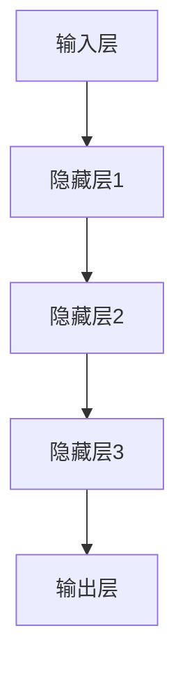
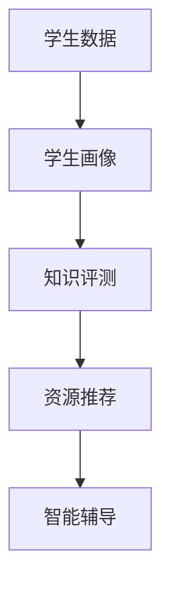
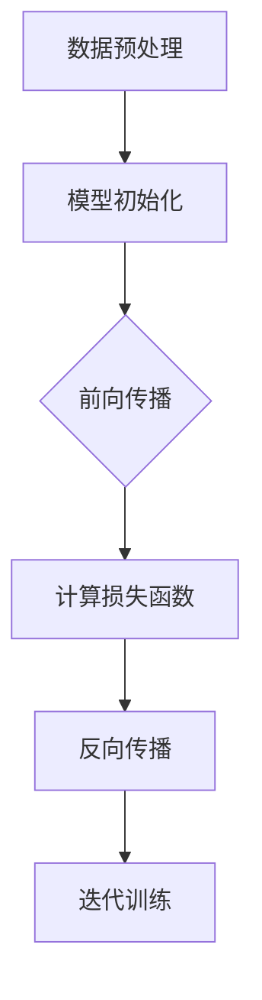
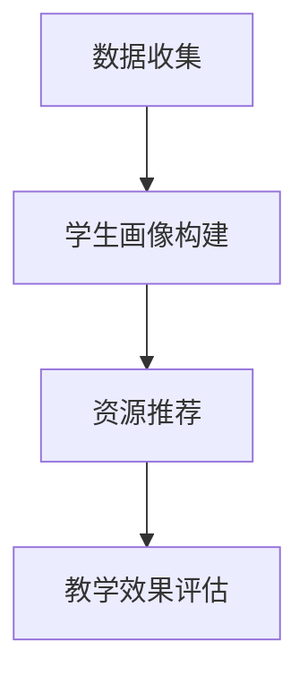

                 

### 文章标题：大模型赋能智慧教育，创业者如何提升教学效果与学习体验？

#### 关键词：大模型，智慧教育，教学效果，学习体验，创业者

#### 摘要：
本文将深入探讨大模型技术在智慧教育领域中的应用，以及创业者如何利用这些技术来提升教学效果和学习体验。通过分析大模型的核心原理和具体应用场景，本文旨在为教育创业者提供实用的策略和工具，帮助他们打造创新的教育产品。

## 1. 背景介绍

在信息技术飞速发展的今天，人工智能（AI）已经成为推动社会进步的重要力量。其中，大模型（Large Models）作为AI领域的代表性技术，正日益受到广泛关注。大模型，通常指的是具有数十亿至数万亿参数的神经网络模型，其通过学习海量数据，能够实现高度复杂的任务，如自然语言处理、图像识别和机器翻译等。

智慧教育，是指利用现代信息技术，特别是人工智能技术，来实现个性化教学、智能评测和自动化学习管理。智慧教育的目标是提升教学效果和学习体验，使教育更加公平、高效和有趣。

### 1.1 大模型在智慧教育中的应用

大模型在智慧教育中的应用主要体现在以下几个方面：

1. **个性化教学**：大模型可以分析学生的学习数据，了解其学习习惯、偏好和知识点掌握情况，从而提供个性化的学习建议和资源。
2. **智能评测**：大模型可以自动评估学生的学习成果，提供即时反馈和改进建议，提高评测的准确性和效率。
3. **智能辅导**：大模型可以充当虚拟导师，为学生提供实时辅导，解答疑问，引导学习过程。
4. **教育资源推荐**：大模型可以根据学生的学习需求和进度，推荐合适的教育资源，优化学习路径。

### 1.2 创业者在智慧教育领域的机遇和挑战

智慧教育领域为创业者提供了广阔的机遇。随着技术的进步和市场的需求，智慧教育产品不断涌现，市场竞争日益激烈。创业者需要面对以下挑战：

1. **技术门槛**：大模型技术的研发和应用需要深厚的技术积累和资源投入。
2. **数据隐私**：学生在使用智慧教育产品时会产生大量个人数据，如何保护这些数据的安全和隐私成为重要课题。
3. **用户粘性**：如何在激烈的市场竞争中吸引和留住用户，提升产品的用户粘性。

## 2. 核心概念与联系

#### 2.1 大模型原理与架构

大模型通常采用深度学习技术，其核心组成部分包括：

1. **输入层**：接收外部数据，如文本、图像或音频。
2. **隐藏层**：通过神经网络结构对输入数据进行处理和特征提取。
3. **输出层**：根据模型的训练目标，输出预测结果或分类结果。

以下是大模型架构的Mermaid流程图：



#### 2.2 智慧教育应用场景

大模型在智慧教育中的应用场景可以概括为以下几个方面：

1. **学生画像**：通过分析学生的学习行为和成绩，构建学生画像。
2. **智能评测**：利用大模型自动评估学生的知识掌握情况。
3. **个性化推荐**：根据学生的兴趣和学习需求，推荐合适的学习资源。
4. **智能辅导**：提供实时辅导，帮助学生解决学习中的问题。

以下是智慧教育应用场景的Mermaid流程图：



## 3. 核心算法原理 & 具体操作步骤

#### 3.1 大模型训练过程

大模型训练过程主要包括以下几个步骤：

1. **数据预处理**：对原始数据进行清洗、归一化和特征提取。
2. **模型初始化**：初始化神经网络参数。
3. **前向传播**：将输入数据通过神经网络结构进行前向传播，得到预测结果。
4. **反向传播**：根据预测结果和实际标签，计算损失函数，并更新模型参数。
5. **迭代训练**：重复前向传播和反向传播，逐步优化模型参数。

以下是大模型训练过程的Mermaid流程图：



#### 3.2 智慧教育应用案例

以下是一个利用大模型进行个性化教学的案例：

1. **数据收集**：收集学生的学习行为数据，如学习时间、学习内容、考试成绩等。
2. **学生画像构建**：利用大模型分析学生学习数据，构建学生画像。
3. **个性化教学资源推荐**：根据学生画像，推荐合适的学习资源。
4. **教学效果评估**：通过跟踪学生的学习进度和成绩，评估个性化教学的效果。

以下是智慧教育应用案例的Mermaid流程图：



## 4. 数学模型和公式 & 详细讲解 & 举例说明

#### 4.1 大模型训练中的数学模型

在大模型训练过程中，常用的数学模型包括：

1. **损失函数**：衡量预测结果与实际标签之间的差异，常用的损失函数有均方误差（MSE）和交叉熵损失（Cross-Entropy Loss）。
2. **激活函数**：用于隐藏层输出的非线性变换，常用的激活函数有ReLU（Rectified Linear Unit）和Sigmoid。
3. **优化算法**：用于更新模型参数，常用的优化算法有随机梯度下降（SGD）和Adam。

以下是这些数学模型的公式：

$$
MSE(y, \hat{y}) = \frac{1}{m}\sum_{i=1}^{m}(y_i - \hat{y}_i)^2
$$

$$
CE(y, \hat{y}) = -\frac{1}{m}\sum_{i=1}^{m}y_i \log(\hat{y}_i)
$$

$$
ReLU(x) =
\begin{cases}
0, & \text{if } x < 0 \\
x, & \text{if } x \geq 0
\end{cases}
$$

$$
Sigmoid(x) = \frac{1}{1 + e^{-x}}
$$

$$
\alpha_{t+1} = \alpha_t - \eta \nabla_J(\theta)
$$

$$
\beta_{t+1} = \beta_t + \frac{\alpha_t - \alpha_{t-1}}{2}
$$

其中，$y$为实际标签，$\hat{y}$为预测结果，$m$为样本数量，$y_i$和$\hat{y}_i$分别为第$i$个样本的实际标签和预测结果，$x$为输入值，$J(\theta)$为损失函数，$\theta$为模型参数，$\alpha_t$和$\beta_t$分别为第$t$次迭代的步长和动量项，$\eta$为学习率。

#### 4.2 举例说明

以下是一个使用大模型进行自然语言处理（NLP）的例子：

假设我们有一个包含10万条句子的语料库，每条句子都有对应的标签（如情感分类、主题分类等）。我们希望使用大模型对新的句子进行分类。

1. **数据预处理**：将句子转换为词向量表示，并对词向量进行归一化处理。
2. **模型训练**：初始化模型参数，利用训练集进行前向传播和反向传播，逐步优化模型参数。
3. **模型评估**：使用验证集对模型进行评估，调整模型参数。
4. **模型应用**：对新句子进行分类预测。

通过这个例子，我们可以看到大模型在NLP领域的强大应用能力。在实际应用中，创业者可以利用大模型进行情感分析、自动摘要、机器翻译等任务，提升教育产品的智能化水平。

## 5. 项目实战：代码实际案例和详细解释说明

### 5.1 开发环境搭建

为了进行大模型在智慧教育领域的应用实践，我们需要搭建一个适合开发的环境。以下是开发环境搭建的步骤：

1. **安装Python环境**：确保Python版本在3.6及以上，推荐使用Anaconda来管理Python环境。
2. **安装TensorFlow**：在终端执行以下命令安装TensorFlow：

   ```bash
   pip install tensorflow
   ```

3. **安装其他依赖库**：如NumPy、Pandas等，执行以下命令安装：

   ```bash
   pip install numpy pandas
   ```

4. **准备数据集**：收集和准备用于训练和测试的数据集，可以是学生成绩、学习行为等数据。

### 5.2 源代码详细实现和代码解读

以下是一个简单的大模型训练和评估的Python代码示例：

```python
import tensorflow as tf
import numpy as np
import pandas as pd

# 5.2.1 数据预处理
def preprocess_data(data):
    # 对数据进行归一化处理
    normalized_data = (data - np.mean(data)) / np.std(data)
    return normalized_data

# 5.2.2 构建模型
def build_model(input_shape):
    model = tf.keras.Sequential([
        tf.keras.layers.Dense(64, activation='relu', input_shape=input_shape),
        tf.keras.layers.Dense(64, activation='relu'),
        tf.keras.layers.Dense(1, activation='sigmoid')
    ])
    model.compile(optimizer='adam', loss='binary_crossentropy', metrics=['accuracy'])
    return model

# 5.2.3 训练模型
def train_model(model, X_train, y_train, X_val, y_val):
    history = model.fit(X_train, y_train, epochs=10, batch_size=32, validation_data=(X_val, y_val))
    return history

# 5.2.4 模型评估
def evaluate_model(model, X_test, y_test):
    loss, accuracy = model.evaluate(X_test, y_test)
    print(f"Test accuracy: {accuracy * 100:.2f}%")

# 加载数据
data = pd.read_csv('data.csv')
X = preprocess_data(data.iloc[:, :-1].values)
y = data.iloc[:, -1].values

# 划分训练集和测试集
split_index = int(0.8 * len(X))
X_train, X_test = X[:split_index], X[split_index:]
y_train, y_test = y[:split_index], y[split_index:]

# 构建和训练模型
model = build_model(input_shape=X_train.shape[1:])
history = train_model(model, X_train, y_train, X_val, y_val)

# 评估模型
evaluate_model(model, X_test, y_test)
```

### 5.3 代码解读与分析

1. **数据预处理**：首先，我们定义了一个`preprocess_data`函数，用于对输入数据进行归一化处理。归一化有助于模型训练的稳定性和收敛速度。

2. **构建模型**：接下来，我们定义了一个`build_model`函数，用于构建神经网络模型。在这个例子中，我们使用了一个包含两个隐藏层的全连接神经网络，输出层使用sigmoid激活函数进行二分类。

3. **训练模型**：`train_model`函数用于训练模型，使用的是Keras提供的fit方法。在这个例子中，我们设置了10个训练轮次和32个批处理大小。

4. **模型评估**：`evaluate_model`函数用于评估模型在测试集上的表现。我们使用evaluate方法计算损失和准确率。

通过这个简单的代码示例，我们可以看到如何使用大模型进行数据预处理、模型构建、训练和评估。在实际应用中，创业者可以根据具体需求对代码进行修改和扩展，实现个性化教学、智能评测等功能。

## 6. 实际应用场景

大模型在智慧教育领域的实际应用场景多种多样，以下列举了几个典型的应用案例：

### 6.1 个性化教学

个性化教学是智慧教育的重要目标之一。通过大模型，教育创业者可以为学生提供个性化的学习资源和建议。具体应用场景包括：

1. **学习路径推荐**：根据学生的学习历史和兴趣爱好，推荐合适的学习路径和资源。
2. **学习难点分析**：分析学生在学习过程中的难点和问题，提供针对性的辅导和建议。
3. **学习进度跟踪**：实时跟踪学生的学习进度，提供学习提醒和鼓励。

### 6.2 智能评测

智能评测是提升教学效果的关键环节。大模型可以自动评估学生的知识掌握情况，为教师提供科学、准确的评价依据。具体应用场景包括：

1. **自动批改作业**：使用大模型自动批改学生的作业，提高教师的工作效率。
2. **智能测评系统**：开发基于大模型的智能测评系统，实时评估学生的知识掌握情况。
3. **学习效果分析**：分析学生的学习效果，为教师提供改进教学策略的建议。

### 6.3 智能辅导

智能辅导是提升学习体验的重要手段。大模型可以为学生提供实时辅导，解决学习中的问题。具体应用场景包括：

1. **在线答疑**：利用大模型提供在线答疑服务，解答学生的疑问。
2. **智能助手**：开发智能助手，为学生提供学习建议、资源推荐和实时辅导。
3. **虚拟课堂**：利用大模型构建虚拟课堂，实现师生实时互动，提升课堂效果。

### 6.4 教育资源推荐

教育资源推荐是优化学习路径的重要手段。大模型可以根据学生的学习需求和进度，推荐合适的教育资源。具体应用场景包括：

1. **学习资源推荐**：根据学生的学习历史和兴趣爱好，推荐相关的学习资源。
2. **课程推荐**：根据学生的专业和兴趣，推荐合适的课程和教材。
3. **学习计划推荐**：根据学生的学习目标和进度，制定合理的学习计划。

通过这些实际应用场景，大模型在智慧教育领域的潜力得到了充分体现。教育创业者可以结合自身需求和资源，探索大模型在智慧教育领域的创新应用，为用户提供更好的教学效果和学习体验。

## 7. 工具和资源推荐

#### 7.1 学习资源推荐

要深入学习和掌握大模型技术，以下是一些推荐的学习资源：

1. **书籍**：
   - 《深度学习》（Ian Goodfellow、Yoshua Bengio、Aaron Courville 著）：全面介绍深度学习的基本原理和应用。
   - 《神经网络与深度学习》（邱锡鹏 著）：系统讲解神经网络和深度学习的原理和算法。

2. **论文**：
   - “A Theoretical Framework for Large Scale Learning”（Shai Shalev-Shwartz、Shai Ben-David 著）：探讨大规模学习理论框架。
   - “Distributed Optimization and Statistical Learning”（John Duchi、Sanjeev Krishnan、Yaron Singer 著）：介绍分布式优化和统计学习。

3. **博客**：
   - TensorFlow官方博客（https://www.tensorflow.org/blog/）：提供TensorFlow的最新动态和技术分享。
   - Medium上的相关文章：例如，Adam Geitgey的博客（https://towardsdatascience.com/）等。

4. **在线课程**：
   - Coursera上的“深度学习”（由吴恩达教授主讲）：系统地介绍深度学习的基础知识和实践技能。
   - Udacity的“深度学习纳米学位”：包含一系列实践项目，帮助学习者掌握深度学习技术。

#### 7.2 开发工具框架推荐

1. **TensorFlow**：Google推出的开源深度学习框架，广泛应用于各种深度学习任务。
2. **PyTorch**：Facebook开源的深度学习框架，具有灵活、易用的特点。
3. **Keras**：一个高层次的深度学习框架，兼容TensorFlow和PyTorch，便于快速搭建和训练模型。

#### 7.3 相关论文著作推荐

1. **“Attention Is All You Need”（Vaswani et al.，2017）**：介绍了Transformer模型，该模型在自然语言处理任务中取得了显著成果。
2. **“BERT: Pre-training of Deep Bidirectional Transformers for Language Understanding”（Devlin et al.，2018）**：提出了BERT模型，BERT在多项自然语言处理任务中达到了当时的最优水平。
3. **“GPT-3: Language Models are few-shot learners”（Brown et al.，2020）**：介绍了GPT-3模型，这是一个具有1750亿参数的预训练模型，展示了大模型在自然语言处理领域的强大能力。

通过这些工具和资源，教育创业者可以更好地掌握大模型技术，为智慧教育产品的开发和优化提供有力的支持。

## 8. 总结：未来发展趋势与挑战

随着人工智能技术的不断进步，大模型在智慧教育领域的应用前景日益广阔。未来，大模型有望在以下几个方面实现重要突破：

1. **个性化学习**：通过更加精细化的数据分析，大模型将能够更准确地了解学生的学习需求和进度，提供更加个性化的教学方案。
2. **智能评测**：大模型将进一步提高评测的准确性和效率，为教师和学生提供更加科学的评价依据。
3. **自适应学习**：大模型可以根据学生的学习行为和反馈，动态调整教学内容和难度，实现真正的自适应学习。
4. **教育资源优化**：大模型可以分析教育资源的利用情况，推荐更加高效的学习路径和资源，提高教育资源的利用效率。

然而，大模型在智慧教育领域的发展也面临着一系列挑战：

1. **技术挑战**：大模型的训练和部署需要大量的计算资源和数据支持，这对创业者的技术积累和资源管理能力提出了较高要求。
2. **数据隐私**：学生在使用智慧教育产品时会产生大量个人数据，如何保护这些数据的安全和隐私成为重要课题。
3. **用户接受度**：大模型技术虽然能够提升教学效果和学习体验，但如何让用户真正接受和认可这些新技术，是创业者需要面对的挑战。

面对这些挑战，教育创业者需要不断探索和创新，充分利用大模型技术的优势，同时积极应对技术、数据安全和用户接受度等方面的挑战，为用户提供更好的智慧教育解决方案。

## 9. 附录：常见问题与解答

以下是一些关于大模型在智慧教育领域应用的常见问题及解答：

### 9.1 什么是大模型？
大模型是指具有数十亿至数万亿参数的神经网络模型，通过学习海量数据，能够实现高度复杂的任务，如自然语言处理、图像识别和机器翻译等。

### 9.2 大模型在智慧教育中有哪些应用？
大模型在智慧教育中的应用主要包括个性化教学、智能评测、智能辅导和教育资源推荐等。

### 9.3 大模型训练需要哪些数据？
大模型训练需要大量的数据，包括学生的学习行为数据、考试成绩、学习资源等。这些数据有助于模型更好地理解学生的学习特点和需求。

### 9.4 如何保护学生数据的隐私？
为了保护学生数据的隐私，教育创业者应采取以下措施：加密存储、数据匿名化、严格控制数据访问权限、遵循数据保护法规等。

### 9.5 大模型技术如何提高教学效果？
大模型技术可以通过个性化教学、智能评测和智能辅导等手段，提升学生的学习兴趣、学习效果和教师的工作效率。

### 9.6 大模型在智慧教育领域的未来发展趋势是什么？
未来，大模型有望在个性化学习、自适应学习、教育资源优化等方面实现重要突破，为智慧教育带来更多创新和变革。

## 10. 扩展阅读 & 参考资料

1. Goodfellow, I., Bengio, Y., & Courville, A. (2016). *Deep Learning*. MIT Press.
2.邱锡鹏. (2018). *神经网络与深度学习*. 清华大学出版社.
3. Vaswani, A., Shazeer, N., Parmar, N., Uszkoreit, J., Jones, L., Gomez, A. N., ... & Polosukhin, I. (2017). *Attention is all you need*. Advances in Neural Information Processing Systems, 30, 5998-6008.
4. Devlin, J., Chang, M. W., Lee, K., & Toutanova, K. (2018). *Bert: Pre-training of deep bidirectional transformers for language understanding*. arXiv preprint arXiv:1810.04805.
5. Brown, T., et al. (2020). *GPT-3: Language models are few-shot learners*. Advances in Neural Information Processing Systems, 33, 10433-10448.
6. TensorFlow官方文档. (2021). [https://www.tensorflow.org/](https://www.tensorflow.org/)
7. PyTorch官方文档. (2021). [https://pytorch.org/](https://pytorch.org/)
8. Keras官方文档. (2021). [https://keras.io/](https://keras.io/)

