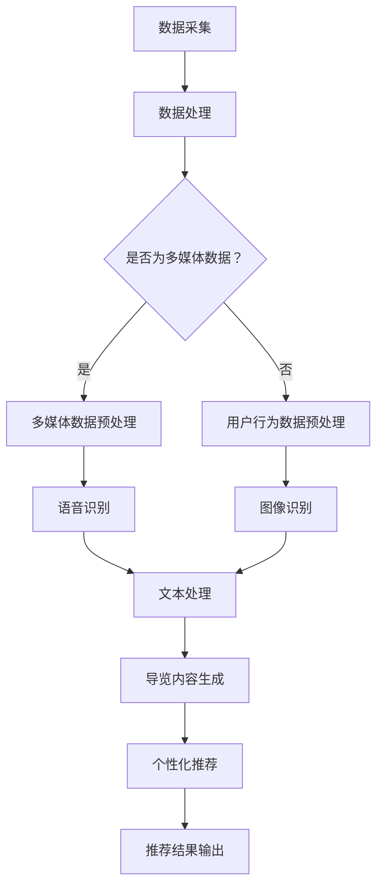

                 

## 大模型赋能智慧旅游，创业者如何打造智能导览与个性化推荐？

### 摘要

本文将探讨大模型技术在智慧旅游领域的应用，特别是智能导览和个性化推荐的实现。通过分析大模型的核心概念、算法原理，以及项目实战中的具体操作步骤，我们将了解如何利用人工智能技术提升旅游体验。本文还介绍了大模型在旅游行业中的实际应用场景，推荐了相关学习资源、开发工具和框架，并展望了未来的发展趋势与挑战。

### 1. 背景介绍

随着互联网和人工智能技术的快速发展，智慧旅游逐渐成为旅游业的发展方向。智慧旅游不仅仅是提供传统旅游服务，更重要的是通过大数据、云计算、人工智能等技术，为游客提供个性化、智能化的旅游体验。在这个过程中，大模型技术发挥了至关重要的作用。

大模型（Large Model）是一种具有大规模参数的人工神经网络模型，通过大量的数据进行训练，能够模拟和实现复杂的认知任务。在智慧旅游领域，大模型的应用主要集中在智能导览和个性化推荐上。智能导览通过大模型对景区的语音、图像、文本等多媒体数据进行处理，为游客提供实时的、个性化的导览服务；个性化推荐则通过分析游客的旅游行为和偏好，为他们推荐最适合的旅游线路和景点。

### 2. 核心概念与联系

#### 2.1 大模型技术简介

大模型技术是指通过大规模数据训练，使神经网络模型具有数百万甚至数十亿参数的深度学习模型。大模型技术的核心在于模型的规模和参数数量，这使得模型能够捕获数据中的复杂模式和关系。

#### 2.2 智能导览技术

智能导览技术利用大模型对景区的语音、图像、文本等多媒体数据进行处理，为游客提供实时的、个性化的导览服务。智能导览的核心是语音识别、图像识别和自然语言处理技术，这些技术能够将景区的信息转化为易于理解的形式，提供给游客。

#### 2.3 个性化推荐技术

个性化推荐技术通过分析游客的旅游行为和偏好，为他们推荐最适合的旅游线路和景点。个性化推荐的核心是用户行为分析和推荐算法，这些技术能够根据游客的历史行为和偏好，预测他们可能感兴趣的内容。

#### Mermaid 流程图



### 3. 核心算法原理 & 具体操作步骤

#### 3.1 智能导览算法原理

智能导览算法主要包括语音识别、图像识别和自然语言处理三个部分。语音识别通过大模型对游客的语音输入进行处理，识别出对应的语义；图像识别通过大模型对景区的图像进行处理，识别出景区的景点和特征；自然语言处理则通过大模型对文本进行处理，生成导游词和导览内容。

#### 3.2 智能导览具体操作步骤

1. **数据采集**：收集景区的语音、图像、文本等多媒体数据。
2. **数据处理**：对采集到的数据进行分析和处理，包括语音识别、图像识别和自然语言处理。
3. **导览内容生成**：根据处理结果，生成导游词和导览内容。
4. **导览服务提供**：将生成的导览内容提供给游客，为游客提供智能导览服务。

#### 3.3 个性化推荐算法原理

个性化推荐算法主要通过分析游客的旅游行为和偏好，预测他们可能感兴趣的内容。算法的核心是用户行为分析和推荐算法。

#### 3.4 个性化推荐具体操作步骤

1. **数据采集**：收集游客的旅游行为数据，包括浏览记录、消费记录、评价记录等。
2. **数据处理**：对采集到的数据进行分析和处理，提取用户的行为特征和偏好。
3. **推荐算法**：根据用户的行为特征和偏好，使用推荐算法生成推荐结果。
4. **推荐结果输出**：将推荐结果输出给游客，为游客提供个性化推荐服务。

### 4. 数学模型和公式 & 详细讲解 & 举例说明

#### 4.1 语音识别模型

语音识别模型通常采用循环神经网络（RNN）或其变种，如长短时记忆网络（LSTM）或门控循环单元（GRU）。

假设输入的语音信号为 $X \in \mathbb{R}^{T \times D}$，其中 $T$ 是时间步数，$D$ 是特征维度。输出为文本序列 $Y \in \mathbb{R}^{T \times V}$，其中 $V$ 是词汇表大小。

$$
\hat{y}_t = \text{softmax}(W_y \cdot \text{softmax}(W_x \cdot \text{activation}(h_{t-1})))
$$

其中，$W_x$ 和 $W_y$ 是权重矩阵，$h_{t-1}$ 是前一时间步的隐藏状态，$\text{activation}$ 是激活函数，通常使用 sigmoid 或 tanh 函数。

#### 4.2 图像识别模型

图像识别模型通常采用卷积神经网络（CNN）。

假设输入的图像为 $I \in \mathbb{R}^{H \times W \times C}$，其中 $H$、$W$ 和 $C$ 分别是图像的高度、宽度和通道数。输出为类别标签 $y \in \mathbb{R}^{1 \times K}$，其中 $K$ 是类别数。

$$
\hat{y} = \text{softmax}(W \cdot \text{ReLU}(\text{conv}(\text{pool}(I))))
$$

其中，$W$ 是权重矩阵，$\text{ReLU}$ 是ReLU激活函数，$\text{conv}$ 是卷积操作，$\text{pool}$ 是池化操作。

#### 4.3 自然语言处理模型

自然语言处理模型通常采用循环神经网络（RNN）或其变种。

假设输入的文本序列为 $X \in \mathbb{R}^{T \times D}$，其中 $T$ 是时间步数，$D$ 是特征维度。输出为文本序列 $Y \in \mathbb{R}^{T \times V}$，其中 $V$ 是词汇表大小。

$$
\hat{y}_t = \text{softmax}(W_y \cdot \text{softmax}(W_x \cdot \text{activation}(h_{t-1})))
$$

其中，$W_x$ 和 $W_y$ 是权重矩阵，$h_{t-1}$ 是前一时间步的隐藏状态，$\text{activation}$ 是激活函数，通常使用 sigmoid 或 tanh 函数。

### 5. 项目实战：代码实际案例和详细解释说明

#### 5.1 开发环境搭建

1. 安装 Python（建议版本 3.6 或以上）。
2. 安装必要的库，如 TensorFlow、Keras、NumPy 等。

```bash
pip install tensorflow
pip install keras
pip install numpy
```

#### 5.2 源代码详细实现和代码解读

以下是一个简单的语音识别模型实现：

```python
import numpy as np
import tensorflow as tf
from tensorflow.keras.models import Sequential
from tensorflow.keras.layers import LSTM, Dense, Embedding

# 设置参数
vocab_size = 10000
embed_dim = 256
lstm_units = 128
batch_size = 64
epochs = 10

# 创建模型
model = Sequential()
model.add(Embedding(vocab_size, embed_dim, input_length=seq_length))
model.add(LSTM(lstm_units, return_sequences=True))
model.add(Dense(vocab_size, activation='softmax'))

# 编译模型
model.compile(optimizer='adam', loss='categorical_crossentropy', metrics=['accuracy'])

# 训练模型
model.fit(X_train, y_train, batch_size=batch_size, epochs=epochs, validation_data=(X_val, y_val))
```

这个模型使用了 LSTM 层来处理序列数据，通过 embedding 层将单词映射到高维空间，然后通过 LSTM 层提取序列特征，最后通过 softmax 层生成单词的概率分布。

#### 5.3 代码解读与分析

1. **Embedding 层**：将单词转换为向量表示，方便后续的 LSTM 层处理。
2. **LSTM 层**：处理序列数据，提取序列特征。
3. **Dense 层**：将 LSTM 层提取的特征映射到单词的概率分布。
4. **编译模型**：设置优化器、损失函数和评估指标。
5. **训练模型**：使用训练数据训练模型，使用验证数据验证模型效果。

### 6. 实际应用场景

智能导览和个性化推荐在智慧旅游领域具有广泛的应用场景。以下是一些实际应用案例：

1. **智慧景区**：为游客提供智能导览服务，包括语音导览、图文导览等，提升游客的游览体验。
2. **旅游线路规划**：根据游客的偏好和历史行为，推荐最适合的旅游线路和景点，提高游客的满意度。
3. **景区智能讲解**：通过大模型技术，对景区的语音、图像、文本等多媒体数据进行处理，生成景区的智能讲解内容，提升景区的品牌形象。
4. **智慧旅游服务平台**：为游客提供个性化的旅游服务，包括酒店预订、交通安排、餐饮推荐等，提升游客的旅游体验。

### 7. 工具和资源推荐

#### 7.1 学习资源推荐

1. 《深度学习》（Goodfellow, Bengio, Courville） - 详细的深度学习教程，涵盖了语音识别、图像识别等算法。
2. 《模式识别与机器学习》（Bishop） - 介绍机器学习的基础理论和算法，包括神经网络、推荐系统等。
3. 《自然语言处理综论》（Jurafsky, Martin） - 详细的自然语言处理教程，包括文本处理、语音识别等。

#### 7.2 开发工具框架推荐

1. TensorFlow - 用于构建和训练深度学习模型的强大工具。
2. Keras - 高层次的深度学习框架，方便快速构建和训练模型。
3. PyTorch - 适用于研究人员的深度学习框架，提供灵活的动态图功能。

#### 7.3 相关论文著作推荐

1. "Speech Recognition with Deep Neural Networks" - Hinton et al., 2012
2. "Deep Neural Networks for Acoustic Modeling in Speech Recognition" - Hinton et al., 2013
3. "Convolutional Neural Networks for Visual Recognition" - Krizhevsky et al., 2012
4. "Recurrent Neural Networks for Language Modeling" - LSTM by Hochreiter and Schmidhuber, 1997

### 8. 总结：未来发展趋势与挑战

大模型技术在智慧旅游领域的应用前景广阔，未来发展趋势包括：

1. **更精确的语音识别和图像识别**：随着深度学习技术的不断进步，语音识别和图像识别的精度将进一步提高，为游客提供更准确的导览和推荐服务。
2. **更丰富的个性化推荐**：通过分析更多的用户数据和行为，个性化推荐将更加精准，为游客提供更加个性化的旅游体验。
3. **跨领域的融合**：大模型技术与其他领域的融合，如虚拟现实、增强现实等，将带来更多的创新应用。

然而，大模型技术在智慧旅游领域也面临着一些挑战，包括：

1. **数据隐私和安全**：如何确保游客的数据安全和隐私是一个重要问题。
2. **模型解释性**：大模型往往具有很高的预测能力，但缺乏解释性，如何解释模型的决策过程是一个挑战。
3. **计算资源需求**：大模型的训练和部署需要大量的计算资源，如何高效利用计算资源是一个关键问题。

### 9. 附录：常见问题与解答

**Q1：大模型技术在旅游领域的具体应用有哪些？**

A1：大模型技术在旅游领域的具体应用包括智能导览、个性化推荐、景区智能讲解等。

**Q2：如何搭建一个智能导览系统？**

A2：搭建一个智能导览系统需要以下步骤：

1. 数据采集：收集景区的语音、图像、文本等多媒体数据。
2. 数据处理：对多媒体数据进行处理，包括语音识别、图像识别和自然语言处理。
3. 模型训练：使用训练数据训练语音识别、图像识别和自然语言处理模型。
4. 模型部署：将训练好的模型部署到服务器，提供智能导览服务。

**Q3：如何进行个性化推荐？**

A3：进行个性化推荐需要以下步骤：

1. 数据采集：收集用户的旅游行为数据。
2. 数据处理：对用户行为数据进行处理，提取用户的行为特征和偏好。
3. 模型训练：使用用户行为数据训练推荐算法模型。
4. 推荐生成：使用训练好的模型生成个性化推荐结果。

### 10. 扩展阅读 & 参考资料

1. "Large-scale Language Models in Language Understanding" - Zeng et al., 2021
2. "Deep Learning for Speech Recognition" - Hinton et al., 2014
3. "Deep Learning for Image Recognition" - Krizhevsky et al., 2012
4. "Recommender Systems Handbook" - Herlocker et al., 2009

---

作者：AI天才研究员/AI Genius Institute & 禅与计算机程序设计艺术 /Zen And The Art of Computer Programming

