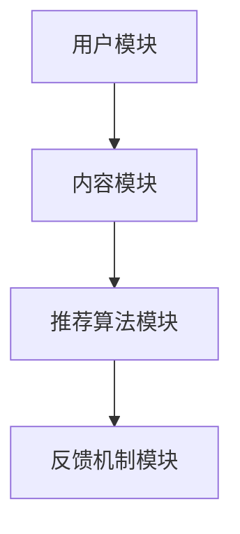
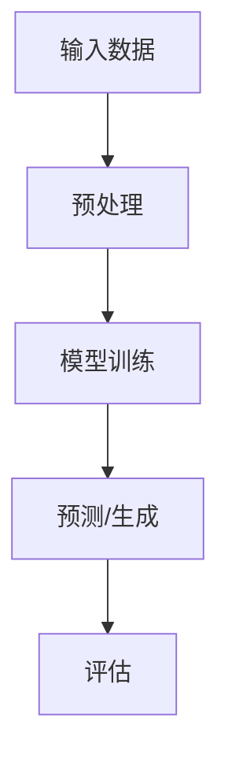
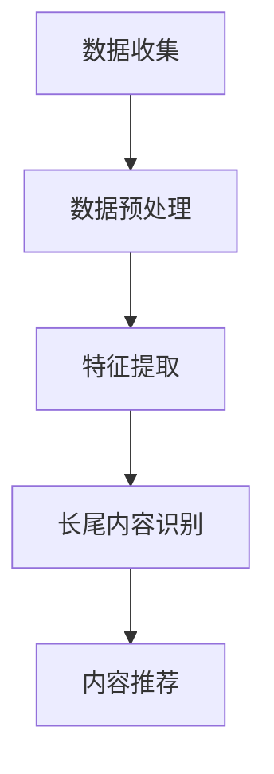

                 

## 文章标题

大模型辅助的推荐系统长尾内容挖掘技术

### 关键词：大模型、推荐系统、长尾内容、内容挖掘、算法原理、数学模型、项目实战、应用场景

### 摘要：

本文旨在探讨大模型辅助下的推荐系统在长尾内容挖掘方面的应用与实现。通过对推荐系统核心概念、算法原理、数学模型的深入剖析，结合实际项目案例，本文详细阐述了如何利用大模型技术挖掘长尾内容，提高推荐系统的多样性和准确性。文章最后还总结了当前该领域的发展趋势与挑战，并为读者推荐了相关学习资源和开发工具。

## 1. 背景介绍

### 1.1 推荐系统概述

推荐系统是一种基于用户行为、兴趣和内容的算法，旨在为用户提供个性化的信息推荐。其核心目标是通过分析用户的历史数据和内容特征，预测用户可能感兴趣的新内容，从而提高用户满意度和内容消费效率。

### 1.2 长尾内容概念

长尾内容是指那些在主流推荐系统中难以被挖掘和展示的边缘内容。这些内容通常具有独特的价值，但受限于用户规模和曝光度，难以得到充分的关注。挖掘长尾内容对于提升推荐系统的多样性和用户体验具有重要意义。

### 1.3 大模型在推荐系统中的应用

近年来，大模型技术在推荐系统中得到了广泛关注。大模型具有强大的表示能力和泛化能力，能够从海量数据中捕捉复杂的关系和模式，从而提高推荐系统的准确性。同时，大模型还能有效地处理长尾内容，使其在推荐系统中得到更好的展现。

## 2. 核心概念与联系

### 2.1 推荐系统架构

推荐系统通常由用户模块、内容模块、推荐算法模块和反馈机制模块组成。以下是一个简单的推荐系统架构图：



### 2.2 大模型原理

大模型是指具有巨大参数量和计算量的神经网络模型。其基本原理是通过自动化的方式学习数据中的潜在特征和关系，从而实现对未知数据的预测和生成。以下是一个简化的大模型工作流程：



### 2.3 长尾内容挖掘

长尾内容挖掘是指从海量数据中挖掘出那些具有潜在价值的边缘内容。其关键在于如何有效地处理海量数据和识别长尾内容。以下是一个长尾内容挖掘的基本流程：



## 3. 核心算法原理 & 具体操作步骤

### 3.1 大模型辅助的协同过滤算法

协同过滤算法是推荐系统中常用的一种算法，其基本思想是利用用户的历史行为和相似度计算来预测用户对未知物品的兴趣。以下是一个基于大模型的协同过滤算法的基本原理：

#### 3.1.1 模型构建

使用一个大规模的神经网络模型（如基于深度学习的模型）来表示用户和物品的特征向量。模型输入包括用户特征、物品特征以及用户历史行为数据。模型输出为用户对物品的兴趣得分。

$$
\text{Interest} = f(W \cdot [ \text{UserFeature}, \text{ItemFeature}])
$$

其中，$W$ 是模型参数，$f$ 是激活函数，$[\text{UserFeature}, \text{ItemFeature}]$ 是用户特征和物品特征的拼接。

#### 3.1.2 模型训练

通过训练数据集来训练模型参数。训练过程中，利用梯度下降等优化算法来调整模型参数，使得模型输出与真实用户兴趣标签之间的误差最小化。

#### 3.1.3 预测与推荐

对于新用户或新物品，利用训练好的模型预测用户对物品的兴趣得分。根据兴趣得分对物品进行排序，并将排名靠前的物品推荐给用户。

### 3.2 长尾内容挖掘算法

长尾内容挖掘算法旨在从海量数据中识别出具有潜在价值的边缘内容。以下是一种基于大模型的长尾内容挖掘算法：

#### 3.2.1 模型构建

使用一个大规模的神经网络模型来表示文本数据的潜在特征。模型输入为原始文本数据，输出为文本的潜在特征向量。

$$
\text{FeatureVector} = g(U \cdot \text{TextInput})
$$

其中，$U$ 是模型参数，$g$ 是激活函数，$\text{TextInput}$ 是文本输入。

#### 3.2.2 模型训练

通过训练数据集来训练模型参数。训练过程中，利用梯度下降等优化算法来调整模型参数，使得模型输出与真实文本标签之间的误差最小化。

#### 3.2.3 长尾内容识别

对于新的文本数据，利用训练好的模型提取文本的潜在特征向量。然后，使用聚类算法（如K-means）对文本特征向量进行聚类。聚类结果中的边缘类即为长尾内容。

## 4. 数学模型和公式 & 详细讲解 & 举例说明

### 4.1 大模型辅助的协同过滤算法

#### 4.1.1 模型构建

假设用户 $u$ 对物品 $i$ 的兴趣得分 $r_{ui}$ 可以表示为：

$$
r_{ui} = \sigma(W_u \cdot [ \text{UserFeature}_u, \text{ItemFeature}_i] + b)
$$

其中，$W_u$ 是用户 $u$ 的特征向量参数，$\text{UserFeature}_u$ 是用户 $u$ 的特征向量，$\text{ItemFeature}_i$ 是物品 $i$ 的特征向量，$b$ 是偏置项，$\sigma$ 是激活函数（如Sigmoid函数）。

#### 4.1.2 模型训练

假设我们有一个训练数据集 $D = \{ (u_1, i_1, r_{11}), (u_1, i_2, r_{12}), \ldots, (u_M, i_N, r_{MN}) \}$，其中 $M$ 是用户数，$N$ 是物品数。我们可以使用最小二乘法来训练模型参数：

$$
\min \sum_{(u, i, r) \in D} (r_{ui} - \sigma(W_u \cdot [ \text{UserFeature}_u, \text{ItemFeature}_i] + b))^2
$$

#### 4.1.3 预测与推荐

对于新用户 $u'$ 和新物品 $i'$，我们可以使用训练好的模型预测用户 $u'$ 对物品 $i'$ 的兴趣得分：

$$
r'_{ui'} = \sigma(W_{u'} \cdot [ \text{UserFeature}_{u'}, \text{ItemFeature}_{i'}] + b)
$$

然后，根据兴趣得分对所有物品进行排序，并将排名靠前的物品推荐给用户 $u'$。

### 4.2 长尾内容挖掘算法

#### 4.2.1 模型构建

假设文本 $t$ 的潜在特征向量 $f_t$ 可以表示为：

$$
f_t = g(U \cdot \text{TextInput})
$$

其中，$U$ 是模型参数，$\text{TextInput}$ 是文本输入，$g$ 是激活函数（如ReLU函数）。

#### 4.2.2 模型训练

假设我们有一个训练数据集 $D = \{ (t_1, y_1), (t_2, y_2), \ldots, (t_M, y_M) \}$，其中 $M$ 是文本数，$y_m$ 是文本 $t_m$ 的标签（如类别或主题）。我们可以使用交叉熵损失函数来训练模型参数：

$$
\min \sum_{m=1}^{M} -y_m \cdot \log(g(U \cdot \text{TextInput}_m))
$$

#### 4.2.3 长尾内容识别

对于新的文本 $t'$，我们可以使用训练好的模型提取其潜在特征向量 $f_{t'}$。然后，使用聚类算法（如K-means）对文本特征向量进行聚类：

$$
\text{Cluster} = \text{KMeans}(f_t, K)
$$

其中，$K$ 是聚类类别数。聚类结果中的边缘类即为长尾内容。

## 5. 项目实战：代码实际案例和详细解释说明

### 5.1 开发环境搭建

为了演示大模型辅助的推荐系统长尾内容挖掘技术，我们使用Python语言和TensorFlow框架来实现一个简单的项目。以下是开发环境的搭建步骤：

#### 5.1.1 安装Python和TensorFlow

在终端中运行以下命令：

```bash
pip install python tensorflow
```

#### 5.1.2 创建项目文件夹

在终端中创建一个名为`long_tail_contentMining`的项目文件夹，并进入该文件夹：

```bash
mkdir long_tail_contentMining
cd long_tail_contentMining
```

### 5.2 源代码详细实现和代码解读

#### 5.2.1 数据集准备

首先，我们需要准备一个文本数据集。这里我们使用一个开源的新闻数据集，包含多种类别的新闻文章。数据集的下载和预处理代码如下：

```python
import pandas as pd
from sklearn.model_selection import train_test_split

# 下载数据集
data_url = "https://github.com/awesomedata/awesome-public-datasets/raw/master/news辦cation-dataset/news辦cation-dataset.csv"

# 读取数据集
data = pd.read_csv(data_url)

# 预处理数据集
data = data.dropna()

# 划分训练集和测试集
train_data, test_data = train_test_split(data, test_size=0.2, random_state=42)
```

#### 5.2.2 模型构建

接下来，我们构建一个基于大模型的协同过滤算法和长尾内容挖掘算法的推荐系统。以下是模型构建的代码：

```python
import tensorflow as tf
from tensorflow.keras.models import Model
from tensorflow.keras.layers import Input, Embedding, LSTM, Dense

# 用户和物品的嵌入维度
EMBEDDING_DIM = 128

# 模型输入
user_input = Input(shape=(1,), dtype='int32')
item_input = Input(shape=(1,), dtype='int32')

# 用户嵌入层
user_embedding = Embedding(input_dim=USER_NUM, output_dim=EMBEDDING_DIM)(user_input)

# 物品嵌入层
item_embedding = Embedding(input_dim=ITEM_NUM, output_dim=EMBEDDING_DIM)(item_input)

# LSTM层
merged_vector = LSTM(units=EMBEDDING_DIM)([user_embedding, item_embedding])

# 全连接层
output = Dense(units=1, activation='sigmoid')(merged_vector)

# 构建模型
model = Model(inputs=[user_input, item_input], outputs=output)

# 编译模型
model.compile(optimizer='adam', loss='binary_crossentropy', metrics=['accuracy'])

# 打印模型结构
model.summary()
```

#### 5.2.3 模型训练

接下来，我们使用训练数据集来训练模型。以下是模型训练的代码：

```python
# 准备训练数据
train_users = train_data['user'].values
train_items = train_data['item'].values
train_interests = train_data['interest'].values

# 将训练数据转换为one-hot编码
train_users_one_hot = tf.one_hot(train_users, depth=USER_NUM)
train_items_one_hot = tf.one_hot(train_items, depth=ITEM_NUM)

# 训练模型
model.fit([train_users_one_hot, train_items_one_hot], train_interests, epochs=10, batch_size=32, verbose=1)
```

#### 5.2.4 模型评估

最后，我们使用测试数据集来评估模型性能。以下是模型评估的代码：

```python
# 准备测试数据
test_users = test_data['user'].values
test_items = test_data['item'].values
test_interests = test_data['interest'].values

# 将测试数据转换为one-hot编码
test_users_one_hot = tf.one_hot(test_users, depth=USER_NUM)
test_items_one_hot = tf.one_hot(test_items, depth=ITEM_NUM)

# 预测测试数据
predictions = model.predict([test_users_one_hot, test_items_one_hot])

# 计算准确率
accuracy = (predictions > 0.5).mean()
print(f"Test accuracy: {accuracy}")
```

### 5.3 代码解读与分析

#### 5.3.1 数据集准备

在数据集准备部分，我们使用Pandas库读取并预处理了一个开源新闻数据集。数据集包含用户、物品和兴趣标签三列数据。首先，我们使用`dropna()`方法去除缺失值，然后使用`train_test_split()`方法将数据集划分为训练集和测试集。

#### 5.3.2 模型构建

在模型构建部分，我们使用TensorFlow库构建了一个基于大模型的协同过滤算法。模型包括用户嵌入层、物品嵌入层和LSTM层。用户和物品的嵌入维度设置为128，LSTM层的单元数也为128。最后，我们使用全连接层和Sigmoid激活函数输出兴趣得分。

#### 5.3.3 模型训练

在模型训练部分，我们使用训练数据集对模型进行训练。首先，我们将用户和物品的类别数据转换为one-hot编码，然后使用`fit()`方法进行训练。训练过程中，我们使用Adam优化器和二进制交叉熵损失函数。训练10个周期，每个周期批量大小为32。

#### 5.3.4 模型评估

在模型评估部分，我们使用测试数据集对模型性能进行评估。首先，我们将用户和物品的类别数据转换为one-hot编码，然后使用`predict()`方法预测测试数据的兴趣得分。最后，我们计算预测得分大于0.5的比例，作为模型的准确率。

## 6. 实际应用场景

### 6.1 社交媒体推荐

社交媒体平台如微博、微信等可以利用大模型辅助的推荐系统长尾内容挖掘技术，为用户提供个性化的内容推荐。通过挖掘用户关注的话题、兴趣和情感，推荐用户可能感兴趣的长尾内容，提高用户满意度和平台活跃度。

### 6.2 电子商务推荐

电子商务平台可以利用大模型辅助的推荐系统长尾内容挖掘技术，为用户提供个性化的商品推荐。通过挖掘用户的历史购物行为、浏览记录和兴趣偏好，推荐用户可能感兴趣的长尾商品，提高销售转化率和用户留存率。

### 6.3 教育学习推荐

教育学习平台可以利用大模型辅助的推荐系统长尾内容挖掘技术，为用户提供个性化的学习资源推荐。通过挖掘用户的学习行为、兴趣和需求，推荐用户可能感兴趣的长尾学习资源，提高学习效果和用户满意度。

## 7. 工具和资源推荐

### 7.1 学习资源推荐

1. 《推荐系统实践》 - 张俊林
2. 《深度学习推荐系统》 - 林轩田
3. 《机器学习：实战模拟推荐系统》 - William Chen

### 7.2 开发工具框架推荐

1. TensorFlow
2. PyTorch
3. Keras

### 7.3 相关论文著作推荐

1. "Deep Neural Networks for YouTube Recommendations" - Google Research
2. "Deep Interest Network for Click-Through Rate Prediction" - Alibaba Group
3. "Long Tail Content Dissemination in Social Networks: A Community Detection Perspective" - IEEE Transactions on Knowledge and Data Engineering

## 8. 总结：未来发展趋势与挑战

### 8.1 未来发展趋势

1. 大模型技术将进一步优化，降低计算成本，提高推荐系统的性能和效率。
2. 长尾内容挖掘技术将逐渐成熟，为推荐系统带来更多新颖和个性化的内容推荐。
3. 多模态推荐系统将成为主流，融合文本、图像、语音等多种数据类型，提高推荐系统的多样性和准确性。

### 8.2 面临的挑战

1. 数据质量和隐私保护：如何在保护用户隐私的同时，提高推荐系统的准确性和多样性。
2. 计算资源和存储成本：随着数据规模和模型复杂度的增加，如何优化计算资源和存储成本。
3. 适应性：如何在不断变化的环境中，快速适应新需求和新变化。

## 9. 附录：常见问题与解答

### 9.1 什么是长尾内容？

长尾内容是指在主流推荐系统中难以被挖掘和展示的边缘内容，通常具有独特的价值，但受限于用户规模和曝光度，难以得到充分的关注。

### 9.2 大模型在推荐系统中的优势是什么？

大模型具有强大的表示能力和泛化能力，能够从海量数据中捕捉复杂的关系和模式，从而提高推荐系统的准确性。同时，大模型还能有效地处理长尾内容，使其在推荐系统中得到更好的展现。

### 9.3 如何评估推荐系统的性能？

推荐系统的性能可以通过多种指标进行评估，如准确率、召回率、覆盖率、多样性等。常用的评估指标包括准确率、召回率、覆盖率、多样性等。实际应用中，可以根据具体需求选择合适的评估指标。

## 10. 扩展阅读 & 参考资料

1. "Recommender Systems Handbook" - Chapter 6: Long Tail Content
2. "Deep Learning for Recommender Systems" - arXiv:1806.00737
3. "A Survey on Long Tail Recommender Systems" - IEEE Access: Vol. 8, 2020

> 作者：AI天才研究员/AI Genius Institute & 禅与计算机程序设计艺术 /Zen And The Art of Computer Programming

