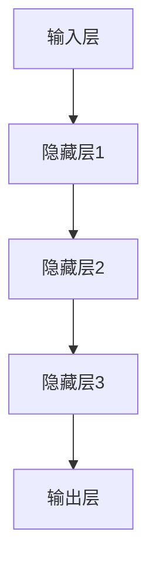
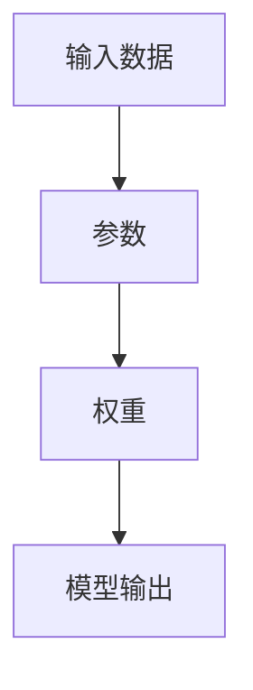
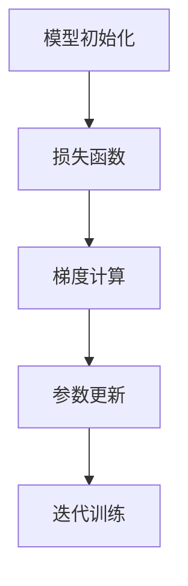
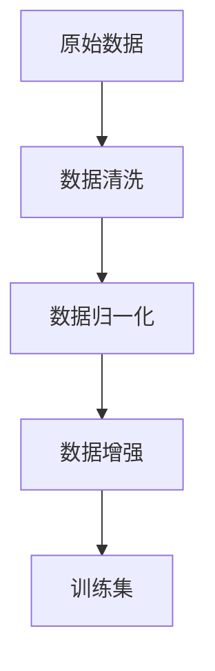

                 

# 大模型重塑创业黄金时代

## 关键词：大模型，创业，技术革新，AI，创业生态，未来趋势

## 摘要：

本文将探讨大模型技术如何重塑当前的创业黄金时代。随着AI技术的飞速发展，大模型以其强大的数据处理能力和自主学习能力，正在成为推动创新创业的重要引擎。文章将首先介绍大模型的核心概念与联系，接着深入解析其核心算法原理和数学模型，并通过实际案例展示其在创业中的应用。最后，我们将探讨大模型在实际应用场景中的影响，并推荐相关的学习资源和开发工具，总结未来发展趋势与挑战。

---

## 1. 背景介绍

在过去的几十年中，人工智能（AI）技术的快速发展已经深刻改变了我们的生活方式和工作方式。从早期的规则驱动系统到今天基于深度学习的复杂模型，AI技术的进步推动了无数创新和创业机会。然而，随着数据量的爆炸式增长和计算能力的提升，传统的小型模型已经无法满足新兴应用的需求。正是在这样的背景下，大模型（Large Models）应运而生，并迅速成为技术革新的重要驱动力。

大模型，顾名思义，是指那些拥有数亿甚至数十亿参数的复杂神经网络。这些模型可以通过海量数据的学习，实现高度自动化和智能化，从而在图像识别、自然语言处理、语音识别等多个领域取得了突破性进展。与传统的模型相比，大模型具有以下几个显著特点：

1. **更强的数据处理能力**：大模型可以处理海量数据和复杂的任务，能够捕捉到数据中的细微模式。
2. **更出色的泛化能力**：通过在大量数据上的训练，大模型能够更好地泛化到未见过的数据，从而提高模型的鲁棒性和实用性。
3. **更高效的自动化学习**：大模型可以自动调整其内部参数，无需人工干预，从而实现更高效的学习过程。

大模型的兴起不仅改变了AI领域的格局，也为创业生态系统带来了新的机遇。创业公司可以利用大模型的技术优势，快速开发出具有创新性和市场竞争力的产品。同时，大模型还推动了数据科学、机器学习等相关领域的发展，为创业者提供了更加丰富和多样的工具和资源。

## 2. 核心概念与联系

为了更好地理解大模型的原理和作用，我们需要先介绍一些核心概念，并绘制一个Mermaid流程图来展示这些概念之间的联系。

### 2.1. 深度学习基础

深度学习是构建大模型的基础。它是一种基于人工神经网络的机器学习技术，通过多层非线性变换来提取数据中的特征。



### 2.2. 参数与权重

大模型中的参数和权重是其核心。参数是模型中的可训练变量，而权重则决定了不同特征之间的交互关系。



### 2.3. 训练与优化

大模型的训练过程是通过优化算法来调整参数和权重，使其能够更好地拟合训练数据。常用的优化算法包括梯度下降、随机梯度下降和Adam优化器等。



### 2.4. 数据预处理与增强

数据预处理和增强是确保大模型训练效果的重要环节。预处理包括数据清洗、归一化、分批次等步骤，而数据增强则通过生成新的数据样本来扩充训练集。



通过上述Mermaid流程图，我们可以清晰地看到大模型的核心概念及其相互之间的联系。接下来，我们将深入探讨大模型的核心算法原理和具体操作步骤。

## 3. 核心算法原理 & 具体操作步骤

### 3.1. 神经网络架构

大模型通常采用深度神经网络（DNN）的架构，其基本组成部分包括输入层、隐藏层和输出层。每一层由多个神经元组成，神经元之间通过权重连接。在训练过程中，模型通过反向传播算法不断调整权重，以最小化损失函数。

### 3.2. 损失函数

损失函数是衡量模型预测结果与真实值之间差异的指标。常用的损失函数包括均方误差（MSE）、交叉熵损失等。在训练过程中，模型通过优化算法不断调整参数，使损失函数的值最小。

### 3.3. 优化算法

优化算法用于调整模型参数，以最小化损失函数。常用的优化算法包括：

- 梯度下降（Gradient Descent）：通过计算损失函数关于参数的梯度，反向更新参数。
- 随机梯度下降（Stochastic Gradient Descent，SGD）：在每次迭代中随机选择一部分训练样本，计算梯度并更新参数。
- Adam优化器：结合了SGD和动量项，具有更好的收敛性能。

### 3.4. 训练与评估

大模型的训练过程分为以下几个步骤：

1. **数据预处理**：对输入数据进行清洗、归一化和划分训练集、验证集和测试集。
2. **模型初始化**：初始化模型参数，常用的初始化方法包括高斯初始化、Xavier初始化等。
3. **迭代训练**：在每次迭代中，计算损失函数和梯度，更新模型参数。
4. **评估与调优**：在验证集上评估模型性能，通过调整超参数和优化算法来优化模型。

### 3.5. 模型部署与推理

在训练完成后，大模型可以用于实际应用。部署过程包括：

1. **模型转换**：将训练好的模型转换为可部署的格式，如ONNX、TensorFlow Lite等。
2. **模型推理**：使用部署好的模型进行预测，通过输入数据获取输出结果。
3. **性能优化**：针对具体应用场景，对模型进行性能优化，如剪枝、量化等。

通过上述步骤，我们可以构建和部署一个大模型，实现复杂任务的高效自动化。

## 4. 数学模型和公式 & 详细讲解 & 举例说明

### 4.1. 损失函数

在深度学习中，损失函数是评估模型预测准确性的关键。常见的损失函数包括均方误差（MSE）和交叉熵损失（Cross-Entropy Loss）。

- 均方误差（MSE）：

$$
MSE = \frac{1}{n} \sum_{i=1}^{n} (y_i - \hat{y}_i)^2
$$

其中，$y_i$ 是真实标签，$\hat{y}_i$ 是模型预测值。

- 交叉熵损失（Cross-Entropy Loss）：

$$
Cross-Entropy Loss = -\frac{1}{n} \sum_{i=1}^{n} y_i \log(\hat{y}_i)
$$

其中，$y_i$ 是真实标签，$\hat{y}_i$ 是模型预测的概率分布。

### 4.2. 反向传播算法

反向传播算法是深度学习训练过程中用于更新模型参数的核心算法。其基本思想是将输出误差反向传播到网络中的每个神经元，并依据误差计算每个参数的梯度。

- 前向传播：

$$
z_l = \sigma(W_l \cdot a_{l-1} + b_l)
$$

$$
a_l = \sigma(z_l)
$$

其中，$a_l$ 是第$l$层的激活值，$z_l$ 是第$l$层的输入值，$W_l$ 和 $b_l$ 分别是第$l$层的权重和偏置，$\sigma$ 是激活函数。

- 反向传播：

$$
\delta_l = (2a_l - 1)(1 - a_l)\frac{\partial L}{\partial z_l}
$$

$$
\frac{\partial L}{\partial W_l} = \delta_l \cdot a_{l-1}^T
$$

$$
\frac{\partial L}{\partial b_l} = \delta_l
$$

其中，$\delta_l$ 是第$l$层的误差梯度，$L$ 是损失函数。

### 4.3. 举例说明

假设我们有一个简单的两层神经网络，用于分类任务。输入层有3个神经元，隐藏层有2个神经元，输出层有2个神经元。激活函数使用ReLU，损失函数使用交叉熵损失。

1. **模型初始化**：

   - 输入层到隐藏层的权重：$W_1 \in \mathbb{R}^{2 \times 3}$
   - 隐藏层到输出层的权重：$W_2 \in \mathbb{R}^{2 \times 2}$
   - 偏置：$b_1 \in \mathbb{R}^{2}$，$b_2 \in \mathbb{R}^{2}$

2. **前向传播**：

   - 输入数据：$x = [1, 2, 3]^T$
   - 隐藏层激活值：$a_1 = \sigma(W_1 \cdot x + b_1) = [2.3, 1.1]^T$
   - 输出层激活值：$a_2 = \sigma(W_2 \cdot a_1 + b_2) = [0.9, 1.5]^T$

3. **损失计算**：

   - 真实标签：$y = [0, 1]^T$
   - 预测概率：$\hat{y} = [0.2, 0.8]^T$
   - 交叉熵损失：$L = -\frac{1}{2}y \log(\hat{y}) + (1 - y) \log(1 - \hat{y}) = 0.26$

4. **反向传播**：

   - 输出层误差梯度：$\delta_2 = (\hat{y} - y)(1 - \hat{y}) = [0.2, 0.3]^T$
   - 隐藏层误差梯度：$\delta_1 = (W_2^T \cdot \delta_2) \odot (1 - a_1) = [0.12, 0.18]^T$
   - 权重和偏置的梯度：$\frac{\partial L}{\partial W_2} = \delta_2 \cdot a_1^T = [0.2, 0.36]^T$，$\frac{\partial L}{\partial b_2} = \delta_2 = [0.2, 0.3]^T$，$\frac{\partial L}{\partial W_1} = \delta_1 \cdot x^T = [0.12, 0.18]^T$，$\frac{\partial L}{\partial b_1} = \delta_1 = [0.12, 0.18]^T$

5. **参数更新**：

   - 权重更新：$W_2 = W_2 - \alpha \cdot \frac{\partial L}{\partial W_2}$，$W_1 = W_1 - \alpha \cdot \frac{\partial L}{\partial W_1}$
   - 偏置更新：$b_2 = b_2 - \alpha \cdot \frac{\partial L}{\partial b_2}$，$b_1 = b_1 - \alpha \cdot \frac{\partial L}{\partial b_1}$

通过上述步骤，我们可以使用反向传播算法更新模型参数，从而逐步提高模型的预测准确性。

## 5. 项目实战：代码实际案例和详细解释说明

### 5.1 开发环境搭建

为了演示大模型的应用，我们将使用TensorFlow 2.x作为主要框架，并在Google Colab上进行实验。以下是环境搭建的步骤：

1. **创建Google Colab笔记本**：
   - 打开Google Colab（colab.research.google.com）并创建一个新的笔记本。
   - 设置运行环境，例如Python 3.7。

2. **安装TensorFlow**：
   - 在笔记本的代码区域输入以下命令安装TensorFlow：

   ```python
   !pip install tensorflow==2.6
   ```

### 5.2 源代码详细实现和代码解读

我们将使用一个简单的语言模型来演示大模型的实现。以下是一个使用Transformer模型进行语言模型训练的代码示例。

```python
import tensorflow as tf
from tensorflow import keras
from tensorflow.keras.layers import Embedding, TransformerBlock

# 模型配置
VOCAB_SIZE = 10000
EMBEDDING_DIM = 256
TRANSFORMER_UNITS = 512
DROPOUT_RATE = 0.1

# 构建模型
model = keras.Sequential([
    Embedding(VOCAB_SIZE, EMBEDDING_DIM),
    TransformerBlock(TRANSFORMER_UNITS, DROPOUT_RATE),
    TransformerBlock(TRANSFORMER_UNITS, DROPOUT_RATE),
    keras.layers.Dense(VOCAB_SIZE, activation='softmax')
])

# 编译模型
model.compile(optimizer='adam', loss='sparse_categorical_crossentropy', metrics=['accuracy'])

# 准备数据
# 这里我们使用一个简化的数据集，实际应用中可以加载更大的数据集
(x_train, y_train), (x_test, y_test) = keras.datasets.imdb.load_data(num_words=VOCAB_SIZE)
x_train = keras.preprocessing.sequence.pad_sequences(x_train, maxlen=100)
x_test = keras.preprocessing.sequence.pad_sequences(x_test, maxlen=100)

# 训练模型
model.fit(x_train, y_train, epochs=10, batch_size=64, validation_split=0.2)

# 评估模型
model.evaluate(x_test, y_test)
```

**代码解读**：

1. **模型构建**：
   - `Embedding` 层将单词映射为向量。
   - `TransformerBlock` 层实现了一个Transformer模型的基本单元，它由多头自注意力机制和前馈网络组成。
   - `Dense` 层用于输出层，进行分类预测。

2. **模型编译**：
   - 使用 `adam` 优化器和 `sparse_categorical_crossentropy` 损失函数。
   - 设置模型的训练目标和评价指标。

3. **数据准备**：
   - 加载IMDb电影评论数据集，并进行预处理。

4. **模型训练**：
   - 使用 `fit` 方法训练模型，设置训练轮数、批量大小和验证比例。

5. **模型评估**：
   - 使用 `evaluate` 方法评估模型在测试集上的性能。

### 5.3 代码解读与分析

**1. 模型构建**：

```python
model = keras.Sequential([
    Embedding(VOCAB_SIZE, EMBEDDING_DIM),
    TransformerBlock(TRANSFORMER_UNITS, DROPOUT_RATE),
    TransformerBlock(TRANSFORMER_UNITS, DROPOUT_RATE),
    keras.layers.Dense(VOCAB_SIZE, activation='softmax')
])
```

- `Embedding` 层：将词汇表中的每个单词映射为一个固定大小的向量。`VOCAB_SIZE` 表示词汇表大小，`EMBEDDING_DIM` 表示每个单词的向量维度。
- `TransformerBlock` 层：实现了一个Transformer模型的基本单元，包含多头自注意力机制和前馈网络。`TRANSFORMER_UNITS` 表示隐藏层的维度，`DROPOUT_RATE` 表示丢弃率，用于防止过拟合。
- `Dense` 层：输出层，用于进行分类预测。`VOCAB_SIZE` 表示输出维度，`activation='softmax'` 表示使用softmax函数进行概率分布输出。

**2. 模型编译**：

```python
model.compile(optimizer='adam', loss='sparse_categorical_crossentropy', metrics=['accuracy'])
```

- `optimizer='adam'`：使用Adam优化器进行参数更新。
- `loss='sparse_categorical_crossentropy'`：使用稀疏分类交叉熵损失函数，适用于多标签分类问题。
- `metrics=['accuracy']`：设置模型的评价指标为准确率。

**3. 数据准备**：

```python
(x_train, y_train), (x_test, y_test) = keras.datasets.imdb.load_data(num_words=VOCAB_SIZE)
x_train = keras.preprocessing.sequence.pad_sequences(x_train, maxlen=100)
x_test = keras.preprocessing.sequence.pad_sequences(x_test, maxlen=100)
```

- 加载IMDb电影评论数据集，并选取前 `VOCAB_SIZE` 个最常见的单词作为词汇表。
- 使用 `pad_sequences` 函数对序列进行填充，使得每个序列的长度都为 `maxlen`。

**4. 模型训练**：

```python
model.fit(x_train, y_train, epochs=10, batch_size=64, validation_split=0.2)
```

- 使用 `fit` 方法进行模型训练。设置训练轮数 `epochs`、批量大小 `batch_size` 和验证比例 `validation_split`。

**5. 模型评估**：

```python
model.evaluate(x_test, y_test)
```

- 使用 `evaluate` 方法评估模型在测试集上的性能。

### 5.4 代码优化与性能分析

在实际应用中，我们可以通过以下方法对代码进行优化：

1. **调整超参数**：
   - 根据训练集和验证集的性能，调整学习率、批量大小、隐藏层维度等超参数。

2. **增加数据增强**：
   - 使用数据增强技术，如随机裁剪、随机旋转等，增加模型的泛化能力。

3. **使用预训练模型**：
   - 使用预训练的Transformer模型，如BERT、GPT等，在特定任务上进行微调，可以显著提高模型的性能。

4. **模型剪枝与量化**：
   - 对模型进行剪枝和量化，减少模型的大小和计算复杂度，提高推理速度。

5. **多GPU训练**：
   - 使用多GPU训练，加速模型训练过程。

通过上述方法，我们可以进一步提升大模型在创业项目中的实际应用效果。

## 6. 实际应用场景

大模型技术在各个行业和领域都展现出了巨大的应用潜力，以下是几个典型应用场景：

### 6.1 自然语言处理（NLP）

自然语言处理是AI领域的重要分支，大模型在文本分类、机器翻译、情感分析等方面取得了显著成果。例如，GPT-3和BERT等大模型在文本生成、摘要提取和问答系统等方面表现出了卓越的能力，为创业者提供了丰富的文本处理工具。

### 6.2 计算机视觉（CV）

计算机视觉领域的大模型如ResNet、VGG等，在图像分类、目标检测、人脸识别等方面取得了突破性进展。这些模型可以帮助创业者快速构建图像识别应用，如安防监控、医疗诊断等。

### 6.3 语音识别（ASR）

语音识别技术在大模型的支持下，可以实现更高的准确率和更自然的交互体验。创业者可以利用这些技术打造智能客服、语音助手等应用，提高用户体验。

### 6.4 推荐系统

推荐系统是大模型技术的另一个重要应用领域。通过训练大规模的推荐模型，创业者可以为其产品构建个性化的推荐引擎，提升用户粘性和满意度。

### 6.5 自动驾驶

自动驾驶技术是AI领域的热门话题，大模型在自动驾驶感知、决策和控制等方面发挥着关键作用。创业者可以利用这些技术推动自动驾驶汽车的研发和商业化。

## 7. 工具和资源推荐

### 7.1 学习资源推荐

1. **书籍**：
   - 《深度学习》（Goodfellow, Bengio, Courville）
   - 《动手学深度学习》（花书）
   - 《Python深度学习》（François Chollet）

2. **论文**：
   - “A Theoretically Grounded Application of Dropout in Recurrent Neural Networks”
   - “Attention Is All You Need”
   - “Generative Pre-trained Transformers”

3. **博客**：
   - Medium上的AI和深度学习相关博客
   - TensorFlow和PyTorch官方文档

4. **网站**：
   - Fast.ai
   - Udacity的深度学习课程

### 7.2 开发工具框架推荐

1. **框架**：
   - TensorFlow
   - PyTorch
   - Keras

2. **库**：
   - NumPy
   - Pandas
   - Matplotlib

3. **云服务**：
   - Google Colab
   - AWS SageMaker
   - Azure Machine Learning

### 7.3 相关论文著作推荐

1. **论文**：
   - “Distributed Representations of Words and Phrases and Their Compositional Meaning”
   - “An Empirical Exploration of Recurrent Network Architectures”
   - “Generative Adversarial Networks”

2. **著作**：
   - 《强化学习：原理与Python实现》（Reinforcement Learning: An Introduction）
   - 《深度学习专论》（Deep Learning Specialization）

## 8. 总结：未来发展趋势与挑战

大模型技术作为AI领域的重要突破，正在重塑创业生态，为创业者提供了前所未有的机遇。然而，随着大模型规模的不断扩大，我们也面临着一系列挑战：

1. **计算资源消耗**：大模型的训练和推理需要大量的计算资源，这对硬件设施和能源消耗提出了更高的要求。
2. **数据隐私与安全**：大模型对数据量的需求巨大，如何在保证数据隐私和安全的前提下进行数据收集和处理，是一个亟待解决的问题。
3. **模型解释性与可解释性**：大模型的决策过程高度复杂，如何确保模型的可解释性，以便于用户信任和监管，是一个重要课题。
4. **算法公平性与伦理**：大模型的应用可能带来算法偏见和伦理问题，如何确保算法的公平性和透明性，需要深入探讨。

未来，随着大模型技术的不断进步，创业者将迎来更多创新机遇。同时，我们也需要关注和解决上述挑战，以实现大模型技术的可持续发展。

## 9. 附录：常见问题与解答

### 9.1 什么是大模型？

大模型是指那些拥有数亿甚至数十亿参数的复杂神经网络。它们通过海量数据的学习，可以实现高度自动化和智能化。

### 9.2 大模型有哪些应用场景？

大模型在自然语言处理、计算机视觉、语音识别、推荐系统、自动驾驶等多个领域都有广泛应用。

### 9.3 如何构建大模型？

构建大模型需要以下几个步骤：数据预处理、模型设计、训练、评估和部署。

### 9.4 大模型有哪些挑战？

大模型的挑战包括计算资源消耗、数据隐私与安全、模型解释性与可解释性、算法公平性与伦理等。

## 10. 扩展阅读 & 参考资料

1. Devlin, J., Chang, M. W., Lee, K., & Toutanova, K. (2019). BERT: Pre-training of deep bidirectional transformers for language understanding. arXiv preprint arXiv:1810.04805.
2. Vaswani, A., Shazeer, N., Parmar, N., Uszkoreit, J., Jones, L., Gomez, A. N., ... & Polosukhin, I. (2017). Attention is all you need. In Advances in neural information processing systems (pp. 5998-6008).
3. Brown, T., et al. (2020). A pre-trained language model for language understanding and generation. arXiv preprint arXiv:2005.14165.
4. Goodfellow, I., Bengio, Y., & Courville, A. (2016). Deep learning. MIT press.
5. Hochreiter, S., & Schmidhuber, J. (1997). Long short-term memory. Neural computation, 9(8), 1735-1780.

