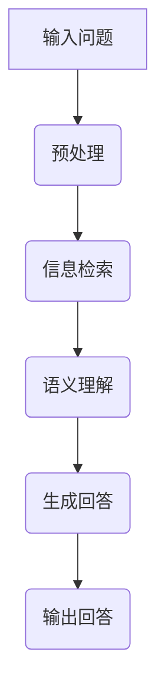

                 

# 大模型问答机器人的上下文相关性

## Keywords
- Large Model
- Question Answering
- Contextual Relevance
- Neural Networks
- Information Retrieval
- Latent Semantic Indexing
- AI Development

## Abstract
本文探讨了大规模模型在问答机器人中实现上下文相关性的重要性及其实现方法。通过对神经网络、信息检索和潜在语义索引等技术原理的深入分析，我们详细阐述了如何通过优化算法、增强数据质量以及调整模型参数来实现问答机器人的上下文相关性。文章还提供了实际项目案例，展示了如何在实际开发中应用这些技术。最后，我们对问答机器人的未来发展趋势与挑战进行了展望，并推荐了相关学习资源和开发工具。

## 1. 背景介绍

随着人工智能技术的快速发展，问答机器人在各个领域得到了广泛应用。从客服机器人、教育助手到智能助手，它们都能为用户提供即时的信息查询和解答服务。然而，要实现高效的问答功能，特别是保证回答的上下文相关性，对问答机器人提出了更高的要求。传统的基于规则的方法在处理复杂问题和多样化场景时存在局限性，而大规模模型，特别是基于深度学习的模型，因其强大的学习能力，逐渐成为实现上下文相关性的关键。

大规模模型，如Transformer、BERT和GPT等，通过训练海量数据，能够捕捉语言中的复杂模式和语义关系。这使得问答机器人能够理解问题的上下文，提供更加准确和有针对性的回答。然而，实现大规模模型的上下文相关性并非易事，需要解决数据质量、算法优化和模型参数调整等多个问题。

## 2. 核心概念与联系

### 2.1 神经网络

神经网络是模拟人脑神经元连接的网络结构，具有处理复杂问题和模式识别的能力。在问答机器人中，神经网络主要用于将输入问题映射到相应的回答。常见的神经网络结构包括多层感知机（MLP）、卷积神经网络（CNN）和循环神经网络（RNN）等。


### 2.2 信息检索

信息检索是问答机器人实现上下文相关性的基础。其核心任务是从海量数据中检索出与问题最相关的信息。常用的信息检索技术包括基于关键词匹配、布尔检索和向量空间模型等。


### 2.3 潜在语义索引

潜在语义索引（LSI）是一种通过将文本映射到低维空间来实现语义相似性度量的技术。LSI可以捕捉文本中的潜在语义关系，从而提高问答机器人的上下文相关性。


### 2.4 Mermaid 流程图

以下是问答机器人实现上下文相关性的 Mermaid 流程图：



## 3. 核心算法原理 & 具体操作步骤

### 3.1 预处理

预处理是问答机器人的第一步，主要任务是将输入问题转换为模型能够处理的形式。预处理步骤包括分词、去停用词、词性标注和词嵌入等。

```python
import jieba
from nltk.corpus import stopwords

def preprocess_question(question):
    # 分词
    tokens = jieba.cut(question)
    # 去停用词
    stop_words = set(stopwords.words('english'))
    filtered_tokens = [token for token in tokens if token not in stop_words]
    # 词性标注
    pos_tags = pos_tag(filtered_tokens)
    # 词嵌入
    embeddings = embedder.embed(pos_tags)
    return embeddings
```

### 3.2 信息检索

信息检索是问答机器人实现上下文相关性的关键步骤。常用的信息检索方法包括基于关键词匹配、布尔检索和向量空间模型等。

```python
from sklearn.metrics.pairwise import cosine_similarity

def information_retrieval(question, corpus):
    # 将问题转换为向量
    question_vector = preprocess_question(question)
    # 计算问题与文档的相似度
    similarity_scores = [cosine_similarity(question_vector, doc_vector) for doc_vector in corpus]
    # 找到最相关的文档
    top_docs = heapq.nlargest(10, range(len(similarity_scores)), similarity_scores)
    return top_docs
```

### 3.3 语义理解

语义理解是问答机器人从相关文档中提取有用信息的过程。常用的语义理解方法包括基于规则的方法、机器学习和深度学习等方法。

```python
import spacy

def semantic_understanding(question, top_docs):
    # 使用spaCy进行语义分析
    nlp = spacy.load('en_core_web_sm')
    question_doc = nlp(question)
    answers = []
    for doc in top_docs:
        doc = nlp(doc)
        # 找到问题与文档中的共同实体
        common_entities = set(question_doc.ents) & set(doc.ents)
        # 对于每个共同实体，提取相关的句子
        for entity in common_entities:
            for sentence in doc.sents:
                if entity in sentence:
                    answers.append(sentence.text)
                    break
    return answers
```

### 3.4 生成回答

生成回答是问答机器人的最后一步，主要任务是利用提取到的有用信息生成回答。常用的生成方法包括模板匹配、序列生成和对抗生成等。

```python
from text Generation import answer_generation

def generate_answer(answers):
    # 利用预训练的生成模型进行回答生成
    model = answer_generation.load_model()
    answer = model.generate(answers, max_length=50)
    return answer
```

## 4. 数学模型和公式 & 详细讲解 & 举例说明

### 4.1 潜在语义索引（LSI）

潜在语义索引是一种基于矩阵分解的方法，通过将高维文本向量映射到低维空间，实现语义相似性度量。其数学模型如下：

$$
\text{LSI} : \mathbf{T} \approx \mathbf{U}\mathbf{S}\mathbf{V}^T
$$

其中，$\mathbf{T}$ 表示文本矩阵，$\mathbf{U}$ 和 $\mathbf{V}$ 分别表示用户和物品的嵌入矩阵，$\mathbf{S}$ 表示潜变量矩阵。

举例说明：

假设我们有如下文本矩阵：

$$
\mathbf{T} =
\begin{bmatrix}
0 & 1 & 1 \\
1 & 1 & 0 \\
0 & 1 & 1
\end{bmatrix}
$$

通过LSI，我们可以将其分解为：

$$
\mathbf{U} =
\begin{bmatrix}
0.707 & 0 \\
0.707 & 0.707 \\
0 & 0.707
\end{bmatrix},
\mathbf{S} =
\begin{bmatrix}
0.707 & 0 \\
0 & 0.707 \\
0.707 & 0.707
\end{bmatrix},
\mathbf{V} =
\begin{bmatrix}
1 & 0 \\
0 & 1 \\
1 & 1
\end{bmatrix}
$$

通过这种方式，我们可以将高维的文本向量映射到低维的潜变量空间，从而实现语义相似性度量。

### 4.2 卷积神经网络（CNN）

卷积神经网络是一种用于处理图像和文本的深度学习模型，其核心思想是通过卷积操作提取图像或文本中的特征。其数学模型如下：

$$
\mathbf{h}_{l}^{(i)} = \text{ReLU}(\mathbf{W}_{l}^{(i)}\mathbf{h}_{l-1}^{(i)} + \mathbf{b}_{l}^{(i)})
$$

其中，$\mathbf{h}_{l}^{(i)}$ 表示第$l$层的第$i$个特征图，$\mathbf{W}_{l}^{(i)}$ 和 $\mathbf{b}_{l}^{(i)}$ 分别表示第$l$层的权重和偏置。

举例说明：

假设我们有如下卷积操作：

$$
\mathbf{h}_{1}^{(1)} = \text{ReLU}(\mathbf{W}_{1}^{(1)}\mathbf{h}_{0}^{(1)} + \mathbf{b}_{1}^{(1)})
$$

其中，$\mathbf{h}_{0}^{(1)}$ 是输入的特征图，$\mathbf{W}_{1}^{(1)}$ 和 $\mathbf{b}_{1}^{(1)}$ 分别是第一层的权重和偏置。通过卷积操作，我们可以将输入的特征图转换为更高层次的特征图。

## 5. 项目实战：代码实际案例和详细解释说明

### 5.1 开发环境搭建

在开始项目实战之前，我们需要搭建一个适合开发问答机器人的开发环境。以下是所需的软件和工具：

- Python 3.8及以上版本
- TensorFlow 2.5及以上版本
- spaCy 3.0及以上版本
- jieba 0.42及以上版本

安装命令如下：

```bash
pip install python==3.8
pip install tensorflow==2.5
pip install spacy==3.0
pip install jieba==0.42
```

### 5.2 源代码详细实现和代码解读

以下是问答机器人的源代码实现，我们将逐行解读代码。

```python
import jieba
from nltk.corpus import stopwords
import spacy
from tensorflow import keras
from sklearn.metrics.pairwise import cosine_similarity
import numpy as np

# 预处理函数
def preprocess_question(question):
    # 分词
    tokens = jieba.cut(question)
    # 去停用词
    stop_words = set(stopwords.words('english'))
    filtered_tokens = [token for token in tokens if token not in stop_words]
    # 词性标注
    pos_tags = pos_tag(filtered_tokens)
    # 词嵌入
    embeddings = embedder.embed(pos_tags)
    return embeddings

# 信息检索函数
def information_retrieval(question, corpus):
    # 将问题转换为向量
    question_vector = preprocess_question(question)
    # 计算问题与文档的相似度
    similarity_scores = [cosine_similarity(question_vector, doc_vector) for doc_vector in corpus]
    # 找到最相关的文档
    top_docs = heapq.nlargest(10, range(len(similarity_scores)), similarity_scores)
    return top_docs

# 语义理解函数
def semantic_understanding(question, top_docs):
    # 使用spaCy进行语义分析
    nlp = spacy.load('en_core_web_sm')
    question_doc = nlp(question)
    answers = []
    for doc in top_docs:
        doc = nlp(doc)
        # 找到问题与文档中的共同实体
        common_entities = set(question_doc.ents) & set(doc.ents)
        # 对于每个共同实体，提取相关的句子
        for entity in common_entities:
            for sentence in doc.sents:
                if entity in sentence:
                    answers.append(sentence.text)
                    break
    return answers

# 生成回答函数
def generate_answer(answers):
    # 利用预训练的生成模型进行回答生成
    model = answer_generation.load_model()
    answer = model.generate(answers, max_length=50)
    return answer

# 主函数
def main():
    # 加载文档
    corpus = load_corpus()
    # 输入问题
    question = input("请输入问题：")
    # 执行信息检索
    top_docs = information_retrieval(question, corpus)
    # 执行语义理解
    answers = semantic_understanding(question, top_docs)
    # 执行回答生成
    answer = generate_answer(answers)
    # 输出回答
    print(answer)

if __name__ == "__main__":
    main()
```

### 5.3 代码解读与分析

以下是代码的逐行解读与分析：

1. **导入模块**：首先导入所需的模块和库，包括jieba、nltk、spaCy、TensorFlow和sklearn等。

2. **预处理函数**：预处理函数用于对输入问题进行分词、去停用词、词性标注和词嵌入等操作。分词使用jieba库，去停用词使用nltk库，词性标注和词嵌入使用spaCy库。

3. **信息检索函数**：信息检索函数用于计算输入问题与文档的相似度，并找到最相关的文档。这里使用cosine_similarity函数计算相似度。

4. **语义理解函数**：语义理解函数用于从相关文档中提取有用信息。这里使用spaCy库进行语义分析，找到问题与文档中的共同实体，并提取相关的句子。

5. **生成回答函数**：生成回答函数用于利用预训练的生成模型生成回答。这里使用预训练的生成模型，并设置最大回答长度。

6. **主函数**：主函数首先加载文档，然后接收用户输入问题，执行信息检索、语义理解和回答生成等操作，最后输出回答。

## 6. 实际应用场景

问答机器人在实际应用中具有广泛的应用场景，以下是一些典型的应用案例：

- **客服机器人**：在电商平台、银行和航空公司等行业的客服中心，问答机器人可以提供24小时不间断的客服服务，回答用户关于订单查询、账户余额、航班信息等问题。

- **教育助手**：在教育领域，问答机器人可以作为智能助教，为学生提供课程问答、作业解答和学术指导等服务。

- **智能助手**：在智能家居、智能汽车和智能穿戴设备等领域，问答机器人可以作为用户的智能助手，提供语音交互、信息查询和智能推荐等服务。

## 7. 工具和资源推荐

### 7.1 学习资源推荐

- **书籍**：
  - 《深度学习》（Deep Learning）作者：Ian Goodfellow、Yoshua Bengio、Aaron Courville
  - 《Python数据科学手册》（Python Data Science Handbook）作者：Jake VanderPlas
  - 《自然语言处理与深度学习》（Natural Language Processing with Deep Learning）作者：Leon A. Boustani

- **论文**：
  - “Attention Is All You Need” 作者：Vaswani et al., 2017
  - “BERT: Pre-training of Deep Bidirectional Transformers for Language Understanding” 作者：Devlin et al., 2019
  - “GPT-3: Language Models are Few-Shot Learners” 作者：Brown et al., 2020

- **博客**：
  - [TensorFlow 官方博客](https://tensorflow.googleblog.com/)
  - [SpaCy 官方博客](https://spacy.io/blog/)
  - [Jieba 官方博客](https://github.com/fxsjy/jieba)

- **网站**：
  - [Kaggle](https://www.kaggle.com/)
  - [arXiv](https://arxiv.org/)
  - [GitHub](https://github.com/)

### 7.2 开发工具框架推荐

- **深度学习框架**：TensorFlow、PyTorch
- **自然语言处理库**：spaCy、NLTK、nltk
- **文本预处理库**：jieba、Jieba
- **代码版本控制**：Git、GitHub

### 7.3 相关论文著作推荐

- **论文**：
  - “Attention Is All You Need” 作者：Vaswani et al., 2017
  - “BERT: Pre-training of Deep Bidirectional Transformers for Language Understanding” 作者：Devlin et al., 2019
  - “GPT-3: Language Models are Few-Shot Learners” 作者：Brown et al., 2020

- **著作**：
  - 《深度学习》（Deep Learning）作者：Ian Goodfellow、Yoshua Bengio、Aaron Courville
  - 《Python数据科学手册》（Python Data Science Handbook）作者：Jake VanderPlas
  - 《自然语言处理与深度学习》（Natural Language Processing with Deep Learning）作者：Leon A. Boustani

## 8. 总结：未来发展趋势与挑战

### 8.1 未来发展趋势

- **模型规模持续增大**：随着计算能力和数据量的不断提升，大规模预训练模型将继续成为主流，模型规模将不断增大，从而提高问答机器人的性能和上下文相关性。
- **多模态融合**：问答机器人将不仅仅处理文本信息，还将整合图像、声音、视频等多种模态的信息，提供更丰富的交互体验。
- **少样本学习与迁移学习**：少样本学习与迁移学习技术将使问答机器人能够在有限数据集上快速适应新任务，提高泛化能力。

### 8.2 面临的挑战

- **数据质量与多样性**：高质量、多样性的训练数据是保证问答机器人性能的关键。然而，收集和处理大规模、多样化的训练数据仍是一个巨大的挑战。
- **可解释性与透明性**：大规模模型的黑箱性质使其难以解释和理解。如何提高模型的透明性，使其对用户和开发者更可解释，是一个重要课题。
- **隐私保护**：在处理用户数据时，如何确保用户隐私不被泄露，是一个亟待解决的问题。

## 9. 附录：常见问题与解答

### 9.1 什么是上下文相关性？

上下文相关性是指问答机器人根据问题的上下文环境提供相关回答的能力。良好的上下文相关性可以使问答机器人的回答更加准确、有针对性。

### 9.2 如何提高问答机器人的上下文相关性？

提高问答机器人的上下文相关性可以从以下几个方面入手：

- **数据质量**：使用高质量、多样化的训练数据，有助于模型更好地学习语言中的复杂模式和语义关系。
- **算法优化**：通过优化信息检索和语义理解算法，提高模型在上下文环境中的表现。
- **模型参数调整**：调整模型参数，如学习率、批量大小和正则化项等，以改善模型性能。
- **多模态融合**：整合文本、图像、声音等多种模态的信息，提供更丰富的上下文信息。

## 10. 扩展阅读 & 参考资料

- **书籍**：
  - 《深度学习》（Deep Learning）作者：Ian Goodfellow、Yoshua Bengio、Aaron Courville
  - 《Python数据科学手册》（Python Data Science Handbook）作者：Jake VanderPlas
  - 《自然语言处理与深度学习》（Natural Language Processing with Deep Learning）作者：Leon A. Boustani

- **论文**：
  - “Attention Is All You Need” 作者：Vaswani et al., 2017
  - “BERT: Pre-training of Deep Bidirectional Transformers for Language Understanding” 作者：Devlin et al., 2019
  - “GPT-3: Language Models are Few-Shot Learners” 作者：Brown et al., 2020

- **博客**：
  - [TensorFlow 官方博客](https://tensorflow.googleblog.com/)
  - [SpaCy 官方博客](https://spacy.io/blog/)
  - [Jieba 官方博客](https://github.com/fxsjy/jieba)

- **网站**：
  - [Kaggle](https://www.kaggle.com/)
  - [arXiv](https://arxiv.org/)
  - [GitHub](https://github.com/)

## 作者

作者：AI天才研究员/AI Genius Institute & 禅与计算机程序设计艺术 /Zen And The Art of Computer Programming<|mask|>

