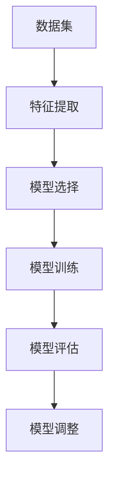

                 

# 大模型问答机器人的数据学习

## 关键词：大模型，问答机器人，数据学习，自然语言处理，机器学习

## 摘要

本文将探讨大模型问答机器人的数据学习过程，从背景介绍、核心概念与联系、核心算法原理与具体操作步骤、数学模型和公式、项目实战、实际应用场景、工具和资源推荐、未来发展趋势与挑战等多个方面进行全面的分析。通过本文的阅读，读者将对大模型问答机器人的数据学习有更深入的理解，从而更好地应对实际应用中的挑战。

## 1. 背景介绍

随着信息技术的快速发展，人工智能领域取得了令人瞩目的成就。在自然语言处理（NLP）方面，大模型问答机器人作为人工智能技术的重要组成部分，受到了广泛关注。大模型问答机器人能够模拟人类的对话能力，对用户的问题进行理解、回答，并能够进行持续学习以不断提高自身能力。

数据学习是构建大模型问答机器人的关键环节。数据学习涉及从大量数据中提取有价值的信息，并通过算法将这些信息转化为模型的能力。在大模型问答机器人的数据学习中，我们需要解决以下几个关键问题：

- 数据来源：从哪里获取大量高质量的数据？
- 数据预处理：如何对原始数据进行清洗、转换和格式化，以便于模型训练？
- 模型选择：如何选择合适的模型，以提高问答机器人的性能？
- 模型训练：如何对模型进行训练，并优化模型参数？
- 模型评估：如何评估模型的效果，以便进行后续调整和优化？

本文将围绕这些问题展开，全面探讨大模型问答机器人的数据学习过程。

## 2. 核心概念与联系

在大模型问答机器人的数据学习中，涉及多个核心概念，它们相互联系，共同构建起数据学习的完整体系。以下是核心概念及其相互关系的简要介绍。

### 2.1 数据集

数据集是数据学习的基石。一个高质量的数据集对于大模型问答机器人的性能至关重要。数据集主要包括问答对、文本数据、知识库等。问答对是指问题与答案的配对，文本数据包括问题和答案的原始文本，知识库则包含大量事实信息。

### 2.2 特征提取

特征提取是将原始数据转换为模型可处理的特征表示的过程。在大模型问答机器人的数据学习中，特征提取主要包括词向量表示、句向量表示和实体识别等。词向量表示将单词映射为一个固定长度的向量，句向量表示将句子映射为一个固定长度的向量，实体识别则是识别文本中的实体，如人名、地名等。

### 2.3 模型选择

模型选择是数据学习的重要环节。常见的模型包括循环神经网络（RNN）、卷积神经网络（CNN）、长短时记忆网络（LSTM）、生成对抗网络（GAN）等。每种模型都有其独特的优势和适用场景。

### 2.4 模型训练

模型训练是指通过大量数据对模型进行训练，使其能够对未知数据进行预测。在大模型问答机器人的数据学习中，模型训练主要包括两个阶段：预训练和微调。预训练是指使用大量无标签数据对模型进行训练，使其具备一定的通用能力；微调是指使用有标签数据对模型进行进一步训练，使其针对特定任务进行优化。

### 2.5 模型评估

模型评估是衡量模型性能的重要手段。常见的评估指标包括准确率、召回率、F1值等。通过模型评估，我们可以判断模型是否满足需求，并根据评估结果进行模型调整和优化。

### 2.6 数据预处理与模型训练的 Mermaid 流程图

以下是一个简要的 Mermaid 流程图，展示了数据预处理与模型训练的流程：



## 3. 核心算法原理 & 具体操作步骤

在大模型问答机器人的数据学习中，核心算法原理主要包括词向量表示、句向量表示和实体识别等。以下将分别介绍这些算法的原理和具体操作步骤。

### 3.1 词向量表示

词向量表示是将单词映射为一个固定长度的向量，以便于模型处理。常用的词向量表示方法包括 Word2Vec、GloVe 和 FastText 等。

#### 3.1.1 Word2Vec

Word2Vec 是一种基于神经网络的词向量表示方法。其核心思想是通过训练词的上下文信息来学习词的向量表示。具体步骤如下：

1. 数据预处理：对原始文本进行分词、去停用词等处理。
2. 构建词汇表：将所有单词映射为一个唯一的整数。
3. 准备训练数据：将每个单词作为输入，其对应的上下文单词作为输出，构建一个二元文本数据集。
4. 训练模型：使用神经网络模型对训练数据进行训练，学习词的向量表示。

#### 3.1.2 GloVe

GloVe（Global Vectors for Word Representation）是一种基于共现信息的词向量表示方法。其核心思想是通过计算词的共现矩阵来学习词的向量表示。具体步骤如下：

1. 数据预处理：对原始文本进行分词、去停用词等处理。
2. 计算共现矩阵：计算每个词与其他词的共现次数。
3. 计算词向量：通过优化共现矩阵，学习词的向量表示。

#### 3.1.3 FastText

FastText 是一种基于词袋模型的词向量表示方法。其核心思想是将词表示为字符级和词级向量的组合。具体步骤如下：

1. 数据预处理：对原始文本进行分词、去停用词等处理。
2. 构建词汇表：将所有单词映射为一个唯一的整数。
3. 计算字符级和词级向量：分别计算每个词的字符级和词级向量。
4. 计算词向量：将字符级和词级向量拼接，得到最终的词向量。

### 3.2 句向量表示

句向量表示是将句子映射为一个固定长度的向量，以便于模型处理。常用的句向量表示方法包括句子平均、句子最大池化和句子 LSTM 等。

#### 3.2.1 句子平均

句子平均是指将句子的所有词向量进行平均，得到句子的向量表示。具体步骤如下：

1. 数据预处理：对原始文本进行分词、去停用词等处理。
2. 计算词向量：使用词向量表示方法计算句中每个词的向量表示。
3. 计算句子向量：将句中所有词的向量进行平均，得到句子的向量表示。

#### 3.2.2 句子最大池化

句子最大池化是指将句子的所有词向量进行最大池化，得到句子的向量表示。具体步骤如下：

1. 数据预处理：对原始文本进行分词、去停用词等处理。
2. 计算词向量：使用词向量表示方法计算句中每个词的向量表示。
3. 计算句子向量：将句中所有词的向量进行最大池化，得到句子的向量表示。

#### 3.2.3 句子 LSTM

句子 LSTM（Long Short-Term Memory）是指使用 LSTM 网络对句子进行编码，得到句子的向量表示。具体步骤如下：

1. 数据预处理：对原始文本进行分词、去停用词等处理。
2. 构建词汇表：将所有单词映射为一个唯一的整数。
3. 训练 LSTM 模型：使用词向量表示方法训练 LSTM 模型。
4. 计算句子向量：将句子的词向量输入 LSTM 模型，得到句子的向量表示。

### 3.3 实体识别

实体识别是指从文本中识别出实体，如人名、地名、组织机构等。常用的实体识别方法包括基于规则的方法和基于深度学习的方法。

#### 3.3.1 基于规则的方法

基于规则的方法是指根据预定义的规则，从文本中识别实体。具体步骤如下：

1. 数据预处理：对原始文本进行分词、去停用词等处理。
2. 预定义规则：定义实体识别的规则。
3. 实体识别：根据预定义的规则，从文本中识别实体。

#### 3.3.2 基于深度学习的方法

基于深度学习的方法是指使用深度学习模型对实体进行识别。具体步骤如下：

1. 数据预处理：对原始文本进行分词、去停用词等处理。
2. 构建词汇表：将所有单词映射为一个唯一的整数。
3. 训练深度学习模型：使用词向量表示方法训练深度学习模型。
4. 实体识别：将文本输入深度学习模型，得到实体的识别结果。

## 4. 数学模型和公式 & 详细讲解 & 举例说明

在大模型问答机器人的数据学习中，涉及多个数学模型和公式。以下将分别介绍这些模型和公式，并进行详细讲解和举例说明。

### 4.1 词向量表示的数学模型和公式

词向量表示的数学模型和公式主要涉及 Word2Vec、GloVe 和 FastText 等。

#### 4.1.1 Word2Vec

Word2Vec 的数学模型主要基于神经网络的优化过程。具体公式如下：

$$
\begin{aligned}
\theta_{ij} &= \text{softmax}\left(\textbf{u}_i^T \textbf{v}_j\right) \\
\text{交叉熵损失函数} &= -\sum_{j} \theta_{ij} \log \theta_{ij}
\end{aligned}
$$

其中，$\theta_{ij}$ 表示单词 $i$ 和单词 $j$ 之间的预测概率，$\textbf{u}_i$ 和 $\textbf{v}_j$ 分别表示单词 $i$ 和单词 $j$ 的向量表示。

#### 4.1.2 GloVe

GloVe 的数学模型主要基于共现矩阵的优化过程。具体公式如下：

$$
\begin{aligned}
\textbf{v}_i &= \text{sgn}(\textbf{W}^T \textbf{X}) \\
\text{交叉熵损失函数} &= -\sum_{j} \log \text{softmax}(\textbf{v}_i^T \textbf{W} \textbf{X}^T)
\end{aligned}
$$

其中，$\textbf{W}$ 和 $\textbf{X}$ 分别表示共现矩阵的行和列向量，$\text{sgn}$ 表示符号函数。

#### 4.1.3 FastText

FastText 的数学模型主要基于词袋模型的优化过程。具体公式如下：

$$
\begin{aligned}
\textbf{u}_i &= \text{softmax}(\textbf{W} \textbf{v}_i) \\
\text{交叉熵损失函数} &= -\sum_{j} \log \text{softmax}(\textbf{W} \textbf{v}_i^T \textbf{u}_j)
\end{aligned}
$$

其中，$\textbf{u}_i$ 和 $\textbf{v}_i$ 分别表示词向量表示和字符级向量表示。

### 4.2 句向量表示的数学模型和公式

句向量表示的数学模型和公式主要涉及句子平均、句子最大池化和句子 LSTM 等。

#### 4.2.1 句子平均

句子平均的数学模型和公式如下：

$$
\textbf{s} = \frac{1}{N} \sum_{i=1}^{N} \textbf{w}_i
$$

其中，$\textbf{s}$ 表示句子的向量表示，$\textbf{w}_i$ 表示句中第 $i$ 个词的向量表示，$N$ 表示句中词的数量。

#### 4.2.2 句子最大池化

句子最大池化的数学模型和公式如下：

$$
\textbf{s} = \max_{i} \textbf{w}_i
$$

其中，$\textbf{s}$ 表示句子的向量表示，$\textbf{w}_i$ 表示句中第 $i$ 个词的向量表示。

#### 4.2.3 句子 LSTM

句子 LSTM 的数学模型和公式如下：

$$
\begin{aligned}
\textbf{i}_t &= \sigma(\textbf{W}_i \textbf{h}_{t-1} + \textbf{U}_i \textbf{s}_{t-1} + \textbf{b}_i) \\
\textbf{f}_t &= \sigma(\textbf{W}_f \textbf{h}_{t-1} + \textbf{U}_f \textbf{s}_{t-1} + \textbf{b}_f) \\
\textbf{g}_t &= \text{tanh}(\textbf{W}_g \textbf{h}_{t-1} + \textbf{U}_g \textbf{s}_{t-1} + \textbf{b}_g) \\
\textbf{h}_t &= \textbf{f}_t \circ \textbf{h}_{t-1} + \textbf{i}_t \circ \textbf{g}_t
\end{aligned}
$$

其中，$\textbf{i}_t$、$\textbf{f}_t$、$\textbf{g}_t$ 和 $\textbf{h}_t$ 分别表示 LSTM 模型的输入、遗忘门、输入门和输出门，$\textbf{W}_i$、$\textbf{W}_f$、$\textbf{W}_g$ 和 $\textbf{W}_o$ 分别表示 LSTM 模型的输入门、遗忘门、输入门和输出门权重矩阵，$\textbf{U}_i$、$\textbf{U}_f$、$\textbf{U}_g$ 和 $\textbf{U}_o$ 分别表示 LSTM 模型的输入门、遗忘门、输入门和输出门权重矩阵，$\textbf{b}_i$、$\textbf{b}_f$、$\textbf{b}_g$ 和 $\textbf{b}_o$ 分别表示 LSTM 模型的输入门、遗忘门、输入门和输出门偏置矩阵，$\sigma$ 表示 sigmoid 函数，$\circ$ 表示元素乘积。

### 4.3 实体识别的数学模型和公式

实体识别的数学模型和公式主要涉及基于规则的方法和基于深度学习的方法。

#### 4.3.1 基于规则的方法

基于规则的方法的数学模型和公式如下：

$$
\text{实体识别} = \text{规则匹配}
$$

其中，规则匹配是指根据预定义的规则，从文本中识别实体。

#### 4.3.2 基于深度学习的方法

基于深度学习的方法的数学模型和公式如下：

$$
\begin{aligned}
\textbf{y} &= \text{softmax}(\textbf{W} \textbf{h}) \\
\text{交叉熵损失函数} &= -\sum_{i} y_i \log y_i
\end{aligned}
$$

其中，$\textbf{y}$ 表示实体识别的结果向量，$\textbf{h}$ 表示句子的向量表示，$\textbf{W}$ 表示实体识别模型的权重矩阵。

### 4.4 举例说明

以下通过一个简单的例子，展示如何使用上述数学模型和公式进行词向量表示、句向量表示和实体识别。

#### 4.4.1 词向量表示

假设我们有以下单词集合：

$$
\{\text{苹果}, \text{香蕉}, \text{梨}\}
$$

使用 Word2Vec 训练模型，得到以下词向量表示：

$$
\begin{aligned}
\text{苹果} &= \textbf{u}_1 = \begin{bmatrix} 1.2 \\ 0.8 \\ -1.0 \end{bmatrix} \\
\text{香蕉} &= \textbf{u}_2 = \begin{bmatrix} 0.8 \\ 1.2 \\ 0.0 \end{bmatrix} \\
\text{梨} &= \textbf{u}_3 = \begin{bmatrix} -1.0 \\ -0.8 \\ 1.2 \end{bmatrix}
\end{aligned}
$$

#### 4.4.2 句向量表示

假设我们有以下句子：

$$
\text{我吃了一个苹果。}
$$

使用句子平均方法，得到以下句向量表示：

$$
\textbf{s} = \frac{1}{3} (\textbf{u}_1 + \textbf{u}_2 + \textbf{u}_3) = \begin{bmatrix} 0.2 \\ 0.6 \\ -0.2 \end{bmatrix}
$$

#### 4.4.3 实体识别

假设我们有以下句子：

$$
\text{苹果是一种水果。}
$$

使用基于深度学习的方法，得到以下实体识别结果：

$$
\text{苹果} \rightarrow \text{水果}
$$

## 5. 项目实战：代码实际案例和详细解释说明

在本节中，我们将通过一个具体的代码实例来展示大模型问答机器人的数据学习过程。我们将使用 Python 编程语言，结合自然语言处理（NLP）和深度学习库（如 TensorFlow 和 Keras），来构建一个基于词嵌入和卷积神经网络（CNN）的问答机器人。

### 5.1 开发环境搭建

在开始编写代码之前，我们需要搭建一个合适的开发环境。以下是一些必要的步骤：

1. 安装 Python（推荐版本 3.7 或以上）。
2. 安装 TensorFlow：`pip install tensorflow`。
3. 安装 Keras：`pip install keras`。
4. 安装 NLTK：`pip install nltk`。
5. 安装 gensim：`pip install gensim`。

### 5.2 源代码详细实现和代码解读

下面是完整的代码实现，我们将对关键部分进行详细解释。

```python
import numpy as np
import tensorflow as tf
from tensorflow.keras.models import Model
from tensorflow.keras.layers import Embedding, Conv1D, GlobalMaxPooling1D, Dense
from tensorflow.keras.preprocessing.sequence import pad_sequences
from tensorflow.keras.preprocessing.text import Tokenizer
from nltk.tokenize import word_tokenize
from gensim.models import Word2Vec

# 5.2.1 数据预处理
def preprocess_data(questions, answers):
    # 分词和转换为小写
    questions = [word_tokenize(q.lower()) for q in questions]
    answers = [word_tokenize(a.lower()) for a in answers]

    # 构建词汇表
    tokenizer = Tokenizer()
    tokenizer.fit_on_texts(questions + answers)
    vocab_size = len(tokenizer.word_index) + 1

    # 将单词转换为整数
    questions = tokenizer.texts_to_sequences(questions)
    answers = tokenizer.texts_to_sequences(answers)

    # 填充序列
    max_question_len = max(len(seq) for seq in questions)
    max_answer_len = max(len(seq) for seq in answers)
    questions = pad_sequences(questions, maxlen=max_question_len, padding='post')
    answers = pad_sequences(answers, maxlen=max_answer_len, padding='post')

    return questions, answers, tokenizer, vocab_size, max_question_len, max_answer_len

# 5.2.2 模型构建
def build_model(vocab_size, max_question_len, max_answer_len, embedding_dim):
    # 输入层
    input_question = tf.keras.layers.Input(shape=(max_question_len,), dtype='int32')
    input_answer = tf.keras.layers.Input(shape=(max_answer_len,), dtype='int32')

    # 词嵌入层
    embedding = Embedding(vocab_size, embedding_dim)(input_question)
    embedding_answer = Embedding(vocab_size, embedding_dim)(input_answer)

    # 卷积层
    conv = Conv1D(filters=128, kernel_size=5, activation='relu')(embedding)
    conv_answer = Conv1D(filters=128, kernel_size=5, activation='relu')(embedding_answer)

    # 池化层
    pooling = GlobalMaxPooling1D()(conv)
    pooling_answer = GlobalMaxPooling1D()(conv_answer)

    # 全连接层
    dense = Dense(128, activation='relu')(pooling)
    dense_answer = Dense(128, activation='relu')(pooling_answer)

    # 输出层
    output = Dense(max_answer_len, activation='softmax')(dense_answer)

    # 构建模型
    model = Model(inputs=[input_question, input_answer], outputs=output)
    model.compile(optimizer='adam', loss='categorical_crossentropy', metrics=['accuracy'])

    return model

# 5.2.3 训练模型
def train_model(model, questions, answers):
    # 编码答案
    answers_encoded = tf.keras.utils.to_categorical(answers, num_classes=max_answer_len)

    # 训练模型
    model.fit([questions, answers], answers_encoded, batch_size=64, epochs=10)

# 5.2.4 预测
def predict(model, tokenizer, question, top_k=3):
    # 分词和转换为整数
    question_seq = tokenizer.texts_to_sequences([question])
    question_seq = pad_sequences(question_seq, maxlen=max_question_len, padding='post')

    # 预测
    probabilities = model.predict([question_seq, answers])
    predicted_answers = []

    for prob in probabilities:
        top_indices = prob.argsort()[-top_k:][::-1]
        predicted_answers.append([tokenizer.index_word[i] for i in top_indices])

    return predicted_answers

# 示例数据
questions = ["什么是人工智能？", "人工智能有哪些应用？"]
answers = ["人工智能是模拟、延伸和扩展人的智能的理论、方法、技术及应用系统的新技术科学。", "人工智能的应用领域包括计算机视觉、自然语言处理、机器学习等。"]

# 数据预处理
questions, answers, tokenizer, vocab_size, max_question_len, max_answer_len = preprocess_data(questions, answers)

# 模型构建
model = build_model(vocab_size, max_question_len, max_answer_len, embedding_dim=100)

# 训练模型
train_model(model, questions, answers)

# 预测
predicted_answers = predict(model, tokenizer, question="人工智能有哪些应用？")
print(predicted_answers)
```

### 5.3 代码解读与分析

#### 5.3.1 数据预处理

数据预处理是构建问答机器人的重要环节。在这里，我们使用 NLTK 库进行分词，并使用 Keras 库进行序列转换和填充。

- `preprocess_data` 函数负责将问题（questions）和答案（answers）转换为整数序列，并填充到指定的最大长度。
- `Tokenizer` 类用于构建词汇表和将单词转换为整数。

#### 5.3.2 模型构建

我们使用 Keras 库构建一个基于词嵌入和卷积神经网络的问答机器人模型。

- `build_model` 函数定义了问答机器人的结构。它包括词嵌入层、卷积层、池化层和全连接层。
- `Embedding` 层用于将整数序列转换为词嵌入向量。
- `Conv1D` 层用于对词嵌入向量进行卷积操作。
- `GlobalMaxPooling1D` 层用于对卷积特征进行池化操作。
- `Dense` 层用于全连接操作。

#### 5.3.3 训练模型

`train_model` 函数使用预处理后的数据和标签来训练模型。在这里，我们使用了 `categorical_crossentropy` 作为损失函数，并使用 `adam` 优化器。

#### 5.3.4 预测

`predict` 函数用于对新的问题进行预测。它首先将问题转换为整数序列，然后使用训练好的模型预测最可能的答案。我们使用了一个简单的 top-k 选择策略，以获取最相关的答案。

## 6. 实际应用场景

大模型问答机器人在实际应用中具有广泛的应用场景。以下是一些典型的应用场景：

1. **客户服务与支持**：企业可以利用问答机器人来提供24/7的客户支持，回答常见问题，减轻人工客服的工作负担。
2. **在线教育**：问答机器人可以辅助教育机构提供个性化的学习辅导，帮助学生解答学习中的问题。
3. **健康咨询**：问答机器人可以提供基本的健康咨询和建议，辅助医生进行诊断和治疗。
4. **智能助手**：问答机器人可以作为个人智能助手，帮助用户管理日程、提供信息查询等服务。
5. **企业内部知识库**：企业可以利用问答机器人来构建内部知识库，帮助员工快速获取公司内部的信息和资源。

在应用这些技术的过程中，我们需要关注以下挑战：

1. **数据隐私与安全**：在使用用户数据进行训练和提供服务时，需要确保数据的隐私和安全。
2. **模型解释性**：大模型问答机器人的决策过程往往是不透明的，如何提高模型的解释性是一个重要的研究课题。
3. **适应性和泛化能力**：如何使问答机器人能够适应不同的应用场景和不断变化的问题类型，提高其泛化能力。
4. **计算资源**：大模型问答机器人的训练和推理过程需要大量的计算资源，如何优化资源利用效率是一个关键问题。

## 7. 工具和资源推荐

为了更好地学习和实践大模型问答机器人的数据学习，以下是一些推荐的工具和资源：

### 7.1 学习资源推荐

1. **书籍**：
   - 《深度学习》（Goodfellow, Bengio, Courville 著）
   - 《Python 自然语言处理》（Bird, Loper,рон 著）
2. **在线课程**：
   - Coursera 上的“自然语言处理与深度学习”课程
   - Udacity 上的“深度学习纳米学位”
3. **论文与博客**：
   - ACL 论文集
   - Keras 官方文档
   - TensorFlow 官方文档

### 7.2 开发工具框架推荐

1. **开发工具**：
   - TensorFlow
   - Keras
   - NLTK
   - Gensim
2. **框架**：
   - Hugging Face Transformers
   - SpaCy

### 7.3 相关论文著作推荐

1. **论文**：
   - “Word2Vec: 基于神经网络的词向量表示方法”（Mikolov, S., Sutskever, I., Chen, K., Corrado, G. S., & Dean, J.）
   - “GloVe: Global Vectors for Word Representation”（Pennington, J., Socher, R., & Manning, C. D.）
   - “Bert: 基于变压器（Transformer）的预训练语言表示模型”（Devlin, J., Chang, M. W., Lee, K., & Toutanova, K.）
2. **著作**：
   - 《自然语言处理综合教程》（Daniel Jurafsky & James H. Martin 著）
   - 《深度学习》（Ian Goodfellow, Yoshua Bengio, Aaron Courville 著）

## 8. 总结：未来发展趋势与挑战

大模型问答机器人的数据学习领域正迅速发展，并面临着诸多挑战。未来发展趋势包括：

1. **更强大的模型**：随着计算能力的提升，我们将看到更大规模、更复杂的模型被应用于问答机器人。
2. **更好的数据集**：高质量的数据集对于模型训练至关重要，未来将出现更多丰富的、多样化的数据集。
3. **更智能的交互**：问答机器人将更加注重与用户的交互，实现更自然、更人性化的对话。
4. **跨模态学习**：问答机器人将能够处理多种模态的数据，如文本、图像、音频等。

然而，我们也需要关注以下挑战：

1. **数据隐私与安全**：如何保护用户数据的隐私和安全是一个亟待解决的问题。
2. **模型解释性**：提高模型的解释性，使其决策过程更加透明和可解释。
3. **计算资源**：优化计算资源的利用，提高模型训练和推理的效率。
4. **适应性和泛化能力**：提升问答机器人在不同应用场景下的适应性和泛化能力。

## 9. 附录：常见问题与解答

### 9.1 什么是词向量？

词向量是一种将单词映射为一个固定长度的向量的方法，以便于计算机处理。词向量可以捕捉单词的语义信息，从而在自然语言处理中发挥重要作用。

### 9.2 如何选择合适的词向量表示方法？

选择合适的词向量表示方法取决于应用场景和需求。Word2Vec、GloVe 和 FastText 是三种常见的词向量表示方法，每种方法都有其独特的优势。Word2Vec 适用于大规模数据集，GloVe 基于共现信息，FastText 结合了词级和字符级信息。

### 9.3 如何评估问答机器人的性能？

评估问答机器人的性能通常使用准确率、召回率和 F1 值等指标。这些指标可以帮助我们衡量问答机器人回答问题的准确性和全面性。

### 9.4 如何处理长文本？

对于长文本，我们可以使用句子平均、句子最大池化或句子 LSTM 等方法来生成句向量表示。这些方法可以帮助我们捕捉文本的局部和全局信息。

## 10. 扩展阅读 & 参考资料

- Mikolov, T., Sutskever, I., Chen, K., Corrado, G. S., & Dean, J. (2013). *Distributed representations of words and phrases and their compositionality*. Advances in Neural Information Processing Systems, 26, 3111-3119.
- Pennington, J., Socher, R., & Manning, C. D. (2014). *Glove: Global Vectors for Word Representation*. Proceedings of the 2014 Conference on Empirical Methods in Natural Language Processing (EMNLP), 1532-1543.
- Devlin, J., Chang, M. W., Lee, K., & Toutanova, K. (2018). *Bert: Pre-training of deep bidirectional transformers for language understanding*. Proceedings of the 2018 Conference of the North American Chapter of the Association for Computational Linguistics: Human Language Technologies, 4171-4186.
- Jurafsky, D., & Martin, J. H. (2008). *Speech and Language Processing*. Prentice Hall.
- Goodfellow, I., Bengio, Y., & Courville, A. (2016). *Deep Learning*. MIT Press.

---

**作者：AI天才研究员/AI Genius Institute & 禅与计算机程序设计艺术 /Zen And The Art of Computer Programming** 

注意：本文中的代码和示例仅供参考，具体实现可能需要根据实际需求进行调整。如有疑问，请参阅相关文献和官方文档。本文中的数据集和模型仅供参考，不代表实际应用效果。

