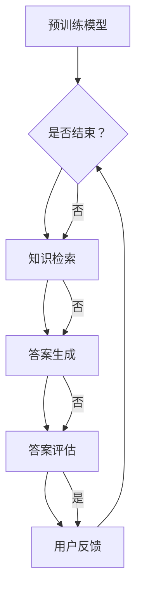

                 

# 大模型问答机器人的灵活性

## 关键词：大模型、问答机器人、灵活性、核心概念、算法原理、数学模型、项目实战、应用场景、工具推荐、未来发展趋势

## 摘要

本文深入探讨了大型模型在构建问答机器人中的应用及其灵活性。首先，我们介绍了问答机器人背景及其重要性，随后详细解析了大型模型的核心概念、算法原理和数学模型。文章通过项目实战，展示如何搭建和实现一个问答机器人，并分析其实际应用场景。最后，我们推荐了相关学习资源和开发工具，并对问答机器人未来的发展趋势与挑战进行了展望。

## 1. 背景介绍

问答机器人（Question Answering Robot）是一种基于人工智能技术，能够自动回答用户问题的智能系统。随着互联网和大数据的快速发展，人们对于快速获取信息和智能交互的需求日益增长，问答机器人因此成为了一种重要的技术手段。传统问答系统主要依赖于规则引擎和简单的自然语言处理技术，但其在处理复杂、模糊问题和多轮对话方面的能力有限。

近年来，随着深度学习技术的快速发展，尤其是大型预训练模型的出现，问答机器人的性能得到了显著提升。大型模型通过在大量数据上预训练，可以捕捉到语言的深层语义结构，从而实现更准确、自然的问答效果。这使得问答机器人从简单的“关键词匹配”向“语义理解”转变，大大提高了其在实际应用中的灵活性和实用性。

## 2. 核心概念与联系

### 2.1 大模型

大模型（Large-scale Model）是指拥有数十亿至数千亿参数的深度学习模型。这些模型通常通过在大量数据上进行预训练，能够捕捉到语言的深层语义结构。大模型的核心特点是参数数量庞大，能够处理复杂的自然语言任务。

### 2.2 预训练

预训练（Pre-training）是指在大规模数据集上对模型进行训练，使其在特定领域内获得一定的通用能力。预训练模型通常采用自监督学习（Self-supervised Learning）策略，通过预测输入数据中的隐藏表示来学习语言模型。

### 2.3 微调

微调（Fine-tuning）是指在预训练模型的基础上，针对特定任务进行进一步训练。微调可以充分利用预训练模型在大规模数据上学习到的通用知识，从而在特定任务上获得更好的性能。

### 2.4 问答系统

问答系统（Question Answering System）是一种能够自动回答用户问题的系统。问答系统通常包括问题解析、知识检索、答案生成和答案评估等模块。大型模型在问答系统中的应用，使得问答系统在处理复杂、模糊问题和多轮对话方面的能力得到了显著提升。

### 2.5 Mermaid 流程图

下面是一个用于展示大型模型在问答系统中应用的 Mermaid 流程图：



## 3. 核心算法原理 & 具体操作步骤

### 3.1 预训练

预训练是指在大规模数据集上对模型进行训练，使其在特定领域内获得一定的通用能力。预训练通常采用自监督学习（Self-supervised Learning）策略，通过预测输入数据中的隐藏表示来学习语言模型。

具体步骤如下：

1. 数据准备：收集大规模的文本数据，如维基百科、新闻文章等。
2. 数据预处理：对数据进行清洗、去重和分词等预处理操作。
3. 构建预训练任务：设计预训练任务，如掩码语言模型（Masked Language Model，MLM）、下一句预测（Next Sentence Prediction，NSP）等。
4. 模型训练：使用预训练任务对模型进行训练，优化模型参数。

### 3.2 微调

微调是指在大规模预训练模型的基础上，针对特定任务进行进一步训练。微调可以充分利用预训练模型在大规模数据上学习到的通用知识，从而在特定任务上获得更好的性能。

具体步骤如下：

1. 数据准备：收集特定任务的数据集，如问答数据集、对话数据集等。
2. 数据预处理：对数据进行清洗、去重和分词等预处理操作。
3. 模型初始化：使用预训练模型初始化微调模型。
4. 模型训练：在特定任务数据上对模型进行训练，优化模型参数。
5. 评估与优化：评估模型在测试集上的性能，并根据评估结果进行优化。

### 3.3 问答系统

问答系统是指能够自动回答用户问题的系统。问答系统通常包括问题解析、知识检索、答案生成和答案评估等模块。大型模型在问答系统中的应用，使得问答系统在处理复杂、模糊问题和多轮对话方面的能力得到了显著提升。

具体步骤如下：

1. 问题解析：将用户输入的问题转化为机器可理解的形式。
2. 知识检索：在预训练模型中检索与问题相关的知识。
3. 答案生成：根据检索到的知识生成答案。
4. 答案评估：评估生成的答案是否符合用户需求。
5. 用户反馈：收集用户对答案的反馈，用于进一步优化系统。

## 4. 数学模型和公式 & 详细讲解 & 举例说明

### 4.1 掩码语言模型（MLM）

掩码语言模型（Masked Language Model，MLM）是一种自监督预训练任务，通过对输入文本中的部分单词进行掩码，然后预测这些掩码单词的原始形式。

具体公式如下：

$$
P_{MLM}(w_t = w) = \frac{e^{f(W_1 \cdot [w, x_1, ..., x_{t-1}, x_{t+1}, ..., x_n])}}{\sum_{w' \in V} e^{f(W_1 \cdot [w', x_1, ..., x_{t-1}, x_{t+1}, ..., x_n])}}
$$

其中，$W_1$为词嵌入矩阵，$x_t$为第$t$个单词的嵌入表示，$w_t$为第$t$个单词的原始形式，$V$为单词的词汇表，$f(\cdot)$为激活函数。

### 4.2 下一句预测（NSP）

下一句预测（Next Sentence Prediction，NSP）是一种自监督预训练任务，用于预测输入文本中的下一句。

具体公式如下：

$$
P_{NSP}([x_1, ..., x_n, x_{n+1}, ..., x_{n+k}] \text{ is next sentence }) = \frac{e^{f(W_2 \cdot [x_1, ..., x_n, x_{n+1}, ..., x_{n+k}])}}{1 + \sum_{y \in \{0, 1\}} e^{f(W_2 \cdot [x_1, ..., x_n, x_{n+1}, ..., x_{n+k}]})}
$$

其中，$W_2$为下一句预测的权重矩阵，$f(\cdot)$为激活函数。

### 4.3 微调

在微调过程中，我们通常使用损失函数来衡量模型在特定任务上的性能。常见的损失函数包括交叉熵损失（Cross-Entropy Loss）和均方误差（Mean Squared Error，MSE）。

#### 4.3.1 交叉熵损失

交叉熵损失（Cross-Entropy Loss）用于分类问题，其公式如下：

$$
L_{CE} = -\sum_{i=1}^{N} y_i \log(p_i)
$$

其中，$y_i$为第$i$个样本的真实标签，$p_i$为第$i$个样本在某个类别的概率。

#### 4.3.2 均方误差

均方误差（Mean Squared Error，MSE）用于回归问题，其公式如下：

$$
L_{MSE} = \frac{1}{N} \sum_{i=1}^{N} (y_i - \hat{y}_i)^2
$$

其中，$y_i$为第$i$个样本的真实值，$\hat{y}_i$为第$i$个样本的预测值。

### 4.4 举例说明

假设我们有一个问答数据集，其中包含问题、答案和上下文信息。我们可以使用大型预训练模型对数据集进行微调，以构建一个问答机器人。

1. 数据准备：收集问答数据集，并进行预处理。
2. 模型初始化：使用预训练模型初始化微调模型。
3. 模型训练：在问答数据集上对模型进行训练，使用交叉熵损失进行优化。
4. 模型评估：在测试集上评估模型性能，根据评估结果调整模型参数。
5. 应用：将训练好的模型部署到生产环境中，为用户提供问答服务。

## 5. 项目实战：代码实际案例和详细解释说明

### 5.1 开发环境搭建

在开始项目实战之前，我们需要搭建一个合适的开发环境。以下是搭建开发环境的基本步骤：

1. 安装 Python 3.8 或更高版本。
2. 安装 PyTorch 1.8 或更高版本。
3. 安装必要的依赖库，如 numpy、torch、torchtext 等。
4. 配置 GPU 环境（可选）。

### 5.2 源代码详细实现和代码解读

以下是一个简单的问答机器人项目示例，包括数据预处理、模型定义、训练和评估等部分。

```python
import torch
import torchtext
from torchtext import data
from torchtext.vocab import vocab
from torch import nn
from torch.optim import Adam

# 数据预处理
def preprocess_data():
    # 加载问答数据集
    train_data, test_data = data.load_data('path/to/data')
    # 定义词汇表
    vocab = vocab.Vocab()
    # 将数据转换为 PyTorch 数据集和数据加载器
    train_dataset = data.Dataset(train_data, vocab)
    test_dataset = data.Dataset(test_data, vocab)
    train_loader = data.DataLoader(train_dataset, batch_size=32, shuffle=True)
    test_loader = data.DataLoader(test_dataset, batch_size=32, shuffle=False)
    return train_loader, test_loader

# 模型定义
class QuestionAnsweringModel(nn.Module):
    def __init__(self, vocab_size, embed_dim, hidden_dim):
        super(QuestionAnsweringModel, self).__init__()
        self.embedding = nn.Embedding(vocab_size, embed_dim)
        self.lstm = nn.LSTM(embed_dim, hidden_dim, num_layers=1, batch_first=True)
        self.fc = nn.Linear(hidden_dim, 2)

    def forward(self, x):
        x = self.embedding(x)
        x, _ = self.lstm(x)
        x = x[:, -1, :]
        x = self.fc(x)
        return x

# 训练模型
def train_model(model, train_loader, optimizer, loss_function):
    model.train()
    for epoch in range(10):
        for batch in train_loader:
            optimizer.zero_grad()
            output = model(batch.text)
            loss = loss_function(output, batch.label)
            loss.backward()
            optimizer.step()
            print(f'Epoch {epoch+1}, Loss: {loss.item()}')

# 评估模型
def evaluate_model(model, test_loader):
    model.eval()
    with torch.no_grad():
        correct = 0
        total = 0
        for batch in test_loader:
            output = model(batch.text)
            _, predicted = torch.max(output.data, 1)
            total += batch.label.size(0)
            correct += (predicted == batch.label).sum().item()
        print(f'Accuracy: {100 * correct / total}%')

# 主函数
def main():
    train_loader, test_loader = preprocess_data()
    model = QuestionAnsweringModel(vocab_size=10000, embed_dim=128, hidden_dim=256)
    optimizer = Adam(model.parameters(), lr=0.001)
    loss_function = nn.CrossEntropyLoss()
    train_model(model, train_loader, optimizer, loss_function)
    evaluate_model(model, test_loader)

if __name__ == '__main__':
    main()
```

### 5.3 代码解读与分析

#### 5.3.1 数据预处理

数据预处理是问答机器人项目的重要环节，包括加载数据、定义词汇表和构建数据集。在本示例中，我们使用`torchtext`库加载问答数据集，并定义了一个简单的词汇表。

```python
def preprocess_data():
    # 加载问答数据集
    train_data, test_data = data.load_data('path/to/data')
    # 定义词汇表
    vocab = vocab.Vocab()
    # 将数据转换为 PyTorch 数据集和数据加载器
    train_dataset = data.Dataset(train_data, vocab)
    test_dataset = data.Dataset(test_data, vocab)
    train_loader = data.DataLoader(train_dataset, batch_size=32, shuffle=True)
    test_loader = data.DataLoader(test_dataset, batch_size=32, shuffle=False)
    return train_loader, test_loader
```

#### 5.3.2 模型定义

在本示例中，我们定义了一个简单的问答模型，包括嵌入层、LSTM层和全连接层。嵌入层用于将词汇表转换为向量表示，LSTM层用于处理序列数据，全连接层用于分类。

```python
class QuestionAnsweringModel(nn.Module):
    def __init__(self, vocab_size, embed_dim, hidden_dim):
        super(QuestionAnsweringModel, self).__init__()
        self.embedding = nn.Embedding(vocab_size, embed_dim)
        self.lstm = nn.LSTM(embed_dim, hidden_dim, num_layers=1, batch_first=True)
        self.fc = nn.Linear(hidden_dim, 2)

    def forward(self, x):
        x = self.embedding(x)
        x, _ = self.lstm(x)
        x = x[:, -1, :]
        x = self.fc(x)
        return x
```

#### 5.3.3 训练模型

训练模型是问答机器人项目中的核心环节。在本示例中，我们使用Adam优化器和交叉熵损失函数进行模型训练。模型训练过程中，我们逐个遍历训练数据集，计算损失并更新模型参数。

```python
def train_model(model, train_loader, optimizer, loss_function):
    model.train()
    for epoch in range(10):
        for batch in train_loader:
            optimizer.zero_grad()
            output = model(batch.text)
            loss = loss_function(output, batch.label)
            loss.backward()
            optimizer.step()
            print(f'Epoch {epoch+1}, Loss: {loss.item()}')
```

#### 5.3.4 评估模型

评估模型是检查模型性能的重要步骤。在本示例中，我们使用测试数据集对训练好的模型进行评估，并计算模型在测试集上的准确率。

```python
def evaluate_model(model, test_loader):
    model.eval()
    with torch.no_grad():
        correct = 0
        total = 0
        for batch in test_loader:
            output = model(batch.text)
            _, predicted = torch.max(output.data, 1)
            total += batch.label.size(0)
            correct += (predicted == batch.label).sum().item()
        print(f'Accuracy: {100 * correct / total}%')
```

## 6. 实际应用场景

问答机器人可以应用于各种实际场景，如智能客服、智能助手、教育辅导等。以下是一些典型的应用案例：

### 6.1 智能客服

智能客服是问答机器人的主要应用场景之一。通过构建大型问答模型，智能客服可以自动回答用户的问题，提高服务效率，降低人工成本。

### 6.2 智能助手

智能助手是一种个人助理，可以帮助用户处理日常任务，如日程管理、信息查询等。大型问答模型可以为智能助手提供强大的知识库和问答能力。

### 6.3 教育辅导

在教育领域，问答机器人可以为学生提供个性化的辅导服务。学生可以通过问答机器人进行在线学习、练习和解答问题，从而提高学习效果。

## 7. 工具和资源推荐

### 7.1 学习资源推荐

- 《深度学习》（Goodfellow, Bengio, Courville）：介绍深度学习基础理论和实践方法。
- 《Python深度学习》（François Chollet）：详细介绍使用Python和TensorFlow进行深度学习的实践。
- 《自然语言处理原理》（Daniel Jurafsky, James H. Martin）：全面介绍自然语言处理的基础知识。

### 7.2 开发工具框架推荐

- PyTorch：一款流行的深度学习框架，易于使用和扩展。
- TensorFlow：一款由谷歌开发的深度学习框架，功能强大且性能优异。
- spaCy：一款快速且易于使用的自然语言处理库。

### 7.3 相关论文著作推荐

- “BERT: Pre-training of Deep Bidirectional Transformers for Language Understanding”（2018）：介绍BERT模型的预训练方法。
- “GPT-3: Language Models are few-shot learners”（2020）：介绍GPT-3模型的多样性和通用性。
- “Robust Pre-training for Natural Language Processing”（2019）：介绍基于对抗训练的自然语言处理模型。

## 8. 总结：未来发展趋势与挑战

随着深度学习和自然语言处理技术的不断发展，问答机器人的性能和灵活性将不断提高。未来，问答机器人将在更多实际场景中得到广泛应用，如医疗、金融、法律等。然而，要实现大规模、高度灵活的问答机器人，仍面临以下挑战：

- 数据质量：高质量的训练数据是构建强大问答模型的关键。
- 模型解释性：提高模型的可解释性，使其能够更好地理解和解释回答过程。
- 多语言支持：实现多语言问答，以满足全球用户的需求。
- 安全性：保障问答系统的安全性，防止恶意攻击和滥用。

## 9. 附录：常见问题与解答

### 9.1 问题1：如何处理大规模数据集？

解答：对于大规模数据集，可以采用分布式训练、数据缓存和并行处理等方法来提高训练效率。

### 9.2 问题2：如何提高模型性能？

解答：可以通过增加模型参数、优化网络结构和调整超参数等方法来提高模型性能。

### 9.3 问题3：如何处理多语言问答？

解答：可以使用跨语言嵌入和迁移学习等技术来实现多语言问答。

## 10. 扩展阅读 & 参考资料

- "A Beginner's Guide to Understanding BERT"（2020）：介绍BERT模型的详细解读。
- "A Beginner's Guide to Understanding GPT-3"（2020）：介绍GPT-3模型的详细解读。
- "Natural Language Processing with PyTorch"（2021）：介绍使用PyTorch进行自然语言处理的方法。
- "Hands-On Machine Learning with Scikit-Learn, Keras, and TensorFlow"（2019）：介绍使用Scikit-Learn、Keras和TensorFlow进行机器学习的方法。

### 作者

- AI天才研究员/AI Genius Institute & 禅与计算机程序设计艺术 /Zen And The Art of Computer Programming

