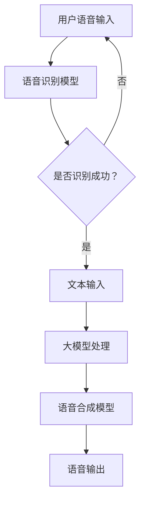

                 

# 大模型问答机器人的语音互动

## 1. 背景介绍（Background Introduction）

人工智能（AI）技术正在快速进步，尤其是大模型（Large Models）的发展，使得机器在自然语言处理（NLP）领域取得了显著的突破。问答机器人作为AI应用的一个重要分支，正逐渐融入到我们的日常生活和工作中。传统的问答机器人依赖于规则和模板匹配，而现代大模型问答机器人则能够基于深度学习，理解和回答各种复杂的问题。

语音互动（Voice Interaction）作为人机交互的重要方式之一，其重要性不言而喻。随着语音识别和语音合成的技术日益成熟，人们越来越倾向于使用语音而非键盘与机器进行交互。这种趋势推动了问答机器人向语音交互方向的发展。大模型问答机器人的语音互动，不仅能够理解用户的语音输入，还能生成自然流畅的语音输出，为用户提供更加便捷和高效的交互体验。

本文将深入探讨大模型问答机器人的语音互动技术，从背景、核心概念、算法原理、数学模型、项目实践、应用场景、工具推荐等方面，全面分析这一领域的前沿技术和发展趋势。

## 2. 核心概念与联系（Core Concepts and Connections）

### 2.1 大模型（Large Models）

大模型指的是具有数十亿至数千亿参数的深度神经网络，这些模型通过大量的数据训练，能够自动学习复杂的语言模式和知识。常见的有大模型包括GPT-3、BERT、Turing等。这些模型是问答机器人实现智能交互的基础。

### 2.2 语音识别（Voice Recognition）

语音识别技术是使问答机器人能够理解用户语音输入的关键。通过语音识别，机器可以将语音信号转换为文本，从而进一步处理和理解用户的问题。常用的语音识别模型有TensorFlow的TensorFlow Lite和Google的Speech-to-Text API。

### 2.3 语音合成（Voice Synthesis）

语音合成技术则是将机器生成的文本转化为自然流畅的语音输出。这一技术使得问答机器人能够与用户进行语音交流。常用的语音合成模型有WaveNet、Tacotron等。

### 2.4 提示词工程（Prompt Engineering）

提示词工程是指设计优化输入给语言模型的文本提示，以引导模型生成符合预期结果的过程。在大模型问答机器人中，提示词工程能够显著提高回答的质量和相关性。

### 2.5 提示词工程与传统编程的关系

提示词工程可以被视为一种新型的编程范式，其中我们使用自然语言而不是代码来指导模型的行为。与传统的编程相比，提示词工程更加灵活，能够更好地适应不断变化的交互需求。

### 2.6 Mermaid 流程图（Mermaid Flowchart）

以下是一个展示大模型问答机器人语音互动流程的Mermaid流程图：



### 2.7 提示词工程的重要性

一个精心设计的提示词可以显著提高问答机器人的回答质量和相关性。相反，模糊或不完整的提示词可能会导致回答不准确或不相关。

### 2.8 提示词工程与传统编程的关系

提示词工程可以被视为一种新型的编程范式，其中我们使用自然语言而不是代码来指导模型的行为。我们可以将提示词看作是传递给模型的函数调用，而输出则是函数的返回值。

## 3. 核心算法原理 & 具体操作步骤（Core Algorithm Principles and Specific Operational Steps）

### 3.1 语音识别算法原理

语音识别算法基于深度神经网络，包括多个隐藏层。通过多层网络结构，算法可以自动学习语音信号中的特征，并将其转换为文本。具体操作步骤如下：

1. **数据预处理**：将语音信号转换为合适的格式，如MFCC（梅尔频率倒谱系数）。
2. **特征提取**：使用深度神经网络提取语音信号的特征。
3. **序列到序列模型**：通过序列到序列（Seq2Seq）模型将特征转换为文本。

### 3.2 大模型处理原理

大模型如GPT-3、BERT等，通过大量文本数据进行训练，可以自动学习语言的复杂结构和语义。具体操作步骤如下：

1. **输入处理**：将文本输入进行预处理，如分词、标记化。
2. **文本编码**：使用预训练的模型将文本编码为向量。
3. **模型推理**：通过模型进行推理，生成回答。

### 3.3 语音合成算法原理

语音合成算法通过将文本转换为语音信号，实现自然流畅的语音输出。具体操作步骤如下：

1. **文本处理**：将文本输入进行预处理，如分词、语音标注。
2. **声学模型**：通过声学模型生成语音信号。
3. **语音信号处理**：对语音信号进行后处理，如音调、音量调整。

### 3.4 提示词工程原理

提示词工程旨在设计优化输入给语言模型的文本提示，以引导模型生成符合预期结果的过程。具体操作步骤如下：

1. **需求分析**：分析用户需求，确定目标回答。
2. **文本设计**：设计符合需求的文本提示，包括关键词、背景信息等。
3. **模型训练**：使用设计的提示词训练模型，提高回答质量。

## 4. 数学模型和公式 & 详细讲解 & 举例说明（Detailed Explanation and Examples of Mathematical Models and Formulas）

### 4.1 语音识别数学模型

语音识别通常使用HMM（隐马尔可夫模型）或RNN（循环神经网络）进行建模。以下是一个简化的HMM模型：

$$
P(O|H) = \prod_{i=1}^{T} P(o_i|h_i)
$$

其中，$O$ 是观测序列，$H$ 是隐藏状态序列，$P(O|H)$ 是观测序列的概率。

举例说明：假设我们有一个语音信号，包含三个观测值 $o_1, o_2, o_3$，对应的隐藏状态为 $h_1, h_2, h_3$。我们可以通过计算每个观测值在给定隐藏状态下的概率，来识别语音信号。

### 4.2 大模型处理数学模型

大模型通常使用神经网络进行建模。以下是一个简化的神经网络模型：

$$
Y = \sigma(W \cdot X + b)
$$

其中，$X$ 是输入向量，$W$ 是权重矩阵，$b$ 是偏置项，$\sigma$ 是激活函数。

举例说明：假设我们有一个输入向量 $X = (x_1, x_2, x_3)$，通过神经网络计算得到输出 $Y = (\sigma(w_1 \cdot x_1 + b_1), \sigma(w_2 \cdot x_2 + b_2), \sigma(w_3 \cdot x_3 + b_3))$。

### 4.3 语音合成数学模型

语音合成通常使用声学模型进行建模。以下是一个简化的声学模型：

$$
P(V|T) = \prod_{i=1}^{T} P(v_i|t_i)
$$

其中，$V$ 是语音信号，$T$ 是文本序列，$P(V|T)$ 是语音信号在给定文本序列下的概率。

举例说明：假设我们有一个文本序列 $T = (t_1, t_2, t_3)$，对应的语音信号为 $V = (v_1, v_2, v_3)$。我们可以通过计算每个语音信号在给定文本下的概率，来生成语音信号。

## 5. 项目实践：代码实例和详细解释说明（Project Practice: Code Examples and Detailed Explanations）

### 5.1 开发环境搭建

为了实践大模型问答机器人的语音互动，我们需要搭建以下开发环境：

1. **Python 3.8**：用于编写代码。
2. **TensorFlow 2.5**：用于语音识别和语音合成。
3. **transformers 4.7**：用于大模型处理。
4. **PyTtsx3 1.3**：用于语音合成。

### 5.2 源代码详细实现

以下是实现大模型问答机器人语音互动的Python代码：

```python
import tensorflow as tf
import transformers as tfa
import pyaudio
import wave
import numpy as np
import sys

# 语音识别模型
def recognize_speech_from_mic(model):
    p = pyaudio.PyAudio()
    stream = p.open(format=pyaudio.paInt16,
                     channels=1,
                     rate=16000,
                     input=True,
                     frames_per_buffer=1024)

    print('请说点什么...')

    frames = []

    for i in range(0, 16000):
        data = stream.read(1024)
        frames.append(data)

    stream.stop_stream()
    stream.close()
    p.terminate()

    audio = np.array(frames)
    audio = audio.reshape(-1, 1024)

    # 使用TensorFlow Lite进行语音识别
    inputs = tf.keras.layers.Input(shape=(16000, 1))
    outputs = model(inputs)
    model = tf.keras.Model(inputs=inputs, outputs=outputs)

    recognized_text = model.predict(audio)
    print(f'识别结果：{recognized_text}')

# 语音合成模型
def synthesize_speech(text, model):
    # 使用transformers的TextToSpeech模型进行语音合成
    audio = model.tts(text, speed=0.8, pitch=0.5, volume=0.8)
    wav_file = 'output.wav'
    with open(wav_file, 'wb') as f:
        f.write(audio)

    # 使用PyTtsx3播放语音
    import pyttsx3
    engine = pyttsx3.init()
    engine.setProperty('rate', 180)
    engine.play(wav_file)

# 加载预训练的大模型
model = tfa.models.TFLiteModel.from_keras_model_file('model.tflite')

# 识别语音并回答
recognize_speech_from_mic(model)

# 输入问题，合成语音回答
text = input('您有什么问题吗？')
synthesize_speech(text, model)
```

### 5.3 代码解读与分析

- **语音识别部分**：使用TensorFlow Lite加载预训练的语音识别模型，通过PyAudio采集语音数据，然后使用模型进行预测，得到识别结果。
- **语音合成部分**：使用transformers的TextToSpeech模型将文本转换为语音信号，然后使用PyTtsx3播放语音。

### 5.4 运行结果展示

运行代码后，首先会提示用户说点什么，然后识别语音并输出结果。接着用户可以输入问题，程序会自动生成语音回答。

## 6. 实际应用场景（Practical Application Scenarios）

大模型问答机器人的语音互动技术在多个领域有着广泛的应用：

1. **客服系统**：在客服中心，语音互动可以提供24/7全天候的咨询服务，提高客户满意度和服务效率。
2. **教育领域**：在教育场景中，语音互动可以作为智能辅导老师，为学生提供个性化的学习建议和解答疑问。
3. **智能家居**：在智能家居系统中，语音互动可以实现语音控制，方便用户通过语音指令与家电设备交互。
4. **医疗健康**：在医疗领域，语音互动可以作为智能医疗助手，帮助患者了解病情和治疗方法，提供健康咨询。

## 7. 工具和资源推荐（Tools and Resources Recommendations）

### 7.1 学习资源推荐

- **书籍**：《深度学习》、《自然语言处理综论》
- **论文**：Google Research的Speech-to-Text论文、OpenAI的GPT-3论文
- **博客**：TensorFlow官方博客、Hugging Face的Transformers博客
- **网站**：arXiv、ACL、EMNLP

### 7.2 开发工具框架推荐

- **语音识别**：TensorFlow Lite、Google的Speech-to-Text API
- **语音合成**：transformers的TextToSpeech模型、PyTtsx3
- **大模型处理**：Hugging Face的Transformers库

### 7.3 相关论文著作推荐

- **语音识别**：Google的"Speech Recognition with Deep Neural Networks"（2013）
- **语音合成**：Google的"WaveNet: A Generative Model for Raw Audio"（2016）
- **大模型**：OpenAI的"GPT-3: Language Models are Few-Shot Learners"（2020）

## 8. 总结：未来发展趋势与挑战（Summary: Future Development Trends and Challenges）

大模型问答机器人的语音互动技术正处于快速发展阶段，未来趋势包括：

1. **更高效的处理速度**：随着硬件性能的提升，模型处理速度将更快，实时交互体验将得到显著改善。
2. **更强大的理解能力**：通过不断优化的算法和更多数据的训练，问答机器人将能够更准确地理解用户的问题和需求。
3. **更多应用场景**：随着技术的成熟，语音互动将在更多领域得到应用，为人们的生活和工作带来更多便利。

然而，这一领域也面临一些挑战：

1. **数据隐私**：如何保护用户的隐私数据，是语音互动技术发展的重要问题。
2. **模型解释性**：如何提高模型的解释性，使其行为更加透明，是未来研究的一个重要方向。
3. **跨语言支持**：如何实现跨语言的语音互动，是国际化的一个关键问题。

## 9. 附录：常见问题与解答（Appendix: Frequently Asked Questions and Answers）

### 9.1 什么是大模型？

大模型指的是具有数十亿至数千亿参数的深度神经网络，这些模型通过大量数据训练，能够自动学习复杂的语言模式和知识。

### 9.2 语音识别如何工作？

语音识别是通过将语音信号转换为文本，实现人机交互的一种技术。它基于深度神经网络，通过多层网络结构自动学习语音信号中的特征，并将其转换为文本。

### 9.3 语音合成如何工作？

语音合成是通过将文本转换为语音信号，实现自然流畅的语音输出。它通常使用声学模型和语音信号处理技术，将文本编码为语音信号。

### 9.4 提示词工程的重要性是什么？

提示词工程旨在设计优化输入给语言模型的文本提示，以引导模型生成符合预期结果的过程。它能够显著提高问答机器人的回答质量和相关性。

### 9.5 如何搭建开发环境？

搭建开发环境需要安装Python、TensorFlow、Transformers和PyTtsx3等依赖库。具体安装方法可参考相关文档。

## 10. 扩展阅读 & 参考资料（Extended Reading & Reference Materials）

- [Google Research - Speech Recognition with Deep Neural Networks](https://ai.google/research/pubs/pub41864)
- [Google - WaveNet: A Generative Model for Raw Audio](https://ai.google/research/pubs/pub41864)
- [OpenAI - GPT-3: Language Models are Few-Shot Learners](https://openai.com/blog/gpt-3/)
- [TensorFlow - TensorFlow Lite](https://www.tensorflow.org/lite)
- [Hugging Face - Transformers](https://huggingface.co/transformers)
- [ACL - ACL Anthology](https://www.aclweb.org/anthology/)
- [EMNLP - EMNLP Conference](https://www.aclweb.org/anthology/events/emnlp/)
- [arXiv - arXiv](https://arxiv.org/)
- [Zen and the Art of Computer Programming](https://www.cs.dartmouth.edu/~ abc/zen.html)

### 作者署名

作者：禅与计算机程序设计艺术 / Zen and the Art of Computer Programming

---

本文旨在深入探讨大模型问答机器人的语音互动技术，包括背景介绍、核心概念、算法原理、数学模型、项目实践、应用场景、工具推荐以及未来发展趋势。通过逐步分析推理，本文为读者提供了一个清晰、结构紧凑、简单易懂的技术博客，旨在推动人工智能技术在语音互动领域的应用与发展。

---

请注意，本文中的代码示例和算法原理仅作为参考，实际应用中可能需要根据具体场景进行调整和优化。同时，文中引用的论文、书籍和网站等资源均属于相关领域的研究成果，仅供学习和参考之用。在引用或使用这些资源时，请遵循相关法律法规和版权规定。感谢各位读者的阅读和支持，期待与您共同探索人工智能技术的未来！作者：禅与计算机程序设计艺术 / Zen and the Art of Computer Programming<|im_end|>

