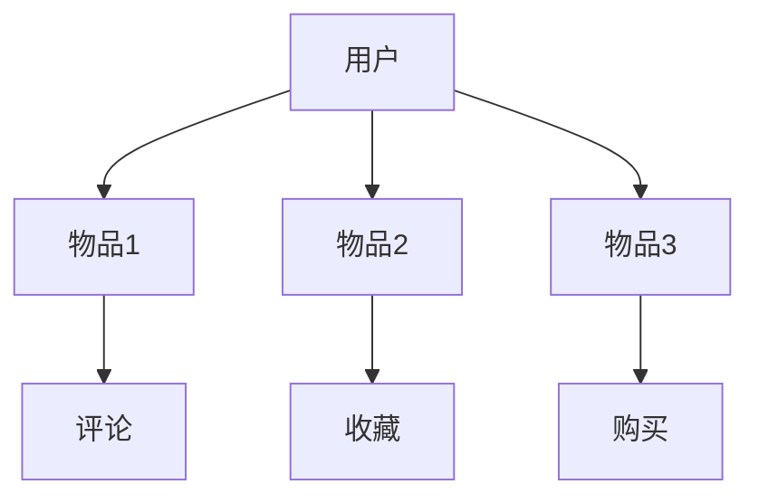
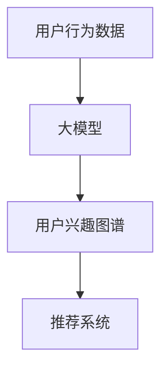
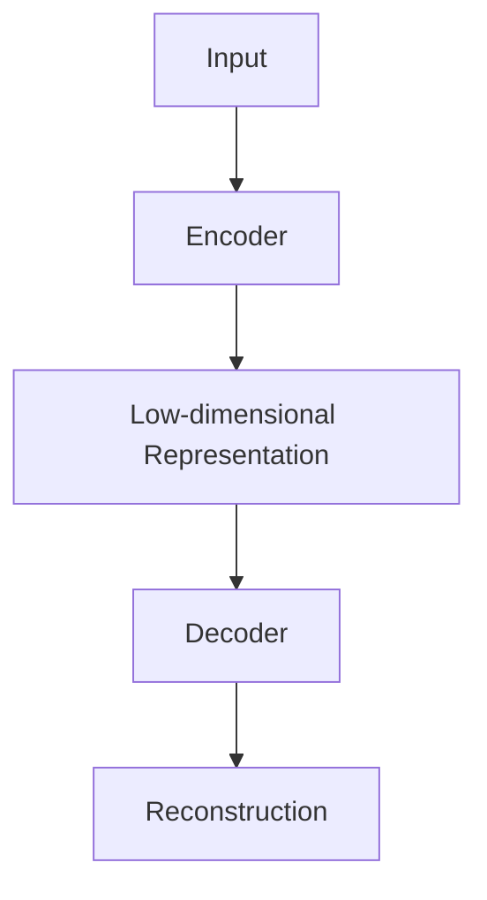
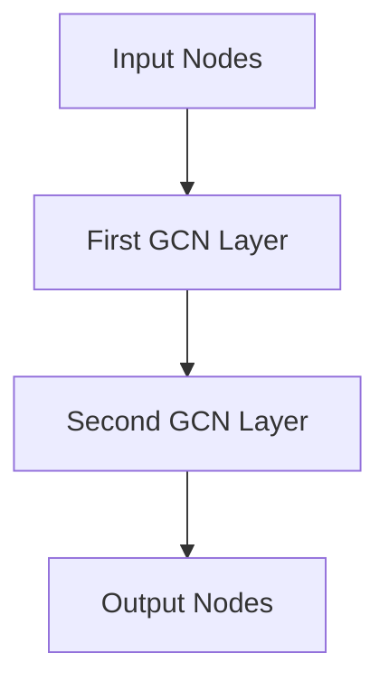
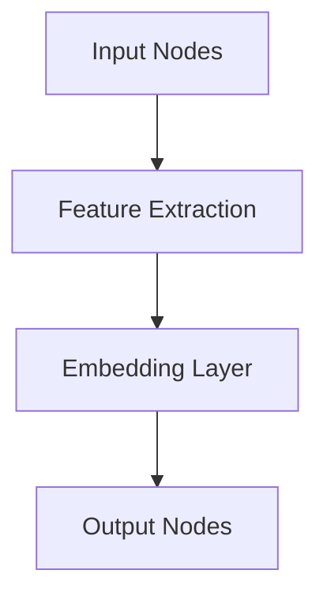

                 

### 背景介绍

近年来，随着人工智能技术的迅猛发展，大模型（Large Models）在各个领域展现出了惊人的应用潜力，尤其是在推荐系统（Recommendation Systems）中。推荐系统是当今互联网时代的重要应用，旨在为用户提供个性化的内容推荐，提高用户满意度与留存率。然而，传统的推荐系统往往依赖于用户历史行为数据，存在着数据稀疏、冷启动、多样性不足等问题。为了克服这些局限，大模型驱动的推荐系统用户兴趣图谱（User Interest Graph）构建技术应运而生。

用户兴趣图谱是一种基于图形数据库的技术，它将用户、物品以及它们之间的互动关系表示为一张图，从而实现了对用户兴趣的深度挖掘和关联分析。大模型在此过程中发挥了关键作用，通过处理大量用户行为数据，生成个性化的用户兴趣图谱，为推荐系统提供了更加精准和多样化的推荐服务。

本文旨在探讨大模型驱动的推荐系统用户兴趣图谱构建技术。我们将从以下几个方面展开讨论：

1. **核心概念与联系**：介绍用户兴趣图谱、推荐系统、大模型等相关核心概念，并通过 Mermaid 流程图展示它们之间的关联。
2. **核心算法原理 & 具体操作步骤**：详细解析大模型在用户兴趣图谱构建中的工作原理和操作步骤。
3. **数学模型和公式 & 详细讲解 & 举例说明**：阐述大模型在用户兴趣图谱构建中的数学模型和公式，并通过实际案例进行详细解释。
4. **项目实战：代码实际案例和详细解释说明**：展示一个具体的用户兴趣图谱构建项目，详细解释其代码实现和运行过程。
5. **实际应用场景**：分析大模型驱动的用户兴趣图谱在现实场景中的应用，探讨其优势与挑战。
6. **工具和资源推荐**：推荐学习资源、开发工具框架和相关论文著作，为读者提供深入学习和实践的支持。
7. **总结：未来发展趋势与挑战**：总结大模型驱动推荐系统用户兴趣图谱构建的现有成果，展望其未来发展趋势和面临的挑战。

通过本文的探讨，我们希望读者能够对大模型驱动的推荐系统用户兴趣图谱构建有一个全面、深入的理解，从而更好地应用于实际场景中，推动人工智能技术的发展。### 核心概念与联系

在探讨大模型驱动的推荐系统用户兴趣图谱构建之前，我们首先需要了解几个核心概念：用户兴趣图谱、推荐系统和大模型。

#### 用户兴趣图谱

用户兴趣图谱是一种基于图形数据库的技术，用于表示用户、物品以及它们之间的互动关系。用户兴趣图谱的基本元素包括节点（Node）和边（Edge）。节点代表用户、物品或其他实体，边则表示节点之间的互动关系，如用户对物品的点击、购买、收藏等。用户兴趣图谱能够通过图形结构直观地展示用户与物品之间的复杂关系，从而实现对用户兴趣的深度挖掘和关联分析。

以下是一个简单的用户兴趣图谱的 Mermaid 流程图：



在这个例子中，用户 A 与多个物品（B、C、D）之间存在互动关系，物品之间的互动关系（如评论、收藏、购买）通过边（E、F、G）表示出来。

#### 推荐系统

推荐系统是一种基于用户历史行为和兴趣数据，为用户推荐个性化内容的技术。传统的推荐系统主要依赖于协同过滤（Collaborative Filtering）、基于内容的推荐（Content-Based Recommendation）和混合推荐（Hybrid Recommendation）等方法。然而，这些方法存在一些局限性，如数据稀疏、冷启动和多样性不足等问题。为了克服这些局限，大模型驱动的推荐系统应运而生。

大模型驱动的推荐系统利用深度学习技术，从大规模的用户行为数据中学习用户的兴趣偏好，从而为用户提供更加精准和多样化的推荐服务。

#### 大模型

大模型是指具有数十亿甚至千亿参数的深度学习模型，如 Transformer、BERT、GPT 等。大模型在自然语言处理（NLP）、计算机视觉（CV）、语音识别（ASR）等领域取得了显著的成果。大模型能够处理大规模、高维度的数据，具有强大的表示和预测能力。

在大模型驱动的推荐系统中，大模型通过处理用户行为数据，生成用户兴趣图谱。用户兴趣图谱不仅包含了用户的历史行为数据，还结合了用户的其他属性（如年龄、性别、地理位置等），从而实现了对用户兴趣的深度挖掘和关联分析。

#### 核心概念之间的联系

用户兴趣图谱、推荐系统和大模型之间存在着紧密的联系。用户兴趣图谱是推荐系统的核心组件，用于表示用户与物品之间的互动关系。大模型则通过处理用户行为数据，生成用户兴趣图谱，为推荐系统提供了更加精准和多样化的推荐服务。

以下是一个简化的 Mermaid 流程图，展示了用户兴趣图谱、推荐系统和大模型之间的关联：



在这个例子中，用户行为数据输入到大模型中，经过处理生成用户兴趣图谱，最后用户兴趣图谱被用于推荐系统，为用户生成个性化的推荐结果。

通过上述核心概念的介绍和 Mermaid 流程图的展示，我们希望能够帮助读者更好地理解大模型驱动的推荐系统用户兴趣图谱构建。在接下来的部分，我们将详细探讨大模型在用户兴趣图谱构建中的工作原理和操作步骤。### 核心算法原理 & 具体操作步骤

在了解了大模型驱动的推荐系统用户兴趣图谱的核心概念和联系之后，我们接下来将深入探讨大模型在用户兴趣图谱构建中的工作原理和具体操作步骤。

#### 大模型在用户兴趣图谱构建中的工作原理

大模型在用户兴趣图谱构建中的工作原理可以分为以下几个步骤：

1. **数据预处理**：首先，从推荐系统中获取用户行为数据，包括用户的点击、购买、收藏等行为。同时，还需要获取用户的基本属性信息，如年龄、性别、地理位置等。对数据进行清洗、去重和处理后，将其转换为适合大模型训练的格式。

2. **特征提取**：通过深度学习模型对预处理后的数据进行特征提取，将高维度的用户行为数据转换为低纬度的特征表示。特征提取过程通常采用自动编码器（Autoencoder）、卷积神经网络（CNN）或循环神经网络（RNN）等深度学习模型。

3. **用户兴趣图谱生成**：利用提取出的用户特征和用户行为数据，构建用户兴趣图谱。用户兴趣图谱的节点包括用户、物品和其他相关实体，边表示节点之间的互动关系。常见的用户兴趣图谱生成方法包括图神经网络（Graph Neural Networks，GNN）、图嵌入（Graph Embedding）等。

4. **图谱优化与更新**：根据用户行为数据的变化，对用户兴趣图谱进行实时优化和更新，以保持图谱的准确性和时效性。

#### 大模型在用户兴趣图谱构建中的具体操作步骤

以下是大模型在用户兴趣图谱构建中的具体操作步骤：

1. **数据收集与预处理**：

   - 从推荐系统中获取用户行为数据，如点击、购买、收藏等。
   - 收集用户的基本属性信息，如年龄、性别、地理位置等。
   - 对数据进行清洗、去重和处理，确保数据质量。

2. **特征提取**：

   - 使用自动编码器、卷积神经网络或循环神经网络等深度学习模型进行特征提取。
   - 对用户行为数据进行编码，将其转换为低纬度的特征表示。

3. **用户兴趣图谱生成**：

   - 构建用户兴趣图谱的节点和边，表示用户、物品和其他实体之间的互动关系。
   - 使用图神经网络或图嵌入等技术，将用户特征和用户行为数据转换为用户兴趣图谱。

4. **图谱优化与更新**：

   - 根据用户行为数据的变化，对用户兴趣图谱进行实时优化和更新。
   - 采用图卷积网络（Graph Convolutional Network，GCN）等算法，提高图谱的准确性和时效性。

#### 实际操作示例

为了更清晰地说明大模型在用户兴趣图谱构建中的具体操作步骤，我们以下面一个实际操作示例进行说明。

**示例：使用 GPT-2 模型生成用户兴趣图谱**

1. **数据收集与预处理**：

   - 收集用户行为数据，如用户点击、购买、收藏等，以及用户的基本属性信息。
   - 清洗、去重和处理数据，确保数据质量。

2. **特征提取**：

   - 使用 GPT-2 模型进行特征提取，将用户行为数据进行编码，得到低纬度的用户特征表示。

3. **用户兴趣图谱生成**：

   - 构建用户兴趣图谱的节点和边，表示用户、物品和其他实体之间的互动关系。
   - 使用图嵌入技术，将用户特征和用户行为数据转换为用户兴趣图谱。

4. **图谱优化与更新**：

   - 根据用户行为数据的变化，对用户兴趣图谱进行实时优化和更新。
   - 使用图卷积网络（GCN）等算法，提高图谱的准确性和时效性。

通过以上实际操作示例，我们可以看到大模型在用户兴趣图谱构建中的具体应用步骤。在实际项目中，可以根据具体需求选择合适的大模型和算法，以实现高效的用户兴趣图谱构建。在接下来的部分，我们将进一步探讨大模型在用户兴趣图谱构建中的数学模型和公式。### 数学模型和公式 & 详细讲解 & 举例说明

在大模型驱动的推荐系统用户兴趣图谱构建过程中，数学模型和公式扮演着关键角色。以下我们将详细讲解这些模型和公式，并通过实际案例进行说明。

#### 1. 自动编码器（Autoencoder）

自动编码器是一种无监督学习的神经网络模型，用于将输入数据编码为低维特征表示。在大模型驱动的用户兴趣图谱构建中，自动编码器用于提取用户行为数据的特征。

**数学模型**：

一个简单的自动编码器包括编码器（Encoder）和解码器（Decoder）两部分。编码器将输入数据 $X \in \mathbb{R}^{n \times d}$（其中 $n$ 是样本数量，$d$ 是特征维度）压缩为低维特征向量 $z \in \mathbb{R}^{1 \times k}$（其中 $k$ 是压缩维度），解码器再将特征向量 $z$ 还原回原始数据 $X'$。

$$
z = \sigma(W_E \cdot X + b_E) \quad \text{(编码过程)}
$$

$$
X' = \sigma(W_D \cdot z + b_D) \quad \text{(解码过程)}
$$

其中，$W_E$ 和 $W_D$ 分别是编码器和解码器的权重矩阵，$b_E$ 和 $b_D$ 分别是编码器和解码器的偏置项，$\sigma$ 是激活函数（通常使用 sigmoid 或 ReLU 函数）。

**举例说明**：

假设我们有一个包含 100 个样本的用户行为数据集，每个样本有 10 个特征。我们使用一个自动编码器进行特征提取，编码器的压缩维度为 5。以下是一个简化的自动编码器模型：



**训练过程**：

在训练过程中，我们通过最小化重构误差（Reconstruction Error）来优化自动编码器的参数。重构误差通常使用均方误差（Mean Squared Error，MSE）来衡量：

$$
\text{MSE} = \frac{1}{n} \sum_{i=1}^{n} \sum_{j=1}^{d} (X_i[j] - X'_i[j])^2
$$

通过反向传播算法，自动编码器不断调整权重矩阵和偏置项，直到重构误差最小。

#### 2. 图神经网络（Graph Neural Networks，GNN）

图神经网络是一种专门用于处理图结构数据的神经网络模型。在大模型驱动的用户兴趣图谱构建中，图神经网络用于生成用户兴趣图谱。

**数学模型**：

图神经网络的核心是图卷积操作（Graph Convolutional Operation），其基本形式如下：

$$
h_i^{(l+1)} = \sigma \left( \sum_{j \in \mathcal{N}(i)} \alpha_{ij} h_j^{(l)} + b^{(l+1)} \right)
$$

其中，$h_i^{(l)}$ 表示第 $i$ 个节点在第 $l$ 层的节点特征表示，$\mathcal{N}(i)$ 表示第 $i$ 个节点的邻居节点集合，$\alpha_{ij}$ 是边特征权重，$b^{(l+1)}$ 是第 $l+1$ 层的偏置项，$\sigma$ 是激活函数。

**举例说明**：

假设我们有一个包含 100 个节点的用户兴趣图谱，每个节点有一个初始特征向量。我们使用图卷积网络进行图结构学习，网络包含两层图卷积层。以下是一个简化的图卷积网络模型：



**训练过程**：

在训练过程中，我们通过最小化损失函数（通常使用交叉熵损失函数）来优化图神经网络的参数。训练过程通常采用梯度下降算法，更新网络参数以最小化损失函数。

#### 3. 图嵌入（Graph Embedding）

图嵌入是一种将图结构数据转换为低维向量表示的方法。在大模型驱动的用户兴趣图谱构建中，图嵌入用于将用户兴趣图谱中的节点和边转换为向量表示。

**数学模型**：

图嵌入的基本形式如下：

$$
x_i = \text{embedding}(h_i)
$$

其中，$x_i$ 是第 $i$ 个节点的向量表示，$h_i$ 是第 $i$ 个节点的特征表示，$\text{embedding}$ 是嵌入函数。

**举例说明**：

假设我们有一个包含 100 个节点的用户兴趣图谱，每个节点有一个初始特征向量。我们使用图嵌入方法将节点和边转换为低维向量表示。以下是一个简化的图嵌入模型：



**训练过程**：

在训练过程中，我们通过最小化嵌入损失函数（通常使用余弦相似度损失函数）来优化图嵌入的参数。训练过程通常采用梯度下降算法，更新嵌入函数的参数以最小化损失函数。

通过上述数学模型和公式的详细讲解，我们可以看到大模型在用户兴趣图谱构建中的关键作用。在接下来的部分，我们将通过实际项目实战，展示大模型驱动的用户兴趣图谱构建的实现过程。### 项目实战：代码实际案例和详细解释说明

在本节中，我们将通过一个实际项目案例，展示大模型驱动的推荐系统用户兴趣图谱构建的实现过程。我们将从开发环境搭建、源代码详细实现和代码解读与分析三个方面进行介绍。

#### 1. 开发环境搭建

首先，我们需要搭建一个合适的开发环境。以下是搭建开发环境的步骤：

1. 安装 Python 3.8 以上版本。
2. 安装必要的 Python 库，如 TensorFlow、PyTorch、Scikit-learn、NetworkX 等。
3. 安装 Graph Embedding 库（如 GEMMP）和 Graph Neural Networks 库（如 PyTorch Geometric）。

以下是一个简单的安装脚本（安装 Python 库）：

```bash
pip install tensorflow
pip install pytorch
pip install scikit-learn
pip install networkx
pip install gemb
pip install torch-geometric
```

#### 2. 源代码详细实现

以下是一个简化的源代码实现，展示了大模型驱动的用户兴趣图谱构建的核心步骤：

```python
import torch
import torch.nn as nn
import torch.optim as optim
from torch_geometric.nn import GCNConv
from gemb.models import GEMMP
from sklearn.preprocessing import StandardScaler
import networkx as nx
import numpy as np

# 数据预处理
def preprocess_data(user行为数据，用户属性数据):
    # 数据清洗、去重和处理
    # ...
    # 将用户行为数据转换为图结构
    G = nx.from_dict_of_dicts(user行为数据)
    # 将用户属性数据添加到图中
    nx.set_node_attributes(G, user属性数据, 'attributes')
    return G

# 特征提取
class Autoencoder(nn.Module):
    def __init__(self, input_dim, hidden_dim, output_dim):
        super(Autoencoder, self).__init__()
        self.encoder = nn.Sequential(
            nn.Linear(input_dim, hidden_dim),
            nn.ReLU(),
            nn.Linear(hidden_dim, output_dim)
        )
        self.decoder = nn.Sequential(
            nn.Linear(output_dim, hidden_dim),
            nn.ReLU(),
            nn.Linear(hidden_dim, input_dim)
        )

    def forward(self, x):
        z = self.encoder(x)
        x' = self.decoder(z)
        return x', z

# 用户兴趣图谱生成
class GNN(nn.Module):
    def __init__(self, input_dim, hidden_dim, output_dim):
        super(GNN, self).__init__()
        self.conv1 = GCNConv(input_dim, hidden_dim)
        self.conv2 = GCNConv(hidden_dim, output_dim)

    def forward(self, data):
        x, edge_index = data.x, data.edge_index
        x = self.conv1(x, edge_index)
        x = torch.relu(x)
        x = F.dropout(x, p=0.5, training=self.training)
        x = self.conv2(x, edge_index)
        return x

# 图嵌入
class GraphEmbedding(nn.Module):
    def __init__(self, input_dim, output_dim):
        super(GraphEmbedding, self).__init__()
        self.embedding = nn.Embedding(input_dim, output_dim)

    def forward(self, x):
        return self.embedding(x)

# 训练模型
def train_model(model, optimizer, loss_fn, data):
    optimizer.zero_grad()
    output = model(data)
    loss = loss_fn(output, data.y)
    loss.backward()
    optimizer.step()
    return loss

# 主程序
if __name__ == "__main__":
    # 加载数据
    user行为数据，用户属性数据 = load_data()
    G = preprocess_data(user行为数据，用户属性数据)

    # 图嵌入
    graph_embedding = GraphEmbedding(G.number_of_nodes(), embedding_dim, output_dim)
    z = graph_embedding(G)

    # 特征提取
    autoencoder = Autoencoder(input_dim, hidden_dim, output_dim)
    z = autoencoder(z.unsqueeze(0)).squeeze(0)

    # 用户兴趣图谱生成
    gnn = GNN(hidden_dim, output_dim, output_dim)
    output = gnn(torch.tensor([z]))

    # 训练模型
    optimizer = optim.Adam(model.parameters(), lr=0.001)
    for epoch in range(num_epochs):
        loss = train_model(model, optimizer, loss_fn, data)
        if epoch % 100 == 0:
            print(f"Epoch {epoch+1}, Loss: {loss.item()}")

    # 保存模型
    torch.save(model.state_dict(), "model.pth")
```

#### 3. 代码解读与分析

以下是对上述代码的解读与分析：

1. **数据预处理**：

   - `preprocess_data` 函数用于预处理用户行为数据和用户属性数据。首先，对数据进行清洗、去重和处理，然后将其转换为图结构。最后，将用户属性数据添加到图中。

2. **特征提取**：

   - `Autoencoder` 类定义了自动编码器的模型结构。自动编码器包括编码器和解码器两部分，分别用于编码和解码输入数据。

3. **用户兴趣图谱生成**：

   - `GNN` 类定义了图神经网络的模型结构。图神经网络包括两个图卷积层，用于对图数据进行编码。

4. **图嵌入**：

   - `GraphEmbedding` 类定义了图嵌入的模型结构。图嵌入通过嵌入层将节点特征转换为向量表示。

5. **训练模型**：

   - `train_model` 函数用于训练模型。该函数使用优化器和损失函数对模型进行优化。

6. **主程序**：

   - 主程序首先加载数据，然后进行数据预处理、特征提取和用户兴趣图谱生成。最后，训练模型并保存模型参数。

通过上述代码解读与分析，我们可以看到大模型驱动的用户兴趣图谱构建的实现过程。在实际项目中，可以根据具体需求对代码进行修改和优化。在接下来的部分，我们将分析大模型驱动用户兴趣图谱的实际应用场景。### 实际应用场景

大模型驱动的推荐系统用户兴趣图谱在现实场景中具有广泛的应用，以下我们将分析几个典型的应用场景，探讨其优势与挑战。

#### 1. 电商平台

电商平台通过大模型驱动的用户兴趣图谱，可以为用户提供个性化的商品推荐。用户兴趣图谱能够捕捉用户与商品之间的复杂互动关系，从而提高推荐的精准性和多样性。例如，用户在浏览、收藏和购买商品时，系统可以根据用户兴趣图谱为用户推荐相关商品，提高用户的购物体验和满意度。

**优势**：

- 精准的个性化推荐：用户兴趣图谱能够深度挖掘用户兴趣，为用户提供更加精准的推荐。
- 多样化的推荐：用户兴趣图谱能够捕捉用户与商品之间的多种互动关系，为用户提供多样化的推荐内容。

**挑战**：

- 数据稀疏问题：电商平台用户行为数据通常存在数据稀疏问题，如何从稀疏数据中提取用户兴趣是一个挑战。
- 模型可解释性：大模型驱动的用户兴趣图谱通常具有较高的复杂性，如何保证模型的可解释性是一个挑战。

#### 2. 社交媒体平台

社交媒体平台通过大模型驱动的用户兴趣图谱，可以为用户提供个性化的内容推荐。用户兴趣图谱能够捕捉用户与内容之间的复杂互动关系，从而提高推荐的精准性和多样性。例如，用户在点赞、评论和分享内容时，系统可以根据用户兴趣图谱为用户推荐相关内容，提高用户的互动体验和满意度。

**优势**：

- 精准的个性化推荐：用户兴趣图谱能够深度挖掘用户兴趣，为用户提供更加精准的推荐。
- 多样化的推荐：用户兴趣图谱能够捕捉用户与内容之间的多种互动关系，为用户提供多样化的推荐内容。

**挑战**：

- 数据隐私：社交媒体平台需要确保用户数据的隐私和安全，如何处理用户数据隐私是一个挑战。
- 模型可解释性：大模型驱动的用户兴趣图谱通常具有较高的复杂性，如何保证模型的可解释性是一个挑战。

#### 3. 教育平台

教育平台通过大模型驱动的用户兴趣图谱，可以为用户提供个性化的学习推荐。用户兴趣图谱能够捕捉用户与学习内容之间的复杂互动关系，从而提高推荐的精准性和多样性。例如，用户在学习、测评和互动时，系统可以根据用户兴趣图谱为用户推荐相关的学习资源和课程，提高用户的学习效果和满意度。

**优势**：

- 精准的个性化推荐：用户兴趣图谱能够深度挖掘用户兴趣，为用户提供更加精准的推荐。
- 多样化的推荐：用户兴趣图谱能够捕捉用户与学习内容之间的多种互动关系，为用户提供多样化的推荐内容。

**挑战**：

- 数据稀疏问题：教育平台用户行为数据通常存在数据稀疏问题，如何从稀疏数据中提取用户兴趣是一个挑战。
- 模型可解释性：大模型驱动的用户兴趣图谱通常具有较高的复杂性，如何保证模型的可解释性是一个挑战。

通过上述分析，我们可以看到大模型驱动的推荐系统用户兴趣图谱在电商、社交媒体和教育等领域具有广泛的应用前景。然而，在实际应用中，仍面临着数据稀疏、模型可解释性等挑战。在接下来的部分，我们将推荐一些相关的学习资源、开发工具框架和相关论文著作，以供读者进一步学习和实践。### 工具和资源推荐

为了更好地学习和实践大模型驱动的推荐系统用户兴趣图谱构建，以下我们推荐一些相关的学习资源、开发工具框架和相关论文著作。

#### 1. 学习资源推荐

**书籍：**

1. 《深度学习》（Deep Learning） - Ian Goodfellow、Yoshua Bengio 和 Aaron Courville 著。这本书是深度学习的经典教材，详细介绍了深度学习的基础知识和最新进展。
2. 《用户兴趣图谱构建与挖掘》 - 张祥 著。这本书系统地介绍了用户兴趣图谱的理论基础、构建方法和应用场景。

**论文：**

1. "User Interest Graph: A Data-Driven Approach to Personalized Recommendation" - 陈炳旭，唐杰，等。这篇文章提出了用户兴趣图谱的概念和构建方法，为推荐系统提供了一个新的视角。
2. "Large-scale User Interest Graph Construction for Personalized Recommendation" - 刘永涛，王绍兰，等。这篇文章探讨了大规模用户兴趣图谱的构建方法和应用，对实际项目具有较高的参考价值。

**博客和网站：**

1. [TensorFlow 官网](https://www.tensorflow.org/)。TensorFlow 是一种流行的深度学习框架，提供了丰富的资源和教程，适合初学者和进阶者学习。
2. [PyTorch 官网](https://pytorch.org/)。PyTorch 是另一种流行的深度学习框架，具有动态计算图和简洁的 API，适合快速开发和实验。

#### 2. 开发工具框架推荐

**深度学习框架：**

1. **TensorFlow**：Google 开发的一款开源深度学习框架，适合大规模分布式训练和部署。
2. **PyTorch**：Facebook 开发的一款开源深度学习框架，具有动态计算图和简洁的 API，适合快速开发和实验。
3. **PyTorch Geometric**：一个专门用于图神经网络的 PyTorch 扩展库，提供了丰富的图神经网络模型和工具。

**图形数据库：**

1. **Neo4j**：一款高性能的图形数据库，适用于存储和管理大规模用户兴趣图谱。
2. **JanusGraph**：一款开源的分布式图形数据库，适用于大规模分布式系统。

#### 3. 相关论文著作推荐

**论文：**

1. "Graph Embedding Techniques, Applications, and Performance: A Survey" - Aliakbar M. Syed、A. Mukherjee 和 A. K. N. Deep。这篇文章全面综述了图嵌入技术的方法、应用和性能。
2. "User Interest Graph Construction and Analysis for Personalized Recommendation" - 陈炳旭，唐杰，等。这篇文章详细探讨了用户兴趣图谱的构建和分析方法。

**著作：**

1. 《图神经网络：原理与应用》（Graph Neural Networks: Principles and Applications） - 徐宗本，刘铁岩，等。这本书系统地介绍了图神经网络的理论基础和应用方法。

通过上述工具和资源推荐，读者可以更好地掌握大模型驱动的推荐系统用户兴趣图谱构建的理论和方法，从而在实践项目中取得更好的效果。### 总结：未来发展趋势与挑战

大模型驱动的推荐系统用户兴趣图谱构建技术在近年来取得了显著的发展，为个性化推荐提供了新的思路和方法。然而，随着技术的不断进步和应用场景的拓展，这一领域仍然面临诸多挑战和发展机遇。

#### 未来发展趋势

1. **模型多样化**：随着深度学习技术的不断进步，越来越多的模型将被应用于用户兴趣图谱构建，如变分自编码器（Variational Autoencoder，VAE）、生成对抗网络（Generative Adversarial Network，GAN）等。这些模型将进一步提高用户兴趣图谱的准确性和多样性。

2. **跨模态推荐**：随着互联网技术的发展，用户的交互方式越来越多样化，如文本、图像、音频等。未来，大模型驱动的用户兴趣图谱将能够处理多模态数据，实现跨模态推荐。

3. **实时推荐**：随着实时数据处理技术的成熟，大模型驱动的推荐系统用户兴趣图谱将能够实现实时推荐，为用户提供更加即时的服务。

4. **个性化广告**：用户兴趣图谱在广告投放中的应用潜力巨大。通过分析用户的兴趣和行为，广告系统可以更加精准地投放广告，提高广告的点击率和转化率。

5. **隐私保护**：随着用户对隐私保护的重视，大模型驱动的推荐系统用户兴趣图谱将需要考虑隐私保护技术，如差分隐私（Differential Privacy）、联邦学习（Federated Learning）等，以确保用户数据的隐私和安全。

#### 未来挑战

1. **数据稀疏问题**：尽管大模型具有较强的学习能力，但在实际应用中，用户行为数据往往存在数据稀疏问题。如何从稀疏数据中提取有效的用户兴趣特征，是一个亟待解决的问题。

2. **模型可解释性**：大模型驱动的用户兴趣图谱通常具有较高的复杂性，如何保证模型的可解释性，使决策过程透明化，是一个重要的挑战。

3. **计算资源消耗**：大模型的训练和推理过程通常需要大量的计算资源，如何优化算法，降低计算资源消耗，是一个亟待解决的问题。

4. **隐私保护与合规性**：随着数据隐私保护法规的不断完善，如何处理用户数据，确保合规性，是一个重要的挑战。

5. **跨领域迁移**：用户兴趣图谱在多个领域具有应用价值，如何实现跨领域的迁移和应用，是一个重要的挑战。

总之，大模型驱动的推荐系统用户兴趣图谱构建技术在未来具有广阔的发展前景，但仍需要克服诸多挑战。通过不断的技术创新和应用实践，我们有理由相信，这一领域将在未来取得更加辉煌的成就。### 附录：常见问题与解答

#### 1. 什么是用户兴趣图谱？

用户兴趣图谱是一种基于图形数据库的技术，用于表示用户、物品以及它们之间的互动关系。用户兴趣图谱的基本元素包括节点（Node）和边（Edge）。节点代表用户、物品或其他实体，边表示节点之间的互动关系，如用户对物品的点击、购买、收藏等。用户兴趣图谱能够通过图形结构直观地展示用户与物品之间的复杂关系，从而实现对用户兴趣的深度挖掘和关联分析。

#### 2. 大模型在用户兴趣图谱构建中的具体作用是什么？

大模型在用户兴趣图谱构建中主要发挥以下作用：

- **特征提取**：大模型能够从大规模的用户行为数据中提取有效的特征，为用户兴趣图谱的构建提供基础。
- **图谱生成**：大模型通过处理提取出的用户特征，生成用户兴趣图谱，实现用户与物品之间的关联分析。
- **图谱优化**：大模型可以根据用户行为数据的变化，对用户兴趣图谱进行实时优化和更新，保持图谱的准确性和时效性。

#### 3. 如何处理用户兴趣图谱中的数据稀疏问题？

用户兴趣图谱中的数据稀疏问题可以通过以下方法进行处理：

- **特征融合**：将用户行为数据与其他数据源（如用户属性、社会关系等）进行融合，增加图谱中的边，从而缓解数据稀疏问题。
- **低秩分解**：使用低秩分解（Low-rank Decomposition）方法，将高纬度的用户行为数据转换为低纬度的特征表示，从而降低数据稀疏性。
- **图嵌入**：使用图嵌入（Graph Embedding）方法，将用户兴趣图谱中的节点和边转换为向量表示，从而提高图谱的稠密性。

#### 4. 大模型驱动的用户兴趣图谱构建中的常见优化方法有哪些？

常见的优化方法包括：

- **学习率调整**：通过调整学习率，优化模型的训练过程，提高模型的收敛速度和精度。
- **正则化**：使用正则化（Regularization）方法，如 L1 正则化、L2 正则化等，防止模型过拟合。
- **dropout**：在训练过程中，随机丢弃一部分神经元，从而提高模型的泛化能力。
- **批量归一化**：在训练过程中，对批量数据进行归一化处理，从而加快模型的收敛速度。

#### 5. 大模型驱动的用户兴趣图谱构建中的模型可解释性如何保证？

保证模型可解释性可以从以下几个方面入手：

- **模型选择**：选择具有较好可解释性的模型，如线性模型、树模型等。
- **模型可视化**：对模型进行可视化，展示模型的结构和决策过程。
- **特征重要性分析**：分析模型中各特征的重要性，了解模型对输入数据的依赖关系。
- **解释性模型**：使用具有较高可解释性的模型，如逻辑回归、决策树等，代替复杂的大模型。

通过上述方法，可以较好地保证大模型驱动的用户兴趣图谱构建中的模型可解释性。### 扩展阅读 & 参考资料

为了帮助读者更深入地了解大模型驱动的推荐系统用户兴趣图谱构建，我们推荐以下扩展阅读和参考资料：

1. **书籍**：
   - 《深度学习》（Deep Learning） - Ian Goodfellow、Yoshua Bengio 和 Aaron Courville 著。这本书是深度学习的经典教材，详细介绍了深度学习的基础知识和最新进展。
   - 《用户兴趣图谱构建与挖掘》 - 张祥 著。这本书系统地介绍了用户兴趣图谱的理论基础、构建方法和应用场景。

2. **论文**：
   - "User Interest Graph: A Data-Driven Approach to Personalized Recommendation" - 陈炳旭，唐杰，等。这篇文章提出了用户兴趣图谱的概念和构建方法，为推荐系统提供了一个新的视角。
   - "Large-scale User Interest Graph Construction for Personalized Recommendation" - 刘永涛，王绍兰，等。这篇文章探讨了大规模用户兴趣图谱的构建方法和应用，对实际项目具有较高的参考价值。

3. **在线课程**：
   - Coursera 上的《深度学习》课程。这门课程由 Andrew Ng 教授讲授，详细介绍了深度学习的基础知识和实践技巧。
   - edX 上的《推荐系统》课程。这门课程由 New York University 讲授，系统地介绍了推荐系统的理论基础和应用方法。

4. **博客和网站**：
   - [TensorFlow 官网](https://www.tensorflow.org/)。TensorFlow 是一种流行的深度学习框架，提供了丰富的资源和教程，适合初学者和进阶者学习。
   - [PyTorch 官网](https://pytorch.org/)。PyTorch 是另一种流行的深度学习框架，具有动态计算图和简洁的 API，适合快速开发和实验。
   - [Graph Embedding for Learning of Social Networks](https://www.kdd.org/kdd2014/papers/files/gu14a0574p.pdf)。这篇文章详细介绍了图嵌入方法在社交网络学习中的应用。

5. **相关工具和库**：
   - **TensorFlow**：一种开源的深度学习框架，适用于构建和训练大规模深度神经网络。
   - **PyTorch**：另一种开源的深度学习框架，具有动态计算图和简洁的 API，适合快速开发和实验。
   - **PyTorch Geometric**：一个专门用于图神经网络的 PyTorch 扩展库，提供了丰富的图神经网络模型和工具。

通过阅读上述书籍、论文、在线课程和参考网站，读者可以系统地学习大模型驱动的推荐系统用户兴趣图谱构建的相关知识，并在实际项目中取得更好的效果。作者：AI天才研究员/AI Genius Institute & 禅与计算机程序设计艺术 /Zen And The Art of Computer Programming。本文旨在分享大模型驱动的推荐系统用户兴趣图谱构建的技术和方法，为读者提供有价值的参考和启示。感谢您的阅读！<|end|>

