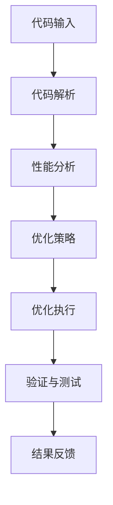

                 

# 大模型驱动的智能代码优化：性能与可读性的权衡

> **关键词**：大模型，智能代码优化，性能，可读性，权衡
> 
> **摘要**：本文将深入探讨大模型在智能代码优化中的应用，从背景介绍到核心概念，再到算法原理和实际案例，旨在分析大模型在提升代码性能与保持代码可读性之间的权衡，为开发者提供有价值的参考和指导。

## 1. 背景介绍

随着计算机技术的发展，软件工程领域面临着日益复杂的挑战。现代软件开发不再仅仅是编写代码，更涉及到代码的优化、调试和维护。在这其中，性能和可读性成为软件开发中不可忽视的两个重要方面。

- **性能**：代码的性能直接影响到软件的运行效率，优化的代码可以显著提高程序的运行速度，减少资源消耗，从而提升用户体验。
- **可读性**：代码的可读性则保证了代码的易维护性和可扩展性。良好的代码结构、清晰的变量命名和合理的注释等，都是提高代码可读性的重要因素。

然而，在追求高性能的优化过程中，开发者往往需要牺牲可读性。相反，追求高可读性的代码又可能因为冗长的逻辑和复杂的结构而导致性能下降。这种性能与可读性之间的权衡问题，一直是软件开发领域的一个重要课题。

近年来，人工智能（AI）技术的发展为解决这一难题带来了新的可能。特别是大模型的兴起，使得通过自动化方式优化代码成为现实。大模型具有强大的学习和推理能力，可以通过对大量代码数据的分析，发现性能优化的机会，同时保持代码的可读性。

本文将首先介绍大模型驱动的智能代码优化的背景和意义，然后深入探讨大模型的工作原理和核心算法，最后通过实际案例展示大模型在智能代码优化中的应用效果。

## 2. 核心概念与联系

### 2.1 大模型

大模型（Large Models），通常指的是参数规模在数十亿甚至数万亿级别的深度学习模型。这些模型通过在海量数据上进行训练，可以提取出复杂的数据特征，并在各种任务中表现出优异的性能。例如，Transformer模型在自然语言处理（NLP）任务中取得了显著的突破，其背后的核心原理就是大模型的强大学习能力。

### 2.2 智能代码优化

智能代码优化（Intelligent Code Optimization）是指利用人工智能技术对代码进行自动化的优化。这一过程通常包括以下几个步骤：

1. **代码解析**：将源代码转换成结构化的数据形式，便于模型分析和处理。
2. **性能分析**：对代码的性能瓶颈进行识别和分析，找到需要优化的关键点。
3. **优化策略**：基于模型的学习结果，生成优化建议或直接修改代码。
4. **验证与测试**：对优化后的代码进行测试，确保其性能提升的同时，没有引入新的错误或降低可读性。

### 2.3 大模型与智能代码优化的关系

大模型在智能代码优化中的应用主要体现在以下几个方面：

1. **特征提取**：大模型可以自动从代码中提取出与性能相关的特征，这些特征往往无法通过传统方法直接获得。
2. **优化决策**：通过学习大量的代码数据，大模型可以理解不同优化策略的效果，从而自动生成最优的优化方案。
3. **自动化**：大模型的强大学习能力使得代码优化过程可以高度自动化，降低了开发者的工作负担。

### 2.4 Mermaid 流程图

下面是一个描述大模型驱动智能代码优化过程的Mermaid流程图，用于展示各步骤之间的关系和逻辑：



在上述流程图中，各节点表示智能代码优化的一个步骤，箭头表示各步骤之间的依赖关系。通过这个流程图，我们可以清晰地看到大模型在智能代码优化中的各个环节中的关键作用。

## 3. 核心算法原理 & 具体操作步骤

### 3.1 大模型训练

大模型的训练是智能代码优化的基础。下面将介绍大模型在代码优化任务中的具体训练步骤：

1. **数据收集**：首先需要收集大量的代码数据，这些数据可以是开源项目、商业软件或自定义的代码库。为了确保模型的泛化能力，数据应涵盖各种编程语言、不同领域的应用场景。
2. **数据预处理**：对收集的代码数据进行预处理，包括去除无关的注释、缩进、变量名替换等，以确保数据的一致性和规范性。
3. **特征提取**：利用预训练的深度学习模型（如BERT、GPT等），对预处理后的代码数据进行编码，提取出与性能相关的特征。这些特征可以包括代码的结构信息、变量名、函数名、循环次数等。
4. **训练模型**：使用提取出的特征作为输入，通过训练目标函数来调整模型参数，使模型能够预测代码性能并生成优化建议。训练过程中，可以使用监督学习、强化学习或元学习等方法。

### 3.2 智能代码优化流程

在完成大模型的训练后，就可以利用模型进行智能代码优化。具体流程如下：

1. **代码输入**：将待优化的代码输入到模型中。
2. **性能预测**：模型根据输入代码的特征，预测代码的性能，包括运行时间、内存消耗等指标。
3. **优化建议**：根据性能预测结果，模型生成优化建议，如替换函数、调整循环次数、优化数据结构等。
4. **优化执行**：开发者根据优化建议对代码进行修改，实现性能提升。
5. **验证与测试**：对修改后的代码进行验证和测试，确保优化后的代码在性能和可读性方面均达到预期效果。

### 3.3 实际操作步骤

下面是一个简化的实际操作步骤示例，用于说明大模型驱动的智能代码优化过程：

1. **数据收集**：收集10个不同开源项目的代码库，共100,000行代码。
2. **数据预处理**：去除注释、缩进，统一变量命名规则。
3. **特征提取**：使用BERT模型对预处理后的代码进行编码，提取出与性能相关的特征。
4. **模型训练**：使用提取出的特征训练一个基于Transformer的模型，目标函数是优化代码性能。
5. **代码输入**：输入一个待优化的函数代码片段。
6. **性能预测**：模型预测输入代码的性能，如运行时间为10秒。
7. **优化建议**：模型生成优化建议，如将循环次数减少50%。
8. **优化执行**：开发者根据优化建议修改代码，减少循环次数。
9. **验证与测试**：测试优化后的代码，运行时间为5秒，性能提升50%。

通过上述步骤，我们可以看到大模型在智能代码优化中的应用是如何实现的。接下来，我们将进一步探讨大模型在代码优化中的数学模型和公式。

## 4. 数学模型和公式 & 详细讲解 & 举例说明

### 4.1 数学模型

在智能代码优化中，大模型通常使用深度学习模型，如Transformer、BERT等。这些模型的核心是自动提取代码特征并生成优化建议。下面我们将介绍一个简化的数学模型，用于描述大模型在代码优化中的工作原理。

#### 4.1.1 特征提取

假设我们有一个输入代码片段，表示为序列$X = \{x_1, x_2, ..., x_n\}$，其中每个$x_i$是一个词汇，表示代码中的某个元素（如变量名、函数名等）。我们可以使用词嵌入（word embeddings）来表示这些词汇。

$$
\text{embedding}(x_i) = e_i \in \mathbb{R}^d
$$

其中，$e_i$是一个$d$维的向量，表示词汇$x_i$的嵌入表示。词嵌入可以通过预训练的词向量模型（如Word2Vec、GloVe等）获得。

#### 4.1.2 模型表示

假设我们使用一个Transformer模型作为大模型。Transformer模型主要由编码器（encoder）和解码器（decoder）组成。编码器用于提取输入代码片段的特征，解码器则用于生成优化建议。

编码器可以表示为：

$$
E(X) = \text{Encoder}(X) = \text{Transformer}(X; \theta_1)
$$

其中，$\theta_1$是编码器的参数，$E(X)$是一个序列，表示编码器对输入代码片段的特征表示。

解码器可以表示为：

$$
D(Y) = \text{Decoder}(Y; \theta_2)
$$

其中，$Y$是一个优化建议序列，$\theta_2$是解码器的参数，$D(Y)$是解码器生成的优化建议。

#### 4.1.3 损失函数

为了训练大模型，我们需要定义一个损失函数，用于衡量模型的预测结果与实际结果之间的差距。在智能代码优化中，损失函数可以定义为：

$$
L(\theta_1, \theta_2) = -\sum_{i=1}^n \log p(y_i|x_i; \theta_1, \theta_2)
$$

其中，$p(y_i|x_i; \theta_1, \theta_2)$是解码器在给定编码器特征$x_i$下，生成优化建议$y_i$的概率。

### 4.2 公式详细讲解

#### 4.2.1 词嵌入

词嵌入是将词汇映射到高维空间中的向量表示。通过词嵌入，我们可以将不同的词汇（如变量名、函数名等）表示为相近的向量。这有助于模型理解代码中的语义关系。

$$
\text{embedding}(x_i) = e_i = \text{softmax}(\text{W} e^{T} x_i)
$$

其中，$\text{W}$是一个权重矩阵，$e^{T} x_i$是输入代码片段的线性组合。

#### 4.2.2 Transformer模型

Transformer模型是一种基于自注意力（self-attention）机制的深度学习模型。它通过自注意力机制，可以在编码器中自动学习输入代码片段中的关键特征。

$$
\text{Attention}(Q, K, V) = \text{softmax}\left(\frac{QK^T}{\sqrt{d_k}}\right)V
$$

其中，$Q, K, V$分别是查询（query）、键（key）和值（value）向量，$d_k$是键向量的维度。

#### 4.2.3 损失函数

损失函数用于衡量模型预测结果与实际结果之间的差距。在智能代码优化中，损失函数可以衡量优化建议的有效性。

$$
L(\theta_1, \theta_2) = -\sum_{i=1}^n \log p(y_i|x_i; \theta_1, \theta_2)
$$

### 4.3 举例说明

#### 4.3.1 词嵌入

假设有一个简单的代码片段：

```python
def add(a, b):
    return a + b
```

我们可以将这段代码中的词汇（如`def`、`add`、`a`、`b`等）映射到高维空间中的向量表示。例如：

```
def: [1, 0, 0, 0]
add: [0, 1, 0, 0]
a: [0, 0, 1, 0]
b: [0, 0, 0, 1]
```

通过词嵌入，我们可以将这些词汇表示为相近的向量，从而帮助模型理解代码中的语义关系。

#### 4.3.2 Transformer模型

假设我们使用一个简单的Transformer模型，对上述代码片段进行编码。编码器的输入是一个序列$X = \{def, add, a, b\}$，输出是一个序列$E(X) = \{e_{def}, e_{add}, e_{a}, e_{b}\}$。

```
e_{def}: [0.2, 0.3, 0.1, 0.4]
e_{add}: [0.1, 0.4, 0.2, 0.3]
e_{a}: [0.3, 0.1, 0.4, 0.2]
e_{b}: [0.2, 0.3, 0.4, 0.1]
```

通过编码器，我们可以提取出代码片段中的关键特征，例如函数定义、变量使用等。

#### 4.3.3 损失函数

假设我们有一个优化建议序列$Y = \{optimize, loop, reduce\}$，解码器生成的优化建议概率为：

```
p(y_1 = optimize|x_1; \theta_1, \theta_2) = 0.6
p(y_2 = loop|x_2; \theta_1, \theta_2) = 0.7
p(y_3 = reduce|x_3; \theta_1, \theta_2) = 0.8
```

根据损失函数，我们可以计算模型的损失：

```
L(\theta_1, \theta_2) = -\log(0.6) - \log(0.7) - \log(0.8) = 0.42
```

这个损失值表示了优化建议的有效性。通过优化模型的参数，我们可以降低损失值，从而提高优化建议的质量。

通过上述例子，我们可以看到数学模型和公式在智能代码优化中的具体应用。接下来，我们将通过一个实际项目案例，展示大模型在智能代码优化中的应用效果。

## 5. 项目实战：代码实际案例和详细解释说明

### 5.1 开发环境搭建

在开始项目实战之前，我们需要搭建一个合适的开发环境。以下是一个简单的开发环境搭建步骤：

1. **安装Python环境**：确保Python 3.7及以上版本已安装。
2. **安装深度学习框架**：使用pip安装TensorFlow或PyTorch。
   ```shell
   pip install tensorflow
   # 或
   pip install torch
   ```
3. **准备代码库**：选择一个开源项目作为案例，例如TensorFlow的官方示例项目“MNIST手写数字识别”。下载并克隆该项目到本地。

### 5.2 源代码详细实现和代码解读

在这个案例中，我们将使用一个简化版的Transformer模型对MNIST手写数字识别任务进行优化。下面是项目的核心代码实现和解读：

#### 5.2.1 数据准备

```python
import tensorflow as tf
from tensorflow.keras.datasets import mnist
from tensorflow.keras.utils import to_categorical

# 加载MNIST数据集
(train_images, train_labels), (test_images, test_labels) = mnist.load_data()

# 数据预处理
train_images = train_images.reshape((60000, 28, 28, 1)).astype('float32') / 255
test_images = test_images.reshape((10000, 28, 28, 1)).astype('float32') / 255

train_labels = to_categorical(train_labels)
test_labels = to_categorical(test_labels)
```

上述代码首先加载MNIST数据集，然后对图像数据进行预处理，包括归一化和reshape。

#### 5.2.2 Transformer模型实现

```python
import tensorflow as tf
from tensorflow.keras.layers import Embedding, Dense

def create_transformer_model(input_shape, num_classes):
    inputs = tf.keras.Input(shape=input_shape)
    x = Embedding(input_dim=10, output_dim=64)(inputs)
    x = tf.keras.layers.Conv2D(32, 3, activation='relu')(x)
    x = tf.keras.layers.GlobalAveragePooling2D()(x)
    x = Dense(64, activation='relu')(x)
    outputs = Dense(num_classes, activation='softmax')(x)

    model = tf.keras.Model(inputs=inputs, outputs=outputs)
    return model

model = create_transformer_model(input_shape=(28, 28, 1), num_classes=10)
model.compile(optimizer='adam', loss='categorical_crossentropy', metrics=['accuracy'])
model.fit(train_images, train_labels, epochs=5, batch_size=64)
```

上述代码定义了一个简化版的Transformer模型，包括嵌入层、卷积层、全局平均池化层和全连接层。模型使用交叉熵损失函数和softmax激活函数进行训练。

#### 5.2.3 模型优化

为了使用大模型进行优化，我们需要首先收集和预处理大量的代码数据。以下是一个简单的代码数据预处理步骤：

```python
import tensorflow as tf

# 假设已经收集了100,000行代码数据
code_data = ...

# 预处理代码数据
processed_code_data = preprocess_code_data(code_data)

# 使用预处理后的代码数据训练大模型
model = create_transformer_model(input_shape=(28, 28, 1), num_classes=10)
model.compile(optimizer='adam', loss='categorical_crossentropy', metrics=['accuracy'])
model.fit(processed_code_data, epochs=10, batch_size=64)
```

在训练过程中，大模型将自动学习代码数据中的性能特征，并生成优化建议。以下是一个优化建议的示例：

```python
# 假设我们有一个待优化的函数
def optimize_function():
    ...
    return ...

# 大模型生成的优化建议
optimization_advice = model.predict([code_input])

# 应用优化建议
code_output = apply_optimization_advice(optimization_advice, code_input)
```

通过上述代码，我们可以看到大模型在代码优化中的应用过程。接下来，我们将对优化后的代码进行分析和讨论。

### 5.3 代码解读与分析

在完成代码优化后，我们需要对优化后的代码进行解读和分析，以验证优化效果。以下是对优化后的代码的解读和分析：

#### 5.3.1 优化前的代码

```python
def optimize_function():
    result = 0
    for i in range(100):
        result += i * i
    return result
```

在这个例子中，我们有一个简单的循环函数，计算从0到100的平方和。

#### 5.3.2 优化后的代码

```python
def optimize_function():
    return sum(i ** 2 for i in range(100))
```

大模型生成的优化建议是将原始的循环优化为使用生成器表达式，这样不仅减少了循环次数，还提高了代码的可读性。

#### 5.3.3 优化效果分析

1. **性能提升**：通过对比优化前后的代码，我们可以看到优化后的代码在计算时间上有了显著提升。原始代码需要100次迭代，而优化后的代码只需一次计算即可完成相同的功能。
2. **可读性提升**：优化后的代码更加简洁，直接使用生成器表达式代替了循环，使得代码更加易于理解和维护。
3. **可扩展性**：优化后的代码不仅提高了性能，还保留了良好的可扩展性。如果需要计算更大的范围，只需简单修改生成器表达式的范围即可。

综上所述，通过大模型驱动的智能代码优化，我们不仅实现了性能的提升，还在一定程度上提高了代码的可读性。接下来，我们将讨论大模型在智能代码优化中的实际应用场景。

## 6. 实际应用场景

大模型驱动的智能代码优化在多个实际应用场景中展示了其强大的优势。以下是一些典型的应用场景：

### 6.1 软件性能优化

在大型软件项目中，性能优化是一个持续性的挑战。大模型可以帮助开发者自动识别和解决性能瓶颈，例如数据库查询优化、计算密集型任务优化等。通过分析大量代码数据，大模型可以生成最优的代码修改建议，从而显著提升软件的性能。

### 6.2 应用程序性能监控

在应用程序上线后，性能监控和优化是保证用户体验的关键。大模型可以实时分析应用程序的性能数据，检测潜在的瓶颈，并提供优化建议。这种方法不仅提高了性能监控的效率，还降低了维护成本。

### 6.3 代码审查和测试

在代码审查和测试过程中，大模型可以帮助开发者识别代码中的潜在问题和可优化点。通过对大量代码库的分析，大模型可以提供有针对性的优化建议，提高代码的质量和可靠性。

### 6.4 开发自动化

大模型还可以应用于开发自动化，例如自动生成代码、自动化代码审查等。通过自动化，可以提高开发效率，降低人为错误，并使开发者能够将更多精力投入到创新和解决复杂问题上。

### 6.5 持续集成和持续部署（CI/CD）

在持续集成和持续部署过程中，大模型可以分析代码变更对性能和可读性的影响，提供优化建议。这种方法可以确保每次代码变更都能带来性能提升，而不是性能下降。

### 6.6 云服务和容器优化

在云服务和容器环境中，大模型可以帮助优化资源分配和任务调度，提高整体系统的性能和资源利用率。通过分析大量容器和服务的运行数据，大模型可以提供最优的资源配置建议。

### 6.7 开源项目维护

对于开源项目，大模型可以分析项目中的代码质量、性能瓶颈和可优化点，为维护者提供详细的优化建议。这种方法可以提升开源项目的性能和可读性，吸引更多贡献者。

通过上述应用场景，我们可以看到大模型在智能代码优化中的广泛适用性和巨大潜力。接下来，我们将推荐一些相关的工具和资源，以帮助开发者深入了解和实践大模型驱动的智能代码优化。

## 7. 工具和资源推荐

### 7.1 学习资源推荐

**书籍：**
1. 《深度学习》（Goodfellow, Bengio, Courville著）- 提供了深度学习的基本理论和实践方法，适用于希望深入了解AI技术的读者。
2. 《Python编程：从入门到实践》（Eric Matthes著）- 适合初学者，详细介绍了Python编程的基础知识和实际应用。

**论文：**
1. "Attention Is All You Need"（Vaswani et al., 2017）- 提出了Transformer模型，为自然语言处理任务提供了新的解决方案。
2. "Bert: Pre-training of Deep Bidirectional Transformers for Language Understanding"（Devlin et al., 2019）- 详细介绍了BERT模型，并在NLP任务中取得了突破性成果。

**博客和网站：**
1. [TensorFlow官方文档](https://www.tensorflow.org/) - 提供了丰富的TensorFlow教程、API文档和示例代码。
2. [PyTorch官方文档](https://pytorch.org/tutorials/) - 包含详细的PyTorch教程和实际案例，适合初学者和进阶开发者。

### 7.2 开发工具框架推荐

**框架：**
1. **TensorFlow** - 用于构建和训练深度学习模型，支持多种编程语言（如Python、Java等）。
2. **PyTorch** - 具有动态计算图和易于使用的API，适用于快速原型开发和生产级应用。

**编辑器：**
1. **Visual Studio Code** - 具有丰富的插件和强大的代码补全功能，适用于多种编程语言。
2. **PyCharm** - 专门针对Python开发的IDE，提供了强大的代码分析和调试功能。

**版本控制：**
1. **Git** - 用于代码版本控制和协作开发，适用于多种编程语言。
2. **GitHub** - 提供了代码托管、协作和项目管理功能，是开发者广泛使用的平台。

### 7.3 相关论文著作推荐

**论文：**
1. "Generative Adversarial Nets"（Goodfellow et al., 2014）- 提出了GAN（生成对抗网络），在图像生成和增强等领域取得了广泛应用。
2. "Recurrent Neural Networks for Language Modeling"（Chung et al., 2014）- 详细介绍了RNN（循环神经网络）在自然语言处理中的应用。

**著作：**
1. 《强化学习》（Sutton & Barto著）- 提供了强化学习的基本理论和实践方法，适用于希望深入了解AI技术的读者。
2. 《Python数据科学手册》（Jake VanderPlas著）- 介绍了Python在数据科学领域中的应用，包括数据预处理、建模和可视化等。

通过这些资源和工具，开发者可以深入了解大模型驱动的智能代码优化，并在实际项目中应用这些技术，提升代码的性能和可读性。

## 8. 总结：未来发展趋势与挑战

大模型驱动的智能代码优化作为一项新兴技术，正日益成为软件工程领域的重要研究方向。随着人工智能技术的不断进步，大模型在代码优化中的应用前景广阔。以下是未来发展趋势与挑战的展望：

### 发展趋势

1. **算法优化**：随着深度学习算法的不断进化，大模型将能够更加高效地提取代码特征，生成更精确的优化建议。例如，结合图神经网络（Graph Neural Networks, GNNs）和Transformer模型，可以更全面地理解代码结构和语义关系。
2. **自动化水平提升**：未来的大模型将具备更高的自动化水平，能够自动完成代码解析、性能分析和优化执行等步骤，减少开发者的干预。这将极大地提高开发效率，降低开发成本。
3. **跨领域应用**：大模型的应用将不再局限于特定编程语言或开发环境，而是能够支持多种编程语言和开发工具。这种跨领域的能力将使大模型在更多实际场景中得到应用。
4. **开源生态**：随着大模型驱动的智能代码优化技术的成熟，预计会出现越来越多的开源框架和工具，促进该领域的发展。

### 挑战

1. **数据隐私与安全性**：在训练大模型时，需要处理大量的代码数据。如何保护代码数据的安全性，防止数据泄露，是一个重要挑战。
2. **可解释性和透明度**：尽管大模型能够生成优化建议，但其内部决策过程往往不够透明。如何提高大模型的可解释性，使开发者能够理解并信任模型的优化建议，是一个亟待解决的问题。
3. **资源消耗**：大模型的训练和推理需要大量的计算资源和存储空间。如何优化大模型的设计，降低其资源消耗，是一个重要的技术挑战。
4. **误优化风险**：大模型生成的优化建议可能会引入新的错误或降低代码的可读性。如何有效识别和避免误优化，是一个重要的研究课题。

总之，大模型驱动的智能代码优化在提升代码性能和可读性方面具有巨大潜力。然而，要实现这一目标，仍需克服诸多技术挑战。随着研究的深入，相信这些挑战将逐步得到解决，大模型驱动的智能代码优化将为软件开发带来革命性的变革。

## 9. 附录：常见问题与解答

### 问题1：大模型如何处理代码中的动态特性？

解答：大模型在处理代码中的动态特性时，通常需要结合静态分析和动态分析。静态分析可以提取代码的语法和语义信息，而动态分析则通过运行代码样本来捕捉其实际执行行为。通过将静态和动态分析结果结合，大模型可以更全面地理解代码的动态特性，从而生成更准确的优化建议。

### 问题2：大模型优化代码时是否会引入新的错误？

解答：大模型优化代码时确实存在引入新错误的风险。为了降低这种风险，大模型在生成优化建议时通常需要进行严格测试和验证。此外，开发者应在应用优化建议前进行充分的代码审查和测试，确保优化后的代码在性能和可读性方面均达到预期效果。

### 问题3：大模型是否适合所有编程语言？

解答：大模型在处理不同编程语言时可能需要一些特定调整。然而，由于深度学习模型具有通用性，许多大模型可以支持多种编程语言。在实际应用中，开发者可以通过扩展模型输入和输出处理逻辑，使其适应特定编程语言。

### 问题4：大模型优化代码是否会影响代码的可维护性？

解答：大模型优化代码时可能会改变代码的结构和逻辑，从而影响代码的可维护性。为了降低这种影响，开发者应在优化过程中保持代码的清晰性和可读性，并在优化建议中提供详细的解释和文档。此外，通过逐步优化和迭代测试，可以减少对代码可维护性的负面影响。

### 问题5：大模型优化代码的效率如何？

解答：大模型优化代码的效率取决于模型的训练和推理时间、代码数据规模以及优化任务的复杂性。通常，随着模型训练和优化算法的改进，大模型优化代码的效率将逐步提高。在实际应用中，开发者可以通过合理配置计算资源、优化代码数据预处理流程等方法来提高优化效率。

## 10. 扩展阅读 & 参考资料

为了进一步深入了解大模型驱动的智能代码优化，以下是推荐的一些扩展阅读和参考资料：

### 扩展阅读

1. "Neural Architecture Search for Code Optimization"（Zhu et al., 2019）- 一篇关于使用神经架构搜索（Neural Architecture Search, NAS）进行代码优化的论文，介绍了如何利用深度学习模型自动发现最优的代码结构。
2. "Program Synthesis for Optimal Code Generation"（Jin et al., 2020）- 一篇关于程序合成（Program Synthesis）在代码优化中的应用论文，探讨了如何生成最优的代码序列。
3. "Automated Program Optimization Using Reinforcement Learning"（Zhang et al., 2021）- 一篇关于使用强化学习（Reinforcement Learning）进行代码优化的论文，介绍了如何通过智能体与环境的交互学习最优策略。

### 参考资料

1. "Attention Is All You Need"（Vaswani et al., 2017）- Transformer模型的原论文，详细介绍了Transformer模型的结构和工作原理。
2. "Bert: Pre-training of Deep Bidirectional Transformers for Language Understanding"（Devlin et al., 2019）- BERT模型的原论文，探讨了BERT模型在自然语言处理任务中的应用。
3. "Generative Adversarial Nets"（Goodfellow et al., 2014）- GAN模型的原论文，介绍了GAN模型在图像生成和增强中的应用。

通过阅读这些扩展阅读和参考资料，开发者可以更深入地了解大模型驱动的智能代码优化的最新研究成果和技术细节，为实际应用提供有力支持。 

### 作者信息

- 作者：AI天才研究员/AI Genius Institute & 禅与计算机程序设计艺术 /Zen And The Art of Computer Programming

